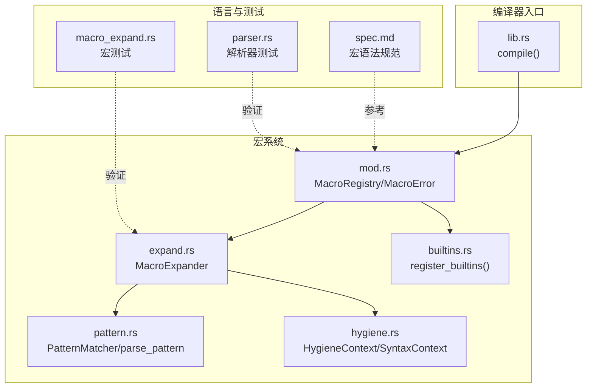
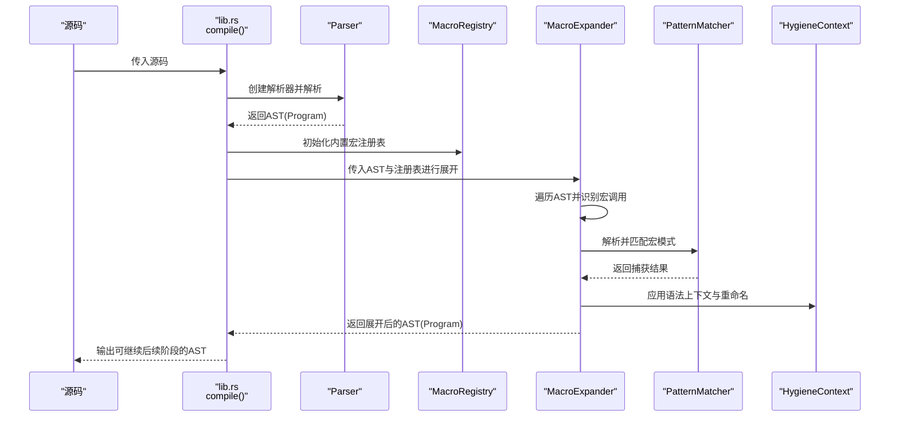
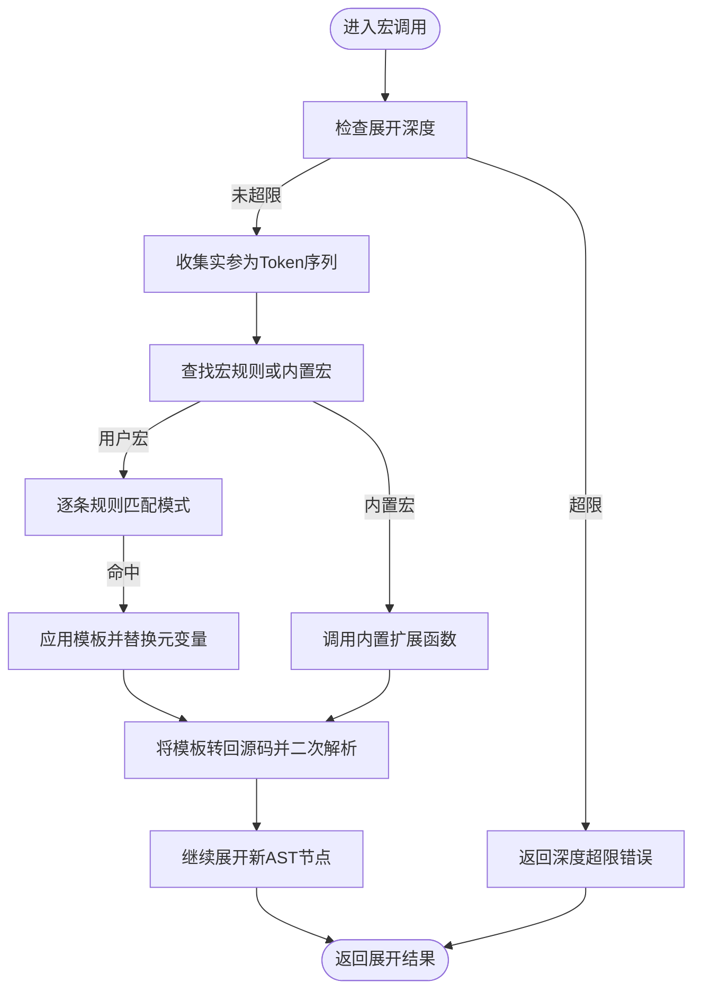
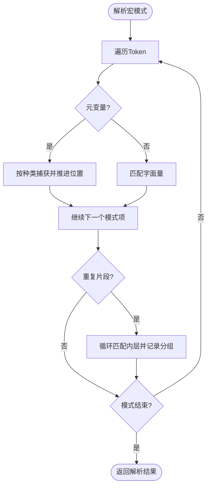
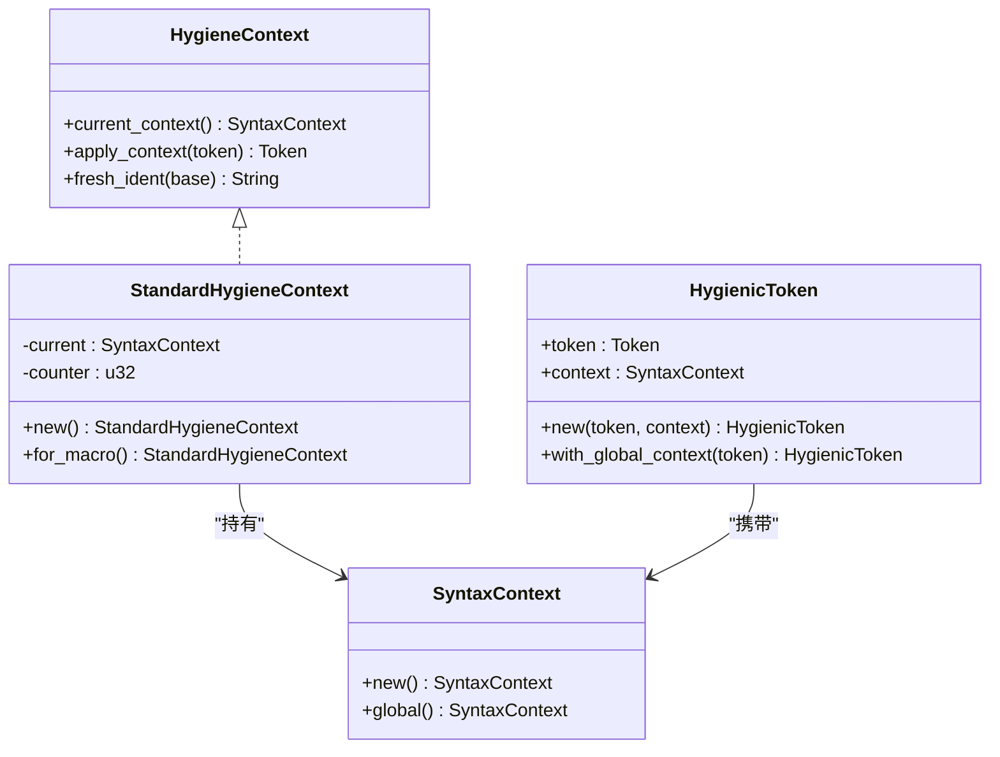
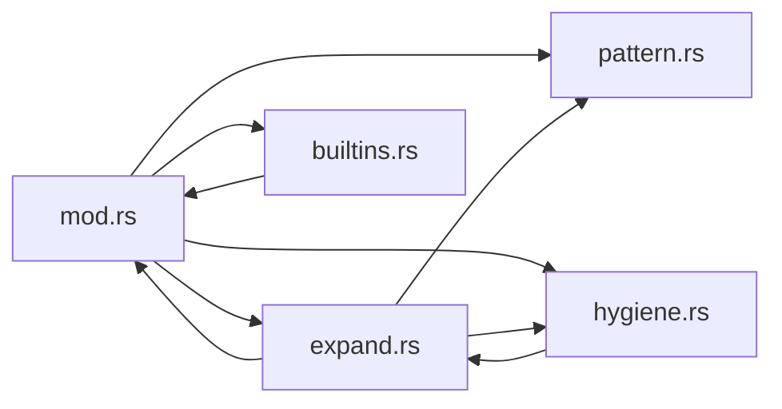

# 宏系统

<cite>
**本文引用的文件**
- [mod.rs](file://crates/ruyic/src/macro_expand/mod.rs)
- [expand.rs](file://crates/ruyic/src/macro_expand/expand.rs)
- [hygiene.rs](file://crates/ruyic/src/macro_expand/hygiene.rs)
- [builtins.rs](file://crates/ruyic/src/macro_expand/builtins.rs)
- [pattern.rs](file://crates/ruyic/src/macro_expand/pattern.rs)
- [lib.rs](file://crates/ruyic/src/lib.rs)
- [spec.md](file://docs/spec.md)
- [macro_expand.rs](file://crates/ruyic/tests/macro_expand.rs)
- [parser.rs](file://crates/ruyic/tests/parser.rs)
</cite>

## 目录
1. [引言](#引言)
2. [项目结构](#项目结构)
3. [核心组件](#核心组件)
4. [架构总览](#架构总览)
5. [详细组件分析](#详细组件分析)
6. [依赖分析](#依赖分析)
7. [性能考虑](#性能考虑)
8. [故障排除指南](#故障排除指南)
9. [结论](#结论)
10. [附录](#附录)

## 引言
本文件系统性地梳理并说明 Ruyi 宏系统的设计与实现，覆盖以下主题：
- 宏的定义语法与声明方式（基于语言规范）
- 宏展开机制与编译时代码生成流程
- 卫生宏与作用域保护（语法上下文、标识符重命名）
- 内置宏的功能与使用方法
- 递归展开与深度限制、错误处理策略
- 宏与普通函数的区别及适用场景
- 宏定义最佳实践与设计原则
- 调试与故障排除技巧
- 常见宏使用模式与代码生成示例
- 宏系统与编译器其他组件（词法、解析、类型检查）的集成关系

## 项目结构
Ruyi 宏系统位于 ruyic 编译器子模块中，核心目录与文件如下：
- crates/ruyic/src/macro_expand：宏注册表、展开器、卫生机制、模式匹配与内置宏
- crates/ruyic/src/lib.rs：编译入口，串联解析与宏展开
- docs/spec.md：语言规范，包含宏声明与语法
- crates/ruyic/tests/macro_expand.rs：宏相关单元测试
- crates/ruyic/tests/parser.rs：解析器对宏声明的测试（当前解析尚未完全支持宏声明）

图表来源
- [lib.rs:12-21](file://crates/ruyic/src/lib.rs#L12-L21)
- [mod.rs:107-161](file://crates/ruyic/src/macro_expand/mod.rs#L107-L161)
- [expand.rs:8-393](file://crates/ruyic/src/macro_expand/expand.rs#L8-L393)
- [pattern.rs:386-525](file://crates/ruyic/src/macro_expand/pattern.rs#L386-L525)
- [hygiene.rs:40-102](file://crates/ruyic/src/macro_expand/hygiene.rs#L40-L102)
- [builtins.rs:5-85](file://crates/ruyic/src/macro_expand/builtins.rs#L5-L85)
- [spec.md:875-925](file://docs/spec.md#L875-L925)
- [macro_expand.rs:29-252](file://crates/ruyic/tests/macro_expand.rs#L29-L252)
- [parser.rs:347-394](file://crates/ruyic/tests/parser.rs#L347-L394)

章节来源
- [lib.rs:12-21](file://crates/ruyic/src/lib.rs#L12-L21)
- [mod.rs:107-161](file://crates/ruyic/src/macro_expand/mod.rs#L107-L161)
- [expand.rs:8-393](file://crates/ruyic/src/macro_expand/expand.rs#L8-L393)
- [pattern.rs:386-525](file://crates/ruyic/src/macro_expand/pattern.rs#L386-L525)
- [hygiene.rs:40-102](file://crates/ruyic/src/macro_expand/hygiene.rs#L40-L102)
- [builtins.rs:5-85](file://crates/ruyic/src/macro_expand/builtins.rs#L5-L85)
- [spec.md:875-925](file://docs/spec.md#L875-L925)
- [macro_expand.rs:29-252](file://crates/ruyic/tests/macro_expand.rs#L29-L252)
- [parser.rs:347-394](file://crates/ruyic/tests/parser.rs#L347-L394)

## 核心组件
- 宏注册表与错误类型
  - 提供用户自定义宏与内置宏的统一注册与查询接口，并定义宏展开期间可能发生的错误类型集合。
- 展开器
  - 遍历 AST，识别宏调用并执行规则匹配与模板替换；负责深度控制、错误传播与二次解析。
- 模式匹配
  - 将宏模式解析为内部结构，支持元变量捕获、重复与分隔符、可选片段等。
- 卫生机制
  - 通过语法上下文与标识符重命名，避免捕获与泄露，确保宏在不同作用域下的行为一致。
- 内置宏
  - 提供常用工具宏，如 todo、unreachable、stringify、file、line、column 等。

章节来源
- [mod.rs:107-161](file://crates/ruyic/src/macro_expand/mod.rs#L107-L161)
- [expand.rs:8-393](file://crates/ruyic/src/macro_expand/expand.rs#L8-L393)
- [pattern.rs:5-106](file://crates/ruyic/src/macro_expand/pattern.rs#L5-L106)
- [hygiene.rs:40-102](file://crates/ruyic/src/macro_expand/hygiene.rs#L40-L102)
- [builtins.rs:5-85](file://crates/ruyic/src/macro_expand/builtins.rs#L5-L85)

## 架构总览
宏系统在编译流程中的位置与交互如下：

图表来源
- [lib.rs:12-21](file://crates/ruyic/src/lib.rs#L12-L21)
- [expand.rs:23-393](file://crates/ruyic/src/macro_expand/expand.rs#L23-L393)
- [pattern.rs:386-525](file://crates/ruyic/src/macro_expand/pattern.rs#L386-L525)
- [hygiene.rs:71-84](file://crates/ruyic/src/macro_expand/hygiene.rs#L71-L84)
- [mod.rs:157-161](file://crates/ruyic/src/macro_expand/mod.rs#L157-L161)

## 详细组件分析

### 宏注册与错误模型
- 注册表
  - 维护用户宏与内置宏映射，提供添加、查询与存在性判断。
- 错误模型
  - 覆盖“无匹配规则”“重复不匹配”“展开深度超限”“非法调用”“卫生违规”“嵌套宏定义”等情形。
- 内置宏
  - 通过注册函数一次性注入若干常用宏，区分是否需要卫生处理。

章节来源
- [mod.rs:107-161](file://crates/ruyic/src/macro_expand/mod.rs#L107-L161)
- [builtins.rs:5-85](file://crates/ruyic/src/macro_expand/builtins.rs#L5-L85)

### 宏展开器与控制流
- 展开入口
  - 对 Program 的每个模块项进行展开，支持声明、语句、导入导出等。
- 宏调用识别
  - 在表达式调用处识别以宏名开头的标识符，且排除某些内置表达式形式。
- 规则匹配与模板应用
  - 若为用户宏，按顺序尝试各规则；若为内置宏，直接调用对应扩展函数。
  - 使用捕获结果替换模板中的元变量，再将结果转回源码并二次解析为 AST，最后继续展开。
- 深度控制
  - 通过最大展开深度常量防止无限递归，超过阈值返回错误。

图表来源
- [expand.rs:304-393](file://crates/ruyic/src/macro_expand/expand.rs#L304-L393)
- [mod.rs:10-10](file://crates/ruyic/src/macro_expand/mod.rs#L10-L10)

章节来源
- [expand.rs:23-393](file://crates/ruyic/src/macro_expand/expand.rs#L23-L393)
- [mod.rs:10-10](file://crates/ruyic/src/macro_expand/mod.rs#L10-L10)

### 模式匹配与元变量捕获
- 模式解析
  - 支持字面量、元变量、重复片段与可选片段；重复支持逗号或分号分隔符与星号/加号/问号三种模式。
- 元变量种类
  - 表达式、语句、模式、类型、标识符、任意等，用于不同上下文的捕获。
- 匹配算法
  - 从输入流头开始尝试匹配，遇到括号/大括号/中括号时维护嵌套深度；遇到分隔符停止；记录捕获内容与重复分组。
- 重复与可选
  - 重复片段允许零次或多次出现，结合分隔符与模式组合，提升宏灵活性。

图表来源
- [pattern.rs:386-525](file://crates/ruyic/src/macro_expand/pattern.rs#L386-L525)
- [pattern.rs:101-384](file://crates/ruyic/src/macro_expand/pattern.rs#L101-L384)

章节来源
- [pattern.rs:5-106](file://crates/ruyic/src/macro_expand/pattern.rs#L5-L106)
- [pattern.rs:101-384](file://crates/ruyic/src/macro_expand/pattern.rs#L101-L384)
- [pattern.rs:386-525](file://crates/ruyic/src/macro_expand/pattern.rs#L386-L525)

### 卫生宏与作用域保护
- 语法上下文
  - 每个宏实例拥有独立的语法上下文，全局上下文用于跨宏共享。
- 标识符重命名
  - 展开时对标识符附加上下文信息，避免捕获外部绑定或泄露内部绑定。
- 兼容性判断
  - 当两个上下文相等或任一为全局时视为兼容，保证宏与宿主代码的互操作。

图表来源
- [hygiene.rs:40-102](file://crates/ruyic/src/macro_expand/hygiene.rs#L40-L102)

章节来源
- [hygiene.rs:40-102](file://crates/ruyic/src/macro_expand/hygiene.rs#L40-L102)

### 内置宏功能与使用
- 已注册的内置宏
  - todo、unreachable、stringify、file、line、column。
- 卫生属性
  - 部分内置宏启用卫生处理，部分不启用，具体取决于其用途与安全性需求。
- 使用示例
  - 参考测试用例与语言规范中的示例，内置宏通常以感叹号结尾的形式调用。

章节来源
- [builtins.rs:5-85](file://crates/ruyic/src/macro_expand/builtins.rs#L5-L85)
- [macro_expand.rs:129-145](file://crates/ruyic/tests/macro_expand.rs#L129-L145)
- [spec.md:908-925](file://docs/spec.md#L908-L925)

### 递归展开与错误处理
- 递归展开
  - 展开器在调用自身时增加深度计数，确保不会无限递归。
- 错误处理
  - 将解析错误转换为宏错误；对未匹配规则、重复不匹配、深度超限、非法调用、卫生违规、嵌套宏定义分别给出明确错误信息。
- 测试验证
  - 单测覆盖了内置宏调用、多规则宏、模式重复、深度上限等场景。

章节来源
- [expand.rs:304-393](file://crates/ruyic/src/macro_expand/expand.rs#L304-L393)
- [mod.rs:13-94](file://crates/ruyic/src/macro_expand/mod.rs#L13-L94)
- [macro_expand.rs:147-252](file://crates/ruyic/tests/macro_expand.rs#L147-L252)

### 宏与普通函数的区别与适用场景
- 执行时机
  - 宏在编译期展开，生成新的源码并参与后续解析与类型检查；普通函数在运行期执行。
- 作用域与安全
  - 宏可访问并影响词法作用域，需通过卫生机制保护；普通函数遵循常规作用域规则。
- 性能与抽象
  - 宏适合生成重复样板代码、条件化拼装、跨平台/平台特定代码生成；普通函数适合逻辑复用与运行时行为。
- 诊断与调试
  - 宏展开后仍可被诊断与类型检查；普通函数有更直观的调用栈与断点支持。

章节来源
- [hygiene.rs:71-84](file://crates/ruyic/src/macro_expand/hygiene.rs#L71-L84)
- [expand.rs:340-371](file://crates/ruyic/src/macro_expand/expand.rs#L340-L371)

### 宏定义最佳实践与设计原则
- 模式设计
  - 明确元变量种类与边界，避免歧义；优先使用重复与分隔符简化多参数场景。
- 卫生与可读性
  - 对易冲突的标识符启用卫生；保持模板简洁，便于阅读与调试。
- 错误与健壮性
  - 为常见调用错误提供清晰提示；限制展开深度，避免极端情况。
- 可测试性
  - 通过单元测试覆盖多规则、嵌套与边界场景；在集成测试中验证端到端行为。

章节来源
- [pattern.rs:386-525](file://crates/ruyic/src/macro_expand/pattern.rs#L386-L525)
- [hygiene.rs:71-84](file://crates/ruyic/src/macro_expand/hygiene.rs#L71-L84)
- [macro_expand.rs:29-252](file://crates/ruyic/tests/macro_expand.rs#L29-L252)

### 宏调试与故障排除
- 常见问题定位
  - 无匹配规则：检查宏名与模式是否一致；确认是否遗漏规则或分隔符。
  - 重复不匹配：核对重复片段的分隔符与模式是否与实参一致。
  - 深度超限：排查是否存在相互依赖或不当递归。
  - 卫生违规：检查是否意外暴露或捕获了不应接触的标识符。
- 调试建议
  - 使用最小可复现样例；逐步减少规则数量；借助内置宏辅助输出中间状态。
  - 关注测试用例中的断言点与错误消息，对照实现细节定位问题。

章节来源
- [mod.rs:13-94](file://crates/ruyic/src/macro_expand/mod.rs#L13-L94)
- [macro_expand.rs:147-252](file://crates/ruyic/tests/macro_expand.rs#L147-L252)

### 常见宏使用模式与代码生成示例
- 条件化输出
  - 使用内置 stringify 辅助打印表达式与其求值结果，便于调试。
- 列表/数组构造
  - 使用重复片段批量生成元素插入或初始化代码。
- 控制流与错误处理
  - 使用 todo/unreachable 宏占位或标记不可达路径，配合类型检查保证正确性。

章节来源
- [builtins.rs:61-84](file://crates/ruyic/src/macro_expand/builtins.rs#L61-L84)
- [spec.md:908-925](file://docs/spec.md#L908-L925)
- [macro_expand.rs:71-125](file://crates/ruyic/tests/macro_expand.rs#L71-L125)

### 宏系统与编译器其他组件的集成
- 与解析器
  - 宏声明目前解析尚不完整，但宏调用在表达式解析后被识别与展开。
- 与类型检查
  - 展开后的 AST 继续参与类型检查，确保宏生成的代码满足类型约束。
- 与代码生成
  - 展开完成的 AST 进入后续代码生成阶段，宏生成的节点与其他节点无异。

章节来源
- [lib.rs:12-21](file://crates/ruyic/src/lib.rs#L12-L21)
- [parser.rs:347-394](file://crates/ruyic/tests/parser.rs#L347-L394)

## 依赖分析
宏系统内部模块之间的依赖关系如下：

图表来源
- [mod.rs:1-4](file://crates/ruyic/src/macro_expand/mod.rs#L1-L4)
- [expand.rs:1-7](file://crates/ruyic/src/macro_expand/expand.rs#L1-L7)
- [pattern.rs:1-3](file://crates/ruyic/src/macro_expand/pattern.rs#L1-L3)
- [hygiene.rs:1](file://crates/ruyic/src/macro_expand/hygiene.rs#L1)
- [builtins.rs:1-3](file://crates/ruyic/src/macro_expand/builtins.rs#L1-L3)

章节来源
- [mod.rs:1-4](file://crates/ruyic/src/macro_expand/mod.rs#L1-L4)
- [expand.rs:1-7](file://crates/ruyic/src/macro_expand/expand.rs#L1-L7)
- [pattern.rs:1-3](file://crates/ruyic/src/macro_expand/pattern.rs#L1-L3)
- [hygiene.rs:1](file://crates/ruyic/src/macro_expand/hygiene.rs#L1)
- [builtins.rs:1-3](file://crates/ruyic/src/macro_expand/builtins.rs#L1-L3)

## 性能考虑
- 展开深度限制
  - 通过最大展开深度常量避免无限递归导致的栈溢出与资源耗尽。
- 模式匹配复杂度
  - 重复与可选片段会增加匹配分支，应尽量简化模式以降低匹配成本。
- 二次解析
  - 模板转回源码并重新解析会产生额外开销，应避免在热路径上频繁展开复杂宏。

章节来源
- [mod.rs:10-10](file://crates/ruyic/src/macro_expand/mod.rs#L10-L10)
- [expand.rs:333-371](file://crates/ruyic/src/macro_expand/expand.rs#L333-L371)

## 故障排除指南
- 无法找到宏
  - 确认宏已注册（用户宏需先声明再调用），内置宏名称拼写正确。
- 模式不匹配
  - 对照语言规范检查分隔符与重复模式；确保实参与捕获范围一致。
- 展开过深
  - 减少递归层级或拆分宏；必要时引入辅助宏以降低单次展开规模。
- 卫生问题
  - 检查是否意外使用了外部同名标识符；必要时改用卫生上下文或重命名标识符。

章节来源
- [mod.rs:13-94](file://crates/ruyic/src/macro_expand/mod.rs#L13-L94)
- [macro_expand.rs:147-252](file://crates/ruyic/tests/macro_expand.rs#L147-L252)

## 结论
Ruyi 宏系统提供了完整的编译时代码生成能力，具备：
- 清晰的宏声明与调用语法（基于语言规范）
- 可靠的展开机制与深度控制
- 卫生宏与作用域保护
- 丰富的内置宏与灵活的模式匹配
- 与解析、类型检查、代码生成的顺畅衔接

建议在实际开发中遵循最佳实践，充分利用内置宏与卫生机制，结合测试与调试手段，构建稳定高效的宏体系。

## 附录
- 语言规范要点（宏声明与语法）
  - 宏声明、规则、模式与体的语法定义与示例。
- 测试用例要点
  - 覆盖宏声明、多规则、内置宏、模式重复、深度上限等关键场景。

章节来源
- [spec.md:875-925](file://docs/spec.md#L875-L925)
- [macro_expand.rs:29-252](file://crates/ruyic/tests/macro_expand.rs#L29-L252)
- [parser.rs:347-394](file://crates/ruyic/tests/parser.rs#L347-L394)