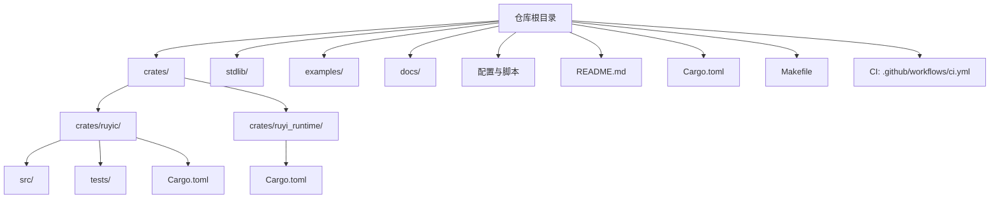
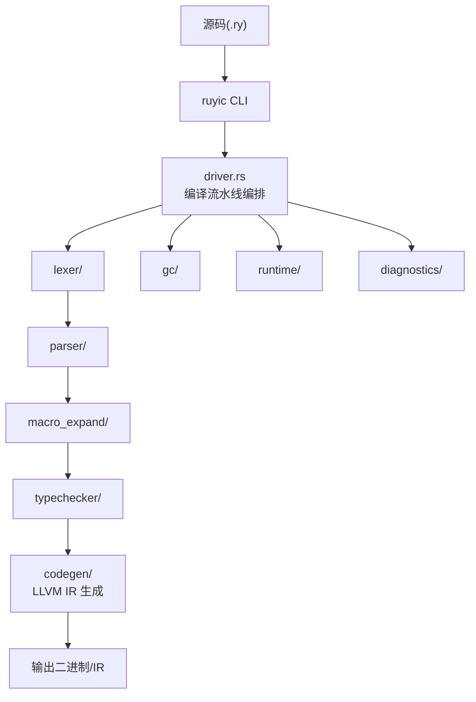
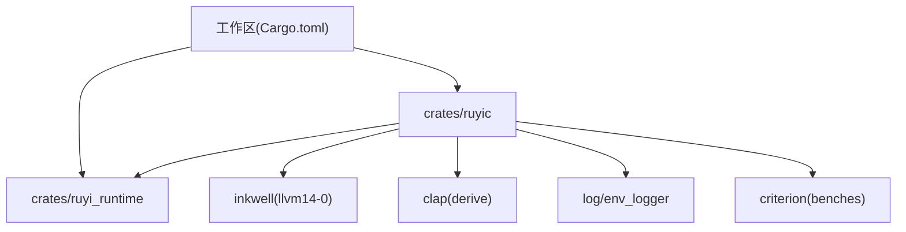

# IDE集成

<cite>
**本文引用的文件**
- [README.md](file://README.md)
- [Cargo.toml](file://Cargo.toml)
- [.github/workflows/ci.yml](file://.github/workflows/ci.yml)
- [Makefile](file://Makefile)
- [AGENTS.md](file://AGENTS.md)
- [rustfmt.toml](file://rustfmt.toml)
- [crates/ruyic/Cargo.toml](file://crates/ruyic/Cargo.toml)
- [crates/ruyi_runtime/Cargo.toml](file://crates/ruyi_runtime/Cargo.toml)
- [crates/ruyic/src/diagnostics/render.rs](file://crates/ruyic/src/diagnostics/render.rs)
- [docs/roadmap-zh.md](file://docs/roadmap-zh.md)
- [examples/run_examples.sh](file://examples/run_examples.sh)
- [stdlib/process.ry](file://stdlib/process.ry)
- [.omo/plans/versioning-rules.md](file://.omo/plans/versioning-rules.md)
</cite>

## 目录
1. [简介](#简介)
2. [项目结构](#项目结构)
3. [核心组件](#核心组件)
4. [架构总览](#架构总览)
5. [详细组件分析](#详细组件分析)
6. [依赖关系分析](#依赖关系分析)
7. [性能考虑](#性能考虑)
8. [故障排查指南](#故障排查指南)
9. [结论](#结论)
10. [附录](#附录)

## 简介
本指南面向在多款主流编辑器与IDE中集成Ruyi语言开发的工程师与作者，围绕以下目标展开：
- 在VS Code、IntelliJ IDEA、Vim/Neovim、Sublime Text、Atom等环境中，给出Ruyi开发环境搭建与配置要点
- 解释如何利用语言服务器协议（LSP）提升编辑体验，以及如何进行自定义配置
- 提供开发工作区模板与项目结构建议，帮助团队建立一致的工程实践
- 说明版本控制工具的集成配置，包括Git hooks与提交消息规范
- 介绍远程开发环境的配置方法，涵盖Docker容器与云开发平台的适配思路

本指南严格基于仓库中的实际文件与配置，避免臆测，确保可落地与可复现。

## 项目结构
Ruyi采用Rust工作区组织，核心由编译器与运行时两部分组成，并配套标准库、示例与文档。整体结构如下：

图表来源
- [README.md:75-99](file://README.md#L75-L99)
- [Cargo.toml:1-40](file://Cargo.toml#L1-L40)
- [crates/ruyic/Cargo.toml:1-26](file://crates/ruyic/Cargo.toml#L1-L26)
- [crates/ruyi_runtime/Cargo.toml:1-17](file://crates/ruyi_runtime/Cargo.toml#L1-L17)

章节来源
- [README.md:75-99](file://README.md#L75-L99)
- [Cargo.toml:1-40](file://Cargo.toml#L1-L40)

## 核心组件
- 编译器（ruyic）：Ruyi语言的命令行编译器，负责从源码到机器码的完整流水线
- 运行时（ruyi_runtime）：提供GC、异步调度、异常处理等运行时能力，可静态/动态链接
- 标准库（stdlib/）：以Ruyi源码实现的标准库，供编译器与示例使用
- 示例（examples/）：展示语言特性与常见用法的示例程序
- 文档（docs/）：语言规范、教程与路线图等权威资料

章节来源
- [README.md:75-99](file://README.md#L75-L99)
- [crates/ruyic/Cargo.toml:1-26](file://crates/ruyic/Cargo.toml#L1-L26)
- [crates/ruyi_runtime/Cargo.toml:1-17](file://crates/ruyi_runtime/Cargo.toml#L1-L17)

## 架构总览
Ruyi的编译与开发流水线如下所示：

图表来源
- [README.md:35-39](file://README.md#L35-L39)
- [crates/ruyic/Cargo.toml:11-17](file://crates/ruyic/Cargo.toml#L11-L17)

章节来源
- [README.md:35-39](file://README.md#L35-L39)

## 详细组件分析

### VS Code 集成
- 语言支持现状
  - 仓库未内置VS Code扩展配置或官方扩展清单，但可通过通用Rust/文本编辑器能力配合Ruyi CLI使用
- 推荐配置
  - 安装扩展：Rust（rust-analyzer）、EditorConfig、Bracket Pair Colorizer、Rainbow CSV、GitLens（可选）
  - 设置：将Ruyi文件关联为普通文本或自定义语言（若无专用语法高亮）
  - 终端：使用Makefile提供的命令进行编译与示例运行
- LSP与诊断
  - 若无专用LSP，可结合rust-analyzer对Ruyi源码的语法与错误报告进行辅助
  - 编译器自带终端诊断渲染，便于在VS Code集成终端中查看

章节来源
- [Makefile:18-23](file://Makefile#L18-L23)
- [Makefile:69-81](file://Makefile#L69-L81)
- [crates/ruyic/src/diagnostics/render.rs:154-170](file://crates/ruyic/src/diagnostics/render.rs#L154-L170)

### IntelliJ IDEA 与 Rust 插件
- 语言支持现状
  - 仓库未提供IDEA特定配置；可借助Rust插件与外部工具链进行开发
- 配置建议
  - 安装Rust插件，启用IntelliJ内置的Rust工具链
  - 在“Settings > Tools > Actions on Save”中启用“Rust: Clippy”和“Rust: Format”
  - 使用Makefile目标作为构建与测试入口
- 运行与调试
  - 通过外部工具配置调用Makefile目标，或直接在IDE集成终端中执行

章节来源
- [Makefile:55-65](file://Makefile#L55-L65)
- [Makefile:43-51](file://Makefile#L43-L51)

### Vim/Neovim 集成
- 语法高亮
  - 仓库未提供专用vim语法文件；可将Ruyi文件类型设为普通文本或使用通用Rust/TypeScript语法高亮作为近似
- LSP 配置
  - 使用通用Rust LSP（如rust-analyzer）进行基本的语义与错误提示
  - 若需更贴近Ruyi的诊断风格，可在终端中直接调用编译器以获得一致的错误输出
- 键盘映射与工作流
  - 建议在Neovim中绑定编译与运行命令，提高迭代效率

章节来源
- [crates/ruyic/src/diagnostics/render.rs:154-170](file://crates/ruyic/src/diagnostics/render.rs#L154-L170)

### Sublime Text 集成
- 语言支持现状
  - 仓库未提供Sublime Text专属语法包；可将.RY文件按文本类型处理
- 建议
  - 使用“PlainTasks”等插件管理示例与任务
  - 通过外部终端执行Makefile目标完成编译与测试

章节来源
- [Makefile:69-81](file://Makefile#L69-L81)

### Atom 集成
- 语言支持现状
  - 仓库未提供Atom专属语法包；可将.RY文件按文本类型处理
- 建议
  - 使用“script”等插件在Atom中运行编译与示例命令
  - 通过“linter”与“language-rust”等插件获得基础LSP与语法高亮

章节来源
- [Makefile:69-81](file://Makefile#L69-L81)

### 语言服务器协议（LSP）与自定义配置
- 当前状态
  - 路线图中规划了LSP（v2）与多种IDE增强功能，表明未来将提供官方LSP支持
- 自定义配置建议
  - 在各编辑器中配置外部命令调用ruyic CLI，以获得与仓库一致的诊断与编译行为
  - 通过终端输出的颜色与结构化信息，结合编辑器的错误面板进行定位

章节来源
- [docs/roadmap-zh.md:245-246](file://docs/roadmap-zh.md#L245-L246)
- [crates/ruyic/src/diagnostics/render.rs:154-170](file://crates/ruyic/src/diagnostics/render.rs#L154-L170)

### 开发工作区模板与项目结构建议
- 仓库结构即模板
  - 建议沿用现有工作区布局：crates/ruyic、crates/ruyi_runtime、stdlib、examples、docs
- 目录与文件组织
  - 将新增的Ruyi源码置于合适目录，遵循“每个模块一个测试文件”的组织方式
  - 示例程序放置于examples/，并使用run_examples.sh进行批量验证
- Makefile目标
  - 使用Makefile提供的统一入口：构建、测试、格式化、Lint、安装等

章节来源
- [README.md:75-99](file://README.md#L75-L99)
- [Makefile:18-23](file://Makefile#L18-L23)
- [Makefile:43-51](file://Makefile#L43-L51)
- [examples/run_examples.sh:1-490](file://examples/run_examples.sh#L1-L490)

### 版本控制工具集成（Git Hooks 与提交消息规范）
- 提交消息规范
  - 采用Conventional Commits格式，类型与范围清晰，便于自动化与审查
- 分支与标签
  - 主分支只接受合并提交；开发分支以dev/vX.Y命名；标签格式为vX.Y.Z，打在main的merge commit上
- CI/CD
  - GitHub Actions在Ubuntu上安装LLVM 14并执行构建与测试
- Git Hooks 建议
  - 在本地钩子中加入“格式化检查”“Lint检查”“测试执行”等步骤，确保提交质量
  - 使用AGENTS.md中的版本切换检查清单作为发布前的强制性核对清单

章节来源
- [AGENTS.md:134-151](file://AGENTS.md#L134-L151)
- [AGENTS.md:153-166](file://AGENTS.md#L153-L166)
- [AGENTS.md:167-175](file://AGENTS.md#L167-L175)
- [AGENTS.md:176-199](file://AGENTS.md#L176-L199)
- [.github/workflows/ci.yml:17-21](file://.github/workflows/ci.yml#L17-L21)
- [.github/workflows/ci.yml:23-26](file://.github/workflows/ci.yml#L23-L26)

### 远程开发环境（Docker 与云开发平台）
- Docker 支持思路
  - 基于CI脚本中的系统依赖安装方式，构建包含LLVM 14与Rust工具链的基础镜像
  - 将仓库代码挂载至容器内，使用Makefile目标完成构建与测试
- 云开发平台
  - 可参考CI配置在云端流水线中复用相同依赖安装与构建步骤
  - 将示例运行与基准测试纳入CI矩阵，确保跨平台一致性

章节来源
- [.github/workflows/ci.yml:17-21](file://.github/workflows/ci.yml#L17-L21)
- [Makefile:18-23](file://Makefile#L18-L23)

## 依赖关系分析
Ruyi工作区的依赖与特性如下：

图表来源
- [Cargo.toml:14-27](file://Cargo.toml#L14-L27)
- [crates/ruyic/Cargo.toml:19-26](file://crates/ruyic/Cargo.toml#L19-L26)
- [crates/ruyi_runtime/Cargo.toml:11-16](file://crates/ruyi_runtime/Cargo.toml#L11-L16)

章节来源
- [Cargo.toml:14-27](file://Cargo.toml#L14-L27)
- [crates/ruyic/Cargo.toml:19-26](file://crates/ruyic/Cargo.toml#L19-L26)
- [crates/ruyi_runtime/Cargo.toml:11-16](file://crates/ruyi_runtime/Cargo.toml#L11-L16)

## 性能考虑
- 编译优化与链接
  - Release配置启用LTO与单代码单元，适合最终产物
  - 开发阶段使用Debug配置，提升迭代速度
- 代码质量与格式化
  - rustfmt配置统一缩进、行长与换行风格，减少视觉噪声
  - clippy作为默认警告策略，确保零警告原则
- 示例与基准
  - 使用run_examples.sh进行示例编译与运行，结合基准测试框架(criterion)评估性能回归

章节来源
- [Cargo.toml:33-40](file://Cargo.toml#L33-L40)
- [rustfmt.toml:1-5](file://rustfmt.toml#L1-L5)
- [Makefile:55-65](file://Makefile#L55-L65)
- [examples/run_examples.sh:1-490](file://examples/run_examples.sh#L1-L490)

## 故障排查指南
- 编译失败（LLVM相关）
  - 确认系统已安装LLVM 14，并正确设置LLVM_SYS_140_PREFIX
  - 无LLVM环境时，可仅检查运行时模块以跳过LLVM绑定
- 诊断输出与颜色
  - 诊断渲染支持自动检测终端颜色能力，必要时可调整颜色方案
- 示例运行失败
  - 使用run_examples.sh的验证/更新模式，对比期望输出，定位差异
- 版本切换与发布
  - 严格遵循AGENTS.md中的版本切换检查清单，确保发布前的完整性

章节来源
- [README.md:26-32](file://README.md#L26-L32)
- [AGENTS.md:201-214](file://AGENTS.md#L201-L214)
- [crates/ruyic/src/diagnostics/render.rs:154-170](file://crates/ruyic/src/diagnostics/render.rs#L154-L170)
- [examples/run_examples.sh:361-446](file://examples/run_examples.sh#L361-L446)
- [AGENTS.md:134-151](file://AGENTS.md#L134-L151)

## 结论
- Ruyi当前以Rust工作区与CLI为核心，IDE集成主要依赖通用编辑器能力与Makefile工作流
- 路线图明确了LSP、调试器、REPL与IDE增强的演进方向，未来将提供更完善的编辑器支持
- 建议团队在现有基础上完善本地Git钩子与CI流程，确保发布质量与一致性

## 附录
- 关键命令速查
  - 构建：make build-release / make build-debug / make build-runtime
  - 测试：make test / make test-single TEST=...
  - 格式化与Lint：make fmt / make fmt-check / make lint / make lint-fix
  - 示例：make run-example EXAMPLE=... / make compile-example EXAMPLE=... / make compile-file FILE=...
  - 清理：make clean / make clean-examples
- 版本管理与发布
  - 遵循AGENTS.md的版本切换检查清单与发布流程
  - 使用Conventional Commits撰写提交消息，分支与标签规范见AGENTS.md

章节来源
- [Makefile:18-23](file://Makefile#L18-L23)
- [Makefile:43-51](file://Makefile#L43-L51)
- [Makefile:55-65](file://Makefile#L55-L65)
- [Makefile:69-81](file://Makefile#L69-L81)
- [Makefile:107-114](file://Makefile#L107-L114)
- [AGENTS.md:134-151](file://AGENTS.md#L134-L151)
- [AGENTS.md:167-175](file://AGENTS.md#L167-L175)
- [AGENTS.md:176-199](file://AGENTS.md#L176-L199)