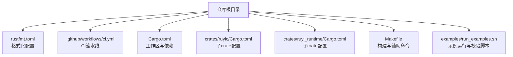
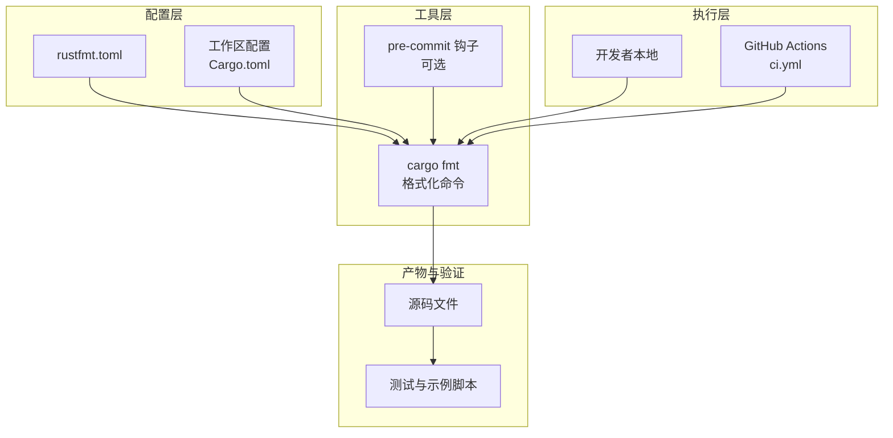
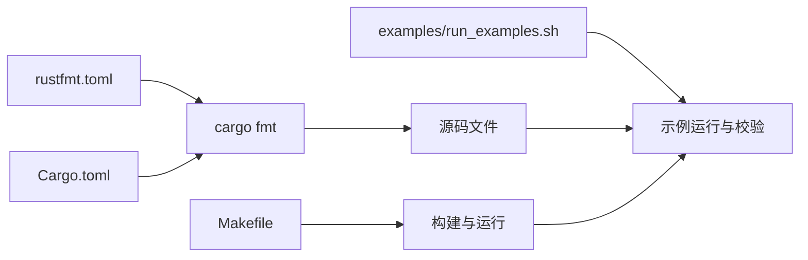

# 代码格式化

<cite>
**本文引用的文件**
- [rustfmt.toml](file://rustfmt.toml)
- [.github/workflows/ci.yml](file://ci.yml)
- [Cargo.toml](file://Cargo.toml)
- [crates/ruyic/Cargo.toml](file://crates/ruyic/Cargo.toml)
- [crates/ruyi_runtime/Cargo.toml](file://crates/ruyi_runtime/Cargo.toml)
- [Makefile](file://Makefile)
- [examples/run_examples.sh](file://examples/run_examples.sh)
- [crates/ruyic/src/lib.rs](file://crates/ruyic/src/lib.rs)
- [crates/ruyi_runtime/src/lib.rs](file://crates/ruyi_runtime/src/lib.rs)
- [crates/ruyic/src/diagnostics/render.rs](file://crates/ruyic/src/diagnostics/render.rs)
- [crates/ruyic/tests/integration/runner.rs](file://crates/ruyic/tests/integration/runner.rs)
</cite>

## 目录
1. [简介](#简介)
2. [项目结构](#项目结构)
3. [核心组件](#核心组件)
4. [架构总览](#架构总览)
5. [详细组件分析](#详细组件分析)
6. [依赖关系分析](#依赖关系分析)
7. [性能考量](#性能考量)
8. [故障排查指南](#故障排查指南)
9. [结论](#结论)
10. [附录](#附录)

## 简介
本指南面向Ruyi项目的开发者，系统性介绍代码格式化工具rustfmt的配置与使用，涵盖以下主题：
- rustfmt配置项与自定义规则（缩进、换行、注释等）
- 在主流IDE（VS Code、IntelliJ IDEA）中的集成方式
- pre-commit钩子与自动化格式化流程
- 团队协作中的格式化标准与一致性保障
- 特殊场景的格式化规则定制与团队约定落地
- 版本管理与升级策略
- 格式化质量检查与CI集成最佳实践

## 项目结构
Ruyi采用多crate工作区组织，格式化配置集中在仓库根目录的rustfmt配置文件中；CI通过GitHub Actions执行构建与测试，但未包含rustfmt格式检查步骤。

图表来源
- [rustfmt.toml](file://rustfmt.toml)
- [.github/workflows/ci.yml](file://ci.yml)
- [Cargo.toml](file://Cargo.toml)
- [crates/ruyic/Cargo.toml](file://crates/ruyic/Cargo.toml)
- [crates/ruyi_runtime/Cargo.toml](file://crates/ruyi_runtime/Cargo.toml)
- [Makefile](file://Makefile)
- [examples/run_examples.sh](file://examples/run_examples.sh)

章节来源
- [rustfmt.toml](file://rustfmt.toml)
- [.github/workflows/ci.yml](file://ci.yml)
- [Cargo.toml](file://Cargo.toml)
- [crates/ruyic/Cargo.toml](file://crates/ruyic/Cargo.toml)
- [crates/ruyi_runtime/Cargo.toml](file://crates/ruyi_runtime/Cargo.toml)
- [Makefile](file://Makefile)
- [examples/run_examples.sh](file://examples/run_examples.sh)

## 核心组件
- 格式化配置文件：仓库根目录的rustfmt配置文件集中定义了最大行长、编辑器版本、制表符宽度、小启发式策略以及换行风格等关键参数。
- 工作区与子crate：工作区统一版本与特性，子crate各自声明依赖与构建目标。
- CI流水线：当前CI负责安装依赖、构建与测试，建议扩展以包含格式化检查。
- 构建与示例脚本：提供编译与运行示例的便捷入口，便于在本地验证格式化后的代码行为。

章节来源
- [rustfmt.toml](file://rustfmt.toml)
- [Cargo.toml](file://Cargo.toml)
- [crates/ruyic/Cargo.toml](file://crates/ruyic/Cargo.toml)
- [crates/ruyi_runtime/Cargo.toml](file://crates/ruyi_runtime/Cargo.toml)
- [.github/workflows/ci.yml](file://ci.yml)
- [Makefile](file://Makefile)
- [examples/run_examples.sh](file://examples/run_examples.sh)

## 架构总览
下图展示Ruyi项目中与“格式化”相关的关键元素及其交互关系。

图表来源
- [rustfmt.toml](file://rustfmt.toml)
- [Cargo.toml](file://Cargo.toml)
- [.github/workflows/ci.yml](file://ci.yml)
- [Makefile](file://Makefile)
- [examples/run_examples.sh](file://examples/run_examples.sh)

## 详细组件分析

### rustfmt配置与参数详解
- 最大行长：控制单行最大字符数，影响断行与续行策略。
- 编辑器版本：统一使用特定版本的格式化语义，确保跨平台一致性。
- 制表符宽度：控制空格缩进宽度，常见值为4。
- 小启发式策略：用于在紧凑与宽松布局之间平衡，适合团队约定。
- 换行风格：统一使用Unix换行风格，避免跨平台差异。

章节来源
- [rustfmt.toml](file://rustfmt.toml)

### IDE集成指南（VS Code、IntelliJ IDEA）

- VS Code
  - 安装Rust扩展（rust-analyzer）以获得语言服务支持。
  - 在设置中启用“Editor: Insert Spaces”和“Editor: Tab Size”与rustfmt配置一致。
  - 推荐安装“rustfmt”扩展或使用内置cargo fmt能力。
  - 可在保存时触发格式化，或通过快捷键手动格式化。

- IntelliJ IDEA / Rust Plugin
  - 安装Rust插件并启用“Rustfmt”格式化器。
  - 在设置中将“Rustfmt”设为默认格式化工具。
  - 保持IDE的缩进与制表符宽度与rustfmt配置一致。

注意：以上为通用集成建议，具体操作请参考各IDE官方文档与插件说明。

### pre-commit钩子与自动化流程
- 在本地仓库安装pre-commit工具。
- 配置钩子以在提交前自动运行cargo fmt，确保提交代码符合格式化规范。
- 若检测到未格式化的文件，可在提交前自动修复或阻止提交，直至通过格式化检查。

注意：本仓库未包含pre-commit配置文件，请根据团队约定自行添加。

### 团队协作中的格式化标准与一致性
- 统一配置：所有开发者共享同一份rustfmt配置，避免因IDE差异导致的格式漂移。
- CI强制检查：在CI中加入格式化检查步骤，失败即阻断合并。
- 文档化约定：将格式化规则写入团队文档，明确缩进、换行、注释等细节。
- 定期评审：定期回顾与优化格式化策略，确保与项目演进匹配。

### 特殊场景的格式化规则定制
- 大型数组/结构体字面量：优先使用垂直布局与适当缩进，提升可读性。
- 注释与文档字符串：遵循团队注释风格，保持一致性。
- 导出模块列表：在库入口处按字母序或功能域排序，便于维护。
- 平台差异：通过换行风格统一规避跨平台差异。

章节来源
- [crates/ruyic/src/lib.rs](file://crates/ruyic/src/lib.rs)
- [crates/ruyi_runtime/src/lib.rs](file://crates/ruyi_runtime/src/lib.rs)

### 版本管理与升级策略
- rustfmt版本：在团队内锁定rustfmt版本，避免不同版本导致的格式差异。
- 升级流程：先在小范围内试运行，再逐步推广至全仓库；升级前后进行一次全量格式化。
- CI联动：在CI中固定rustfmt版本，确保持续集成的一致性。

### 格式化质量检查与CI集成最佳实践
- 在CI中新增“格式化检查”步骤，若发现未格式化文件则标记失败。
- 将格式化检查作为PR的必要条件之一，防止格式漂移进入主干。
- 对于大型仓库，可分模块执行格式化检查，减少CI时间。

章节来源
- [.github/workflows/ci.yml](file://ci.yml)

## 依赖关系分析
- 工作区与子crate：工作区统一版本与特性，子crate各自声明依赖与构建目标，格式化应覆盖所有crate。
- 构建与示例：Makefile与示例脚本用于编译与运行，建议在构建前执行格式化检查，确保产物稳定。

图表来源
- [rustfmt.toml](file://rustfmt.toml)
- [Cargo.toml](file://Cargo.toml)
- [Makefile](file://Makefile)
- [examples/run_examples.sh](file://examples/run_examples.sh)

章节来源
- [Cargo.toml](file://Cargo.toml)
- [Makefile](file://Makefile)
- [examples/run_examples.sh](file://examples/run_examples.sh)

## 性能考量
- 格式化速度：在大型工作区中，一次性格式化所有crate可能耗时较长；可考虑分模块执行或增量格式化。
- CI时间：在CI中并行化构建与测试的同时，增加格式化检查步骤，注意整体流水线时长。
- 本地体验：在IDE中启用保存时格式化，可显著提升开发效率。

## 故障排查指南
- 格式化结果与预期不符
  - 检查rustfmt配置是否与IDE设置一致。
  - 确认使用的rustfmt版本与团队约定一致。
  - 在CI中复现问题，定位具体文件与规则冲突点。

- CI中格式化检查失败
  - 查看CI日志中的格式化输出，定位未通过的文件。
  - 在本地执行cargo fmt --check，修复后再提交。
  - 若为平台差异，统一换行风格与制表符宽度。

- 示例脚本与格式化冲突
  - 示例脚本中对输出进行归一化处理（如换行符替换），避免格式化差异影响测试结果。
  - 在更新期望输出时，确保格式化已应用。

章节来源
- [crates/ruyic/tests/integration/runner.rs](file://crates/ruyic/tests/integration/runner.rs)
- [examples/run_examples.sh](file://examples/run_examples.sh)

## 结论
通过统一的rustfmt配置、IDE集成、pre-commit钩子与CI强制检查，Ruyi项目可以有效保障代码风格一致性与可维护性。建议团队尽快在CI中加入格式化检查，并完善文档与流程，确保新成员快速上手与长期协作顺畅。

## 附录
- 快速检查清单
  - 在IDE中启用与rustfmt一致的缩进与制表符宽度
  - 在本地安装pre-commit钩子，提交前自动格式化
  - 在CI中新增格式化检查步骤
  - 定期审查与更新格式化配置，确保与项目演进匹配