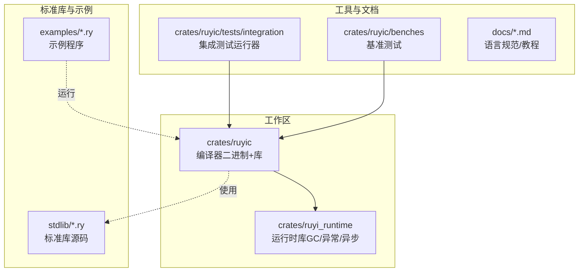
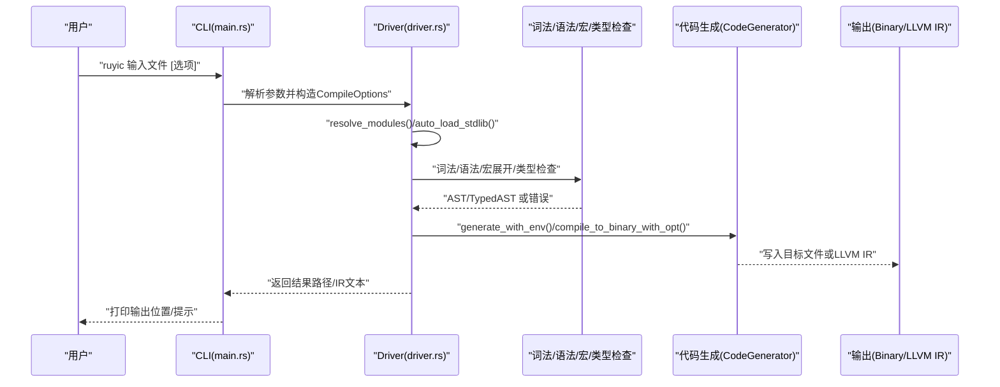
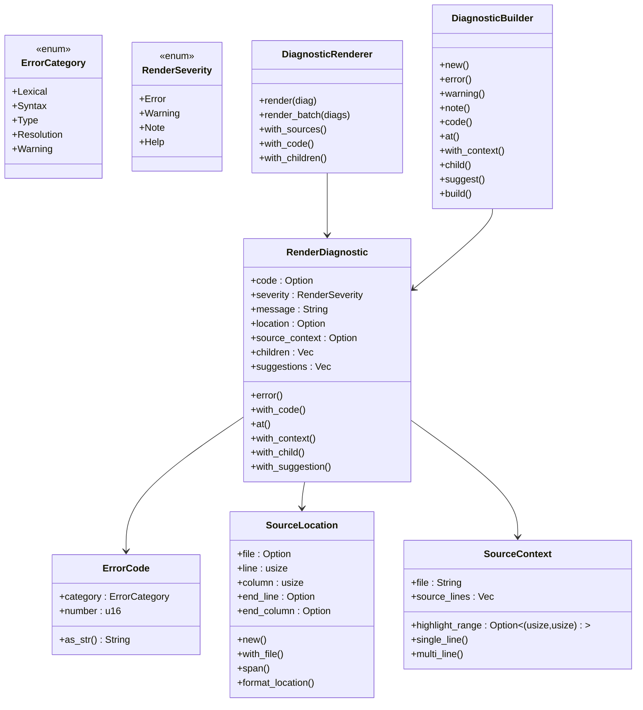
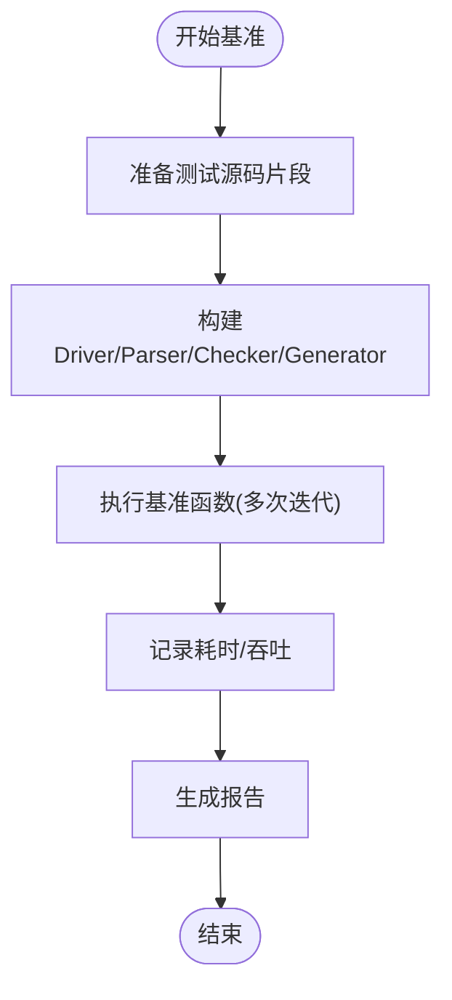
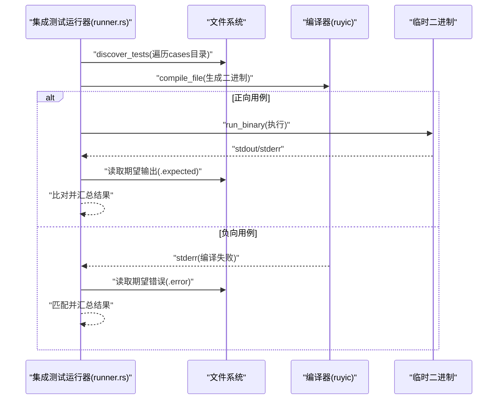
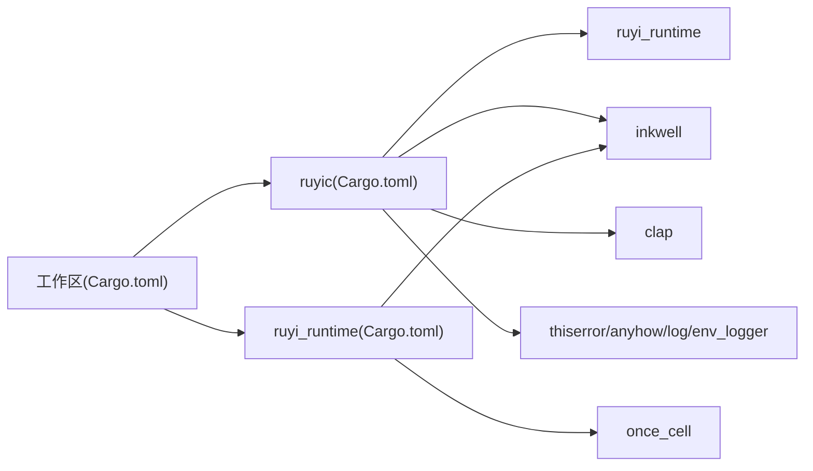

# 开发工具

<cite>
**本文引用的文件**
- [Cargo.toml](file://Cargo.toml)
- [README.md](file://README.md)
- [rustfmt.toml](file://rustfmt.toml)
- [Makefile](file://Makefile)
- [crates/ruyic/Cargo.toml](file://crates/ruyic/Cargo.toml)
- [crates/ruyi_runtime/Cargo.toml](file://crates/ruyi_runtime/Cargo.toml)
- [crates/ruyic/src/diagnostics/mod.rs](file://crates/ruyic/src/diagnostics/mod.rs)
- [crates/ruyic/src/diagnostics/codes.rs](file://crates/ruyic/src/diagnostics/codes.rs)
- [crates/ruyic/src/diagnostics/render.rs](file://crates/ruyic/src/diagnostics/render.rs)
- [crates/ruyic/src/driver.rs](file://crates/ruyic/src/driver.rs)
- [crates/ruyic/src/main.rs](file://crates/ruyic/src/main.rs)
- [.github/workflows/ci.yml](file://.github/workflows/ci.yml)
- [crates/ruyic/tests/integration/runner.rs](file://crates/ruyic/tests/integration/runner.rs)
- [crates/ruyic/benches/main.rs](file://crates/ruyic/benches/main.rs)
- [crates/ruyi_runtime/src/lib.rs](file://crates/ruyi_runtime/src/lib.rs)
- [crates/ruyi_runtime/src/exception.rs](file://crates/ruyi_runtime/src/exception.rs)
- [crates/ruyi_runtime/src/gc.rs](file://crates/ruyi_runtime/src/gc.rs)
</cite>

## 目录
1. [简介](#简介)
2. [项目结构](#项目结构)
3. [核心组件](#核心组件)
4. [架构总览](#架构总览)
5. [详细组件分析](#详细组件分析)
6. [依赖关系分析](#依赖关系分析)
7. [性能考量](#性能考量)
8. [故障排查指南](#故障排查指南)
9. [结论](#结论)
10. [附录](#附录)

## 简介
本指南面向 Ruyi 开发者与贡献者，系统讲解编译器诊断系统、调试与性能分析、代码格式化、IDE 集成、测试框架、CI/自动化构建以及开发环境搭建与版本管理。内容基于仓库中的源码与配置文件进行提炼，帮助你高效地完成从本地开发到持续集成的全流程。

## 项目结构
Ruyi 采用多 crate 工作区组织，核心由编译器二进制与运行时库组成，并配套标准库、示例与测试用例。

图表来源
- [Cargo.toml:1-40](file://Cargo.toml#L1-L40)
- [crates/ruyic/Cargo.toml:1-26](file://crates/ruyic/Cargo.toml#L1-L26)
- [crates/ruyi_runtime/Cargo.toml:1-17](file://crates/ruyi_runtime/Cargo.toml#L1-L17)

章节来源
- [Cargo.toml:1-40](file://Cargo.toml#L1-L40)
- [README.md:75-99](file://README.md#L75-L99)

## 核心组件
- 编译器驱动与流水线：负责从源码到二进制的完整流程，支持中间产物输出（AST/TypedAST/LLVM IR），并可仅做类型检查。
- 诊断系统：统一的错误码体系与渲染器，提供带源码上下文的彩色输出。
- 运行时库：提供 GC、异常处理（零开销 try/catch）、异步调度等能力。
- 测试与基准：集成测试运行器与 Criterion 基准测试，覆盖词法、语法、类型检查与代码生成阶段。
- CI/自动化：GitHub Actions 定义了测试与代码生成测试的流水线。

章节来源
- [crates/ruyic/src/driver.rs:1-744](file://crates/ruyic/src/driver.rs#L1-L744)
- [crates/ruyic/src/diagnostics/mod.rs:1-14](file://crates/ruyic/src/diagnostics/mod.rs#L1-L14)
- [crates/ruyi_runtime/src/lib.rs:1-259](file://crates/ruyi_runtime/src/lib.rs#L1-L259)
- [.github/workflows/ci.yml:1-45](file://.github/workflows/ci.yml#L1-L45)

## 架构总览
下图展示编译器从命令行到最终产物的关键交互：

图表来源
- [crates/ruyic/src/main.rs:46-114](file://crates/ruyic/src/main.rs#L46-L114)
- [crates/ruyic/src/driver.rs:258-632](file://crates/ruyic/src/driver.rs#L258-L632)

## 详细组件分析

### 诊断系统与错误报告机制
- 错误码体系：按类别划分（词法、语法、类型、解析、警告），统一编号格式，便于检索与文档化。
- 渲染器：支持彩色输出、源码上下文高亮、父子诊断、建议信息；可控制是否显示源码与错误码。
- 使用方式：在各阶段产出诊断后，通过渲染器统一输出，便于用户定位问题。

图表来源
- [crates/ruyic/src/diagnostics/codes.rs:17-345](file://crates/ruyic/src/diagnostics/codes.rs#L17-L345)
- [crates/ruyic/src/diagnostics/render.rs:11-421](file://crates/ruyic/src/diagnostics/render.rs#L11-L421)

章节来源
- [crates/ruyic/src/diagnostics/codes.rs:1-345](file://crates/ruyic/src/diagnostics/codes.rs#L1-L345)
- [crates/ruyic/src/diagnostics/render.rs:1-557](file://crates/ruyic/src/diagnostics/render.rs#L1-L557)

### 调试工具与调试符号/GDB 集成
- 调试符号：编译器支持在命令行中启用调试符号（例如通过选项），以便在 GDB 中进行断点、变量查看与堆栈跟踪。
- GDB 集成：生成的二进制可直接由 GDB 加载；结合调试符号，可在函数入口、异常抛出点、GC 根注册等关键位置设置断点，辅助定位运行时行为。
- 异常与栈追踪：运行时提供异常对象与栈帧结构，可用于在 GDB 中打印当前异常类型与调用栈，辅助定位错误来源。

章节来源
- [crates/ruyic/src/main.rs:20-44](file://crates/ruyic/src/main.rs#L20-L44)
- [crates/ruyi_runtime/src/exception.rs:184-229](file://crates/ruyi_runtime/src/exception.rs#L184-L229)

### 代码格式化工具：rustfmt 配置与使用
- 配置项：最大行长、Edition、缩进空格数、启发式策略、换行风格等。
- 使用方式：通过 Makefile 提供一键格式化与检查任务；也可直接使用 cargo fmt 或 cargo fmt -- --check。

章节来源
- [rustfmt.toml:1-5](file://rustfmt.toml#L1-L5)
- [Makefile:55-65](file://Makefile#L55-L65)
- [README.md:116-118](file://README.md#L116-L118)

### IDE 集成与插件推荐
- Rust 生态：建议使用支持 Rust Analyzer 的编辑器（如 VS Code、Vim/Neovim、JetBrains IDEs），以获得语法高亮、跳转、重命名、内联错误提示等能力。
- 语言服务器：Rust Analyzer 可读取工作区配置，自动发现 ruyic 与 ruyi_runtime 的模块边界与依赖。
- 项目打开：在 IDE 中打开根目录，确保识别到 Cargo.toml 工作区与子 crate。

（本节为通用实践说明，不直接分析具体文件）

### 性能分析与基准测试
- 基准测试：使用 Criterion 在多个阶段测量词法扫描、语法解析、类型检查与代码生成的耗时，支持不同输入规模与优化等级对比。
- 使用方式：通过 cargo bench 运行基准；亦可通过 Makefile 的 bench 目标快速执行。

图表来源
- [crates/ruyic/benches/main.rs:142-169](file://crates/ruyic/benches/main.rs#L142-L169)

章节来源
- [crates/ruyic/benches/main.rs:1-344](file://crates/ruyic/benches/main.rs#L1-L344)

### 测试框架：单元测试与集成测试
- 单元测试：各模块内部的单元测试，验证词法、语法、类型检查、宏展开、GC、异常等子系统的行为。
- 集成测试：通过 runner 扫描测试用例目录，自动编译 .ry 并执行，比对期望输出或错误信息，支持正向与负向用例。
- 运行方式：cargo test；Makefile 提供 test 与 test-single 目标；CI 中包含测试与代码生成测试。

图表来源
- [crates/ruyic/tests/integration/runner.rs:31-316](file://crates/ruyic/tests/integration/runner.rs#L31-L316)

章节来源
- [crates/ruyic/tests/integration/runner.rs:1-385](file://crates/ruyic/tests/integration/runner.rs#L1-L385)

### 持续集成与自动化构建
- 触发条件：分支推送与拉取请求。
- 步骤：安装 LLVM 14 开发包，设置 LLVM_SYS_140_PREFIX，构建工作区并运行测试；另有一个独立的代码生成测试作业。
- 环境变量：CI 中强制彩色输出，便于日志阅读。

章节来源
- [.github/workflows/ci.yml:1-45](file://.github/workflows/ci.yml#L1-L45)

### 开发环境搭建与工具链版本管理
- 前置要求：Rust（2021 edition）、LLVM 14（macOS/Linux 分别通过包管理器或 Homebrew 安装）。
- 构建与运行：使用 cargo build/build --release；Makefile 提供 build-debug/build-release/install 等便捷目标。
- 运行示例：Makefile 提供 run-example/compile-example/compile-file 等目标，便于快速验证。

章节来源
- [README.md:26-56](file://README.md#L26-L56)
- [Makefile:18-104](file://Makefile#L18-L104)

## 依赖关系分析
- 工作区依赖：inkwell（绑定 LLVM 14-18）、clap（命令行解析）、thiserror/anyhow（错误处理）、log/env_logger（日志）、criterion（基准）。
- ruyic 依赖：ruyi_runtime、inkwell、clap、thiserror、anyhow、log、env_logger。
- ruyi_runtime 依赖：once_cell；默认启用 inkwell 特性用于类型映射与 LLVM 上下文封装。

图表来源
- [Cargo.toml:14-40](file://Cargo.toml#L14-L40)
- [crates/ruyic/Cargo.toml:19-26](file://crates/ruyic/Cargo.toml#L19-L26)
- [crates/ruyi_runtime/Cargo.toml:11-16](file://crates/ruyi_runtime/Cargo.toml#L11-L16)

章节来源
- [Cargo.toml:14-40](file://Cargo.toml#L14-L40)
- [crates/ruyic/Cargo.toml:19-26](file://crates/ruyic/Cargo.toml#L19-L26)
- [crates/ruyi_runtime/Cargo.toml:11-16](file://crates/ruyi_runtime/Cargo.toml#L11-L16)

## 性能考量
- 优化等级：支持 O0/O1/O2，Release 配置默认开启 LTO 与单代码生成单元，适合发布构建。
- 基准维度：覆盖词法、语法、类型检查与代码生成阶段，便于定位瓶颈。
- 建议：在开发阶段优先 O0 快速迭代，发布前切换至 O2 并启用 LTO；针对热点路径结合基准结果进行针对性优化。

章节来源
- [Cargo.toml:33-40](file://Cargo.toml#L33-L40)
- [crates/ruyic/benches/main.rs:171-343](file://crates/ruyic/benches/main.rs#L171-L343)

## 故障排查指南
- 诊断输出：当类型检查失败时，编译器会输出带源码上下文与建议的诊断信息，优先根据错误码与位置修复。
- 集成测试失败：检查 .expected 与 .error 文件是否匹配，确认编译成功且运行时输出符合预期。
- CI 失败：关注 LLVM 14 相关依赖是否正确安装，以及环境变量 LLVM_SYS_140_PREFIX 是否设置。
- 异常与 GC：若出现异常未捕获或内存回收异常，可在 GDB 中查看异常类型与栈帧，结合运行时提供的栈帧结构定位问题。

章节来源
- [crates/ruyic/src/diagnostics/render.rs:312-410](file://crates/ruyic/src/diagnostics/render.rs#L312-L410)
- [crates/ruyic/tests/integration/runner.rs:92-230](file://crates/ruyic/tests/integration/runner.rs#L92-L230)
- [.github/workflows/ci.yml:17-21](file://.github/workflows/ci.yml#L17-L21)
- [crates/ruyi_runtime/src/exception.rs:184-229](file://crates/ruyi_runtime/src/exception.rs#L184-L229)

## 结论
本指南围绕 Ruyi 工具链的关键环节提供了从诊断、调试、格式化、测试到性能与 CI 的系统化使用说明。建议在日常开发中结合 Makefile 与 README 的命令，配合 rustfmt 与 clippy 维持代码质量，利用基准测试与集成测试保障功能正确性，并在 CI 中保持 LLVM 14 的一致性。

## 附录
- 命令速查
  - 构建：cargo build --release；cargo build -p ruyic
  - 检查：cargo check --workspace；cargo check -p ruyi_runtime --no-default-features
  - 测试：cargo test --workspace；cargo test -p ruyic --test typechecker
  - Lint/格式：cargo clippy --workspace；cargo fmt
  - 示例：make run-example EXAMPLE=hello；make compile-example EXAMPLE=hello
  - 安装：make install（安装到 ~/.ruyi/bin/ruyic）

章节来源
- [README.md:101-119](file://README.md#L101-L119)
- [Makefile:18-122](file://Makefile#L18-L122)