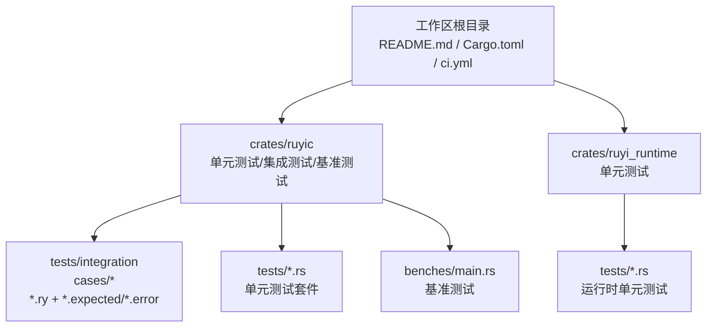
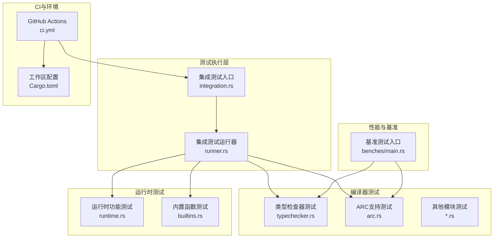
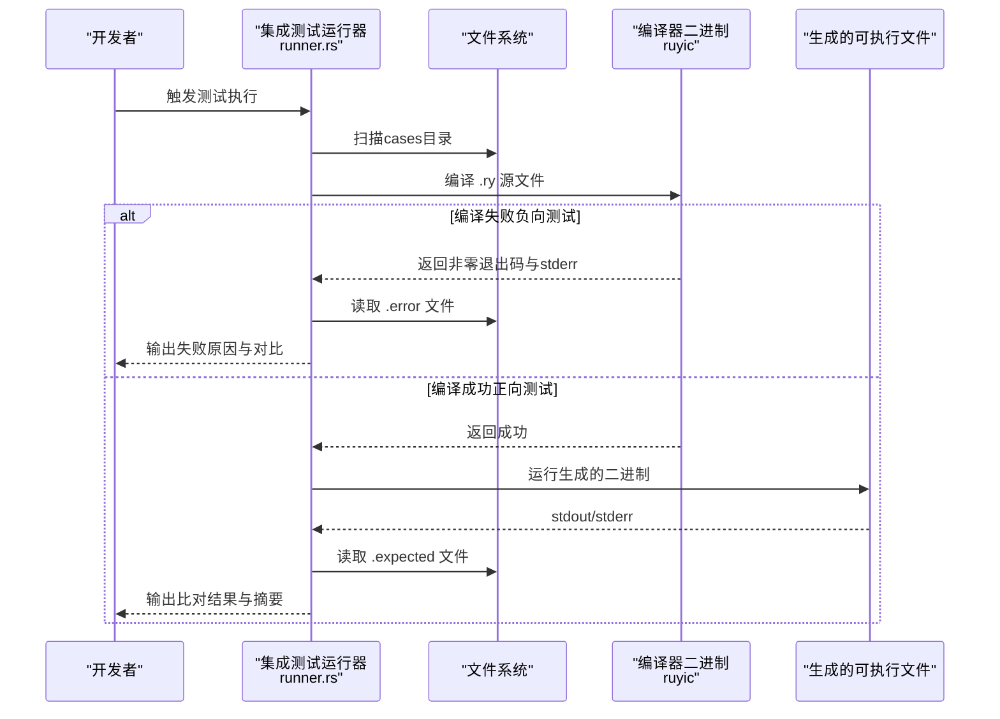
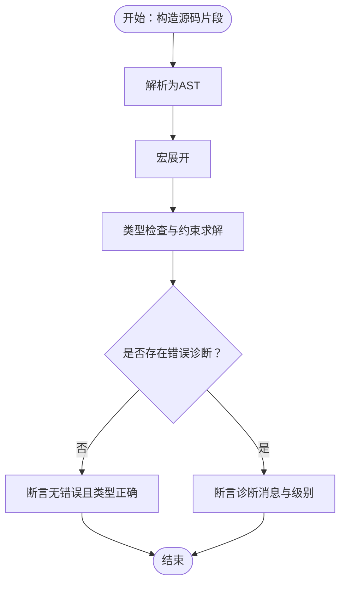
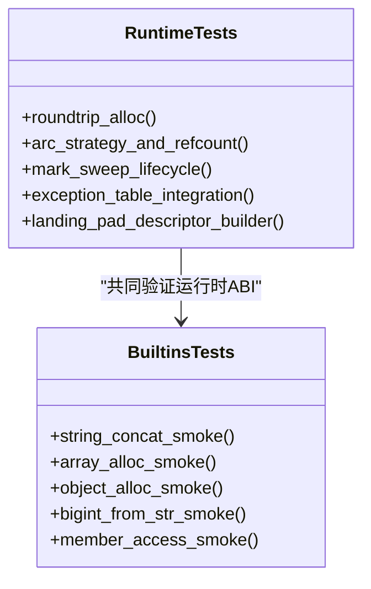
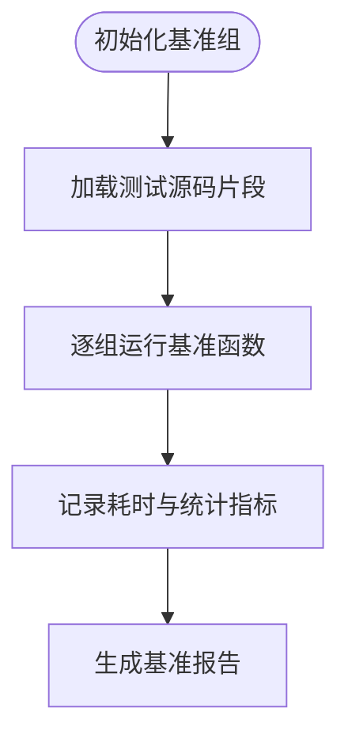
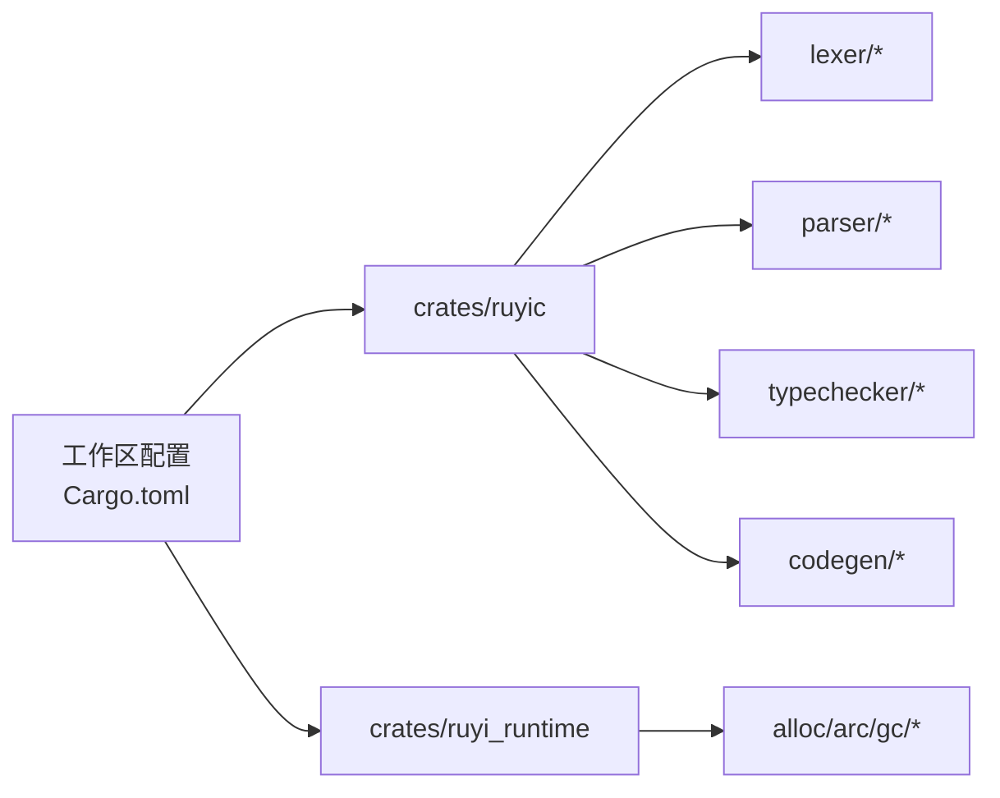
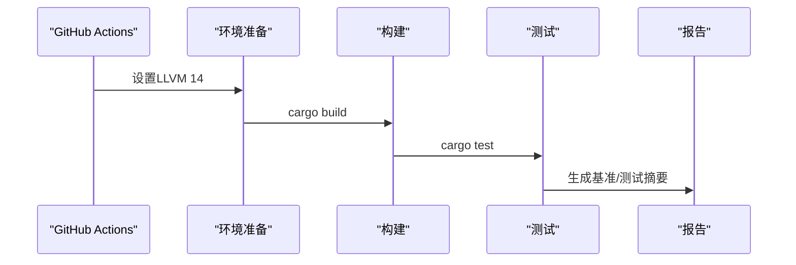

# 测试框架

<cite>
**本文引用的文件**
- [README.md](file://README.md)
- [Cargo.toml](file://Cargo.toml)
- [ci.yml](file://.github/workflows/ci.yml)
- [crates/ruyic/tests/integration/runner.rs](file://crates/ruyic/tests/integration/runner.rs)
- [crates/ruyic/tests/integration.rs](file://crates/ruyic/tests/integration.rs)
- [crates/ruyic/tests/arc.rs](file://crates/ruyic/tests/arc.rs)
- [crates/ruyic/tests/typechecker.rs](file://crates/ruyic/tests/typechecker.rs)
- [crates/ruyic/tests/integration/cases/basic/hello_world.ry](file://crates/ruyic/tests/integration/cases/basic/hello_world.ry)
- [crates/ruyic/tests/integration/cases/basic/hello_world.expected](file://crates/ruyic/tests/integration/cases/basic/hello_world.expected)
- [crates/ruyic/tests/integration/cases/errors/custom_errors.ry](file://crates/ruyic/tests/integration/cases/errors/custom_errors.ry)
- [crates/ruyi_runtime/tests/runtime.rs](file://crates/ruyi_runtime/tests/runtime.rs)
- [crates/ruyi_runtime/tests/builtins.rs](file://crates/ruyi_runtime/tests/builtins.rs)
- [crates/ruyic/benches/main.rs](file://crates/ruyic/benches/main.rs)
</cite>

## 目录
1. 引言
2. 项目结构
3. 核心组件
4. 架构总览
5. 组件详解
6. 依赖关系分析
7. 性能与基准测试
8. 覆盖率与质量度量
9. Mock与测试替身
10. 测试隔离与并行执行
11. 测试报告与CI集成
12. TDD在Ruyi中的应用
13. 结论

## 引言
本指南面向Ruyi项目的开发者与贡献者，系统性介绍如何在Ruyi代码库中开展高质量的测试工作。内容覆盖单元测试、集成测试（含端到端与系统测试）、性能基准与压力测试、覆盖率统计与分析、Mock与测试替身、测试隔离与并行执行、测试报告与持续集成自动化，以及测试驱动开发（TDD）在Ruyi中的落地实践。读者无需深入编译器背景即可按步骤完成测试设计与实施。

## 项目结构
Ruyi采用多crate工作区组织，核心测试分布在以下位置：
- ruyic（编译器）：单元测试、集成测试、基准测试
- ruyi_runtime（运行时）：单元测试
- 工作区根目录：CI配置、构建命令与示例

图表来源
- [README.md:75-99](file://README.md#L75-L99)
- [Cargo.toml:1-40](file://Cargo.toml#L1-L40)

章节来源
- [README.md:75-99](file://README.md#L75-L99)
- [Cargo.toml:1-40](file://Cargo.toml#L1-L40)

## 核心组件
- 单元测试（Unit Tests）
  - ruyic模块：类型检查器、解析器、宏展开、词法分析等子系统的断言与行为验证。
  - ruyi_runtime模块：内存分配、ARC引用计数、GC标记清扫、异常表与landing pad等运行时功能。
- 集成测试（Integration Tests）
  - 基于“源码+期望输出/错误”的端到端流程：编译→运行→比对stdout/stderr与期望文件。
- 基准测试（Benchmark）
  - 使用Criterion对词法、语法、类型检查、代码生成与整体编译时间进行分组基准。
- CI与自动化
  - GitHub Actions流水线：安装LLVM 14、构建与测试、可选的代码生成集成测试。

章节来源
- [crates/ruyic/tests/arc.rs:1-204](file://crates/ruyic/tests/arc.rs#L1-L204)
- [crates/ruyic/tests/typechecker.rs:1-800](file://crates/ruyic/tests/typechecker.rs#L1-L800)
- [crates/ruyi_runtime/tests/runtime.rs:1-133](file://crates/ruyi_runtime/tests/runtime.rs#L1-L133)
- [crates/ruyi_runtime/tests/builtins.rs:1-81](file://crates/ruyi_runtime/tests/builtins.rs#L1-L81)
- [crates/ruyic/tests/integration/runner.rs:1-385](file://crates/ruyic/tests/integration/runner.rs#L1-L385)
- [crates/ruyic/benches/main.rs:1-344](file://crates/ruyic/benches/main.rs#L1-L344)
- [.github/workflows/ci.yml:1-45](file://.github/workflows/ci.yml#L1-L45)

## 架构总览
下图展示Ruyi测试体系的总体架构：测试发现与执行引擎、编译器与运行时测试子系统、基准测试与CI流水线之间的关系。

图表来源
- [crates/ruyic/tests/integration/runner.rs:1-385](file://crates/ruyic/tests/integration/runner.rs#L1-L385)
- [crates/ruyic/tests/integration.rs:1-24](file://crates/ruyic/tests/integration.rs#L1-L24)
- [crates/ruyic/tests/typechecker.rs:1-800](file://crates/ruyic/tests/typechecker.rs#L1-L800)
- [crates/ruyic/tests/arc.rs:1-204](file://crates/ruyic/tests/arc.rs#L1-L204)
- [crates/ruyi_runtime/tests/runtime.rs:1-133](file://crates/ruyi_runtime/tests/runtime.rs#L1-L133)
- [crates/ruyi_runtime/tests/builtins.rs:1-81](file://crates/ruyi_runtime/tests/builtins.rs#L1-L81)
- [crates/ruyic/benches/main.rs:1-344](file://crates/ruyic/benches/main.rs#L1-L344)
- [.github/workflows/ci.yml:1-45](file://.github/workflows/ci.yml#L1-L45)
- [Cargo.toml:1-40](file://Cargo.toml#L1-L40)

## 组件详解

### 集成测试运行器与端到端流程
集成测试通过扫描cases目录下的Ruyi源文件，自动匹配同名的期望输出或错误文件，执行编译与运行，并比对结果。该流程同时支持正向与负向测试场景。

图表来源
- [crates/ruyic/tests/integration/runner.rs:31-316](file://crates/ruyic/tests/integration/runner.rs#L31-L316)
- [crates/ruyic/tests/integration.rs:6-23](file://crates/ruyic/tests/integration.rs#L6-L23)

章节来源
- [crates/ruyic/tests/integration/runner.rs:1-385](file://crates/ruyic/tests/integration/runner.rs#L1-L385)
- [crates/ruyic/tests/integration.rs:1-24](file://crates/ruyic/tests/integration.rs#L1-L24)
- [crates/ruyic/tests/integration/cases/basic/hello_world.ry:1-1](file://crates/ruyic/tests/integration/cases/basic/hello_world.ry#L1-L1)
- [crates/ruyic/tests/integration/cases/basic/hello_world.expected:1-1](file://crates/ruyic/tests/integration/cases/basic/hello_world.expected#L1-L1)
- [crates/ruyic/tests/integration/cases/errors/custom_errors.ry:1-29](file://crates/ruyic/tests/integration/cases/errors/custom_errors.ry#L1-L29)

### 类型检查器单元测试
类型检查器测试覆盖类型系统核心、环境管理、约束求解、诊断生成与程序级检查等关键能力。测试通过构造最小化源码片段，调用解析与类型检查流程，断言类型推导与诊断结果。

图表来源
- [crates/ruyic/tests/typechecker.rs:565-617](file://crates/ruyic/tests/typechecker.rs#L565-L617)

章节来源
- [crates/ruyic/tests/typechecker.rs:1-800](file://crates/ruyic/tests/typechecker.rs#L1-L800)

### ARC与运行时单元测试
运行时测试覆盖内存分配、ARC引用计数、弱引用生命周期、环检测边界以及GC标记清扫等核心路径；内置函数测试覆盖字符串拼接、数组与对象分配、大整数转换与成员访问等底层能力。

图表来源
- [crates/ruyi_runtime/tests/runtime.rs:1-133](file://crates/ruyi_runtime/tests/runtime.rs#L1-L133)
- [crates/ruyi_runtime/tests/builtins.rs:1-81](file://crates/ruyi_runtime/tests/builtins.rs#L1-L81)

章节来源
- [crates/ruyi_runtime/tests/runtime.rs:1-133](file://crates/ruyi_runtime/tests/runtime.rs#L1-L133)
- [crates/ruyi_runtime/tests/builtins.rs:1-81](file://crates/ruyi_runtime/tests/builtins.rs#L1-L81)

### 基准测试与性能评估
基准测试以Criterion为核心，针对词法、语法、类型检查、代码生成与整体编译时间进行分组测量，并通过字节吞吐量标注输入规模。测试数据内置于基准文件，避免外部依赖。

图表来源
- [crates/ruyic/benches/main.rs:171-343](file://crates/ruyic/benches/main.rs#L171-L343)

章节来源
- [crates/ruyic/benches/main.rs:1-344](file://crates/ruyic/benches/main.rs#L1-L344)

## 依赖关系分析
- 工作区与外部依赖
  - 工作区定义了统一的包版本与特性开关，如inkwell（LLVM绑定）用于代码生成与类型映射。
- 测试子系统耦合
  - 集成测试运行器与编译器各模块松耦合：通过二进制接口与文件系统交互，便于独立扩展。
  - 基准测试与单元测试共享部分解析与类型检查流程，但各自独立运行。

图表来源
- [Cargo.toml:14-30](file://Cargo.toml#L14-L30)
- [crates/ruyic/benches/main.rs:1-8](file://crates/ruyic/benches/main.rs#L1-L8)

章节来源
- [Cargo.toml:1-40](file://Cargo.toml#L1-L40)
- [crates/ruyic/benches/main.rs:1-344](file://crates/ruyic/benches/main.rs#L1-L344)

## 性能与基准测试
- 基准测试分组
  - 词法：按小/中/大三档源码规模测量扫描器性能。
  - 语法：解析器在相同规模下的性能表现。
  - 类型检查：包含宏展开与类型检查的完整流程。
  - 代码生成：基于inkwell上下文生成LLVM IR。
  - 整体编译：从源码到二进制的端到端耗时。
- 压力测试建议
  - 可在基准测试基础上扩展更大规模的源码集合与复杂度组合，观察编译时间与内存占用趋势。
  - 将不同优化等级（O0/O1/O2）纳入同一分组，比较编译速度与产物性能权衡。
- 最佳实践
  - 固定输入规模与吞吐量标注，确保跨版本可比性。
  - 在CI中仅运行关键分组，避免过长的基准执行时间。

章节来源
- [crates/ruyic/benches/main.rs:171-343](file://crates/ruyic/benches/main.rs#L171-L343)

## 覆盖率与质量度量
- 当前仓库未直接集成覆盖率工具链（如tarpaulin），但可通过标准流程在本地或CI中启用。
- 建议在CI中增加覆盖率收集步骤，并结合lint与格式化检查，形成完整的质量门禁。
- 由于覆盖率工具链未在仓库中出现，本节提供通用指导，不涉及具体文件分析。

## Mock与测试替身
- 对于需要隔离外部状态或副作用的测试，可在单元测试中使用：
  - 纯函数式替身：以函数指针或闭包替换对外部服务的调用。
  - 内联桩：在测试范围内重载或注入特定行为。
  - 外部进程模拟：在集成测试中通过临时文件与二进制接口进行交互（参考集成测试运行器）。
- 注意事项
  - 保持被测模块的接口稳定，避免过度Mock导致测试脆弱。
  - 对于运行时与编译器的边界（如LLVM IR生成），优先使用内部抽象而非真实LLVM实例。

## 测试隔离与并行执行
- 隔离策略
  - 集成测试通过临时文件与独立二进制实现隔离，避免相互污染。
  - 单元测试尽量无状态，必要时使用静态变量需注意并发安全。
- 并行执行
  - Rust默认支持测试并行，可通过cargo test -- --test-threads控制线程数。
  - 对于可能产生全局副作用的测试（如修改环境变量、LLVM路径），应串行化或禁用并行。

章节来源
- [crates/ruyic/tests/integration/runner.rs:100-118](file://crates/ruyic/tests/integration/runner.rs#L100-L118)

## 测试报告与CI集成
- CI流水线要点
  - 安装LLVM 14并设置环境变量，确保编译器与运行时测试可用。
  - 先构建再测试，必要时单独运行代码生成集成测试。
- 报告与可视化
  - Criterion基准测试会生成HTML报告，可在CI artifacts中保存以便审阅。
  - 集成测试运行器提供简洁的摘要输出，便于快速定位失败用例。

图表来源
- [.github/workflows/ci.yml:12-26](file://.github/workflows/ci.yml#L12-L26)

章节来源
- [.github/workflows/ci.yml:1-45](file://.github/workflows/ci.yml#L1-L45)

## TDD在Ruyi中的应用
- 设计原则
  - 从最小可行的失败测试开始，逐步完善编译器与运行时模块。
  - 先写集成测试（端到端）验证用户场景，再拆解到单元测试细化实现。
- 实施步骤
  - 选择一个语言特性（如新的语法节点或运行时行为），先编写对应的Ruyi源文件与期望输出。
  - 运行集成测试使其失败，随后实现编译器或运行时逻辑，直至测试通过。
  - 补充单元测试覆盖边界条件与异常路径。
- 工具配合
  - 利用基准测试验证性能回归，确保新特性不会引入显著开销。

## 结论
Ruyi测试体系以“单元测试+集成测试+基准测试”三位一体为核心，辅以CI自动化与可扩展的测试替身机制。通过遵循本文的组织方式、断言策略与执行配置，团队可以在保证质量的同时高效推进语言与运行时的演进。建议在后续迭代中补充覆盖率统计与更丰富的Mock策略，进一步提升测试的可维护性与可读性。