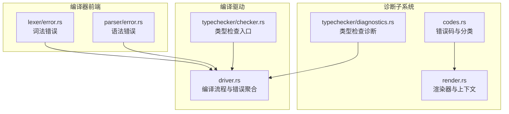
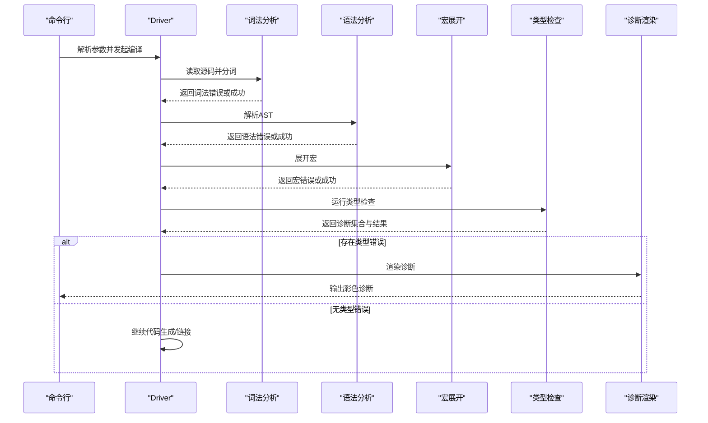
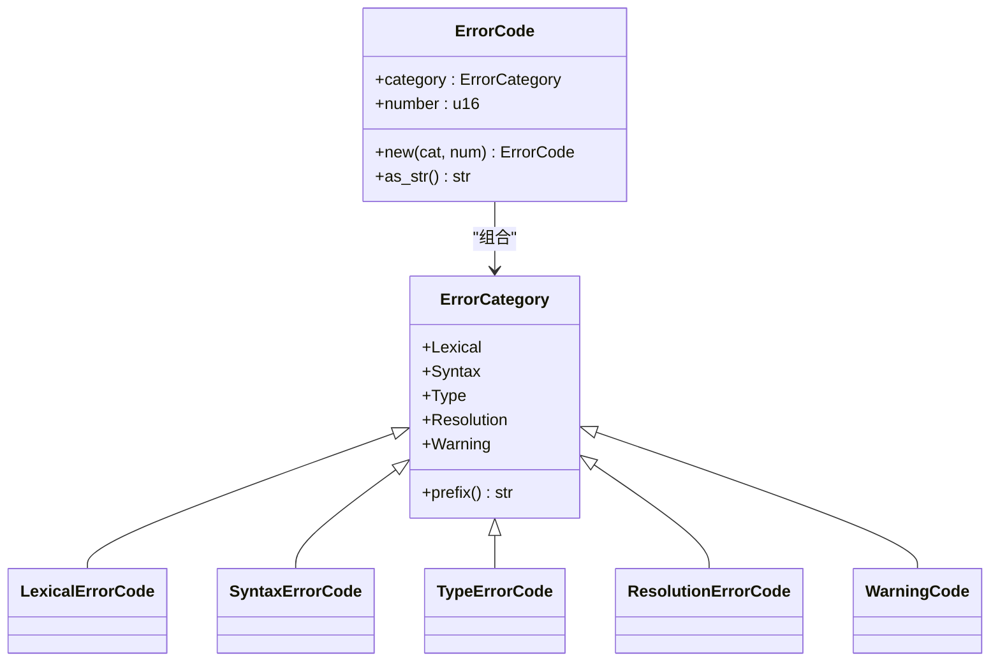
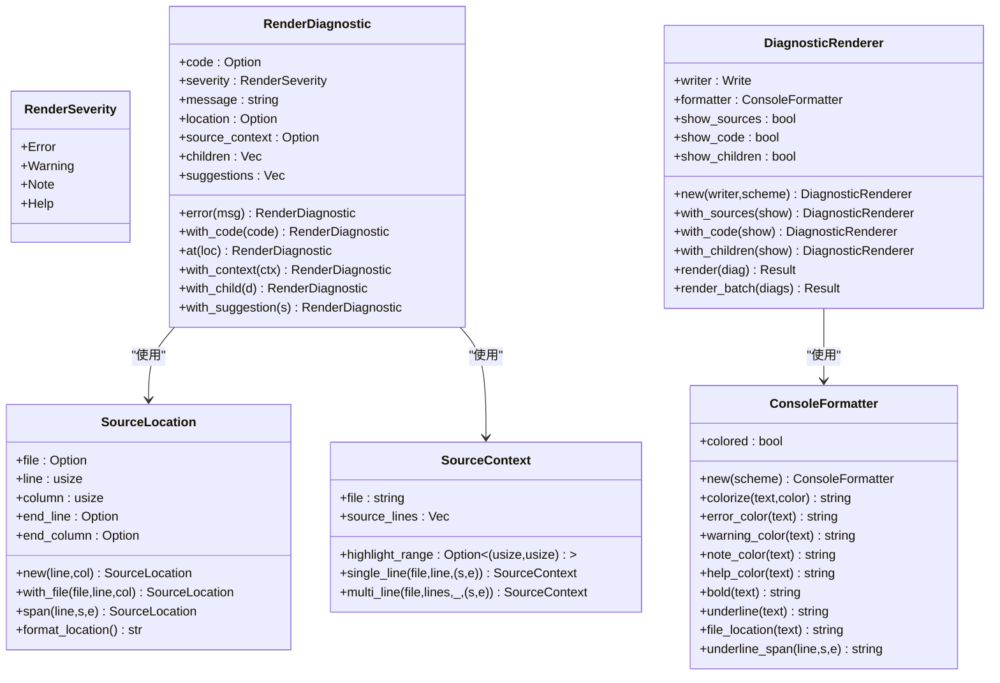
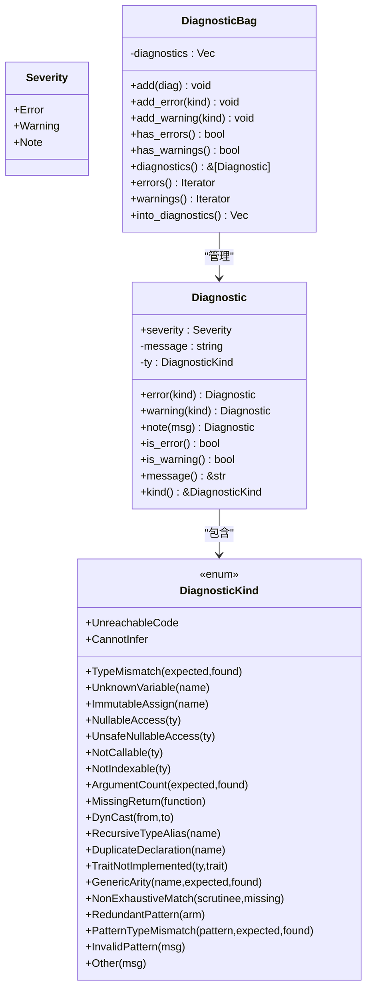
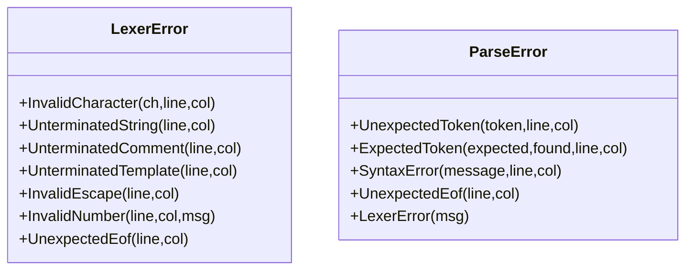
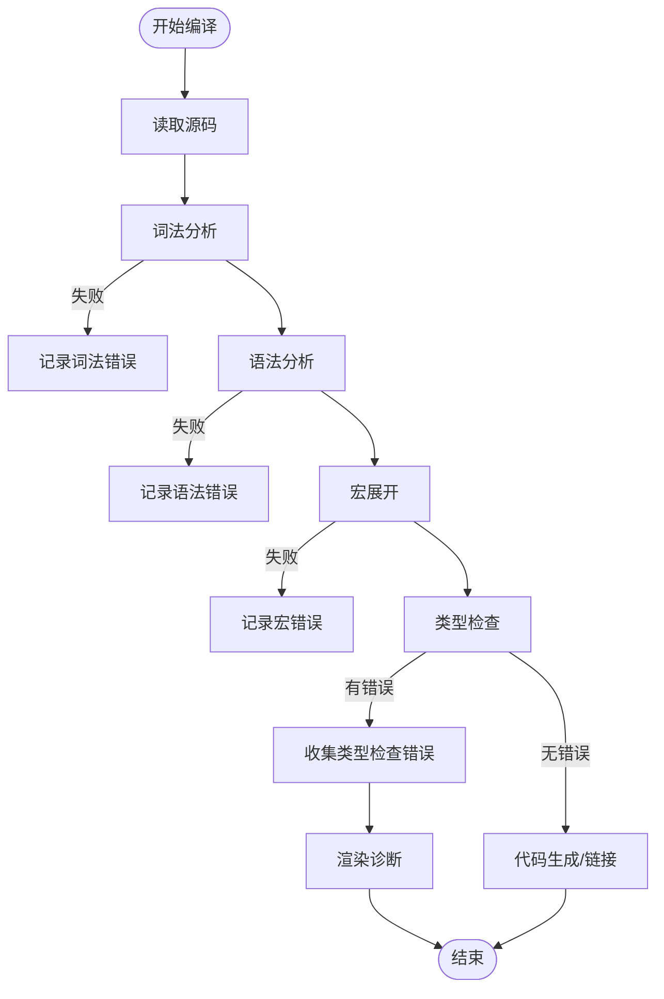
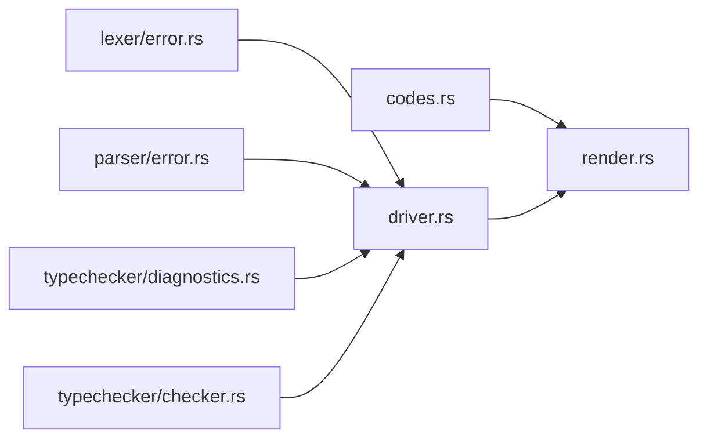
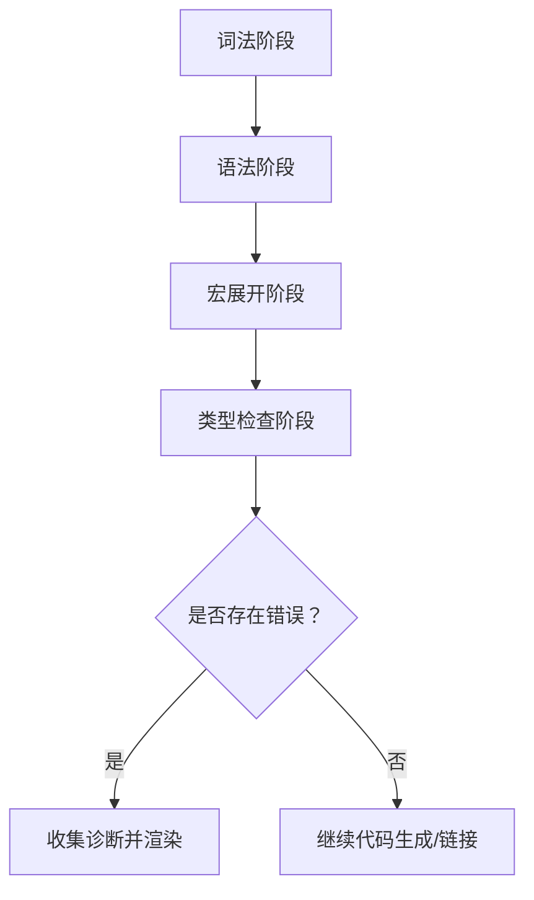

# 编译器诊断系统

<cite>
**本文引用的文件**
- [crates/ruyic/src/diagnostics/mod.rs](file://crates/ruyic/src/diagnostics/mod.rs)
- [crates/ruyic/src/diagnostics/codes.rs](file://crates/ruyic/src/diagnostics/codes.rs)
- [crates/ruyic/src/diagnostics/render.rs](file://crates/ruyic/src/diagnostics/render.rs)
- [crates/ruyic/src/typechecker/diagnostics.rs](file://crates/ruyic/src/typechecker/diagnostics.rs)
- [crates/ruyic/src/parser/error.rs](file://crates/ruyic/src/parser/error.rs)
- [crates/ruyic/src/lexer/error.rs](file://crates/ruyic/src/lexer/error.rs)
- [crates/ruyic/src/driver.rs](file://crates/ruyic/src/driver.rs)
- [crates/ruyic/src/typechecker/checker.rs](file://crates/ruyic/src/typechecker/checker.rs)
- [crates/ruyic/tests/diagnostics.rs](file://crates/ruyic/tests/diagnostics.rs)
</cite>

## 目录
1. [简介](#简介)
2. [项目结构](#项目结构)
3. [核心组件](#核心组件)
4. [架构总览](#架构总览)
5. [详细组件分析](#详细组件分析)
6. [依赖关系分析](#依赖关系分析)
7. [性能考量](#性能考量)
8. [故障排查指南](#故障排查指南)
9. [结论](#结论)
10. [附录](#附录)

## 简介
本文件为 Ruyi 编译器诊断系统的权威技术文档。系统覆盖从词法与语法阶段到类型检查与代码生成的全链路诊断能力，提供统一的错误码体系、可读性强的彩色终端输出、源码上下文高亮、以及可扩展的诊断构建器。本文面向不同层次读者，既给出高层架构视图，也提供代码级细节与扩展指引。

## 项目结构
诊断系统主要分布在以下模块：
- diagnostics：错误码与渲染（颜色、上下文、批量输出）
- typechecker/diagnostics：类型检查专用诊断模型与收集器
- parser/lexer：词法与语法阶段的错误类型
- driver：编译驱动层对诊断的整合与展示
- tests：端到端渲染与颜色行为的测试用例

**图表来源**
- [crates/ruyic/src/diagnostics/codes.rs:1-345](file://crates/ruyic/src/diagnostics/codes.rs#L1-L345)
- [crates/ruyic/src/diagnostics/render.rs:1-557](file://crates/ruyic/src/diagnostics/render.rs#L1-L557)
- [crates/ruyic/src/typechecker/diagnostics.rs:1-336](file://crates/ruyic/src/typechecker/diagnostics.rs#L1-L336)
- [crates/ruyic/src/lexer/error.rs:1-36](file://crates/ruyic/src/lexer/error.rs#L1-L36)
- [crates/ruyic/src/parser/error.rs:1-39](file://crates/ruyic/src/parser/error.rs#L1-L39)
- [crates/ruyic/src/driver.rs:1-744](file://crates/ruyic/src/driver.rs#L1-L744)
- [crates/ruyic/src/typechecker/checker.rs:1-200](file://crates/ruyic/src/typechecker/checker.rs#L1-L200)

**章节来源**
- [crates/ruyic/src/diagnostics/mod.rs:1-14](file://crates/ruyic/src/diagnostics/mod.rs#L1-L14)
- [crates/ruyic/src/diagnostics/codes.rs:1-345](file://crates/ruyic/src/diagnostics/codes.rs#L1-L345)
- [crates/ruyic/src/diagnostics/render.rs:1-557](file://crates/ruyic/src/diagnostics/render.rs#L1-L557)
- [crates/ruyic/src/typechecker/diagnostics.rs:1-336](file://crates/ruyic/src/typechecker/diagnostics.rs#L1-L336)
- [crates/ruyic/src/lexer/error.rs:1-36](file://crates/ruyic/src/lexer/error.rs#L1-L36)
- [crates/ruyic/src/parser/error.rs:1-39](file://crates/ruyic/src/parser/error.rs#L1-L39)
- [crates/ruyic/src/driver.rs:1-744](file://crates/ruyic/src/driver.rs#L1-L744)
- [crates/ruyic/src/typechecker/checker.rs:1-200](file://crates/ruyic/src/typechecker/checker.rs#L1-L200)

## 核心组件
- 错误码与分类：统一的错误码前缀与编号范围，涵盖词法、语法、类型、解析、警告五类。
- 渲染器：支持彩色输出、源码上下文高亮、层级化子诊断、建议提示、Windows 终端兼容。
- 类型检查诊断：结构化的诊断种类与消息模板，配合收集器进行聚合与过滤。
- 前端错误：词法与语法阶段的错误类型，携带行列定位信息。
- 驱动集成：在编译流程中捕获并汇总各阶段错误，最终统一呈现。

**章节来源**
- [crates/ruyic/src/diagnostics/codes.rs:18-61](file://crates/ruyic/src/diagnostics/codes.rs#L18-L61)
- [crates/ruyic/src/diagnostics/render.rs:11-82](file://crates/ruyic/src/diagnostics/render.rs#L11-L82)
- [crates/ruyic/src/typechecker/diagnostics.rs:10-98](file://crates/ruyic/src/typechecker/diagnostics.rs#L10-L98)
- [crates/ruyic/src/lexer/error.rs:9-35](file://crates/ruyic/src/lexer/error.rs#L9-L35)
- [crates/ruyic/src/parser/error.rs:9-38](file://crates/ruyic/src/parser/error.rs#L9-L38)
- [crates/ruyic/src/driver.rs:21-54](file://crates/ruyic/src/driver.rs#L21-L54)

## 架构总览
诊断系统贯穿编译管线，从词法/语法错误到类型检查错误，再到驱动层统一呈现。类型检查结果通过收集器聚合，驱动层根据 EmitType 决定是否终止或继续后续阶段，并在错误时输出统一格式的诊断信息。

**图表来源**
- [crates/ruyic/src/driver.rs:258-632](file://crates/ruyic/src/driver.rs#L258-L632)
- [crates/ruyic/src/lexer/error.rs:9-35](file://crates/ruyic/src/lexer/error.rs#L9-L35)
- [crates/ruyic/src/parser/error.rs:9-38](file://crates/ruyic/src/parser/error.rs#L9-L38)
- [crates/ruyic/src/typechecker/checker.rs:57-83](file://crates/ruyic/src/typechecker/checker.rs#L57-L83)
- [crates/ruyic/src/diagnostics/render.rs:312-411](file://crates/ruyic/src/diagnostics/render.rs#L312-L411)

## 详细组件分析

### 错误码与分类体系
- 分类枚举：词法、语法、类型、解析、警告。
- 错误码结构：包含类别与四位数编号，字符串表示形如“E1001”、“W1001”。
- 分类前缀：词法/语法/类型/解析以“E”开头，警告以“W”开头。
- 全量索引：提供错误码、短名与描述的参考索引，便于文档与工具链维护。

**图表来源**
- [crates/ruyic/src/diagnostics/codes.rs:18-61](file://crates/ruyic/src/diagnostics/codes.rs#L18-L61)
- [crates/ruyic/src/diagnostics/codes.rs:74-232](file://crates/ruyic/src/diagnostics/codes.rs#L74-L232)

**章节来源**
- [crates/ruyic/src/diagnostics/codes.rs:1-345](file://crates/ruyic/src/diagnostics/codes.rs#L1-L345)

### 渲染器与源码上下文
- 可渲染诊断：包含严重级别、可选错误码、消息、位置、源码上下文、子诊断与建议列表。
- 源码上下文：单行/多行高亮，支持起止列定位；渲染时输出行号与下划线标记。
- 彩色输出：按严重级别着色，支持自动/强制/禁用三种颜色方案；Windows 平台兼容性检测。
- 批量渲染：支持一次性输出多个诊断，中间以空行分隔。

**图表来源**
- [crates/ruyic/src/diagnostics/render.rs:11-82](file://crates/ruyic/src/diagnostics/render.rs#L11-L82)
- [crates/ruyic/src/diagnostics/render.rs:123-152](file://crates/ruyic/src/diagnostics/render.rs#L123-L152)
- [crates/ruyic/src/diagnostics/render.rs:202-275](file://crates/ruyic/src/diagnostics/render.rs#L202-L275)
- [crates/ruyic/src/diagnostics/render.rs:277-421](file://crates/ruyic/src/diagnostics/render.rs#L277-L421)

**章节来源**
- [crates/ruyic/src/diagnostics/render.rs:1-557](file://crates/ruyic/src/diagnostics/render.rs#L1-L557)

### 类型检查诊断模型
- 诊断种类：涵盖类型不匹配、未知变量、不可调用、不可索引、参数数量不匹配、缺失返回值、不可推断、可空访问风险、不可变赋值、Trait 未实现、泛型参数个数不匹配、递归类型别名、重复声明、模式匹配不穷尽/冗余/类型不匹配等。
- 收集器：支持添加错误/警告、查询是否存在错误/警告、迭代错误/警告、转换为向量等。
- 结果封装：类型检查结果包含环境、诊断集合、是否有错误标志与单态化追踪器。

**图表来源**
- [crates/ruyic/src/typechecker/diagnostics.rs:10-98](file://crates/ruyic/src/typechecker/diagnostics.rs#L10-L98)
- [crates/ruyic/src/typechecker/diagnostics.rs:245-291](file://crates/ruyic/src/typechecker/diagnostics.rs#L245-L291)

**章节来源**
- [crates/ruyic/src/typechecker/diagnostics.rs:1-336](file://crates/ruyic/src/typechecker/diagnostics.rs#L1-L336)

### 前端错误类型
- 词法错误：无效字符、未终止字符串/注释/模板字符串、无效转义序列、无效数字字面量、意外 EOF。
- 语法错误：意外标记、期望但未找到的标记、语法错误、意外 EOF、括号不匹配、缺少分号、无效表达式语句。

**图表来源**
- [crates/ruyic/src/lexer/error.rs:9-35](file://crates/ruyic/src/lexer/error.rs#L9-L35)
- [crates/ruyic/src/parser/error.rs:9-38](file://crates/ruyic/src/parser/error.rs#L9-L38)

**章节来源**
- [crates/ruyic/src/lexer/error.rs:1-36](file://crates/ruyic/src/lexer/error.rs#L1-L36)
- [crates/ruyic/src/parser/error.rs:1-39](file://crates/ruyic/src/parser/error.rs#L1-L39)

### 驱动层集成与诊断呈现
- 错误聚合：将词法、语法、宏展开、类型检查等阶段的错误统一包装为编译错误。
- 流程控制：若类型检查存在错误则直接返回错误；否则继续代码生成/链接。
- 诊断格式：在驱动层对类型检查诊断进行逐条输出，支持文件路径前缀。

**图表来源**
- [crates/ruyic/src/driver.rs:21-54](file://crates/ruyic/src/driver.rs#L21-L54)
- [crates/ruyic/src/driver.rs:522-632](file://crates/ruyic/src/driver.rs#L522-L632)

**章节来源**
- [crates/ruyic/src/driver.rs:1-744](file://crates/ruyic/src/driver.rs#L1-L744)

### 实际错误示例与修复建议
以下示例来自测试用例，展示了典型错误与建议：
- 类型不匹配：在类型注解与字面量不一致时产生，建议进行显式类型转换。
- 未定义变量：引用未声明标识符，建议检查拼写或引入相应声明。
- 缺少分号：在语句末尾缺少分号，建议补全分号。
- 未使用变量：变量声明后未被使用，建议删除或启用相应规则。
- 不可达代码：条件分支后出现无法到达的代码，建议重构逻辑。

**章节来源**
- [crates/ruyic/tests/diagnostics.rs:1-251](file://crates/ruyic/tests/diagnostics.rs#L1-L251)

## 依赖关系分析
- diagnostics/codes 与 diagnostics/render：渲染器依赖错误码；测试验证错误码显示与颜色方案。
- typechecker/diagnostics 与 driver：驱动层接收类型检查返回的诊断集合并进行统一输出。
- lexer/error 与 parser/error：驱动层将词法/语法错误映射为编译错误。
- typechecker/checker：类型检查入口负责运行推理、收集诊断并返回结果。

**图表来源**
- [crates/ruyic/src/diagnostics/codes.rs:1-345](file://crates/ruyic/src/diagnostics/codes.rs#L1-L345)
- [crates/ruyic/src/diagnostics/render.rs:1-557](file://crates/ruyic/src/diagnostics/render.rs#L1-L557)
- [crates/ruyic/src/typechecker/diagnostics.rs:1-336](file://crates/ruyic/src/typechecker/diagnostics.rs#L1-L336)
- [crates/ruyic/src/lexer/error.rs:1-36](file://crates/ruyic/src/lexer/error.rs#L1-L36)
- [crates/ruyic/src/parser/error.rs:1-39](file://crates/ruyic/src/parser/error.rs#L1-L39)
- [crates/ruyic/src/driver.rs:1-744](file://crates/ruyic/src/driver.rs#L1-L744)
- [crates/ruyic/src/typechecker/checker.rs:1-200](file://crates/ruyic/src/typechecker/checker.rs#L1-L200)

**章节来源**
- [crates/ruyic/src/driver.rs:1-744](file://crates/ruyic/src/driver.rs#L1-L744)
- [crates/ruyic/src/typechecker/checker.rs:1-200](file://crates/ruyic/src/typechecker/checker.rs#L1-L200)

## 性能考量
- 渲染器采用惰性输出策略，仅在需要时进行颜色与上下文计算，避免不必要的字符串拼接。
- 批量渲染通过一次遍历输出多个诊断，减少 I/O 调用次数。
- 上下文高亮基于字符切片与一次性分配，尽量降低内存碎片。
- Windows 平台颜色支持检测与切换，避免在非 ANSI 终端上输出控制码造成额外开销。

## 故障排查指南
- 颜色输出异常：检查 ColorScheme 设置与终端类型（TERM=dumb 将禁用颜色）。
- 无源码上下文：确认 SourceContext 已正确设置文件名与高亮区间。
- 诊断未显示错误码：确保 RenderDiagnostic 的 code 字段已设置。
- 多级诊断链：使用子诊断（children）组织关联信息，便于用户理解问题根因。
- 类型检查失败：优先修复类型错误，再继续后续阶段；必要时使用 --check 模式仅进行类型检查。

**章节来源**
- [crates/ruyic/src/diagnostics/render.rs:154-170](file://crates/ruyic/src/diagnostics/render.rs#L154-L170)
- [crates/ruyic/src/diagnostics/render.rs:312-411](file://crates/ruyic/src/diagnostics/render.rs#L312-L411)
- [crates/ruyic/tests/diagnostics.rs:165-194](file://crates/ruyic/tests/diagnostics.rs#L165-L194)

## 结论
Ruyi 诊断系统以清晰的错误码分类为基础，结合可读性强的渲染器与丰富的源码上下文，为开发者提供了高质量的编译期反馈。类型检查诊断模型与驱动层的无缝集成，使得从词法/语法到类型层面的问题都能得到一致且易懂的呈现。通过测试用例与扩展接口，系统具备良好的可维护性与可扩展性。

## 附录

### 错误类型识别与处理流程

**图表来源**
- [crates/ruyic/src/driver.rs:522-632](file://crates/ruyic/src/driver.rs#L522-L632)

### 错误报告格式化输出
- 标准格式：严重级别 + 错误码 + 消息
- 位置信息：文件名与行列号
- 源码上下文：文件名、行号、源码行与高亮下划线
- 子诊断与建议：note/help 提示与修复建议

**章节来源**
- [crates/ruyic/src/diagnostics/render.rs:312-411](file://crates/ruyic/src/diagnostics/render.rs#L312-L411)

### 国际化支持现状
- 当前错误消息以英文为主，未见专门的国际化框架或资源文件。
- 若需国际化，可在消息模板处引入本地化键值映射，并在渲染前进行翻译查找。

### 扩展机制
- 添加新错误类型：
  - 在 diagnostics/codes 中新增错误码枚举项与 to_error_code 映射。
  - 在 typechecker/diagnostics 的 DiagnosticKind 中增加对应变体与消息模板。
  - 在 tests 中补充渲染与颜色行为的单元测试。
- 自定义诊断信息：
  - 使用 DiagnosticBuilder 构建带位置、上下文、子诊断与建议的诊断对象。
  - 通过 DiagnosticRenderer 控制是否显示源码、错误码与子诊断。

**章节来源**
- [crates/ruyic/src/diagnostics/codes.rs:74-232](file://crates/ruyic/src/diagnostics/codes.rs#L74-L232)
- [crates/ruyic/src/typechecker/diagnostics.rs:28-98](file://crates/ruyic/src/typechecker/diagnostics.rs#L28-L98)
- [crates/ruyic/tests/diagnostics.rs:1-251](file://crates/ruyic/tests/diagnostics.rs#L1-L251)