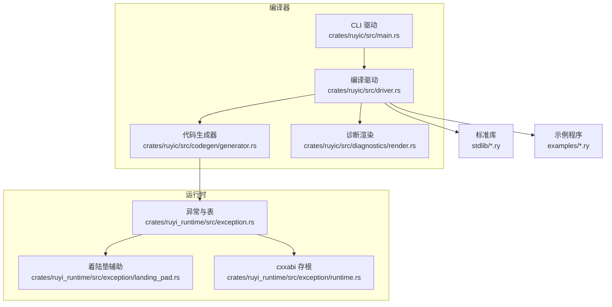
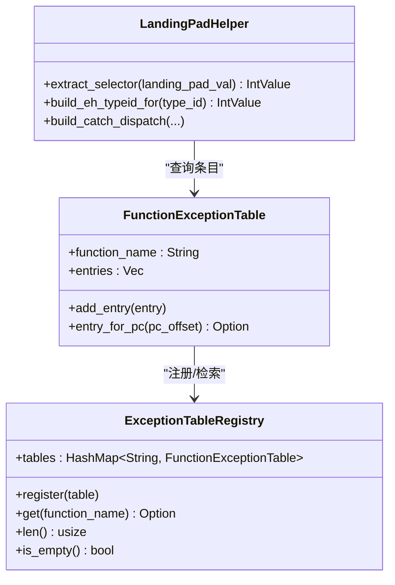
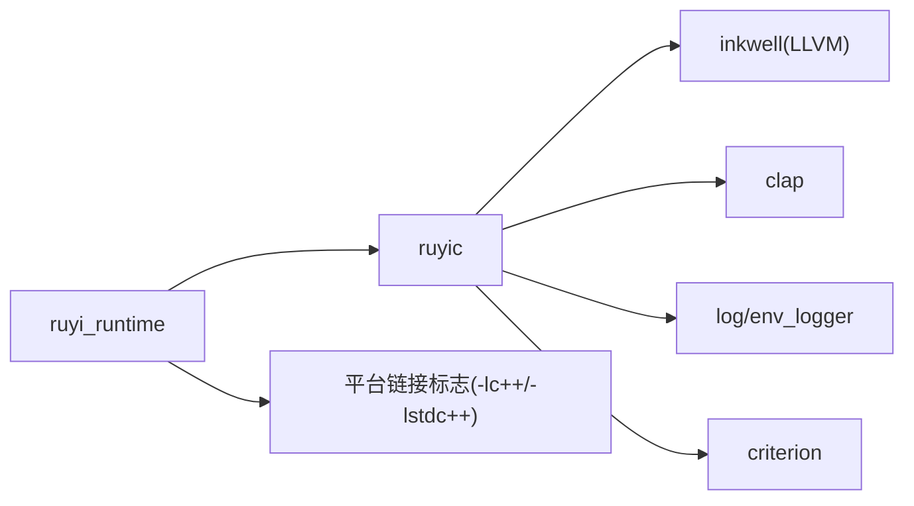

# 调试工具

<cite>
**本文引用的文件**
- [README.md](file://README.md)
- [Cargo.toml](file://Cargo.toml)
- [crates/ruyic/src/main.rs](file://crates/ruyic/src/main.rs)
- [crates/ruyic/src/driver.rs](file://crates/ruyic/src/driver.rs)
- [crates/ruyic/src/codegen/mod.rs](file://crates/ruyic/src/codegen/mod.rs)
- [crates/ruyic/src/codegen/generator.rs](file://crates/ruyic/src/codegen/generator.rs)
- [crates/ruyic/src/diagnostics/render.rs](file://crates/ruyic/src/diagnostics/render.rs)
- [crates/ruyi_runtime/src/exception.rs](file://crates/ruyi_runtime/src/exception.rs)
- [crates/ruyi_runtime/src/exception/runtime.rs](file://crates/ruyi_runtime/src/exception/runtime.rs)
- [crates/ruyi_runtime/src/exception/landing_pad.rs](file://crates/ruyi_runtime/src/exception/landing_pad.rs)
- [crates/ruyi_runtime/tests/exception_runtime.rs](file://crates/ruyi_runtime/tests/exception_runtime.rs)
- [crates/ruyic/tests/integration/cases/exception/try_catch_basic.ry](file://crates/ruyic/tests/integration/cases/exception/try_catch_basic.ry)
- [stdlib/process.ry](file://stdlib/process.ry)
- [.omo/evidence/task-1-linker.txt](file://.omo/evidence/task-1-linker.txt)
- [.omo/evidence/task-11-match-destructure.ll.txt](file://.omo/evidence/task-11-match-destructure.ll.txt)
- [.omo/evidence/task-11-match-bool.ll.txt](file://.omo/evidence/task-11-match-bool.ll.txt)
- [.omo/notepads/v0.2-codegen/try-catch.md](file://.omo/notepads/v0.2-codegen/try-catch.md)
- [.omo/notepads/v0.3-runtime/progress-report.md](file://.omo/notepads/v0.3-runtime/progress-report.md)
- [.omo/evidence/task-3-memory-model.txt](file://.omo/evidence/task-3-memory-model.txt)
</cite>

## 目录
1. [简介](#简介)
2. [项目结构](#项目结构)
3. [核心组件](#核心组件)
4. [架构总览](#架构总览)
5. [详细组件分析](#详细组件分析)
6. [依赖关系分析](#依赖关系分析)
7. [性能考量](#性能考量)
8. [故障排查指南](#故障排查指南)
9. [结论](#结论)
10. [附录](#附录)

## 简介
本指南面向使用 Ruyi 语言进行开发与调试的工程师，系统讲解如何在开发与发布两种模式下生成与利用调试信息，如何与 GDB/LLDB 等外部调试器协同工作，如何借助运行时异常表与 LLVM 生成的异常处理机制进行断点、变量监视与调用栈分析，并给出内存调试、远程调试与生产环境调试的最佳实践。同时，结合仓库中的诊断渲染与中间产物输出能力，帮助你高效定位问题并提升调试效率。

## 项目结构
Ruyi 编译器与运行时由两个主要 crate 组成：
- ruyic：编译器前端与后端（词法/语法/语义分析、宏展开、类型检查、LLVM IR 生成、链接），以及 CLI 驱动。
- ruyi_runtime：运行时库（GC、异步调度、异常处理等）。

此外，仓库提供了标准库与示例程序，便于验证调试信息与运行时行为。



图表来源
- [crates/ruyic/src/main.rs:1-114](file://crates/ruyic/src/main.rs#L1-L114)
- [crates/ruyic/src/driver.rs:1-744](file://crates/ruyic/src/driver.rs#L1-L744)
- [crates/ruyic/src/codegen/generator.rs:1-200](file://crates/ruyic/src/codegen/generator.rs#L1-L200)
- [crates/ruyi_runtime/src/exception.rs:118-219](file://crates/ruyi_runtime/src/exception.rs#L118-L219)
- [crates/ruyi_runtime/src/exception/landing_pad.rs:104-164](file://crates/ruyi_runtime/src/exception/landing_pad.rs#L104-L164)
- [crates/ruyi_runtime/src/exception/runtime.rs:1-22](file://crates/ruyi_runtime/src/exception/runtime.rs#L1-L22)

章节来源
- [README.md:75-99](file://README.md#L75-L99)
- [Cargo.toml:1-40](file://Cargo.toml#L1-L40)

## 核心组件
- CLI 与编译驱动：负责解析命令行参数、构建编译选项、协调编译流水线（词法/语法/宏/类型检查）、触发 LLVM IR 生成与链接。
- 代码生成器：基于 Inkwell（LLVM Rust 绑定）生成 LLVM IR，并在需要时输出 IR 文件或直接链接为原生二进制。
- 运行时异常系统：提供函数级异常表、着陆垫辅助与 cxxabi 存根，支撑 try/catch/finally 的运行时分派与清理。
- 诊断渲染：提供带源码上下文的彩色诊断输出，便于快速定位问题位置。

章节来源
- [crates/ruyic/src/main.rs:16-44](file://crates/ruyic/src/main.rs#L16-L44)
- [crates/ruyic/src/driver.rs:86-138](file://crates/ruyic/src/driver.rs#L86-L138)
- [crates/ruyic/src/codegen/generator.rs:22-28](file://crates/ruyic/src/codegen/generator.rs#L22-L28)
- [crates/ruyi_runtime/src/exception.rs:118-219](file://crates/ruyi_runtime/src/exception.rs#L118-L219)
- [crates/ruyi_runtime/src/exception/landing_pad.rs:104-164](file://crates/ruyi_runtime/src/exception/landing_pad.rs#L104-L164)
- [crates/ruyi_runtime/src/exception/runtime.rs:1-22](file://crates/ruyi_runtime/src/exception/runtime.rs#L1-L22)
- [crates/ruyic/src/diagnostics/render.rs:277-421](file://crates/ruyic/src/diagnostics/render.rs#L277-L421)

## 架构总览
Ruyi 的调试支持贯穿编译期与运行时：
- 编译期：通过优化等级与中间产物输出（AST/Typed AST/LLVM IR）辅助定位问题；链接阶段自动注入平台相关的 C++ 运行时链接标志以支持异常处理。
- 运行时：异常表与着陆垫配合 LLVM 生成的 landingpad 指令，实现精确的异常捕获与清理；诊断系统提供可读性强的错误信息。

```mermaid
sequenceDiagram
participant Dev as "开发者"
participant CLI as "CLI 驱动"
participant Driver as "编译驱动"
participant CG as "代码生成器"
participant Link as "链接器"
participant Bin as "可执行文件"
Dev->>CLI : 传入输入文件与选项
CLI->>Driver : 解析参数并构造 CompileOptions
Driver->>Driver : 解析/宏展开/类型检查
Driver->>CG : 触发 LLVM IR 生成
CG-->>Driver : 返回 IR 或二进制路径
alt 输出 IR
Driver-->>Dev : 打印 IR 路径
else 生成二进制
Driver->>Link : 调用 cc 并附加平台链接标志
Link-->>Driver : 产出可执行文件
Driver-->>Dev : 打印输出路径
end
```

图表来源
- [crates/ruyic/src/main.rs:46-113](file://crates/ruyic/src/main.rs#L46-L113)
- [crates/ruyic/src/driver.rs:522-632](file://crates/ruyic/src/driver.rs#L522-L632)
- [crates/ruyic/src/codegen/generator.rs:767-794](file://crates/ruyic/src/codegen/generator.rs#L767-L794)
- [.omo/evidence/task-1-linker.txt:7-20](file://.omo/evidence/task-1-linker.txt#L7-L20)

章节来源
- [crates/ruyic/src/main.rs:46-113](file://crates/ruyic/src/main.rs#L46-L113)
- [crates/ruyic/src/driver.rs:522-632](file://crates/ruyic/src/driver.rs#L522-L632)
- [.omo/evidence/task-1-linker.txt:7-20](file://.omo/evidence/task-1-linker.txt#L7-L20)

## 详细组件分析

### 调试符号与中间产物输出
- 中间产物输出
  - AST/Typed AST：用于调试编译器内部流程，定位类型推断与宏展开问题。
  - LLVM IR：用于核对代码生成质量，理解异常处理、函数调用与内存布局。
- 调试符号
  - 当前仓库未显式暴露“仅开启调试符号”的独立开关；可通过优化等级与中间产物策略间接获得更易调试的二进制（例如 O0 或输出 IR）。

章节来源
- [README.md:64-74](file://README.md#L64-L74)
- [crates/ruyic/src/main.rs:33-43](file://crates/ruyic/src/main.rs#L33-L43)
- [crates/ruyic/src/driver.rs:530-566](file://crates/ruyic/src/driver.rs#L530-L566)

### 异常处理与运行时调试
- 异常表与着陆垫
  - 函数级异常表记录受保护区域与处理器入口；着陆垫辅助提取选择器并匹配 catch 分支。
  - 运行时提供 cxxabi 存根，避免测试环境缺失 C++ ABI 时的链接失败。
- 嵌套 try/catch 与 finally
  - 测试覆盖了嵌套捕获、传播与清理逻辑；可据此验证断点命中与栈帧回溯。



图表来源
- [crates/ruyi_runtime/src/exception.rs:118-219](file://crates/ruyi_runtime/src/exception.rs#L118-L219)
- [crates/ruyi_runtime/src/exception/landing_pad.rs:104-164](file://crates/ruyi_runtime/src/exception/landing_pad.rs#L104-L164)

章节来源
- [crates/ruyi_runtime/src/exception.rs:118-219](file://crates/ruyi_runtime/src/exception.rs#L118-L219)
- [crates/ruyi_runtime/src/exception/landing_pad.rs:104-164](file://crates/ruyi_runtime/src/exception/landing_pad.rs#L104-L164)
- [crates/ruyi_runtime/src/exception/runtime.rs:1-22](file://crates/ruyi_runtime/src/exception/runtime.rs#L1-L22)
- [crates/ruyi_runtime/tests/exception_runtime.rs:297-464](file://crates/ruyi_runtime/tests/exception_runtime.rs#L297-L464)

### 与 GDB/LLDB 的集成
- 生成可调试二进制
  - 使用默认二进制输出（Release/Optimized 亦可）即可被 GDB/LLDB 加载；如需更易调试的符号，建议在本地开发时采用较低优化等级或输出 IR。
- 断点与变量监视
  - 在函数入口、异常抛出点与 catch 分支处设置断点；结合异常表条目定位 landing pad 与处理器偏移。
- 调用栈分析
  - 利用异常表的函数名与受保护区间，结合运行时栈帧结构，定位异常传播路径与清理分支。

章节来源
- [crates/ruyic/src/driver.rs:616-631](file://crates/ruyic/src/driver.rs#L616-L631)
- [crates/ruyi_runtime/src/exception.rs:184-219](file://crates/ruyi_runtime/src/exception.rs#L184-L219)

### 内存调试与内存安全
- 内存模型证据
  - 仓库提供了内存模型验证证据，涵盖 GC/ARC 语义、边界规则与对象布局，确保无悬空指针、双 free、use-after-free、缓冲区溢出与未初始化内存等安全保证。
- 调试建议
  - 若怀疑内存问题，优先检查异常与 GC 根管理（生成器中对 GC Root 的添加/移除逻辑），并结合异常传播路径定位潜在泄漏点。

章节来源
- [.omo/evidence/task-3-memory-model.txt:1-34](file://.omo/evidence/task-3-memory-model.txt#L1-L34)
- [crates/ruyic/src/codegen/generator.rs:136-200](file://crates/ruyic/src/codegen/generator.rs#L136-L200)

### 诊断与可视化
- 诊断渲染
  - 提供带源码高亮的错误输出，支持多级子诊断与建议提示，便于快速定位问题范围与修复方向。
- 中间产物可视化
  - 输出 AST/Typed AST/LLVM IR 文件，可在 IDE 或文本编辑器中查看结构化信息，辅助理解编译器内部状态。

章节来源
- [crates/ruyic/src/diagnostics/render.rs:277-421](file://crates/ruyic/src/diagnostics/render.rs#L277-L421)
- [crates/ruyic/src/driver.rs:530-566](file://crates/ruyic/src/driver.rs#L530-L566)
- [.omo/evidence/task-11-match-destructure.ll.txt:1-2](file://.omo/evidence/task-11-match-destructure.ll.txt#L1-L2)
- [.omo/evidence/task-11-match-bool.ll.txt:1-2](file://.omo/evidence/task-11-match-bool.ll.txt#L1-L2)

### 实际操作指南（断点、变量监视、调用栈）
- 断点设置
  - 在 try/catch 边界与 landing pad 对应的指令附近设置断点；在嵌套场景下，先确认内层条目是否命中。
- 变量监视
  - 结合异常表条目与着陆垫选择器值，观察类型匹配过程；在 GC Root 管理处监控指针有效性。
- 调用栈分析
  - 从异常抛出点向上回溯，依据异常表条目判断清理与恢复路径；必要时打印运行时栈帧结构。

章节来源
- [crates/ruyi_runtime/src/exception.rs:118-165](file://crates/ruyi_runtime/src/exception.rs#L118-L165)
- [crates/ruyi_runtime/src/exception/landing_pad.rs:136-164](file://crates/ruyi_runtime/src/exception/landing_pad.rs#L136-L164)
- [crates/ruyi_runtime/src/exception/runtime.rs:1-22](file://crates/ruyi_runtime/src/exception/runtime.rs#L1-L22)

### 远程调试与生产环境调试最佳实践
- 远程调试
  - 在目标机器上启用可调试二进制，使用 GDB/LLDB 远程 attach 或通过服务方式启动调试会话；保持最小化优化与完整符号。
- 生产环境调试
  - 保留必要的运行时异常表与栈帧信息；在关键路径输出结构化日志，结合诊断渲染输出进行离线分析。
- 平台链接注意事项
  - 链接阶段自动注入平台相关的 C++ 运行时链接标志，确保异常处理可用。

章节来源
- [.omo/evidence/task-1-linker.txt:7-20](file://.omo/evidence/task-1-linker.txt#L7-L20)
- [crates/ruyic/src/codegen/generator.rs:767-794](file://crates/ruyic/src/codegen/generator.rs#L767-L794)

### 性能分析集成
- 通过输出 LLVM IR 与中间 AST，可评估代码生成质量与优化效果；结合运行时异常表，识别异常热点与清理开销。
- 在开发阶段采用较低优化等级以获得更好的调试体验，在发布阶段再切换到更高优化等级。

章节来源
- [crates/ruyic/src/codegen/generator.rs:22-28](file://crates/ruyic/src/codegen/generator.rs#L22-L28)
- [crates/ruyic/src/driver.rs:530-566](file://crates/ruyic/src/driver.rs#L530-L566)

## 依赖关系分析
- 编译器依赖
  - Inkwell（LLVM Rust 绑定）用于 IR 生成与优化；Clap 用于 CLI 参数解析；日志与基准库用于开发工具链。
- 运行时依赖
  - 异常系统依赖平台 C++ 运行时链接标志；测试环境提供 cxxabi 存根以绕过真实 ABI。
- 工作区配置
  - 开发与发布配置分别控制调试符号与 LTO 等特性，影响最终二进制的可调试性与体积。



图表来源
- [Cargo.toml:14-28](file://Cargo.toml#L14-L28)
- [.omo/evidence/task-1-linker.txt:12-17](file://.omo/evidence/task-1-linker.txt#L12-L17)

章节来源
- [Cargo.toml:14-28](file://Cargo.toml#L14-L28)
- [.omo/evidence/task-1-linker.txt:12-17](file://.omo/evidence/task-1-linker.txt#L12-L17)

## 性能考量
- 优化等级与调试符号
  - O0 通常包含完整调试信息，适合开发；发布时建议使用更高优化等级以获得更好性能。
- 中间产物与分析成本
  - AST/Typed AST/LLVM IR 输出有助于定位问题，但会增加磁盘与 CPU 开销；按需启用。
- 异常处理开销
  - 异常表与着陆垫带来一定运行时开销；在高频路径谨慎使用 try/catch，必要时通过测试与 IR 观察清理分支成本。

章节来源
- [crates/ruyic/src/codegen/generator.rs:22-28](file://crates/ruyic/src/codegen/generator.rs#L22-L28)
- [crates/ruyic/src/driver.rs:530-566](file://crates/ruyic/src/driver.rs#L530-L566)

## 故障排查指南
- 常见问题与定位
  - 无法加载符号或断点不命中：确认使用了包含调试信息的二进制；必要时输出 IR 并比对 landing pad 与异常表条目。
  - 链接失败或异常不可用：检查平台链接标志是否正确注入。
  - 嵌套异常行为异常：参考测试用例与异常表条目，验证内层与外层捕获逻辑。
- 诊断输出
  - 使用诊断渲染模块提供的彩色输出与源码上下文，快速定位错误位置与修复建议。

章节来源
- [.omo/evidence/task-1-linker.txt:7-20](file://.omo/evidence/task-1-linker.txt#L7-L20)
- [crates/ruyi_runtime/tests/exception_runtime.rs:297-464](file://crates/ruyi_runtime/tests/exception_runtime.rs#L297-L464)
- [crates/ruyic/src/diagnostics/render.rs:277-421](file://crates/ruyic/src/diagnostics/render.rs#L277-L421)

## 结论
Ruyi 的调试工具链以编译器中间产物与运行时异常系统为核心，辅以诊断渲染与平台链接支持，能够满足从开发到生产的全链路调试需求。通过合理选择优化等级、中间产物输出与调试器集成策略，可以显著提升问题定位效率与系统稳定性。

## 附录
- 示例与标准库
  - 可参考标准库与示例程序，结合异常测试用例验证调试行为。
- 任务证据与进度
  - 任务证据与进度报告展示了异常处理、内存模型与 LLVM 集成的演进过程，有助于理解当前实现与未来改进方向。

章节来源
- [stdlib/process.ry:424-477](file://stdlib/process.ry#L424-L477)
- [.omo/notepads/v0.2-codegen/try-catch.md:76-83](file://.omo/notepads/v0.2-codegen/try-catch.md#L76-L83)
- [.omo/notepads/v0.3-runtime/progress-report.md:113-139](file://.omo/notepads/v0.3-runtime/progress-report.md#L113-L139)
- [crates/ruyic/tests/integration/cases/exception/try_catch_basic.ry:1-5](file://crates/ruyic/tests/integration/cases/exception/try_catch_basic.ry#L1-L5)