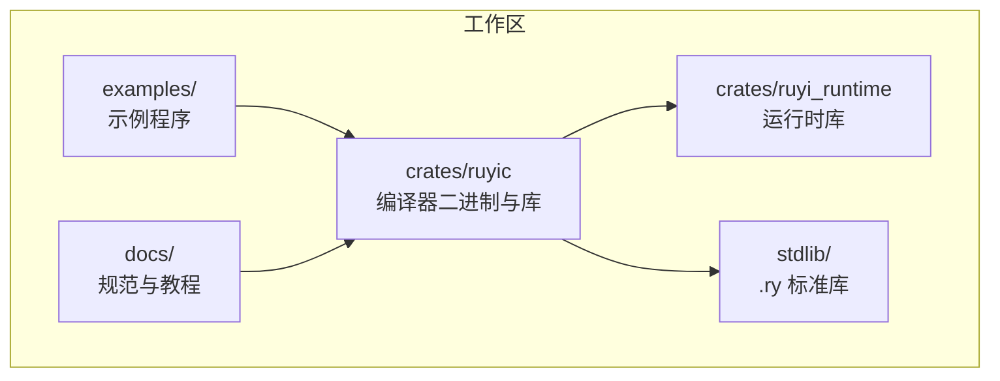
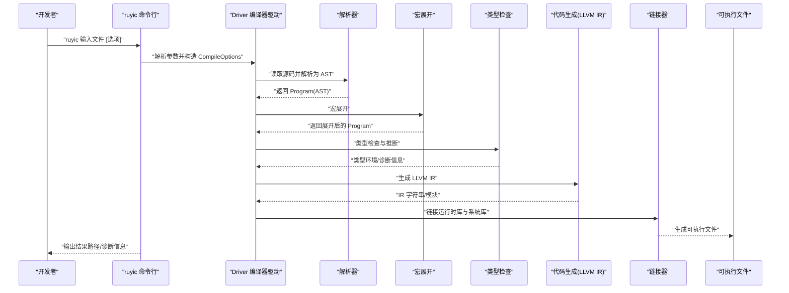
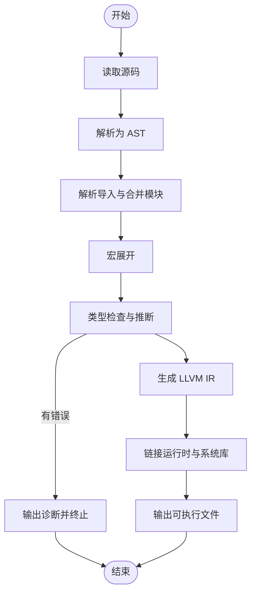
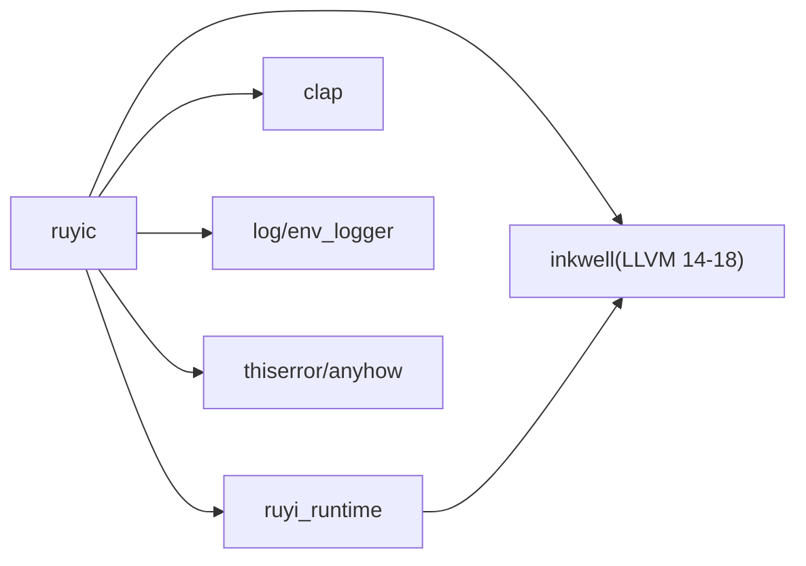

# 快速开始

<cite>
**本文引用的文件**
- [README.md](file://README.md)
- [Cargo.toml](file://Cargo.toml)
- [Makefile](file://Makefile)
- [crates/ruyic/Cargo.toml](file://crates/ruyic/Cargo.toml)
- [crates/ruyi_runtime/Cargo.toml](file://crates/ruyi_runtime/Cargo.toml)
- [crates/ruyic/src/main.rs](file://crates/ruyic/src/main.rs)
- [crates/ruyic/src/driver.rs](file://crates/ruyic/src/driver.rs)
- [crates/ruyic/src/codegen/generator.rs](file://crates/ruyic/src/codegen/generator.rs)
- [examples/hello.ry](file://examples/hello.ry)
- [examples/run_examples.sh](file://examples/run_examples.sh)
- [stdlib/core.ry](file://stdlib/core.ry)
- [stdlib/error.ry](file://stdlib/error.ry)
- [.omo/evidence/task-1-linker.txt](file://.omo/evidence/task-1-linker.txt)
</cite>

## 目录
1. [简介](#简介)
2. [项目结构](#项目结构)
3. [核心组件](#核心组件)
4. [架构总览](#架构总览)
5. [详细组件分析](#详细组件分析)
6. [依赖关系分析](#依赖关系分析)
7. [性能与优化](#性能与优化)
8. [故障排除指南](#故障排除指南)
9. [结论](#结论)
10. [附录](#附录)

## 简介
本指南面向首次接触 Ruyi 编程语言的新用户，帮助你在最短时间内完成安装、从源码构建、编写并运行第一个 Hello World 程序，并掌握编译器的基本用法与常见问题排查方法。Ruyi 是一门面向高性能的编译型通用语言，语法在严格模式 JavaScript 的基础上进行取舍，通过 LLVM 将源码编译为原生机器码，支持渐进式类型、空安全、模式匹配、特性（Trait）、泛型、异步/await、异常处理与宏等现代语言特性。

## 项目结构
仓库采用多 crate 工作区组织，核心由以下部分组成：
- crates/ruyic：编译器二进制与库，负责命令行解析、编译流程编排、词法/语法/宏展开、类型检查、LLVM IR 生成与链接。
- crates/ruyi_runtime：运行时库（GC、异步、异常等），作为 ruyic 生成二进制的链接目标。
- stdlib：标准库源码（.ry 文件），自动加载到每个程序中。
- examples：示例程序集合，包含基础到高级的用法演示。
- docs：语言规范与教程文档。
- Makefile：提供常用构建、测试、格式化、示例运行等便捷命令。

图表来源
- [Cargo.toml:1-40](file://Cargo.toml#L1-L40)
- [crates/ruyic/Cargo.toml:1-26](file://crates/ruyic/Cargo.toml#L1-L26)
- [crates/ruyi_runtime/Cargo.toml:1-17](file://crates/ruyi_runtime/Cargo.toml#L1-L17)

章节来源
- [Cargo.toml:1-40](file://Cargo.toml#L1-L40)
- [README.md:75-99](file://README.md#L75-L99)

## 核心组件
- 编译器二进制 ruyic：提供命令行接口，支持多种输出与调试选项，驱动完整编译流水线。
- 编译器驱动 driver：负责模块解析、AST 合并与导入处理、宏展开、类型检查、代码生成与链接。
- 运行时库 ruyi_runtime：提供 GC、异步调度、异常处理等运行时能力，供最终二进制链接。
- 标准库 stdlib：自动注入到所有程序中的基础库，如 core、error、collections 等。

章节来源
- [crates/ruyic/src/main.rs:16-44](file://crates/ruyic/src/main.rs#L16-L44)
- [crates/ruyic/src/driver.rs:242-256](file://crates/ruyic/src/driver.rs#L242-L256)
- [crates/ruyi_runtime/Cargo.toml:8-9](file://crates/ruyi_runtime/Cargo.toml#L8-L9)

## 架构总览
下图展示了从源码到可执行文件的端到端编译流程：

图表来源
- [crates/ruyic/src/main.rs:46-113](file://crates/ruyic/src/main.rs#L46-L113)
- [crates/ruyic/src/driver.rs:258-632](file://crates/ruyic/src/driver.rs#L258-L632)

## 详细组件分析

### 安装与前置条件
- 系统要求与前置条件
  - Rust（2021 edition）
  - LLVM 14（用于完整构建）
    - macOS：先安装 llvm@14 并设置 LLVM_SYS_140_PREFIX
    - Linux：通过包管理器安装 llvm-14-dev
- 可选：安装 RUYI_HOME 以启用标准库查找与安装 ruyic 到本地目录

章节来源
- [README.md:26-32](file://README.md#L26-L32)
- [Makefile:9-11](file://Makefile#L9-L11)

### 从源码构建
- 克隆仓库并进入目录
- 使用 cargo 或 Makefile 构建
  - cargo build --release（生成 ./target/release/ruyic）
  - make build-release（同上，含提示）
  - make build（别名）
- 可选：仅检查运行时（无 LLVM 依赖）make build-runtime 或 cargo check -p ruyi_runtime --no-default-features

章节来源
- [README.md:33-41](file://README.md#L33-L41)
- [Makefile:18-29](file://Makefile#L18-L29)
- [Cargo.toml:33-40](file://Cargo.toml#L33-L40)

### 第一个 Hello World 程序
- 创建 hello.ry（内容见示例）
- 编译：./target/release/ruyic hello.ry -o hello
- 运行：./hello

章节来源
- [README.md:43-56](file://README.md#L43-L56)
- [examples/hello.ry:1-2](file://examples/hello.ry#L1-L2)

### 编译器基本使用
- 基本命令：ruyic <输入文件> [选项]
- 主要选项
  - -o <输出>：指定输出二进制名称
  - --emit-llvm：输出 LLVM IR 而非二进制
  - --emit-ast：输出 AST（调试）
  - --emit-typed-ast：输出带类型标注的 AST（调试）
  - --check：仅解析与类型检查（不进行代码生成）
  - -O0/-O1/-O2：优化级别（默认 -O0）
  - --debug：包含调试符号
  - --version：打印版本
- 高级选项
  - --target：目标三元组（如 x86_64-unknown-linux-gnu）

章节来源
- [README.md:58-74](file://README.md#L58-L74)
- [crates/ruyic/src/main.rs:16-44](file://crates/ruyic/src/main.rs#L16-L44)

### 编译流程与内部机制
- 模块解析与导入
  - 支持相对路径、绝对路径、RUYI_HOME/stdlib、搜索路径与本地 stdlib 目录
  - 自动加载 error、core、collections 等核心模块
- 宏展开与类型检查
  - 展开内置与声明式宏后进行类型检查与推断
- 代码生成与链接
  - 生成 LLVM IR 并根据优化级别编译为目标二进制
  - 链接运行时库与数学/标准 C++ 运行库（平台区分）

图表来源
- [crates/ruyic/src/driver.rs:303-512](file://crates/ruyic/src/driver.rs#L303-L512)
- [crates/ruyic/src/driver.rs:521-632](file://crates/ruyic/src/driver.rs#L521-L632)

章节来源
- [crates/ruyic/src/driver.rs:149-240](file://crates/ruyic/src/driver.rs#L149-L240)
- [crates/ruyic/src/driver.rs:331-354](file://crates/ruyic/src/driver.rs#L331-L354)
- [crates/ruyic/src/driver.rs:521-632](file://crates/ruyic/src/driver.rs#L521-L632)

### 示例运行与验证
- 使用 Makefile 提供的示例运行脚本
  - make run-example EXAMPLE=hello：编译并运行示例
  - make compile-example EXAMPLE=hello：输出 LLVM IR
  - make compile-file FILE=path/to/file.ry：编译单个 .ry 文件
- examples/run_examples.sh：批量编译、运行并对比 .expected 输出基线，支持 --verify 与 --update 模式

章节来源
- [Makefile:69-104](file://Makefile#L69-L104)
- [examples/run_examples.sh:157-194](file://examples/run_examples.sh#L157-L194)

## 依赖关系分析
- 工作区与依赖
  - 工作区统一版本与 Rust edition
  - ruyic 依赖 ruyi_runtime、inkwell（绑定 LLVM 14-18）、clap、日志与错误处理库
  - ruyi_runtime 默认启用 inkwell 特性，可选择关闭以避免 LLVM 依赖
- 链接阶段平台差异
  - 针对异常处理场景，链接时按平台选择 -lc++ 或 -lstdc++

图表来源
- [Cargo.toml:14-27](file://Cargo.toml#L14-L27)
- [crates/ruyic/Cargo.toml:19-26](file://crates/ruyic/Cargo.toml#L19-L26)
- [crates/ruyi_runtime/Cargo.toml:11-16](file://crates/ruyi_runtime/Cargo.toml#L11-L16)

章节来源
- [Cargo.toml:14-27](file://Cargo.toml#L14-L27)
- [crates/ruyic/Cargo.toml:19-26](file://crates/ruyic/Cargo.toml#L19-L26)
- [crates/ruyi_runtime/Cargo.toml:11-16](file://crates/ruyi_runtime/Cargo.toml#L11-L16)
- [.omo/evidence/task-1-linker.txt:12-17](file://.omo/evidence/task-1-linker.txt#L12-L17)

## 性能与优化
- 优化级别
  - -O0：默认，便于调试
  - -O1/-O2：开启更高优化，适合发布构建
- 发布配置
  - 启用 LTO、单代码生成单元，提升运行时性能
- 建议
  - 开发阶段使用 -O0；发布阶段使用 -O2

章节来源
- [Cargo.toml:37-40](file://Cargo.toml#L37-L40)
- [crates/ruyic/src/main.rs:72-77](file://crates/ruyic/src/main.rs#L72-L77)

## 故障排除指南
- 未找到 LLVM 14
  - 现象：构建 ruyic 失败或链接阶段报错
  - 处理：安装 llvm-14-dev（Linux）或 brew install llvm@14 并设置 LLVM_SYS_140_PREFIX（macOS）
- 链接异常（如 undefined symbol: __gxx_personality_v0）
  - 现象：启用 try/catch 异常处理时链接失败
  - 处理：确认链接器已添加平台特定 C++ 运行库标志（-lc++ 或 -lstdc++）
- 无法找到标准库模块
  - 现象：导入 stdlib 模块时报模块未找到
  - 处理：设置 RUYI_HOME 或确保 stdlib 目录存在；driver 会优先尝试 RUYI_HOME/stdlib、当前目录与搜索路径
- 无输出或输出路径不正确
  - 现象：--emit-llvm 未生成 .ll 文件
  - 处理：确认输出目录存在或让编译器自动创建 target 目录；检查 -o 选项与输入文件路径
- 平台差异导致的链接问题
  - 现象：macOS/Linux 链接不同步
  - 处理：遵循 Makefile 中的平台区分策略，确保链接了正确的 C++ 运行库

章节来源
- [README.md:26-32](file://README.md#L26-L32)
- [.omo/evidence/task-1-linker.txt:12-17](file://.omo/evidence/task-1-linker.txt#L12-L17)
- [crates/ruyic/src/driver.rs:175-234](file://crates/ruyic/src/driver.rs#L175-L234)
- [crates/ruyic/src/codegen/generator.rs:767-794](file://crates/ruyic/src/codegen/generator.rs#L767-L794)

## 结论
通过本指南，你已经完成了 Ruyi 的安装与构建，成功运行了第一个 Hello World 程序，并掌握了编译器的主要选项与基本原理。建议继续探索 examples 与 stdlib，逐步深入语言特性与最佳实践。

## 附录

### 常用命令速查
- 构建
  - cargo build --release
  - make build-release
- 运行示例
  - make run-example EXAMPLE=hello
- 仅检查
  - cargo check --workspace
  - make check
- 格式化与 Lint
  - cargo fmt
  - cargo clippy --workspace

章节来源
- [README.md:101-119](file://README.md#L101-L119)
- [Makefile:37-66](file://Makefile#L37-L66)