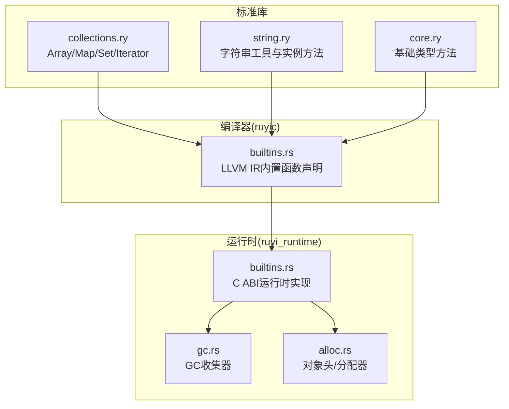
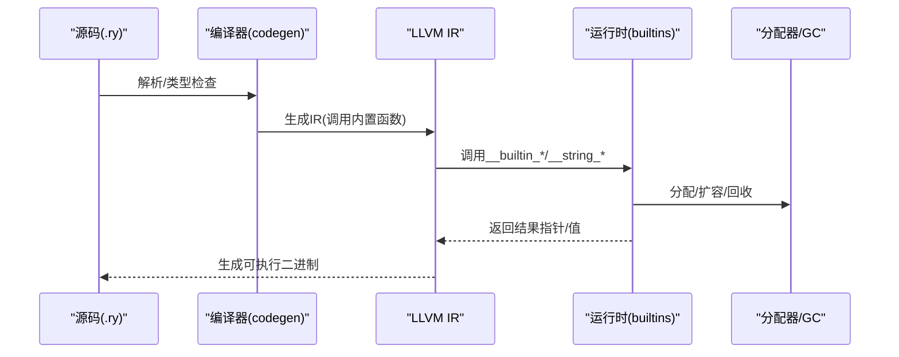
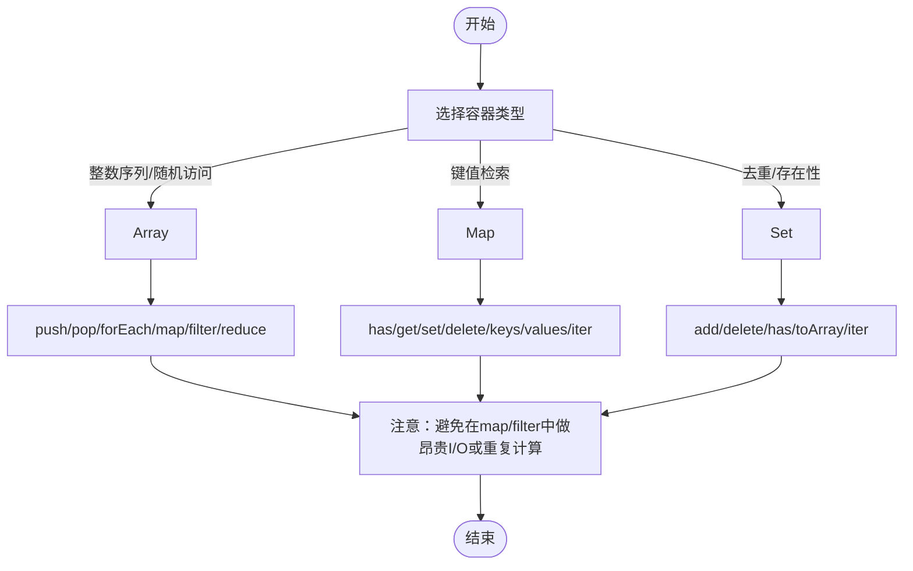
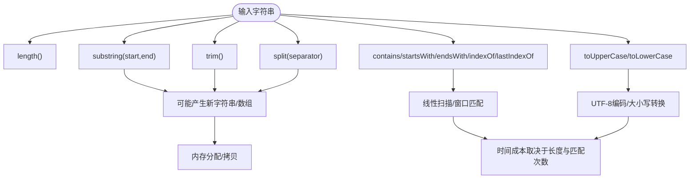
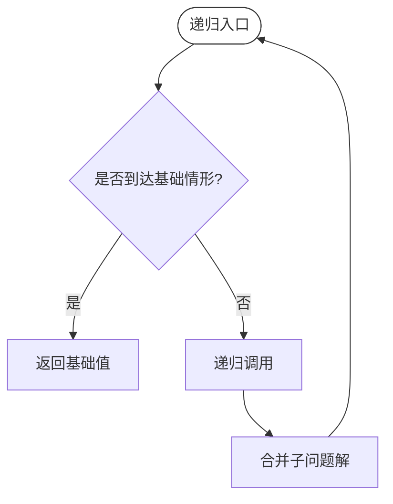
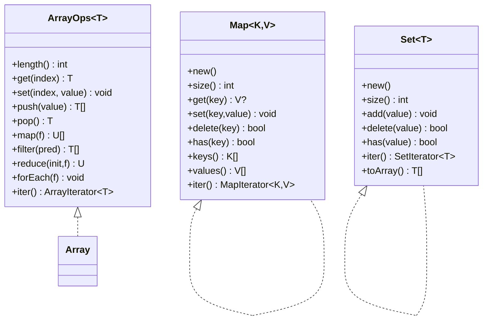
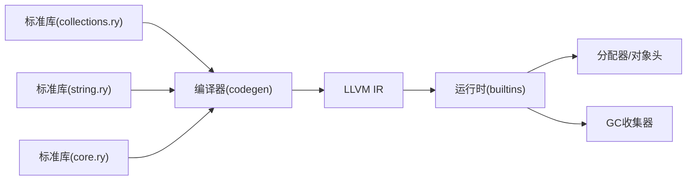

# 代码级优化

<cite>
**本文引用的文件**
- [README.md](file://README.md)
- [Cargo.toml](file://Cargo.toml)
- [stdlib/collections.ry](file://stdlib/collections.ry)
- [stdlib/string.ry](file://stdlib/string.ry)
- [stdlib/core.ry](file://stdlib/core.ry)
- [crates/ruyic/src/codegen/builtins.rs](file://crates/ruyic/src/codegen/builtins.rs)
- [crates/ruyi_runtime/src/builtins.rs](file://crates/ruyi_runtime/src/builtins.rs)
- [crates/ruyi_runtime/src/gc.rs](file://crates/ruyi_runtime/src/gc.rs)
- [crates/ruyi_runtime/src/alloc.rs](file://crates/ruyi_runtime/src/alloc.rs)
- [examples/fibonacci.ry](file://examples/fibonacci.ry)
- [examples/functions.ry](file://examples/functions.ry)
- [examples/stdlib_map_filter.ry](file://examples/stdlib_map_filter.ry)
- [examples/stdlib_string_test.ry](file://examples/stdlib_string_test.ry)
</cite>

## 目录
1. [引言](#引言)
2. [项目结构](#项目结构)
3. [核心组件](#核心组件)
4. [架构总览](#架构总览)
5. [详细组件分析](#详细组件分析)
6. [依赖关系分析](#依赖关系分析)
7. [性能考量与优化建议](#性能考量与优化建议)
8. [故障排查指南](#故障排查指南)
9. [结论](#结论)
10. [附录](#附录)

## 引言
本指南聚焦于Ruyi语言在代码级层面的性能优化实践，结合编译器与运行时的实现细节，系统讲解数据结构选择、算法实现策略、函数式编程模式的性能权衡、内置函数与标准库API的性能特征、缓存友好编程与内存访问优化，并给出常见性能反模式与重构建议。目标是帮助开发者在Ruyi生态中写出高性能且可维护的代码。

## 项目结构
Ruyi采用“编译器+运行时+标准库”的分层设计：
- 编译器（crates/ruyic）：负责词法/语法/类型检查、LLVM IR生成、内置函数声明与调用桥接。
- 运行时（crates/ruyi_runtime）：提供GC/ARC、分配器、异常、异步调度等底层能力。
- 标准库（stdlib/*.ry）：提供集合、字符串、核心类型方法等通用能力，通过__builtin_*与运行时对接。

**图表来源**
- [crates/ruyic/src/codegen/builtins.rs:15-85](file://crates/ruyic/src/codegen/builtins.rs#L15-L85)
- [crates/ruyi_runtime/src/builtins.rs:1-120](file://crates/ruyi_runtime/src/builtins.rs#L1-L120)
- [stdlib/collections.ry:1-120](file://stdlib/collections.ry#L1-L120)
- [stdlib/string.ry:1-120](file://stdlib/string.ry#L1-L120)
- [stdlib/core.ry:1-31](file://stdlib/core.ry#L1-L31)

**章节来源**
- [README.md:75-99](file://README.md#L75-L99)
- [Cargo.toml:1-40](file://Cargo.toml#L1-L40)

## 核心组件
- 集合与迭代器
  - Array<T>扩展（ArrayOps）：提供长度、索引、push/pop、map/filter/reduce/forEach/iter等。
  - Map<K,V>与Set<T>：基于Box<Hash*<>*>的实现，提供has/get/set/delete/keys/values/iter等。
  - Iterator<T>：统一遍历接口。
- 字符串工具与实例方法
  - 独立工具函数：join/fromCharCode/fromCharCodes/concat/template/processTemplate等。
  - 实例方法：length/contains/startsWith/endsWith/indexOf/lastIndexOf/substring/slice/trim/split等。
- 基础类型方法
  - Int/Float/Bool到string的转换。
- 内置函数桥接
  - 编译期声明大量__builtin_*与__string_*函数，运行时以C ABI实现，供标准库调用。

**章节来源**
- [stdlib/collections.ry:18-480](file://stdlib/collections.ry#L18-L480)
- [stdlib/string.ry:16-165](file://stdlib/string.ry#L16-L165)
- [stdlib/core.ry:12-31](file://stdlib/core.ry#L12-L31)
- [crates/ruyic/src/codegen/builtins.rs:15-85](file://crates/ruyic/src/codegen/builtins.rs#L15-L85)

## 架构总览
Ruyi的性能路径从源码到机器码的关键链路如下：
- 源码（.ry）经编译器解析、类型检查后生成LLVM IR。
- 编译器为标准库调用的__builtin_*与__string_*函数声明外部符号。
- 运行时以C ABI实现这些函数，负责实际的内存布局、哈希表、字符串拼接等。
- GC/ARC与分配器确保堆对象生命周期管理与内存安全。

**图表来源**
- [crates/ruyic/src/codegen/builtins.rs:15-85](file://crates/ruyic/src/codegen/builtins.rs#L15-L85)
- [crates/ruyi_runtime/src/builtins.rs:116-800](file://crates/ruyi_runtime/src/builtins.rs#L116-L800)
- [crates/ruyi_runtime/src/alloc.rs:233-298](file://crates/ruyi_runtime/src/alloc.rs#L233-L298)

## 详细组件分析

### 数组与集合：数据结构选择与实现要点
- 数组
  - 访问模式：O(1)随机访问；push按需扩容（典型倍增策略），摊销O(1)。
  - 遍历与高阶：forEach/map/filter/reduce均线性扫描，注意避免在map/filter中进行昂贵的副作用或重复计算。
- 映射（Map）
  - 基于HashMap<i64,i64>的键值对存储，has/get/set/delete/keys/values均为平均O(1)。
  - keys/values返回新的数组，注意大集合上避免频繁复制。
- 集合（Set）
  - 基于HashSet<i64>，add/delete/has平均O(1)，内部同时维护元素数组用于迭代。
- 迭代器
  - ArrayIterator/MapIterator/SetIterator提供顺序遍历，适合惰性处理与链式组合。

**图表来源**
- [stdlib/collections.ry:108-186](file://stdlib/collections.ry#L108-L186)
- [stdlib/collections.ry:229-330](file://stdlib/collections.ry#L229-L330)
- [stdlib/collections.ry:365-456](file://stdlib/collections.ry#L365-L456)

**章节来源**
- [stdlib/collections.ry:18-480](file://stdlib/collections.ry#L18-L480)

### 字符串处理：性能特征与实践
- 工具函数
  - join：按分隔符连接数组元素，涉及多次内存分配与拷贝，建议批量构造或复用缓冲。
  - fromCharCode/fromCharCodes：编码单字符或码点序列，UTF-8编码开销与长度相关。
  - replace_all：朴素替换，时间复杂度与匹配次数成正比，大文本建议预估大小或使用更高效的算法。
- 实例方法
  - length/contains/startsWith/endsWith/indexOf/lastIndexOf：基于字节窗口扫描，空串匹配与边界条件需关注。
  - substring/slice/trim/split：涉及子串复制与新数组分配，避免在热路径中频繁调用。

**图表来源**
- [stdlib/string.ry:104-165](file://stdlib/string.ry#L104-L165)
- [crates/ruyi_runtime/src/builtins.rs:505-708](file://crates/ruyi_runtime/src/builtins.rs#L505-L708)

**章节来源**
- [stdlib/string.ry:16-165](file://stdlib/string.ry#L16-L165)
- [crates/ruyi_runtime/src/builtins.rs:505-800](file://crates/ruyi_runtime/src/builtins.rs#L505-L800)

### 函数式编程模式的性能考量
- 递归与尾递归
  - 示例中的斐波那契为指数时间复杂度，不适用于大规模输入。建议改写为迭代或记忆化递归。
- 高阶函数与惰性
  - map/filter/reduce在集合上按顺序扫描，适合表达清晰但要注意避免在f中引入昂贵副作用。
- 箭头函数
  - 简洁表达式可减少样板代码，但需避免在闭包中捕获大对象导致额外持有。

**图表来源**
- [examples/fibonacci.ry:2-7](file://examples/fibonacci.ry#L2-L7)

**章节来源**
- [examples/fibonacci.ry:1-19](file://examples/fibonacci.ry#L1-L19)
- [examples/functions.ry:42-62](file://examples/functions.ry#L42-L62)
- [examples/stdlib_map_filter.ry:7-25](file://examples/stdlib_map_filter.ry#L7-L25)

### 内置函数与运行时：性能边界
- 编译器侧
  - 通过declare_*系列函数声明所有__builtin_*与__string_*外部符号，确保LLVM IR能正确链接运行时实现。
- 运行时侧
  - 数组：push按需扩容（倍增），pop直接降长度；get/set基于偏移读写。
  - Map/Set：基于Box<Hash*<>>，提供平均O(1)操作；keys/values会新建数组。
  - 字符串：join/replace_all等涉及多段内存拼接与拷贝，注意大对象与高频调用的成本。
  - 类型到字符串：int/float/bool转字符串通过格式化分配新C字符串，调用方需释放。

**图表来源**
- [stdlib/collections.ry:39-106](file://stdlib/collections.ry#L39-L106)
- [stdlib/collections.ry:229-330](file://stdlib/collections.ry#L229-L330)
- [stdlib/collections.ry:365-456](file://stdlib/collections.ry#L365-L456)

**章节来源**
- [crates/ruyic/src/codegen/builtins.rs:15-85](file://crates/ruyic/src/codegen/builtins.rs#L15-L85)
- [crates/ruyi_runtime/src/builtins.rs:116-800](file://crates/ruyi_runtime/src/builtins.rs#L116-L800)
- [stdlib/collections.ry:18-480](file://stdlib/collections.ry#L18-L480)

## 依赖关系分析
- 编译器对运行时的依赖
  - 编译器在codegen阶段声明所有内置函数，运行时以C ABI实现，二者通过符号名严格对应。
- 标准库对运行时的依赖
  - 所有集合与字符串操作最终调用__builtin_*与__string_*，由运行时完成实际内存布局与算法。
- 内存管理耦合
  - GC/ARC与分配器位于运行时，编译器通过内置函数间接触发分配、扩容与回收。

**图表来源**
- [crates/ruyic/src/codegen/builtins.rs:15-85](file://crates/ruyic/src/codegen/builtins.rs#L15-L85)
- [crates/ruyi_runtime/src/builtins.rs:116-800](file://crates/ruyi_runtime/src/builtins.rs#L116-L800)
- [stdlib/collections.ry:18-480](file://stdlib/collections.ry#L18-L480)
- [stdlib/string.ry:16-165](file://stdlib/string.ry#L16-L165)
- [stdlib/core.ry:12-31](file://stdlib/core.ry#L12-L31)

**章节来源**
- [crates/ruyic/src/codegen/builtins.rs:15-85](file://crates/ruyic/src/codegen/builtins.rs#L15-L85)
- [crates/ruyi_runtime/src/builtins.rs:116-800](file://crates/ruyi_runtime/src/builtins.rs#L116-L800)

## 性能考量与优化建议

### 数据结构选择与使用场景
- 数组
  - 适用：需要O(1)随机访问、顺序遍历、尾部插入/弹出。
  - 优化：尽量批量扩容（减少多次realloc），避免在map/filter中做昂贵副作用；必要时先过滤再map。
- 映射
  - 适用：键值查找/更新为主，允许重复键覆盖。
  - 优化：避免在keys/values上做重型操作；若需稳定遍历，考虑先缓存keys。
- 集合
  - 适用：去重与存在性检查。
  - 优化：利用has快速短路；删除时注意内部数组的线性查找与移动。

**章节来源**
- [stdlib/collections.ry:108-186](file://stdlib/collections.ry#L108-L186)
- [stdlib/collections.ry:229-330](file://stdlib/collections.ry#L229-L330)
- [stdlib/collections.ry:365-456](file://stdlib/collections.ry#L365-L456)

### 函数式编程的性能权衡
- 递归优化
  - 将指数递归改为迭代或带memo的自底向上动态规划。
- 尾递归转换
  - 在支持的语言特性下优先使用尾递归，减少栈帧压力。
- 惰性求值
  - 利用迭代器链式组合，延迟计算，但注意不要过度嵌套导致多次遍历。

**章节来源**
- [examples/fibonacci.ry:2-7](file://examples/fibonacci.ry#L2-L7)
- [examples/stdlib_map_filter.ry:7-25](file://examples/stdlib_map_filter.ry#L7-L25)

### 内置函数与标准库API的性能特征
- 数组
  - push：摊销O(1)，注意容量翻倍带来的拷贝成本。
  - get/set：O(1)，注意越界检查与异常抛出的代价。
- 映射/集合
  - has/get/set/delete：平均O(1)，最坏O(n)退化风险；键类型需保证良好散列。
- 字符串
  - join/replace_all：涉及多次分配与拷贝，建议批量构建或使用StringBuilder风格的缓冲策略。
  - contains/startsWith/endsWith/indexOf：线性扫描，空串匹配需特殊处理。

**章节来源**
- [crates/ruyi_runtime/src/builtins.rs:274-329](file://crates/ruyi_runtime/src/builtins.rs#L274-L329)
- [crates/ruyi_runtime/src/builtins.rs:336-449](file://crates/ruyi_runtime/src/builtins.rs#L336-L449)
- [crates/ruyi_runtime/src/builtins.rs:505-800](file://crates/ruyi_runtime/src/builtins.rs#L505-L800)

### 缓存友好编程与内存访问优化
- 对象布局与对齐
  - 运行时对象头包含标志位、引用计数、类型信息、大小与转发指针，遵循特定对齐规则。
- 分配与扩容
  - 分配器采用系统分配，对象头+载荷整体分配；扩容时可能触发realloc与拷贝。
- GC/ARC策略
  - GC采用标记-清扫与分代策略，写屏障与根集管理影响吞吐；合理设置根集与减少跨代引用可降低停顿。

**章节来源**
- [crates/ruyi_runtime/src/alloc.rs:64-181](file://crates/ruyi_runtime/src/alloc.rs#L64-L181)
- [crates/ruyi_runtime/src/alloc.rs:233-298](file://crates/ruyi_runtime/src/alloc.rs#L233-L298)
- [crates/ruyi_runtime/src/gc.rs:15-192](file://crates/ruyi_runtime/src/gc.rs#L15-L192)

### 常见性能反模式与重构建议
- 反模式
  - 在map/filter中执行I/O或网络请求。
  - 频繁调用字符串join与replace_all，未做缓冲或批量化。
  - 使用集合的keys/values作为中间步骤进行二次遍历。
- 重构建议
  - 将副作用抽取到forEach之后的显式循环。
  - 使用StringBuilder风格的缓冲一次性拼接，或预先估算容量。
  - 先过滤再map，减少不必要的元素处理。

**章节来源**
- [stdlib/collections.ry:138-181](file://stdlib/collections.ry#L138-L181)
- [stdlib/string.ry:22-74](file://stdlib/string.ry#L22-L74)

### 针对Ruyi语言特性的优化最佳实践
- 严格类型与无undefined
  - 利用严格的相等比较与明确的null类型，减少隐式转换与错误分支。
- 渐进式类型
  - 在热点路径上使用静态类型注解，帮助编译器生成更紧凑的IR。
- 异步与并发
  - 合理使用异步原语，避免阻塞式等待；任务调度与唤醒机制有助于提升吞吐。

**章节来源**
- [README.md:121-137](file://README.md#L121-L137)
- [crates/ruyic/src/codegen/builtins.rs:296-523](file://crates/ruyic/src/codegen/builtins.rs#L296-L523)

## 故障排查指南
- 数组越界
  - get/set在越界时抛出RangeError，应在外围校验索引范围或使用安全访问模式。
- 空字符串与空集合
  - contains/startsWith/endsWith/keys/values等在空输入上的行为需明确预期，避免误判。
- 内存泄漏风险
  - 运行时对字符串与数组的分配当前未由GC接管，频繁字符串操作可能导致泄漏，建议在高频路径上优化或等待GC集成。
- GC停顿与根集
  - 大量临时对象与不当根集注册会导致GC停顿；可通过减少中间对象与控制根集规模缓解。

**章节来源**
- [stdlib/collections.ry:113-136](file://stdlib/collections.ry#L113-L136)
- [crates/ruyi_runtime/src/builtins.rs:495-555](file://crates/ruyi_runtime/src/builtins.rs#L495-L555)
- [crates/ruyi_runtime/src/gc.rs:117-157](file://crates/ruyi_runtime/src/gc.rs#L117-L157)

## 结论
Ruyi在编译期通过LLVM IR与运行时C ABI实现高性能的集合与字符串操作，配合GC/ARC与分代策略，为应用提供了安全而高效的内存管理。在代码级优化方面，应优先选择合适的数据结构、避免在函数式管道中引入昂贵副作用、重视字符串与集合的批量处理与缓存友好访问，并通过合理的根集与分配策略降低GC开销。遵循本文建议，可在Ruyi生态中获得稳定且可预测的性能表现。

## 附录
- 快速参考
  - 数组：push/pop/forEach/map/filter/reduce/iter
  - 映射：has/get/set/delete/keys/values/iter
  - 集合：has/add/delete/toArray/iter
  - 字符串：join/fromCharCode/fromCharCodes/concat/template/processTemplate及实例方法

**章节来源**
- [stdlib/collections.ry:18-480](file://stdlib/collections.ry#L18-L480)
- [stdlib/string.ry:16-165](file://stdlib/string.ry#L16-L165)
- [stdlib/core.ry:12-31](file://stdlib/core.ry#L12-L31)