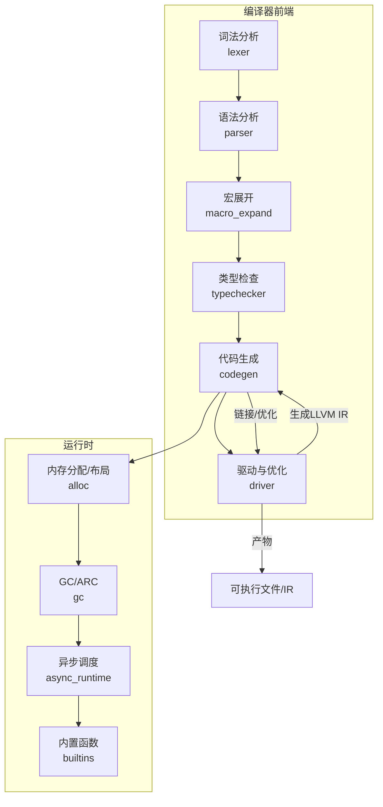
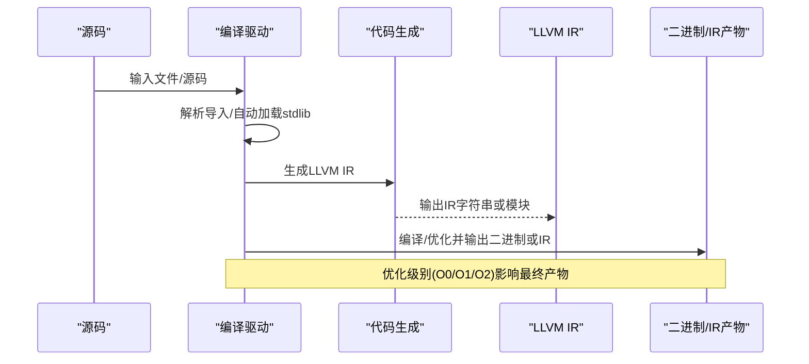
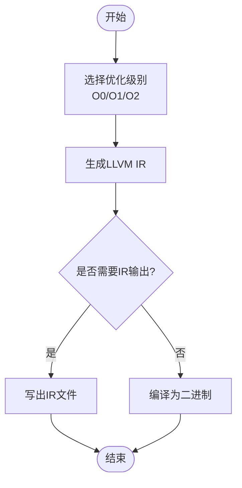
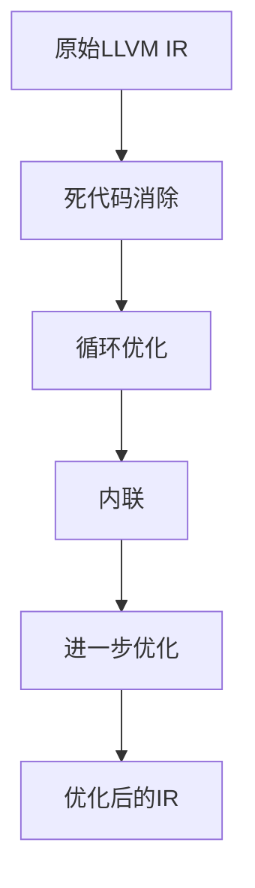
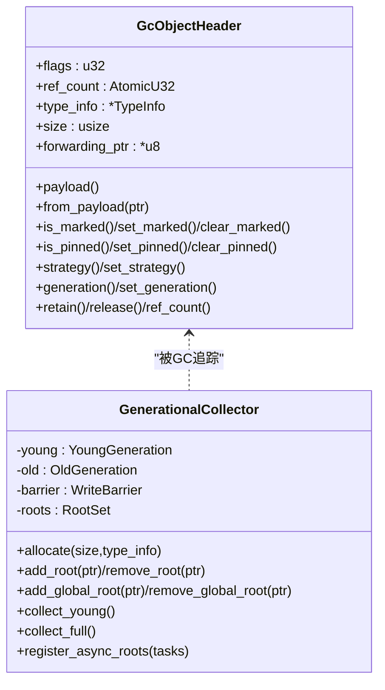
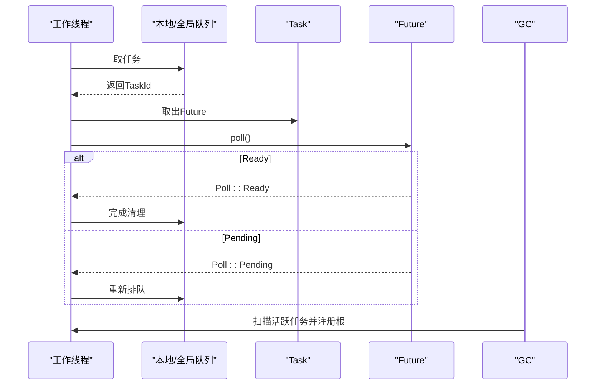
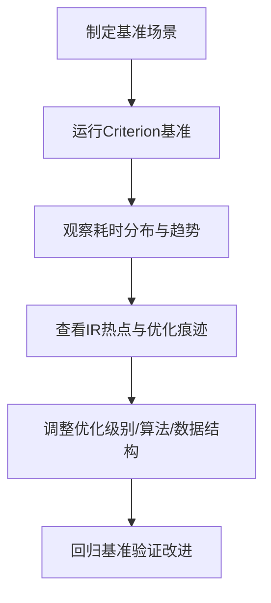
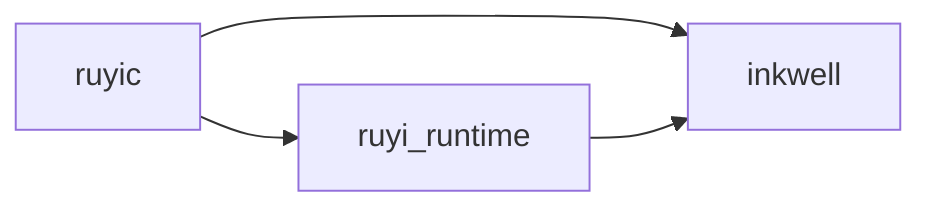

# 性能优化

<cite>
**本文档引用的文件**
- [lib.rs](file://crates/ruyic/src/lib.rs)
- [driver.rs](file://crates/ruyic/src/driver.rs)
- [mod.rs](file://crates/ruyic/src/codegen/mod.rs)
- [stmt.rs](file://crates/ruyic/src/codegen/stmt.rs)
- [builtins.rs](file://crates/ruyic/src/codegen/builtins.rs)
- [main.rs](file://crates/ruyic/benches/main.rs)
- [lib.rs](file://crates/ruyi_runtime/src/lib.rs)
- [alloc.rs](file://crates/ruyi_runtime/src/alloc.rs)
- [gc.rs](file://crates/ruyi_runtime/src/gc.rs)
- [generational.rs](file://crates/ruyi_runtime/src/gc/generational.rs)
- [async_runtime.rs](file://crates/ruyi_runtime/src/async_runtime.rs)
- [builtins.rs](file://crates/ruyi_runtime/src/builtins.rs)
- [Cargo.toml](file://crates/ruyic/Cargo.toml)
- [Cargo.toml](file://crates/ruyi_runtime/Cargo.toml)
- [task-3-opt-chain-ll.txt](file://.omo/evidence/task-3-opt-chain-ll.txt)
- [INT1_for_break.txt](file://.omo/evidence/final-qa/INT1_for_break.txt)
- [T2_break_continue.txt](file://.omo/evidence/final-qa/T2_break_continue.txt)
- [learnings.md](file://.omo/notepads/implement-map-builtins/learnings.md)
- [process.ry](file://stdlib/process.ry)
- [async_comprehensive.ry](file://examples/async_comprehensive.ry)
- [async.ry](file://examples/async.ry)
</cite>

## 目录
1. [引言](#引言)
2. [项目结构](#项目结构)
3. [核心组件](#核心组件)
4. [架构总览](#架构总览)
5. [详细组件分析](#详细组件分析)
6. [依赖关系分析](#依赖关系分析)
7. [性能考量与优化策略](#性能考量与优化策略)
8. [故障排查指南](#故障排查指南)
9. [结论](#结论)
10. [附录](#附录)

## 引言
本指南面向Ruyi语言的性能优化实践，覆盖编译期优化选项与优化级别选择策略、LLVM优化Pass的作用与效果、运行时性能优化（GC调优与内存分配）、异步编程与并发优化、缓存友好的数据结构与算法、性能分析与瓶颈定位、代码级优化建议与反模式规避、基准测试与测量标准，以及平台特定优化与跨平台兼容性。文档以仓库中实际实现为依据，结合基准测试与证据文件，给出可操作的优化建议。

## 项目结构
Ruyi由两大部分组成：
- 编译器前端与代码生成：位于 ruyi_compiler（crates/ruyic），负责词法/语法/类型检查、宏展开、LLVM IR生成与二进制输出。
- 运行时与GC：位于 ruyi_runtime（crates/ruyi_runtime），提供GC、ARC、异步调度、内置函数等运行时能力，并通过Inkwell与LLVM交互。

图示来源
- [driver.rs:242-737](file://crates/ruyic/src/driver.rs#L242-L737)
- [lib.rs:1-21](file://crates/ruyic/src/lib.rs#L1-L21)
- [lib.rs:1-49](file://crates/ruyi_runtime/src/lib.rs#L1-L49)

章节来源
- [lib.rs:1-21](file://crates/ruyic/src/lib.rs#L1-L21)
- [driver.rs:1-138](file://crates/ruyic/src/driver.rs#L1-L138)

## 核心组件
- 编译驱动与优化级别
  - 编译驱动定义了优化级别枚举与编译流程，支持O0/O1/O2，并在生成LLVM IR后进行二进制编译。
- 代码生成与LLVM IR
  - 代码生成模块将AST转换为LLVM IR，内置对数组/对象/映射等内置类型的声明与调用。
- 运行时内存与GC
  - 提供统一的对象头与分配器，支持GC与ARC两种策略；GC采用分代收集（年轻代复制+老年代标记-压缩）。
- 异步运行时
  - 基于工作窃取队列的多线程调度器，支持Future/Poll/Waker模型，并与GC根集集成。
- 基准测试
  - 使用Criterion对词法、语法、类型检查、代码生成与整体编译时间进行基准测试。

章节来源
- [driver.rs:101-138](file://crates/ruyic/src/driver.rs#L101-L138)
- [mod.rs:1-15](file://crates/ruyic/src/codegen/mod.rs#L1-L15)
- [builtins.rs:620-652](file://crates/ruyic/src/codegen/builtins.rs#L620-L652)
- [alloc.rs:1-181](file://crates/ruyi_runtime/src/alloc.rs#L1-L181)
- [generational.rs:1-743](file://crates/ruyi_runtime/src/gc/generational.rs#L1-L743)
- [async_runtime.rs:1-655](file://crates/ruyi_runtime/src/async_runtime.rs#L1-L655)
- [main.rs:1-344](file://crates/ruyic/benches/main.rs#L1-L344)

## 架构总览
下图展示编译期到运行时的关键交互，以及LLVM优化在编译链路中的位置。

图示来源
- [driver.rs:522-632](file://crates/ruyic/src/driver.rs#L522-L632)

章节来源
- [driver.rs:522-632](file://crates/ruyic/src/driver.rs#L522-L632)

## 详细组件分析

### 编译器优化选项与优化级别
- 优化级别定义
  - O0：默认未优化构建，便于调试。
  - O1/O2：更高优化级别，提升运行时性能但可能增加编译时间。
- 优化生效点
  - 驱动在生成LLVM IR后调用编译器接口进行二进制输出，并传入优化级别。
- IR证据
  - 证据文件展示了LLVM IR中条件分支合并与phi节点的优化痕迹，体现基础优化链的效果。

图示来源
- [driver.rs:101-138](file://crates/ruyic/src/driver.rs#L101-L138)
- [driver.rs:616-631](file://crates/ruyic/src/driver.rs#L616-L631)
- [task-3-opt-chain-ll.txt:1-13](file://.omo/evidence/task-3-opt-chain-ll.txt#L1-L13)

章节来源
- [driver.rs:101-138](file://crates/ruyic/src/driver.rs#L101-L138)
- [driver.rs:616-631](file://crates/ruyic/src/driver.rs#L616-L631)
- [task-3-opt-chain-ll.txt:1-13](file://.omo/evidence/task-3-opt-chain-ll.txt#L1-L13)

### LLVM优化Pass的作用与效果
- 内联
  - 通过更高优化级别，编译器更倾向内联小函数，降低调用开销。
- 死代码消除
  - 移除不可达分支与未使用的中间值，减少指令数与寄存器压力。
- 循环优化
  - 条件简化、循环不变式外提、向量化（若适用）等，提升循环性能。
- IR证据
  - for/while/break/continue控制流在IR中表现为清晰的跳转图，有助于识别优化前后差异。

图示来源
- [stmt.rs:194-211](file://crates/ruyic/src/codegen/stmt.rs#L194-L211)
- [stmt.rs:357-400](file://crates/ruyic/src/codegen/stmt.rs#L357-L400)
- [stmt.rs:454-482](file://crates/ruyic/src/codegen/stmt.rs#L454-L482)
- [INT1_for_break.txt:1-11](file://.omo/evidence/final-qa/INT1_for_break.txt#L1-L11)
- [T2_break_continue.txt:1-11](file://.omo/evidence/final-qa/T2_break_continue.txt#L1-L11)

章节来源
- [stmt.rs:194-211](file://crates/ruyic/src/codegen/stmt.rs#L194-L211)
- [stmt.rs:357-400](file://crates/ruyic/src/codegen/stmt.rs#L357-L400)
- [stmt.rs:454-482](file://crates/ruyic/src/codegen/stmt.rs#L454-L482)
- [INT1_for_break.txt:1-11](file://.omo/evidence/final-qa/INT1_for_break.txt#L1-L11)
- [T2_break_continue.txt:1-11](file://.omo/evidence/final-qa/T2_break_continue.txt#L1-L11)

### 运行时性能优化：GC与内存分配
- 内存策略
  - 支持GC与ARC两种策略，对象头统一存储标志位、类型信息、大小与转发指针等。
- 分代GC
  - 年轻代采用复制收集，老年代采用标记-压缩（计划中），减少碎片并提升吞吐。
- 写屏障与记忆集合
  - 跟踪跨代指针，保证GC正确性与性能平衡。
- 异步任务根注册
  - 在GC前扫描挂起的异步任务，确保其可达对象不被回收。

图示来源
- [alloc.rs:74-181](file://crates/ruyi_runtime/src/alloc.rs#L74-L181)
- [generational.rs:21-144](file://crates/ruyi_runtime/src/gc/generational.rs#L21-L144)

章节来源
- [alloc.rs:1-181](file://crates/ruyi_runtime/src/alloc.rs#L1-L181)
- [generational.rs:1-144](file://crates/ruyi_runtime/src/gc/generational.rs#L1-L144)

### 异步编程与并发优化
- 调度器
  - 多工作线程，本地队列+全局队列+远程窃取，降低锁竞争与提高吞吐。
- Future/Poll/Waker
  - 通过Waker唤醒任务，避免忙等待；支持JoinAll/Race等组合器。
- 与GC集成
  - 在GC前扫描活跃任务，将其作为根注册，防止悬挂引用。

图示来源
- [async_runtime.rs:138-314](file://crates/ruyi_runtime/src/async_runtime.rs#L138-L314)
- [async_runtime.rs:426-455](file://crates/ruyi_runtime/src/async_runtime.rs#L426-L455)

章节来源
- [async_runtime.rs:1-655](file://crates/ruyi_runtime/src/async_runtime.rs#L1-L655)

### 缓存友好的数据结构与算法
- 数组/对象/映射布局
  - 数组：长度、容量、元素指针数组；对象：字段数量+字段指针数组；映射采用桶+链表结构，键值对紧凑存储。
- 内置函数
  - 提供数组/对象/映射的高效操作，避免重复封装与额外拷贝。
- 设计要点
  - 尽量顺序访问，减少跨页跳转；优先使用内置类型以获得稳定的内存布局与较低的间接成本。

章节来源
- [learnings.md:1-20](file://.omo/notepads/implement-map-builtins/learnings.md#L1-L20)
- [builtins.rs:355-450](file://crates/ruyi_runtime/src/builtins.rs#L355-L450)

### 性能分析与瓶颈识别
- 基准测试
  - 使用Criterion对词法、语法、类型检查、代码生成与整体编译时间进行分组基准，支持不同输入规模与优化级别对比。
- IR观察
  - 通过emit LLVM IR与证据文件，定位热点控制流、分支与循环，评估优化效果。
- 运行时指标
  - 利用系统进程信息（CPU核数、内存总量/空闲）辅助定位资源瓶颈。

图示来源
- [main.rs:1-344](file://crates/ruyic/benches/main.rs#L1-L344)
- [process.ry:471-517](file://stdlib/process.ry#L471-L517)

章节来源
- [main.rs:1-344](file://crates/ruyic/benches/main.rs#L1-L344)
- [process.ry:471-517](file://stdlib/process.ry#L471-L517)

### 代码级优化建议与反模式规避
- 优化建议
  - 合理选择优化级别：开发调试用O0，发布用O2；对热点路径可局部内联。
  - 控制流优化：减少深层嵌套与复杂条件判断，利用IR证据文件定位热点分支。
  - 数据结构：优先内置数组/对象/映射，避免频繁装箱与间接访问。
  - 异步：使用组合器（JoinAll/Race）并合理设置工作线程数，避免过度上下文切换。
- 反模式
  - 过度递归导致栈溢出或无法内联；应拆分为迭代或尾递归化。
  - 频繁跨代指针写入导致写屏障开销；可调整晋升阈值或减少跨代引用。
  - 在异步中阻塞式等待而非协作式让出；应使用Waker机制。

章节来源
- [generational.rs:415-424](file://crates/ruyi_runtime/src/gc/generational.rs#L415-L424)
- [async_runtime.rs:273-291](file://crates/ruyi_runtime/src/async_runtime.rs#L273-L291)

### 平台特定优化与跨平台兼容
- 平台信息
  - 提供获取CPU核数与内存信息的标准库函数，便于在不同平台上动态调整并发与内存策略。
- 兼容性
  - 通过Inkwell生成与平台无关的LLVM IR，再由后端编译为目标平台机器码。

章节来源
- [process.ry:471-517](file://stdlib/process.ry#L471-L517)
- [lib.rs:29-53](file://crates/ruyi_runtime/src/lib.rs#L29-L53)

## 依赖关系分析
- 编译器依赖
  - ruyic 依赖 ruyi_runtime 以链接运行时符号；Inkwell用于IR生成与优化。
- 运行时特性
  - ruyi_runtime 默认启用inkwell特性，以便在编译期生成IR；可通过特性开关控制。

图示来源
- [Cargo.toml:19-26](file://crates/ruyic/Cargo.toml#L19-L26)
- [Cargo.toml:11-17](file://crates/ruyi_runtime/Cargo.toml#L11-L17)

章节来源
- [Cargo.toml:19-26](file://crates/ruyic/Cargo.toml#L19-L26)
- [Cargo.toml:11-17](file://crates/ruyi_runtime/Cargo.toml#L11-L17)

## 性能考量与优化策略
- 编译期
  - 选择合适的优化级别；在CI中对O0/O1/O2分别进行基准测试，记录编译时延与运行时性能权衡。
  - 关注IR中的热点控制流与分支，必要时重构源码以利于优化器处理。
- 运行时
  - 调整GC参数（如晋升阈值）以匹配应用生命周期；在Full GC前注册异步根。
  - 合理设置异步调度器线程数，避免过多上下文切换；使用组合器并行化计算。
- 数据结构
  - 优先使用内置类型与顺序布局；减少跨页访问与间接寻址。
- 基准测试
  - 使用Criterion分组基准，覆盖词法、语法、类型检查、代码生成与整体编译；按输入规模与优化级别对比。

章节来源
- [driver.rs:101-138](file://crates/ruyic/src/driver.rs#L101-L138)
- [generational.rs:270-381](file://crates/ruyi_runtime/src/gc/generational.rs#L270-L381)
- [async_runtime.rs:258-314](file://crates/ruyi_runtime/src/async_runtime.rs#L258-L314)
- [main.rs:1-344](file://crates/ruyic/benches/main.rs#L1-L344)

## 故障排查指南
- 编译失败
  - 检查模块解析与导入路径；确认RUYI_HOME/stdlib可用；查看诊断信息。
- 运行时异常
  - 观察GC日志与异步任务状态；确保在GC前正确注册根；检查写屏障是否触发。
- 性能退化
  - 对比不同优化级别下的IR与基准结果；定位热点控制流与数据结构问题。

章节来源
- [driver.rs:149-240](file://crates/ruyic/src/driver.rs#L149-L240)
- [generational.rs:108-144](file://crates/ruyi_runtime/src/gc/generational.rs#L108-L144)
- [async_runtime.rs:386-424](file://crates/ruyi_runtime/src/async_runtime.rs#L386-L424)

## 结论
Ruyi的性能优化贯穿编译期与运行时：编译期通过合理的优化级别与IR优化提升执行效率；运行时通过分代GC、写屏障与异步调度保障高吞吐与低延迟。配合基准测试与IR证据文件，可系统地定位瓶颈并持续优化。建议在开发与发布流程中固定基准场景与优化策略，形成可追溯的性能基线。

## 附录
- 示例与教程
  - 异步编程示例展示了概念性用法与当前实现状态。
  
章节来源
- [async_comprehensive.ry:1-75](file://examples/async_comprehensive.ry#L1-L75)
- [async.ry:1-28](file://examples/async.ry#L1-L28)