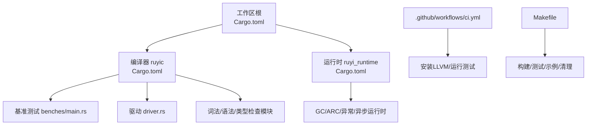
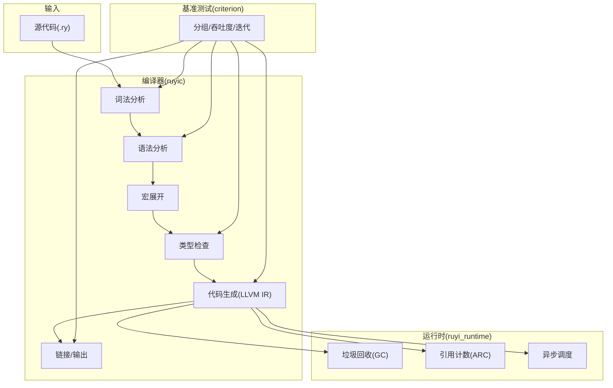
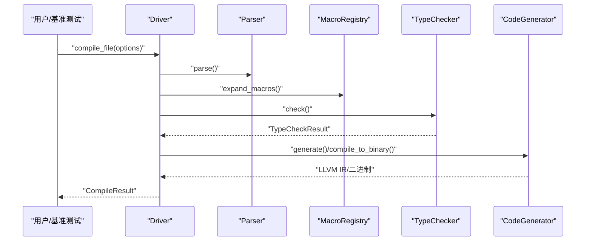
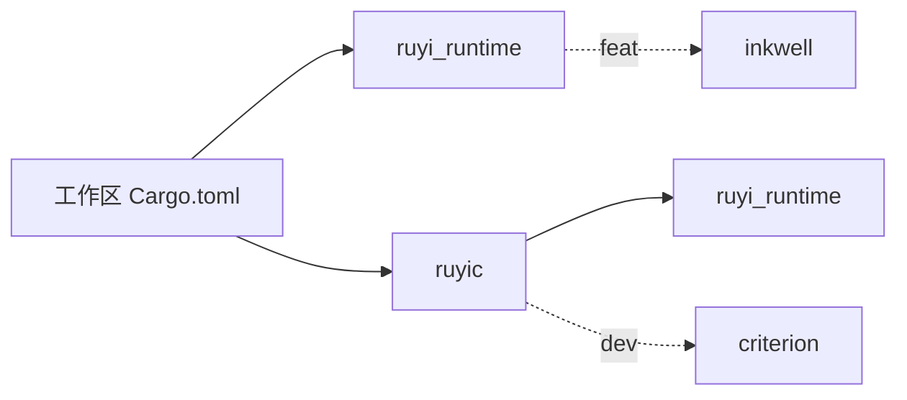

# 性能分析与基准测试

<cite>
**本文引用的文件**
- [Cargo.toml](file://Cargo.toml)
- [crates/ruyic/Cargo.toml](file://crates/ruyic/Cargo.toml)
- [crates/ruyi_runtime/Cargo.toml](file://crates/ruyi_runtime/Cargo.toml)
- [crates/ruyic/benches/main.rs](file://crates/ruyic/benches/main.rs)
- [.github/workflows/ci.yml](file://.github/workflows/ci.yml)
- [Makefile](file://Makefile)
- [crates/ruyic/src/driver.rs](file://crates/ruyic/src/driver.rs)
- [crates/ruyic/src/lib.rs](file://crates/ruyic/src/lib.rs)
- [crates/ruyic/src/codegen/mod.rs](file://crates/ruyic/src/codegen/mod.rs)
- [crates/ruyic/src/parser/mod.rs](file://crates/ruyic/src/parser/mod.rs)
- [crates/ruyic/src/lexer/mod.rs](file://crates/ruyic/src/lexer/mod.rs)
- [crates/ruyi_runtime/src/lib.rs](file://crates/ruyi_runtime/src/lib.rs)
- [crates/ruyi_runtime/src/gc.rs](file://crates/ruyi_runtime/src/gc.rs)
- [crates/ruyi_runtime/src/gc/generational.rs](file://crates/ruyi_runtime/src/gc/generational.rs)
</cite>

## 目录
1. [简介](#简介)
2. [项目结构](#项目结构)
3. [核心组件](#核心组件)
4. [架构总览](#架构总览)
5. [详细组件分析](#详细组件分析)
6. [依赖关系分析](#依赖关系分析)
7. [性能考量](#性能考量)
8. [故障排查指南](#故障排查指南)
9. [结论](#结论)
10. [附录](#附录)

## 简介
本指南面向Ruyi项目的性能分析与基准测试，系统性介绍以下内容：
- 使用criterion进行基准测试的方法，包括基准测试编写、统计分析与结果解读
- 性能分析工具的选择与使用，涵盖perf、valgrind、LLVM/Clang工具链在Ruyi中的应用
- 性能瓶颈识别与定位技巧：CPU热点、内存使用、I/O性能
- 性能回归检测与持续集成中的性能测试策略
- 多平台与多架构下的性能测试方法及跨平台比较与优化建议

## 项目结构
Ruyi采用多crate工作区组织，核心与运行时分离，便于独立构建与测试。基准测试位于编译器crate的benches目录中；CI配置在GitHub Actions中定义；Makefile提供常用构建与测试命令。

图表来源
- [Cargo.toml:1-40](file://Cargo.toml#L1-L40)
- [crates/ruyic/Cargo.toml:1-26](file://crates/ruyic/Cargo.toml#L1-L26)
- [crates/ruyi_runtime/Cargo.toml:1-17](file://crates/ruyi_runtime/Cargo.toml#L1-L17)
- [crates/ruyic/benches/main.rs:1-344](file://crates/ruyic/benches/main.rs#L1-L344)
- [crates/ruyic/src/driver.rs:1-744](file://crates/ruyic/src/driver.rs#L1-L744)
- [.github/workflows/ci.yml:1-45](file://.github/workflows/ci.yml#L1-L45)
- [Makefile:1-122](file://Makefile#L1-L122)

章节来源
- [Cargo.toml:1-40](file://Cargo.toml#L1-L40)
- [crates/ruyic/Cargo.toml:1-26](file://crates/ruyic/Cargo.toml#L1-L26)
- [crates/ruyi_runtime/Cargo.toml:1-17](file://crates/ruyi_runtime/Cargo.toml#L1-L17)
- [.github/workflows/ci.yml:1-45](file://.github/workflows/ci.yml#L1-L45)
- [Makefile:1-122](file://Makefile#L1-L122)

## 核心组件
- 编译器驱动与流水线：负责从源码到二进制或LLVM IR的完整流程，支持多种emit模式与优化级别，便于在基准测试中隔离各阶段性能。
- 词法/语法/类型检查：为基准测试提供输入数据与阶段划分，便于按阶段测量耗时。
- 代码生成：基于LLVM IR生成，支持不同优化级别，便于对比O0/O1/O2的性能差异。
- 运行时与GC：提供内存分配、垃圾回收、并发调度等基础能力，是性能分析的重要对象。
- 基准测试：以criterion为核心，覆盖词法扫描、语法解析、类型检查、代码生成与整体编译时间，并对不同规模输入进行吞吐度度量。

章节来源
- [crates/ruyic/src/driver.rs:242-632](file://crates/ruyic/src/driver.rs#L242-L632)
- [crates/ruyic/src/lib.rs:12-20](file://crates/ruyic/src/lib.rs#L12-L20)
- [crates/ruyic/src/codegen/mod.rs:1-15](file://crates/ruyic/src/codegen/mod.rs#L1-L15)
- [crates/ruyic/src/lexer/mod.rs:1-8](file://crates/ruyic/src/lexer/mod.rs#L1-L8)
- [crates/ruyic/src/parser/mod.rs:1-8](file://crates/ruyic/src/parser/mod.rs#L1-L8)
- [crates/ruyi_runtime/src/lib.rs:1-259](file://crates/ruyi_runtime/src/lib.rs#L1-L259)
- [crates/ruyic/benches/main.rs:1-344](file://crates/ruyic/benches/main.rs#L1-L344)

## 架构总览
下图展示Ruyi编译流水线与基准测试的交互关系，以及LLVM在其中的角色。

图表来源
- [crates/ruyic/src/driver.rs:521-632](file://crates/ruyic/src/driver.rs#L521-L632)
- [crates/ruyic/src/codegen/mod.rs:1-15](file://crates/ruyic/src/codegen/mod.rs#L1-L15)
- [crates/ruyi_runtime/src/lib.rs:1-259](file://crates/ruyi_runtime/src/lib.rs#L1-L259)
- [crates/ruyic/benches/main.rs:171-343](file://crates/ruyic/benches/main.rs#L171-L343)

## 详细组件分析

### criterion基准测试框架使用
- 基准测试编写要点
  - 使用分组与吞吐度度量：按输入规模与字节大小设置吞吐，便于跨规模比较。
  - 隔离阶段：分别对词法扫描、语法解析、类型检查、代码生成与整体编译时间建立分组。
  - 优化级别对比：在整体编译时间分组中对比O0/O1/O2，观察优化带来的性能变化。
  - 黑箱处理：使用black_box包裹输入，避免编译器优化影响测试结果。
- 统计分析与结果解读
  - 关注中位数与四分位距，评估稳定性和离散程度。
  - 吞吐度与时间的关系：吞吐越高，单位数据耗时越低。
  - 分组间对比：同一阶段不同规模的耗时曲线可揭示复杂度行为。
- 结果可视化与报告
  - criterion默认生成HTML报告，可在CI中归档并对比历史数据。

章节来源
- [crates/ruyic/benches/main.rs:1-344](file://crates/ruyic/benches/main.rs#L1-L344)

### 编译驱动与流水线性能
- 驱动职责
  - 输入解析、模块解析与合并、宏展开、类型检查、代码生成、输出控制。
  - 支持AST/TypedAST/LLVM IR/二进制等多种emit模式，便于在不同阶段进行性能剖析。
- 优化级别与输出
  - 通过OptLevel控制LLVM优化等级，影响代码生成与最终二进制体积/速度。
  - emit-llvm可用于生成IR以便进一步分析。
- 性能关注点
  - 模块解析与导入处理的递归开销。
  - 类型检查阶段的环境构建与约束求解。
  - 代码生成阶段的LLVM IR构建与优化。

图表来源
- [crates/ruyic/src/driver.rs:258-632](file://crates/ruyic/src/driver.rs#L258-L632)

章节来源
- [crates/ruyic/src/driver.rs:1-744](file://crates/ruyic/src/driver.rs#L1-L744)

### 词法/语法/类型检查阶段
- 词法分析
  - 基于Scanner逐token推进，适合按字节吞吐度度量。
- 语法分析
  - Parser构建AST，适合按输入长度度量。
- 类型检查
  - TypeChecker结合宏展开后的AST进行类型推导与诊断，适合按输入规模度量。
- 优化建议
  - 对大输入采用流式处理与增量缓存。
  - 减少不必要的宏展开与重复检查。

章节来源
- [crates/ruyic/src/lexer/mod.rs:1-8](file://crates/ruyic/src/lexer/mod.rs#L1-L8)
- [crates/ruyic/src/parser/mod.rs:1-8](file://crates/ruyic/src/parser/mod.rs#L1-L8)
- [crates/ruyic/src/lib.rs:12-20](file://crates/ruyic/src/lib.rs#L12-L20)

### 代码生成与LLVM
- 代码生成
  - CodeGenerator基于inkwell创建LLVM模块与builder，生成IR并可选择写出IR或直接编译为二进制。
- 优化级别
  - 通过Driver传入OptLevel，影响LLVM后端优化与最终产物。
- 性能关注点
  - IR构建过程中的基本块完整性与终止指令补全。
  - 大型程序的monomorphization与内联策略。

章节来源
- [crates/ruyic/src/codegen/mod.rs:1-15](file://crates/ruyic/src/codegen/mod.rs#L1-L15)
- [crates/ruyic/src/driver.rs:568-632](file://crates/ruyic/src/driver.rs#L568-L632)

### 运行时与GC/ARC
- 运行时接口
  - 导出分配、ARC、GC、异常、异步调度等接口，用于生成的二进制运行期行为。
- 垃圾回收
  - MarkSweepCollector与GenerationalCollector，支持分代GC与写屏障，有助于降低停顿与提升吞吐。
- 性能关注点
  - 年轻代/老年代晋升阈值与标记-压缩策略。
  - 写屏障与跨代引用的维护成本。

章节来源
- [crates/ruyi_runtime/src/lib.rs:1-259](file://crates/ruyi_runtime/src/lib.rs#L1-L259)
- [crates/ruyi_runtime/src/gc.rs:1-39](file://crates/ruyi_runtime/src/gc.rs#L1-L39)
- [crates/ruyi_runtime/src/gc/generational.rs:435-472](file://crates/ruyi_runtime/src/gc/generational.rs#L435-L472)

## 依赖关系分析
- 工作区与依赖
  - 工作区统一版本与特性，ruyic依赖ruyi_runtime与inkwell；ruyi_runtime默认启用inkwell特性。
- 开发依赖
  - criterion作为dev-dependency，仅用于基准测试与性能分析。
- CI与LLVM
  - CI中安装LLVM 14并设置环境变量，确保inkwell可用。

图表来源
- [Cargo.toml:14-30](file://Cargo.toml#L14-L30)
- [crates/ruyic/Cargo.toml:8-9](file://crates/ruyic/Cargo.toml#L8-L9)
- [crates/ruyi_runtime/Cargo.toml:11-12](file://crates/ruyi_runtime/Cargo.toml#L11-L12)
- [.github/workflows/ci.yml:17-21](file://.github/workflows/ci.yml#L17-L21)

章节来源
- [Cargo.toml:14-30](file://Cargo.toml#L14-L30)
- [crates/ruyic/Cargo.toml:8-9](file://crates/ruyic/Cargo.toml#L8-L9)
- [crates/ruyi_runtime/Cargo.toml:11-12](file://crates/ruyi_runtime/Cargo.toml#L11-L12)
- [.github/workflows/ci.yml:17-21](file://.github/workflows/ci.yml#L17-L21)

## 性能考量
- 基准测试设计
  - 将输入按规模切分为small/medium/large三档，覆盖不同复杂度场景。
  - 使用Throughput::Bytes度量字节级吞吐，便于跨输入规模横向比较。
  - 对整体编译时间分组对比O0/O1/O2，观察优化收益。
- 统计与稳定性
  - 关注中位数与MAD/Qn，避免极端值干扰。
  - 多次运行与分组统计，确保结果稳健。
- 结果解读
  - 若某阶段随输入增大呈近似线性增长，可能受扫描/解析/类型检查复杂度影响。
  - 代码生成阶段若出现非线性增长，需检查IR构建与LLVM优化路径。
- CI中的性能回归
  - 在CI中固定LLVM版本，确保可重复性。
  - 可将基准测试结果上传为Artifacts，用于历史趋势对比。

章节来源
- [crates/ruyic/benches/main.rs:171-343](file://crates/ruyic/benches/main.rs#L171-L343)
- [.github/workflows/ci.yml:17-21](file://.github/workflows/ci.yml#L17-L21)

## 故障排查指南
- LLVM/inkwell相关问题
  - 症状：构建失败或inkwell绑定不可用。
  - 排查：确认CI/本地已安装LLVM 14并设置LLVM_SYS_140_PREFIX；检查.cargo/config或环境变量。
- 基准测试无法运行
  - 症状：criterion未被识别或测试未执行。
  - 排查：确认benches目录存在且main.rs为基准入口；使用cargo bench运行。
- 性能结果异常
  - 症状：吞吐波动大或不同规模间不一致。
  - 排查：检查black_box使用、输入一致性、是否混入外部I/O；确认emit模式与优化级别一致。
- 运行时GC/ARC问题
  - 症状：运行期内存占用异常或GC停顿过长。
  - 排查：检查晋升阈值与写屏障；使用valgrind/Miri验证内存安全；必要时切换GC算法或调整策略。

章节来源
- [.github/workflows/ci.yml:17-21](file://.github/workflows/ci.yml#L17-L21)
- [crates/ruyic/benches/main.rs:171-343](file://crates/ruyic/benches/main.rs#L171-L343)
- [crates/ruyi_runtime/src/gc/generational.rs:435-472](file://crates/ruyi_runtime/src/gc/generational.rs#L435-L472)

## 结论
Ruyi已具备完善的基准测试基础设施与CI支持，能够对编译器各阶段与整体编译性能进行系统化评估。结合criterion的统计分析与LLVM工具链，可在多平台与多架构环境下开展性能回归检测与优化验证。建议在CI中长期保留基准测试Artifacts，形成性能基线，持续跟踪改进与回归风险。

## 附录

### 基准测试编写与运行指引
- 编写
  - 在benches/main.rs中新增分组与bench_function，设置吞吐度与优化级别。
  - 使用black_box包裹输入，避免编译器优化影响。
- 运行
  - 本地：cargo bench
  - CI：GitHub Actions中已安装LLVM并执行构建与测试。

章节来源
- [crates/ruyic/benches/main.rs:1-344](file://crates/ruyic/benches/main.rs#L1-L344)
- [.github/workflows/ci.yml:22-26](file://.github/workflows/ci.yml#L22-L26)

### 性能分析工具与实践
- CPU热点分析
  - 使用perf记录采样，结合objdump/addr2line定位热点函数。
- 内存使用分析
  - 使用valgrind/memcheck检测泄漏与越界；结合Miri验证内存安全。
- I/O性能监控
  - 使用strace/iotop观察文件与网络I/O；在基准测试中避免外部I/O干扰。
- LLVM/Clang工具
  - 使用opt/llc生成不同优化级别的IR/汇编；结合objdump分析指令级差异。

章节来源
- [.github/workflows/ci.yml:17-21](file://.github/workflows/ci.yml#L17-L21)

### 多平台与多架构测试策略
- 平台准备
  - CI中固定LLVM版本；本地macOS/Linux均需安装对应LLVM头文件与库。
- 架构差异
  - 在x86_64与ARM64上分别运行基准测试，对比吞吐与延迟。
- 跨平台比较
  - 归档基准测试HTML报告，建立历史趋势；对显著回归发出告警。

章节来源
- [.github/workflows/ci.yml:17-21](file://.github/workflows/ci.yml#L17-L21)
- [Makefile:11, 21, 30:11-33](file://Makefile#L11-L33)