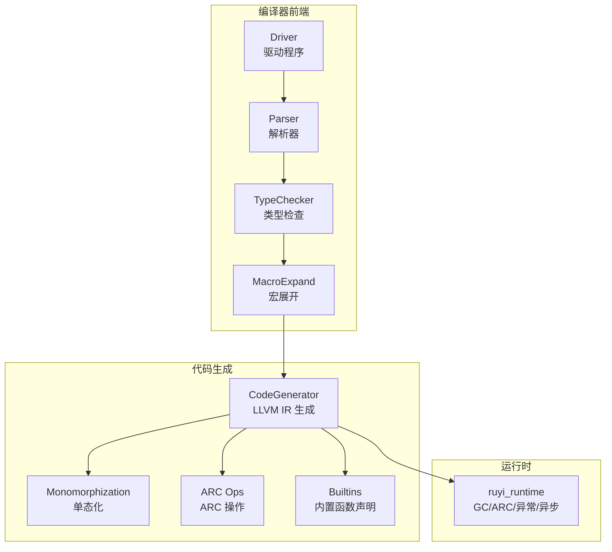
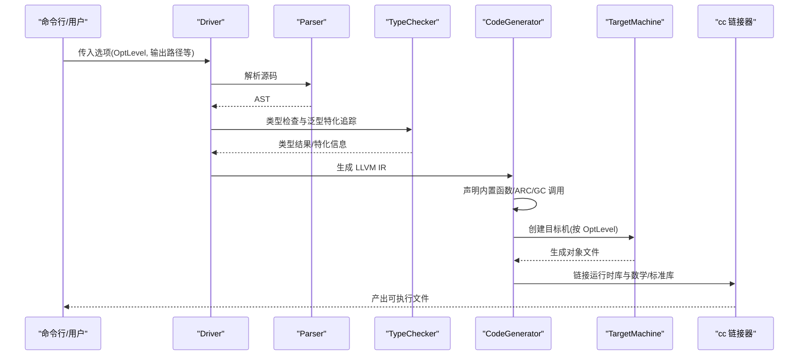
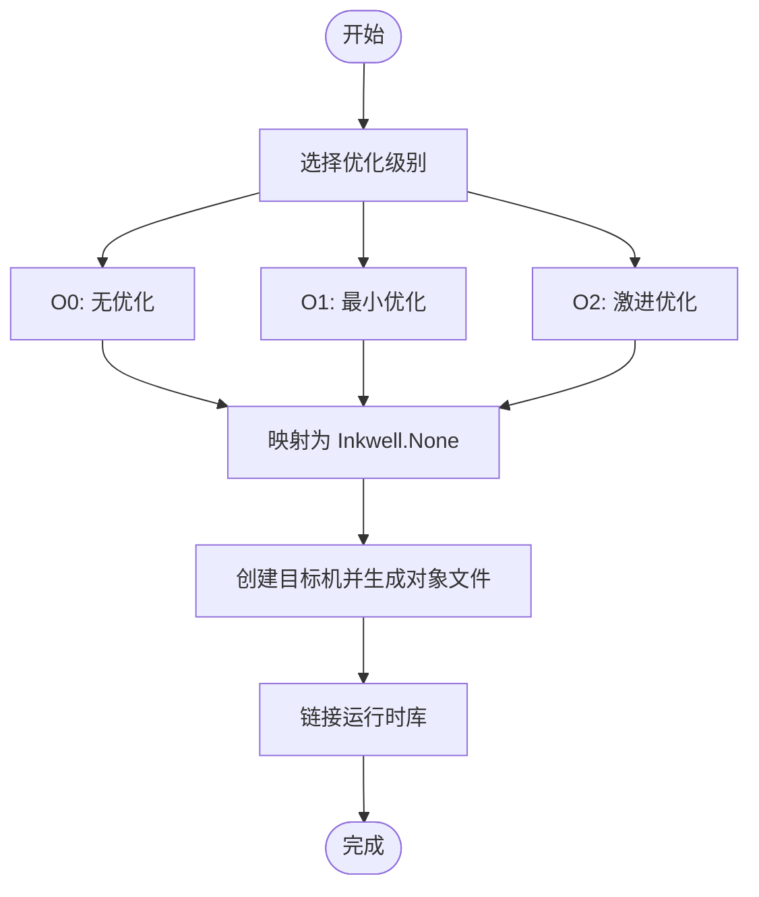
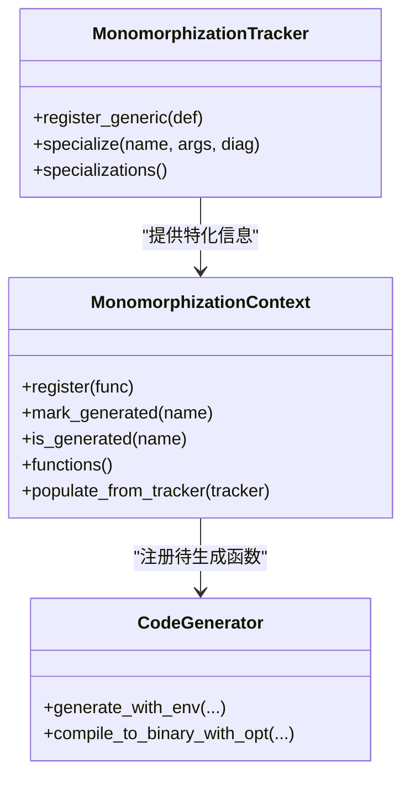
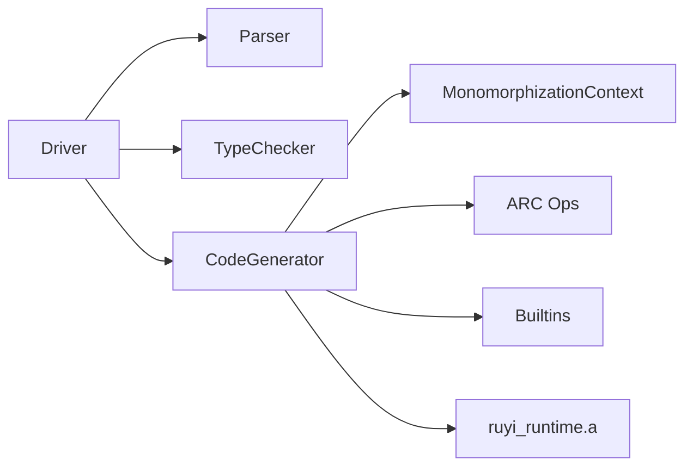

# 编译器优化

<cite>
**本文引用的文件**   
- [Cargo.toml](file://Cargo.toml)
- [lib.rs](file://crates/ruyic/src/lib.rs)
- [driver.rs](file://crates/ruyic/src/driver.rs)
- [generator.rs](file://crates/ruyic/src/codegen/generator.rs)
- [mod.rs](file://crates/ruyic/src/codegen/mod.rs)
- [arc_ops.rs](file://crates/ruyic/src/codegen/arc_ops.rs)
- [builtins.rs](file://crates/ruyic/src/codegen/builtins.rs)
- [monomorph.rs](file://crates/ruyic/src/codegen/monomorph.rs)
- [generics.rs](file://crates/ruyic/src/typechecker/generics.rs)
- [lib.rs（运行时）](file://crates/ruyi_runtime/src/lib.rs)
- [main.rs（基准测试）](file://crates/ruyic/benches/main.rs)
</cite>

## 目录
1. [简介](#简介)
2. [项目结构](#项目结构)
3. [核心组件](#核心组件)
4. [架构总览](#架构总览)
5. [详细组件分析](#详细组件分析)
6. [依赖关系分析](#依赖关系分析)
7. [性能考量](#性能考量)
8. [故障排查指南](#故障排查指南)
9. [结论](#结论)
10. [附录](#附录)

## 简介
本文件系统性梳理 Ruyi 编译器在“优化”方面的设计与实现，覆盖以下主题：
- 优化级别与配置：解释 O0/O1/O2 的映射关系，以及工作区 release 配置中 opt-level=3、lto=true、codegen-units=1 的作用与影响。
- LLVM 优化 Pass 原理：结合代码生成路径，说明内联、死代码消除、循环优化、常量传播等在当前实现中的体现与限制。
- Ruyi 特有优化策略：单态化（monomorphization）、ARC 操作优化、内置函数优化。
- 性能对比与适用场景：基于现有基准测试与代码生成路径，给出不同优化级别的权衡建议。
- 编译时间与运行时性能：结合驱动与目标机器配置，给出可操作的优化配置建议。

## 项目结构
Ruyi 编译器采用分层模块组织，其中与优化直接相关的模块集中在 ruyic 的 codegen 子树，并通过驱动程序统一调度。运行时库提供 GC、ARC、异常处理等运行期支持。

**图表来源**
- [driver.rs:242-737](file://crates/ruyic/src/driver.rs#L242-L737)
- [generator.rs:384-799](file://crates/ruyic/src/codegen/generator.rs#L384-L799)
- [mod.rs:1-15](file://crates/ruyic/src/codegen/mod.rs#L1-L15)
- [lib.rs（运行时）:1-49](file://crates/ruyi_runtime/src/lib.rs#L1-L49)

**章节来源**
- [driver.rs:1-744](file://crates/ruyic/src/driver.rs#L1-L744)
- [generator.rs:1-800](file://crates/ruyic/src/codegen/generator.rs#L1-L800)
- [mod.rs:1-15](file://crates/ruyic/src/codegen/mod.rs#L1-L15)
- [lib.rs（运行时）:1-259](file://crates/ruyi_runtime/src/lib.rs#L1-L259)

## 核心组件
- 优化级别与映射
  - 在驱动中定义了 O0/O1/O2 三个优化级别枚举，并在代码生成阶段将其映射为 Inkwell 的 OptimizationLevel.None/Less/Aggressive。
  - 当未显式指定优化级别时，默认使用 O2；在二进制链接阶段，会根据传入的 OptLevel 决定目标机器的优化等级。
- 单态化（Monomorphization）
  - 类型检查器维护泛型定义与特化信息，代码生成器据此为每个具体类型组合生成独立的 LLVM 函数，避免运行时多态开销。
- ARC 操作优化
  - 代码生成器在需要时插入对运行时 ARC 函数的调用，确保引用计数正确管理；同时提供带平衡保留/释放的辅助函数以简化控制流。
- 内置函数优化
  - 代码生成器在模块层面声明大量运行时内置函数（如 GC、字符串拼接、数组/集合操作等），并在必要时直接调用，减少中间层抽象带来的额外成本。
- 运行时集成
  - 生成的二进制链接运行时静态库，运行时提供 GC、ARC、异常表、调度器等能力，支撑编译产物的正确执行。

**章节来源**
- [driver.rs:101-138](file://crates/ruyic/src/driver.rs#L101-L138)
- [generator.rs:22-28](file://crates/ruyic/src/codegen/generator.rs#L22-L28)
- [generator.rs:405-696](file://crates/ruyic/src/codegen/generator.rs#L405-L696)
- [monomorph.rs:1-218](file://crates/ruyic/src/codegen/monomorph.rs#L1-L218)
- [generics.rs:162-200](file://crates/ruyic/src/typechecker/generics.rs#L162-L200)
- [arc_ops.rs:1-85](file://crates/ruyic/src/codegen/arc_ops.rs#L1-L85)
- [builtins.rs:15-85](file://crates/ruyic/src/codegen/builtins.rs#L15-L85)
- [lib.rs（运行时）:11-49](file://crates/ruyi_runtime/src/lib.rs#L11-L49)

## 架构总览
下图展示从源码到最终二进制的关键流程，以及优化配置如何贯穿其中：

**图表来源**
- [driver.rs:521-632](file://crates/ruyic/src/driver.rs#L521-L632)
- [generator.rs:713-799](file://crates/ruyic/src/codegen/generator.rs#L713-L799)

**章节来源**
- [driver.rs:242-737](file://crates/ruyic/src/driver.rs#L242-L737)
- [generator.rs:713-799](file://crates/ruyic/src/codegen/generator.rs#L713-L799)

## 详细组件分析

### 优化级别与配置
- 驱动中的优化级别
  - OptLevel 提供 O0/O1/O2 三档；默认 O0，但当生成二进制时默认使用 O2。
  - 优化级别映射到 Inkwell 的 OptimizationLevel，分别对应 None/Less/Aggressive。
- 工作区 release 配置
  - Cargo 工作区 release profile 中设置了 opt-level=3、lto=true、codegen-units=1，用于提升运行时性能并减少二进制体积。
  - 注意：该配置影响的是工作区内 Rust crate 的构建行为；对于 Ruyi 编译器自身生成的 LLVM IR，仍由 OptLevel 参数决定目标机器优化等级。

**图表来源**
- [driver.rs:101-138](file://crates/ruyic/src/driver.rs#L101-L138)
- [generator.rs:22-28](file://crates/ruyic/src/codegen/generator.rs#L22-L28)
- [generator.rs:713-740](file://crates/ruyic/src/codegen/generator.rs#L713-L740)
- [Cargo.toml:37-40](file://Cargo.toml#L37-L40)

**章节来源**
- [driver.rs:101-138](file://crates/ruyic/src/driver.rs#L101-L138)
- [generator.rs:22-28](file://crates/ruyic/src/codegen/generator.rs#L22-L28)
- [generator.rs:713-740](file://crates/ruyic/src/codegen/generator.rs#L713-L740)
- [Cargo.toml:37-40](file://Cargo.toml#L37-L40)

### LLVM 优化 Pass 的工作原理与现状
- 内联优化
  - 通过单态化将泛型函数实例化为具体类型，减少虚函数调用与泛型分派开销，从而间接提升内联机会。
- 死代码消除（DCE）
  - 在表达式与语句编译过程中，若出现不可达分支或冗余存储，生成器会尽量避免插入无用指令；但更彻底的 DCE 由目标机器在更高优化级别下完成。
- 循环优化
  - 控制流生成遵循 while/for/for-in/for-of 的结构，break/continue 使用 loop_stack 精确跳转；循环不变量外提等高级优化由目标机器在 Aggressive 级别下完成。
- 常量传播
  - 对于整数/浮点字面量与已知常量，表达式编译阶段会尽可能进行折叠；复杂常量传播主要由目标机器优化完成。

上述优化在当前代码中主要体现在：
- 泛型特化与单态化函数生成，减少运行时多态与间接调用。
- 表达式与语句编译器对常见算子与比较的直接生成，避免额外中间层。
- 目标机器优化等级的选择，使 LLVM 后端执行更激进的 Pass。

**章节来源**
- [monomorph.rs:1-218](file://crates/ruyic/src/codegen/monomorph.rs#L1-L218)
- [generics.rs:162-200](file://crates/ruyic/src/typechecker/generics.rs#L162-L200)
- [stmt.rs（片段）:194-631](file://crates/ruyic/src/codegen/stmt.rs#L194-L631)
- [expr.rs（片段）:1708-1742](file://crates/ruyic/src/codegen/expr.rs#L1708-L1742)
- [generator.rs:22-28](file://crates/ruyic/src/codegen/generator.rs#L22-L28)

### Ruyi 特有的优化策略
- 单态化（Monomorphization）
  - 类型检查器收集泛型调用点与具体类型参数，生成器据此为每个特化版本生成独立 LLVM 函数，避免运行时多态。
  - 生成器在预声明类结构体与方法签名后，再遍历所有声明进行编译，保证前向引用与特化函数的正确生成。
- ARC 操作优化
  - 通过 emit_arc_retain/emit_arc_release/emit_arc_alloc 等辅助函数，生成器在必要位置插入运行时调用；并提供 emit_arc_balanced 以在代码块入口保留、出口释放，简化控制流。
- 内置函数优化
  - 在模块层面集中声明运行时内置函数（GC、字符串、数组/集合、异常、异步等），在需要时直接调用，减少中间抽象层与不必要的包装。

**图表来源**
- [generics.rs:162-200](file://crates/ruyic/src/typechecker/generics.rs#L162-L200)
- [monomorph.rs:63-110](file://crates/ruyic/src/codegen/monomorph.rs#L63-L110)
- [generator.rs:405-696](file://crates/ruyic/src/codegen/generator.rs#L405-L696)

**章节来源**
- [generics.rs:1-200](file://crates/ruyic/src/typechecker/generics.rs#L1-L200)
- [monomorph.rs:1-218](file://crates/ruyic/src/codegen/monomorph.rs#L1-L218)
- [generator.rs:405-696](file://crates/ruyic/src/codegen/generator.rs#L405-L696)
- [arc_ops.rs:1-85](file://crates/ruyic/src/codegen/arc_ops.rs#L1-L85)
- [builtins.rs:15-85](file://crates/ruyic/src/codegen/builtins.rs#L15-L85)

### 不同优化级别的性能对比与适用场景
- O0（无优化）
  - 适合调试与快速迭代，编译速度快，运行时性能最差。
- O1（最小优化）
  - 在编译速度与运行时性能之间取得折中，适合开发阶段的快速反馈。
- O2（激进优化）
  - 默认用于生成二进制，运行时性能最佳；编译时间较长。
- 工作区 release 配置（opt-level=3、lto=true、codegen-units=1）
  - 针对最终发布包，进一步提升运行时性能并减小体积，适合生产环境。

基准测试显示，编译时间随优化级别提升而增加，O2 明显长于 O1，O0 最短。运行时性能则与优化级别正相关。

**章节来源**
- [main.rs（基准测试）:142-343](file://crates/ruyic/benches/main.rs#L142-L343)
- [Cargo.toml:37-40](file://Cargo.toml#L37-L40)

### 编译时间与运行时性能的权衡
- 编译时间
  - O0 最快，O1 次之，O2 最慢；工作区 release 配置在最终打包阶段启用更激进的优化。
- 运行时性能
  - O2 及更高优化级别通常带来更好的指令级并行、循环展开与寄存器分配；单态化与 ARC 内联进一步降低运行时开销。
- 链接器与平台差异
  - 链接阶段自动选择合适的 C++ 运行时库标志，避免异常处理相关的未定义符号问题。

**章节来源**
- [generator.rs:747-799](file://crates/ruyic/src/codegen/generator.rs#L747-L799)
- [.omo/evidence/task-1-linker.txt:1-26](file://.omo/evidence/task-1-linker.txt#L1-L26)

## 依赖关系分析
- 组件耦合
  - Driver 依赖 Parser、TypeChecker、MacroExpand 与 CodeGenerator；CodeGenerator 依赖 MonomorphizationContext、ARC 与 Builtins。
  - 运行时库通过链接器集成到最终二进制，为 GC、ARC、异常与异步提供支持。
- 外部依赖
  - inkwell 提供 LLVM 绑定；cc 作为系统链接器；运行时库以静态库形式参与链接。

**图表来源**
- [driver.rs:242-737](file://crates/ruyic/src/driver.rs#L242-L737)
- [generator.rs:384-799](file://crates/ruyic/src/codegen/generator.rs#L384-L799)
- [mod.rs:1-15](file://crates/ruyic/src/codegen/mod.rs#L1-L15)

**章节来源**
- [driver.rs:242-737](file://crates/ruyic/src/driver.rs#L242-L737)
- [generator.rs:384-799](file://crates/ruyic/src/codegen/generator.rs#L384-L799)
- [mod.rs:1-15](file://crates/ruyic/src/codegen/mod.rs#L1-L15)

## 性能考量
- 优化级别选择
  - 开发与调试：O0 或 O1，优先编译速度。
  - 发布与性能敏感场景：O2 或更高；配合工作区 release 配置获得最佳运行时表现。
- 单态化收益
  - 将泛型实例化为具体类型，减少虚函数与泛型分派，提高内联与寄存器利用率。
- ARC 与 GC
  - ARC 操作在关键路径上保持轻量调用，GC 根管理通过 RAII 守卫确保正确性与安全性。
- 链接与运行时
  - 链接阶段自动选择平台特定的 C++ 运行时库，避免异常处理相关错误。

[本节为通用指导，不直接分析具体文件]

## 故障排查指南
- 链接失败或未定义符号
  - 症状：链接时报错，提示未定义符号（如异常处理相关）。
  - 处理：确认链接阶段已添加平台特定的 C++ 运行时库标志；检查运行时静态库是否存在。
- 编译时间过长
  - 症状：O2 与更高优化级别编译耗时显著增加。
  - 处理：在开发阶段使用 O0/O1；发布前再切换至 O2 或更高。
- 运行时性能不佳
  - 症状：热点函数存在不必要的间接调用或未内联。
  - 处理：检查是否过度使用泛型且未充分特化；确认单态化路径是否覆盖关键调用点。

**章节来源**
- [generator.rs:747-799](file://crates/ruyic/src/codegen/generator.rs#L747-L799)
- [.omo/evidence/task-1-linker.txt:1-26](file://.omo/evidence/task-1-linker.txt#L1-L26)

## 结论
Ruyi 编译器在优化方面采取了“前端单态化 + 后端 LLVM 优化”的双轨策略：通过类型检查器与代码生成器协作，将泛型实例化为具体函数，减少运行时多态；同时借助 Inkwell 的目标机器优化，实现内联、循环与常量传播等高级优化。结合工作区 release 配置，可在发布包中获得更优的运行时性能。针对不同场景，应权衡编译时间与运行时性能，合理选择优化级别与配置。

[本节为总结性内容，不直接分析具体文件]

## 附录
- 关键配置参考
  - 工作区 release profile：opt-level=3、lto=true、codegen-units=1
  - 编译器驱动默认优化级别：O2（生成二进制时）
- 相关文件索引
  - 优化级别与映射：[driver.rs:101-138](file://crates/ruyic/src/driver.rs#L101-L138)、[generator.rs:22-28](file://crates/ruyic/src/codegen/generator.rs#L22-L28)
  - 单态化与生成：[monomorph.rs:1-218](file://crates/ruyic/src/codegen/monomorph.rs#L1-L218)、[generics.rs:162-200](file://crates/ruyic/src/typechecker/generics.rs#L162-L200)
  - ARC 与内置函数：[arc_ops.rs:1-85](file://crates/ruyic/src/codegen/arc_ops.rs#L1-L85)、[builtins.rs:15-85](file://crates/ruyic/src/codegen/builtins.rs#L15-L85)
  - 链接与平台差异：[generator.rs:747-799](file://crates/ruyic/src/codegen/generator.rs#L747-L799)、[Cargo.toml:37-40](file://Cargo.toml#L37-L40)