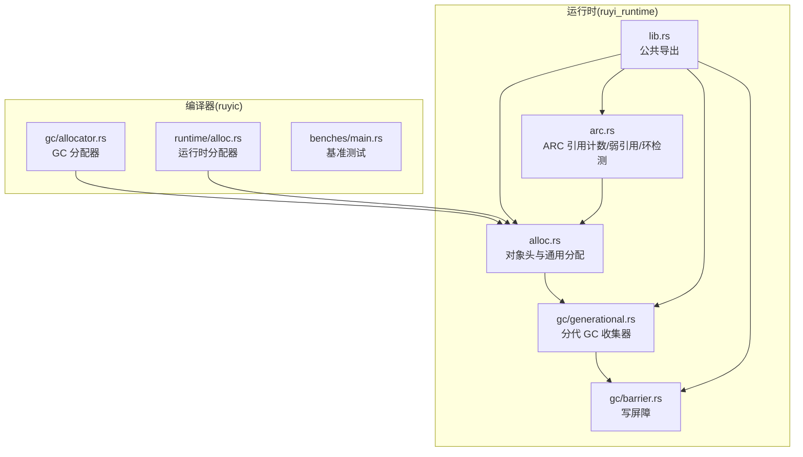
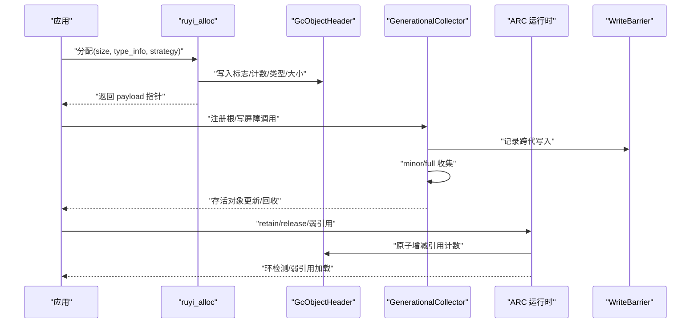
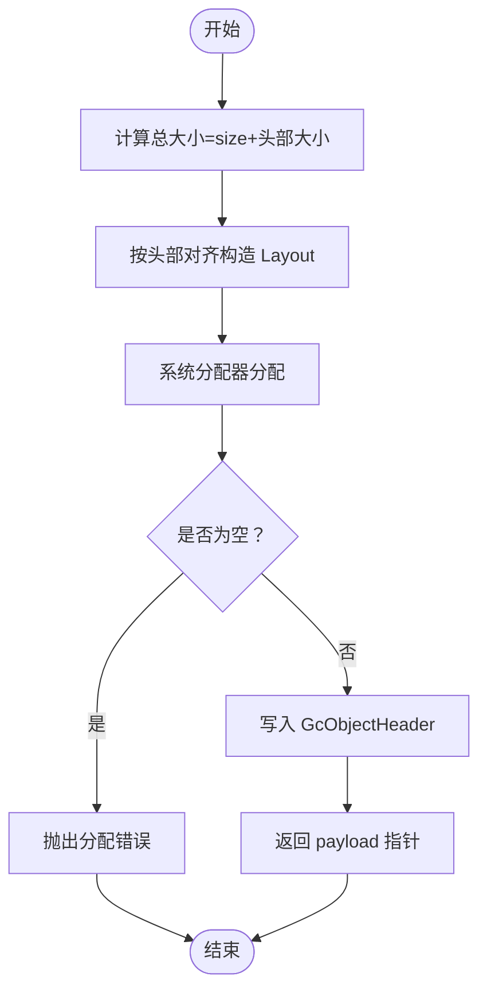
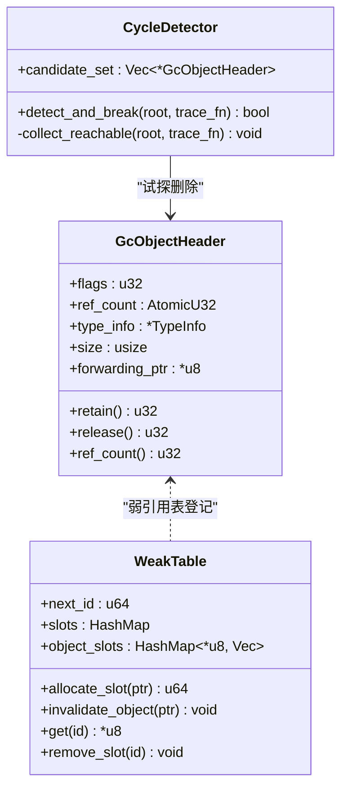
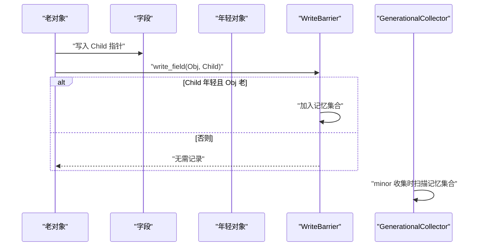
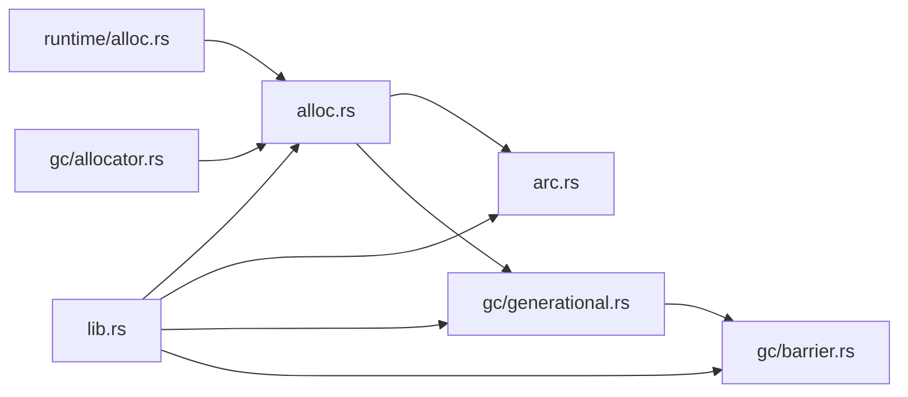

# 内存分配器优化

<cite>
**本文档引用的文件**
- [alloc.rs](file://crates/ruyi_runtime/src/alloc.rs)
- [arc.rs](file://crates/ruyi_runtime/src/arc.rs)
- [generational.rs](file://crates/ruyi_runtime/src/gc/generational.rs)
- [barrier.rs](file://crates/ruyi_runtime/src/gc/barrier.rs)
- [allocator.rs](file://crates/ruyic/src/gc/allocator.rs)
- [runtime_alloc.rs](file://crates/ruyic/src/runtime/alloc.rs)
- [Cargo.toml](file://Cargo.toml)
- [lib.rs](file://crates/ruyi_runtime/src/lib.rs)
- [main.rs](file://crates/ruyic/benches/main.rs)
- [gc_thread_local.rs](file://crates/ruyi_runtime/tests/gc_thread_local.rs)
- [gc_exports.rs](file://crates/ruyi_runtime/tests/gc_exports.rs)
- [remaining-issues.md](file://.omo/plans/remaining-issues.md)
</cite>

## 目录
1. [简介](#简介)
2. [项目结构](#项目结构)
3. [核心组件](#核心组件)
4. [架构总览](#架构总览)
5. [详细组件分析](#详细组件分析)
6. [依赖关系分析](#依赖关系分析)
7. [性能考量](#性能考量)
8. [故障排查指南](#故障排查指南)
9. [结论](#结论)
10. [附录](#附录)

## 简介
本指南聚焦于 Ruyi 运行时的内存分配与垃圾回收体系，系统性梳理内存分配策略（小对象池化、大对象直接分配、内存对齐优化）、ARC（原子引用计数）的性能特征（原子操作优化、缓存友好的数据结构设计、内存屏障最小化）、内存碎片治理方案（伙伴分配思想、内存池管理、压缩整理）、内存使用模式分析方法（分配热点识别、内存泄漏检测、碎片化评估），以及监控指标、基准测试与优化案例研究。当前实现以系统分配器为主，GC 采用分代收集，ARC 提供弱引用与基础环检测；后续规划中包含老年代标记-压缩以降低碎片。

## 项目结构
Ruyi 的内存子系统主要分布在运行时与编译器两部分：
- 运行时（ruyi_runtime）：统一的对象头、GC 分代收集、写屏障、ARC 引用计数与弱引用、公共导出接口。
- 编译器（ruyic）：GC 分配器与运行时分配器（系统分配器封装），以及基准测试框架。

**图表来源**
- [alloc.rs:1-405](file://crates/ruyi_runtime/src/alloc.rs#L1-L405)
- [arc.rs:1-565](file://crates/ruyi_runtime/src/arc.rs#L1-L565)
- [generational.rs:1-743](file://crates/ruyi_runtime/src/gc/generational.rs#L1-L743)
- [barrier.rs:1-141](file://crates/ruyi_runtime/src/gc/barrier.rs#L1-L141)
- [allocator.rs:1-17](file://crates/ruyic/src/gc/allocator.rs#L1-L17)
- [runtime_alloc.rs:1-22](file://crates/ruyic/src/runtime/alloc.rs#L1-L22)
- [lib.rs:1-259](file://crates/ruyi_runtime/src/lib.rs#L1-L259)

**章节来源**
- [lib.rs:1-259](file://crates/ruyi_runtime/src/lib.rs#L1-L259)

## 核心组件
- 统一对象头与分配策略
  - 对象头包含标志位（标记/固定/策略/代际）、原子引用计数、类型信息、大小、转发指针等字段，支持 GC 与 ARC 双策略共存。
  - 分配器在 v1 阶段委托系统分配器，未来可替换为专用内存区。
- 分代 GC 收集器
  - 年轻代采用复制收集，老年代采用标记-压缩（规划中），跨代写入通过写屏障与记忆集合跟踪。
- ARC 引用计数
  - 显式 retain/release，支持弱引用与基于试探删除的简单环检测。
- 基准测试与监控
  - 使用 Criterion 进行编译/运行时性能基准，结合线程局部压力测试验证 GC 行为。

**章节来源**
- [alloc.rs:1-405](file://crates/ruyi_runtime/src/alloc.rs#L1-L405)
- [generational.rs:1-743](file://crates/ruyi_runtime/src/gc/generational.rs#L1-L743)
- [arc.rs:1-565](file://crates/ruyi_runtime/src/arc.rs#L1-L565)
- [Cargo.toml:1-40](file://Cargo.toml#L1-L40)

## 架构总览
下图展示内存分配与回收的关键交互：应用通过统一分配入口创建带对象头的对象；GC 分代收集器负责年轻代复制与老年代标记-压缩；ARC 提供细粒度引用控制与弱引用；写屏障确保跨代引用安全。

**图表来源**
- [alloc.rs:225-298](file://crates/ruyi_runtime/src/alloc.rs#L225-L298)
- [generational.rs:146-420](file://crates/ruyi_runtime/src/gc/generational.rs#L146-L420)
- [barrier.rs:24-76](file://crates/ruyi_runtime/src/gc/barrier.rs#L24-L76)
- [arc.rs:108-141](file://crates/ruyi_runtime/src/arc.rs#L108-L141)

## 详细组件分析

### 统一对象头与分配策略
- 对象头字段与位域设计
  - 标志位：标记、固定、内存策略（GC/ARC）、代际（Eden/Survivor/Old/Reserved）。
  - 原子引用计数：用于 ARC。
  - 类型信息：RTTI 与追踪回调。
  - 大小与转发指针：GC 复制/压缩期间使用。
- 分配/释放/扩容流程
  - 分配：计算总长度（载荷+头部），按头部对齐布局，写入头部。
  - 释放：调用析构器（如存在），再释放整块内存。
  - 扩容：整体移动并保留头部，更新大小字段。
- 对齐与对齐优化
  - 使用头部对齐布局，保证访问效率与缓存友好。

**图表来源**
- [alloc.rs:233-249](file://crates/ruyi_runtime/src/alloc.rs#L233-L249)

**章节来源**
- [alloc.rs:1-405](file://crates/ruyi_runtime/src/alloc.rs#L1-L405)

### ARC 引用计数与弱引用
- 原子操作优化
  - retain/release 使用 Relaxed/Acquire/Release 语义，减少不必要的内存屏障开销。
  - 弱引用表使用互斥保护，避免并发读写竞争。
- 缓存友好的数据结构
  - 对象头紧凑布局，引用计数与标志位在同一缓存行内，提升局部性。
- 环检测
  - 试探删除算法：对可达对象临时递减引用计数，若根计数归零则判定为环，随后恢复内部引用并释放环成员。

**图表来源**
- [alloc.rs:74-181](file://crates/ruyi_runtime/src/alloc.rs#L74-L181)
- [arc.rs:47-94](file://crates/ruyi_runtime/src/arc.rs#L47-L94)
- [arc.rs:251-403](file://crates/ruyi_runtime/src/arc.rs#L251-L403)

**章节来源**
- [arc.rs:1-565](file://crates/ruyi_runtime/src/arc.rs#L1-L565)
- [alloc.rs:166-181](file://crates/ruyi_runtime/src/alloc.rs#L166-L181)

### 分代 GC 与写屏障
- 年轻代复制收集
  - 工作列表驱动的追踪，存活对象复制到新空间或晋升至老年代，不可达对象回收。
- 老年代标记-压缩（规划中）
  - 通过标记位图与滑动压缩，消除碎片，降低碎片化风险。
- 写屏障与记忆集合
  - 跟踪从老到年轻的跨代写入，维护记忆集合，确保 minor GC 将其作为额外根处理。

**图表来源**
- [barrier.rs:24-76](file://crates/ruyi_runtime/src/gc/barrier.rs#L24-L76)
- [generational.rs:146-267](file://crates/ruyi_runtime/src/gc/generational.rs#L146-L267)

**章节来源**
- [generational.rs:1-743](file://crates/ruyi_runtime/src/gc/generational.rs#L1-L743)
- [barrier.rs:1-141](file://crates/ruyi_runtime/src/gc/barrier.rs#L1-L141)
- [remaining-issues.md:708-753](file://.omo/plans/remaining-issues.md#L708-L753)

### 编译器侧分配器与运行时分配器
- 编译器 GC 分配器
  - 直接委托系统分配器，便于与运行时 GC 协同。
- 运行时分配器
  - 提供 allocate/deallocate/reallocate 封装，支持零拷贝复制与按需扩容。

**章节来源**
- [allocator.rs:1-17](file://crates/ruyic/src/gc/allocator.rs#L1-L17)
- [runtime_alloc.rs:1-22](file://crates/ruyic/src/runtime/alloc.rs#L1-L22)

## 依赖关系分析
- 模块耦合
  - alloc 为 GC 与 ARC 的共同基础设施；arc 依赖 alloc 的对象头与分配函数；generational 依赖 barrier 与 alloc；lib.rs 统一导出公共 API。
- 外部依赖
  - Criterion 用于基准测试；系统分配器作为默认实现；LLVM（可选）用于类型映射与代码生成。

**图表来源**
- [lib.rs:11-48](file://crates/ruyi_runtime/src/lib.rs#L11-L48)
- [alloc.rs:1-405](file://crates/ruyi_runtime/src/alloc.rs#L1-L405)
- [arc.rs:1-565](file://crates/ruyi_runtime/src/arc.rs#L1-L565)
- [generational.rs:1-743](file://crates/ruyi_runtime/src/gc/generational.rs#L1-L743)
- [barrier.rs:1-141](file://crates/ruyi_runtime/src/gc/barrier.rs#L1-L141)
- [runtime_alloc.rs:1-22](file://crates/ruyic/src/runtime/alloc.rs#L1-L22)
- [allocator.rs:1-17](file://crates/ruyic/src/gc/allocator.rs#L1-L17)

**章节来源**
- [lib.rs:1-259](file://crates/ruyi_runtime/src/lib.rs#L1-L259)

## 性能考量
- 小对象池化
  - 当前通过系统分配器满足小对象分配；建议引入页级内存池与对象大小分桶，减少碎片与系统调用开销。
- 大对象直接分配
  - 大对象直接走系统分配器，避免额外拷贝；注意对齐与对齐开销平衡。
- 内存对齐优化
  - 对象头对齐布局已内置；建议在分配器层进一步利用平台特性（如 64B 对齐）提升缓存行利用率。
- ARC 原子操作
  - retain/release 使用宽松内存序，减少屏障；弱引用表使用互斥串行化，避免高并发下的锁争用。
- 写屏障最小化
  - 仅在老到年轻写入时记录，配合记忆集合，避免全量扫描。
- 老年代压缩
  - 规划中的标记-压缩可显著降低碎片；需注意压缩过程中的引用更新与并发安全。

[本节为通用性能指导，不直接分析具体文件]

## 故障排查指南
- 分配失败与空指针
  - 分配失败时会触发系统分配错误处理；检查类型信息有效性与对齐布局。
- 引用计数异常
  - 确保 retain/release 成对调用；弱引用加载后需及时释放强引用。
- GC 根未注册
  - 线程局部压力测试显示根注册不足会导致误回收；确保在收集前正确添加根。
- 写屏障失效
  - 跨代写入必须调用写屏障；否则可能产生悬挂指针或漏标对象。

**章节来源**
- [alloc.rs:240-243](file://crates/ruyi_runtime/src/alloc.rs#L240-L243)
- [arc.rs:129-141](file://crates/ruyi_runtime/src/arc.rs#L129-L141)
- [gc_thread_local.rs:165-211](file://crates/ruyi_runtime/tests/gc_thread_local.rs#L165-L211)
- [gc_exports.rs:1-56](file://crates/ruyi_runtime/tests/gc_exports.rs#L1-L56)

## 结论
Ruyi 的内存子系统以统一对象头为核心，兼容 GC 与 ARC，并提供分代收集与写屏障机制。当前实现以系统分配器为基础，具备良好的扩展性；老年代标记-压缩与小对象池化是后续重点优化方向。通过基准测试与线程局部压力测试，可有效评估与定位性能瓶颈。建议在保持 API 稳定的前提下，逐步引入内存池与压缩整理，持续优化碎片与吞吐。

[本节为总结性内容，不直接分析具体文件]

## 附录

### 监控指标与评估方法
- 指标建议
  - GC 次数与耗时（minor/full）、对象存活率、根数量、记忆集合规模、引用计数波动。
- 评估方法
  - 基于基准测试组（Lexer/Parser/TypeCheck/CodeGen/CompileTime）观察分配与回收行为；通过线程局部测试验证根管理正确性。

**章节来源**
- [main.rs:1-344](file://crates/ruyic/benches/main.rs#L1-L344)
- [gc_thread_local.rs:165-211](file://crates/ruyi_runtime/tests/gc_thread_local.rs#L165-L211)

### 实际优化案例研究
- 案例：老年代标记-压缩
  - 目标：减少碎片，提升长期运行稳定性。
  - 方法：标记阶段复用位图，计算转发地址，滑动压缩，更新所有根与已标记对象的引用。
  - 验收：无悬挂指针、测试全部通过、内存使用稳定增长。

**章节来源**
- [remaining-issues.md:708-753](file://.omo/plans/remaining-issues.md#L708-L753)