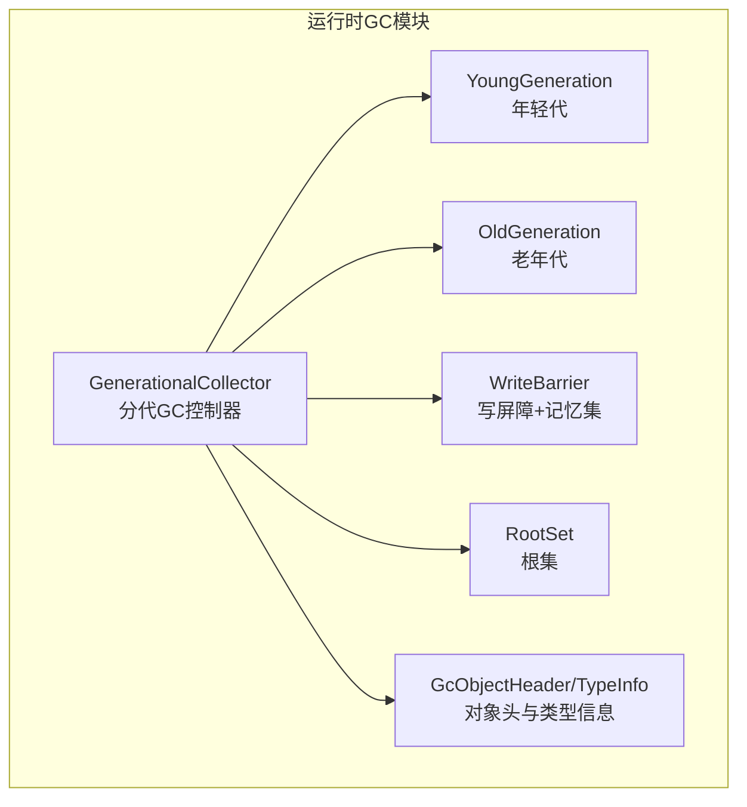
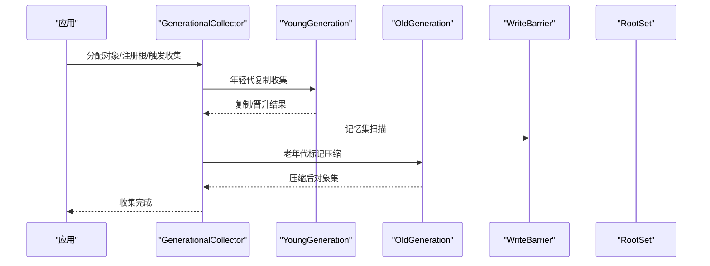
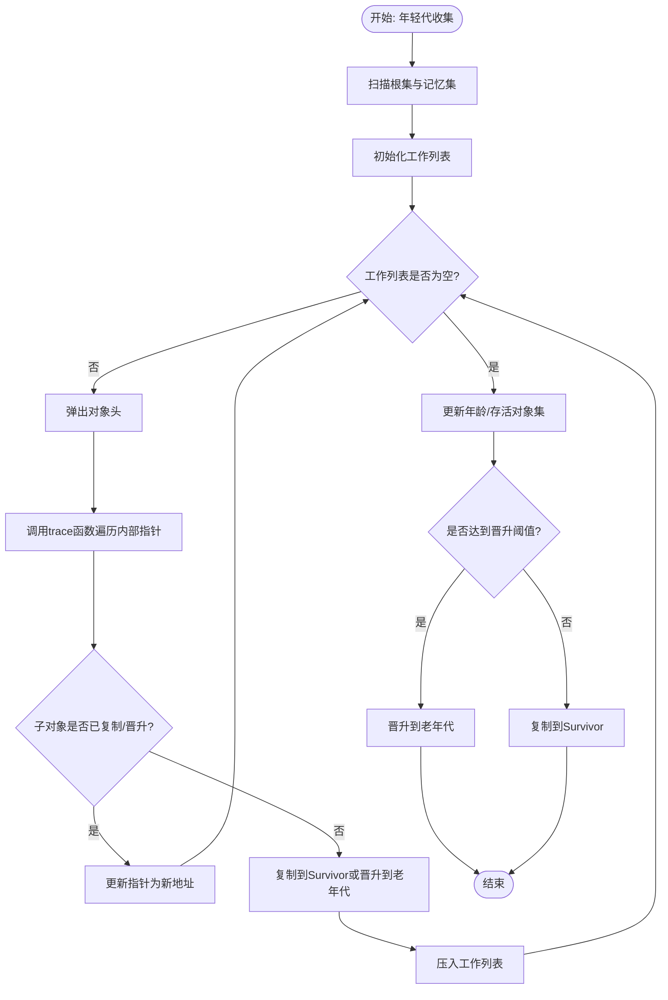
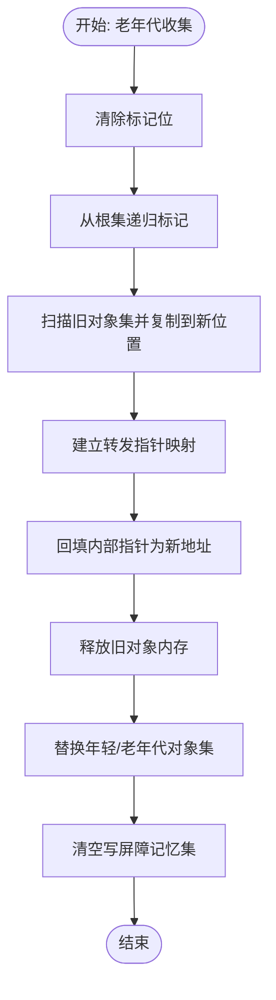
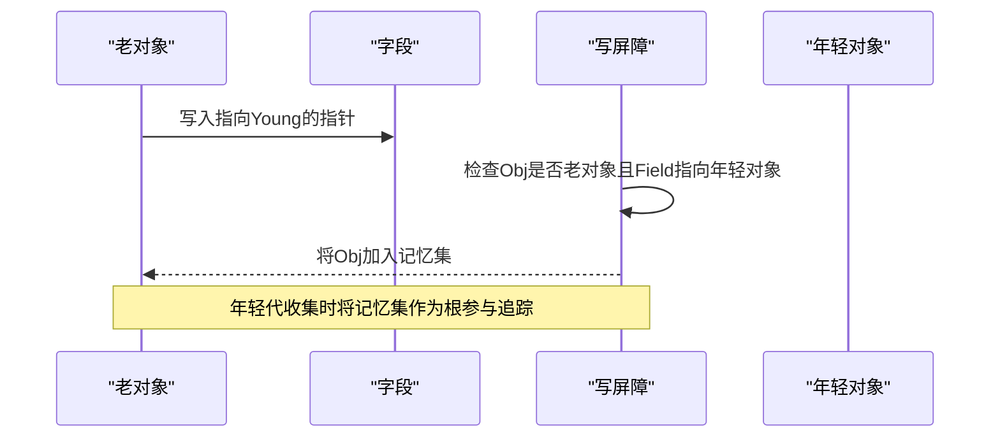
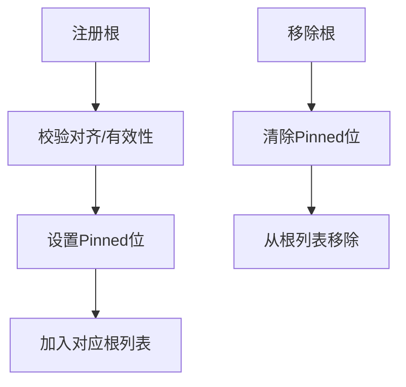
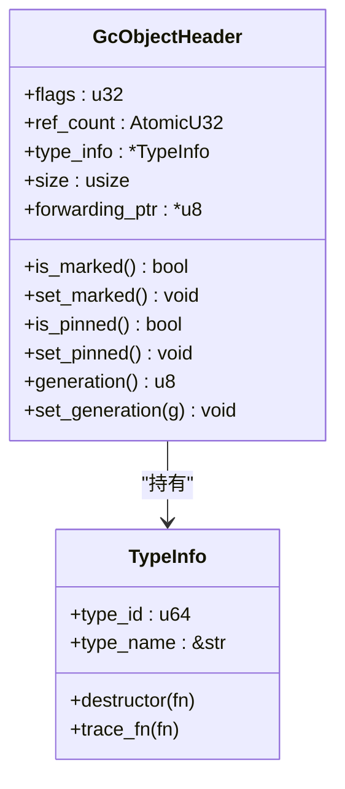
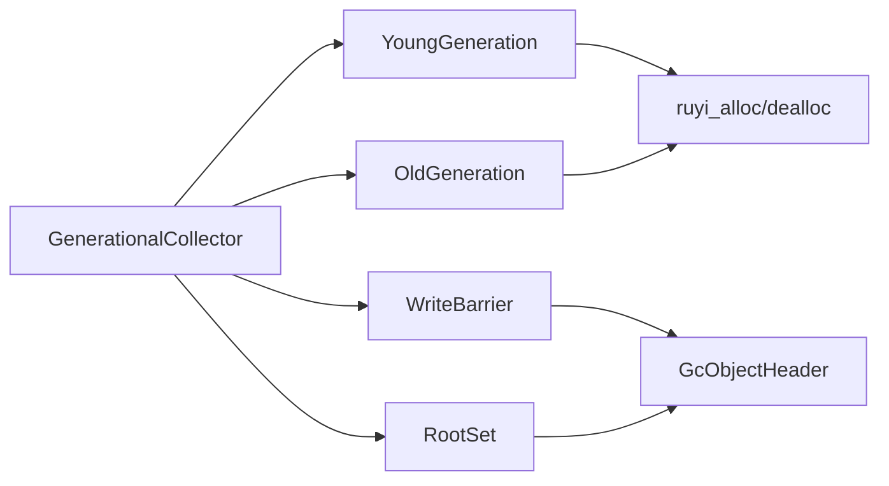

# 垃圾回收性能调优

<cite>
**本文引用的文件**
- [generational.rs](file://crates/ruyi_runtime/src/gc/generational.rs)
- [young.rs](file://crates/ruyi_runtime/src/gc/young.rs)
- [old.rs](file://crates/ruyi_runtime/src/gc/old.rs)
- [barrier.rs](file://crates/ruyi_runtime/src/gc/barrier.rs)
- [roots.rs](file://crates/ruyi_runtime/src/gc/roots.rs)
- [alloc.rs](file://crates/ruyi_runtime/src/alloc.rs)
- [gc.rs](file://crates/ruyi_runtime/src/gc.rs)
- [lib.rs](file://crates/ruyi_runtime/src/lib.rs)
- [gc_async_roots.rs](file://crates/ruyi_runtime/tests/gc_async_roots.rs)
- [gc_thread_local.rs](file://crates/ruyi_runtime/tests/gc_thread_local.rs)
- [.omo/evidence/task-3-memory-model.txt](file://.omo/evidence/task-3-memory-model.txt)
- [.omo/evidence/task-8-trace-fn-docstring.txt](file://.omo/evidence/task-8-trace-fn-docstring.txt)
- [.omo/evidence/task-8-fix-details.txt](file://.omo/evidence/task-8-fix-details.txt)
</cite>

## 目录
1. [简介](#简介)
2. [项目结构](#项目结构)
3. [核心组件](#核心组件)
4. [架构总览](#架构总览)
5. [详细组件分析](#详细组件分析)
6. [依赖关系分析](#依赖关系分析)
7. [性能考量与调优策略](#性能考量与调优策略)
8. [故障排查指南](#故障排查指南)
9. [结论](#结论)
10. [附录](#附录)

## 简介
本指南面向Ruyi运行时的垃圾回收系统，聚焦分代垃圾回收器的性能调优实践。文档基于仓库中的分代GC实现，系统阐述新生代复制收集器与老年代标记压缩算法的工作机制，给出参数调优策略（如新生代大小、晋升阈值、写屏障与根集管理），并提供停顿时间优化技术（增量回收、并发标记、并行收集器配置）、内存分配模式对GC性能的影响（对象生命周期与内存布局优化）、性能监控指标与瓶颈识别方法，以及真实调优案例研究。

## 项目结构
Ruyi运行时的GC子系统位于运行时库中，采用模块化组织：
- 分代GC主控制器：负责协调年轻代复制与老年代标记压缩、写屏障与根集管理
- 年轻代（Eden/Survivor）：负责新对象分配与短期存活对象的复制与晋升
- 老年代：负责长期存活对象的标记压缩回收
- 写屏障与记忆集：跟踪跨代指针，确保年轻代晋升或移动时不丢失可达性
- 根集：栈根与全局根的注册与扫描
- 对象头与分配器：统一的对象头布局、类型信息与分配/释放接口

图表来源
- [generational.rs:21-29](file://crates/ruyi_runtime/src/gc/generational.rs#L21-L29)
- [young.rs:11-15](file://crates/ruyi_runtime/src/gc/young.rs#L11-L15)
- [old.rs:10-12](file://crates/ruyi_runtime/src/gc/old.rs#L10-L12)
- [barrier.rs:13-15](file://crates/ruyi_runtime/src/gc/barrier.rs#L13-L15)
- [roots.rs:11-14](file://crates/ruyi_runtime/src/gc/roots.rs#L11-L14)
- [alloc.rs:41-80](file://crates/ruyi_runtime/src/alloc.rs#L41-L80)

章节来源
- [generational.rs:12-29](file://crates/ruyi_runtime/src/gc/generational.rs#L12-L29)
- [young.rs:6-15](file://crates/ruyi_runtime/src/gc/young.rs#L6-L15)
- [old.rs:5-12](file://crates/ruyi_runtime/src/gc/old.rs#L5-L12)
- [barrier.rs:7-15](file://crates/ruyi_runtime/src/gc/barrier.rs#L7-L15)
- [roots.rs:7-14](file://crates/ruyi_runtime/src/gc/roots.rs#L7-L14)
- [alloc.rs:37-80](file://crates/ruyi_runtime/src/alloc.rs#L37-L80)

## 核心组件
- 分代GC控制器：协调年轻代复制与老年代标记压缩；维护集合次数统计；提供写屏障与根集访问
- 年轻代：管理Eden与Survivor区对象、年龄与晋升阈值；执行复制收集
- 老年代：直接管理长期存活对象；执行标记压缩回收
- 写屏障与记忆集：检测跨代写入，记录老对象为“记忆集”根参与年轻代收集
- 根集：栈根与全局根注册、去注册与合并扫描
- 对象头与类型信息：统一头部布局、标记位、固定位域编码生成与策略

章节来源
- [generational.rs:31-54](file://crates/ruyi_runtime/src/gc/generational.rs#L31-L54)
- [young.rs:17-28](file://crates/ruyi_runtime/src/gc/young.rs#L17-L28)
- [old.rs:14-19](file://crates/ruyi_runtime/src/gc/old.rs#L14-L19)
- [barrier.rs:17-22](file://crates/ruyi_runtime/src/gc/barrier.rs#L17-L22)
- [roots.rs:16-22](file://crates/ruyi_runtime/src/gc/roots.rs#L16-L22)
- [alloc.rs:17-33](file://crates/ruyi_runtime/src/alloc.rs#L17-L33)

## 架构总览
分代GC以“年轻代复制 + 老年代标记压缩”为核心，配合写屏障与根集，形成完整的可达性追踪与回收闭环。年轻代通过复制收集降低碎片，老年代通过标记压缩减少碎片并提升缓存局部性。

图表来源
- [generational.rs:146-267](file://crates/ruyi_runtime/src/gc/generational.rs#L146-L267)
- [generational.rs:269-381](file://crates/ruyi_runtime/src/gc/generational.rs#L269-L381)
- [barrier.rs:58-66](file://crates/ruyi_runtime/src/gc/barrier.rs#L58-L66)
- [roots.rs:100-105](file://crates/ruyi_runtime/src/gc/roots.rs#L100-L105)

## 详细组件分析

### 年轻代复制收集器
- 功能要点
  - 新对象在Eden分配，存活对象复制到Survivor或晋升至老年代
  - 通过年龄计数与晋升阈值控制晋升时机
  - 使用工作列表进行可达性追踪，按类型信息的trace函数遍历内部指针
- 性能特征
  - 复制成本与存活对象规模线性相关
  - 晋升阈值过低导致频繁晋升，增加老年代压力；过高则年轻代空间浪费
  - 年轻代越大，复制成本越高，但可降低晋升频率

图表来源
- [generational.rs:146-267](file://crates/ruyi_runtime/src/gc/generational.rs#L146-L267)
- [generational.rs:430-455](file://crates/ruyi_runtime/src/gc/generational.rs#L430-L455)
- [young.rs:30-32](file://crates/ruyi_runtime/src/gc/young.rs#L30-L32)

章节来源
- [generational.rs:146-267](file://crates/ruyi_runtime/src/gc/generational.rs#L146-L267)
- [young.rs:17-77](file://crates/ruyi_runtime/src/gc/young.rs#L17-L77)

### 老年代标记压缩算法
- 功能要点
  - 从根集出发递归标记可达对象
  - 将存活对象复制到新的位置，同时建立转发指针
  - 回填阶段将内部指针更新为新地址
  - 清理不可达对象并重置写屏障
- 性能特征
  - 标记阶段与可达对象数量线性相关
  - 压缩阶段带来更好的内存局部性，减少碎片
  - 对大对象或高碎片场景收益显著

图表来源
- [generational.rs:269-381](file://crates/ruyi_runtime/src/gc/generational.rs#L269-L381)
- [barrier.rs:63-66](file://crates/ruyi_runtime/src/gc/barrier.rs#L63-L66)

章节来源
- [generational.rs:269-381](file://crates/ruyi_runtime/src/gc/generational.rs#L269-L381)
- [barrier.rs:63-75](file://crates/ruyi_runtime/src/gc/barrier.rs#L63-L75)

### 写屏障与记忆集
- 功能要点
  - 当老对象写入指向年轻对象的指针时，将老对象加入记忆集
  - 年轻代收集时，记忆集作为额外根参与追踪，避免遗漏跨代引用
- 性能特征
  - 写屏障在跨代写入时引入少量写开销
  - 记忆集容量与年轻代收集成本成正比，需平衡

图表来源
- [barrier.rs:24-48](file://crates/ruyi_runtime/src/gc/barrier.rs#L24-L48)
- [generational.rs:166-186](file://crates/ruyi_runtime/src/gc/generational.rs#L166-L186)

章节来源
- [barrier.rs:17-80](file://crates/ruyi_runtime/src/gc/barrier.rs#L17-L80)
- [generational.rs:166-186](file://crates/ruyi_runtime/src/gc/generational.rs#L166-L186)

### 根集管理
- 功能要点
  - 栈根：当前活跃栈帧中的本地变量
  - 全局根：模块级静态变量
  - 注册/去注册时设置/清除Pinned位，保证不被移动
- 性能特征
  - 根集越少，收集成本越低
  - 异步任务挂起期间需扫描future负载，提取潜在GC指针作为根

图表来源
- [roots.rs:24-61](file://crates/ruyi_runtime/src/gc/roots.rs#L24-L61)
- [roots.rs:100-121](file://crates/ruyi_runtime/src/gc/roots.rs#L100-L121)

章节来源
- [roots.rs:16-121](file://crates/ruyi_runtime/src/gc/roots.rs#L16-L121)
- [generational.rs:108-144](file://crates/ruyi_runtime/src/gc/generational.rs#L108-L144)

### 对象头与分配器
- 功能要点
  - 统一对象头布局，包含标记位、Pinned位、策略位与生成位
  - 分配/释放/扩容接口封装系统分配器
  - 类型信息包含trace函数，用于GC追踪内部指针
- 性能特征
  - 对象头占用固定开销，但换来统一的GC/ARC边界
  - trace函数回调签名变更以支持复制/压缩，需在自定义类型中正确实现

图表来源
- [alloc.rs:74-181](file://crates/ruyi_runtime/src/alloc.rs#L74-L181)
- [alloc.rs:41-57](file://crates/ruyi_runtime/src/alloc.rs#L41-L57)

章节来源
- [alloc.rs:17-33](file://crates/ruyi_runtime/src/alloc.rs#L17-L33)
- [alloc.rs:41-80](file://crates/ruyi_runtime/src/alloc.rs#L41-L80)
- [.omo/evidence/task-8-trace-fn-docstring.txt:1-1](file://.omo/evidence/task-8-trace-fn-docstring.txt#L1-L1)

## 依赖关系分析
- 组件耦合
  - GenerationalCollector聚合YoungGeneration、OldGeneration、WriteBarrier、RootSet
  - YoungGeneration与OldGeneration均依赖分配器与对象头
  - 写屏障与根集共同服务于收集器的可达性追踪
- 外部依赖
  - 分配器委托系统分配器，未来可替换为专用arena
  - 类型信息的trace函数由上层类型系统提供

图表来源
- [generational.rs:21-29](file://crates/ruyi_runtime/src/gc/generational.rs#L21-L29)
- [young.rs:38-47](file://crates/ruyi_runtime/src/gc/young.rs#L38-L47)
- [old.rs:25-33](file://crates/ruyi_runtime/src/gc/old.rs#L25-L33)
- [barrier.rs:33-48](file://crates/ruyi_runtime/src/gc/barrier.rs#L33-L48)
- [roots.rs:28-41](file://crates/ruyi_runtime/src/gc/roots.rs#L28-L41)

章节来源
- [generational.rs:21-29](file://crates/ruyi_runtime/src/gc/generational.rs#L21-L29)
- [young.rs:38-47](file://crates/ruyi_runtime/src/gc/young.rs#L38-L47)
- [old.rs:25-33](file://crates/ruyi_runtime/src/gc/old.rs#L25-L33)
- [barrier.rs:33-48](file://crates/ruyi_runtime/src/gc/barrier.rs#L33-L48)
- [roots.rs:28-41](file://crates/ruyi_runtime/src/gc/roots.rs#L28-L41)

## 性能考量与调优策略

### 参数调优策略
- 新生代大小配置
  - 增大新生代可降低晋升频率，适合短生命周期对象较多的场景；但会增加每次年轻代收集的复制成本
  - 减小新生代可提高晋升频率，适合长生命周期对象较多的场景；但会增加老年代压力
  - 建议结合对象生命周期分布与停顿目标进行A/B测试
- 晋升阈值设置
  - 提升阈值过低：频繁晋升，老年代增长快，可能引发更频繁的Full GC
  - 提升阈值过高：年轻代空间浪费，复制成本上升
  - 可根据对象年龄直方图与晋升率动态调整
- 写屏障优化
  - 控制记忆集大小，避免过多老对象进入记忆集
  - 在热点路径尽量减少跨代写入，降低写屏障触发
- 根集管理
  - 最小化根集规模，及时移除不再使用的根
  - 异步任务挂起时，扫描future负载提取根，避免误删

章节来源
- [generational.rs:44-54](file://crates/ruyi_runtime/src/gc/generational.rs#L44-L54)
- [generational.rs:166-186](file://crates/ruyi_runtime/src/gc/generational.rs#L166-L186)
- [generational.rs:108-144](file://crates/ruyi_runtime/src/gc/generational.rs#L108-L144)
- [barrier.rs:58-66](file://crates/ruyi_runtime/src/gc/barrier.rs#L58-L66)

### 停顿时间优化技术
- 增量回收
  - 将一次Full GC拆分为多个小步，穿插在应用执行中，降低单次停顿
  - 适用于对延迟敏感的应用
- 并发标记
  - 在应用线程运行的同时进行标记，缩短STW时间
  - 需要写屏障配合，确保并发过程中的可达性正确
- 并行收集器配置
  - 利用多核并行执行标记/复制/压缩，缩短总耗时
  - 注意并行度与CPU核心数、内存带宽的平衡

[本节为通用指导，无需特定文件引用]

### 内存分配模式对GC性能的影响
- 对象生命周期分析
  - 短生命周期对象：适合放在新生代，降低晋升成本
  - 长生命周期对象：尽早晋升到老年代，减少年轻代复制成本
- 内存布局优化
  - 合理的类型设计与对象大小，有助于提升缓存命中与压缩效率
  - 避免过度碎片化的分配模式，减少老年代压缩成本

[本节为通用指导，无需特定文件引用]

### 性能监控指标与瓶颈识别
- 关键指标
  - 年轻代/老年代对象数量与增长率
  - 年轻代/Full GC次数与耗时
  - 记忆集大小与写屏障触发频率
  - 根集规模变化趋势
- 瓶颈识别
  - 若晋升率过高，优先增大新生代或提升阈值
  - 若Full GC耗时过长，优先优化根集规模与减少跨代写入
  - 若压缩阶段耗时高，考虑减少碎片化分配或调整对象大小

章节来源
- [generational.rs:387-413](file://crates/ruyi_runtime/src/gc/generational.rs#L387-L413)
- [generational.rs:108-144](file://crates/ruyi_runtime/src/gc/generational.rs#L108-L144)
- [barrier.rs:77-79](file://crates/ruyi_runtime/src/gc/barrier.rs#L77-L79)

### 实际调优案例研究
- 案例一：异步任务根集扫描
  - 场景：挂起的异步任务future中包含GC指针，需在收集前扫描并注册为根
  - 方法：使用注册异步根的流程，确保被挂起的任务对象不被误删
  - 结果：避免了因根集缺失导致的误回收，提升了稳定性
- 案例二：线程本地GC隔离
  - 场景：多线程并发分配与收集，需保证线程间堆隔离
  - 方法：验证线程本地分配指针唯一性、收集隔离与线程退出不影响主堆
  - 结果：确保了多线程环境下的GC正确性与性能

章节来源
- [gc_async_roots.rs:46-93](file://crates/ruyi_runtime/tests/gc_async_roots.rs#L46-L93)
- [gc_async_roots.rs:95-143](file://crates/ruyi_runtime/tests/gc_async_roots.rs#L95-L143)
- [gc_thread_local.rs:18-74](file://crates/ruyi_runtime/tests/gc_thread_local.rs#L18-L74)
- [gc_thread_local.rs:109-135](file://crates/ruyi_runtime/tests/gc_thread_local.rs#L109-L135)

## 故障排查指南
- 常见问题
  - 根集未正确注册：导致对象被误回收
  - 写屏障未触发：跨代写入导致的漏标
  - 类型信息trace函数错误：内部指针未正确遍历
  - 异步任务根集缺失：挂起任务对象被回收
- 排查步骤
  - 检查根集注册/去注册逻辑与Pinned位状态
  - 验证写屏障在跨代写入处的触发
  - 确认trace函数回调签名与实现正确
  - 在Full GC前后打印对象计数与根集规模
- 测试参考
  - 运行时GC测试覆盖了写屏障、晋升阈值、根集与标记压缩等关键行为

章节来源
- [generational.rs:523-742](file://crates/ruyi_runtime/src/gc/generational.rs#L523-L742)
- [barrier.rs:88-141](file://crates/ruyi_runtime/src/gc/barrier.rs#L88-L141)
- [roots.rs:17-74](file://crates/ruyi_runtime/tests/gc_thread_local.rs#L17-L74)
- [.omo/evidence/task-8-fix-details.txt:58-75](file://.omo/evidence/task-8-fix-details.txt#L58-L75)

## 结论
Ruyi的分代GC通过年轻代复制与老年代标记压缩实现了高效的内存回收，配合写屏障与根集管理，能够满足大多数应用场景的性能需求。调优的关键在于合理配置新生代大小与晋升阈值、优化根集规模与写屏障触发、并结合对象生命周期与内存分配模式进行针对性优化。通过持续监控关键指标与回归测试，可稳定提升GC性能与系统整体吞吐。

## 附录
- 内存模型与GC语义证据：仓库提供了GC语义、对象布局与安全保证的证据材料，可作为设计与调优的依据
- trace函数签名变更：为支持复制/压缩，trace函数回调签名已更新，需在自定义类型中正确实现

章节来源
- [.omo/evidence/task-3-memory-model.txt:1-34](file://.omo/evidence/task-3-memory-model.txt#L1-L34)
- [.omo/evidence/task-8-trace-fn-docstring.txt:1-1](file://.omo/evidence/task-8-trace-fn-docstring.txt#L1-L1)