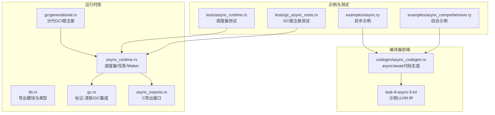
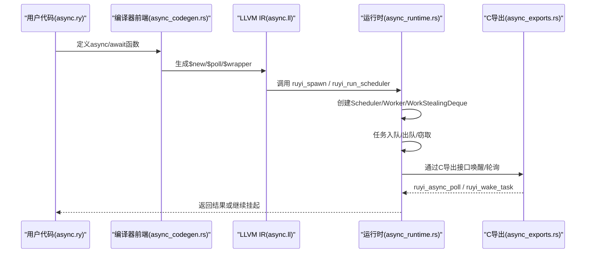
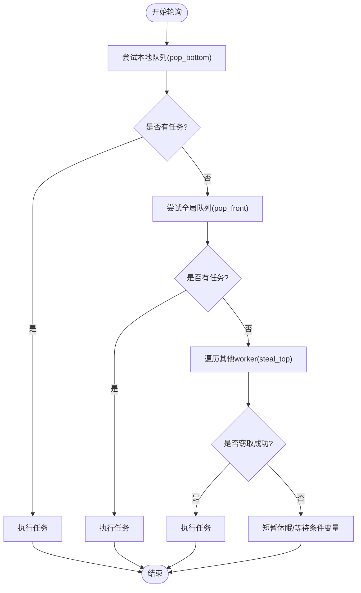
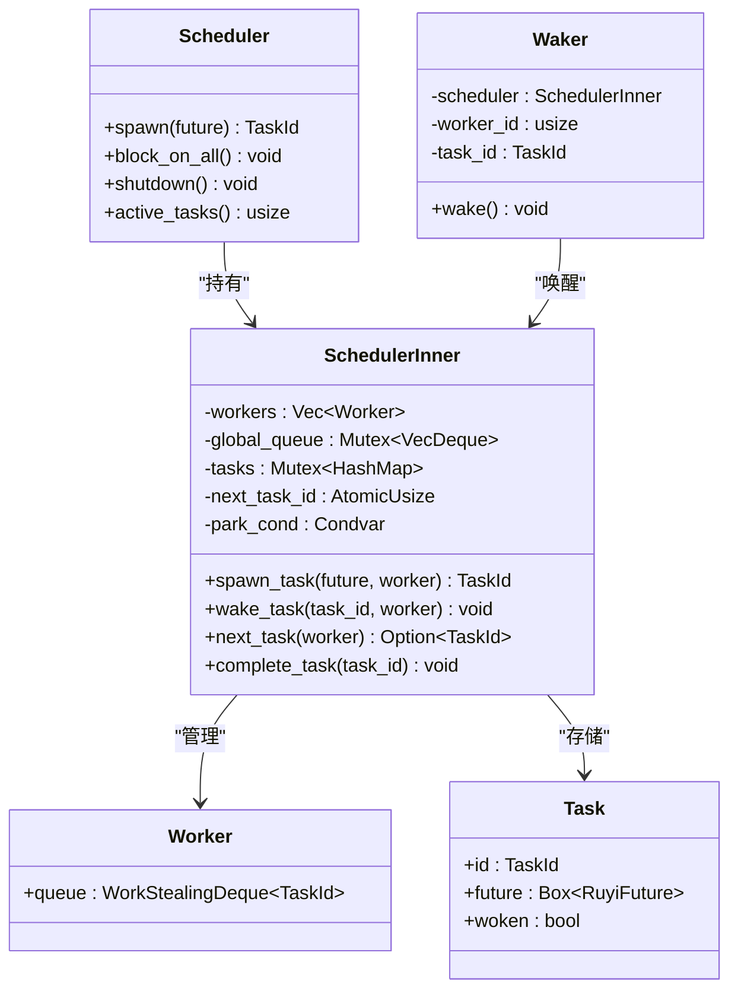
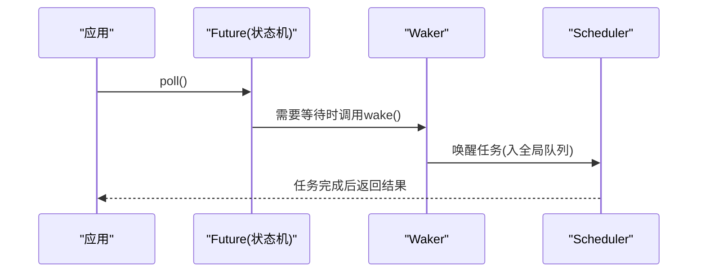
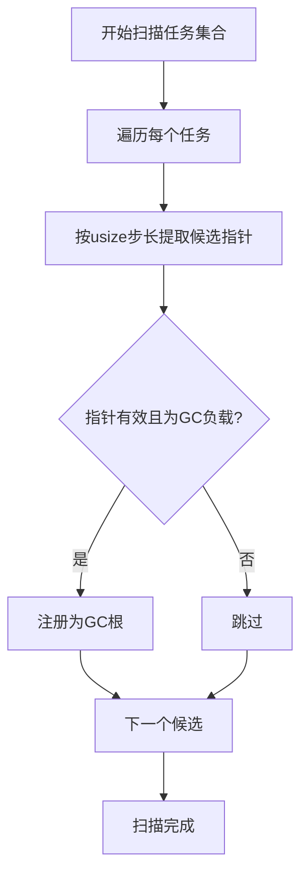
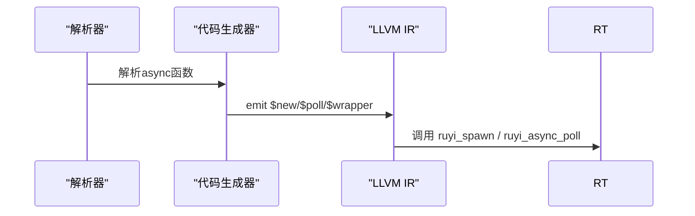
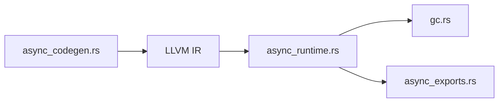

# 异步运行时优化

<cite>
**本文引用的文件**   
- [lib.rs](file://crates/ruyi_runtime/src/lib.rs)
- [async_runtime.rs](file://crates/ruyi_runtime/src/async_runtime.rs)
- [async_exports.rs](file://crates/ruyi_runtime/src/async_exports.rs)
- [gc.rs](file://crates/ruyi_runtime/src/gc.rs)
- [generational.rs](file://crates/ruyi_runtime/src/gc/generational.rs)
- [async_runtime 测试](file://crates/ruyi_runtime/tests/async_runtime.rs)
- [async_codegen.rs](file://crates/ruyic/src/codegen/async_codegen.rs)
- [async.ll](file://.omo/evidence/task-8-async-ll.txt)
- [async.ry](file://examples/async.ry)
- [async_comprehensive.ry](file://examples/async_comprehensive.ry)
- [gc_async_roots 测试](file://crates/ruyi_runtime/tests/gc_async_roots.rs)
</cite>

## 目录
1. [引言](#引言)
2. [项目结构](#项目结构)
3. [核心组件](#核心组件)
4. [架构总览](#架构总览)
5. [详细组件分析](#详细组件分析)
6. [依赖关系分析](#依赖关系分析)
7. [性能考量](#性能考量)
8. [故障排查指南](#故障排查指南)
9. [结论](#结论)
10. [附录](#附录)

## 引言
本指南聚焦于Ruyi异步运行时系统的性能优化，围绕以下主题展开：
- 工作窃取调度器的性能特性：任务队列设计、负载均衡与线程亲和性
- 异步任务的性能特征：任务粒度、上下文切换开销、协程栈管理
- 异步I/O的性能优化：事件循环、回调链路与异步资源管理
- 异步编程模式的最佳实践：任务分解、并发度控制、死锁规避
- 运行时监控指标、性能瓶颈诊断与实际优化案例

## 项目结构
Ruyi运行时由运行时库与编译器前端协同组成：
- 运行时库（ruyi_runtime）：提供工作窃取调度器、任务模型、Waker机制、GC集成与C导出接口
- 编译器前端（ruyic）：负责将Ruyi语言中的async/await语法编译为状态机，并生成调用运行时的LLVM IR
- 示例与证据：展示异步函数的状态机生成、运行时调用序列以及GC根注册流程

**图示来源**
- [lib.rs:1-50](file://crates/ruyi_runtime/src/lib.rs#L1-L50)
- [async_runtime.rs:1-120](file://crates/ruyi_runtime/src/async_runtime.rs#L1-L120)
- [gc.rs:1-60](file://crates/ruyi_runtime/src/gc.rs#L1-L60)
- [generational.rs:108-144](file://crates/ruyi_runtime/src/gc/generational.rs#L108-L144)
- [async_exports.rs:1-40](file://crates/ruyi_runtime/src/async_exports.rs#L1-L40)
- [async_codegen.rs:206-280](file://crates/ruyic/src/codegen/async_codegen.rs#L206-L280)
- [async.ll:53-72](file://.omo/evidence/task-8-async-ll.txt#L53-L72)

**章节来源**
- [lib.rs:1-50](file://crates/ruyi_runtime/src/lib.rs#L1-L50)
- [async_runtime.rs:1-120](file://crates/ruyi_runtime/src/async_runtime.rs#L1-L120)

## 核心组件
- 调度器与任务模型
  - 工作窃取双端队列：每个worker维护本地队列，全局队列用于唤醒与跨线程窃取
  - 任务生命周期：spawn → poll → wake → complete；支持阻塞等待与优雅关闭
- Waker机制：在任务挂起时记录唤醒目标，避免不必要的线程切换
- GC集成：异步任务作为GC根，在GC前扫描并注册，防止悬挂指针
- C导出接口：供编译器生成的LLVM IR直接调用，屏蔽状态机细节

**章节来源**
- [async_runtime.rs:94-136](file://crates/ruyi_runtime/src/async_runtime.rs#L94-L136)
- [async_runtime.rs:140-249](file://crates/ruyi_runtime/src/async_runtime.rs#L140-L249)
- [async_runtime.rs:384-455](file://crates/ruyi_runtime/src/async_runtime.rs#L384-L455)
- [async_exports.rs:43-92](file://crates/ruyi_runtime/src/async_exports.rs#L43-L92)

## 架构总览
下图展示了从Ruyi源码到LLVM IR再到运行时的调用链，体现异步I/O与事件循环的协作方式。

**图示来源**
- [async.ry:16-28](file://examples/async.ry#L16-L28)
- [async_codegen.rs:206-280](file://crates/ruyic/src/codegen/async_codegen.rs#L206-L280)
- [async.ll:53-72](file://.omo/evidence/task-8-async-ll.txt#L53-L72)
- [async_runtime.rs:251-314](file://crates/ruyi_runtime/src/async_runtime.rs#L251-L314)
- [async_exports.rs:43-92](file://crates/ruyi_runtime/src/async_exports.rs#L43-L92)

## 详细组件分析

### 工作窃取调度器与队列设计
- 双端队列语义
  - push_bottom/pop_bottom：本地worker优先消费
  - steal_top：跨线程窃取，降低全局锁竞争
- 负载均衡策略
  - 本地优先 → 全局队列 → 其他worker窃取的三级查找
  - 唤醒任务进入全局队列，减少worker间锁争用
- 线程亲和性
  - 当前实现未显式绑定OS线程与worker ID，建议在生产环境结合CPU亲和性与NUMA感知进行部署

**图示来源**
- [async_runtime.rs:216-237](file://crates/ruyi_runtime/src/async_runtime.rs#L216-L237)

**章节来源**
- [async_runtime.rs:94-136](file://crates/ruyi_runtime/src/async_runtime.rs#L94-L136)
- [async_runtime.rs:140-249](file://crates/ruyi_runtime/src/async_runtime.rs#L140-L249)

### 异步任务模型与Waker机制
- 任务结构
  - Task封装Box<dyn RuyiFuture>，携带woken标志
- Waker
  - 记录所属worker与task_id，统一通过调度器唤醒
- 事件循环
  - worker_loop按需唤醒与休眠，避免忙等

**图示来源**
- [async_runtime.rs:140-314](file://crates/ruyi_runtime/src/async_runtime.rs#L140-L314)

**章节来源**
- [async_runtime.rs:28-93](file://crates/ruyi_runtime/src/async_runtime.rs#L28-L93)
- [async_runtime.rs:316-357](file://crates/ruyi_runtime/src/async_runtime.rs#L316-L357)

### 异步I/O与事件循环优化
- 事件循环
  - 通过全局调度器驱动任务，避免阻塞OS线程
- 回调链路精简
  - 将状态机封装在future中，Waker仅负责唤醒，不参与业务逻辑
- 异步资源管理
  - 通过GC根注册确保挂起期间的对象可达，避免被回收

**图示来源**
- [async_runtime.rs:384-400](file://crates/ruyi_runtime/src/async_runtime.rs#L384-L400)
- [async_runtime.rs:426-455](file://crates/ruyi_runtime/src/async_runtime.rs#L426-L455)

**章节来源**
- [async_runtime.rs:384-455](file://crates/ruyi_runtime/src/async_runtime.rs#L384-L455)

### GC集成与根注册
- 根扫描策略
  - 遍历future实例字节流，按机器字长对齐提取可能指向GC对象的指针
  - 对有效负载指针注册为GC根，保证挂起任务可达
- 分代GC优化
  - 分代收集器提供更高效的晋升与回收策略，配合根注册提升吞吐

**图示来源**
- [async_runtime.rs:430-455](file://crates/ruyi_runtime/src/async_runtime.rs#L430-L455)
- [generational.rs:116-144](file://crates/ruyi_runtime/src/gc/generational.rs#L116-L144)

**章节来源**
- [gc.rs:15-198](file://crates/ruyi_runtime/src/gc.rs#L15-L198)
- [generational.rs:108-144](file://crates/ruyi_runtime/src/gc/generational.rs#L108-L144)
- [gc_async_roots 测试:112-143](file://crates/ruyi_runtime/tests/gc_async_roots.rs#L112-L143)

### 代码生成与状态机
- 编译器将async函数转换为三段式LLVM实体：$new构造、$poll推进、包装函数
- $poll函数维护状态机，通过ruyi_async_poll与运行时交互

**图示来源**
- [async_codegen.rs:206-280](file://crates/ruyic/src/codegen/async_codegen.rs#L206-L280)
- [async.ll:61-72](file://.omo/evidence/task-8-async-ll.txt#L61-L72)

**章节来源**
- [async_codegen.rs:1-200](file://crates/ruyic/src/codegen/async_codegen.rs#L1-L200)
- [async_codegen.rs:206-445](file://crates/ruyic/src/codegen/async_codegen.rs#L206-L445)

## 依赖关系分析
- 组件耦合
  - async_runtime依赖gc模块进行根注册
  - async_exports桥接编译器生成的IR与运行时
- 外部依赖
  - once_cell用于懒加载全局调度器
  - 标准库同步原语（Mutex/Condvar）支撑调度器

**图示来源**
- [async_codegen.rs:206-280](file://crates/ruyic/src/codegen/async_codegen.rs#L206-L280)
- [async_runtime.rs:140-314](file://crates/ruyi_runtime/src/async_runtime.rs#L140-L314)
- [gc.rs:1-60](file://crates/ruyi_runtime/src/gc.rs#L1-L60)
- [async_exports.rs:1-40](file://crates/ruyi_runtime/src/async_exports.rs#L1-L40)

**章节来源**
- [lib.rs:1-50](file://crates/ruyi_runtime/src/lib.rs#L1-L50)
- [async_runtime.rs:12-20](file://crates/ruyi_runtime/src/async_runtime.rs#L12-L20)

## 性能考量
- 任务粒度
  - 避免过细任务导致调度开销占比过高；将I/O与计算合并为更大的工作单元
- 上下文切换
  - 使用JoinAll/Race组合器批量等待，减少频繁唤醒与队列抖动
- 协程栈管理
  - 采用堆上状态机与最小化栈帧，避免深递归与大对象拷贝
- 事件循环
  - 控制唤醒频率，避免“抖动”；必要时引入批处理唤醒
- GC与根注册
  - 分代GC与增量扫描可降低停顿；确保根注册覆盖所有活跃future
- 并发度控制
  - 依据CPU核数与I/O特性设置worker数量，避免过度并行

[本节为通用指导，无需特定文件来源]

## 故障排查指南
- 调度器问题
  - 症状：任务无法完成或调度器卡住
  - 排查：检查active_tasks计数、全局队列长度、worker空闲时间
  - 参考测试：多任务并发与唯一ID校验
- GC根泄漏
  - 症状：长时间运行后内存增长
  - 排查：确认register_async_roots在每次GC前被调用；验证对象可达性
- I/O唤醒异常
  - 症状：任务永不恢复
  - 排查：检查Waker构造与task_id一致性；验证C导出接口调用

**章节来源**
- [async_runtime 测试:124-156](file://crates/ruyi_runtime/tests/async_runtime.rs#L124-L156)
- [gc_async_roots 测试:112-143](file://crates/ruyi_runtime/tests/gc_async_roots.rs#L112-L143)

## 结论
Ruyi异步运行时以工作窃取调度器为核心，结合简洁的Waker机制与GC根注册，提供了可扩展的异步执行框架。通过合理的任务粒度、事件循环与GC策略，可在高并发I/O场景下获得稳定性能。建议在生产环境中结合CPU亲和性与分代GC进一步优化吞吐与延迟。

[本节为总结，无需特定文件来源]

## 附录
- 示例与基准
  - 示例程序演示了基本的await与并发执行
  - 代码生成证据展示了状态机的LLVM IR形态

**章节来源**
- [async.ry:1-28](file://examples/async.ry#L1-L28)
- [async_comprehensive.ry:1-141](file://examples/async_comprehensive.ry#L1-L141)
- [async.ll:53-137](file://.omo/evidence/task-8-async-ll.txt#L53-L137)