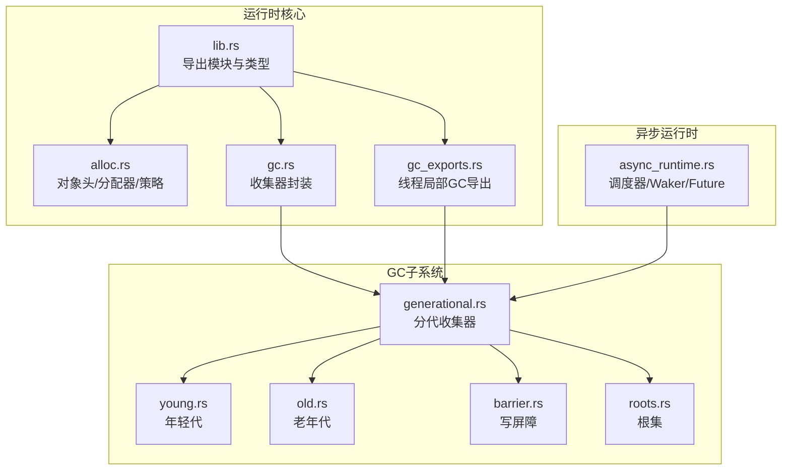
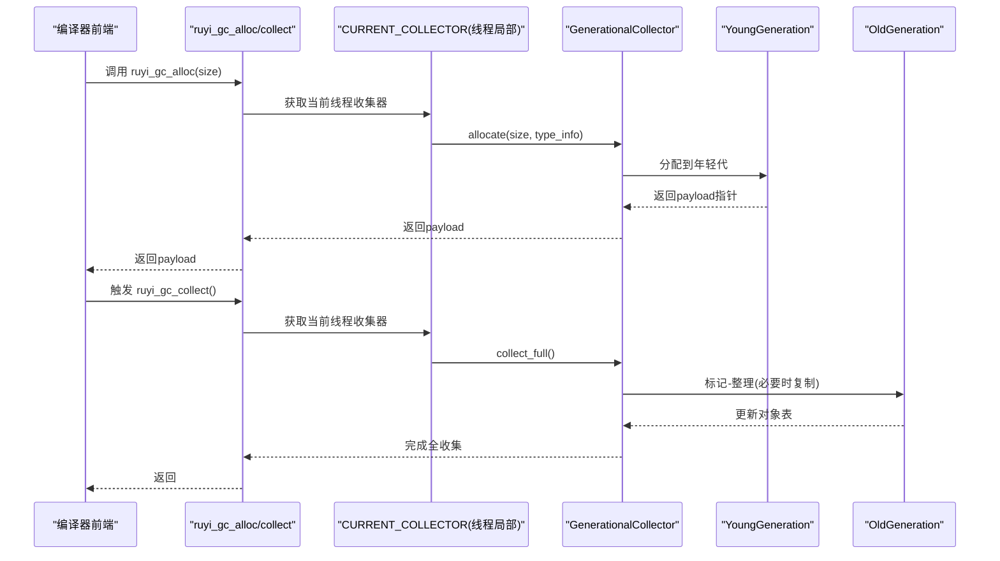
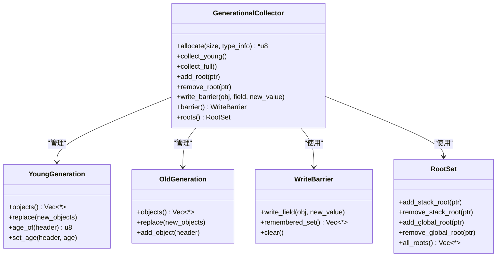
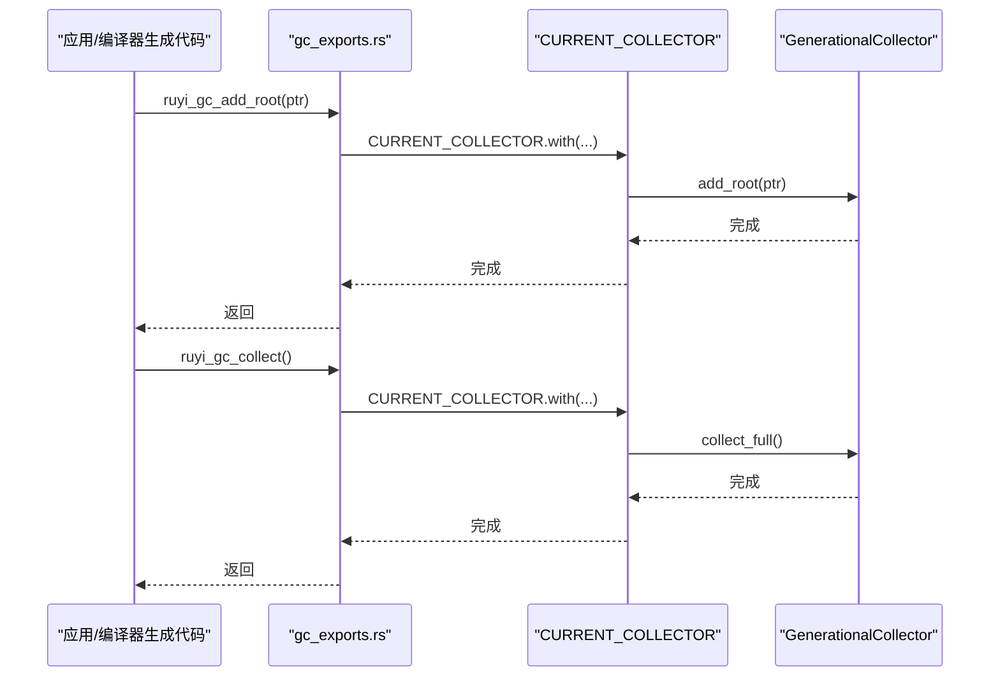
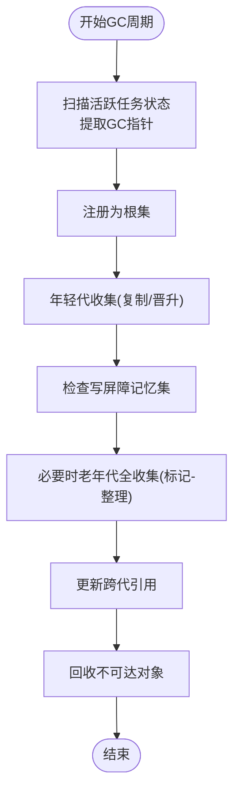
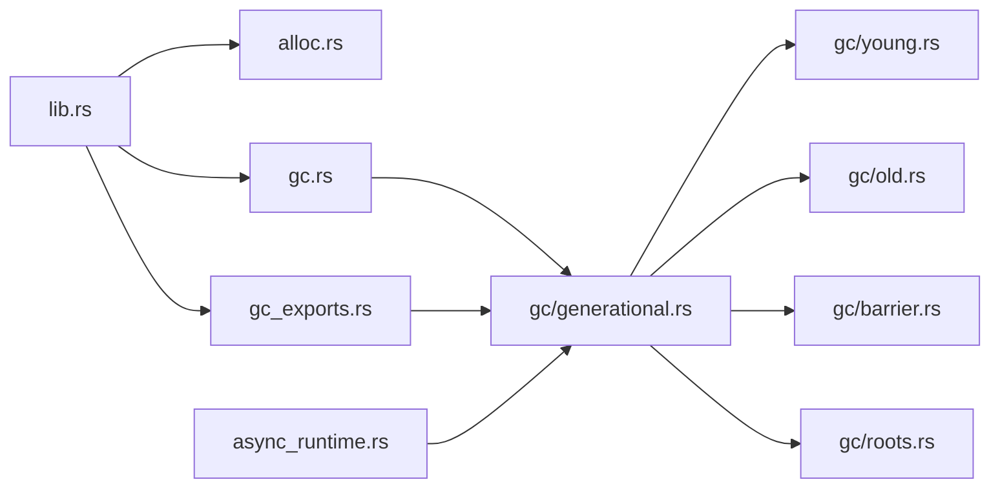

# 性能监控与指标

<cite>
**本文引用的文件**
- [lib.rs](file://crates/ruyi_runtime/src/lib.rs)
- [alloc.rs](file://crates/ruyi_runtime/src/alloc.rs)
- [gc.rs](file://crates/ruyi_runtime/src/gc.rs)
- [generational.rs](file://crates/ruyi_runtime/src/gc/generational.rs)
- [young.rs](file://crates/ruyi_runtime/src/gc/young.rs)
- [old.rs](file://crates/ruyi_runtime/src/gc/old.rs)
- [barrier.rs](file://crates/ruyi_runtime/src/gc/barrier.rs)
- [roots.rs](file://crates/ruyi_runtime/src/gc/roots.rs)
- [gc_exports.rs](file://crates/ruyi_runtime/src/gc_exports.rs)
- [async_runtime.rs](file://crates/ruyi_runtime/src/async_runtime.rs)
- [gc_thread_local.rs](file://crates/ruyi_runtime/tests/gc_thread_local.rs)
- [gc_exports.rs（测试）](file://crates/ruyi_runtime/tests/gc_exports.rs)
- [Cargo.toml（ruyi_runtime）](file://crates/ruyi_runtime/Cargo.toml)
- [main.rs（编译器基准）](file://crates/ruyic/benches/main.rs)
</cite>

## 目录
1. [简介](#简介)
2. [项目结构](#项目结构)
3. [核心组件](#核心组件)
4. [架构总览](#架构总览)
5. [详细组件分析](#详细组件分析)
6. [依赖关系分析](#依赖关系分析)
7. [性能考量](#性能考量)
8. [故障排查指南](#故障排查指南)
9. [结论](#结论)
10. [附录](#附录)

## 简介
本指南聚焦于 Ruyi 运行时系统的性能监控与指标分析，围绕以下目标展开：
- 关键性能指标：GC 暂停时间、吞吐量、内存利用率、CPU 使用率的定义与计算思路
- 运行时监控工具：内置统计信息、外部监控集成、实时性能分析
- 瓶颈识别技术：热点分析、调用链追踪、资源竞争检测
- 基准测试框架：测试用例设计、结果分析、回归检测
- 决策支持与自动化：性能优化建议、自动化监控配置方案

本指南以仓库中实际实现为依据，结合可扩展点给出实践建议，帮助读者在不牺牲正确性的前提下进行系统级性能优化。

## 项目结构
Ruyi 运行时的核心位于 crates/ruyi_runtime，其中 GC 子系统由年轻代、老年代、写屏障与根集管理组成；同时提供线程局部的 GC 导出接口，便于编译器前端在生成的 LLVM IR 中直接调用。

图表来源
- [lib.rs:1-50](file://crates/ruyi_runtime/src/lib.rs#L1-L50)
- [alloc.rs:1-120](file://crates/ruyi_runtime/src/alloc.rs#L1-L120)
- [gc.rs:1-60](file://crates/ruyi_runtime/src/gc.rs#L1-L60)
- [generational.rs:1-60](file://crates/ruyi_runtime/src/gc/generational.rs#L1-L60)
- [young.rs:1-40](file://crates/ruyi_runtime/src/gc/young.rs#L1-L40)
- [old.rs:1-40](file://crates/ruyi_runtime/src/gc/old.rs#L1-L40)
- [barrier.rs:1-40](file://crates/ruyi_runtime/src/gc/barrier.rs#L1-L40)
- [roots.rs:1-40](file://crates/ruyi_runtime/src/gc/roots.rs#L1-L40)
- [gc_exports.rs:1-40](file://crates/ruyi_runtime/src/gc_exports.rs#L1-L40)
- [async_runtime.rs:1-60](file://crates/ruyi_runtime/src/async_runtime.rs#L1-L60)

章节来源
- [lib.rs:1-50](file://crates/ruyi_runtime/src/lib.rs#L1-L50)
- [Cargo.toml（ruyi_runtime）:1-17](file://crates/ruyi_runtime/Cargo.toml#L1-L17)

## 核心组件
- 对象头与内存策略：统一的 GC 对象头承载标记位、引用计数、类型信息、大小与转发指针，并通过内存策略位区分 GC/ARC。
- 分代收集器：年轻代采用复制算法，老年代采用标记-整理；通过写屏障跟踪跨代引用，维护记忆集。
- 根集管理：分离栈根与全局根，确保可达性分析起点完整。
- 线程局部 GC：每个线程拥有独立的收集器实例，避免锁竞争，提升并发性能。
- 异步运行时：任务队列、工作窃取、唤醒机制，配合 GC 根注册保证挂起任务可达。

章节来源
- [alloc.rs:35-181](file://crates/ruyi_runtime/src/alloc.rs#L35-L181)
- [generational.rs:12-54](file://crates/ruyi_runtime/src/gc/generational.rs#L12-L54)
- [roots.rs:7-40](file://crates/ruyi_runtime/src/gc/roots.rs#L7-L40)
- [barrier.rs:7-40](file://crates/ruyi_runtime/src/gc/barrier.rs#L7-L40)
- [young.rs:6-30](file://crates/ruyi_runtime/src/gc/young.rs#L6-L30)
- [old.rs:5-30](file://crates/ruyi_runtime/src/gc/old.rs#L5-L30)
- [gc_exports.rs:12-44](file://crates/ruyi_runtime/src/gc_exports.rs#L12-L44)
- [async_runtime.rs:1-60](file://crates/ruyi_runtime/src/async_runtime.rs#L1-L60)

## 架构总览
运行时通过线程局部的 GC 收集器对外暴露 C ABI 接口，供编译器生成的 IR 调用；异步运行时在每次 GC 前后注册/清理根，确保协程状态安全。

图表来源
- [gc_exports.rs:24-44](file://crates/ruyi_runtime/src/gc_exports.rs#L24-L44)
- [generational.rs:146-186](file://crates/ruyi_runtime/src/gc/generational.rs#L146-L186)
- [young.rs:34-47](file://crates/ruyi_runtime/src/gc/young.rs#L34-L47)
- [old.rs:21-33](file://crates/ruyi_runtime/src/gc/old.rs#L21-L33)

## 详细组件分析

### 分代收集器与根集
- 年轻代：新对象进入，存活者复制到幸存区或晋升至老年代；通过年龄阈值控制晋升。
- 老年代：较少频率的全收集，采用标记-整理减少碎片。
- 写屏障与记忆集：记录跨代写入，确保老年代被视作额外根参与年轻代收集。
- 根集：栈根与全局根均置为“固定”位，避免在复制/整理阶段被移动。

图表来源
- [generational.rs:21-54](file://crates/ruyi_runtime/src/gc/generational.rs#L21-L54)
- [young.rs:11-30](file://crates/ruyi_runtime/src/gc/young.rs#L11-L30)
- [old.rs:10-30](file://crates/ruyi_runtime/src/gc/old.rs#L10-L30)
- [barrier.rs:13-25](file://crates/ruyi_runtime/src/gc/barrier.rs#L13-L25)
- [roots.rs:11-22](file://crates/ruyi_runtime/src/gc/roots.rs#L11-L22)

章节来源
- [generational.rs:146-267](file://crates/ruyi_runtime/src/gc/generational.rs#L146-L267)
- [generational.rs:269-381](file://crates/ruyi_runtime/src/gc/generational.rs#L269-L381)
- [young.rs:34-77](file://crates/ruyi_runtime/src/gc/young.rs#L34-L77)
- [old.rs:21-57](file://crates/ruyi_runtime/src/gc/old.rs#L21-L57)
- [barrier.rs:24-76](file://crates/ruyi_runtime/src/gc/barrier.rs#L24-L76)
- [roots.rs:24-122](file://crates/ruyi_runtime/src/gc/roots.rs#L24-L122)

### 线程局部 GC 与导出接口
- 线程局部存储：每个线程持有独立的 GenerationalCollector 实例，退出时自动释放。
- 外部接口：ruyi_gc_alloc、ruyi_gc_collect、ruyi_gc_add_root、ruyi_gc_remove_root、ruyi_gc_write_barrier。
- 测试验证：多线程隔离、根注册与回收行为、跨代写屏障触发等。

图表来源
- [gc_exports.rs:46-88](file://crates/ruyi_runtime/src/gc_exports.rs#L46-L88)
- [generational.rs:269-381](file://crates/ruyi_runtime/src/gc/generational.rs#L269-L381)

章节来源
- [gc_exports.rs:12-88](file://crates/ruyi_runtime/src/gc_exports.rs#L12-L88)
- [gc_thread_local.rs:17-59](file://crates/ruyi_runtime/tests/gc_thread_local.rs#L17-L59)
- [gc_thread_local.rs:165-211](file://crates/ruyi_runtime/tests/gc_thread_local.rs#L165-L211)
- [gc_exports.rs（测试）:46-119](file://crates/ruyi_runtime/tests/gc_exports.rs#L46-L119)

### 异步运行时与 GC 集成
- 任务注册为根：在执行 GC 前后，将活跃任务的内部状态扫描并注册为根，防止协程引用被误回收。
- 调度器与工作窃取：通过本地队列与全局队列协作，降低锁争用，提高吞吐。

图表来源
- [generational.rs:108-144](file://crates/ruyi_runtime/src/gc/generational.rs#L108-L144)
- [generational.rs:269-381](file://crates/ruyi_runtime/src/gc/generational.rs#L269-L381)
- [async_runtime.rs:426-455](file://crates/ruyi_runtime/src/async_runtime.rs#L426-L455)

章节来源
- [async_runtime.rs:402-457](file://crates/ruyi_runtime/src/async_runtime.rs#L402-L457)
- [generational.rs:108-144](file://crates/ruyi_runtime/src/gc/generational.rs#L108-L144)

## 依赖关系分析
- 运行时库导出：lib.rs 将分配、ARC、异步运行时、异常处理、GC 等模块统一导出，形成稳定的公共接口。
- GC 依赖：generational.rs 依赖 young/old/barrier/roots，形成完整的分代 GC。
- 线程局部：gc_exports.rs 依赖 generational.rs，通过 thread_local 提供线程隔离的 GC API。
- 异步运行时：async_runtime.rs 与 GC 协作，通过根注册保障协程可达性。

图表来源
- [lib.rs:1-50](file://crates/ruyi_runtime/src/lib.rs#L1-L50)
- [gc.rs:1-20](file://crates/ruyi_runtime/src/gc.rs#L1-L20)
- [generational.rs:1-20](file://crates/ruyi_runtime/src/gc/generational.rs#L1-L20)
- [gc_exports.rs:1-20](file://crates/ruyi_runtime/src/gc_exports.rs#L1-L20)
- [async_runtime.rs:1-20](file://crates/ruyi_runtime/src/async_runtime.rs#L1-L20)

章节来源
- [lib.rs:1-50](file://crates/ruyi_runtime/src/lib.rs#L1-L50)
- [gc.rs:1-20](file://crates/ruyi_runtime/src/gc.rs#L1-L20)
- [generational.rs:1-20](file://crates/ruyi_runtime/src/gc/generational.rs#L1-L20)
- [gc_exports.rs:1-20](file://crates/ruyi_runtime/src/gc_exports.rs#L1-L20)
- [async_runtime.rs:1-20](file://crates/ruyi_runtime/src/async_runtime.rs#L1-L20)

## 性能考量

### 关键指标定义与计算思路
- GC 暂停时间
  - 定义：一次完整 GC 周期从开始到结束的时间间隔。
  - 计算思路：在 ruyi_gc_collect 或 collect_full 开始与结束处打点，差值即为本次暂停时间。
  - 影响因素：老年代全收集频率、根集规模、写屏障触发次数、对象复制/整理成本。
  - 可观测点：full_collection_count、object_count、young_object_count、old_object_count。
- 吞吐量
  - 定义：单位时间内完成的任务数量或处理的数据量。
  - 计算思路：在任务调度器层面统计 active_count 的变化速率，或在编译器基准中以 Throughput::Elements 或 Bytes 衡量。
  - 可观测点：调度器的 active_count、任务队列长度、工作窃取成功率。
- 内存利用率
  - 定义：堆内存中已使用/总可用的比例。
  - 计算思路：结合对象计数与对象大小估算堆占用，结合系统内存监控评估整体利用率。
  - 可观测点：object_count、young_object_count、old_object_count、promotion_threshold。
- CPU 使用率
  - 定义：运行时线程占用的 CPU 时间占比。
  - 计算思路：结合系统采样（如 perf、pidstat）与运行时内部计数器（如收集次数）进行归因分析。
  - 可观测点：线程局部 GC 的 collect_full 次数、写屏障触发次数、根集扫描开销。

章节来源
- [generational.rs:387-414](file://crates/ruyi_runtime/src/gc/generational.rs#L387-L414)
- [generational.rs:269-381](file://crates/ruyi_runtime/src/gc/generational.rs#L269-L381)
- [young.rs:49-77](file://crates/ruyi_runtime/src/gc/young.rs#L49-L77)
- [old.rs:35-57](file://crates/ruyi_runtime/src/gc/old.rs#L35-L57)
- [main.rs（编译器基准）:1-344](file://crates/ruyic/benches/main.rs#L1-L344)

### 监控工具与集成
- 内置统计信息
  - 收集器计数：young_collection_count、full_collection_count。
  - 对象计数：object_count、young_object_count、old_object_count。
  - 根计数：root_count（栈根+全局根）。
- 外部监控集成
  - 通过线程局部 GC 导出接口，可在应用侧埋点，采集暂停时间、对象计数等。
  - 结合操作系统采样器（perf、VTune）与语言级探针（如火焰图）进行热点定位。
- 实时性能分析
  - 在调度器层面记录任务切换、唤醒延迟、队列长度波动。
  - 在 GC 周期前后记录系统时间戳，计算暂停分布（P50/P95/P99）。

章节来源
- [generational.rs:407-414](file://crates/ruyi_runtime/src/gc/generational.rs#L407-L414)
- [generational.rs:387-402](file://crates/ruyi_runtime/src/gc/generational.rs#L387-L402)
- [gc_exports.rs:37-44](file://crates/ruyi_runtime/src/gc_exports.rs#L37-L44)

### 瓶颈识别技术
- 热点分析
  - 通过采样定位 collect_full、写屏障 write_field、根集扫描等热点路径。
- 调用链追踪
  - 将 ruyi_gc_collect 作为关键事件，向上回溯到任务状态、对象生命周期。
- 资源竞争检测
  - 线程局部 GC 已显著降低锁竞争；仍需关注跨线程对象共享与写屏障触发频率。

章节来源
- [barrier.rs:24-48](file://crates/ruyi_runtime/src/gc/barrier.rs#L24-L48)
- [generational.rs:108-144](file://crates/ruyi_runtime/src/gc/generational.rs#L108-L144)

### 基准测试框架
- 测试用例设计
  - 分层覆盖：小/中/大输入规模，不同优化级别（O0/O1/O2），统计吞吐与编译时间。
  - GC 场景：多线程分配与回收、跨代写屏障触发、根集规模变化。
- 结果分析
  - 使用 Throughput 指标衡量每秒处理字节数或元素数；对暂停时间统计 P50/P95/P99。
- 回归检测
  - 将关键场景纳入 CI 基准，设定阈值告警，避免性能回退。

章节来源
- [main.rs（编译器基准）:171-344](file://crates/ruyic/benches/main.rs#L171-L344)
- [.omo/evidence/task-8-fix-details.txt:58-75](file://.omo/evidence/task-8-fix-details.txt#L58-L75)

### 决策支持与自动化
- 决策支持
  - 基于对象计数与晋升阈值调整策略，平衡年轻代复制与老年代全收集频率。
  - 基于写屏障触发率与记忆集大小，评估跨代引用模式并优化数据结构。
- 自动化监控配置
  - 在 CI 中集成基准测试与采样，定期生成报告并对比历史基线。

章节来源
- [generational.rs:44-54](file://crates/ruyi_runtime/src/gc/generational.rs#L44-L54)
- [barrier.rs:58-80](file://crates/ruyi_runtime/src/gc/barrier.rs#L58-L80)

## 故障排查指南
- 线程局部隔离问题
  - 现象：跨线程对象指针冲突或回收异常。
  - 排查：确认线程局部初始化与清理流程，核对多线程测试用例。
- 根未注册导致误回收
  - 现象：协程或活跃对象被回收。
  - 排查：检查异步运行时根注册逻辑与生命周期管理。
- 写屏障未触发
  - 现象：老年代持有年轻代指针但未加入记忆集。
  - 排查：验证写屏障 write_field 调用路径与 generation 判断。

章节来源
- [gc_thread_local.rs:17-59](file://crates/ruyi_runtime/tests/gc_thread_local.rs#L17-L59)
- [gc_thread_local.rs:165-211](file://crates/ruyi_runtime/tests/gc_thread_local.rs#L165-L211)
- [gc_exports.rs（测试）:104-119](file://crates/ruyi_runtime/tests/gc_exports.rs#L104-L119)
- [generational.rs:108-144](file://crates/ruyi_runtime/src/gc/generational.rs#L108-L144)
- [barrier.rs:24-48](file://crates/ruyi_runtime/src/gc/barrier.rs#L24-L48)

## 结论
Ruyi 运行时通过线程局部 GC、分代收集与写屏障机制，在保证正确性的同时提供了良好的并发与可扩展性。结合内置统计信息与外部采样工具，可有效量化关键指标并定位性能瓶颈。建议在持续集成中引入基准测试与采样，形成闭环的性能治理流程。

## 附录
- 相关实现文件路径参考见“本文引用的文件”。