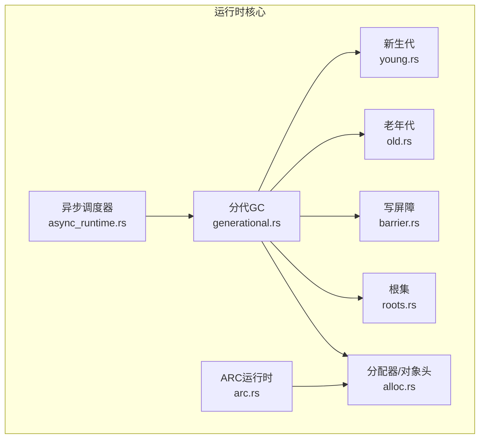
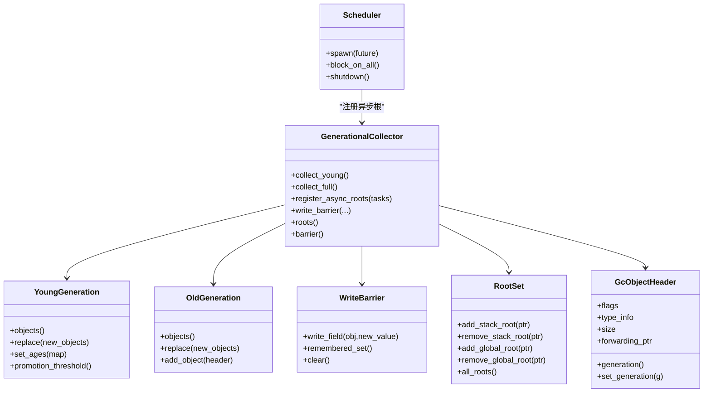
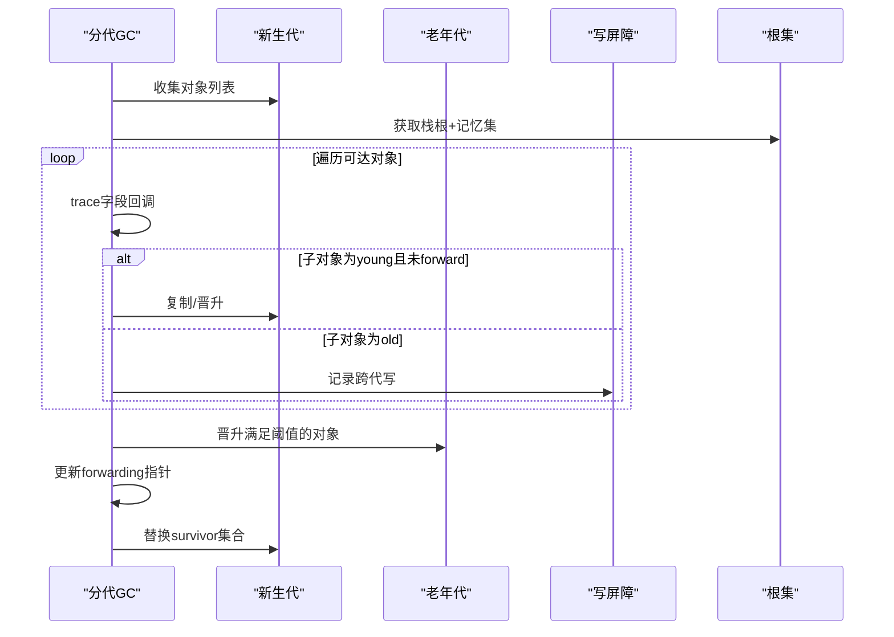
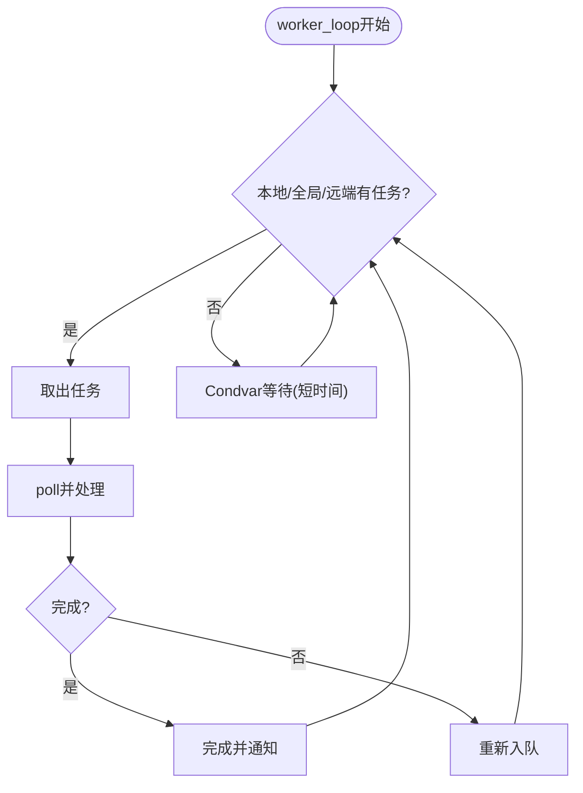
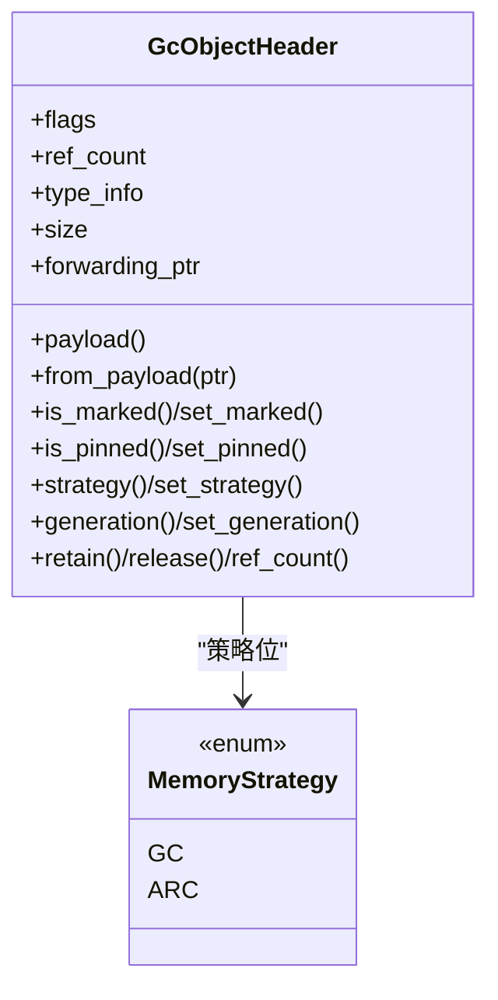
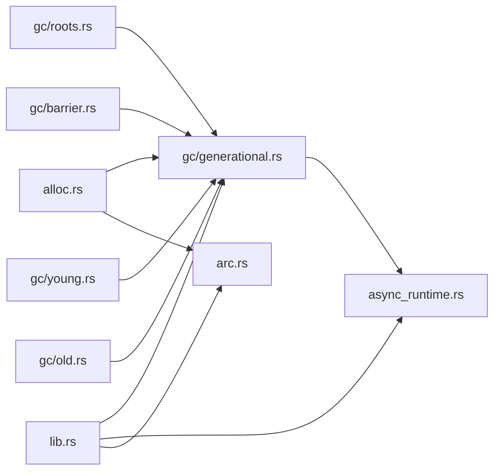

# 运行时性能优化

<cite>
**本文引用的文件**
- [generational.rs](file://crates/ruyi_runtime/src/gc/generational.rs)
- [young.rs](file://crates/ruyi_runtime/src/gc/young.rs)
- [old.rs](file://crates/ruyi_runtime/src/gc/old.rs)
- [barrier.rs](file://crates/ruyi_runtime/src/gc/barrier.rs)
- [roots.rs](file://crates/ruyi_runtime/src/gc/roots.rs)
- [alloc.rs](file://crates/ruyi_runtime/src/alloc.rs)
- [async_runtime.rs](file://crates/ruyi_runtime/src/async_runtime.rs)
- [arc.rs](file://crates/ruyi_runtime/src/arc.rs)
- [gc.rs](file://crates/ruyi_runtime/src/gc.rs)
- [lib.rs](file://crates/ruyi_runtime/src/lib.rs)
- [gc_thread_local.rs](file://crates/ruyi_runtime/tests/gc_thread_local.rs)
- [gc_async_roots.rs](file://crates/ruyi_runtime/tests/gc_async_roots.rs)
- [async_runtime.rs（测试）](file://crates/ruyi_runtime/tests/async_runtime.rs)
- [main.rs（基准）](file://crates/ruyic/benches/main.rs)
</cite>

## 目录
1. [简介](#简介)
2. [项目结构](#项目结构)
3. [核心组件](#核心组件)
4. [架构总览](#架构总览)
5. [详细组件分析](#详细组件分析)
6. [依赖关系分析](#依赖关系分析)
7. [性能考量与优化建议](#性能考量与优化建议)
8. [故障排查指南](#故障排查指南)
9. [结论](#结论)
10. [附录：监控指标与基准](#附录监控指标与基准)

## 简介
本指南面向Ruyi运行时系统的性能优化，聚焦以下方面：
- 分代垃圾回收器的调优：新生代/老年代大小配置、晋升阈值、回收触发与停顿优化
- 异步运行时的性能特性：工作窃取调度器的负载均衡、任务粒度与上下文切换控制
- 内存分配器优化：小对象池化、内存对齐与缓存友好布局
- 运行时监控与瓶颈定位
- 多线程与NUMA感知优化策略

目标是帮助读者在不牺牲正确性的前提下，系统性地提升吞吐与延迟表现。

## 项目结构
Ruyi运行时主要由以下模块构成：
- 垃圾回收子系统：分代收集器、写屏障、根集管理、新生代/老年代实现
- 内存分配与对象头：统一的GC/ARC对象头、分配/释放/扩容接口
- 异步运行时：工作窃取调度器、任务队列、唤醒机制、GC集成
- ARC支持：引用计数、弱引用、循环检测与边界处理
- 对外导出与测试：公共API导出、单元与集成测试、基准

图表来源
- [generational.rs:1-743](file://crates/ruyi_runtime/src/gc/generational.rs#L1-L743)
- [young.rs:1-84](file://crates/ruyi_runtime/src/gc/young.rs#L1-L84)
- [old.rs:1-64](file://crates/ruyi_runtime/src/gc/old.rs#L1-L64)
- [barrier.rs:1-141](file://crates/ruyi_runtime/src/gc/barrier.rs#L1-L141)
- [roots.rs:1-182](file://crates/ruyi_runtime/src/gc/roots.rs#L1-L182)
- [alloc.rs:1-405](file://crates/ruyi_runtime/src/alloc.rs#L1-L405)
- [async_runtime.rs:1-655](file://crates/ruyi_runtime/src/async_runtime.rs#L1-L655)
- [arc.rs:1-565](file://crates/ruyi_runtime/src/arc.rs#L1-L565)

章节来源
- [lib.rs:1-259](file://crates/ruyi_runtime/src/lib.rs#L1-L259)

## 核心组件
- 分代GC：复制式新生代+标记压缩老年代，写屏障+记忆集追踪跨代指针，支持异步根扫描
- 新生代：按年龄数组+晋升阈值，minor GC复制存活对象并按阈值晋升
- 老年代：标记压缩，降低碎片，减少full GC停顿影响范围
- 写屏障与记忆集：跟踪old→young写入，minor GC时作为额外根参与可达性分析
- 根集：栈根+全局根，配合写屏障确保可达性正确
- 分配器：统一对象头+类型信息，支持GC/ARC两种策略；当前基于系统分配器
- 异步调度器：每个worker本地双端队列+全局队列+远程steal，Waker唤醒
- ARC：强引用计数+弱引用+循环检测+跨GC/ARC边界操作

章节来源
- [generational.rs:1-743](file://crates/ruyi_runtime/src/gc/generational.rs#L1-L743)
- [young.rs:1-84](file://crates/ruyi_runtime/src/gc/young.rs#L1-L84)
- [old.rs:1-64](file://crates/ruyi_runtime/src/gc/old.rs#L1-L64)
- [barrier.rs:1-141](file://crates/ruyi_runtime/src/gc/barrier.rs#L1-L141)
- [roots.rs:1-182](file://crates/ruyi_runtime/src/gc/roots.rs#L1-L182)
- [alloc.rs:1-405](file://crates/ruyi_runtime/src/alloc.rs#L1-L405)
- [async_runtime.rs:1-655](file://crates/ruyi_runtime/src/async_runtime.rs#L1-L655)
- [arc.rs:1-565](file://crates/ruyi_runtime/src/arc.rs#L1-L565)

## 架构总览
Ruyi运行时采用“统一对象头+双策略”的内存模型，既支持GC也支持ARC。GC侧以分代为主，异步侧以工作窃取为主，二者通过根集与写屏障协同，避免异步任务被误回收。

图表来源
- [generational.rs:21-515](file://crates/ruyi_runtime/src/gc/generational.rs#L21-L515)
- [young.rs:11-77](file://crates/ruyi_runtime/src/gc/young.rs#L11-L77)
- [old.rs:10-57](file://crates/ruyi_runtime/src/gc/old.rs#L10-L57)
- [barrier.rs:13-80](file://crates/ruyi_runtime/src/gc/barrier.rs#L13-L80)
- [roots.rs:11-122](file://crates/ruyi_runtime/src/gc/roots.rs#L11-L122)
- [alloc.rs:74-181](file://crates/ruyi_runtime/src/alloc.rs#L74-L181)
- [async_runtime.rs:252-314](file://crates/ruyi_runtime/src/async_runtime.rs#L252-L314)

## 详细组件分析

### 分代垃圾回收器
- 新生代复制：minor GC遍历根+记忆集，复制存活对象到survivor或晋升至老年代；按年龄递增，超过阈值晋升
- 老年代标记压缩：full GC从根集递归标记，存活对象复制到新位置，更新所有引用
- 写屏障与记忆集：old→young写入记录到记忆集，minor GC将其作为额外根
- 异步根扫描：在full GC前扫描活跃任务，提取future中的GC指针作为根

图表来源
- [generational.rs:146-267](file://crates/ruyi_runtime/src/gc/generational.rs#L146-L267)
- [generational.rs:269-381](file://crates/ruyi_runtime/src/gc/generational.rs#L269-L381)
- [barrier.rs:24-48](file://crates/ruyi_runtime/src/gc/barrier.rs#L24-L48)
- [roots.rs:100-105](file://crates/ruyi_runtime/src/gc/roots.rs#L100-L105)

章节来源
- [generational.rs:146-515](file://crates/ruyi_runtime/src/gc/generational.rs#L146-L515)
- [young.rs:17-77](file://crates/ruyi_runtime/src/gc/young.rs#L17-L77)
- [old.rs:14-57](file://crates/ruyi_runtime/src/gc/old.rs#L14-L57)
- [barrier.rs:17-80](file://crates/ruyi_runtime/src/gc/barrier.rs#L17-L80)
- [roots.rs:16-122](file://crates/ruyi_runtime/src/gc/roots.rs#L16-L122)

### 异步运行时与工作窃取
- 工作窃取队列：每个worker维护本地双端队列，优先本地消费；空闲时从其他worker顶部steal
- 全局队列：waker唤醒的任务进入全局队列，避免锁竞争
- 休眠与唤醒：worker无任务时短暂等待，减少忙等
- GC集成：注册活跃任务为根，扫描future中的GC指针

图表来源
- [async_runtime.rs:317-357](file://crates/ruyi_runtime/src/async_runtime.rs#L317-L357)
- [async_runtime.rs:216-237](file://crates/ruyi_runtime/src/async_runtime.rs#L216-L237)

章节来源
- [async_runtime.rs:138-357](file://crates/ruyi_runtime/src/async_runtime.rs#L138-L357)

### 内存分配器与对象头
- 统一对象头：包含标志位、引用计数、类型信息、大小、forwarding指针
- 策略位：区分GC/ARC两种管理方式
- 分配/释放：基于系统分配器，后续可替换为专用arena
- 对齐：对象头按自身对齐要求进行布局，保证访问效率

图表来源
- [alloc.rs:74-181](file://crates/ruyi_runtime/src/alloc.rs#L74-L181)
- [alloc.rs:8-15](file://crates/ruyi_runtime/src/alloc.rs#L8-L15)

章节来源
- [alloc.rs:1-405](file://crates/ruyi_runtime/src/alloc.rs#L1-L405)

### ARC运行时
- 引用计数：原子retain/release，零计数时销毁并清理弱引用
- 弱引用：通过弱表映射槽位，失效后返回空指针
- 循环检测：基于试探删除算法，检测并解除循环引用
- 跨GC/ARC边界：提供统一的retain/release接口，自动分流

章节来源
- [arc.rs:1-565](file://crates/ruyi_runtime/src/arc.rs#L1-L565)

## 依赖关系分析
- 分代GC依赖对象头、分配器、写屏障、根集
- 异步调度器依赖GC进行根扫描，避免任务被回收
- ARC与分配器共享对象头布局，实现统一内存模型
- 公共API导出位于lib.rs，便于上层使用

图表来源
- [lib.rs:1-49](file://crates/ruyi_runtime/src/lib.rs#L1-L49)
- [generational.rs:1-29](file://crates/ruyi_runtime/src/gc/generational.rs#L1-L29)
- [async_runtime.rs:1-11](file://crates/ruyi_runtime/src/async_runtime.rs#L1-L11)

章节来源
- [lib.rs:1-49](file://crates/ruyi_runtime/src/lib.rs#L1-L49)

## 性能考量与优化建议

### 分代GC调优策略
- 新生代大小配置
  - 目标：尽量容纳短期存活对象，减少频繁minor GC
  - 方法：观察minor GC频率与存活率，逐步增大Eden/Survivor比例
  - 注意：过大的新生代会增加minor GC复制成本与停顿
- 晋升阈值
  - 目标：平衡新生代复制成本与老年代碎片
  - 方法：根据对象寿命分布调整阈值；过高导致老年代过早填充，过低增加复制次数
- 回收触发条件
  - 当前实现以复制/标记为基础；可结合对象增长速率与可用内存动态调节
- 停顿时间优化
  - 利用写屏障+记忆集，缩小minor GC扫描范围
  - 在full GC前先扫描异步根，减少遗漏导致的重试
  - 控制晋升对象数量，避免full GC过于频繁

章节来源
- [generational.rs:146-267](file://crates/ruyi_runtime/src/gc/generational.rs#L146-L267)
- [generational.rs:269-381](file://crates/ruyi_runtime/src/gc/generational.rs#L269-L381)
- [barrier.rs:17-80](file://crates/ruyi_runtime/src/gc/barrier.rs#L17-L80)
- [young.rs:17-32](file://crates/ruyi_runtime/src/gc/young.rs#L17-L32)

### 异步运行时性能优化
- 负载均衡
  - 本地队列优先，steal次之；合理设置worker数量匹配CPU核数
  - 全局队列用于waker唤醒，避免热点锁竞争
- 任务粒度
  - 将细粒度任务聚合，减少上下文切换与唤醒开销
  - 避免在poll中执行长时间阻塞操作，必要时拆分为多个小任务
- 上下文切换控制
  - 使用短时休眠与条件变量，避免忙等
  - 合理安排waker唤醒时机，减少无效唤醒

章节来源
- [async_runtime.rs:216-237](file://crates/ruyi_runtime/src/async_runtime.rs#L216-L237)
- [async_runtime.rs:317-357](file://crates/ruyi_runtime/src/async_runtime.rs#L317-L357)

### 内存分配器优化
- 小对象池化
  - 对常见尺寸的小对象建立缓存池，减少系统分配器压力
- 内存对齐
  - 对象头按自身对齐要求布局，提高缓存命中与SIMD友好性
- 缓存友好布局
  - 类型信息与常用字段靠近，减少跨缓存行访问
- 分配器替换
  - 后续可替换为专用arena，降低碎片与锁竞争

章节来源
- [alloc.rs:64-80](file://crates/ruyi_runtime/src/alloc.rs#L64-L80)
- [alloc.rs:233-249](file://crates/ruyi_runtime/src/alloc.rs#L233-L249)

### 并发与NUMA优化
- 并发
  - GC根集与写屏障使用Mutex保护，注意在高频路径中最小化锁持有时间
  - 异步调度器的全局队列与条件变量减少锁争用
- NUMA感知
  - 可考虑按NUMA节点绑定worker线程与本地队列，减少跨节点内存访问
  - 将分配器与GC区域尽量驻留于本地节点内存

章节来源
- [roots.rs:11-122](file://crates/ruyi_runtime/src/gc/roots.rs#L11-L122)
- [barrier.rs:13-80](file://crates/ruyi_runtime/src/gc/barrier.rs#L13-L80)
- [async_runtime.rs:140-179](file://crates/ruyi_runtime/src/async_runtime.rs#L140-L179)

## 故障排查指南
- GC根未注册导致对象提前回收
  - 检查是否在full GC前调用异步根扫描
  - 确认栈根/全局根添加/移除成对出现
- 写屏障未生效
  - 确保old→young写入路径调用了写屏障
  - full GC后检查记忆集是否清空/清理
- 异步任务被回收
  - 确认任务future中包含的GC指针被正确扫描为根
  - 避免在任务完成后立即释放其持有的对象
- 线程隔离与跨线程指针
  - 不同线程的指针不可直接跨线程使用，需通过同步机制传递
  - 主线程退出后仍可继续分配，GC不会破坏堆一致性

章节来源
- [gc_async_roots.rs:316-354](file://crates/ruyi_runtime/tests/gc_async_roots.rs#L316-L354)
- [gc_thread_local.rs:119-167](file://crates/ruyi_runtime/tests/gc_thread_local.rs#L119-L167)
- [async_runtime.rs:426-455](file://crates/ruyi_runtime/src/async_runtime.rs#L426-L455)

## 结论
Ruyi运行时在对象头与策略位上实现了GC/ARC统一模型，在异步调度与GC之间通过根集与写屏障达成协作。性能优化的关键在于：
- 分代GC的新生代大小与晋升阈值调优
- 异步调度器的任务粒度与唤醒策略
- 分配器的小对象池化与对齐优化
- 并发与NUMA感知的进一步工程化落地

## 附录：监控指标与基准
- 监控指标建议
  - GC：minor/full次数、对象计数、根计数、记忆集长度
  - 异步：活跃任务数、队列长度、唤醒次数、worker利用率
  - 内存：分配次数、分配字节数、碎片率
- 基准参考
  - 语言前端各阶段（词法/语法/类型检查/代码生成）耗时基准
  - 可通过基准工具对比不同配置下的吞吐与延迟

章节来源
- [main.rs（基准）:1-344](file://crates/ruyic/benches/main.rs#L1-L344)
- [async_runtime.rs（测试）:1-54](file://crates/ruyi_runtime/tests/async_runtime.rs#L1-L54)