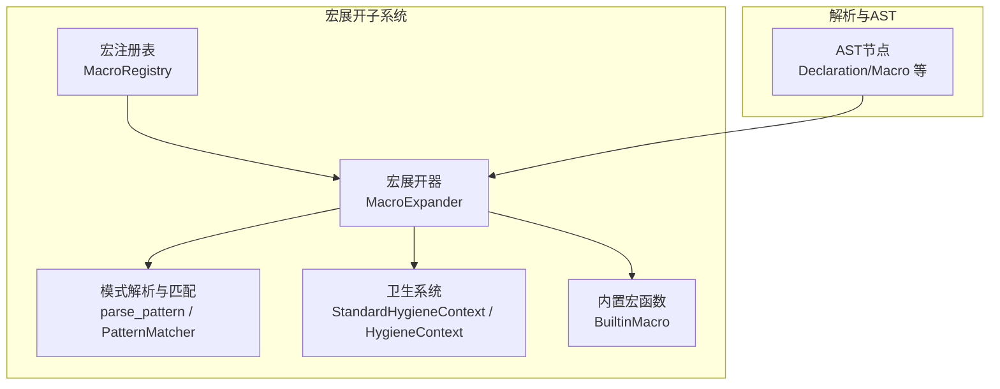
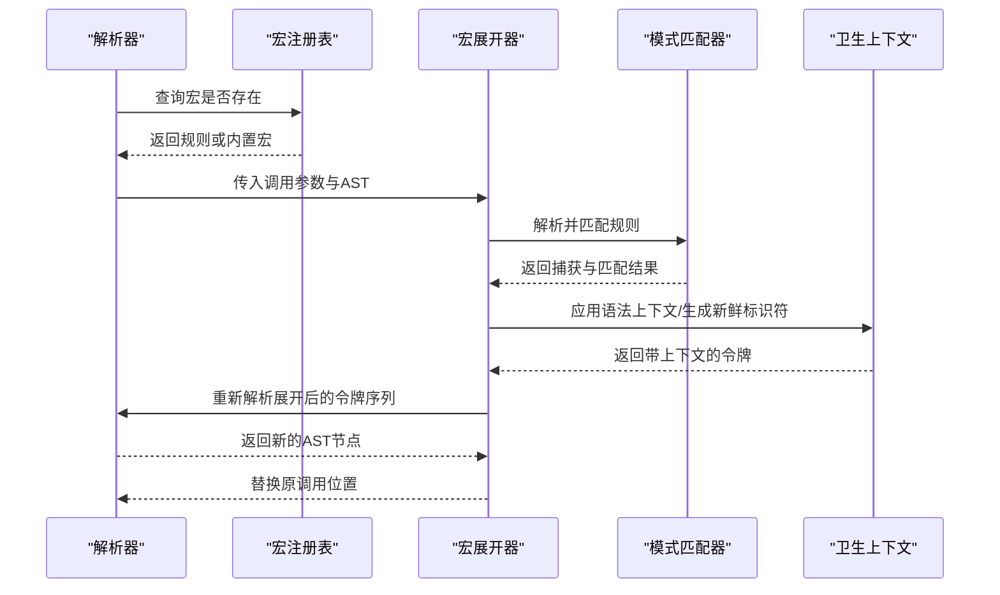
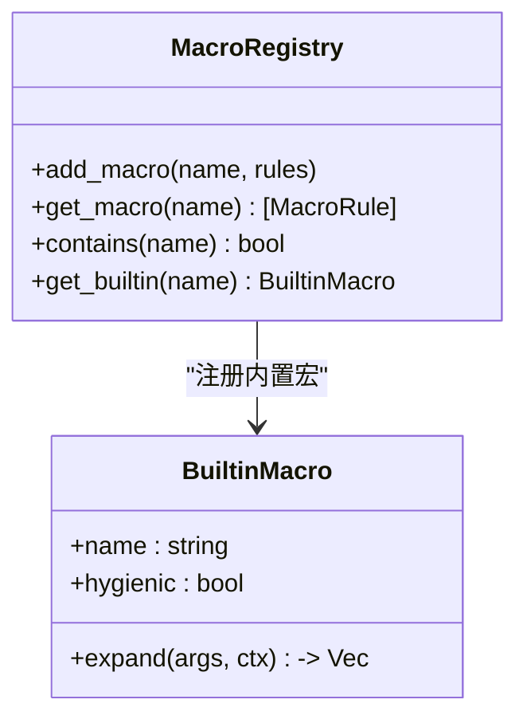
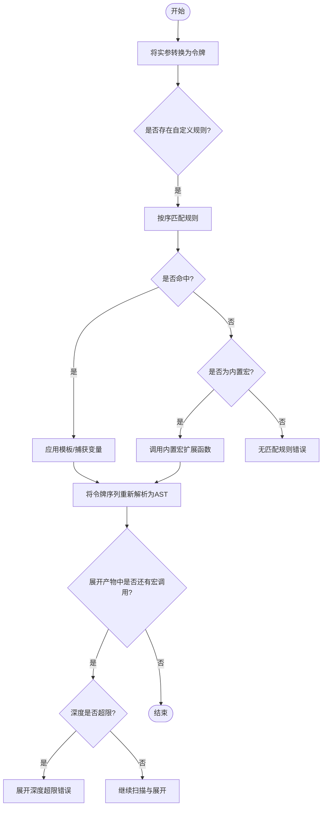
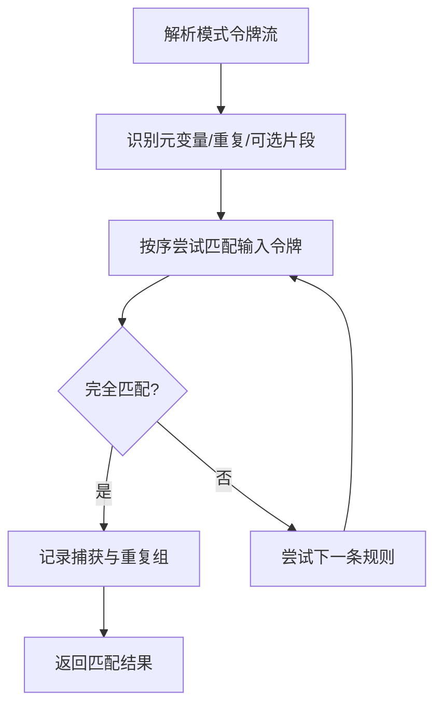
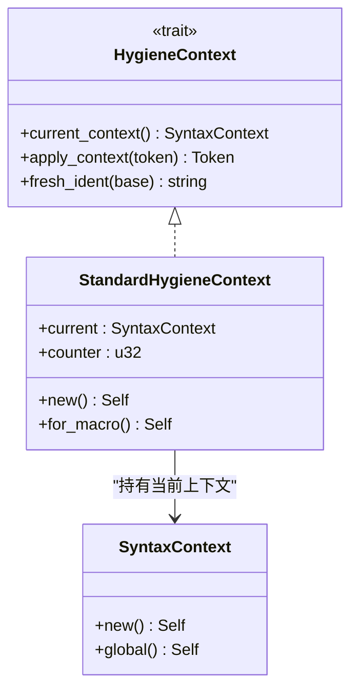
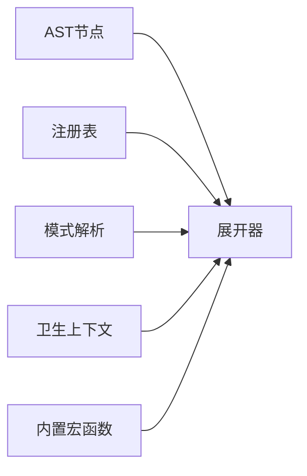
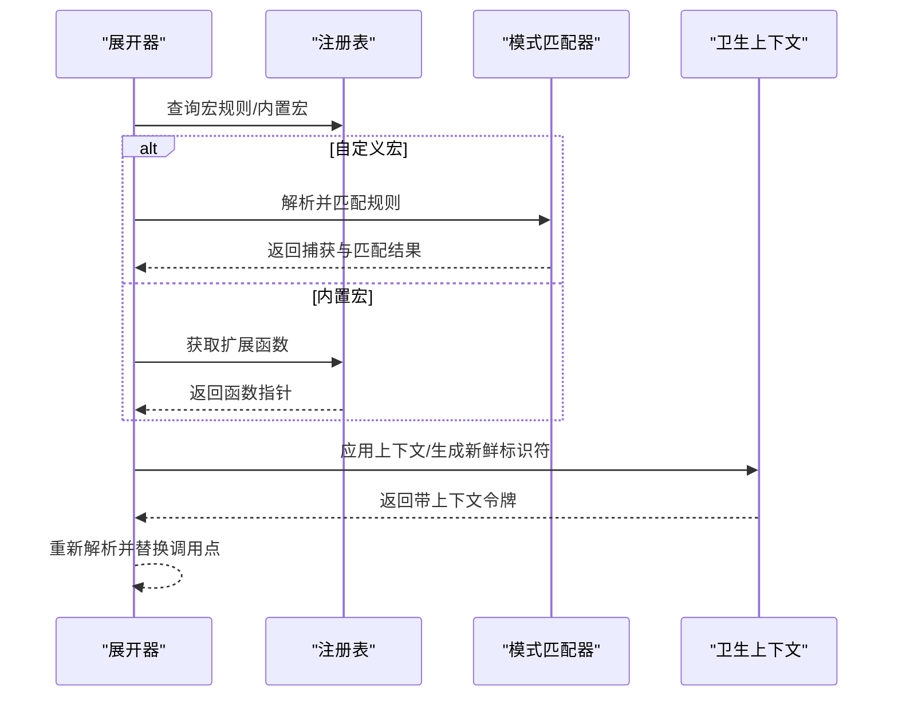

# 宏系统扩展

<cite>
**本文引用的文件**
- [mod.rs](file://crates/ruyic/src/macro_expand/mod.rs)
- [expand.rs](file://crates/ruyic/src/macro_expand/expand.rs)
- [hygiene.rs](file://crates/ruyic/src/macro_expand/hygiene.rs)
- [pattern.rs](file://crates/ruyic/src/macro_expand/pattern.rs)
- [builtins.rs](file://crates/ruyic/src/macro_expand/builtins.rs)
- [ast.rs](file://crates/ruyic/src/parser/ast.rs)
- [spec.md](file://docs/spec.md)
- [macro_expand.rs](file://crates/ruyic/tests/macro_expand.rs)
</cite>

## 目录
1. [简介](#简介)
2. [项目结构](#项目结构)
3. [核心组件](#核心组件)
4. [架构总览](#架构总览)
5. [详细组件分析](#详细组件分析)
6. [依赖关系分析](#依赖关系分析)
7. [性能考量](#性能考量)
8. [故障排查指南](#故障排查指南)
9. [结论](#结论)
10. [附录](#附录)

## 简介
本指南面向希望在 Ruyi 宏系统上进行扩展与二次开发的工程师，目标是帮助你：
- 开发自定义宏：涵盖声明式宏与过程宏的实现路径
- 扩展宏展开器：新增展开规则与模式匹配能力
- 扩展宏卫生系统：完善作用域管理与名称冲突解决
- 性能优化与缓存策略：降低展开成本与提升稳定性
- 调试与错误处理：定位常见问题并给出最佳实践
- 设计原则与最佳实践：确保扩展的可维护性与一致性

## 项目结构
Ruyi 的宏系统位于 ruyic 子包中，核心模块围绕“注册表-展开器-模式匹配-卫生上下文”组织，配合解析器 AST 提供完整的宏生命周期。

图表来源
- [mod.rs:1-161](file://crates/ruyic/src/macro_expand/mod.rs#L1-L161)
- [expand.rs:1-662](file://crates/ruyic/src/macro_expand/expand.rs#L1-L662)
- [pattern.rs:1-525](file://crates/ruyic/src/macro_expand/pattern.rs#L1-L525)
- [hygiene.rs:1-102](file://crates/ruyic/src/macro_expand/hygiene.rs#L1-L102)
- [builtins.rs:1-85](file://crates/ruyic/src/macro_expand/builtins.rs#L1-L85)
- [ast.rs:1-200](file://crates/ruyic/src/parser/ast.rs#L1-L200)

章节来源
- [mod.rs:1-161](file://crates/ruyic/src/macro_expand/mod.rs#L1-L161)
- [expand.rs:1-662](file://crates/ruyic/src/macro_expand/expand.rs#L1-L662)
- [pattern.rs:1-525](file://crates/ruyic/src/macro_expand/pattern.rs#L1-L525)
- [hygiene.rs:1-102](file://crates/ruyic/src/macro_expand/hygiene.rs#L1-L102)
- [builtins.rs:1-85](file://crates/ruyic/src/macro_expand/builtins.rs#L1-L85)
- [ast.rs:1-200](file://crates/ruyic/src/parser/ast.rs#L1-L200)

## 核心组件
- 宏注册表与内置宏
  - 注册表负责存储用户自定义宏规则与内置宏函数，提供查询与注册能力
  - 内置宏函数以统一签名注入，支持卫生或非卫生两种模式
- 宏展开器
  - 遍历 AST，识别宏调用并执行展开流程：解析输入、匹配规则、模板替换、重新解析
  - 支持最大展开深度限制，防止无限递归
- 模式匹配
  - 解析宏规则中的模式，支持元变量、重复模式、可选片段等
  - 匹配器按顺序尝试规则，命中即停止
- 卫生系统
  - 为宏引入的标识符附加语法上下文，避免与调用方作用域冲突
  - 提供新鲜标识符生成与上下文兼容判断

章节来源
- [mod.rs:107-161](file://crates/ruyic/src/macro_expand/mod.rs#L107-L161)
- [expand.rs:8-393](file://crates/ruyic/src/macro_expand/expand.rs#L8-L393)
- [pattern.rs:5-384](file://crates/ruyic/src/macro_expand/pattern.rs#L5-L384)
- [hygiene.rs:40-102](file://crates/ruyic/src/macro_expand/hygiene.rs#L40-L102)
- [builtins.rs:5-85](file://crates/ruyic/src/macro_expand/builtins.rs#L5-L85)

## 架构总览
下图展示了从宏调用到最终代码生成的关键步骤与组件交互。

图表来源
- [expand.rs:304-393](file://crates/ruyic/src/macro_expand/expand.rs#L304-L393)
- [pattern.rs:386-475](file://crates/ruyic/src/macro_expand/pattern.rs#L386-L475)
- [hygiene.rs:71-84](file://crates/ruyic/src/macro_expand/hygiene.rs#L71-L84)
- [builtins.rs:5-59](file://crates/ruyic/src/macro_expand/builtins.rs#L5-L59)

## 详细组件分析

### 宏注册表与内置宏
- 注册表
  - 提供添加自定义宏、查询规则、判断是否包含某宏名的能力
  - 内置宏以函数指针形式注册，统一签名接收参数令牌与卫生上下文
- 内置宏函数
  - 提供 todo/unreachable/stringify/file/line/column 等常用功能
  - 可配置是否启用卫生（如 stringify 通常不参与卫生）

图表来源
- [mod.rs:107-161](file://crates/ruyic/src/macro_expand/mod.rs#L107-L161)
- [builtins.rs:5-85](file://crates/ruyic/src/macro_expand/builtins.rs#L5-L85)

章节来源
- [mod.rs:107-161](file://crates/ruyic/src/macro_expand/mod.rs#L107-L161)
- [builtins.rs:5-85](file://crates/ruyic/src/macro_expand/builtins.rs#L5-L85)

### 宏展开器
- 展开入口
  - 顶层程序遍历模块项，分别处理声明、语句、导入导出等
- 宏调用识别与展开
  - 在表达式调用处识别宏名，区分自定义规则与内置宏
  - 自定义宏：将实参转为令牌序列，按序匹配规则，命中后应用模板并重新解析
  - 内置宏：直接调用对应扩展函数，返回令牌序列
- 递归展开与深度控制
  - 使用深度计数防止无限递归；超过阈值报错
- 嵌套宏定义保护
  - 若展开产物包含新宏定义，立即报错，避免未定义行为

图表来源
- [expand.rs:23-393](file://crates/ruyic/src/macro_expand/expand.rs#L23-L393)
- [mod.rs:10-11](file://crates/ruyic/src/macro_expand/mod.rs#L10-L11)

章节来源
- [expand.rs:23-393](file://crates/ruyic/src/macro_expand/expand.rs#L23-L393)
- [mod.rs:10-11](file://crates/ruyic/src/macro_expand/mod.rs#L10-L11)

### 模式匹配与规则解析
- 模式元素
  - 字面量、元变量（可指定类型）、重复片段（*, +, ?）、可选片段
  - 支持逗号或分号作为分隔符
- 匹配算法
  - 顺序尝试规则，首个完全匹配即成功
  - 元变量按类型捕获相应语法片段；重复片段按分隔符迭代捕获
- 解析器
  - 将规则中的令牌流解析为结构化模式，便于后续匹配

图表来源
- [pattern.rs:386-475](file://crates/ruyic/src/macro_expand/pattern.rs#L386-L475)
- [pattern.rs:101-384](file://crates/ruyic/src/macro_expand/pattern.rs#L101-L384)

章节来源
- [pattern.rs:5-384](file://crates/ruyic/src/macro_expand/pattern.rs#L5-L384)
- [pattern.rs:386-475](file://crates/ruyic/src/macro_expand/pattern.rs#L386-L475)

### 卫生系统
- 语法上下文
  - 每次宏展开分配唯一上下文 ID，标识符被标记后仅在相同或全局上下文中可见
- 新鲜标识符
  - 为宏内部生成不冲突的临时名称，避免与外部作用域重名
- 上下文兼容
  - 全局上下文与任意上下文兼容；同上下文严格隔离

图表来源
- [hygiene.rs:40-102](file://crates/ruyic/src/macro_expand/hygiene.rs#L40-L102)

章节来源
- [hygiene.rs:1-102](file://crates/ruyic/src/macro_expand/hygiene.rs#L1-L102)

### 声明式宏与过程宏
- 声明式宏
  - 通过 AST 中的 Declaration::Macro 形式定义，规则由模式与模板组成
  - 展开时按序匹配规则，命中后进行模板替换与重新解析
- 过程宏
  - 通过内置宏函数或自定义扩展函数实现，接收令牌序列并返回令牌序列
  - 可选择是否参与卫生（如 stringify 不参与）

章节来源
- [ast.rs:28-69](file://crates/ruyic/src/parser/ast.rs#L28-L69)
- [expand.rs:304-393](file://crates/ruyic/src/macro_expand/expand.rs#L304-L393)
- [builtins.rs:5-85](file://crates/ruyic/src/macro_expand/builtins.rs#L5-L85)

## 依赖关系分析
- 组件耦合
  - 展开器依赖注册表、模式解析器与卫生上下文
  - 规则解析器独立于展开器，但被展开器调用
  - 内置宏函数通过统一签名接入，解耦于规则系统
- 外部依赖
  - 与解析器 AST 紧密协作，确保宏调用点的正确识别与替换

图表来源
- [expand.rs:1-662](file://crates/ruyic/src/macro_expand/expand.rs#L1-L662)
- [mod.rs:1-161](file://crates/ruyic/src/macro_expand/mod.rs#L1-L161)
- [pattern.rs:1-525](file://crates/ruyic/src/macro_expand/pattern.rs#L1-L525)
- [hygiene.rs:1-102](file://crates/ruyic/src/macro_expand/hygiene.rs#L1-L102)
- [builtins.rs:1-85](file://crates/ruyic/src/macro_expand/builtins.rs#L1-L85)

章节来源
- [expand.rs:1-662](file://crates/ruyic/src/macro_expand/expand.rs#L1-L662)
- [mod.rs:1-161](file://crates/ruyic/src/macro_expand/mod.rs#L1-L161)
- [pattern.rs:1-525](file://crates/ruyic/src/macro_expand/pattern.rs#L1-L525)
- [hygiene.rs:1-102](file://crates/ruyic/src/macro_expand/hygiene.rs#L1-L102)
- [builtins.rs:1-85](file://crates/ruyic/src/macro_expand/builtins.rs#L1-L85)

## 性能考量
- 展开深度限制
  - 默认最大展开深度用于防止无限递归，建议在复杂宏场景下调优阈值与错误提示
- 模式匹配优化
  - 优先将最可能命中的规则置于前面，减少回溯
  - 控制重复片段的分隔符与模式范围，避免过度捕获导致的回溯爆炸
- 令牌序列处理
  - 将实参转换为令牌时尽量保持紧凑，减少中间字符串拼接
  - 模板替换阶段避免不必要的拷贝，优先就地替换
- 卫生上下文
  - 新鲜标识符生成应避免频繁分配，可在上下文中复用计数器
- 缓存策略（建议）
  - 对热点规则的匹配结果进行短期缓存（基于输入令牌哈希）
  - 对重复出现的宏调用进行去重与结果复用
  - 注意缓存失效与内存占用平衡，避免长期驻留大对象

章节来源
- [mod.rs:10-11](file://crates/ruyic/src/macro_expand/mod.rs#L10-L11)
- [expand.rs:395-475](file://crates/ruyic/src/macro_expand/expand.rs#L395-L475)
- [pattern.rs:303-358](file://crates/ruyic/src/macro_expand/pattern.rs#L303-L358)
- [hygiene.rs:80-84](file://crates/ruyic/src/macro_expand/hygiene.rs#L80-L84)

## 故障排查指南
- 常见错误类型
  - 无匹配规则：检查宏名与规则是否一致，确认规则顺序与模式覆盖范围
  - 重复不匹配：核对重复片段的分隔符与数量是否符合预期
  - 展开深度超限：检查是否存在循环依赖或递归规则未终止
  - 卫生违规：确认宏内引入的标识符是否被正确打上上下文标签
  - 嵌套宏定义：展开产物不应包含新的宏定义
- 调试建议
  - 在规则匹配前打印输入令牌序列，核对分词与分隔符
  - 分步验证模板替换与重新解析后的 AST 结构
  - 使用最小化示例快速定位问题，逐步增加复杂度
- 单元测试参考
  - 可参考现有测试用例验证卫生上下文、重复模式与深度限制的行为

章节来源
- [mod.rs:12-94](file://crates/ruyic/src/macro_expand/mod.rs#L12-L94)
- [macro_expand.rs:189-251](file://crates/ruyic/tests/macro_expand.rs#L189-L251)

## 结论
Ruyi 的宏系统以“注册表-展开器-模式匹配-卫生上下文”为核心，既支持声明式宏的规则匹配，也支持过程宏的灵活扩展。通过合理的规则设计、严格的卫生约束与性能优化策略，可以构建稳定、可维护且高效的宏生态。建议在扩展时遵循“先规则后模板、先简单后复杂、先卫生后性能”的原则，逐步完善宏体系。

## 附录

### 开发自定义宏的步骤
- 声明式宏
  - 在 AST 中定义 Declaration::Macro，提供多条规则（模式+模板）
  - 在展开器中注册宏名与规则列表，确保规则顺序合理
- 过程宏
  - 实现 BuiltinMacro 或扩展注册表中的函数指针
  - 明确是否参与卫生，必要时使用卫生上下文生成新鲜标识符
- 模式与模板
  - 使用元变量捕获表达式/语句/标识符等片段
  - 利用重复模式批量生成代码，注意分隔符与边界条件
- 卫生与作用域
  - 宏内引入的标识符必须打上当前上下文
  - 对传入的标识符保留其原有上下文，避免意外捕获

章节来源
- [ast.rs:28-69](file://crates/ruyic/src/parser/ast.rs#L28-L69)
- [expand.rs:51-59](file://crates/ruyic/src/macro_expand/expand.rs#L51-L59)
- [builtins.rs:5-85](file://crates/ruyic/src/macro_expand/builtins.rs#L5-L85)
- [pattern.rs:134-191](file://crates/ruyic/src/macro_expand/pattern.rs#L134-L191)
- [hygiene.rs:71-84](file://crates/ruyic/src/macro_expand/hygiene.rs#L71-L84)

### 宏展开流程（代码级时序）

图表来源
- [expand.rs:304-393](file://crates/ruyic/src/macro_expand/expand.rs#L304-L393)
- [pattern.rs:386-475](file://crates/ruyic/src/macro_expand/pattern.rs#L386-L475)
- [hygiene.rs:71-84](file://crates/ruyic/src/macro_expand/hygiene.rs#L71-L84)

### 最佳实践与设计原则
- 规则设计
  - 优先使用明确的元变量类型限定，减少歧义
  - 重复模式尽量显式分隔符，避免误判
- 卫生策略
  - 宏内所有新标识符必须打上上下文；对外部传入标识符保留原上下文
- 错误处理
  - 对无匹配规则、重复不匹配、深度超限等错误提供清晰的定位信息
- 性能优化
  - 控制规则数量与顺序，减少回溯
  - 对热点宏采用缓存与去重策略
- 文档与测试
  - 为复杂宏提供使用示例与行为说明
  - 编写单元测试覆盖边界情况与错误分支

章节来源
- [spec.md:3858-3977](file://docs/spec.md#L3858-L3977)
- [pattern.rs:303-358](file://crates/ruyic/src/macro_expand/pattern.rs#L303-L358)
- [hygiene.rs:99-102](file://crates/ruyic/src/macro_expand/hygiene.rs#L99-L102)