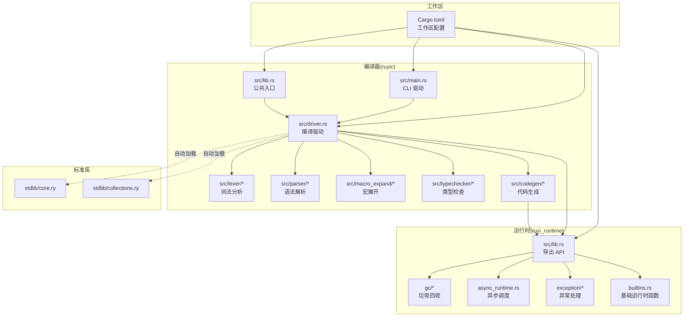
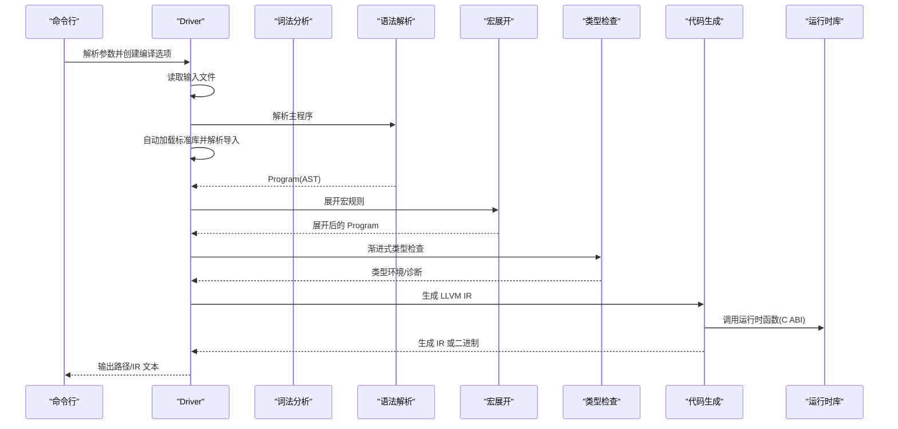
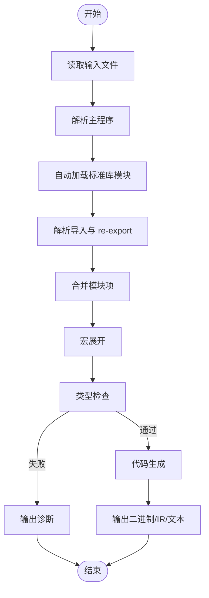
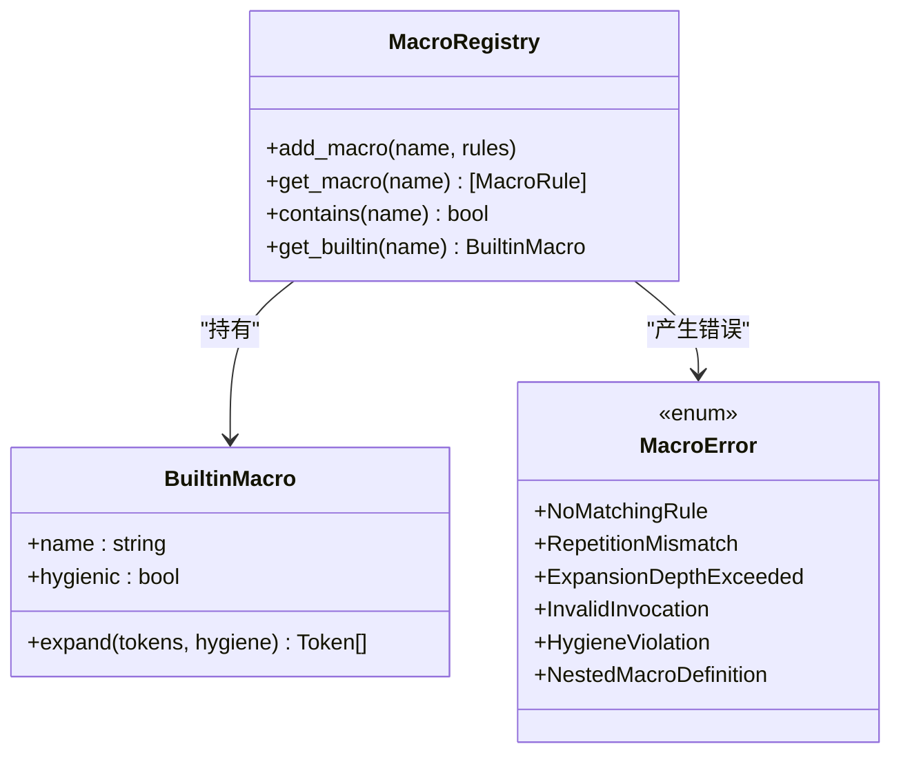
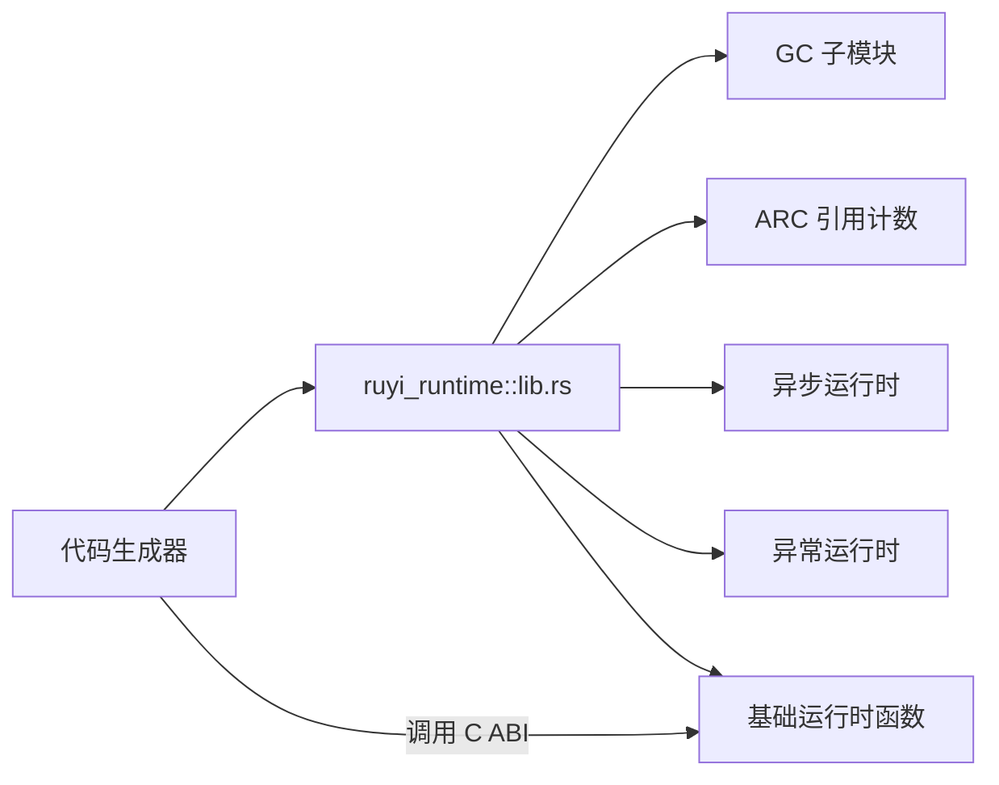
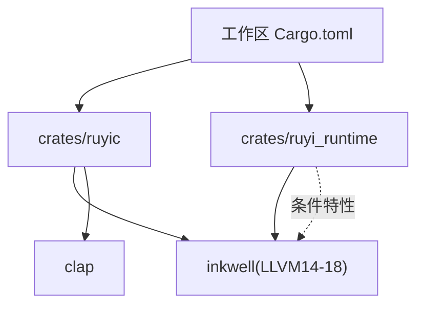

# 扩展开发

<cite>
**本文引用的文件**
- [crates/ruyic/src/lib.rs](file://crates/ruyic/src/lib.rs)
- [crates/ruyic/src/main.rs](file://crates/ruyic/src/main.rs)
- [crates/ruyic/src/driver.rs](file://crates/ruyic/src/driver.rs)
- [crates/ruyic/src/macro_expand/mod.rs](file://crates/ruyic/src/macro_expand/mod.rs)
- [crates/ruyic/src/typechecker/mod.rs](file://crates/ruyic/src/typechecker/mod.rs)
- [crates/ruyic/src/codegen/mod.rs](file://crates/ruyic/src/codegen/mod.rs)
- [crates/ruyic/src/parser/mod.rs](file://crates/ruyic/src/parser/mod.rs)
- [crates/ruyic/src/lexer/mod.rs](file://crates/ruyic/src/lexer/mod.rs)
- [crates/ruyi_runtime/src/lib.rs](file://crates/ruyi_runtime/src/lib.rs)
- [Cargo.toml](file://Cargo.toml)
- [stdlib/core.ry](file://stdlib/core.ry)
- [stdlib/collections.ry](file://stdlib/collections.ry)
- [examples/hello.ry](file://examples/hello.ry)
- [README.md](file://README.md)
</cite>

## 目录
1. [简介](#简介)
2. [项目结构](#项目结构)
3. [核心组件](#核心组件)
4. [架构总览](#架构总览)
5. [详细组件分析](#详细组件分析)
6. [依赖关系分析](#依赖关系分析)
7. [性能考量](#性能考量)
8. [故障排查指南](#故障排查指南)
9. [结论](#结论)
10. [附录](#附录)

## 简介
本指南面向希望在 Ruyi 编译器与运行时生态上进行扩展的开发者，覆盖以下主题：
- 扩展编译器前端：新增语言特性与语法元素
- 扩展运行时库：新增 API 与修改既有功能
- 扩展宏系统：自定义宏与内置宏注册
- 扩展标准库与第三方库集成
- 扩展编译器后端：新增优化 Pass 与目标平台支持
- 插件化与扩展点设计
- 外部工具集成与 API 设计原则
- 最佳实践、设计模式与测试验证方法

## 项目结构
Ruyi 采用多 crate 工作区组织，核心由“编译器”和“运行时库”两大模块构成，配合标准库源码与示例程序，形成从源码到原生二进制的完整链路。

图表来源
- [Cargo.toml:1-40](file://Cargo.toml#L1-L40)
- [crates/ruyic/src/main.rs:1-114](file://crates/ruyic/src/main.rs#L1-L114)
- [crates/ruyic/src/lib.rs:1-21](file://crates/ruyic/src/lib.rs#L1-L21)
- [crates/ruyic/src/driver.rs:1-744](file://crates/ruyic/src/driver.rs#L1-L744)
- [crates/ruyi_runtime/src/lib.rs:1-259](file://crates/ruyi_runtime/src/lib.rs#L1-L259)
- [stdlib/core.ry:1-31](file://stdlib/core.ry#L1-L31)
- [stdlib/collections.ry:1-480](file://stdlib/collections.ry#L1-L480)

章节来源
- [README.md:75-99](file://README.md#L75-L99)
- [Cargo.toml:1-40](file://Cargo.toml#L1-L40)

## 核心组件
- 编译器驱动：负责从源码到二进制的全链路编排，含模块解析、宏展开、类型检查、代码生成与链接输出。
- 词法/语法：将源码切分为标记并构建抽象语法树。
- 宏系统：声明式、卫生的编译期代码生成。
- 类型检查：渐进式类型系统，双向推断、约束求解与泛型特化跟踪。
- 代码生成：基于 Inkwell 的 LLVM IR 生成，支持部分代码生成以兼容标准库。
- 运行时库：GC、异步调度、异常处理与基础运行时函数，向编译器暴露 C ABI 接口。

章节来源
- [crates/ruyic/src/driver.rs:242-737](file://crates/ruyic/src/driver.rs#L242-L737)
- [crates/ruyic/src/lexer/mod.rs:1-8](file://crates/ruyic/src/lexer/mod.rs#L1-L8)
- [crates/ruyic/src/parser/mod.rs:1-8](file://crates/ruyic/src/parser/mod.rs#L1-L8)
- [crates/ruyic/src/macro_expand/mod.rs:107-161](file://crates/ruyic/src/macro_expand/mod.rs#L107-L161)
- [crates/ruyic/src/typechecker/mod.rs:1-32](file://crates/ruyic/src/typechecker/mod.rs#L1-L32)
- [crates/ruyic/src/codegen/mod.rs:1-15](file://crates/ruyic/src/codegen/mod.rs#L1-L15)
- [crates/ruyi_runtime/src/lib.rs:11-49](file://crates/ruyi_runtime/src/lib.rs#L11-L49)

## 架构总览
下图展示从命令行到最终产物的编译流程，以及与运行时库的交互。

图表来源
- [crates/ruyic/src/main.rs:46-113](file://crates/ruyic/src/main.rs#L46-L113)
- [crates/ruyic/src/driver.rs:258-632](file://crates/ruyic/src/driver.rs#L258-L632)
- [crates/ruyi_runtime/src/lib.rs:11-49](file://crates/ruyi_runtime/src/lib.rs#L11-L49)

## 详细组件分析

### 编译器驱动与模块系统
- 模块解析：支持相对路径、绝对路径、RUYI_HOME/stdlib 与搜索路径；自动加载核心标准库模块；递归解析 re-export。
- 编译管线：AST → 宏展开 → 类型检查 → 代码生成 → 输出（二进制/IR/AST/TypedAST）。
- 运行时构建：在需要时触发 ruyi_runtime 构建，确保链接阶段可用。

图表来源
- [crates/ruyic/src/driver.rs:303-512](file://crates/ruyic/src/driver.rs#L303-L512)
- [crates/ruyic/src/driver.rs:522-632](file://crates/ruyic/src/driver.rs#L522-L632)

章节来源
- [crates/ruyic/src/driver.rs:149-240](file://crates/ruyic/src/driver.rs#L149-L240)
- [crates/ruyic/src/driver.rs:303-512](file://crates/ruyic/src/driver.rs#L303-L512)
- [crates/ruyic/src/driver.rs:522-632](file://crates/ruyic/src/driver.rs#L522-L632)

### 词法与语法
- 词法：将源码扫描为带位置信息的标记序列。
- 语法：解析为模块项(Program)与表达式/语句节点，支持导入、导出、类、函数、traits 等。

章节来源
- [crates/ruyic/src/lexer/mod.rs:1-8](file://crates/ruyic/src/lexer/mod.rs#L1-L8)
- [crates/ruyic/src/parser/mod.rs:1-8](file://crates/ruyic/src/parser/mod.rs#L1-L8)

### 宏系统
- 注册表：维护用户自定义宏规则与内置宏。
- 展开器：按深度限制与卫生规则展开宏调用。
- 内置宏：通过注册表统一管理，支持卫生作用域与错误报告。

图表来源
- [crates/ruyic/src/macro_expand/mod.rs:107-161](file://crates/ruyic/src/macro_expand/mod.rs#L107-L161)

章节来源
- [crates/ruyic/src/macro_expand/mod.rs:12-161](file://crates/ruyic/src/macro_expand/mod.rs#L12-L161)

### 类型检查（渐进式）
- 双向推断：合成/校验交替推进，提升可读性与准确性。
- 约束求解：泛型特化与类型参数推断。
- 诊断收集：集中输出类型错误与警告。

章节来源
- [crates/ruyic/src/typechecker/mod.rs:1-32](file://crates/ruyic/src/typechecker/mod.rs#L1-L32)

### 代码生成（LLVM IR）
- 生成器：将类型化的 AST 映射为 LLVM IR，支持部分代码生成以兼容标准库。
- 优化等级：支持 O0/O1/O2。
- 输出格式：二进制或 LLVM IR 文本。

章节来源
- [crates/ruyic/src/codegen/mod.rs:1-15](file://crates/ruyic/src/codegen/mod.rs#L1-L15)
- [crates/ruyic/src/driver.rs:568-631](file://crates/ruyic/src/driver.rs#L568-L631)

### 运行时库
- 导出接口：GC、ARC、异步、异常、基础运行时函数等。
- 类型映射：Ruyi 原生类型到 LLVM 类型的映射。
- C ABI：供代码生成器调用的底层函数。

图表来源
- [crates/ruyi_runtime/src/lib.rs:11-49](file://crates/ruyi_runtime/src/lib.rs#L11-L49)
- [crates/ruyi_runtime/src/lib.rs:55-219](file://crates/ruyi_runtime/src/lib.rs#L55-L219)

章节来源
- [crates/ruyi_runtime/src/lib.rs:1-259](file://crates/ruyi_runtime/src/lib.rs#L1-L259)

### 标准库与第三方库集成
- 核心模块：自动加载 core.ry，提供基础类型的 toString 等方法。
- 集合模块：自动加载 collections.ry，提供 ArrayOps、Map、Set、Iterator 等。
- 第三方库：通过模块解析与搜索路径机制接入，遵循导入/导出语义。

章节来源
- [stdlib/core.ry:1-31](file://stdlib/core.ry#L1-L31)
- [stdlib/collections.ry:1-480](file://stdlib/collections.ry#L1-L480)
- [crates/ruyic/src/driver.rs:331-354](file://crates/ruyic/src/driver.rs#L331-L354)
- [crates/ruyic/src/driver.rs:174-234](file://crates/ruyic/src/driver.rs#L174-L234)

### 插件化与扩展点设计
- 宏注册：通过 MacroRegistry 注入自定义规则与内置宏，实现声明式扩展。
- 类型系统：TypeChecker 作为扩展点，可在不破坏渐进式类型的前提下引入新约束或推理规则。
- 代码生成：CodeGenerator 提供 IR 生成扩展点，结合运行时导出的 C ABI 函数实现新 API。
- 模块系统：Driver 支持搜索路径与 RUYI_HOME/stdlib，便于第三方库与标准库并存。

章节来源
- [crates/ruyic/src/macro_expand/mod.rs:120-146](file://crates/ruyic/src/macro_expand/mod.rs#L120-L146)
- [crates/ruyic/src/typechecker/mod.rs:24-31](file://crates/ruyic/src/typechecker/mod.rs#L24-L31)
- [crates/ruyic/src/codegen/mod.rs:13-15](file://crates/ruyic/src/codegen/mod.rs#L13-L15)
- [crates/ruyic/src/driver.rs:159-240](file://crates/ruyic/src/driver.rs#L159-L240)

### 外部工具集成与 API 设计原则
- CLI 参数：ruyic 提供丰富的编译选项（输出格式、优化级别、目标三元组等），便于与 CI/CD 工具集成。
- 错误处理：统一的 CompileError/诊断体系，便于外部工具解析与呈现。
- API 设计：运行时导出稳定的 C ABI 接口，保证与编译器生成的 IR 正确对接。

章节来源
- [crates/ruyic/src/main.rs:16-44](file://crates/ruyic/src/main.rs#L16-L44)
- [crates/ruyic/src/driver.rs:21-54](file://crates/ruyic/src/driver.rs#L21-L54)
- [crates/ruyi_runtime/src/lib.rs:11-49](file://crates/ruyi_runtime/src/lib.rs#L11-L49)

## 依赖关系分析
- 工作区依赖：inkwell、clap、thiserror、anyhow、log、env_logger、criterion 等。
- 编译器依赖：LLVM 绑定 inkwell（支持 LLVM 14-18），用于 IR 生成与优化。
- 运行时依赖：默认启用 inkwell 特性以支持类型映射与上下文封装。

图表来源
- [Cargo.toml:14-27](file://Cargo.toml#L14-L27)
- [Cargo.toml:16](file://Cargo.toml#L16)

章节来源
- [Cargo.toml:14-40](file://Cargo.toml#L14-L40)

## 性能考量
- 优化等级：根据场景选择 O0/O1/O2；发布构建建议开启 LTO。
- 代码生成策略：允许部分代码生成以兼容标准库，避免因未支持的模式导致整体失败。
- 运行时构建：在首次需要时触发构建，减少不必要的构建开销。

章节来源
- [Cargo.toml:33-40](file://Cargo.toml#L33-L40)
- [crates/ruyic/src/driver.rs:579-585](file://crates/ruyic/src/driver.rs#L579-L585)
- [crates/ruyic/src/driver.rs:282-300](file://crates/ruyic/src/driver.rs#L282-L300)

## 故障排查指南
- 常见错误类型：IO、词法、解析、宏、类型检查、代码生成、链接、模块未找到。
- 诊断输出：类型检查阶段集中输出诊断；宏错误包含匹配规则、重复次数、展开深度、卫生违规等。
- 模块解析：确认 RUYI_HOME/stdlib、搜索路径与相对路径是否正确；检查 re-export 是否被正确解析。

章节来源
- [crates/ruyic/src/driver.rs:21-54](file://crates/ruyic/src/driver.rs#L21-L54)
- [crates/ruyic/src/macro_expand/mod.rs:12-94](file://crates/ruyic/src/macro_expand/mod.rs#L12-L94)
- [crates/ruyic/src/driver.rs:174-234](file://crates/ruyic/src/driver.rs#L174-L234)

## 结论
Ruyi 在前端（词法/语法/宏）、中端（类型检查）、后端（LLVM IR）与运行时之间形成了清晰的分层与扩展点。通过模块系统、宏注册表、类型检查器与代码生成器，开发者可以安全地引入新语言特性、运行时 API、标准库与第三方库，并通过 CLI 与诊断体系实现与外部工具的无缝集成。

## 附录

### 扩展编译器前端：新增语言特性与语法元素
- 词法扩展：在词法扫描器中新增标记类别与关键字识别。
- 语法扩展：在解析器中新增 AST 节点与语法规则，确保与现有模块系统兼容。
- 类型系统扩展：在类型检查器中增加新的约束或推理规则，保持双向推断一致性。
- 宏扩展：通过 MacroRegistry 注册新规则，必要时提供内置宏实现。

章节来源
- [crates/ruyic/src/lexer/mod.rs:1-8](file://crates/ruyic/src/lexer/mod.rs#L1-L8)
- [crates/ruyic/src/parser/mod.rs:1-8](file://crates/ruyic/src/parser/mod.rs#L1-L8)
- [crates/ruyic/src/typechecker/mod.rs:24-31](file://crates/ruyic/src/typechecker/mod.rs#L24-L31)
- [crates/ruyic/src/macro_expand/mod.rs:120-146](file://crates/ruyic/src/macro_expand/mod.rs#L120-L146)

### 扩展运行时库：新增 API 与修改既有功能
- 新增运行时函数：在 ruyi_runtime 中添加 C ABI 函数，并在 lib.rs 中导出。
- 类型映射：如需 LLVM 类型映射，完善 RuyiType 到 LLVM 的映射逻辑。
- 与代码生成器协作：确保生成的 IR 能正确调用新增函数。

章节来源
- [crates/ruyi_runtime/src/lib.rs:11-49](file://crates/ruyi_runtime/src/lib.rs#L11-L49)
- [crates/ruyi_runtime/src/lib.rs:55-219](file://crates/ruyi_runtime/src/lib.rs#L55-L219)

### 扩展宏系统：自定义宏与内置宏
- 自定义宏：在宏注册表中注册规则，注意深度限制与卫生规则。
- 内置宏：实现 BuiltinMacro 并注册到 MacroRegistry。
- 错误处理：利用 MacroError 的各类错误类型定位问题。

章节来源
- [crates/ruyic/src/macro_expand/mod.rs:107-161](file://crates/ruyic/src/macro_expand/mod.rs#L107-L161)

### 扩展标准库与第三方库集成
- 标准库：在 stdlib 下新增 .ry 文件，遵循导出/导入语义；Driver 将自动加载核心模块。
- 第三方库：通过搜索路径与 RUYI_HOME/stdlib 机制接入，确保模块解析与 re-export 正常工作。

章节来源
- [stdlib/core.ry:1-31](file://stdlib/core.ry#L1-L31)
- [stdlib/collections.ry:1-480](file://stdlib/collections.ry#L1-L480)
- [crates/ruyic/src/driver.rs:331-354](file://crates/ruyic/src/driver.rs#L331-L354)
- [crates/ruyic/src/driver.rs:174-234](file://crates/ruyic/src/driver.rs#L174-L234)

### 扩展编译器后端：新增优化 Pass 与目标平台支持
- 优化 Pass：在现有代码生成之后、链接之前插入 Pass；或通过 LLVM IR 优化工具链集成。
- 目标平台：通过 CLI 的目标三元组参数传递给编译器驱动，由后端处理目标特定生成。

章节来源
- [crates/ruyic/src/main.rs:30-31](file://crates/ruyic/src/main.rs#L30-L31)
- [crates/ruyic/src/driver.rs:568-631](file://crates/ruyic/src/driver.rs#L568-L631)

### 插件架构设计思路与实现方法
- 宏注册：集中管理宏规则与内置宏，支持动态注入。
- 类型扩展：通过约束求解与特化跟踪扩展类型系统。
- 代码生成扩展：以运行时导出的 C ABI 为契约，避免直接耦合具体实现。

章节来源
- [crates/ruyic/src/macro_expand/mod.rs:120-146](file://crates/ruyic/src/macro_expand/mod.rs#L120-L146)
- [crates/ruyic/src/typechecker/mod.rs:24-31](file://crates/ruyic/src/typechecker/mod.rs#L24-L31)
- [crates/ruyi_runtime/src/lib.rs:11-49](file://crates/ruyi_runtime/src/lib.rs#L11-L49)

### 与外部工具集成方案与 API 设计原则
- CLI 参数：提供标准化的编译选项，便于脚本与 CI/CD 使用。
- 错误与诊断：统一的错误类型与诊断输出，便于外部工具解析。
- API 契约：运行时以稳定的 C ABI 对接编译器生成的 IR。

章节来源
- [crates/ruyic/src/main.rs:16-44](file://crates/ruyic/src/main.rs#L16-L44)
- [crates/ruyic/src/driver.rs:21-54](file://crates/ruyic/src/driver.rs#L21-L54)
- [crates/ruyi_runtime/src/lib.rs:11-49](file://crates/ruyi_runtime/src/lib.rs#L11-L49)

### 扩展测试与验证方法
- 单元测试：针对模块（lexer、parser、macro、typechecker、codegen）编写单元测试。
- 集成测试：使用 examples 与 test 目录中的样例进行端到端验证。
- 类型检查模式：使用 --check 仅进行解析与类型检查，快速定位类型错误。
- 诊断输出：利用类型检查与宏错误输出定位问题根因。

章节来源
- [crates/ruyic/src/driver.rs:634-641](file://crates/ruyic/src/driver.rs#L634-L641)
- [examples/hello.ry:1-2](file://examples/hello.ry#L1-L2)
- [README.md:101-119](file://README.md#L101-L119)