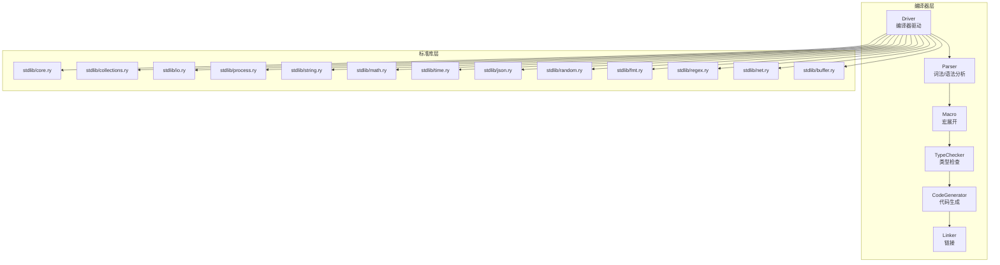
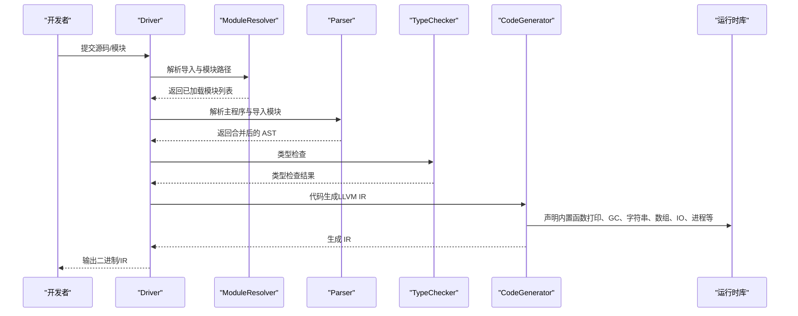
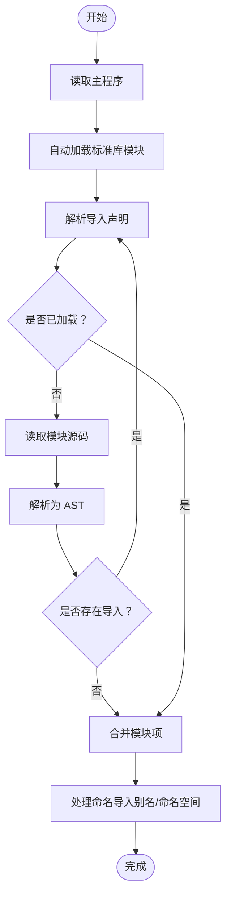
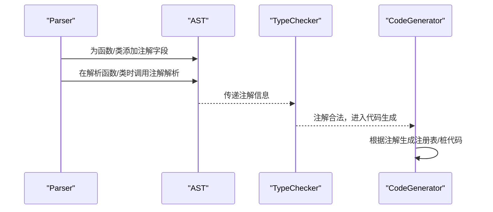
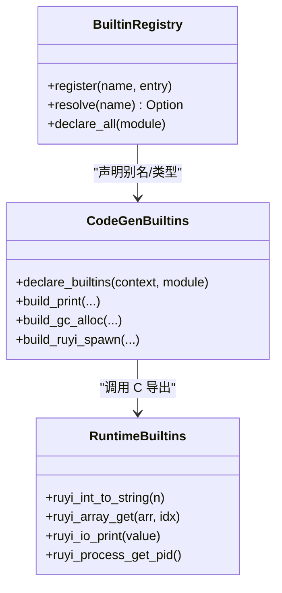
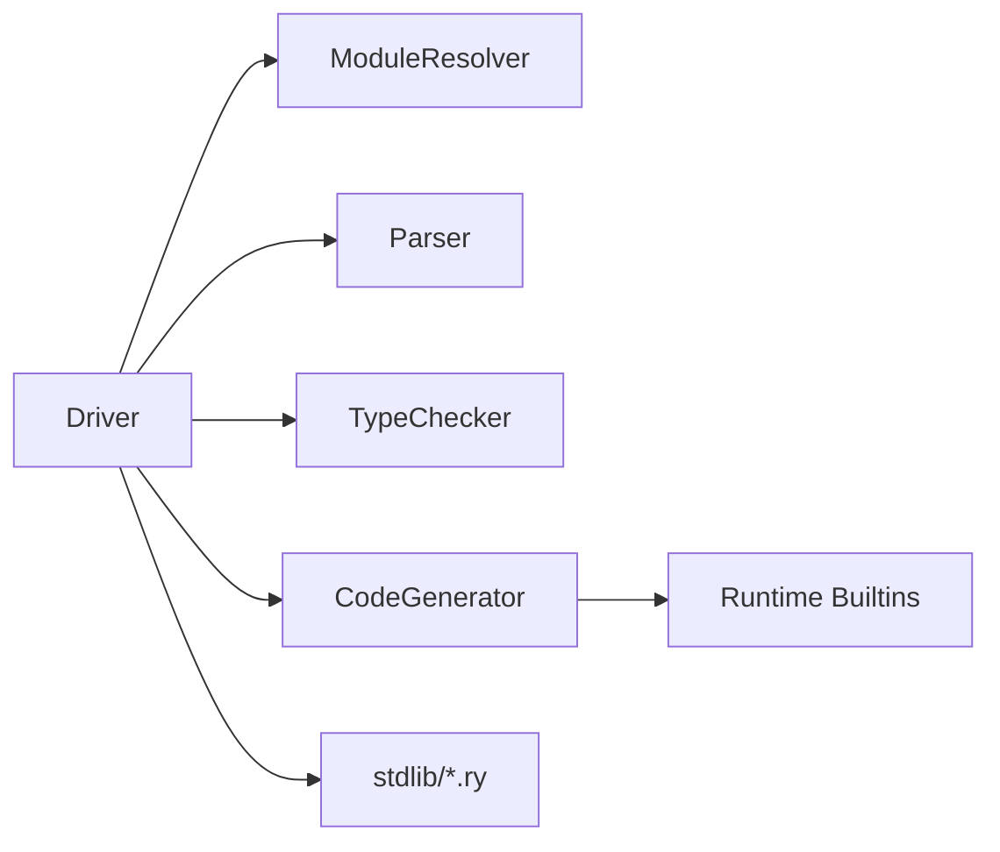

# 插件架构

<cite>
**本文档引用的文件**
- [README.md](file://README.md)
- [Cargo.toml](file://Cargo.toml)
- [driver.rs](file://crates/ruyic/src/driver.rs)
- [parser.rs](file://crates/ruyic/src/parser/parser.rs)
- [ast.rs](file://crates/ruyic/src/parser/ast.rs)
- [builtins.rs](file://crates/ruyic/src/codegen/builtins.rs)
- [arc.rs](file://crates/ruyic/src/typechecker/arc.rs)
- [process.ry](file://stdlib/process.ry)
- [v0.5-stdlib-expansion.md](file://.omo/plans/v0.5-stdlib-expansion.md)
</cite>

## 目录
1. [简介](#简介)
2. [项目结构](#项目结构)
3. [核心组件](#核心组件)
4. [架构总览](#架构总览)
5. [详细组件分析](#详细组件分析)
6. [依赖关系分析](#依赖关系分析)
7. [性能考量](#性能考量)
8. [故障排查指南](#故障排查指南)
9. [结论](#结论)
10. [附录](#附录)

## 简介
本指南面向希望在 Ruyi 语言生态中实现“插件”的开发者，目标是提供一套可落地的插件架构设计与开发实践。当前仓库并未直接提供“插件系统”或“插件加载器”，但其模块化、可扩展的编译器驱动、模块解析与内置函数注册机制，为构建插件式扩展提供了天然基础。

本指南将基于现有代码库中的模块解析、导入系统、内置函数注册、注解扩展等能力，给出插件系统的整体设计思路、扩展点识别、接口与生命周期管理、加载与依赖管理、插件间通信与数据共享策略，并提供可操作的开发步骤与最佳实践。

## 项目结构
Ruyi 的编译器采用分层设计：词法/语法分析、宏展开、类型检查、代码生成、链接。标准库以 .ry 源码形式提供，通过模块解析与导入系统被编译器自动加载与合并。

图表来源
- [driver.rs:242-270](file://crates/ruyic/src/driver.rs#L242-L270)
- [parser.rs:1-200](file://crates/ruyic/src/parser/parser.rs#L1-L200)
- [Cargo.toml:1-40](file://Cargo.toml#L1-L40)

章节来源
- [README.md:75-99](file://README.md#L75-L99)
- [Cargo.toml:1-40](file://Cargo.toml#L1-L40)

## 核心组件
- 编译器驱动（Driver）：负责模块解析、导入处理、类型检查、代码生成与输出。
- 模块解析器（ModuleResolver）：负责定位与加载 .ry 模块，支持相对路径、绝对路径、RUYI_HOME/stdlib 以及自定义搜索路径。
- 解析器（Parser）：将源码转换为 AST，并支持注解（如 @test、@arc）。
- 类型检查器（TypeChecker）：对 AST 进行类型推断与检查。
- 代码生成器（CodeGenerator）：将 AST 转换为 LLVM IR，并声明内置函数。
- 内置函数注册（BuiltinRegistry）：集中管理运行时导出函数的别名映射与类型签名。
- 注解扫描（TestScanner/ArcClassRegistry）：在类型检查后扫描特定注解，用于测试发现与 ARC 类型规则。

章节来源
- [driver.rs:149-240](file://crates/ruyic/src/driver.rs#L149-L240)
- [parser.rs:198-200](file://crates/ruyic/src/parser/parser.rs#L198-L200)
- [builtins.rs:1-85](file://crates/ruyic/src/codegen/builtins.rs#L1-L85)
- [arc.rs:15-74](file://crates/ruyic/src/typechecker/arc.rs#L15-L74)

## 架构总览
Ruyi 的模块系统与内置函数注册为“插件式扩展”提供了天然的基础设施。插件可以视为“额外的标准库模块”或“扩展的内置函数集合”。通过以下方式实现插件化：
- 模块扩展：新增 .ry 模块文件，遵循现有导入与导出语义，由 Driver 自动加载。
- 内置函数扩展：在运行时 crate 中新增 C 导出函数，并在编译期通过 BuiltinRegistry 声明别名与类型签名。
- 注解扩展：通过注解扫描机制（如 @test）扩展编译期行为。

图表来源
- [driver.rs:258-270](file://crates/ruyic/src/driver.rs#L258-L270)
- [driver.rs:302-329](file://crates/ruyic/src/driver.rs#L302-L329)
- [driver.rs:521-632](file://crates/ruyic/src/driver.rs#L521-L632)
- [builtins.rs:16-85](file://crates/ruyic/src/codegen/builtins.rs#L16-L85)

## 详细组件分析

### 组件一：模块解析与导入系统（插件入口与依赖管理）
- 设计要点
  - 支持相对路径、绝对路径、RUYI_HOME/stdlib 与自定义搜索路径。
  - 递归解析导入，自动加载标准库模块（如 error、core、collections），并将导入模块项合并到主程序。
  - 对命名导入与命名空间导入进行别名与对象字面量注入，便于统一访问。
- 扩展点
  - 可在搜索路径中加入插件目录，使 .ry 插件模块被自动发现与加载。
  - 可通过 re-export 机制将插件内部 API 映射到统一命名空间。
- 生命周期
  - 加载阶段：解析导入并缓存 AST。
  - 合并阶段：将导入模块项与主程序合并，处理命名导入与命名空间导入。
  - 类型检查阶段：统一可见性与作用域。
- 性能
  - 使用哈希表缓存已加载模块，避免重复读取与解析。
  - 仅在必要时递归解析未见过的模块。

图表来源
- [driver.rs:302-329](file://crates/ruyic/src/driver.rs#L302-L329)
- [driver.rs:356-512](file://crates/ruyic/src/driver.rs#L356-L512)

章节来源
- [driver.rs:149-240](file://crates/ruyic/src/driver.rs#L149-L240)
- [driver.rs:302-382](file://crates/ruyic/src/driver.rs#L302-L382)

### 组件二：注解与扩展点（插件接口与生命周期）
- 设计要点
  - 在 AST 中为函数与类声明增加注解字段，解析器在相应位置调用注解解析函数。
  - 类型检查器与代码生成器需保留注解信息，以便后续处理（如测试扫描、ARC 规则）。
- 扩展点
  - 可新增注解（如 @plugin、@hook、@export）并定义其语义。
  - 可在类型检查后扫描注解，触发编译期行为（如生成测试桩、注册钩子）。
- 生命周期
  - 解析阶段：收集注解元数据。
  - 类型检查阶段：验证注解使用合法性。
  - 代码生成阶段：根据注解生成相应代码或注册表项。

图表来源
- [parser.rs:198-200](file://crates/ruyic/src/parser/parser.rs#L198-L200)
- [ast.rs:28-69](file://crates/ruyic/src/parser/ast.rs#L28-L69)
- [arc.rs:28-50](file://crates/ruyic/src/typechecker/arc.rs#L28-L50)

章节来源
- [parser.rs:198-200](file://crates/ruyic/src/parser/parser.rs#L198-L200)
- [ast.rs:28-69](file://crates/ruyic/src/parser/ast.rs#L28-L69)
- [arc.rs:15-74](file://crates/ruyic/src/typechecker/arc.rs#L15-L74)

### 组件三：内置函数注册与运行时交互（插件 API 规范）
- 设计要点
  - 在运行时 crate 中新增 C 导出函数，提供插件所需的底层能力（字符串、数组、IO、进程、网络等）。
  - 在编译期通过 BuiltinRegistry 声明别名（如 __builtin_* 与 __string_*），并在类型检查器中注册类型签名。
- 扩展点
  - 新增插件 API：在运行时 crate 中实现 C 函数，在编译期声明别名与类型签名。
  - 保持命名一致性：统一使用 __builtin_* 作为编译期调用名，运行时导出名为 ruyi_*。
- 生命周期
  - 定义阶段：在运行时 crate 中导出 C 函数。
  - 声明阶段：在编译期声明别名与类型签名。
  - 调用阶段：插件通过 __builtin_* 调用，最终链接到 ruyi_* 实现。

图表来源
- [builtins.rs:16-85](file://crates/ruyic/src/codegen/builtins.rs#L16-L85)
- [v0.5-stdlib-expansion.md:276-348](file://.omo/plans/v0.5-stdlib-expansion.md#L276-L348)

章节来源
- [builtins.rs:1-800](file://crates/ruyic/src/codegen/builtins.rs#L1-L800)
- [v0.5-stdlib-expansion.md:276-348](file://.omo/plans/v0.5-stdlib-expansion.md#L276-L348)

### 组件四：插件间通信与数据共享（模块化与命名空间）
- 设计要点
  - 通过标准库模块的 re-export 机制，将不同插件的 API 聚合到统一命名空间。
  - 使用命名空间导入（import * as ns）将多个插件的导出聚合为对象字面量，便于统一访问。
- 实践建议
  - 插件 A 与插件 B 各自导出功能模块；在聚合模块中 re-export 并命名空间导入，形成统一入口。
  - 避免命名冲突：为每个插件设置前缀命名空间（如 pluginA、pluginB）。

章节来源
- [driver.rs:416-502](file://crates/ruyic/src/driver.rs#L416-L502)

### 组件五：安全与沙箱（基于现有运行时约束）
- 设计要点
  - 所有内置返回值必须使用 GC 受管分配（ruyi_gc_alloc），避免内存泄漏与悬垂指针。
  - 运行时导出函数遵循 C ABI，确保与 LLVM IR 的互操作性。
- 安全建议
  - 限制插件对系统资源的直接访问，通过内置函数封装 IO、进程、网络等敏感操作。
  - 对插件暴露的 API 进行严格的类型检查与边界校验。

章节来源
- [builtins.rs:525-555](file://crates/ruyic/src/codegen/builtins.rs#L525-L555)
- [v0.5-stdlib-expansion.md:553-600](file://.omo/plans/v0.5-stdlib-expansion.md#L553-L600)

### 组件六：动态加载与热重载（当前不支持，建议方案）
- 现状
  - 当前编译器为一次性编译流程，不支持动态加载与热重载。
- 建议方案
  - 引入“插件宿主”进程：启动独立的运行时实例，通过 IPC 与插件通信。
  - 插件以独立二进制或共享库形式存在，宿主负责加载与卸载。
  - 使用文件监控与增量编译策略，结合编译器的增量能力（如仅重新生成受影响模块）。

[本节为概念性内容，不直接分析具体文件]

## 依赖关系分析
- 编译器驱动依赖模块解析器、解析器、类型检查器与代码生成器。
- 代码生成器依赖运行时库的内置函数声明。
- 标准库模块通过导入系统被统一加载与合并。
- 注解扫描依赖解析器与类型检查器的中间产物。

图表来源
- [driver.rs:242-270](file://crates/ruyic/src/driver.rs#L242-L270)
- [builtins.rs:16-85](file://crates/ruyic/src/codegen/builtins.rs#L16-L85)

章节来源
- [driver.rs:242-270](file://crates/ruyic/src/driver.rs#L242-L270)
- [builtins.rs:16-85](file://crates/ruyic/src/codegen/builtins.rs#L16-L85)

## 性能考量
- 模块缓存：已加载模块以路径为键缓存，避免重复解析与读取。
- 递归解析：仅在首次遇到模块时进行递归解析，后续直接复用缓存。
- 类型检查：在合并导入模块后进行一次类型检查，减少重复工作。
- 代码生成：按需声明内置函数，避免不必要的 IR 生成。
- 运行时分配：统一使用 GC 受管分配，减少手动内存管理开销。

[本节提供通用指导，不直接分析具体文件]

## 故障排查指南
- 模块未找到
  - 检查模块路径是否正确，确认 RUYI_HOME/stdlib、相对路径与搜索路径配置。
  - 确认模块文件扩展名为 .ry。
- 导入循环
  - 避免相互导入；若确需循环依赖，使用 re-export 或延迟初始化。
- 内置函数未声明
  - 确认在编译期已声明别名与类型签名；检查运行时导出函数是否匹配。
- 注解未生效
  - 确认注解解析逻辑已在相应解析函数中调用；检查注解字段是否正确写入 AST。

章节来源
- [driver.rs:173-234](file://crates/ruyic/src/driver.rs#L173-L234)
- [builtins.rs:16-85](file://crates/ruyic/src/codegen/builtins.rs#L16-L85)
- [parser.rs:198-200](file://crates/ruyic/src/parser/parser.rs#L198-L200)

## 结论
Ruyi 的模块解析、导入系统与内置函数注册机制为“插件式扩展”提供了坚实基础。通过在标准库层新增 .ry 模块与在运行时层新增 C 导出函数，即可实现插件的功能扩展。结合注解扫描与命名空间导入，可进一步完善插件的生命周期管理与 API 统一。对于动态加载与热重载需求，可在现有编译器基础上引入“插件宿主”与 IPC 机制，逐步实现增量编译与运行时加载。

[本节为总结性内容，不直接分析具体文件]

## 附录

### A. 插件开发步骤清单
- 定义插件 API：在运行时 crate 中实现 C 导出函数。
- 声明内置函数：在编译期注册别名与类型签名。
- 编写插件模块：实现 .ry 插件模块，提供统一的导出接口。
- 配置导入：在插件聚合模块中 re-export 并命名空间导入。
- 测试与验证：编写集成测试，验证插件在真实场景下的行为。
- 文档与示例：提供使用示例与最佳实践文档。

章节来源
- [builtins.rs:16-85](file://crates/ruyic/src/codegen/builtins.rs#L16-L85)
- [driver.rs:302-382](file://crates/ruyic/src/driver.rs#L302-L382)
- [v0.5-stdlib-expansion.md:276-348](file://.omo/plans/v0.5-stdlib-expansion.md#L276-L348)

### B. 示例：进程模块（参考实现）
- 该模块展示了标准库中如何组织类与属性，可作为插件类设计的参考。
- 属性包括 PID、命令、工作目录、环境变量、退出码与运行状态等。

章节来源
- [process.ry:1-48](file://stdlib/process.ry#L1-L48)