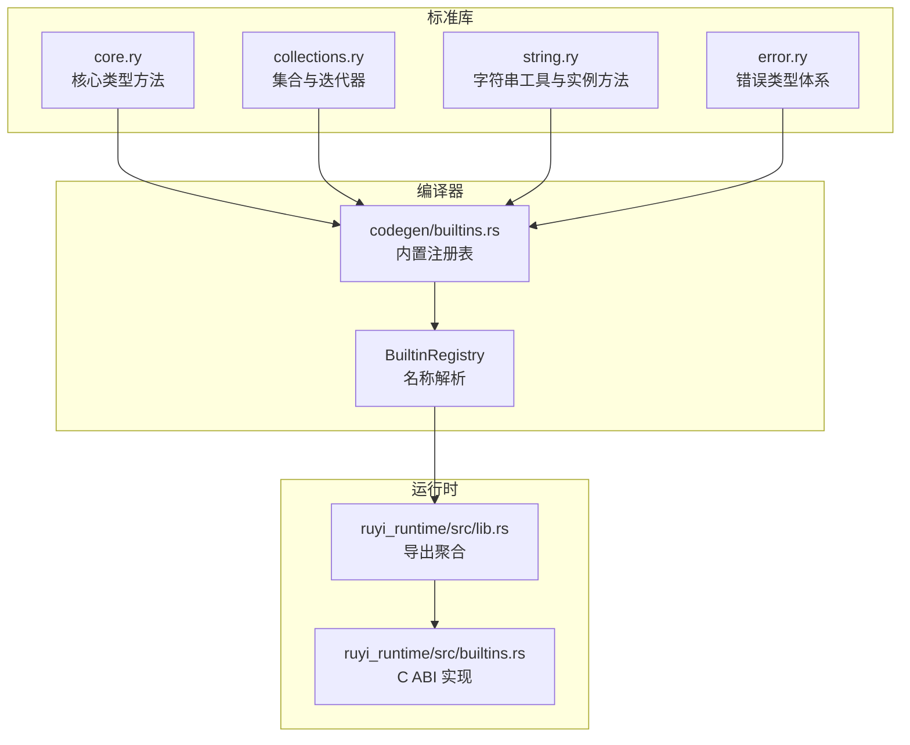
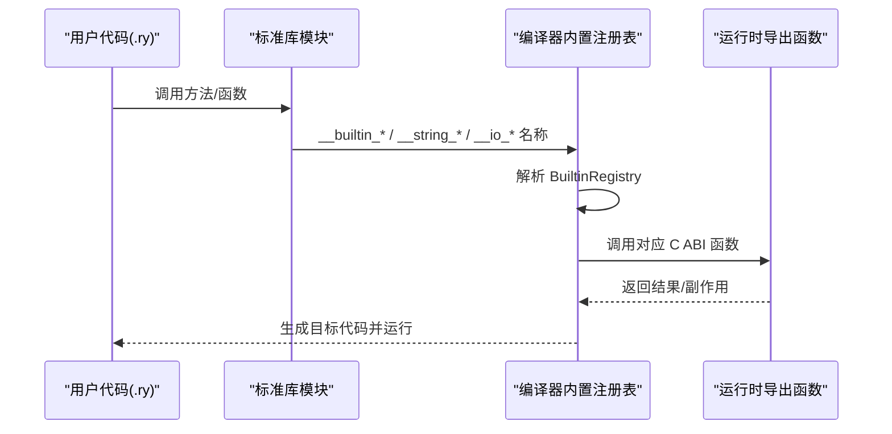
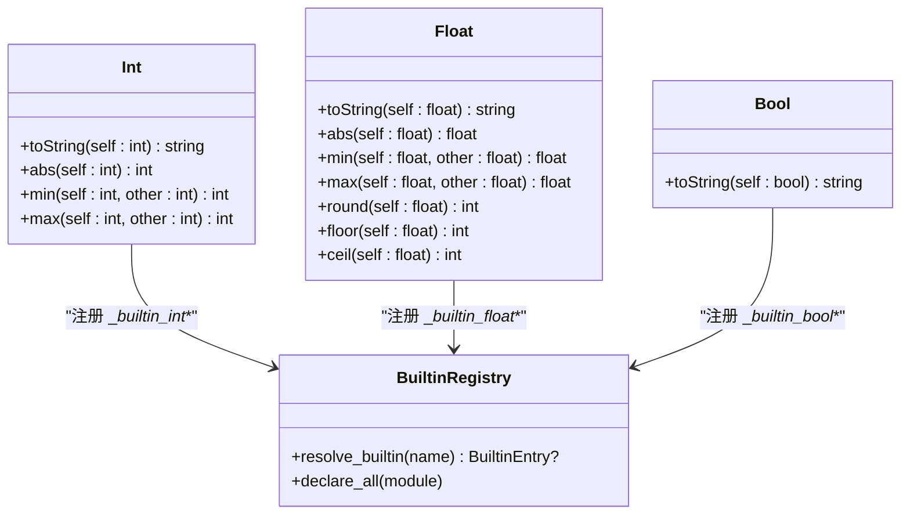
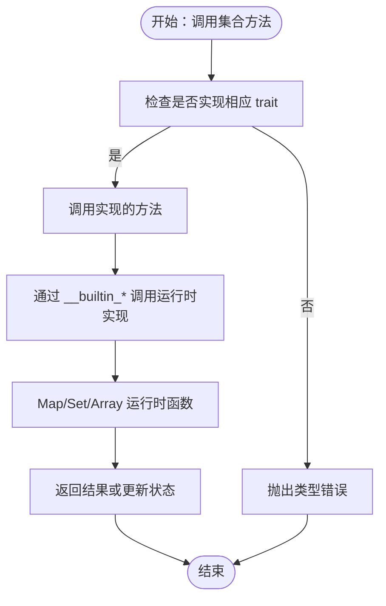
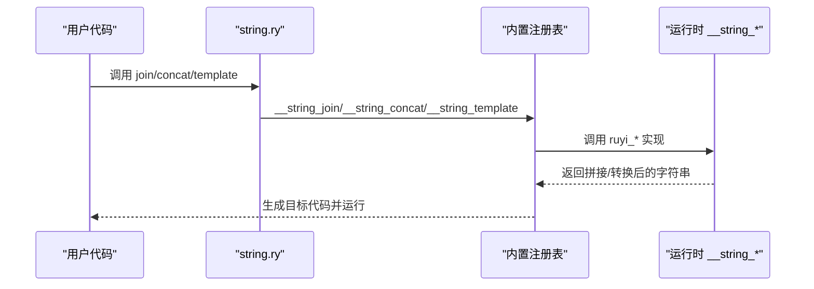
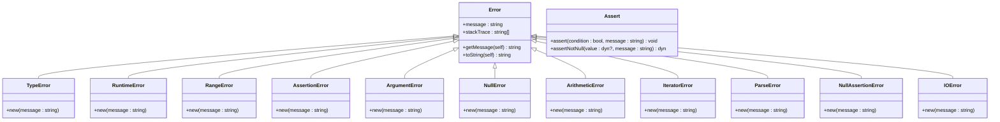
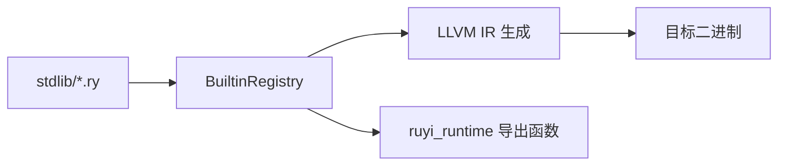

# 标准库扩展

<cite>
**本文档引用的文件**
- [stdlib/core.ry](file://stdlib/core.ry)
- [stdlib/collections.ry](file://stdlib/collections.ry)
- [stdlib/string.ry](file://stdlib/string.ry)
- [stdlib/error.ry](file://stdlib/error.ry)
- [crates/ruyi_runtime/src/builtins.rs](file://crates/ruyi_runtime/src/builtins.rs)
- [crates/ruyi_runtime/src/lib.rs](file://crates/ruyi_runtime/src/lib.rs)
- [crates/ruyic/src/codegen/builtins.rs](file://crates/ruyic/src/codegen/builtins.rs)
- [examples/stdlib_test.ry](file://examples/stdlib_test.ry)
- [examples/stdlib_string_test.ry](file://examples/stdlib_string_test.ry)
- [examples/stdlib_map_filter.ry](file://examples/stdlib_map_filter.ry)
- [Cargo.toml](file://Cargo.toml)
- [crates/ruyi_runtime/Cargo.toml](file://crates/ruyi_runtime/Cargo.toml)
- [docs/versioning.md](file://docs/versioning.md)
- [.omo/plans/v0.5-stdlib-expansion.md](file://.omo/plans/v0.5-stdlib-expansion.md)
</cite>

## 目录
1. [简介](#简介)
2. [项目结构](#项目结构)
3. [核心组件](#核心组件)
4. [架构总览](#架构总览)
5. [详细组件分析](#详细组件分析)
6. [依赖关系分析](#依赖关系分析)
7. [性能考量](#性能考量)
8. [故障排除指南](#故障排除指南)
9. [结论](#结论)
10. [附录](#附录)

## 简介
本指南面向希望为 Ruyi 标准库进行扩展的开发者，系统讲解如何在现有基础设施之上添加新的核心类型、集合容器、字符串处理与错误处理能力，并提供可复用的实现模式、测试方法与版本兼容性建议。Ruyi 的标准库由纯 Ruyi 源码模块组成，通过运行时导出的 C ABI 函数桥接到底层实现；编译器侧通过内置注册表统一解析 `__builtin_*`、`__string_*`、`__io_*` 等名称，最终生成目标平台的机器码。

## 项目结构
Ruyi 的标准库扩展主要涉及以下层次：
- 标准库模块：位于 `stdlib/` 目录，提供用户可见的 API（如 core、collections、string、error 等）
- 运行时实现：位于 `crates/ruyi_runtime/src/`，提供 C ABI 导出函数，承载实际内存布局与算法
- 编译器内置注册表：位于 `crates/ruyic/src/codegen/builtins.rs`，负责将 stdlib 中的 `__builtin_*` 名称解析为运行时导出函数
- 示例与测试：位于 `examples/` 与 `crates/ruyic/tests/integration/cases/stdlib/`，用于验证扩展的正确性

**图表来源**
- [stdlib/core.ry:1-31](file://stdlib/core.ry#L1-L31)
- [stdlib/collections.ry:1-480](file://stdlib/collections.ry#L1-L480)
- [stdlib/string.ry:1-165](file://stdlib/string.ry#L1-L165)
- [stdlib/error.ry:1-106](file://stdlib/error.ry#L1-L106)
- [crates/ruyic/src/codegen/builtins.rs:654-680](file://crates/ruyic/src/codegen/builtins.rs#L654-L680)
- [crates/ruyi_runtime/src/lib.rs:24-28](file://crates/ruyi_runtime/src/lib.rs#L24-L28)
- [crates/ruyi_runtime/src/builtins.rs:335-366](file://crates/ruyi_runtime/src/builtins.rs#L335-L366)

**章节来源**
- [Cargo.toml:1-40](file://Cargo.toml#L1-L40)
- [crates/ruyi_runtime/Cargo.toml:1-17](file://crates/ruyi_runtime/Cargo.toml#L1-L17)

## 核心组件
- 核心类型库（core.ry）：为基本类型（int、float、bool）提供实例方法，调用运行时导出的转换函数
- 集合库（collections.ry）：提供泛型集合（Array、Map、Set）与迭代器（Iterator）接口及默认实现
- 字符串库（string.ry）：提供独立的字符串工具函数与字符串实例方法（通过代码生成层映射到运行时）
- 错误库（error.ry）：提供错误类型层次与断言辅助函数

这些模块共同构成标准库的“用户面”，通过内置注册表与运行时实现形成“编译期-运行时”闭环。

**章节来源**
- [stdlib/core.ry:11-31](file://stdlib/core.ry#L11-L31)
- [stdlib/collections.ry:14-480](file://stdlib/collections.ry#L14-L480)
- [stdlib/string.ry:12-165](file://stdlib/string.ry#L12-L165)
- [stdlib/error.ry:10-106](file://stdlib/error.ry#L10-L106)

## 架构总览
标准库扩展遵循“声明式 API + 注册表解析 + 运行时实现”的三层架构：

**图表来源**
- [crates/ruyic/src/codegen/builtins.rs:654-680](file://crates/ruyic/src/codegen/builtins.rs#L654-L680)
- [crates/ruyi_runtime/src/builtins.rs:335-366](file://crates/ruyi_runtime/src/builtins.rs#L335-L366)

## 详细组件分析

### 核心类型库扩展（Int/Float/Bool）
- 目标：为 int、float、bool 添加新的实例方法
- 实现路径：
  - 在 core.ry 中新增类与方法声明
  - 在运行时实现对应的 C ABI 函数（参考现有 `ruyi_int_to_string`、`ruyi_float_to_string`、`ruyi_bool_to_string`）
  - 在内置注册表中注册新函数，支持 `__builtin_*` 与 `__string_*` 双重别名映射
- 数据结构与复杂度：
  - 数值运算通常为 O(1)，字符串转换取决于数值大小
- 依赖链：
  - stdlib/core.ry → codegen/builtins.rs → ruyi_runtime/src/builtins.rs

**图表来源**
- [stdlib/core.ry:11-31](file://stdlib/core.ry#L11-L31)
- [crates/ruyi_runtime/src/builtins.rs:21-73](file://crates/ruyi_runtime/src/builtins.rs#L21-L73)
- [crates/ruyic/src/codegen/builtins.rs:654-680](file://crates/ruyic/src/codegen/builtins.rs#L654-L680)

**章节来源**
- [stdlib/core.ry:11-31](file://stdlib/core.ry#L11-L31)
- [crates/ruyi_runtime/src/builtins.rs:21-73](file://crates/ruyi_runtime/src/builtins.rs#L21-L73)

### 集合类型扩展（Array/Map/Set/Iterator）
- 目标：为集合类型添加新方法或新容器
- 实现路径：
  - 在 collections.ry 中扩展 trait 或 class 声明
  - 在运行时实现对应的 C ABI 函数（如 `__builtin_map_*`、`__builtin_set_*`）
  - 在内置注册表中注册新函数，确保 stdlib 与运行时名称映射一致
- 数据流与算法：
  - Array：基于头部+槽位的数组布局，支持动态扩容
  - Map/Set：基于哈希表的键值存储，返回数组形式的 keys/values
- 依赖链：
  - stdlib/collections.ry → codegen/builtins.rs → ruyi_runtime/src/builtins.rs

**图表来源**
- [stdlib/collections.ry:39-186](file://stdlib/collections.ry#L39-L186)
- [stdlib/collections.ry:229-330](file://stdlib/collections.ry#L229-L330)
- [stdlib/collections.ry:365-456](file://stdlib/collections.ry#L365-L456)
- [crates/ruyi_runtime/src/builtins.rs:372-449](file://crates/ruyi_runtime/src/builtins.rs#L372-L449)
- [crates/ruyi_runtime/src/builtins.rs:455-490](file://crates/ruyi_runtime/src/builtins.rs#L455-L490)

**章节来源**
- [stdlib/collections.ry:14-480](file://stdlib/collections.ry#L14-L480)
- [crates/ruyi_runtime/src/builtins.rs:372-490](file://crates/ruyi_runtime/src/builtins.rs#L372-L490)

### 字符串处理库扩展（工具函数与实例方法）
- 目标：新增字符串工具函数或扩展实例方法
- 实现路径：
  - 在 string.ry 中新增函数或扩展 String 类
  - 在运行时实现对应的 C ABI 函数（如 `__string_*`）
  - 在内置注册表中注册，确保名称映射正确
- 数据流：
  - 输入字符串指针 → 运行时处理 → 返回新分配的字符串指针（由 GC 管理）

**图表来源**
- [stdlib/string.ry:22-91](file://stdlib/string.ry#L22-L91)
- [crates/ruyi_runtime/src/builtins.rs:501-708](file://crates/ruyi_runtime/src/builtins.rs#L501-L708)
- [crates/ruyic/src/codegen/builtins.rs:654-680](file://crates/ruyic/src/codegen/builtins.rs#L654-L680)

**章节来源**
- [stdlib/string.ry:12-165](file://stdlib/string.ry#L12-L165)
- [crates/ruyi_runtime/src/builtins.rs:501-708](file://crates/ruyi_runtime/src/builtins.rs#L501-L708)

### 错误处理库扩展（新错误类型与处理机制）
- 目标：新增错误类型或断言辅助函数
- 实现路径：
  - 在 error.ry 中新增类或函数
  - 在运行时无需新增导出（现有异常机制已覆盖）
- 依赖链：
  - stdlib/error.ry → 运行时异常处理（landing pad、栈追踪等）

**图表来源**
- [stdlib/error.ry:10-106](file://stdlib/error.ry#L10-L106)

**章节来源**
- [stdlib/error.ry:10-106](file://stdlib/error.ry#L10-L106)

## 依赖关系分析
- 标准库模块对运行时导出的依赖通过内置注册表集中管理，避免在 stdlib 中硬编码具体函数名
- 运行时导出函数统一使用 GC 可管理的分配策略，确保内存安全
- 编译器在生成调用指令前先查询注册表，未知内置名会触发编译期错误

**图表来源**
- [crates/ruyic/src/codegen/builtins.rs:654-680](file://crates/ruyic/src/codegen/builtins.rs#L654-L680)
- [crates/ruyi_runtime/src/lib.rs:24-28](file://crates/ruyi_runtime/src/lib.rs#L24-L28)

**章节来源**
- [crates/ruyic/src/codegen/builtins.rs:654-680](file://crates/ruyic/src/codegen/builtins.rs#L654-L680)
- [crates/ruyi_runtime/src/lib.rs:24-28](file://crates/ruyi_runtime/src/lib.rs#L24-L28)

## 性能考量
- 字符串与集合操作的复杂度取决于底层实现：字符串拼接可能产生多次分配，集合查找为平均 O(1) 哈希表操作
- 运行时分配目前使用 GC 可管理的分配器，未来将完善 GC 集成以减少泄漏风险
- 编译器通过 monomorphization 保证泛型调用零运行时开销

[本节为通用指导，不直接分析具体文件]

## 故障排除指南
- 未知内置名：当 stdlib 调用 `__builtin_*` 名称未在注册表中找到时，编译器会报错，需检查名称拼写与注册表条目
- 运行时崩溃：检查运行时导出函数的参数类型与空指针校验逻辑
- 内存泄漏：确认返回的堆内存通过 GC 管理（已在后续里程碑中完善）

**章节来源**
- [crates/ruyic/src/codegen/builtins.rs:654-680](file://crates/ruyic/src/codegen/builtins.rs#L654-L680)
- [crates/ruyi_runtime/src/builtins.rs:553-598](file://crates/ruyi_runtime/src/builtins.rs#L553-L598)

## 结论
通过内置注册表与运行时导出函数的解耦设计，Ruyi 标准库扩展具备良好的可维护性与可扩展性。遵循本文档的实现模式、测试方法与版本管理规范，可以高效地为核心类型、集合、字符串与错误处理模块添加新功能，并确保向后兼容与质量可控。

[本节为总结，不直接分析具体文件]

## 附录

### 标准库扩展的兼容性与版本管理
- 版本号规则：遵循语义化版本（MAJOR.MINOR.PATCH），标准库扩展属于 MINOR 升级范畴
- 分支模型：采用 main 与 dev/vX.Y 双轨分支，发布流程严格控制
- Tag 规范：使用带注释的 annotated tag，打在 main 的 merge commit 上
- 回滚程序：针对合并后未打 Tag、已打 Tag 发现严重 Bug、紧急回滚等场景提供标准化流程

**章节来源**
- [docs/versioning.md:13-108](file://docs/versioning.md#L13-L108)
- [docs/versioning.md:111-160](file://docs/versioning.md#L111-L160)
- [docs/versioning.md:205-293](file://docs/versioning.md#L205-L293)

### 标准库扩展的测试方法与文档编写规范
- 单元与集成测试：在 `crates/ruyic/tests/integration/cases/stdlib/` 下新增 .ry 与 .expected 文件对，运行集成测试套件
- 示例程序：在 `examples/` 下新增演示文件，验证新功能的端到端行为
- 文档规范：遵循现有模块注释风格，明确导出函数的用途、参数与返回值

**章节来源**
- [.omo/plans/v0.5-stdlib-expansion.md:1032-1058](file://.omo/plans/v0.5-stdlib-expansion.md#L1032-L1058)
- [examples/stdlib_test.ry:6-37](file://examples/stdlib_test.ry#L6-L37)
- [examples/stdlib_string_test.ry:5-28](file://examples/stdlib_string_test.ry#L5-L28)
- [examples/stdlib_map_filter.ry:5-28](file://examples/stdlib_map_filter.ry#L5-L28)

### 具体实现步骤示例（路径指引）
- 为 Int 添加新方法：
  - 在 [stdlib/core.ry:11-31](file://stdlib/core.ry#L11-L31) 中添加方法声明
  - 在 [crates/ruyi_runtime/src/builtins.rs:21-73](file://crates/ruyi_runtime/src/builtins.rs#L21-L73) 中实现运行时导出
  - 在 [crates/ruyic/src/codegen/builtins.rs:654-680](file://crates/ruyic/src/codegen/builtins.rs#L654-L680) 中注册
- 为 Array 添加新方法：
  - 在 [stdlib/collections.ry:39-186](file://stdlib/collections.ry#L39-L186) 中扩展 ArrayOps
  - 在 [crates/ruyi_runtime/src/builtins.rs:335-366](file://crates/ruyi_runtime/src/builtins.rs#L335-L366) 中实现运行时函数
  - 在 [crates/ruyic/src/codegen/builtins.rs:654-680](file://crates/ruyic/src/codegen/builtins.rs#L654-L680) 中注册
- 为字符串添加工具函数：
  - 在 [stdlib/string.ry:22-91](file://stdlib/string.ry#L22-L91) 中新增函数
  - 在 [crates/ruyi_runtime/src/builtins.rs:501-708](file://crates/ruyi_runtime/src/builtins.rs#L501-L708) 中实现运行时函数
  - 在 [crates/ruyic/src/codegen/builtins.rs:654-680](file://crates/ruyic/src/codegen/builtins.rs#L654-L680) 中注册
- 为错误处理添加新类型：
  - 在 [stdlib/error.ry:10-106](file://stdlib/error.ry#L10-L106) 中新增类或函数