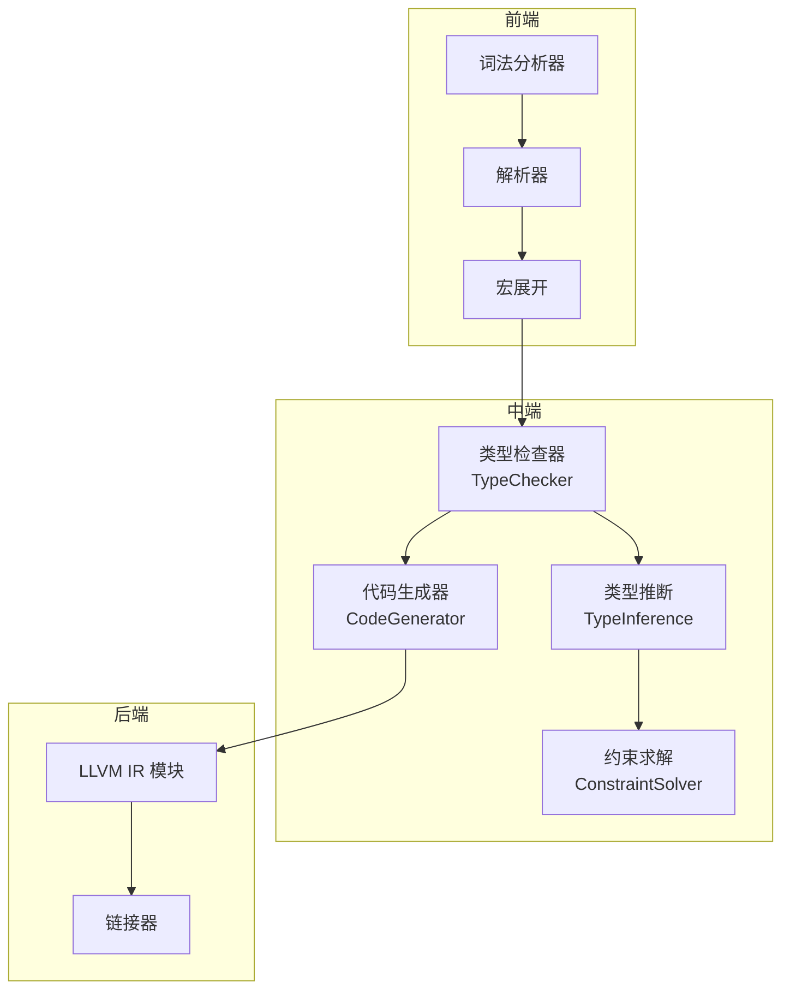
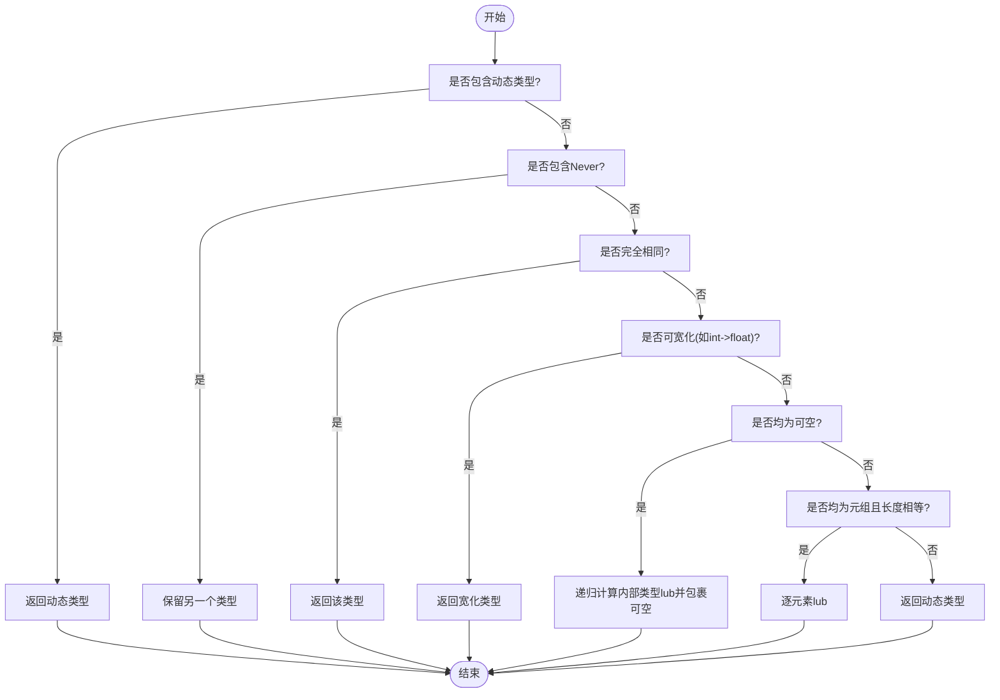
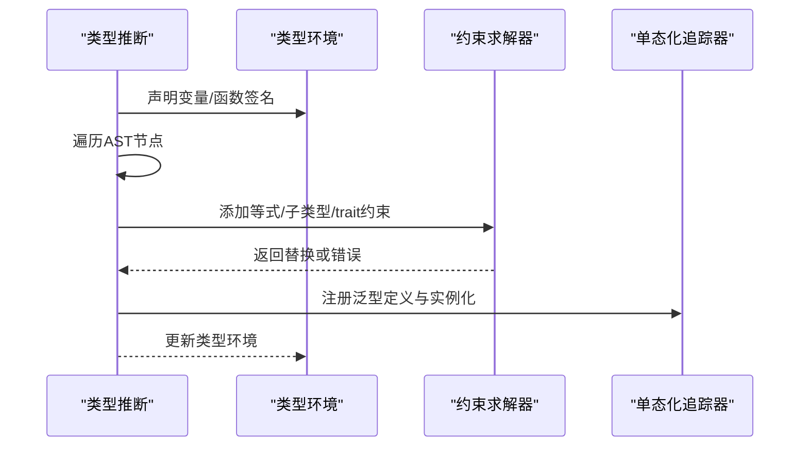
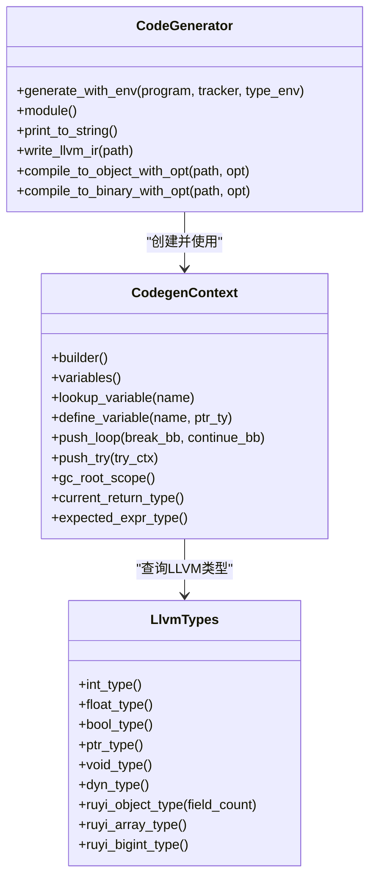
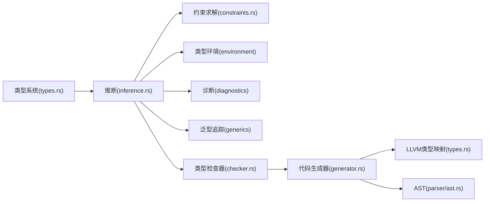

# 编译器中端扩展

<cite>
**本文引用的文件**
- [crates/ruyic/src/typechecker/mod.rs](file://crates/ruyic/src/typechecker/mod.rs)
- [crates/ruyic/src/typechecker/types.rs](file://crates/ruyic/src/typechecker/types.rs)
- [crates/ruyic/src/typechecker/inference.rs](file://crates/ruyic/src/typechecker/inference.rs)
- [crates/ruyic/src/typechecker/constraints.rs](file://crates/ruyic/src/typechecker/constraints.rs)
- [crates/ruyic/src/typechecker/checker.rs](file://crates/ruyic/src/typechecker/checker.rs)
- [crates/ruyic/src/codegen/mod.rs](file://crates/ruyic/src/codegen/mod.rs)
- [crates/ruyic/src/codegen/generator.rs](file://crates/ruyic/src/codegen/generator.rs)
- [crates/ruyic/src/codegen/types.rs](file://crates/ruyic/src/codegen/types.rs)
- [crates/ruyic/src/driver.rs](file://crates/ruyic/src/driver.rs)
- [crates/ruyic/src/parser/ast.rs](file://crates/ruyic/src/parser/ast.rs)
- [crates/ruyic/tests/integration/runner.rs](file://crates/ruyic/tests/integration/runner.rs)
- [crates/ruyic/tests/integration/cases/basic/arithmetic.ry](file://crates/ruyic/tests/integration/cases/basic/arithmetic.ry)
- [crates/ruyic/tests/integration/cases/types/type_inference.ry](file://crates/ruyic/tests/integration/cases/types/type_inference.ry)
</cite>

## 目录
1. [引言](#引言)
2. [项目结构](#项目结构)
3. [核心组件](#核心组件)
4. [架构总览](#架构总览)
5. [详细组件分析](#详细组件分析)
6. [依赖关系分析](#依赖关系分析)
7. [性能考虑](#性能考虑)
8. [故障排查指南](#故障排查指南)
9. [结论](#结论)
10. [附录](#附录)

## 引言
本指南面向需要在Ruyi编译器中端进行扩展的开发者，围绕类型检查器、类型推断与约束求解、代码生成器以及中间表示（IR）设计展开，提供可操作的扩展步骤、流程图与测试策略，帮助你安全地引入新语言特性、新类型规则与新IR指令。

## 项目结构
Ruyi编译器采用模块化分层设计：词法/语法解析、宏展开、类型检查、代码生成、链接等阶段清晰分离；中端主要由类型检查与代码生成两大子系统组成，二者通过AST与类型环境、泛型单态化追踪器衔接。



图表来源
- [crates/ruyic/src/driver.rs:522-632](file://crates/ruyic/src/driver.rs#L522-L632)
- [crates/ruyic/src/typechecker/mod.rs:1-32](file://crates/ruyic/src/typechecker/mod.rs#L1-L32)
- [crates/ruyic/src/codegen/mod.rs:1-15](file://crates/ruyic/src/codegen/mod.rs#L1-L15)

章节来源
- [crates/ruyic/src/driver.rs:1-744](file://crates/ruyic/src/driver.rs#L1-L744)
- [crates/ruyic/src/lib.rs:1-21](file://crates/ruyic/src/lib.rs#L1-L21)

## 核心组件
- 类型系统与规则
  - 基础类型、可空类型、数组/元组、对象、函数、命名/泛型、动态类型、Future、错误恢复类型等定义于类型模块。
  - 子类型判断、一致性判断、最小上界（lub）等规则集中实现，支撑渐进式类型系统。
- 类型推断与约束
  - 双向推断（合成/校验），结合环境、模式绑定、返回类型推断与泛型单态化追踪。
  - 约束收集与统一求解，处理等式、子类型与trait约束。
- 代码生成
  - 以LLVM IR为目标，映射Ruyi类型到LLVM类型，生成函数、类结构体、控制流、异常与GC根管理。
  - 支持O0/O1/O2优化级别，输出LLVM IR或原生二进制。

章节来源
- [crates/ruyic/src/typechecker/types.rs:1-711](file://crates/ruyic/src/typechecker/types.rs#L1-L711)
- [crates/ruyic/src/typechecker/inference.rs:1-800](file://crates/ruyic/src/typechecker/inference.rs#L1-L800)
- [crates/ruyic/src/typechecker/constraints.rs:1-407](file://crates/ruyic/src/typechecker/constraints.rs#L1-L407)
- [crates/ruyic/src/codegen/types.rs:1-238](file://crates/ruyic/src/codegen/types.rs#L1-L238)
- [crates/ruyic/src/codegen/generator.rs:1-898](file://crates/ruyic/src/codegen/generator.rs#L1-L898)

## 架构总览
编译驱动负责串联各阶段：解析与宏展开后进入类型检查，随后进行代码生成，最后链接产出二进制或LLVM IR。类型检查结果与泛型单态化信息被传递给代码生成器，确保生成正确的IR。

```mermaid
sequenceDiagram
participant SRC as "源码"
participant DRV as "编译驱动"
participant PAR as "解析器"
participant MAC as "宏展开"
participant TCHK as "类型检查器"
participant INF as "类型推断"
participant SOLV as "约束求解"
participant CGEN as "代码生成器"
participant LLVM as "LLVM IR/二进制"
SRC->>DRV : 读取输入
DRV->>PAR : 解析程序
PAR-->>DRV : AST(Program)
DRV->>MAC : 宏展开
MAC-->>DRV : 展开后的AST
DRV->>TCHK : 进行类型检查
TCHK->>INF : 推断程序类型
INF->>SOLV : 收集并求解约束
SOLV-->>INF : 单态化追踪
INF-->>TCHK : 类型环境+诊断
TCHK-->>DRV : 类型检查结果
DRV->>CGEN : 生成LLVM IR
CGEN-->>LLVM : 输出IR/二进制
```

图表来源
- [crates/ruyic/src/driver.rs:522-632](file://crates/ruyic/src/driver.rs#L522-L632)
- [crates/ruyic/src/typechecker/checker.rs:57-83](file://crates/ruyic/src/typechecker/checker.rs#L57-L83)
- [crates/ruyic/src/codegen/generator.rs:405-696](file://crates/ruyic/src/codegen/generator.rs#L405-L696)

## 详细组件分析

### 类型系统与规则扩展
- 新增基础类型
  - 在类型定义中增加枚举变体，并在类型显示与注解转换处补充映射。
  - 示例路径参考：[类型定义与显示:14-60](file://crates/ruyic/src/typechecker/types.rs#L14-L60)、[注解转类型:395-464](file://crates/ruyic/src/typechecker/types.rs#L395-L464)
- 子类型与一致性规则
  - 在子类型判断与一致性判断中加入新规则分支，确保与现有规则（如宽化、可空、动态类型）协同工作。
  - 示例路径参考：[子类型判断:151-295](file://crates/ruyic/src/typechecker/types.rs#L151-L295)、[一致性判断:297-309](file://crates/ruyic/src/typechecker/types.rs#L297-L309)
- 最小上界（lub）
  - 在lub计算中新增组合规则，保证与现有规则一致。
  - 示例路径参考：[lub计算:311-383](file://crates/ruyic/src/typechecker/types.rs#L311-L383)
- 可空性与非空化
  - 扩展可空性判断与非空化逻辑，确保类型折叠正确。
  - 示例路径参考：[可空性与非空化:114-137](file://crates/ruyic/src/typechecker/types.rs#L114-L137)、[non_null:385-393](file://crates/ruyic/src/typechecker/types.rs#L385-L393)



图表来源
- [crates/ruyic/src/typechecker/types.rs:311-383](file://crates/ruyic/src/typechecker/types.rs#L311-L383)

章节来源
- [crates/ruyic/src/typechecker/types.rs:1-711](file://crates/ruyic/src/typechecker/types.rs#L1-L711)

### 类型推断与约束求解扩展
- 双向推断模式
  - 合成模式用于从表达式确定类型，校验模式用于验证表达式符合期望类型；在声明、语句、表达式节点分别实现相应分支。
  - 示例路径参考：[推断入口与模块项:104-164](file://crates/ruyic/src/typechecker/inference.rs#L104-L164)、[声明与语句推断:180-726](file://crates/ruyic/src/typechecker/inference.rs#L180-L726)
- 约束收集与求解
  - 在推断过程中收集等式、子类型与trait约束，统一交由求解器处理，避免无限类型与发生环。
  - 示例路径参考：[约束收集与求解:49-83](file://crates/ruyic/src/typechecker/constraints.rs#L49-L83)、[unify与occurs检查:177-307](file://crates/ruyic/src/typechecker/constraints.rs#L177-L307)
- 泛型与单态化
  - 记录泛型定义与实例化，生成单态化函数并在代码生成前预声明签名。
  - 示例路径参考：[单态化上下文与生成:433-445](file://crates/ruyic/src/codegen/generator.rs#L433-L445)



图表来源
- [crates/ruyic/src/typechecker/inference.rs:104-164](file://crates/ruyic/src/typechecker/inference.rs#L104-L164)
- [crates/ruyic/src/typechecker/constraints.rs:67-83](file://crates/ruyic/src/typechecker/constraints.rs#L67-L83)
- [crates/ruyic/src/codegen/generator.rs:433-445](file://crates/ruyic/src/codegen/generator.rs#L433-L445)

章节来源
- [crates/ruyic/src/typechecker/inference.rs:1-800](file://crates/ruyic/src/typechecker/inference.rs#L1-L800)
- [crates/ruyic/src/typechecker/constraints.rs:1-407](file://crates/ruyic/src/typechecker/constraints.rs#L1-L407)
- [crates/ruyic/src/codegen/generator.rs:1-898](file://crates/ruyic/src/codegen/generator.rs#L1-L898)

### 代码生成器扩展
- 类型到LLVM映射
  - 将Ruyi类型映射为LLVM基本类型或结构体类型，注意动态类型、trait对象、数组/对象等特殊处理。
  - 示例路径参考：[类型映射:27-103](file://crates/ruyic/src/codegen/types.rs#L27-L103)、[函数类型映射:105-124](file://crates/ruyic/src/codegen/types.rs#L105-L124)
- 函数与类结构体生成
  - 预声明函数签名与类结构体，再生成方法体；处理主函数、参数、返回值与异步入口。
  - 示例路径参考：[函数与类预声明:502-574](file://crates/ruyic/src/codegen/generator.rs#L502-L574)、[主函数生成:447-696](file://crates/ruyic/src/codegen/generator.rs#L447-L696)
- 控制流、异常与GC根
  - 生成循环/条件/匹配等控制流；维护try栈与异常处理块；为GC根建立RAII作用域。
  - 示例路径参考：[循环与try上下文:261-295](file://crates/ruyic/src/codegen/generator.rs#L261-L295)、[GC根作用域:136-201](file://crates/ruyic/src/codegen/generator.rs#L136-L201)
- 优化与输出
  - 支持O0/O1/O2优化级别，输出LLVM IR或原生二进制。
  - 示例路径参考：[优化级别映射:22-28](file://crates/ruyic/src/codegen/generator.rs#L22-L28)、[编译输出:713-799](file://crates/ruyic/src/codegen/generator.rs#L713-L799)



图表来源
- [crates/ruyic/src/codegen/generator.rs:384-800](file://crates/ruyic/src/codegen/generator.rs#L384-L800)
- [crates/ruyic/src/codegen/types.rs:126-197](file://crates/ruyic/src/codegen/types.rs#L126-L197)

章节来源
- [crates/ruyic/src/codegen/generator.rs:1-898](file://crates/ruyic/src/codegen/generator.rs#L1-L898)
- [crates/ruyic/src/codegen/types.rs:1-238](file://crates/ruyic/src/codegen/types.rs#L1-L238)

### 中间表示（IR）设计与扩展
- 设计原则
  - 动态类型与trait对象使用结构体承载类型标签与指针；数组/对象映射为指针或结构体布局；函数指针作为通用调用载体。
  - 保持与运行时约定一致的数据布局（如对象头、数组头、bigint指针等）。
- 新IR指令建议
  - 若需新增运行时行为（如新集合类型、内存模型），优先通过运行时导出的内置函数实现，减少IR复杂度。
  - 如确需自定义指令，应先在运行时提供对应实现，再在代码生成中调用。

章节来源
- [crates/ruyic/src/codegen/types.rs:1-238](file://crates/ruyic/src/codegen/types.rs#L1-L238)

### 具体扩展示例（路径指引）
- 引入新基础类型
  - 在类型定义中新增变体：[类型定义:14-60](file://crates/ruyic/src/typechecker/types.rs#L14-L60)
  - 补充显示与注解转换：[显示实现:467-517](file://crates/ruyic/src/typechecker/types.rs#L467-L517)、[注解转换:395-464](file://crates/ruyic/src/typechecker/types.rs#L395-L464)
- 扩展子类型规则
  - 在子类型判断中添加分支：[子类型判断:151-295](file://crates/ruyic/src/typechecker/types.rs#L151-L295)
- 新增约束规则
  - 在约束求解中添加新约束类型与处理逻辑：[约束类型:78-89](file://crates/ruyic/src/typechecker/constraints.rs#L78-L89)、[求解过程:67-83](file://crates/ruyic/src/typechecker/constraints.rs#L67-L83)
- 生成新类型IR
  - 在类型映射中添加新类型分支：[类型映射:27-103](file://crates/ruyic/src/codegen/types.rs#L27-L103)
  - 在代码生成中处理新类型表达式/声明：[生成入口:405-696](file://crates/ruyic/src/codegen/generator.rs#L405-L696)

章节来源
- [crates/ruyic/src/typechecker/types.rs:1-711](file://crates/ruyic/src/typechecker/types.rs#L1-L711)
- [crates/ruyic/src/typechecker/constraints.rs:1-407](file://crates/ruyic/src/typechecker/constraints.rs#L1-L407)
- [crates/ruyic/src/codegen/types.rs:1-238](file://crates/ruyic/src/codegen/types.rs#L1-L238)
- [crates/ruyic/src/codegen/generator.rs:1-898](file://crates/ruyic/src/codegen/generator.rs#L1-L898)

## 依赖关系分析
- 类型检查器依赖
  - 类型系统、推断引擎、约束求解器、诊断与环境模块。
- 代码生成器依赖
  - 类型映射、AST、泛型单态化追踪器、运行时内置函数与GC根管理。
- 驱动层耦合
  - 驱动层串联前端与中端，类型检查结果与单态化追踪作为代码生成输入。



图表来源
- [crates/ruyic/src/typechecker/mod.rs:1-32](file://crates/ruyic/src/typechecker/mod.rs#L1-L32)
- [crates/ruyic/src/codegen/mod.rs:1-15](file://crates/ruyic/src/codegen/mod.rs#L1-L15)
- [crates/ruyic/src/parser/ast.rs:1-200](file://crates/ruyic/src/parser/ast.rs#L1-L200)

章节来源
- [crates/ruyic/src/typechecker/mod.rs:1-32](file://crates/ruyic/src/typechecker/mod.rs#L1-L32)
- [crates/ruyic/src/codegen/mod.rs:1-15](file://crates/ruyic/src/codegen/mod.rs#L1-L15)
- [crates/ruyic/src/parser/ast.rs:1-200](file://crates/ruyic/src/parser/ast.rs#L1-L200)

## 性能考虑
- 优化级别
  - O0不优化，适合调试；O1/O2启用不同优化强度，平衡编译时间与运行时性能。
- 类型推断与约束求解
  - 合理组织约束收集顺序，避免冗余约束；利用occurs检查防止无限类型构造。
- 代码生成
  - 使用LLVM优化器链；尽量复用已声明的函数签名与类型映射，减少重复计算。

## 故障排查指南
- 类型检查失败
  - 检查诊断消息中的类型不匹配、未知变量、不可穷尽匹配等问题定位点。
  - 示例路径参考：[类型检查结果与诊断:18-83](file://crates/ruyic/src/typechecker/checker.rs#L18-L83)
- 约束求解错误
  - 关注unify失败、递归类型与参数数量不匹配等错误提示。
  - 示例路径参考：[unify与错误处理:177-274](file://crates/ruyic/src/typechecker/constraints.rs#L177-L274)
- 代码生成问题
  - 检查类型映射是否覆盖所有Ruyi类型；确认函数签名与类结构体预声明完整。
  - 示例路径参考：[类型映射与生成:27-103](file://crates/ruyic/src/codegen/types.rs#L27-L103)、[生成入口:405-696](file://crates/ruyic/src/codegen/generator.rs#L405-L696)

章节来源
- [crates/ruyic/src/typechecker/checker.rs:1-295](file://crates/ruyic/src/typechecker/checker.rs#L1-L295)
- [crates/ruyic/src/typechecker/constraints.rs:1-407](file://crates/ruyic/src/typechecker/constraints.rs#L1-L407)
- [crates/ruyic/src/codegen/types.rs:1-238](file://crates/ruyic/src/codegen/types.rs#L1-L238)
- [crates/ruyic/src/codegen/generator.rs:1-898](file://crates/ruyic/src/codegen/generator.rs#L1-L898)

## 结论
通过在类型系统、推断与约束求解、代码生成三个层面协同扩展，Ruyi中端可以稳健地引入新语言特性。遵循本文的扩展步骤与测试策略，可在保证类型安全与IR正确性的前提下，快速迭代新功能。

## 附录

### 测试方法与验证策略
- 集成测试框架
  - 自动发现测试用例（.ry源文件），按类别组织；支持正向测试（比较标准输出）与反向测试（检查stderr包含特定错误模式）。
  - 示例路径参考：[测试发现与执行:31-316](file://crates/ruyic/tests/integration/runner.rs#L31-L316)
- 示例用例
  - 基础算术与类型推断：[算术用例](file://crates/ruyic/tests/integration/cases/basic/arithmetic.ry)、[类型推断用例](file://crates/ruyic/tests/integration/cases/types/type_inference.ry)
- 驱动层测试集成
  - 驱动层在编译流程中直接产出类型检查结果与LLVM IR，便于在CI中进行回归与对比。
  - 示例路径参考：[编译流程与输出:522-632](file://crates/ruyic/src/driver.rs#L522-L632)

章节来源
- [crates/ruyic/tests/integration/runner.rs:1-385](file://crates/ruyic/tests/integration/runner.rs#L1-L385)
- [crates/ruyic/tests/integration/cases/basic/arithmetic.ry:1-11](file://crates/ruyic/tests/integration/cases/basic/arithmetic.ry#L1-L11)
- [crates/ruyic/tests/integration/cases/types/type_inference.ry:1-15](file://crates/ruyic/tests/integration/cases/types/type_inference.ry#L1-L15)
- [crates/ruyic/src/driver.rs:522-632](file://crates/ruyic/src/driver.rs#L522-L632)