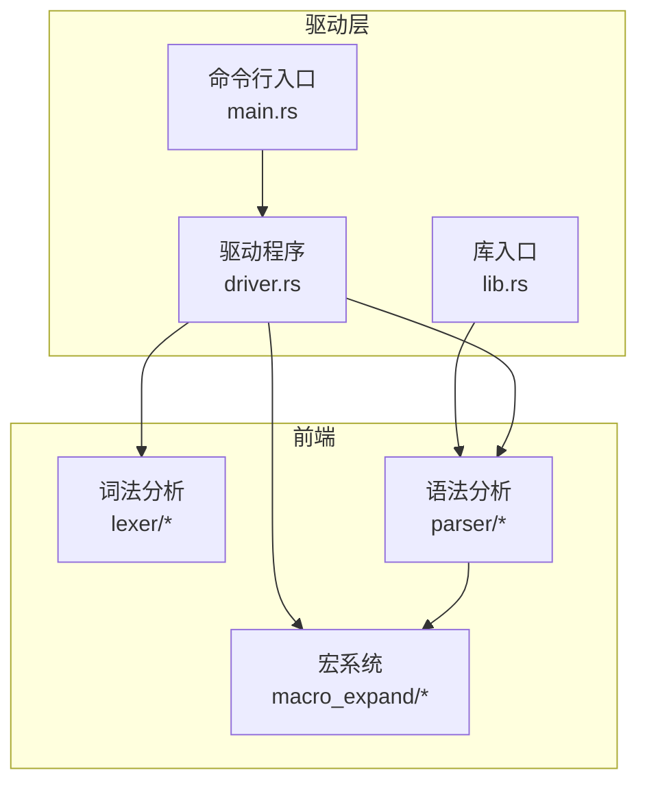
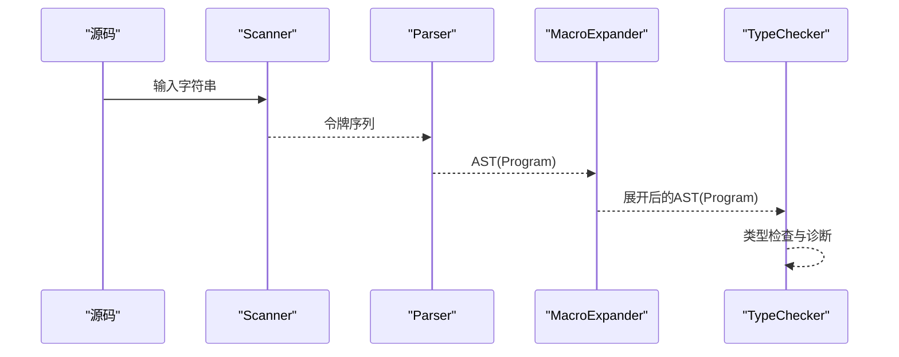
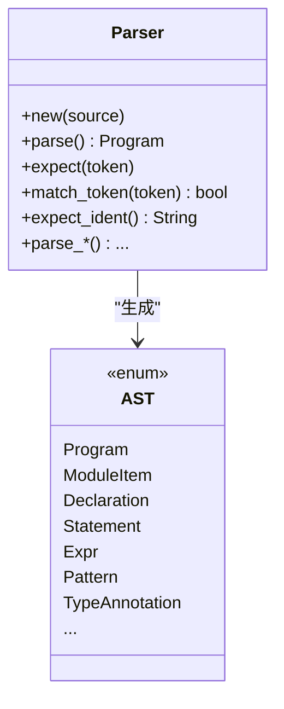
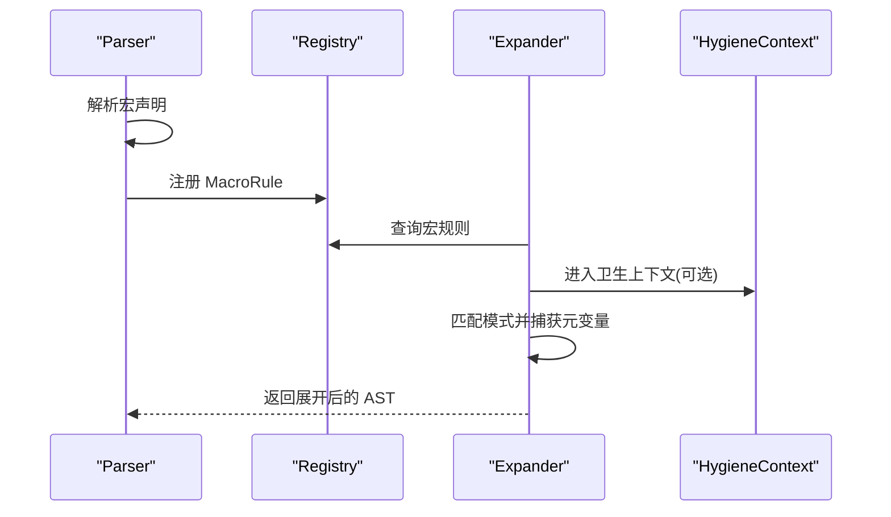
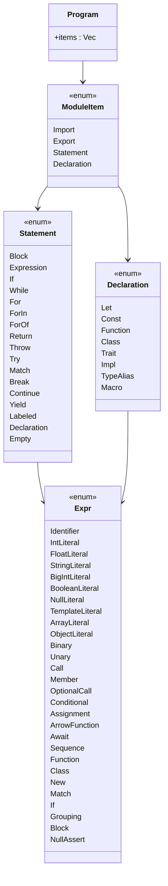
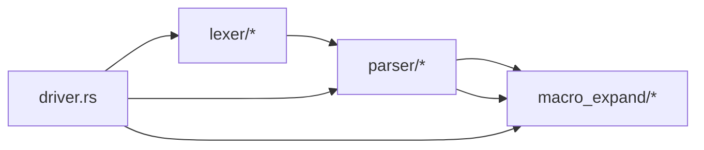

# 编译器前端扩展

<cite>
**本文引用的文件**
- [crates/ruyic/src/lib.rs](file://crates/ruyic/src/lib.rs)
- [crates/ruyic/src/main.rs](file://crates/ruyic/src/main.rs)
- [crates/ruyic/src/driver.rs](file://crates/ruyic/src/driver.rs)
- [crates/ruyic/src/lexer/mod.rs](file://crates/ruyic/src/lexer/mod.rs)
- [crates/ruyic/src/lexer/scanner.rs](file://crates/ruyic/src/lexer/scanner.rs)
- [crates/ruyic/src/lexer/token.rs](file://crates/ruyic/src/lexer/token.rs)
- [crates/ruyic/src/lexer/error.rs](file://crates/ruyic/src/lexer/error.rs)
- [crates/ruyic/src/parser/mod.rs](file://crates/ruyic/src/parser/mod.rs)
- [crates/ruyic/src/parser/ast.rs](file://crates/ruyic/src/parser/ast.rs)
- [crates/ruyic/src/parser/parser.rs](file://crates/ruyic/src/parser/parser.rs)
- [crates/ruyic/src/parser/error.rs](file://crates/ruyic/src/parser/error.rs)
- [crates/ruyic/src/macro_expand/mod.rs](file://crates/ruyic/src/macro_expand/mod.rs)
- [crates/ruyic/src/macro_expand/builtins.rs](file://crates/ruyic/src/macro_expand/builtins.rs)
- [crates/ruyic/src/macro_expand/pattern.rs](file://crates/ruyic/src/macro_expand/pattern.rs)
- [crates/ruyic/src/macro_expand/expand.rs](file://crates/ruyic/src/macro_expand/expand.rs)
</cite>

## 目录
1. [简介](#简介)
2. [项目结构](#项目结构)
3. [核心组件](#核心组件)
4. [架构总览](#架构总览)
5. [详细组件分析](#详细组件分析)
6. [依赖关系分析](#依赖关系分析)
7. [性能考虑](#性能考虑)
8. [故障排查指南](#故障排查指南)
9. [结论](#结论)
10. [附录](#附录)

## 简介
本指南面向希望为 Ruyi 编译器前端（词法分析、语法分析、宏系统与语法树）进行扩展的开发者。文档覆盖以下主题：
- 扩展词法分析器：新增关键字、操作符与字面量
- 扩展语法分析器：新增语法结构与 AST 节点
- 宏系统的扩展：自定义宏定义与展开规则
- 语法树 AST 的设计与实现：节点类型、属性与遍历方法
- 具体示例：新增语言特性（控制结构、表达式类型、声明形式）
- 前端扩展的测试与验证策略

## 项目结构
Ruyi 编译器前端位于 crates/ruyic 模块中，主要由以下子模块组成：
- 词法分析：lexer（扫描器、令牌、错误）
- 语法分析：parser（AST 定义、解析器、错误）
- 宏系统：macro_expand（注册表、内置宏、模式匹配、展开器）
- 驱动与入口：lib.rs、main.rs、driver.rs



图表来源
- [crates/ruyic/src/driver.rs:242-270](file://crates/ruyic/src/driver.rs#L242-L270)
- [crates/ruyic/src/lib.rs:9-20](file://crates/ruyic/src/lib.rs#L9-L20)
- [crates/ruyic/src/main.rs:46-113](file://crates/ruyic/src/main.rs#L46-L113)

章节来源
- [crates/ruyic/src/lib.rs:1-21](file://crates/ruyic/src/lib.rs#L1-L21)
- [crates/ruyic/src/main.rs:1-114](file://crates/ruyic/src/main.rs#L1-L114)
- [crates/ruyic/src/driver.rs:1-120](file://crates/ruyic/src/driver.rs#L1-L120)

## 核心组件
- 词法分析器（Scanner）：从源码流中识别并生成 Token 序列，支持注释、字符串、数字、模板字符串等，并维护位置信息。
- 语法分析器（Parser）：基于 Token 流构建 AST，涵盖声明、语句、表达式、模式与类型注解等。
- 宏系统（MacroExpand）：提供宏注册表、内置宏、模式解析与匹配、展开器，支持自定义宏规则与卫生宏。
- 驱动（Driver）：串联词法、语法、宏展开、类型检查、代码生成的完整流水线。

章节来源
- [crates/ruyic/src/lexer/scanner.rs:1-80](file://crates/ruyic/src/lexer/scanner.rs#L1-L80)
- [crates/ruyic/src/parser/parser.rs:1-80](file://crates/ruyic/src/parser/parser.rs#L1-L80)
- [crates/ruyic/src/macro_expand/mod.rs:107-161](file://crates/ruyic/src/macro_expand/mod.rs#L107-L161)
- [crates/ruyic/src/driver.rs:242-270](file://crates/ruyic/src/driver.rs#L242-L270)

## 架构总览
编译前端的典型流程如下：源码 → 词法分析（Scanner）→ 语法分析（Parser）→ 宏展开（MacroExpander）→ 类型检查（TypeChecker）→ 代码生成（CodeGenerator）。



图表来源
- [crates/ruyic/src/driver.rs:522-566](file://crates/ruyic/src/driver.rs#L522-L566)
- [crates/ruyic/src/lib.rs:12-20](file://crates/ruyic/src/lib.rs#L12-L20)

章节来源
- [crates/ruyic/src/driver.rs:522-632](file://crates/ruyic/src/driver.rs#L522-L632)
- [crates/ruyic/src/lib.rs:12-20](file://crates/ruyic/src/lib.rs#L12-L20)

## 详细组件分析

### 词法分析器扩展指南
目标：向词法分析器添加新的关键字、操作符与字面量。

- 新增关键字
  - 在扫描器中识别标识符后调用关键字解析函数，将识别到的标识符映射为关键字 Token。
  - 参考路径：[扫描器关键字解析:436-486](file://crates/ruyic/src/lexer/scanner.rs#L436-L486)，[关键字枚举:32-101](file://crates/ruyic/src/lexer/token.rs#L32-L101)
  - 步骤要点：
    - 在关键字解析分支中加入新关键字分支
    - 在 Token 枚举中新增对应关键字变体
    - 更新名称描述与 is_keyword 判定逻辑

- 新增操作符
  - 在扫描器主状态机中处理字符，根据后续字符组合判断复合操作符。
  - 参考路径：[操作符分发与复合判断:57-311](file://crates/ruyic/src/lexer/scanner.rs#L57-L311)，[Token 操作符集合:122-223](file://crates/ruyic/src/lexer/token.rs#L122-L223)
  - 步骤要点：
    - 在主 switch 分支中增加新操作符分支
    - 在 Token 中新增对应变体
    - 如需赋值变体，同步添加相应复合赋值操作符

- 新增字面量
  - 数字字面量：在数字扫描逻辑中支持新进制或格式（例如二进制、八进制、十六进制已支持），可扩展为新前缀或格式。
    - 参考路径：[数字扫描与进制处理:488-665](file://crates/ruyic/src/lexer/scanner.rs#L488-L665)，[整数/浮点/大整数 Token:107-121](file://crates/ruyic/src/lexer/token.rs#L107-L121)
  - 字符串与模板字面量：在字符串扫描中处理转义与终止条件。
    - 参考路径：[字符串扫描与转义:667-796](file://crates/ruyic/src/lexer/scanner.rs#L667-L796)，[模板上下文切换:26-71](file://crates/ruyic/src/lexer/scanner.rs#L26-L71)，[模板 Token:115-121](file://crates/ruyic/src/lexer/token.rs#L115-L121)

- 错误处理
  - 对于不合法字符、未闭合字符串/注释、无效转义、非法数字等场景，抛出带行列号的错误。
  - 参考路径：[词法错误类型:9-35](file://crates/ruyic/src/lexer/error.rs#L9-L35)

```mermaid
flowchart TD
Start(["进入 next_token"]) --> WS["跳过空白与注释"]
WS --> EOF{"是否到达文件末尾？"}
EOF --> |是| RetEOF["返回 EOF"]
EOF --> |否| Peek["读取当前字符"]
Peek --> Dispatch{"字符类别"}
Dispatch --> |字母/下划线/美元| Ident["扫描标识符/关键字"]
Dispatch --> |数字| Num["扫描数字字面量"]
Dispatch --> |" 或 '| Str["扫描字符串字面量"]
Dispatch --> |`| Tpl["进入模板上下文"]
Dispatch --> |运算符| Op["复合运算符判定"]
Dispatch --> |其他| Err["返回 InvalidCharacter 错误"]
Ident --> Done["返回 TokenWithLocation"]
Num --> Done
Str --> Done
Tpl --> Done
Op --> Done
Err --> End(["结束"])
Done --> End
RetEOF --> End
```

图表来源
- [crates/ruyic/src/lexer/scanner.rs:25-324](file://crates/ruyic/src/lexer/scanner.rs#L25-L324)
- [crates/ruyic/src/lexer/error.rs:9-35](file://crates/ruyic/src/lexer/error.rs#L9-L35)

章节来源
- [crates/ruyic/src/lexer/scanner.rs:57-311](file://crates/ruyic/src/lexer/scanner.rs#L57-L311)
- [crates/ruyic/src/lexer/token.rs:29-263](file://crates/ruyic/src/lexer/token.rs#L29-L263)
- [crates/ruyic/src/lexer/error.rs:9-35](file://crates/ruyic/src/lexer/error.rs#L9-L35)

### 语法分析器扩展指南
目标：为新增的关键字/操作符/字面量提供解析规则，并在 AST 中体现。

- AST 节点设计
  - 程序、模块项、声明、语句、表达式、类/特征元素、模式、类型注解、导入导出等均以枚举与结构体形式定义。
  - 参考路径：[AST 定义总览:13-533](file://crates/ruyic/src/parser/ast.rs#L13-L533)

- 解析流程扩展
  - 在解析器中新增对应语法结构的解析函数，使用 expect/match_token 等工具函数推进词法指针。
  - 参考路径：[解析器骨架与工具:11-124](file://crates/ruyic/src/parser/parser.rs#L11-L124)，[模块项与声明入口:209-220](file://crates/ruyic/src/parser/parser.rs#L209-L220)

- 示例：新增控制结构/表达式/声明
  - 控制结构：在语句解析中新增分支，参考现有 if/while/for/match 等结构的实现方式。
    - 参考路径：[语句解析入口:798-800](file://crates/ruyic/src/parser/parser.rs#L798-L800)，[if/while/for/match 实现片段:798-196](file://crates/ruyic/src/parser/parser.rs#L798-L196)
  - 表达式：在表达式解析中新增分支，参考二元/一元/成员/调用/箭头函数等。
    - 参考路径：[表达式枚举:179-268](file://crates/ruyic/src/parser/ast.rs#L179-L268)，[表达式解析片段:1-80](file://crates/ruyic/src/parser/parser.rs#L1-L80)
  - 声明：在声明解析中新增分支，参考 let/const/fn/class/trait/impl/type/macro 等。
    - 参考路径：[声明入口:388-400](file://crates/ruyic/src/parser/parser.rs#L388-L400)，[宏声明解析:558-573](file://crates/ruyic/src/parser/parser.rs#L558-L573)

- 错误处理
  - 使用解析器提供的错误构造函数，携带位置信息。
  - 参考路径：[解析错误类型:9-38](file://crates/ruyic/src/parser/error.rs#L9-L38)，[常见错误构造:171-186](file://crates/ruyic/src/parser/parser.rs#L171-L186)



图表来源
- [crates/ruyic/src/parser/parser.rs:11-124](file://crates/ruyic/src/parser/parser.rs#L11-L124)
- [crates/ruyic/src/parser/ast.rs:13-533](file://crates/ruyic/src/parser/ast.rs#L13-L533)

章节来源
- [crates/ruyic/src/parser/ast.rs:13-533](file://crates/ruyic/src/parser/ast.rs#L13-L533)
- [crates/ruyic/src/parser/parser.rs:11-124](file://crates/ruyic/src/parser/parser.rs#L11-L124)
- [crates/ruyic/src/parser/error.rs:9-38](file://crates/ruyic/src/parser/error.rs#L9-L38)

### 宏系统扩展指南
目标：定义自定义宏并编写展开规则；理解内置宏与模式匹配机制。

- 宏注册与内置宏
  - 注册表包含用户自定义宏与内置宏两部分，支持按名称查询与调用。
  - 参考路径：[宏注册表结构:107-146](file://crates/ruyic/src/macro_expand/mod.rs#L107-L146)，[内置宏注册:5-59](file://crates/ruyic/src/macro_expand/builtins.rs#L5-L59)

- 自定义宏定义
  - 在源码中通过声明语法定义宏及其规则，规则由“模式 Token 序列”和“展开体 Token 序列”组成。
  - 参考路径：[宏声明解析:558-573](file://crates/ruyic/src/parser/parser.rs#L558-L573)，[宏规则 AST:422-426](file://crates/ruyic/src/parser/ast.rs#L422-L426)

- 模式匹配与展开
  - 模式解析器将规则中的模式转换为内部表示，支持元变量、重复与可选结构。
  - 展开器递归遍历 AST，在表达式/语句处尝试匹配并替换。
  - 参考路径：[模式解析:386-524](file://crates/ruyic/src/macro_expand/pattern.rs#L386-L524)，[展开器:14-34](file://crates/ruyic/src/macro_expand/expand.rs#L14-L34)

- 卫生宏与上下文
  - 展开时可选择卫生上下文，避免捕获自由变量。
  - 参考路径：[展开器上下文:8-21](file://crates/ruyic/src/macro_expand/expand.rs#L8-L21)



图表来源
- [crates/ruyic/src/macro_expand/mod.rs:157-161](file://crates/ruyic/src/macro_expand/mod.rs#L157-L161)
- [crates/ruyic/src/macro_expand/expand.rs:14-34](file://crates/ruyic/src/macro_expand/expand.rs#L14-L34)
- [crates/ruyic/src/macro_expand/pattern.rs:108-132](file://crates/ruyic/src/macro_expand/pattern.rs#L108-L132)

章节来源
- [crates/ruyic/src/macro_expand/mod.rs:107-161](file://crates/ruyic/src/macro_expand/mod.rs#L107-L161)
- [crates/ruyic/src/macro_expand/builtins.rs:5-59](file://crates/ruyic/src/macro_expand/builtins.rs#L5-L59)
- [crates/ruyic/src/macro_expand/pattern.rs:386-524](file://crates/ruyic/src/macro_expand/pattern.rs#L386-L524)
- [crates/ruyic/src/macro_expand/expand.rs:14-34](file://crates/ruyic/src/macro_expand/expand.rs#L14-L34)

### 语法树 AST 设计与遍历
- AST 节点类型
  - 程序 Program、模块项 ModuleItem、声明 Declaration、语句 Statement、表达式 Expr、模式 Pattern、类型注解 TypeAnnotation、导入导出 Import/Export、类/特征元素 Class/Trait Element 等。
  - 参考路径：[AST 定义:13-533](file://crates/ruyic/src/parser/ast.rs#L13-L533)

- 属性与复杂度
  - 大多数节点采用结构体或枚举组合，便于模式匹配与递归遍历。
  - 复杂度方面，遍历通常与节点数量线性相关；深度受限于语言结构与宏展开深度上限。

- 遍历方法
  - 递归遍历：对嵌套的表达式、语句、参数列表等逐层深入。
  - 参考路径：[展开器对 AST 的递归展开:23-34](file://crates/ruyic/src/macro_expand/expand.rs#L23-L34)



图表来源
- [crates/ruyic/src/parser/ast.rs:13-533](file://crates/ruyic/src/parser/ast.rs#L13-L533)

章节来源
- [crates/ruyic/src/parser/ast.rs:13-533](file://crates/ruyic/src/parser/ast.rs#L13-L533)
- [crates/ruyic/src/macro_expand/expand.rs:23-34](file://crates/ruyic/src/macro_expand/expand.rs#L23-L34)

### 具体示例：添加新的语言特性
以下示例展示如何为前端扩展添加新的语言特性（以“控制结构/表达式/声明”为例）。请结合上述章节的路径定位到具体实现位置进行修改。

- 新增控制结构
  - 在 AST 中新增语句变体（如 labeled、loop 等），并在解析器中添加对应的解析函数。
  - 参考路径：[语句枚举:94-155](file://crates/ruyic/src/parser/ast.rs#L94-L155)，[语句解析入口:798-800](file://crates/ruyic/src/parser/parser.rs#L798-L800)

- 新增表达式类型
  - 在 Expr 枚举中新增变体（如新的运算或语法节点），并在解析器中添加解析逻辑。
  - 参考路径：[表达式枚举:179-268](file://crates/ruyic/src/parser/ast.rs#L179-L268)，[表达式解析片段:1-80](file://crates/ruyic/src/parser/parser.rs#L1-L80)

- 新增声明形式
  - 在 Declaration 枚举中新增变体（如新的特性/注解/声明），并在解析器中添加解析逻辑。
  - 参考路径：[声明枚举:28-69](file://crates/ruyic/src/parser/ast.rs#L28-L69)，[声明入口:388-400](file://crates/ruyic/src/parser/parser.rs#L388-L400)

- 新增关键字/操作符/字面量
  - 在词法分析器中添加识别与 Token 定义，并在解析器中消费这些 Token。
  - 参考路径：[关键字解析:436-486](file://crates/ruyic/src/lexer/scanner.rs#L436-L486)，[Token 枚举:29-263](file://crates/ruyic/src/lexer/token.rs#L29-L263)

章节来源
- [crates/ruyic/src/parser/ast.rs:94-268](file://crates/ruyic/src/parser/ast.rs#L94-L268)
- [crates/ruyic/src/parser/parser.rs:1-80](file://crates/ruyic/src/parser/parser.rs#L1-L80)
- [crates/ruyic/src/lexer/scanner.rs:436-486](file://crates/ruyic/src/lexer/scanner.rs#L436-L486)
- [crates/ruyic/src/lexer/token.rs:29-263](file://crates/ruyic/src/lexer/token.rs#L29-L263)

### 前端扩展的测试与验证策略
- 语法测试
  - 使用集成测试框架，编写 .ry 源文件与期望输出（如 AST、类型化 AST、LLVM IR），通过驱动程序运行并断言结果。
  - 参考路径：[集成测试目录与用例](file://crates/ruyic/tests/integration/)，[驱动编译选项与输出:87-147](file://crates/ruyic/src/driver.rs#L87-L147)

- 语义分析测试
  - 通过 --check 模式仅执行类型检查，验证类型推断、泛型约束、模式匹配等。
  - 参考路径：[类型检查入口:635-641](file://crates/ruyic/src/driver.rs#L635-L641)

- 词法/语法错误测试
  - 针对非法字符、未闭合字符串/注释、非法数字、语法错误等场景，断言错误消息与位置信息。
  - 参考路径：[词法错误类型:9-35](file://crates/ruyic/src/lexer/error.rs#L9-L35)，[解析错误类型:9-38](file://crates/ruyic/src/parser/error.rs#L9-L38)

- 宏测试
  - 编写宏定义与调用的测试用例，验证模式匹配、重复展开、卫生宏行为。
  - 参考路径：[宏规则与注册:157-161](file://crates/ruyic/src/macro_expand/mod.rs#L157-L161)，[内置宏:5-59](file://crates/ruyic/src/macro_expand/builtins.rs#L5-L59)

章节来源
- [crates/ruyic/src/driver.rs:87-147](file://crates/ruyic/src/driver.rs#L87-L147)
- [crates/ruyic/src/driver.rs:635-641](file://crates/ruyic/src/driver.rs#L635-L641)
- [crates/ruyic/src/lexer/error.rs:9-35](file://crates/ruyic/src/lexer/error.rs#L9-L35)
- [crates/ruyic/src/parser/error.rs:9-38](file://crates/ruyic/src/parser/error.rs#L9-L38)
- [crates/ruyic/src/macro_expand/mod.rs:157-161](file://crates/ruyic/src/macro_expand/mod.rs#L157-L161)
- [crates/ruyic/src/macro_expand/builtins.rs:5-59](file://crates/ruyic/src/macro_expand/builtins.rs#L5-L59)

## 依赖关系分析
- 组件耦合
  - Parser 依赖 Lexer 提供的 Token 流；MacroExpander 依赖 Parser 的 AST 结构与 Token 枚举；Driver 协调各阶段并统一错误类型。
- 外部依赖
  - 驱动层使用 inkwell 生成 LLVM IR；类型检查器提供诊断与环境；运行时库参与链接与运行时行为。



图表来源
- [crates/ruyic/src/driver.rs:13-20](file://crates/ruyic/src/driver.rs#L13-L20)
- [crates/ruyic/src/lib.rs:9-20](file://crates/ruyic/src/lib.rs#L9-L20)

章节来源
- [crates/ruyic/src/driver.rs:13-20](file://crates/ruyic/src/driver.rs#L13-L20)
- [crates/ruyic/src/lib.rs:9-20](file://crates/ruyic/src/lib.rs#L9-L20)

## 性能考虑
- 词法分析
  - 单次扫描线性时间复杂度；注意避免不必要的字符串复制与错误回溯。
- 语法分析
  - 递归下降解析通常线性于 Token 数量；合理组织 expect/match_token 可减少回溯成本。
- 宏展开
  - 展开深度受 MAX_EXPANSION_DEPTH 限制；复杂模式匹配可能带来额外开销，建议优化重复与可选结构的匹配顺序。
- 类型检查
  - 类型推断与约束求解可能成为瓶颈，建议在扩展时保持 AST 的简洁与明确性。

## 故障排查指南
- 常见问题
  - 词法错误：非法字符、未闭合字符串/注释、无效转义、非法数字。
  - 语法错误：缺少分隔符、括号不匹配、关键字误用。
  - 宏错误：无匹配规则、重复不匹配、展开深度超限、卫生违规、嵌套宏定义。
- 排查步骤
  - 启用 --emit-ast/--emit-typed-ast 查看中间表示，定位问题范围。
  - 使用 --check 模式验证类型检查阶段的诊断信息。
  - 在驱动层捕获并打印 CompileError，区分词法、语法、宏、类型检查等不同阶段的错误来源。
- 参考路径
  - [驱动错误类型与转换:21-84](file://crates/ruyic/src/driver.rs#L21-L84)
  - [词法错误类型:9-35](file://crates/ruyic/src/lexer/error.rs#L9-L35)
  - [解析错误类型:9-38](file://crates/ruyic/src/parser/error.rs#L9-L38)
  - [宏错误类型:12-38](file://crates/ruyic/src/macro_expand/mod.rs#L12-L38)

章节来源
- [crates/ruyic/src/driver.rs:21-84](file://crates/ruyic/src/driver.rs#L21-L84)
- [crates/ruyic/src/lexer/error.rs:9-35](file://crates/ruyic/src/lexer/error.rs#L9-L35)
- [crates/ruyic/src/parser/error.rs:9-38](file://crates/ruyic/src/parser/error.rs#L9-L38)
- [crates/ruyic/src/macro_expand/mod.rs:12-38](file://crates/ruyic/src/macro_expand/mod.rs#L12-L38)

## 结论
通过以上指南，开发者可以系统地扩展 Ruyi 编译器前端：在词法层添加新关键字/操作符/字面量，在语法层定义新的 AST 节点与解析规则，在宏系统中编写自定义规则并进行卫生展开。配合完善的测试与验证策略，能够确保扩展的正确性与稳定性。

## 附录
- 快速定位参考
  - 词法：[scanner.rs:25-324](file://crates/ruyic/src/lexer/scanner.rs#L25-L324)，[token.rs:29-263](file://crates/ruyic/src/lexer/token.rs#L29-L263)
  - 语法：[parser.rs:11-124](file://crates/ruyic/src/parser/parser.rs#L11-L124)，[ast.rs:13-533](file://crates/ruyic/src/parser/ast.rs#L13-L533)
  - 宏：[mod.rs:107-161](file://crates/ruyic/src/macro_expand/mod.rs#L107-L161)，[builtins.rs:5-59](file://crates/ruyic/src/macro_expand/builtins.rs#L5-L59)，[pattern.rs:386-524](file://crates/ruyic/src/macro_expand/pattern.rs#L386-L524)，[expand.rs:14-34](file://crates/ruyic/src/macro_expand/expand.rs#L14-L34)
  - 驱动：[driver.rs:242-270](file://crates/ruyic/src/driver.rs#L242-L270)，[lib.rs:12-20](file://crates/ruyic/src/lib.rs#L12-L20)，[main.rs:46-113](file://crates/ruyic/src/main.rs#L46-L113)