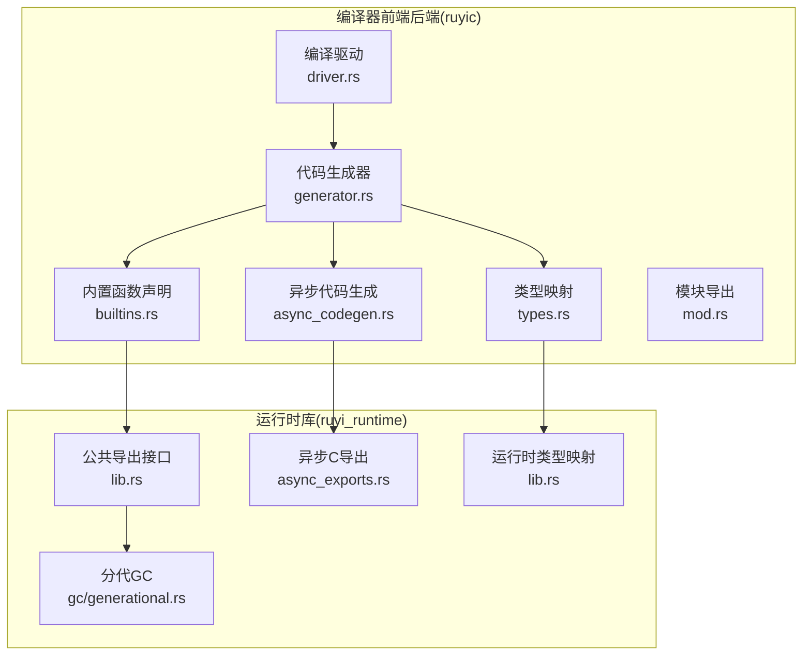
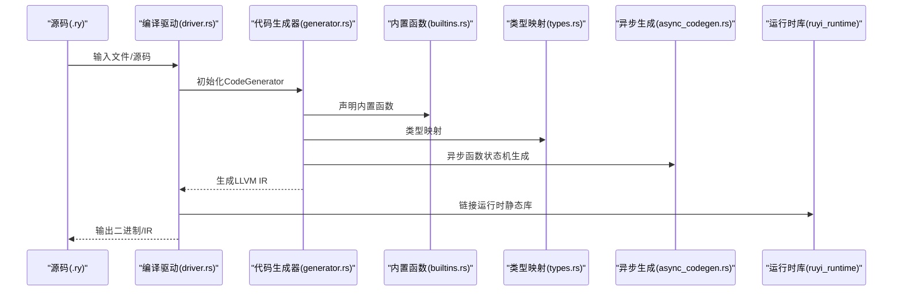
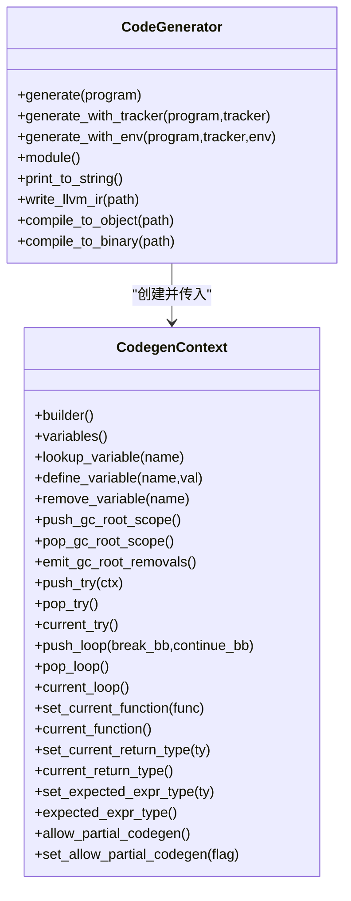
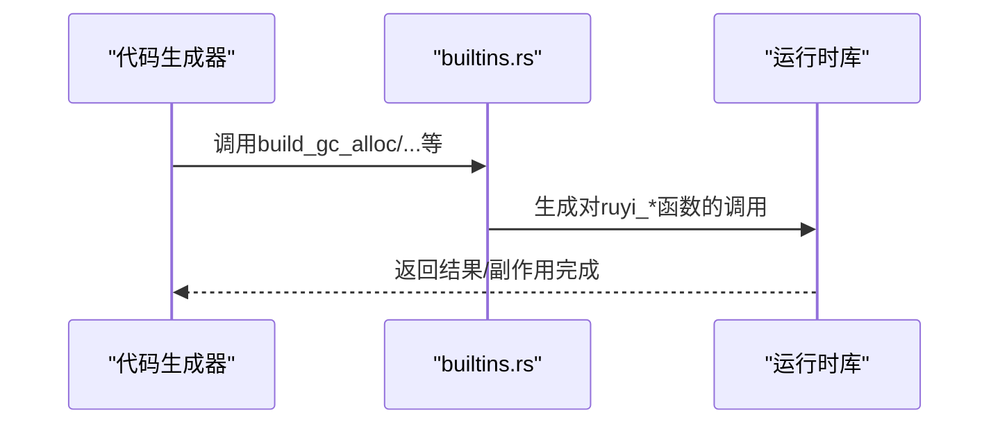
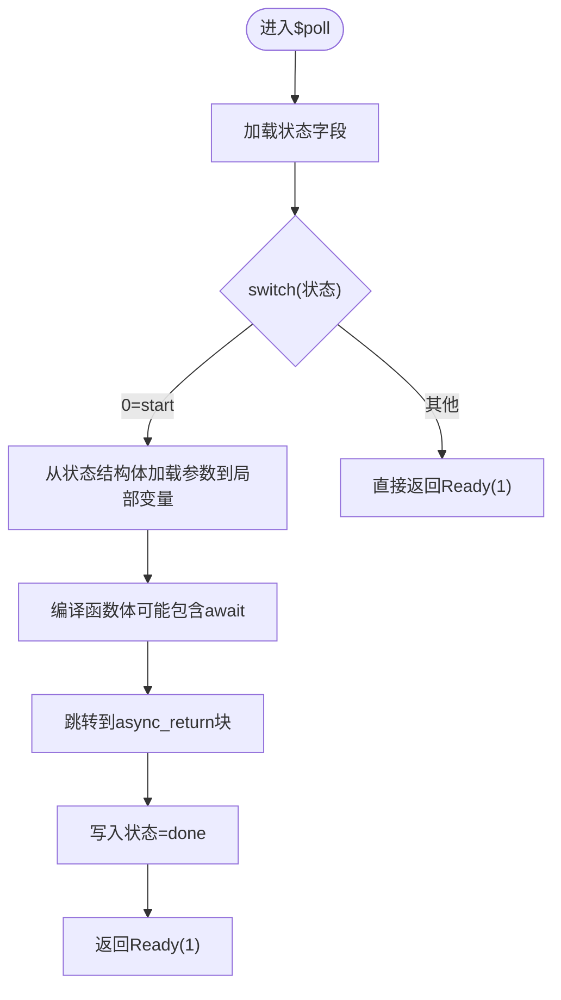
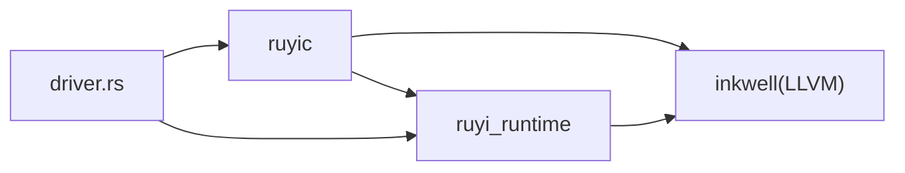

# 编译器后端扩展

<cite>
**本文档引用的文件**
- [crates/ruyic/src/codegen/mod.rs](file://crates/ruyic/src/codegen/mod.rs)
- [crates/ruyic/src/codegen/generator.rs](file://crates/ruyic/src/codegen/generator.rs)
- [crates/ruyic/src/codegen/builtins.rs](file://crates/ruyic/src/codegen/builtins.rs)
- [crates/ruyic/src/codegen/async_codegen.rs](file://crates/ruyic/src/codegen/async_codegen.rs)
- [crates/ruyic/src/codegen/types.rs](file://crates/ruyic/src/codegen/types.rs)
- [crates/ruyic/src/driver.rs](file://crates/ruyic/src/driver.rs)
- [crates/ruyi_runtime/src/lib.rs](file://crates/ruyi_runtime/src/lib.rs)
- [crates/ruyi_runtime/src/gc/generational.rs](file://crates/ruyi_runtime/src/gc/generational.rs)
- [crates/ruyi_runtime/src/async_exports.rs](file://crates/ruyi_runtime/src/async_exports.rs)
- [crates/ruyi_runtime/Cargo.toml](file://crates/ruyi_runtime/Cargo.toml)
- [crates/ruyic/tests/integration/cases/async/async_basic.ry](file://crates/ruyic/tests/integration/cases/async/async_basic.ry)
- [crates/ruyic/tests/integration/cases/codegen/async_basic.ry](file://crates/ruyic/tests/integration/cases/codegen/async_basic.ry)
</cite>

## 目录
1. [简介](#简介)
2. [项目结构](#项目结构)
3. [核心组件](#核心组件)
4. [架构总览](#架构总览)
5. [详细组件分析](#详细组件分析)
6. [依赖关系分析](#依赖关系分析)
7. [性能考虑](#性能考虑)
8. [故障排除指南](#故障排除指南)
9. [结论](#结论)
10. [附录](#附录)

## 简介
本指南面向需要为 Ruyi 编译器后端进行扩展的开发者，系统讲解如何在现有代码生成与运行时框架上进行扩展，涵盖以下主题：
- 扩展 LLVM IR 生成器：新增 IR 指令、优化 Pass 集成、目标平台支持
- 扩展运行时支持：新增内置函数、运行时库扩展、垃圾回收器集成
- 异步代码生成扩展：新增异步指令与调度器支持
- 目标代码生成扩展：新增目标架构支持、ABI 约定与链接器集成
- 提供具体示例路径，展示如何添加新的运行时功能（如新的内存管理策略或并发原语）
- 后端扩展的测试与验证策略（IR 验证与目标代码测试）

## 项目结构
Ruyi 的后端由两部分组成：
- 编译器前端后端（crates/ruyic）：负责词法/语法/类型检查后的代码生成，使用 Inkwell 构建 LLVM IR，并输出可执行文件或中间表示
- 运行时库（crates/ruyi_runtime）：提供运行时函数、GC、异常处理、异步调度等能力

**图表来源**
- [crates/ruyic/src/codegen/generator.rs](file://crates/ruyic/src/codegen/generator.rs)
- [crates/ruyic/src/codegen/builtins.rs](file://crates/ruyic/src/codegen/builtins.rs)
- [crates/ruyic/src/codegen/types.rs](file://crates/ruyic/src/codegen/types.rs)
- [crates/ruyic/src/codegen/async_codegen.rs](file://crates/ruyic/src/codegen/async_codegen.rs)
- [crates/ruyic/src/codegen/mod.rs](file://crates/ruyic/src/codegen/mod.rs)
- [crates/ruyic/src/driver.rs](file://crates/ruyic/src/driver.rs)
- [crates/ruyi_runtime/src/lib.rs](file://crates/ruyi_runtime/src/lib.rs)
- [crates/ruyi_runtime/src/gc/generational.rs](file://crates/ruyi_runtime/src/gc/generational.rs)
- [crates/ruyi_runtime/src/async_exports.rs](file://crates/ruyi_runtime/src/async_exports.rs)

**章节来源**
- [crates/ruyic/src/codegen/mod.rs](file://crates/ruyic/src/codegen/mod.rs)
- [crates/ruyic/src/codegen/generator.rs](file://crates/ruyic/src/codegen/generator.rs)
- [crates/ruyic/src/codegen/builtins.rs](file://crates/ruyic/src/codegen/builtins.rs)
- [crates/ruyic/src/codegen/async_codegen.rs](file://crates/ruyic/src/codegen/async_codegen.rs)
- [crates/ruyic/src/codegen/types.rs](file://crates/ruyic/src/codegen/types.rs)
- [crates/ruyic/src/driver.rs](file://crates/ruyic/src/driver.rs)
- [crates/ruyi_runtime/src/lib.rs](file://crates/ruyi_runtime/src/lib.rs)
- [crates/ruyi_runtime/src/gc/generational.rs](file://crates/ruyi_runtime/src/gc/generational.rs)
- [crates/ruyi_runtime/src/async_exports.rs](file://crates/ruyi_runtime/src/async_exports.rs)

## 核心组件
- 代码生成器（CodeGenerator/CodegenContext）：负责从类型化 AST 生成 LLVM IR，管理变量、循环、异常、GC 根、异步状态机等上下文
- 内置函数声明（builtins.rs）：集中声明运行时函数（打印、GC、异常、字符串、数组、集合、异步等），并在 IR 中以函数调用形式出现
- 类型映射（types.rs）：将 Ruyi 类型系统映射到 LLVM 基元类型，支持动态类型、对象、数组、函数、未来值等
- 异步代码生成（async_codegen.rs）：将 async 函数编译为状态机，生成构造函数、轮询函数与包装器，并通过运行时导出的异步 API 驱动
- 编译驱动（driver.rs）：组织完整流水线（解析→宏展开→类型检查→代码生成→链接），并负责运行时库构建与链接

**章节来源**
- [crates/ruyic/src/codegen/generator.rs](file://crates/ruyic/src/codegen/generator.rs)
- [crates/ruyic/src/codegen/builtins.rs](file://crates/ruyic/src/codegen/builtins.rs)
- [crates/ruyic/src/codegen/types.rs](file://crates/ruyic/src/codegen/types.rs)
- [crates/ruyic/src/codegen/async_codegen.rs](file://crates/ruyic/src/codegen/async_codegen.rs)
- [crates/ruyic/src/driver.rs](file://crates/ruyic/src/driver.rs)

## 架构总览
下图展示了从源码到可执行文件的关键流程，以及后端扩展点：

**图表来源**
- [crates/ruyic/src/driver.rs](file://crates/ruyic/src/driver.rs)
- [crates/ruyic/src/codegen/generator.rs](file://crates/ruyic/src/codegen/generator.rs)
- [crates/ruyic/src/codegen/builtins.rs](file://crates/ruyic/src/codegen/builtins.rs)
- [crates/ruyic/src/codegen/types.rs](file://crates/ruyic/src/codegen/types.rs)
- [crates/ruyic/src/codegen/async_codegen.rs](file://crates/ruyic/src/codegen/async_codegen.rs)
- [crates/ruyi_runtime/Cargo.toml](file://crates/ruyi_runtime/Cargo.toml)

## 详细组件分析

### 代码生成器与上下文（CodeGenerator/CodegenContext）
- 职责：创建 LLVM Module/Builder；遍历 AST 并生成 IR；维护变量表、循环栈、异常栈、GC 根作用域、异步状态字段与返回块、waker 指针等
- 关键扩展点：
  - 新增变量/作用域：add_gc_root/push_gc_root_scope/pop_gc_root_scope
  - 异步上下文：async_state_field_ptr/async_result_ptr/async_return_bb/waker_ptr
  - 异常上下文：try_stack/push_try/push_try/push_try
  - 类型环境：lookup_variable/define_variable/remove_variable
- 生成主流程：预声明类结构体与方法签名→声明内置函数→生成泛型单态化函数→编译模块项→生成 main 入口→根据是否 async main 调度运行时调度器

**图表来源**
- [crates/ruyic/src/codegen/generator.rs](file://crates/ruyic/src/codegen/generator.rs)

**章节来源**
- [crates/ruyic/src/codegen/generator.rs](file://crates/ruyic/src/codegen/generator.rs)

### 内置函数声明与运行时调用（builtins.rs）
- 职责：集中声明运行时函数（GC、异常、字符串、数组/集合、异步、数学运算等），并在表达式/语句生成中调用
- 扩展方式：
  - 在 declare_builtins 中新增函数声明
  - 在对应位置实现 build_* 调用封装（如 build_gc_alloc/build_ruyi_async_poll）
  - 在运行时库中实现对应的 C 导出函数（extern "C"）
- 示例路径：
  - [crates/ruyic/src/codegen/builtins.rs](file://crates/ruyic/src/codegen/builtins.rs)
  - [crates/ruyi_runtime/src/async_exports.rs](file://crates/ruyi_runtime/src/async_exports.rs)

**图表来源**
- [crates/ruyic/src/codegen/builtins.rs](file://crates/ruyic/src/codegen/builtins.rs)
- [crates/ruyi_runtime/src/async_exports.rs](file://crates/ruyi_runtime/src/async_exports.rs)

**章节来源**
- [crates/ruyic/src/codegen/builtins.rs](file://crates/ruyic/src/codegen/builtins.rs)
- [crates/ruyi_runtime/src/async_exports.rs](file://crates/ruyi_runtime/src/async_exports.rs)

### 异步代码生成（async_codegen.rs）
- 职责：统计 await 数量→生成状态机（构造函数$new、轮询函数$poll、包装器函数）→在 await 表达式处插入轮询与结果加载
- 关键扩展点：
  - 在 $poll 中设置/读取状态字段与结果字段
  - 使用 waker 指针与运行时 ruyi_async_poll
  - 在同步上下文中回退到 ruyi_await
- 示例路径：
  - [crates/ruyic/src/codegen/async_codegen.rs](file://crates/ruyic/src/codegen/async_codegen.rs)
  - [crates/ruyi_runtime/src/async_exports.rs](file://crates/ruyi_runtime/src/async_exports.rs)

**图表来源**
- [crates/ruyic/src/codegen/async_codegen.rs](file://crates/ruyic/src/codegen/async_codegen.rs)

**章节来源**
- [crates/ruyic/src/codegen/async_codegen.rs](file://crates/ruyic/src/codegen/async_codegen.rs)
- [crates/ruyi_runtime/src/async_exports.rs](file://crates/ruyi_runtime/src/async_exports.rs)

### 类型映射（types.rs）
- 职责：将 Ruyi 类型系统映射到 LLVM 基元类型，支持整数、浮点、布尔、字符串、空、动态、对象、数组、函数、未来值、错误等
- 扩展方式：在 ruyi_type_to_llvm/function_type_from_ruyi 中增加新类型的映射规则
- 示例路径：
  - [crates/ruyic/src/codegen/types.rs](file://crates/ruyic/src/codegen/types.rs)

**章节来源**
- [crates/ruyic/src/codegen/types.rs](file://crates/ruyic/src/codegen/types.rs)

### 编译驱动（driver.rs）
- 职责：组织完整编译流水线，自动加载 stdlib，解析导入，类型检查，生成 LLVM IR，链接运行时库，输出二进制或 IR
- 关键扩展点：
  - 目标三元组与优化级别配置
  - 自动构建运行时库（确保链接成功）
  - 支持 EmitType（二进制/IR/Ast/TypedAst/Check）
- 示例路径：
  - [crates/ruyic/src/driver.rs](file://crates/ruyic/src/driver.rs)
  - [crates/ruyi_runtime/Cargo.toml](file://crates/ruyi_runtime/Cargo.toml)

**章节来源**
- [crates/ruyic/src/driver.rs](file://crates/ruyic/src/driver.rs)
- [crates/ruyi_runtime/Cargo.toml](file://crates/ruyi_runtime/Cargo.toml)

### 运行时库（ruyi_runtime）
- 职责：提供 GC（分代）、异步调度器、异常处理、内置函数（数组/字符串/集合等）、C 导出接口
- 分代 GC（generational.rs）：年轻代复制收集、老年代标记压缩、写屏障与记忆集、异步根注册
- 异步 C 导出（async_exports.rs）：ruyi_async_poll/ruyi_spawn/ruyi_wake_task/ruyi_run_scheduler
- 公共导出（lib.rs）：统一 re-export 运行时能力
- 示例路径：
  - [crates/ruyi_runtime/src/gc/generational.rs](file://crates/ruyi_runtime/src/gc/generational.rs)
  - [crates/ruyi_runtime/src/async_exports.rs](file://crates/ruyi_runtime/src/async_exports.rs)
  - [crates/ruyi_runtime/src/lib.rs](file://crates/ruyi_runtime/src/lib.rs)

**章节来源**
- [crates/ruyi_runtime/src/gc/generational.rs](file://crates/ruyi_runtime/src/gc/generational.rs)
- [crates/ruyi_runtime/src/async_exports.rs](file://crates/ruyi_runtime/src/async_exports.rs)
- [crates/ruyi_runtime/src/lib.rs](file://crates/ruyi_runtime/src/lib.rs)

## 依赖关系分析
- ruyic 依赖 ruyi_runtime 的运行时导出（GC、异步、内置函数）
- ruyic 通过 Inkwell 生成 LLVM IR，再由 driver 驱动链接器输出二进制
- ruyi_runtime 可选启用 inkwell 特性用于类型映射工具

**图表来源**
- [crates/ruyic/src/driver.rs](file://crates/ruyic/src/driver.rs)
- [crates/ruyi_runtime/Cargo.toml](file://crates/ruyi_runtime/Cargo.toml)

**章节来源**
- [crates/ruyic/src/driver.rs](file://crates/ruyic/src/driver.rs)
- [crates/ruyi_runtime/Cargo.toml](file://crates/ruyi_runtime/Cargo.toml)

## 性能考虑
- 优化级别：通过 OptLevel 控制（O0/O1/O2），影响生成 IR 的优化程度与编译时间
- GC 开销：合理使用 add_gc_root/remove_gc_root，避免过多 GC 根导致扫描开销
- 异步调度：使用 ruyi_run_scheduler 驱动事件循环，减少阻塞；在 $poll 中尽量短路返回 Ready
- 链接器：默认链接运行时静态库与系统 C++/C 库，确保运行时符号可用

[本节不直接分析具体文件，无需“章节来源”]

## 故障排除指南
- 类型检查失败：driver 将类型诊断输出到错误流，检查类型推断与泛型约束
- 代码生成错误：generator.generate_with_env 返回错误信息，检查 AST 与类型环境
- 链接失败：driver 确保 ruyi_runtime 构建成功后再链接，若失败检查 Cargo 工作区与库路径
- 异步未生效：确认 main 是否为 async，以及是否调用了 ruyi_run_scheduler

**章节来源**
- [crates/ruyic/src/driver.rs](file://crates/ruyic/src/driver.rs)
- [crates/ruyic/src/codegen/generator.rs](file://crates/ruyic/src/codegen/generator.rs)

## 结论
通过以上组件与扩展点，开发者可以：
- 在 builtins.rs 中声明新运行时函数，在运行时库中实现对应 C 导出
- 在 types.rs 中扩展类型映射，支撑新的语言特性
- 在 async_codegen.rs 中扩展异步状态机与调度器交互
- 在 driver.rs 中调整目标三元组与优化级别，适配不同平台
- 利用现有 GC 与异步根机制，安全地集成新的并发原语与内存管理策略

[本节不直接分析具体文件，无需“章节来源”]

## 附录

### 如何添加新的运行时内置函数（示例路径）
- 在编译器侧声明与调用：
  - 在 [crates/ruyic/src/codegen/builtins.rs](file://crates/ruyic/src/codegen/builtins.rs) 中：
    - 添加函数声明（declare_*）
    - 添加 build_* 调用封装
- 在运行时库侧实现：
  - 在 [crates/ruyi_runtime/src/async_exports.rs](file://crates/ruyi_runtime/src/async_exports.rs) 或相应模块中实现 extern "C" 导出
- 在 driver 链接阶段确保运行时库存在：
  - [crates/ruyic/src/driver.rs](file://crates/ruyic/src/driver.rs) 中会自动构建并链接 ruyi_runtime

**章节来源**
- [crates/ruyic/src/codegen/builtins.rs](file://crates/ruyic/src/codegen/builtins.rs)
- [crates/ruyi_runtime/src/async_exports.rs](file://crates/ruyi_runtime/src/async_exports.rs)
- [crates/ruyic/src/driver.rs](file://crates/ruyic/src/driver.rs)

### 如何扩展异步指令与调度器（示例路径）
- 在 async_codegen.rs 中：
  - 修改 $poll 状态机逻辑，新增状态分支与结果写入
  - 在 await 表达式处调用 ruyi_async_poll/ruyi_await
- 在运行时库中：
  - 实现 ruyi_async_poll/ruyi_spawn/ruyi_wake_task/ruyi_run_scheduler
  - 参考 [crates/ruyi_runtime/src/async_exports.rs](file://crates/ruyi_runtime/src/async_exports.rs)

**章节来源**
- [crates/ruyic/src/codegen/async_codegen.rs](file://crates/ruyic/src/codegen/async_codegen.rs)
- [crates/ruyi_runtime/src/async_exports.rs](file://crates/ruyi_runtime/src/async_exports.rs)

### 如何扩展目标平台与链接（示例路径）
- 在 driver 中设置目标三元组与优化级别：
  - [crates/ruyic/src/driver.rs](file://crates/ruyic/src/driver.rs)
- 运行时库类型为 staticlib/rlib，便于链接：
  - [crates/ruyi_runtime/Cargo.toml](file://crates/ruyi_runtime/Cargo.toml)

**章节来源**
- [crates/ruyic/src/driver.rs](file://crates/ruyic/src/driver.rs)
- [crates/ruyi_runtime/Cargo.toml](file://crates/ruyi_runtime/Cargo.toml)

### 测试与验证示例（示例路径）
- 异步基础用例：
  - [crates/ruyic/tests/integration/cases/async/async_basic.ry](file://crates/ruyic/tests/integration/cases/async/async_basic.ry)
  - [crates/ruyic/tests/integration/cases/codegen/async_basic.ry](file://crates/ruyic/tests/integration/cases/codegen/async_basic.ry)
- 运行时测试参考：
  - [crates/ruyi_runtime/src/gc/generational.rs](file://crates/ruyi_runtime/src/gc/generational.rs)
  - [crates/ruyi_runtime/src/async_exports.rs](file://crates/ruyi_runtime/src/async_exports.rs)

**章节来源**
- [crates/ruyic/tests/integration/cases/async/async_basic.ry](file://crates/ruyic/tests/integration/cases/async/async_basic.ry)
- [crates/ruyic/tests/integration/cases/codegen/async_basic.ry](file://crates/ruyic/tests/integration/cases/codegen/async_basic.ry)
- [crates/ruyi_runtime/src/gc/generational.rs](file://crates/ruyi_runtime/src/gc/generational.rs)
- [crates/ruyi_runtime/src/async_exports.rs](file://crates/ruyi_runtime/src/async_exports.rs)