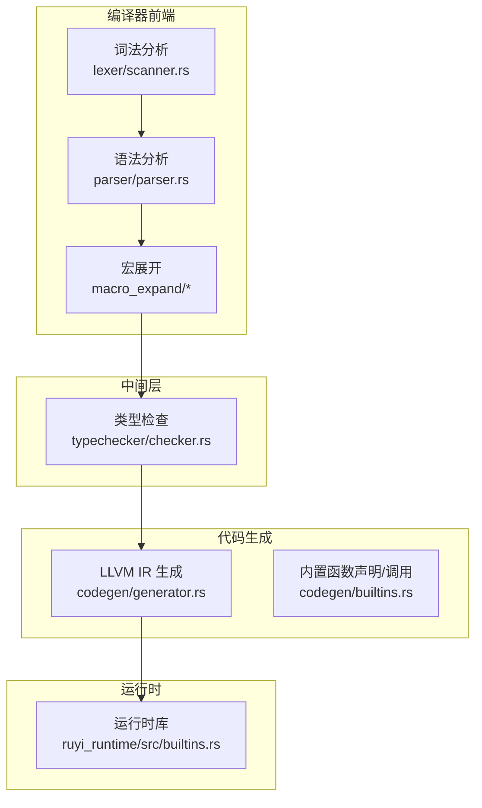
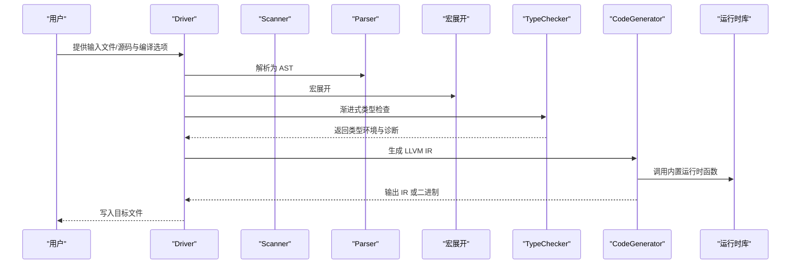
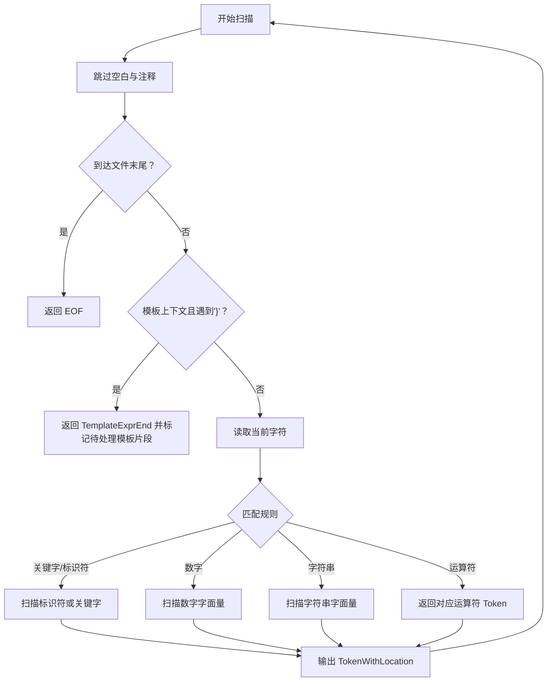
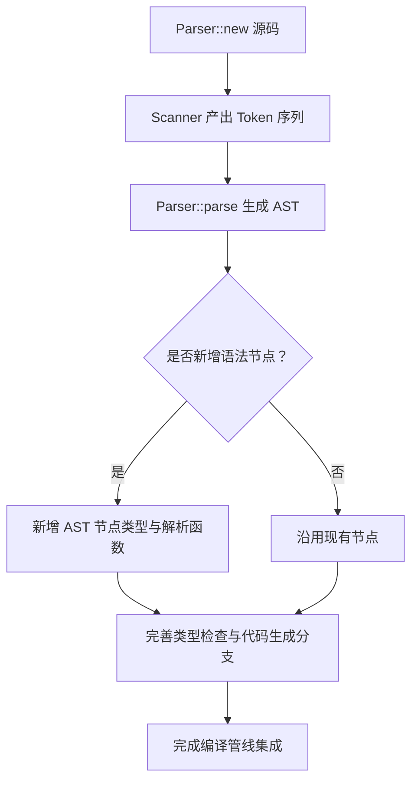
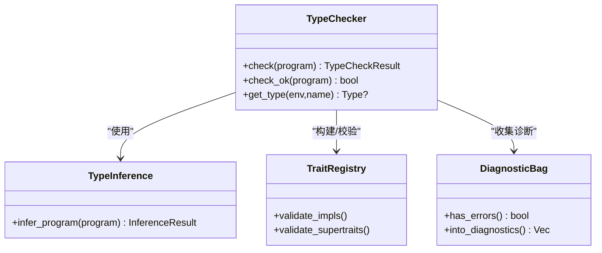
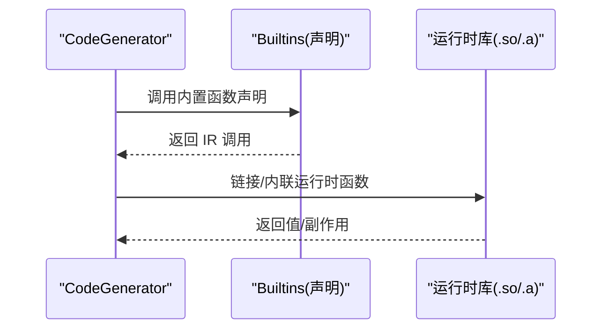
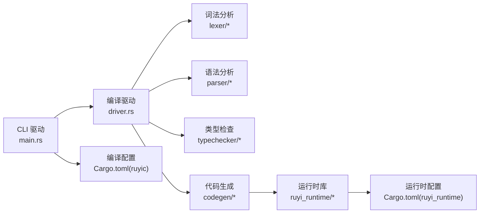

# 编译器扩展

<cite>
**本文引用的文件**   
- [crates/ruyic/src/lib.rs](file://crates/ruyic/src/lib.rs)
- [crates/ruyic/src/main.rs](file://crates/ruyic/src/main.rs)
- [crates/ruyic/src/driver.rs](file://crates/ruyic/src/driver.rs)
- [crates/ruyic/src/lexer/mod.rs](file://crates/ruyic/src/lexer/mod.rs)
- [crates/ruyic/src/lexer/scanner.rs](file://crates/ruyic/src/lexer/scanner.rs)
- [crates/ruyic/src/parser/mod.rs](file://crates/ruyic/src/parser/mod.rs)
- [crates/ruyic/src/parser/parser.rs](file://crates/ruyic/src/parser/parser.rs)
- [crates/ruyic/src/typechecker/mod.rs](file://crates/ruyic/src/typechecker/mod.rs)
- [crates/ruyic/src/typechecker/checker.rs](file://crates/ruyic/src/typechecker/checker.rs)
- [crates/ruyic/src/codegen/mod.rs](file://crates/ruyic/src/codegen/mod.rs)
- [crates/ruyic/src/codegen/generator.rs](file://crates/ruyic/src/codegen/generator.rs)
- [crates/ruyi_runtime/src/builtins.rs](file://crates/ruyi_runtime/src/builtins.rs)
- [crates/ruyic/Cargo.toml](file://crates/ruyic/Cargo.toml)
- [crates/ruyi_runtime/Cargo.toml](file://crates/ruyi_runtime/Cargo.toml)
- [README.md](file://README.md)
</cite>

## 目录
1. [简介](#简介)
2. [项目结构](#项目结构)
3. [核心组件](#核心组件)
4. [架构总览](#架构总览)
5. [详细组件分析](#详细组件分析)
6. [依赖关系分析](#依赖关系分析)
7. [性能考量](#性能考量)
8. [故障排查指南](#故障排查指南)
9. [结论](#结论)
10. [附录：扩展开发最佳实践与设计模式](#附录扩展开发最佳实践与设计模式)

## 简介
本指南面向希望为 Ruyi 编译器进行扩展的开发者，系统讲解如何在编译器前端、类型检查、代码生成、运行时与后端等层面添加新语言特性、语法元素、类型规则、内置函数与运行时支持，并给出测试与验证策略及最佳实践。

## 项目结构
Ruyi 编译器采用模块化分层设计：
- 前端：词法分析、语法分析、宏展开
- 中间层：类型检查（渐进式类型系统）、推断与约束求解
- 后端：LLVM IR 生成、优化与链接
- 运行时：GC、异常、异步、内置运行时函数



图表来源
- [crates/ruyic/src/lexer/scanner.rs:1-200](file://crates/ruyic/src/lexer/scanner.rs#L1-L200)
- [crates/ruyic/src/parser/parser.rs:1-200](file://crates/ruyic/src/parser/parser.rs#L1-L200)
- [crates/ruyic/src/typechecker/checker.rs:1-200](file://crates/ruyic/src/typechecker/checker.rs#L1-L200)
- [crates/ruyic/src/codegen/generator.rs:1-200](file://crates/ruyic/src/codegen/generator.rs#L1-L200)
- [crates/ruyi_runtime/src/builtins.rs:1-800](file://crates/ruyi_runtime/src/builtins.rs#L1-L800)

章节来源
- [README.md: 75-99:75-99](file://README.md#L75-L99)
- [crates/ruyic/src/lib.rs: 1-21:1-21](file://crates/ruyic/src/lib.rs#L1-L21)
- [crates/ruyic/src/main.rs: 1-L114:1-114](file://crates/ruyic/src/main.rs#L1-L114)

## 核心组件
- 驱动与管线：负责从源码到二进制的完整流程编排，含模块解析、AST 合并与编译选项处理。
- 词法/语法：扫描器与解析器分别产出 Token 流与 AST；解析器内置对部分内置类型的识别。
- 类型检查：基于渐进式类型系统，执行双向推断、约束求解、特征注册与校验。
- 代码生成：以 Inkwell 生成 LLVM IR，桥接内置函数与运行时支持。
- 运行时：提供字符串、数组、对象、集合等底层运行时函数与 GC 支持。

章节来源
- [crates/ruyic/src/driver.rs: 242-L744:242-744](file://crates/ruyic/src/driver.rs#L242-L744)
- [crates/ruyic/src/lexer/mod.rs: 1-L8:1-8](file://crates/ruyic/src/lexer/mod.rs#L1-L8)
- [crates/ruyic/src/parser/mod.rs: 1-L8:1-8](file://crates/ruyic/src/parser/mod.rs#L1-L8)
- [crates/ruyic/src/typechecker/mod.rs: 1-L32:1-32](file://crates/ruyic/src/typechecker/mod.rs#L1-L32)
- [crates/ruyic/src/codegen/mod.rs: 1-L15:1-15](file://crates/ruyic/src/codegen/mod.rs#L1-L15)

## 架构总览
编译管线从源码到机器码的关键步骤如下：



图表来源
- [crates/ruyic/src/driver.rs: 522-L632:522-632](file://crates/ruyic/src/driver.rs#L522-L632)
- [crates/ruyic/src/codegen/generator.rs: 1-L200:1-200](file://crates/ruyic/src/codegen/generator.rs#L1-L200)
- [crates/ruyi_runtime/src/builtins.rs: 1-L800:1-800](file://crates/ruyi_runtime/src/builtins.rs#L1-L800)

## 详细组件分析

### 词法分析器扩展：新增关键字/运算符/字面量
- 扫描器通过状态机逐字符扫描，维护位置信息与模板上下文。新增 Token 只需在扫描逻辑中识别并返回对应 TokenWithLocation。
- 关键点：确保模板表达式边界与转义处理不被破坏；为新 Token 维护正确的起止位置。



图表来源
- [crates/ruyic/src/lexer/scanner.rs: 25-L200:25-200](file://crates/ruyic/src/lexer/scanner.rs#L25-L200)

章节来源
- [crates/ruyic/src/lexer/mod.rs: 1-L8:1-8](file://crates/ruyic/src/lexer/mod.rs#L1-L8)
- [crates/ruyic/src/lexer/scanner.rs: 1-L200:1-200](file://crates/ruyic/src/lexer/scanner.rs#L1-L200)

### 语法分析器扩展：新增语法节点与解析规则
- 解析器以递归下降方式解析，维护当前位置与错误报告。新增语法元素需要：
  - 在词法层定义 Token
  - 在解析器中增加对应的解析函数与 AST 节点
  - 在类型检查与代码生成阶段补充相应处理
- 内置类型识别：解析器已内置对基础类型的识别，扩展时可复用该机制。



图表来源
- [crates/ruyic/src/parser/parser.rs: 12-L200:12-200](file://crates/ruyic/src/parser/parser.rs#L12-L200)

章节来源
- [crates/ruyic/src/parser/mod.rs: 1-L8:1-8](file://crates/ruyic/src/parser/mod.rs#L1-L8)
- [crates/ruyic/src/parser/parser.rs: 75-L77:75-77](file://crates/ruyic/src/parser/parser.rs#L75-L77)

### 类型检查器扩展：新增类型与规则
- 渐进式类型系统支持静态/动态类型共存、双向推断、约束求解与特征系统。扩展要点：
  - 新增类型：在类型系统中注册新类型构造与转换规则
  - 约束求解：为新类型提供约束变量与统一规则
  - 特征系统：如需 trait/impl，构建特征注册表并进行一致性校验
  - 诊断：为新规则提供清晰的诊断消息



图表来源
- [crates/ruyic/src/typechecker/checker.rs: 41-L101:41-101](file://crates/ruyic/src/typechecker/checker.rs#L41-L101)

章节来源
- [crates/ruyic/src/typechecker/mod.rs: 1-L32:1-32](file://crates/ruyic/src/typechecker/mod.rs#L1-L32)
- [crates/ruyic/src/typechecker/checker.rs: 1-L200:1-200](file://crates/ruyic/src/typechecker/checker.rs#L1-L200)

### 代码生成器扩展：新增 IR 指令与优化 Pass
- CodeGenerator 使用 Inkwell 生成 LLVM IR，支持函数、表达式、语句、声明与内置函数的生成。
- 扩展建议：
  - 在生成器中新增针对新语法/类型的编译分支
  - 将运行时函数映射到内置函数声明模块，确保 ABI 兼容
  - 对于复杂控制流（如异常、异步），利用 CodegenContext 的栈结构组织基本块
- 优化等级：通过编译选项映射到 Inkwell 的优化级别。

```mermaid
classDiagram
class CodeGenerator {
+generate_with_env(program,tracker,env)
+compile_to_binary_with_opt(path,opt)
+write_llvm_ir(path)
+print_to_string() String
}
class CodegenContext {
+variables : Map<String,(Ptr,Type)>
+loop_stack : Vec<(BB,BB)>
+try_stack : Vec<TryContext>
+gc_roots : Vec<Vec<(Ptr,Type)>>
+async_* : 异步状态机支持
+class_* / enum_* : 结构体与枚举类型缓存
}
class Builtins {
+declare_builtins()
+build_*_ops()
}
CodeGenerator --> CodegenContext : "持有"
CodeGenerator --> Builtins : "使用"
```

图表来源
- [crates/ruyic/src/codegen/generator.rs: 1-L200:1-200](file://crates/ruyic/src/codegen/generator.rs#L1-L200)
- [crates/ruyic/src/codegen/mod.rs: 1-L15:1-15](file://crates/ruyic/src/codegen/mod.rs#L1-L15)

章节来源
- [crates/ruyic/src/codegen/mod.rs: 1-L15:1-15](file://crates/ruyic/src/codegen/mod.rs#L1-L15)
- [crates/ruyic/src/codegen/generator.rs: 1-L200:1-200](file://crates/ruyic/src/codegen/generator.rs#L1-L200)

### 运行时扩展：新增内置函数与运行时支持
- 运行时以 C ABI 导出函数，供代码生成器调用。扩展步骤：
  - 在运行时库中新增 C 函数，遵循统一的命名约定与内存管理策略
  - 在代码生成器的内置函数模块中声明并调用
  - 为标准库提供入口包装（例如 __builtin_* 前缀的封装）



图表来源
- [crates/ruyi_runtime/src/builtins.rs: 1-L800:1-800](file://crates/ruyi_runtime/src/builtins.rs#L1-L800)
- [crates/ruyic/src/codegen/mod.rs: 3-L3:3-3](file://crates/ruyic/src/codegen/mod.rs#L3-L3)

章节来源
- [crates/ruyi_runtime/src/builtins.rs: 1-L800:1-800](file://crates/ruyi_runtime/src/builtins.rs#L1-L800)

## 依赖关系分析
- 编译器二进制依赖运行时库；运行时库默认启用 Inkwell 特性以便在需要时进行本地构建。
- CLI 驱动通过命令行参数选择输出格式（AST、Typed AST、LLVM IR、二进制）与优化等级。



图表来源
- [crates/ruyic/src/main.rs: 16-L114:16-114](file://crates/ruyic/src/main.rs#L16-L114)
- [crates/ruyic/src/driver.rs: 242-L744:242-744](file://crates/ruyic/src/driver.rs#L242-L744)
- [crates/ruyic/Cargo.toml: 19-L26:19-26](file://crates/ruyic/Cargo.toml#L19-L26)
- [crates/ruyi_runtime/Cargo.toml: 11-L17:11-17](file://crates/ruyi_runtime/Cargo.toml#L11-L17)

章节来源
- [crates/ruyic/Cargo.toml: 1-L26:1-26](file://crates/ruyic/Cargo.toml#L1-L26)
- [crates/ruyi_runtime/Cargo.toml: 1-L17:1-17](file://crates/ruyi_runtime/Cargo.toml#L1-L17)

## 性能考量
- 优化等级映射到 Inkwell 的优化级别，合理选择 O0/O1/O2 以平衡编译时间与运行时性能。
- 代码生成阶段尽量内联小函数、减少不必要的运行时调用；对热点路径进行局部优化。
- 运行时分配与 GC 集成需谨慎，避免频繁分配导致停顿。

## 故障排查指南
- 错误类型：编译器将 IO、词法、解析、宏、类型检查、代码生成、链接等错误统一为编译错误类型，便于集中处理与输出。
- 诊断：类型检查器返回诊断包，包含错误与警告；驱动可格式化输出带源码位置的诊断信息。
- 建议流程：先 --emit-ast/--emit-typed-ast 定位前端/类型问题，再逐步开启代码生成与链接定位 IR/运行时问题。

章节来源
- [crates/ruyic/src/driver.rs: 21-L54:21-54](file://crates/ruyic/src/driver.rs#L21-L54)
- [crates/ruyic/src/driver.rs: 739-L744:739-744](file://crates/ruyic/src/driver.rs#L739-L744)

## 结论
通过以上分层架构与模块职责划分，Ruyi 编译器为扩展提供了清晰的接入点。前端扩展侧重词法/语法节点与内置类型识别；类型检查扩展侧重类型系统与特征注册；代码生成扩展侧重 IR 生成与运行时桥接；运行时扩展则提供底层 ABI 函数与内存管理支持。配合完善的测试与诊断体系，可高效、安全地迭代语言能力。

## 附录：扩展开发最佳实践与设计模式
- 分层解耦：前端/中间/后端/运行时各司其职，避免跨层耦合
- 逐步集成：先在前端/类型检查通过，再进入代码生成与运行时
- 一致命名：内置函数统一前缀（如 __builtin_），保持 ABI 稳定
- 诊断优先：为每类错误提供明确、可读的诊断信息
- 可回退策略：对于不稳定特性，保留可选开关与降级路径
- 测试覆盖：为新增语法/类型/运行时函数编写单元与集成测试