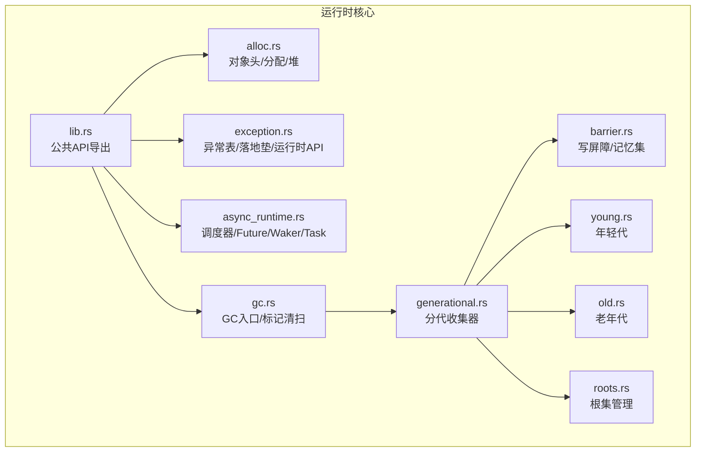
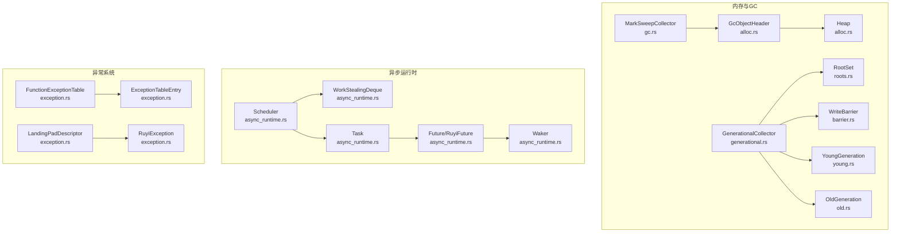
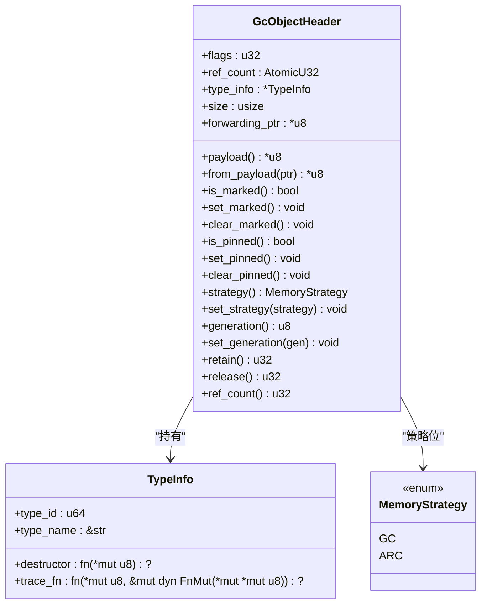
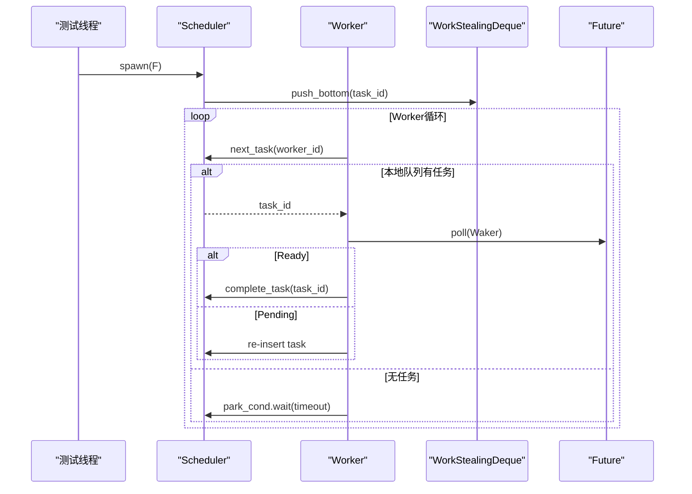
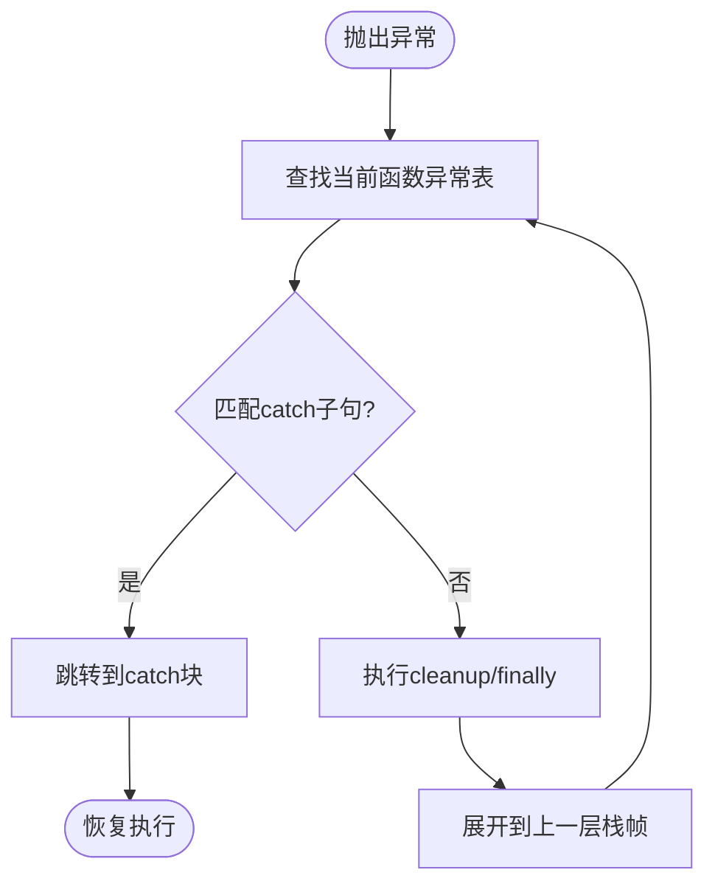
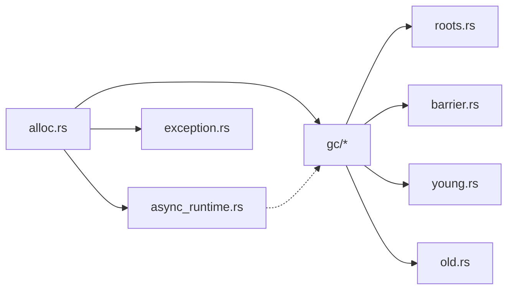

# 运行时系统扩展

<cite>
**本文档引用的文件**
- [lib.rs](file://crates/ruyi_runtime/src/lib.rs)
- [alloc.rs](file://crates/ruyi_runtime/src/alloc.rs)
- [gc.rs](file://crates/ruyi_runtime/src/gc.rs)
- [generational.rs](file://crates/ruyi_runtime/src/gc/generational.rs)
- [barrier.rs](file://crates/ruyi_runtime/src/gc/barrier.rs)
- [young.rs](file://crates/ruyi_runtime/src/gc/young.rs)
- [old.rs](file://crates/ruyi_runtime/src/gc/old.rs)
- [roots.rs](file://crates/ruyi_runtime/src/gc/roots.rs)
- [async_runtime.rs](file://crates/ruyi_runtime/src/async_runtime.rs)
- [exception.rs](file://crates/ruyi_runtime/src/exception.rs)
- [runtime.rs（运行时测试）](file://crates/ruyi_runtime/tests/runtime.rs)
- [async_runtime.rs（异步运行时测试）](file://crates/ruyi_runtime/tests/async_runtime.rs)
- [exception.rs（异常测试）](file://crates/ruyi_runtime/tests/exception.rs)
- [builtins.rs（内置函数测试）](file://crates/ruyi_runtime/tests/builtins.rs)
- [Cargo.toml](file://Cargo.toml)
</cite>

## 目录
1. [简介](#简介)
2. [项目结构](#项目结构)
3. [核心组件](#核心组件)
4. [架构总览](#架构总览)
5. [详细组件分析](#详细组件分析)
6. [依赖关系分析](#依赖关系分析)
7. [性能考量](#性能考量)
8. [故障排查指南](#故障排查指南)
9. [结论](#结论)
10. [附录：扩展实践与测试](#附录扩展实践与测试)

## 简介
本指南面向希望在 Ruyi 运行时系统上进行扩展的开发者，覆盖以下主题：
- 垃圾回收器扩展：新增 GC 算法、内存分配策略与根集管理
- 异步运行时扩展：自定义调度器、任务管理与并发原语
- 异常处理系统扩展：新增异常类型、异常传播与错误恢复策略
- 内存管理系统扩展：自定义分配器与内存池管理
- 新增运行时功能示例：并发数据结构与系统调用接口
- 测试与验证：性能测试与并发测试策略

## 项目结构
Ruyi 运行时位于 crates/ruyi_runtime，采用模块化组织：
- 核心导出入口：lib.rs 汇总导出所有公共 API
- 内存管理：alloc.rs 定义对象头、分配策略与堆接口
- 垃圾回收：gc.rs 及子模块（generational、barrier、young、old、roots）
- 异步运行时：async_runtime.rs 实现工作窃取调度、Future/Waker/Task
- 异常处理：exception.rs 提供异常表、落地垫描述与运行时 API
- 测试：tests 下包含运行时、异步、异常、内置函数等测试

图表来源
- [lib.rs:1-50](file://crates/ruyi_runtime/src/lib.rs#L1-L50)
- [alloc.rs:1-120](file://crates/ruyi_runtime/src/alloc.rs#L1-L120)
- [gc.rs:1-60](file://crates/ruyi_runtime/src/gc.rs#L1-L60)
- [generational.rs:1-60](file://crates/ruyi_runtime/src/gc/generational.rs#L1-L60)
- [barrier.rs:1-40](file://crates/ruyi_runtime/src/gc/barrier.rs#L1-L40)
- [young.rs:1-40](file://crates/ruyi_runtime/src/gc/young.rs#L1-L40)
- [old.rs:1-40](file://crates/ruyi_runtime/src/gc/old.rs#L1-L40)
- [roots.rs:1-40](file://crates/ruyi_runtime/src/gc/roots.rs#L1-L40)
- [async_runtime.rs:1-60](file://crates/ruyi_runtime/src/async_runtime.rs#L1-L60)
- [exception.rs:1-60](file://crates/ruyi_runtime/src/exception.rs#L1-L60)

章节来源
- [lib.rs:1-50](file://crates/ruyi_runtime/src/lib.rs#L1-L50)
- [alloc.rs:1-120](file://crates/ruyi_runtime/src/alloc.rs#L1-L120)
- [gc.rs:1-60](file://crates/ruyi_runtime/src/gc.rs#L1-L60)
- [generational.rs:1-60](file://crates/ruyi_runtime/src/gc/generational.rs#L1-L60)
- [barrier.rs:1-40](file://crates/ruyi_runtime/src/gc/barrier.rs#L1-L40)
- [young.rs:1-40](file://crates/ruyi_runtime/src/gc/young.rs#L1-L40)
- [old.rs:1-40](file://crates/ruyi_runtime/src/gc/old.rs#L1-L40)
- [roots.rs:1-40](file://crates/ruyi_runtime/src/gc/roots.rs#L1-L40)
- [async_runtime.rs:1-60](file://crates/ruyi_runtime/src/async_runtime.rs#L1-L60)
- [exception.rs:1-60](file://crates/ruyi_runtime/src/exception.rs#L1-L60)

## 核心组件
- 对象头与分配策略：GcObjectHeader 统一支持 GC 与 ARC；MemoryStrategy 决定内存管理方式
- 分代收集器：GenerationalCollector 将堆分为年轻代与老年代，结合写屏障与记忆集
- 根集管理：RootSet 将栈根与全局根分离，便于不同代的收集策略
- 写屏障：WriteBarrier 记录跨代指针，避免漏标
- 年轻代/老年代：YoungGeneration 与 OldGeneration 分别负责复制与标记压缩
- 异步运行时：Scheduler 使用工作窃取队列，Waker 负责唤醒，Task 包装 Future
- 异常系统：基于 Itanium C++ ABI 的 landing-pad 模型，提供异常表与落地垫描述

章节来源
- [alloc.rs:37-181](file://crates/ruyi_runtime/src/alloc.rs#L37-L181)
- [generational.rs:21-55](file://crates/ruyi_runtime/src/gc/generational.rs#L21-L55)
- [roots.rs:11-122](file://crates/ruyi_runtime/src/gc/roots.rs#L11-L122)
- [barrier.rs:13-80](file://crates/ruyi_runtime/src/gc/barrier.rs#L13-L80)
- [young.rs:11-77](file://crates/ruyi_runtime/src/gc/young.rs#L11-L77)
- [old.rs:10-57](file://crates/ruyi_runtime/src/gc/old.rs#L10-L57)
- [async_runtime.rs:26-92](file://crates/ruyi_runtime/src/async_runtime.rs#L26-L92)
- [exception.rs:33-128](file://crates/ruyi_runtime/src/exception.rs#L33-L128)

## 架构总览
下图展示了运行时各模块之间的交互关系，重点体现 GC、异步与异常三大部分的耦合点。

图表来源
- [alloc.rs:37-181](file://crates/ruyi_runtime/src/alloc.rs#L37-L181)
- [gc.rs:15-60](file://crates/ruyi_runtime/src/gc.rs#L15-L60)
- [generational.rs:21-55](file://crates/ruyi_runtime/src/gc/generational.rs#L21-L55)
- [roots.rs:11-122](file://crates/ruyi_runtime/src/gc/roots.rs#L11-L122)
- [barrier.rs:13-80](file://crates/ruyi_runtime/src/gc/barrier.rs#L13-L80)
- [young.rs:11-77](file://crates/ruyi_runtime/src/gc/young.rs#L11-L77)
- [old.rs:10-57](file://crates/ruyi_runtime/src/gc/old.rs#L10-L57)
- [async_runtime.rs:138-314](file://crates/ruyi_runtime/src/async_runtime.rs#L138-L314)
- [exception.rs:33-128](file://crates/ruyi_runtime/src/exception.rs#L33-L128)

## 详细组件分析

### 垃圾回收器扩展
- 新增 GC 算法实现
  - 在 gc/mod.rs 中新增模块并导出新收集器类型
  - 实现与现有 Collector trait 兼容的接口（如 collect 方法）
  - 复用 GcObjectHeader 与 TypeInfo，确保统一的对象布局与追踪回调
- 内存分配策略
  - 通过 MemoryStrategy::GC 或 MemoryStrategy::ARC 选择策略
  - 分配路径：ruyi_alloc → GcObjectHeader::new → 设置策略位
- 根集管理
  - 使用 RootSet 区分栈根与全局根，配合写屏障与记忆集
  - 提供 add_root/remove_root/add_global_root/remove_global_root 接口

图表来源
- [alloc.rs:37-181](file://crates/ruyi_runtime/src/alloc.rs#L37-L181)

章节来源
- [alloc.rs:37-181](file://crates/ruyi_runtime/src/alloc.rs#L37-L181)
- [gc.rs:15-60](file://crates/ruyi_runtime/src/gc.rs#L15-L60)
- [generational.rs:21-55](file://crates/ruyi_runtime/src/gc/generational.rs#L21-L55)
- [roots.rs:11-122](file://crates/ruyi_runtime/src/gc/roots.rs#L11-L122)
- [barrier.rs:13-80](file://crates/ruyi_runtime/src/gc/barrier.rs#L13-L80)
- [young.rs:11-77](file://crates/ruyi_runtime/src/gc/young.rs#L11-L77)
- [old.rs:10-57](file://crates/ruyi_runtime/src/gc/old.rs#L10-L57)

### 异步运行时扩展
- 自定义调度器
  - 实现新的调度器类型，遵循 SchedulerInner 的共享状态模式
  - 提供 spawn_task、next_task、wake_task、complete_task 等核心流程
- 任务管理与并发原语
  - Task 包装任意 RuyiFuture，支持 Send + 'static
  - Waker 通过共享 SchedulerInner 将任务重新入队
  - 提供 JoinAll、Race 等组合器作为并发原语示例
- 与 GC 集成
  - register_async_roots 扫描所有活跃任务，提取可能指向 GC 对象的指针并注册为根

图表来源
- [async_runtime.rs:138-357](file://crates/ruyi_runtime/src/async_runtime.rs#L138-L357)

章节来源
- [async_runtime.rs:138-357](file://crates/ruyi_runtime/src/async_runtime.rs#L138-L357)
- [async_runtime.rs:426-455](file://crates/ruyi_runtime/src/async_runtime.rs#L426-L455)

### 异常处理系统扩展
- 新增异常类型
  - 使用 fresh_type_id 生成运行时类型 ID
  - 在 FunctionExceptionTable 中注册 try/catch 区域与 landing-pad
- 异常传播机制
  - 基于 Itanium C++ ABI 的 landing-pad 指令模型
  - LandingPadDescriptor 描述 catch/filter/cleanup 行为
- 错误恢复策略
  - RuyiException 携带 type_id、message 与可选栈帧
  - ruyi_finally 保证 finally 块执行，preserve 异常状态

图表来源
- [exception.rs:33-128](file://crates/ruyi_runtime/src/exception.rs#L33-L128)

章节来源
- [exception.rs:33-128](file://crates/ruyi_runtime/src/exception.rs#L33-L128)
- [exception.rs:280-291](file://crates/ruyi_runtime/src/exception.rs#L280-L291)

### 内存管理系统扩展
- 新分配器实现
  - 保持与 GcObjectHeader 对齐与大小约定
  - 在 ruyi_alloc/ruyi_dealloc/ruyi_realloc 中维护 header 与 payload
- 内存池管理
  - 当前 Heap 委托系统分配器；可替换为专用 arena 或页式分配器
  - 通过 MemoryStrategy 与 flags 支持 GC/ARC 双布局

章节来源
- [alloc.rs:183-223](file://crates/ruyi_runtime/src/alloc.rs#L183-L223)
- [alloc.rs:225-298](file://crates/ruyi_runtime/src/alloc.rs#L225-L298)

## 依赖关系分析
- 模块内聚与耦合
  - alloc.rs 为底层基础设施，被 gc、async_runtime、exception 广泛使用
  - gc 子模块高内聚，通过 RootSet、WriteBarrier、Young/OldGeneration 协作
  - async_runtime 与 gc 通过 register_async_roots 轻耦合集成
- 外部依赖
  - inkwell 特性用于 LLVM 类型映射与 landing-pad 生成（测试中）

图表来源
- [alloc.rs:1-120](file://crates/ruyi_runtime/src/alloc.rs#L1-L120)
- [gc.rs:1-60](file://crates/ruyi_runtime/src/gc.rs#L1-L60)
- [generational.rs:1-60](file://crates/ruyi_runtime/src/gc/generational.rs#L1-L60)
- [async_runtime.rs:1-60](file://crates/ruyi_runtime/src/async_runtime.rs#L1-L60)
- [exception.rs:1-60](file://crates/ruyi_runtime/src/exception.rs#L1-L60)

章节来源
- [Cargo.toml:14-40](file://Cargo.toml#L14-L40)

## 性能考量
- GC
  - 分代收集减少全堆扫描开销；写屏障与记忆集降低跨代漏标风险
  - 通过 promotion_threshold 控制晋升年龄，平衡晋升成本与老年代碎片
- 异步
  - 工作窃取队列降低锁竞争；Waker 仅在必要时唤醒，避免忙等
  - JoinAll/Race 等组合器减少上下文切换
- 内存
  - 对象头紧凑布局，减少元数据开销；按需分配与释放，避免过度预分配

## 故障排查指南
- GC 相关
  - 对象未存活：检查是否正确注册为根（栈根/全局根），确认写屏障触发条件
  - 晋升异常：调整 promotion_threshold，观察 young/full 收集次数
- 异步
  - 任务不执行：确认 Waker 是否被调用，以及 next_task 的队列流转
  - 死锁：检查 WorkStealingDeque 的 steal/top 逻辑与 worker 数量
- 异常
  - catch 不生效：核对 LandingPadDescriptor 的动作顺序与类型匹配
  - finally 未执行：检查异常表条目是否标记 has_cleanup

章节来源
- [generational.rs:146-381](file://crates/ruyi_runtime/src/gc/generational.rs#L146-L381)
- [async_runtime.rs:216-237](file://crates/ruyi_runtime/src/async_runtime.rs#L216-L237)
- [exception.rs:231-278](file://crates/ruyi_runtime/src/exception.rs#L231-L278)

## 结论
Ruyi 运行时提供了清晰的扩展点：以 GcObjectHeader 为核心的内存抽象、分代 GC 的模块化设计、工作窃取调度器与基于 landing-pad 的异常系统。按照本文档的指导，可在不破坏现有契约的前提下，安全地引入新的 GC 算法、调度策略、异常类型与并发原语，并通过既有测试框架进行验证。

## 附录：扩展实践与测试

### 扩展步骤示例
- 新增 GC 算法
  - 在 crates/ruyi_runtime/src/gc 下新增模块，实现 Collector trait
  - 在 lib.rs 导出新类型，并在 tests 中编写单元测试
- 新增异步原语
  - 在 async_runtime.rs 中定义新的 Future 类型与 poll 实现
  - 使用 test_waker 创建 Waker 进行单测
- 新增异常类型
  - 使用 fresh_type_id 生成类型 ID，注册到 FunctionExceptionTable
  - 编写 LandingPadDescriptor 并在测试中验证匹配行为
- 新增分配器
  - 替换 Heap 的 alloc/dealloc/realloc 实现，保持与 GcObjectHeader 对齐

章节来源
- [lib.rs:11-48](file://crates/ruyi_runtime/src/lib.rs#L11-L48)
- [async_runtime.rs:306-314](file://crates/ruyi_runtime/src/async_runtime.rs#L306-L314)
- [exception.rs:15-21](file://crates/ruyi_runtime/src/exception.rs#L15-L21)

### 测试与验证策略
- 运行时测试
  - 分配/释放/重分配一致性、对象头标志位、ARC 引用计数
- 异步测试
  - 多 worker 并发、任务唯一性、JoinAll/Race 行为
- 异常测试
  - catch 匹配、finally 保证、LLVM landing-pad 生成
- 性能测试
  - 使用 Criterion 基准测试（工作区已配置），针对 GC 收集频率、异步吞吐、异常路径延迟进行度量

章节来源
- [runtime.rs（运行时测试）:1-133](file://crates/ruyi_runtime/tests/runtime.rs#L1-L133)
- [async_runtime.rs（异步运行时测试）:1-156](file://crates/ruyi_runtime/tests/async_runtime.rs#L1-L156)
- [exception.rs（异常测试）:1-232](file://crates/ruyi_runtime/tests/exception.rs#L1-L232)
- [Cargo.toml:29-30](file://Cargo.toml#L29-L30)