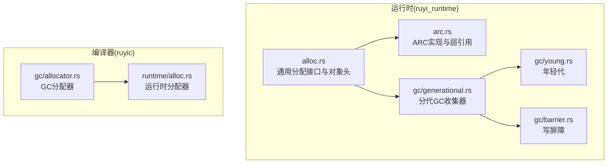
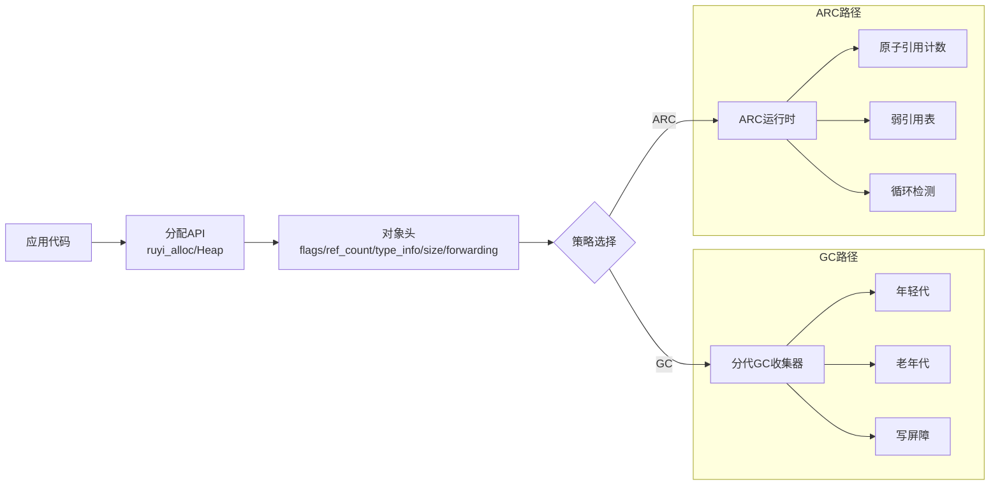
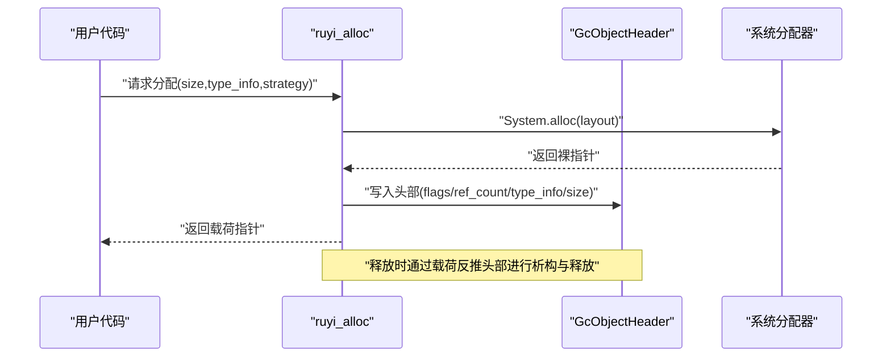
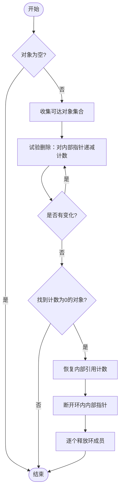
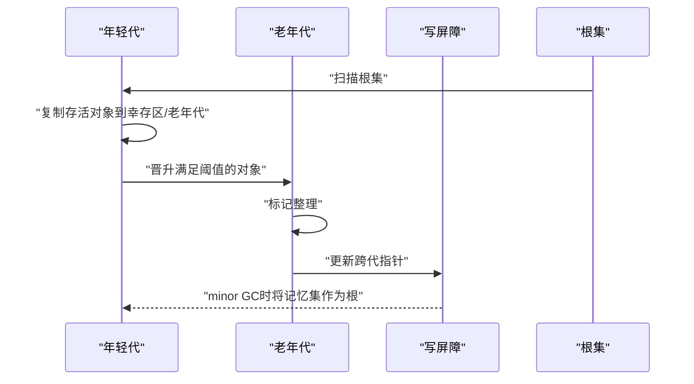
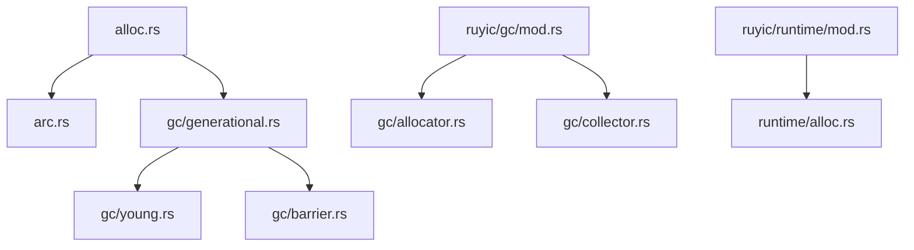

# 内存分配器扩展

<cite>
**本文档引用的文件**
- [crates/ruyi_runtime/src/alloc.rs](file://crates/ruyi_runtime/src/alloc.rs)
- [crates/ruyi_runtime/src/arc.rs](file://crates/ruyi_runtime/src/arc.rs)
- [crates/ruyi_runtime/src/gc/generational.rs](file://crates/ruyi_runtime/src/gc/generational.rs)
- [crates/ruyi_runtime/src/gc/young.rs](file://crates/ruyi_runtime/src/gc/young.rs)
- [crates/ruyi_runtime/src/gc/barrier.rs](file://crates/ruyi_runtime/src/gc/barrier.rs)
- [crates/ruyic/src/gc/allocator.rs](file://crates/ruyic/src/gc/allocator.rs)
- [crates/ruyic/src/runtime/alloc.rs](file://crates/ruyic/src/runtime/alloc.rs)
- [docs/spec.md](file://docs/spec.md)
- [.omo/evidence/task-3-memory-model.txt](file://.omo/evidence/task-3-memory-model.txt)
</cite>

## 目录
1. [简介](#简介)
2. [项目结构](#项目结构)
3. [核心组件](#核心组件)
4. [架构总览](#架构总览)
5. [详细组件分析](#详细组件分析)
6. [依赖关系分析](#依赖关系分析)
7. [性能考虑](#性能考虑)
8. [故障排查指南](#故障排查指南)
9. [结论](#结论)
10. [附录](#附录)

## 简介
本指南面向需要在Ruyi系统中扩展内存分配能力的开发者，涵盖以下主题：
- 扩展内存分配策略：如何实现自定义分配器并接入现有运行时
- ARC（原子引用计数）系统扩展：新增引用计数策略与弱引用管理
- 内存池化技术：对象池、缓冲池等内存复用机制的设计与实现
- 内存对齐与布局优化：缓存友好布局设计与对齐规则
- 内存泄漏检测与调试：统计与报告集成方案
- 性能优化最佳实践：分配热点优化与多线程内存安全

## 项目结构
Ruyi的内存子系统主要由运行时（ruyi_runtime）与编译器前端（ruyic）两部分组成：
- 运行时层提供GC与ARC两种内存管理策略，统一的堆接口与对象头布局
- 编译器前端提供基础的系统分配器封装，供编译产物直接使用

**图表来源**
- [crates/ruyi_runtime/src/alloc.rs:1-405](file://crates/ruyi_runtime/src/alloc.rs#L1-L405)
- [crates/ruyi_runtime/src/arc.rs:1-565](file://crates/ruyi_runtime/src/arc.rs#L1-L565)
- [crates/ruyi_runtime/src/gc/generational.rs:1-743](file://crates/ruyi_runtime/src/gc/generational.rs#L1-L743)
- [crates/ruyi_runtime/src/gc/young.rs:1-84](file://crates/ruyi_runtime/src/gc/young.rs#L1-L84)
- [crates/ruyi_runtime/src/gc/barrier.rs:1-140](file://crates/ruyi_runtime/src/gc/barrier.rs#L1-L140)
- [crates/ruyic/src/gc/allocator.rs:1-17](file://crates/ruyic/src/gc/allocator.rs#L1-L17)
- [crates/ruyic/src/runtime/alloc.rs:1-22](file://crates/ruyic/src/runtime/alloc.rs#L1-L22)

**章节来源**
- [crates/ruyi_runtime/src/alloc.rs:1-405](file://crates/ruyi_runtime/src/alloc.rs#L1-L405)
- [crates/ruyi_runtime/src/arc.rs:1-565](file://crates/ruyi_runtime/src/arc.rs#L1-L565)
- [crates/ruyi_runtime/src/gc/generational.rs:1-743](file://crates/ruyi_runtime/src/gc/generational.rs#L1-L743)
- [crates/ruyi_runtime/src/gc/young.rs:1-84](file://crates/ruyi_runtime/src/gc/young.rs#L1-L84)
- [crates/ruyi_runtime/src/gc/barrier.rs:1-140](file://crates/ruyi_runtime/src/gc/barrier.rs#L1-L140)
- [crates/ruyic/src/gc/allocator.rs:1-17](file://crates/ruyic/src/gc/allocator.rs#L1-L17)
- [crates/ruyic/src/runtime/alloc.rs:1-22](file://crates/ruyic/src/runtime/alloc.rs#L1-L22)

## 核心组件
- 对象头与分配策略
  - 统一对象头包含标志位、引用计数、类型信息、大小、转发指针等字段
  - 支持按对象选择GC或ARC策略，策略位存储于对象头标志位中
- 堆接口
  - 提供原始内存分配/释放/重分配接口，当前委托给系统分配器
  - 后续可替换为专用内存区（arena）
- ARC运行时
  - 引用计数原子操作、弱引用表、循环检测（试验性）
  - ARC/GC边界处理函数，支持跨策略持有
- 分代GC
  - 年轻代复制收集 + 老年代标记整理
  - 写屏障跟踪跨代指针，维护记忆集

**章节来源**
- [crates/ruyi_runtime/src/alloc.rs:41-181](file://crates/ruyi_runtime/src/alloc.rs#L41-L181)
- [crates/ruyi_runtime/src/alloc.rs:183-223](file://crates/ruyi_runtime/src/alloc.rs#L183-L223)
- [crates/ruyi_runtime/src/arc.rs:96-236](file://crates/ruyi_runtime/src/arc.rs#L96-L236)
- [crates/ruyi_runtime/src/gc/generational.rs:21-515](file://crates/ruyi_runtime/src/gc/generational.rs#L21-L515)

## 架构总览
Ruyi采用“统一对象头 + 双策略”的架构：同一对象布局既可被GC也可被ARC管理，通过标志位切换策略。运行时提供统一的分配入口，GC侧负责分代收集与写屏障，ARC侧负责引用计数与弱引用。

**图表来源**
- [crates/ruyi_runtime/src/alloc.rs:74-181](file://crates/ruyi_runtime/src/alloc.rs#L74-L181)
- [crates/ruyi_runtime/src/gc/generational.rs:21-42](file://crates/ruyi_runtime/src/gc/generational.rs#L21-L42)
- [crates/ruyi_runtime/src/arc.rs:22-26](file://crates/ruyi_runtime/src/arc.rs#L22-L26)

## 详细组件分析

### 组件A：对象头与分配策略
- 对象头字段与布局
  - 标志位：标记位、固定位、策略位、代位
  - 引用计数：用于ARC
  - 类型信息：析构与追踪回调
  - 大小与转发指针：GC复制/整理所需
- 分配流程
  - 计算总尺寸（载荷+头部），对齐到头部对齐要求
  - 写入头部（策略、初始引用计数、类型信息、大小）
  - 返回载荷指针
- 重分配与释放
  - 保留头部，移动到新位置，更新头部大小
  - 释放前调用析构函数，再释放内存

**图表来源**
- [crates/ruyi_runtime/src/alloc.rs:233-270](file://crates/ruyi_runtime/src/alloc.rs#L233-L270)

**章节来源**
- [crates/ruyi_runtime/src/alloc.rs:41-181](file://crates/ruyi_runtime/src/alloc.rs#L41-L181)
- [crates/ruyi_runtime/src/alloc.rs:225-298](file://crates/ruyi_runtime/src/alloc.rs#L225-L298)

### 组件B：ARC运行时与弱引用
- 弱引用表
  - 全局弱表，记录每个对象对应的槽位列表
  - 对象销毁时批量失效对应槽位
- 弱引用生命周期
  - 创建：分配槽位并登记对象
  - 加载：检查槽位是否仍有效，有效则增加引用计数
  - 丢弃：移除槽位登记
- 循环检测（试验性）
  - 基于“试验删除”算法，临时降低候选集合内对象引用计数，若根对象计数归零则判定为环
  - 恢复内部引用计数后，断开环内内部指针并释放

**图表来源**
- [crates/ruyi_runtime/src/arc.rs:273-375](file://crates/ruyi_runtime/src/arc.rs#L273-L375)

**章节来源**
- [crates/ruyi_runtime/src/arc.rs:47-94](file://crates/ruyi_runtime/src/arc.rs#L47-L94)
- [crates/ruyi_runtime/src/arc.rs:156-211](file://crates/ruyi_runtime/src/arc.rs#L156-L211)
- [crates/ruyi_runtime/src/arc.rs:240-409](file://crates/ruyi_runtime/src/arc.rs#L240-L409)

### 组件C：分代GC与写屏障
- 年轻代
  - 新对象分配在年轻代，存活者在minor GC中复制到幸存区或晋升到老年代
  - 代阈值决定晋升时机
- 老年代
  - 标记-整理算法，处理跨代指针更新与压缩
- 写屏障
  - 当老对象写入指向年轻对象的指针时，将其加入记忆集，minor GC时作为额外根处理

**图表来源**
- [crates/ruyi_runtime/src/gc/generational.rs:146-267](file://crates/ruyi_runtime/src/gc/generational.rs#L146-L267)
- [crates/ruyi_runtime/src/gc/generational.rs:269-381](file://crates/ruyi_runtime/src/gc/generational.rs#L269-L381)
- [crates/ruyi_runtime/src/gc/young.rs:34-47](file://crates/ruyi_runtime/src/gc/young.rs#L34-L47)
- [crates/ruyi_runtime/src/gc/barrier.rs:13-80](file://crates/ruyi_runtime/src/gc/barrier.rs#L13-L80)

**章节来源**
- [crates/ruyi_runtime/src/gc/generational.rs:21-515](file://crates/ruyi_runtime/src/gc/generational.rs#L21-L515)
- [crates/ruyi_runtime/src/gc/young.rs:11-84](file://crates/ruyi_runtime/src/gc/young.rs#L11-L84)
- [crates/ruyi_runtime/src/gc/barrier.rs:1-140](file://crates/ruyi_runtime/src/gc/barrier.rs#L1-L140)

### 组件D：编译器前端分配器
- GC分配器
  - 直接委托系统分配器，便于编译期/链接期使用
- 运行时分配器
  - 提供与运行时一致的分配/释放/重分配接口，支持拷贝语义

**章节来源**
- [crates/ruyic/src/gc/allocator.rs:1-17](file://crates/ruyic/src/gc/allocator.rs#L1-L17)
- [crates/ruyic/src/runtime/alloc.rs:1-22](file://crates/ruyic/src/runtime/alloc.rs#L1-L22)

## 依赖关系分析
- 运行时层
  - alloc.rs被arc.rs与gc/generational.rs共同依赖
  - gc/generational.rs依赖young.rs与barrier.rs
- 编译器层
  - ruyic的gc模块导出Allocator与Collector
  - ruyic的runtime模块导出allocate等运行时分配API

**图表来源**
- [crates/ruyi_runtime/src/alloc.rs:1-405](file://crates/ruyi_runtime/src/alloc.rs#L1-L405)
- [crates/ruyi_runtime/src/arc.rs:1-565](file://crates/ruyi_runtime/src/arc.rs#L1-L565)
- [crates/ruyi_runtime/src/gc/generational.rs:1-743](file://crates/ruyi_runtime/src/gc/generational.rs#L1-L743)
- [crates/ruyi_runtime/src/gc/young.rs:1-84](file://crates/ruyi_runtime/src/gc/young.rs#L1-L84)
- [crates/ruyi_runtime/src/gc/barrier.rs:1-140](file://crates/ruyi_runtime/src/gc/barrier.rs#L1-L140)
- [crates/ruyic/src/gc/mod.rs:1-5](file://crates/ruyic/src/gc/mod.rs#L1-L5)
- [crates/ruyic/src/runtime/mod.rs:1-5](file://crates/ruyic/src/runtime/mod.rs#L1-L5)

**章节来源**
- [crates/ruyic/src/gc/mod.rs:1-5](file://crates/ruyic/src/gc/mod.rs#L1-L5)
- [crates/ruyic/src/runtime/mod.rs:1-5](file://crates/ruyic/src/runtime/mod.rs#L1-L5)

## 性能考虑
- 分配器选择与对齐
  - 对象头对齐要求决定了布局对齐，建议在类型设计时尽量满足常见对齐（如指针宽度）
  - 避免过大的头部导致载荷利用率下降
- ARC与GC的选择
  - 短生命周期对象适合GC；长生命周期且存在强引用链的对象适合ARC
  - ARC弱引用避免强引用环，减少GC负担
- 写屏障与晋升阈值
  - 合理设置年轻代晋升阈值，平衡minor GC频率与老年代碎片
  - 写屏障触发成本与记忆集规模成正比，应避免频繁跨代写入
- 多线程安全
  - 引用计数使用原子操作，但跨策略持有需遵循边界规则
  - ARC/GC边界：GC可持有ARC，ARC不可直接持有GC，需使用GcRef句柄

**章节来源**
- [docs/spec.md:3217-3265](file://docs/spec.md#L3217-L3265)
- [crates/ruyi_runtime/src/gc/generational.rs:430-455](file://crates/ruyi_runtime/src/gc/generational.rs#L430-L455)

## 故障排查指南
- 常见问题定位
  - 使用空指针：所有公共API均对空指针进行早返回，确保调用方传入有效载荷指针
  - 错误的策略混用：ARC不可直接持有GC对象，否则可能导致悬挂指针
  - 弱引用未释放：每次创建弱引用必须调用丢弃函数，避免弱表泄露
  - 循环检测失败：仅对明确的环结构有效，复杂图结构需配合GC根集管理
- 调试建议
  - 在分配/释放处添加日志，记录对象头策略与引用计数
  - 利用GC根集与写屏障状态监控跨代引用
  - 使用单元测试覆盖典型场景（弱引用生命周期、循环检测）

**章节来源**
- [crates/ruyi_runtime/src/arc.rs:156-211](file://crates/ruyi_runtime/src/arc.rs#L156-L211)
- [crates/ruyi_runtime/src/gc/barrier.rs:13-80](file://crates/ruyi_runtime/src/gc/barrier.rs#L13-L80)
- [docs/spec.md:3217-3265](file://docs/spec.md#L3217-L3265)

## 结论
Ruyi的内存子系统以统一对象头为核心，实现了GC与ARC双策略共存与互操作。通过清晰的边界规则与写屏障机制，既保证了多线程环境下的内存安全，也为后续扩展（如专用Arena、对象池、更激进的GC算法）提供了稳定基座。开发者在扩展时应优先关注对象头布局、策略切换与跨策略边界，同时结合性能指标持续优化分配与回收行为。

## 附录

### A. 自定义分配器扩展指南
- 设计要点
  - 保持与现有对象头兼容：载荷指针与头部地址计算方式不变
  - 实现对齐约束：确保头部对齐要求得到满足
  - 提供与系统分配器相同的错误处理语义
- 接口映射
  - 将自定义分配器实现为系统分配器的替代品，替换Heap与全局分配入口
  - 保持ruiyi_alloc/ruiyi_dealloc/ruiyi_realloc签名不变

**章节来源**
- [crates/ruyi_runtime/src/alloc.rs:183-223](file://crates/ruyi_runtime/src/alloc.rs#L183-L223)
- [crates/ruyi_runtime/src/alloc.rs:225-298](file://crates/ruyi_runtime/src/alloc.rs#L225-L298)

### B. ARC扩展：新引用计数策略与弱引用管理
- 新策略设计
  - 在对象头标志位中预留策略位，实现多策略共存
  - 为新策略提供独立的retain/release/weak接口族
- 弱引用管理
  - 采用集中式弱表，按对象聚合槽位，销毁时批量失效
  - 提供加载与丢弃接口，确保生命周期正确

**章节来源**
- [crates/ruyi_runtime/src/alloc.rs:10-15](file://crates/ruyi_runtime/src/alloc.rs#L10-L15)
- [crates/ruyi_runtime/src/alloc.rs:143-164](file://crates/ruyi_runtime/src/alloc.rs#L143-L164)
- [crates/ruyi_runtime/src/arc.rs:47-94](file://crates/ruyi_runtime/src/arc.rs#L47-L94)
- [crates/ruyi_runtime/src/arc.rs:156-211](file://crates/ruyi_runtime/src/arc.rs#L156-L211)

### C. 内存池化技术实现
- 对象池
  - 针对高频小对象，维护空闲链表或位图索引
  - 与现有分配器对接，优先从池中取用，不足时回退到系统分配
- 缓冲池
  - 固定大小缓冲区复用，避免频繁大块分配
  - 结合LRU/LFU策略控制池容量与淘汰

[本节为概念性指导，不直接分析具体文件]

### D. 内存对齐与布局优化
- 对齐规则
  - 对象头对齐至指针宽度，确保原子操作与指针访问效率
  - 数组与字符串等容器的元素对齐遵循语言规范
- 缓存友好布局
  - 将常用字段靠近放置，减少伪共享
  - 控制对象大小分布，提升缓存命中率

**章节来源**
- [crates/ruyi_runtime/src/alloc.rs:64-71](file://crates/ruyi_runtime/src/alloc.rs#L64-L71)
- [docs/spec.md:3217-3265](file://docs/spec.md#L3217-L3265)

### E. 内存泄漏检测与调试工具
- 统计与报告
  - 记录分配/释放次数、活跃对象数量、GC/ARC回收统计
  - 输出泄漏报告：未释放对象的类型、大小与引用链快照
- 集成建议
  - 在测试与CI中启用统计输出
  - 为关键路径添加埋点，定位异常增长

[本节为概念性指导，不直接分析具体文件]

### F. 多线程内存安全保证机制
- 原子操作
  - 引用计数使用原子fetch-add/fetch-sub，配合Acquire/Release序保证可见性
- 边界规则
  - GC可持有ARC，ARC不可直接持有GC，需通过GcRef句柄
- 写屏障
  - 跨代写入自动登记记忆集，minor GC时作为根参与可达性分析

**章节来源**
- [crates/ruyi_runtime/src/alloc.rs:168-180](file://crates/ruyi_runtime/src/alloc.rs#L168-L180)
- [crates/ruyi_runtime/src/arc.rs:411-449](file://crates/ruyi_runtime/src/arc.rs#L411-L449)
- [docs/spec.md:3217-3265](file://docs/spec.md#L3217-L3265)