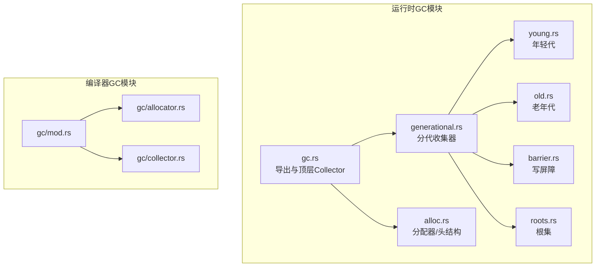
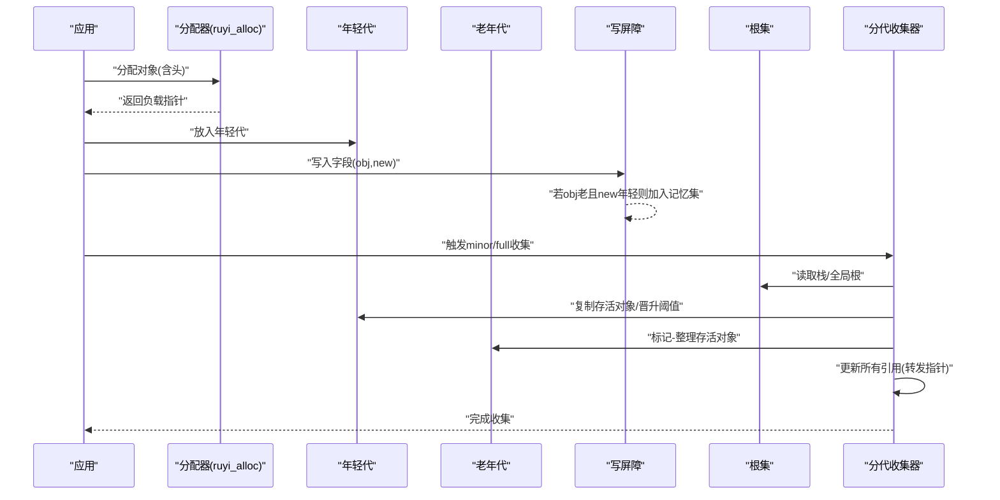
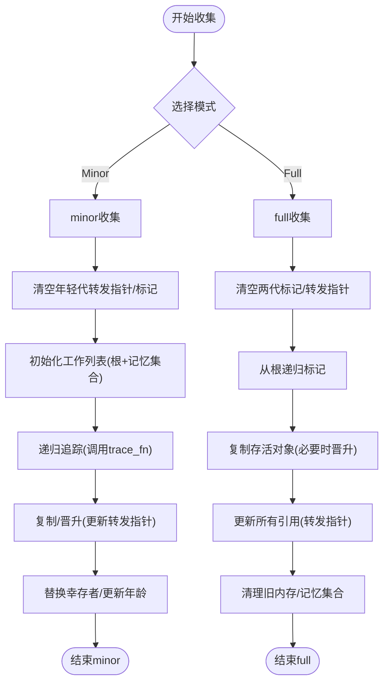
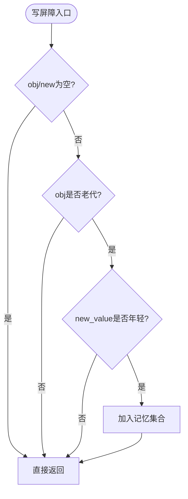
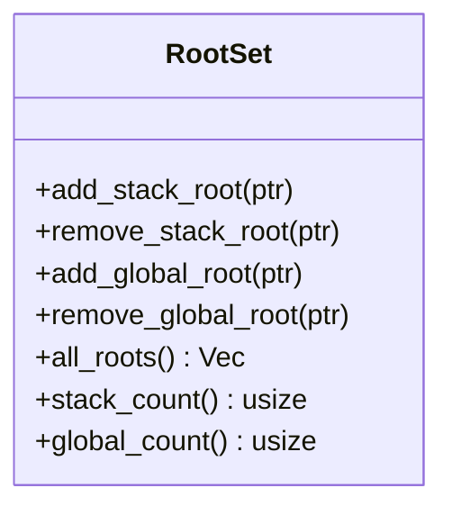
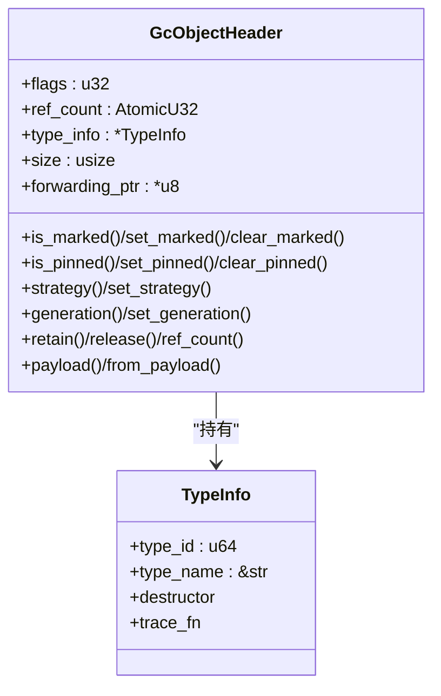
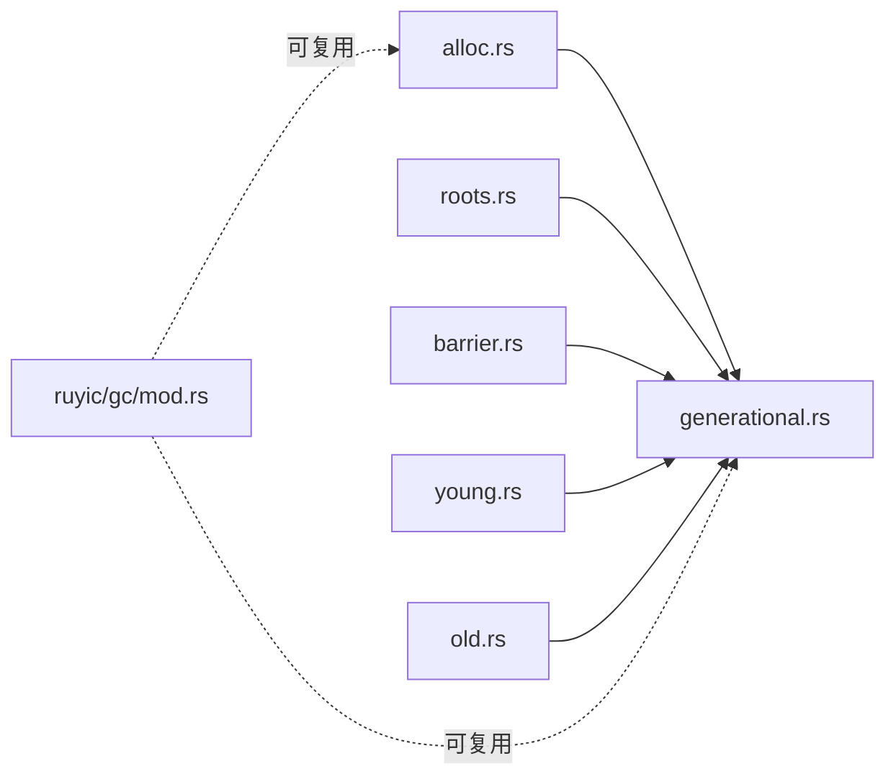

# 垃圾回收器扩展

<cite>
**本文引用的文件**
- [crates/ruyi_runtime/src/gc.rs](file://crates/ruyi_runtime/src/gc.rs)
- [crates/ruyi_runtime/src/gc/generational.rs](file://crates/ruyi_runtime/src/gc/generational.rs)
- [crates/ruyi_runtime/src/gc/barrier.rs](file://crates/ruyi_runtime/src/gc/barrier.rs)
- [crates/ruyi_runtime/src/gc/young.rs](file://crates/ruyi_runtime/src/gc/young.rs)
- [crates/ruyi_runtime/src/gc/old.rs](file://crates/ruyi_runtime/src/gc/old.rs)
- [crates/ruyi_runtime/src/gc/roots.rs](file://crates/ruyi_runtime/src/gc/roots.rs)
- [crates/ruyi_runtime/src/alloc.rs](file://crates/ruyi_runtime/src/alloc.rs)
- [crates/ruyic/src/gc/allocator.rs](file://crates/ruyic/src/gc/allocator.rs)
- [crates/ruyic/src/gc/collector.rs](file://crates/ruyic/src/gc/collector.rs)
- [crates/ruyic/src/gc/mod.rs](file://crates/ruyic/src/gc/mod.rs)
- [crates/ruyi_runtime/tests/gc_async_roots.rs](file://crates/ruyi_runtime/tests/gc_async_roots.rs)
- [crates/ruyi_runtime/tests/gc_thread_local.rs](file://crates/ruyi_runtime/tests/gc_thread_local.rs)
</cite>

## 目录
1. [简介](#简介)
2. [项目结构](#项目结构)
3. [核心组件](#核心组件)
4. [架构总览](#架构总览)
5. [详细组件分析](#详细组件分析)
6. [依赖关系分析](#依赖关系分析)
7. [性能考量](#性能考量)
8. [故障排查指南](#故障排查指南)
9. [结论](#结论)
10. [附录](#附录)

## 简介
本文件面向Ruyi垃圾回收器扩展，系统性阐述分代垃圾回收器的设计与实现，覆盖年轻代与老年代的内存管理策略、写屏障（Write Barrier）的工作原理与使用场景、根集（Root Set）的管理与扫描机制，并提供新GC算法（如标记-清除、复制收集）的集成指南、内存分配器扩展接口与池化技术建议，以及性能优化与调试最佳实践。目标是帮助开发者在不破坏现有安全模型的前提下，平滑地引入或定制GC行为。

## 项目结构
Ruyi的运行时GC位于运行时库中，采用模块化组织：顶层导出GC入口，子模块分别实现分代收集、写屏障、根集、年轻/老年代等；同时提供基础分配器与类型信息结构，支撑GC对象的生命周期管理。编译器侧存在占位的GC模块，用于后续扩展。

**图表来源**
- [crates/ruyi_runtime/src/gc.rs:1-377](file://crates/ruyi_runtime/src/gc.rs#L1-L377)
- [crates/ruyi_runtime/src/gc/generational.rs:1-743](file://crates/ruyi_runtime/src/gc/generational.rs#L1-L743)
- [crates/ruyi_runtime/src/gc/young.rs:1-84](file://crates/ruyi_runtime/src/gc/young.rs#L1-L84)
- [crates/ruyi_runtime/src/gc/old.rs:1-64](file://crates/ruyi_runtime/src/gc/old.rs#L1-L64)
- [crates/ruyi_runtime/src/gc/barrier.rs:1-141](file://crates/ruyi_runtime/src/gc/barrier.rs#L1-L141)
- [crates/ruyi_runtime/src/gc/roots.rs:1-182](file://crates/ruyi_runtime/src/gc/roots.rs#L1-L182)
- [crates/ruyi_runtime/src/alloc.rs:1-405](file://crates/ruyi_runtime/src/alloc.rs#L1-L405)
- [crates/ruyic/src/gc/mod.rs:1-5](file://crates/ruyic/src/gc/mod.rs#L1-L5)
- [crates/ruyic/src/gc/allocator.rs:1-17](file://crates/ruyic/src/gc/allocator.rs#L1-L17)
- [crates/ruyic/src/gc/collector.rs:1-15](file://crates/ruyic/src/gc/collector.rs#L1-L15)

**章节来源**
- [crates/ruyi_runtime/src/gc.rs:1-377](file://crates/ruyi_runtime/src/gc.rs#L1-L377)
- [crates/ruyi_runtime/src/gc/generational.rs:1-743](file://crates/ruyi_runtime/src/gc/generational.rs#L1-L743)
- [crates/ruyi_runtime/src/gc/young.rs:1-84](file://crates/ruyi_runtime/src/gc/young.rs#L1-L84)
- [crates/ruyi_runtime/src/gc/old.rs:1-64](file://crates/ruyi_runtime/src/gc/old.rs#L1-L64)
- [crates/ruyi_runtime/src/gc/barrier.rs:1-141](file://crates/ruyi_runtime/src/gc/barrier.rs#L1-L141)
- [crates/ruyi_runtime/src/gc/roots.rs:1-182](file://crates/ruyi_runtime/src/gc/roots.rs#L1-L182)
- [crates/ruyi_runtime/src/alloc.rs:1-405](file://crates/ruyi_runtime/src/alloc.rs#L1-L405)
- [crates/ruyic/src/gc/mod.rs:1-5](file://crates/ruyic/src/gc/mod.rs#L1-L5)
- [crates/ruyic/src/gc/allocator.rs:1-17](file://crates/ruyic/src/gc/allocator.rs#L1-L17)
- [crates/ruyic/src/gc/collector.rs:1-15](file://crates/ruyic/src/gc/collector.rs#L1-L15)

## 核心组件
- 分代收集器（GenerationalCollector）
  - 年轻代（复制/晋升）+ 老年代（标记-整理）混合策略，支持跨代引用追踪与写屏障。
- 写屏障（WriteBarrier）
  - 记录从老到年轻的潜在写入，维护“记忆集合”（remembered set），确保minor GC正确扫描。
- 根集（RootSet）
  - 分离栈根与全局根，统一作为GC起点；支持异步任务扫描注册。
- 年轻代（YoungGeneration）
  - 新生对象驻留，按阈值晋升至老年代；记录年龄以控制晋升时机。
- 老年代（OldGeneration）
  - 长期存活对象驻留，采用标记-整理减少碎片。
- 分配器与对象头（alloc.rs）
  - 统一的GC对象布局（头+负载），支持GC与ARC双模式；提供分配/释放/扩容工具函数。

**章节来源**
- [crates/ruyi_runtime/src/gc/generational.rs:12-521](file://crates/ruyi_runtime/src/gc/generational.rs#L12-L521)
- [crates/ruyi_runtime/src/gc/barrier.rs:7-86](file://crates/ruyi_runtime/src/gc/barrier.rs#L7-L86)
- [crates/ruyi_runtime/src/gc/roots.rs:7-128](file://crates/ruyi_runtime/src/gc/roots.rs#L7-L128)
- [crates/ruyi_runtime/src/gc/young.rs:6-83](file://crates/ruyi_runtime/src/gc/young.rs#L6-L83)
- [crates/ruyi_runtime/src/gc/old.rs:5-63](file://crates/ruyi_runtime/src/gc/old.rs#L5-L63)
- [crates/ruyi_runtime/src/alloc.rs:37-181](file://crates/ruyi_runtime/src/alloc.rs#L37-L181)

## 架构总览
下图展示分代GC的整体交互：分配器负责对象创建与头初始化；根集提供起点；写屏障跟踪跨代写入；年轻代进行复制/晋升；老年代进行标记-整理；最终更新所有引用。

**图表来源**
- [crates/ruyi_runtime/src/gc/generational.rs:146-381](file://crates/ruyi_runtime/src/gc/generational.rs#L146-L381)
- [crates/ruyi_runtime/src/gc/barrier.rs:24-75](file://crates/ruyi_runtime/src/gc/barrier.rs#L24-L75)
- [crates/ruyi_runtime/src/gc/roots.rs:100-121](file://crates/ruyi_runtime/src/gc/roots.rs#L100-L121)
- [crates/ruyi_runtime/src/gc/young.rs:34-76](file://crates/ruyi_runtime/src/gc/young.rs#L34-L76)
- [crates/ruyi_runtime/src/gc/old.rs:21-56](file://crates/ruyi_runtime/src/gc/old.rs#L21-L56)
- [crates/ruyi_runtime/src/alloc.rs:225-298](file://crates/ruyi_runtime/src/alloc.rs#L225-L298)

## 详细组件分析

### 分代收集器（GenerationalCollector）
- 设计要点
  - 年轻代采用复制收集（复制存活对象到survivor区，未存活回收），通过年龄阈值决定晋升。
  - 老年代采用标记-整理（mark-compact），降低碎片。
  - 写屏障配合记忆集合，保证minor GC能正确扫描跨代引用。
  - 根集分为栈根与全局根，异步任务扫描后可临时注册为根。
- 关键流程
  - minor收集：清空转发指针 → 初始化工作列表（根+记忆集合）→ 追踪可达对象 → 复制/晋升 → 更新年龄/替换幸存者。
  - full收集：清空标记/转发 → 从根递归标记 → 复制存活对象到新位置（必要时晋升）→ 更新所有引用 → 清理记忆集合。
- 接口要点
  - 提供堆外分配、根注册/移除、异步根扫描、启用/禁用收集等。

**图表来源**
- [crates/ruyi_runtime/src/gc/generational.rs:146-381](file://crates/ruyi_runtime/src/gc/generational.rs#L146-L381)

**章节来源**
- [crates/ruyi_runtime/src/gc/generational.rs:12-521](file://crates/ruyi_runtime/src/gc/generational.rs#L12-L521)

### 写屏障（WriteBarrier）
- 目标
  - 检测从老年代到年轻代的写入，将老对象加入记忆集合，避免minor GC遗漏跨代引用。
- 行为
  - 在写入前/后调用，若obj为老对象且new_value指向年轻对象，则将obj加入记忆集合。
  - 提供显式添加、快照读取、清理、清洗（剔除非老对象）等操作。
- 使用场景
  - 对象字段赋值年轻对象（典型跨代写）。
  - 手动维护跨代引用（如容器内部指针）。

**图表来源**
- [crates/ruyi_runtime/src/gc/barrier.rs:24-75](file://crates/ruyi_runtime/src/gc/barrier.rs#L24-L75)

**章节来源**
- [crates/ruyi_runtime/src/gc/barrier.rs:7-86](file://crates/ruyi_runtime/src/gc/barrier.rs#L7-L86)

### 根集（RootSet）
- 结构
  - 分离栈根与全局根，均以对象头指针存储；注册时设置“固定”标志，防止移动。
- 功能
  - 添加/移除栈根/全局根；合并输出所有根；统计数量。
- 异步根
  - 支持扫描活跃异步任务的栈帧，提取可能指向GC对象的指针并临时注册为根。

**图表来源**
- [crates/ruyi_runtime/src/gc/roots.rs:11-122](file://crates/ruyi_runtime/src/gc/roots.rs#L11-L122)

**章节来源**
- [crates/ruyi_runtime/src/gc/roots.rs:7-128](file://crates/ruyi_runtime/src/gc/roots.rs#L7-L128)

### 年轻代（YoungGeneration）
- 职责
  - 新对象进入年轻代；记录每个对象年龄；达到阈值晋升至老年代。
- 接口
  - 分配、替换幸存者、设置/查询年龄、清空等。

**章节来源**
- [crates/ruyi_runtime/src/gc/young.rs:6-83](file://crates/ruyi_runtime/src/gc/young.rs#L6-L83)

### 老年代（OldGeneration）
- 职责
  - 存放长期存活对象；full收集时进行标记-整理。
- 接口
  - 直接分配至老年代、替换对象、清空、追加对象等。

**章节来源**
- [crates/ruyi_runtime/src/gc/old.rs:5-63](file://crates/ruyi_runtime/src/gc/old.rs#L5-L63)

### 分配器与对象头（alloc.rs）
- 对象头
  - 包含标记位、固定位、策略位（GC/ARC）、代位、引用计数、类型信息、大小、转发指针等。
- 分配/释放
  - 统一布局：头+负载；分配时写入头；释放时可调用析构器；支持扩容。
- 类型信息
  - trace_fn回调用于遍历对象内部的GC指针字段，驱动GC追踪。

**图表来源**
- [crates/ruyi_runtime/src/alloc.rs:37-181](file://crates/ruyi_runtime/src/alloc.rs#L37-L181)

**章节来源**
- [crates/ruyi_runtime/src/alloc.rs:1-405](file://crates/ruyi_runtime/src/alloc.rs#L1-L405)

### 编译器侧GC模块（占位）
- 当前状态
  - 编译器侧提供GC模块占位，包含Allocator与Collector的简单实现，尚未接入运行时GC。
- 扩展建议
  - 可复用运行时的TypeInfo/trace_fn约定，使编译器生成的代码与运行时GC一致。

**章节来源**
- [crates/ruyic/src/gc/mod.rs:1-5](file://crates/ruyic/src/gc/mod.rs#L1-L5)
- [crates/ruyic/src/gc/allocator.rs:1-17](file://crates/ruyic/src/gc/allocator.rs#L1-L17)
- [crates/ruyic/src/gc/collector.rs:1-15](file://crates/ruyic/src/gc/collector.rs#L1-L15)

## 依赖关系分析
- 运行时GC对分配器与对象头强依赖，二者共同构成GC对象的物理布局与生命周期管理。
- 分代收集器依赖年轻代、老年代、写屏障与根集；写屏障依赖根集中的老对象集合；根集独立于收集器但被广泛使用。
- 编译器侧GC模块目前与运行时解耦，未来可复用运行时的类型信息与追踪协议。

**图表来源**
- [crates/ruyi_runtime/src/gc/generational.rs:1-521](file://crates/ruyi_runtime/src/gc/generational.rs#L1-L521)
- [crates/ruyi_runtime/src/gc/young.rs:1-84](file://crates/ruyi_runtime/src/gc/young.rs#L1-L84)
- [crates/ruyi_runtime/src/gc/old.rs:1-64](file://crates/ruyi_runtime/src/gc/old.rs#L1-L64)
- [crates/ruyi_runtime/src/gc/barrier.rs:1-141](file://crates/ruyi_runtime/src/gc/barrier.rs#L1-L141)
- [crates/ruyi_runtime/src/gc/roots.rs:1-182](file://crates/ruyi_runtime/src/gc/roots.rs#L1-L182)
- [crates/ruyi_runtime/src/alloc.rs:1-405](file://crates/ruyi_runtime/src/alloc.rs#L1-L405)
- [crates/ruyic/src/gc/mod.rs:1-5](file://crates/ruyic/src/gc/mod.rs#L1-L5)

**章节来源**
- [crates/ruyi_runtime/src/gc/generational.rs:1-521](file://crates/ruyi_runtime/src/gc/generational.rs#L1-L521)
- [crates/ruyi_runtime/src/gc/young.rs:1-84](file://crates/ruyi_runtime/src/gc/young.rs#L1-L84)
- [crates/ruyi_runtime/src/gc/old.rs:1-64](file://crates/ruyi_runtime/src/gc/old.rs#L1-L64)
- [crates/ruyi_runtime/src/gc/barrier.rs:1-141](file://crates/ruyi_runtime/src/gc/barrier.rs#L1-L141)
- [crates/ruyi_runtime/src/gc/roots.rs:1-182](file://crates/ruyi_runtime/src/gc/roots.rs#L1-L182)
- [crates/ruyi_runtime/src/alloc.rs:1-405](file://crates/ruyi_runtime/src/alloc.rs#L1-L405)
- [crates/ruyic/src/gc/mod.rs:1-5](file://crates/ruyic/src/gc/mod.rs#L1-L5)

## 性能考量
- 年龄阈值与晋升策略
  - 合理设置年轻代晋升阈值，平衡minor收集频率与晋升成本；对热点对象可适当提高阈值。
- 记忆集合规模
  - 控制写屏障触发频率与记忆集合大小，避免过多跨代写导致minor扫描开销上升。
- 标记-整理优化
  - 老年代采用标记-整理减少碎片，但需注意更新引用的成本；可考虑延迟更新或批量处理。
- 根集扫描
  - 异步根扫描应尽量短小精确，避免扫描无关数据；可按任务粒度增量扫描。
- 分配器与池化
  - 利用分配器的统一头布局，结合对象池（同类型/尺寸）减少频繁分配/释放带来的压力；注意池化对象的生命周期与析构顺序。
- 并发与隔离
  - 线程本地堆隔离可降低锁竞争；但需确保线程退出时资源清理不会影响主堆。

[本节为通用指导，无需列出具体文件来源]

## 故障排查指南
- 常见问题与定位
  - 收集后对象丢失：检查根集注册是否完整（栈根/全局根/异步根）；确认写屏障是否正确记录跨代写。
  - 死循环/卡顿：观察记忆集合是否异常膨胀；检查full收集频率与引用更新成本。
  - 线程间干扰：验证线程本地堆隔离是否生效；避免跨线程直接访问其他线程的GC指针。
- 测试参考
  - 异步根扫描测试：验证挂起任务中的GC指针在收集后仍可存活。
  - 线程本地GC测试：验证不同线程的收集互不影响，线程退出后主堆稳定。

**章节来源**
- [crates/ruyi_runtime/tests/gc_async_roots.rs:46-355](file://crates/ruyi_runtime/tests/gc_async_roots.rs#L46-L355)
- [crates/ruyi_runtime/tests/gc_thread_local.rs:17-226](file://crates/ruyi_runtime/tests/gc_thread_local.rs#L17-L226)

## 结论
Ruyi的分代GC以年轻代复制与老年代标记-整理为核心，辅以写屏障与根集管理，形成高效稳定的回收体系。通过统一的对象头与类型信息协议，既保障了安全性，也为后续扩展（如引入新的GC算法、池化分配策略）提供了清晰的接口边界。建议在实际工程中结合业务特征调整晋升阈值与根集扫描策略，并持续关注写屏障触发与full收集的成本，以获得更优的吞吐与延迟表现。

## 附录

### 新GC算法集成指南（概念性）
- 标记-清除（Mark-Sweep）
  - 适合低碎片需求但暂停较长的场景；可作为运行时的后备策略。
  - 集成要点：遵循统一的根集扫描与对象追踪协议；实现对象标记与清扫阶段。
- 复制收集（Copy Collector）
  - 适合年轻代，零碎片；可与晋升阈值结合。
  - 集成要点：实现复制过程中的转发指针更新；确保trace_fn正确遍历内部指针。
- 三色标记（Tri-color Marking）
  - 适合并发/增量场景；需解决写屏障与SATB（Snapshot-At-The-Beginning）一致性。
  - 集成要点：定义写屏障钩子；维护写屏障日志或记忆集合；实现增量推进与恢复。

[本节为概念性说明，不直接对应具体源码文件]