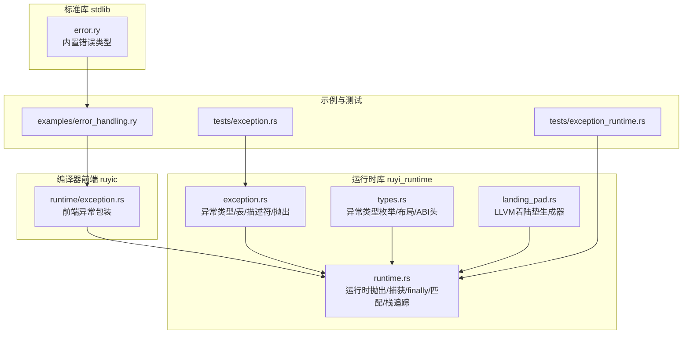
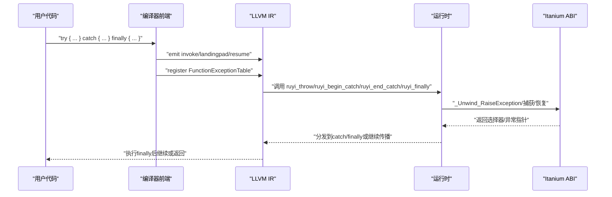
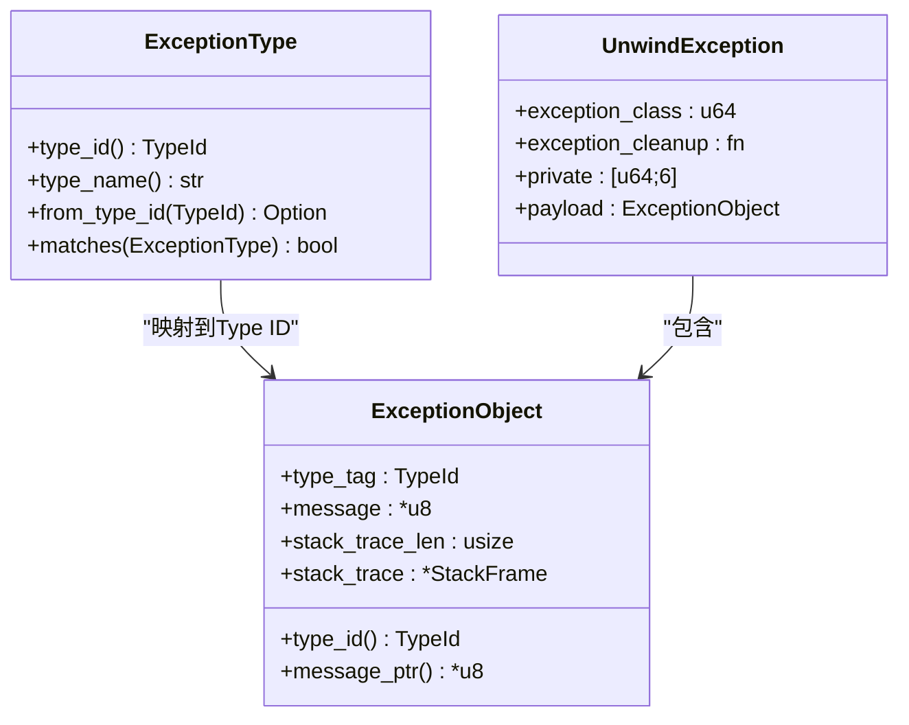
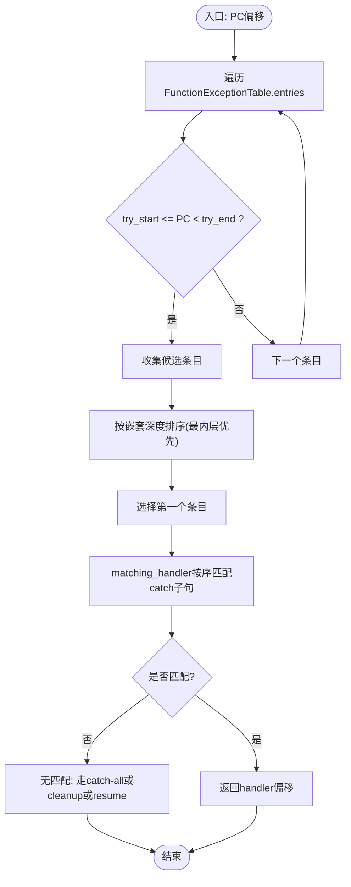
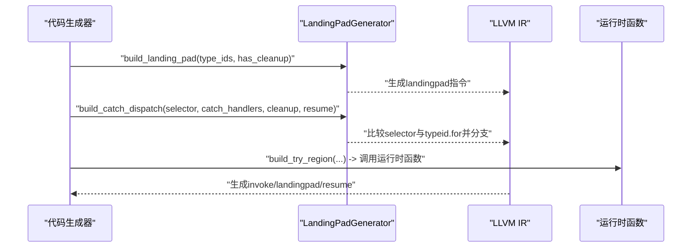
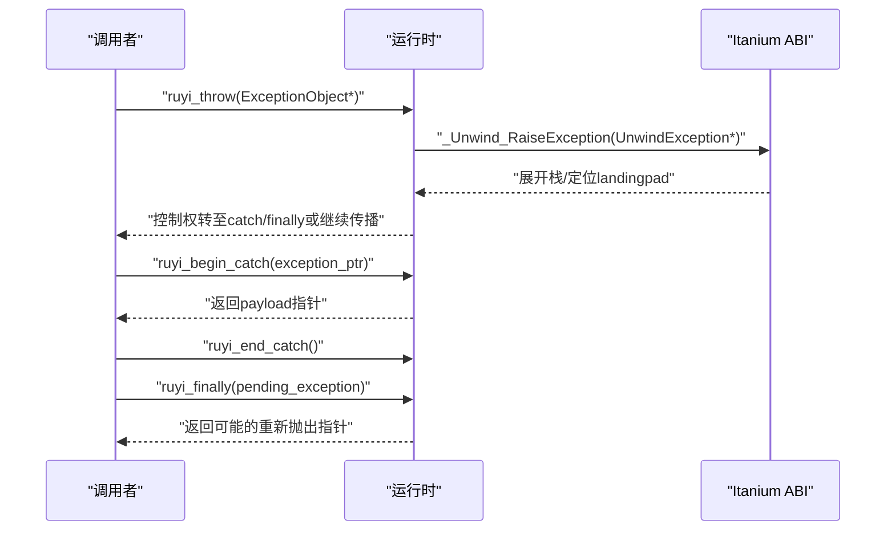
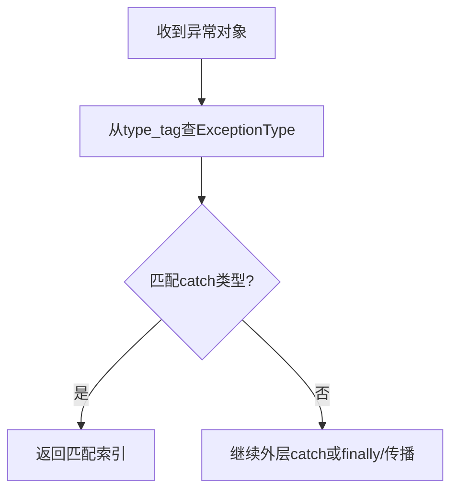
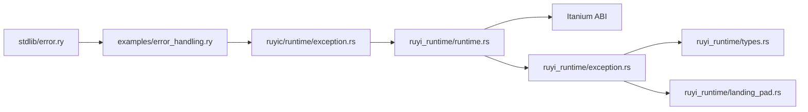

# 异常处理系统扩展

<cite>
**本文引用的文件**
- [exception.rs](file://crates/ruyi_runtime/src/exception.rs)
- [types.rs](file://crates/ruyi_runtime/src/exception/types.rs)
- [landing_pad.rs](file://crates/ruyi_runtime/src/exception/landing_pad.rs)
- [runtime.rs](file://crates/ruyi_runtime/src/exception/runtime.rs)
- [exception.rs](file://crates/ruyic/src/runtime/exception.rs)
- [exception.rs](file://crates/ruyi_runtime/tests/exception.rs)
- [exception_runtime.rs](file://crates/ruyi_runtime/tests/exception_runtime.rs)
- [error.ry](file://stdlib/error.ry)
- [error_handling.ry](file://examples/error_handling.ry)
- [try_catch.ry](file://examples/try_catch.ry)
- [custom_errors.ry](file://crates/ruyic/tests/integration/cases/errors/custom_errors.ry)
- [try_catch.ry](file://crates/ruyic/tests/integration/cases/errors/try_catch.ry)
- [Cargo.toml](file://Cargo.toml)
- [Cargo.toml](file://crates/ruyi_runtime/Cargo.toml)
</cite>

## 目录
1. [简介](#简介)
2. [项目结构](#项目结构)
3. [核心组件](#核心组件)
4. [架构总览](#架构总览)
5. [详细组件分析](#详细组件分析)
6. [依赖分析](#依赖分析)
7. [性能考虑](#性能考虑)
8. [故障排查指南](#故障排查指南)
9. [结论](#结论)
10. [附录](#附录)

## 简介
本文件面向Ruyi异常处理系统的扩展开发者，系统性阐述以下主题：
- 自定义异常类的定义与注册机制
- 异常表（Exception Table）的结构、注册与查找
- 着陆垫（Landing Pad）的实现原理与零成本异常的LLVM IR生成
- 栈追踪捕获与处理的扩展方法
- 异常匹配与抛出机制的扩展点
- 性能优化策略、调试技巧与异常安全最佳实践

## 项目结构
Ruyi的异常处理由运行时库与编译器前端协作完成：
- 运行时库（ruyi_runtime）：提供异常对象布局、类型系统、异常表、着陆垫生成器、运行时抛出/捕获/finally支持、栈追踪捕获占位等。
- 编译器前端（ruyic）：负责将Ruyi语言的try/catch/finally语法映射到LLVM IR，并通过运行时函数与全局符号完成异常传播。
- 标准库（stdlib）：提供内置错误类型，供用户在语言层使用。
- 示例与测试：覆盖基本用法、嵌套try/catch、finally保证、自定义错误类型等。

**图表来源**
- [exception.rs:1-377](file://crates/ruyi_runtime/src/exception.rs#L1-L377)
- [types.rs:1-167](file://crates/ruyi_runtime/src/exception/types.rs#L1-L167)
- [landing_pad.rs:1-222](file://crates/ruyi_runtime/src/exception/landing_pad.rs#L1-L222)
- [runtime.rs:1-359](file://crates/ruyi_runtime/src/exception/runtime.rs#L1-L359)
- [exception.rs:1-22](file://crates/ruyic/src/runtime/exception.rs#L1-L22)
- [error.ry:1-106](file://stdlib/error.ry#L1-L106)
- [exception_runtime.rs:1-588](file://crates/ruyi_runtime/tests/exception_runtime.rs#L1-L588)
- [exception.rs:1-232](file://crates/ruyi_runtime/tests/exception.rs#L1-L232)

**章节来源**
- [Cargo.toml:1-40](file://Cargo.toml#L1-L40)
- [Cargo.toml:1-17](file://crates/ruyi_runtime/Cargo.toml#L1-L17)

## 核心组件
- 异常类型与ID：运行时维护内置类型ID与类型枚举之间的映射，用于catch过滤与匹配。
- 异常对象布局：遵循Itanium ABI头部，包含类型标签、消息指针、栈追踪数组等。
- 异常表与条目：每函数一张异常表，记录受保护指令范围、着陆垫偏移、catch子句与finally标记。
- 着陆垫描述符与生成器：根据catch类型列表生成landingpad指令、invoke调用、resume分支与dispatch链。
- 运行时抛出/捕获/finally：封装Itanium ABI调用，提供匹配与栈追踪捕获接口。
- 前端异常包装：编译期将语言级异常包装为运行时可识别的对象。

**章节来源**
- [exception.rs:9-377](file://crates/ruyi_runtime/src/exception.rs#L9-L377)
- [types.rs:1-167](file://crates/ruyi_runtime/src/exception/types.rs#L1-L167)
- [runtime.rs:1-359](file://crates/ruyi_runtime/src/exception/runtime.rs#L1-L359)
- [landing_pad.rs:1-222](file://crates/ruyi_runtime/src/exception/landing_pad.rs#L1-L222)
- [exception.rs:1-22](file://crates/ruyic/src/runtime/exception.rs#L1-L22)

## 架构总览
Ruyi采用“语言层语法”+“编译期IR生成”+“运行时异常传播”的三层架构：
- 语言层：用户编写try/catch/finally与throw语句。
- 编译期：生成invoke/landingpad/resume指令，注册异常表，链接运行时函数。
- 运行时：执行栈展开、类型匹配、finally保证、清理资源。

**图表来源**
- [runtime.rs:24-96](file://crates/ruyi_runtime/src/exception/runtime.rs#L24-L96)
- [landing_pad.rs:39-91](file://crates/ruyi_runtime/src/exception/landing_pad.rs#L39-L91)
- [exception.rs:118-182](file://crates/ruyi_runtime/src/exception.rs#L118-L182)

## 详细组件分析

### 异常类型与对象布局
- 内置异常类型：Error、TypeError、RangeError、RuntimeError；每个类型对应一个唯一Type ID。
- 类型ID映射：从类型枚举到Type ID，以及反向映射，用于运行时匹配。
- 异常对象布局：包含类型标签、UTF-8消息指针、栈追踪长度与数组指针。
- Itanium ABI头部：包含异常类标识、清理回调、私有字段与payload。

**图表来源**
- [types.rs:11-111](file://crates/ruyi_runtime/src/exception/types.rs#L11-L111)

**章节来源**
- [types.rs:1-167](file://crates/ruyi_runtime/src/exception/types.rs#L1-L167)

### 异常表与条目
- FunctionExceptionTable：按函数名组织的异常表，包含多个ExceptionTableEntry。
- ExceptionTableEntry：描述单个try区域的起止PC、着陆垫偏移、catch子句序列与finally标记。
- 查找策略：entry_for_pc根据PC落在哪个try范围内返回最内层（最具体）的条目。
- 匹配策略：matching_handler按顺序匹配catch子句，未命中则进入catch-all或cleanup。

**图表来源**
- [exception.rs:123-149](file://crates/ruyi_runtime/src/exception.rs#L123-L149)
- [exception.rs:33-100](file://crates/ruyi_runtime/src/exception.rs#L33-L100)

**章节来源**
- [exception.rs:118-182](file://crates/ruyi_runtime/src/exception.rs#L118-L182)

### 着陆垫与LLVM IR生成
- LandingPadDescriptor/LandingPadAction：描述landingpad的动作序列（catch/filter/cleanup），以及catch/cleanup目标块。
- LandingPadGenerator：生成landingpad指令、invoke调用、resume、提取异常指针/选择器、构建catch分发链。
- ExceptionRuntime：高层封装，将ExceptionType映射为Type ID，生成try区域的landingpad并连接finally与resume路径。

**图表来源**
- [landing_pad.rs:18-222](file://crates/ruyi_runtime/src/exception/landing_pad.rs#L18-L222)
- [runtime.rs:135-277](file://crates/ruyi_runtime/src/exception/runtime.rs#L135-L277)

**章节来源**
- [landing_pad.rs:1-222](file://crates/ruyi_runtime/src/exception/landing_pad.rs#L1-L222)
- [runtime.rs:123-277](file://crates/ruyi_runtime/src/exception/runtime.rs#L123-L277)

### 抛出、捕获与finally
- 抛出：ruyi_throw分配UnwindException，填充头部与payload，调用_itanium ABI抛出。
- 捕获：ruyi_begin_catch调用__cxa_begin_catch并返回payload指针；ruyi_end_catch释放资源。
- finally：ruyi_finally在无活动catch时传递异常指针，确保finally块执行后异常继续传播。
- 匹配：ruyi_match_exception基于类型枚举的匹配规则进行匹配，支持Error作为超类型。

**图表来源**
- [runtime.rs:24-96](file://crates/ruyi_runtime/src/exception/runtime.rs#L24-L96)

**章节来源**
- [runtime.rs:1-359](file://crates/ruyi_runtime/src/exception/runtime.rs#L1-L359)

### 栈追踪捕获与处理
- 当前实现：capture_stack_trace返回空占位，便于早期集成验证。
- 扩展建议：在full实现中使用unwind库遍历栈帧，填充StackFrame（函数名、文件、行号），并与异常对象关联。

**章节来源**
- [runtime.rs:115-121](file://crates/ruyi_runtime/src/exception/runtime.rs#L115-L121)
- [exception.rs:212-229](file://crates/ruyi_runtime/src/exception.rs#L212-L229)

### 异常匹配与抛出机制扩展
- 语言层：标准库提供Error及派生类型，用户可自定义类作为异常类型。
- 类型检查：ExceptionType::matches实现扁平类型层次，Error可匹配所有内置类型。
- 转换逻辑：通过ExceptionType::from_type_id将运行时Type ID还原为类型枚举，再进行匹配。

**图表来源**
- [types.rs:44-62](file://crates/ruyi_runtime/src/exception/types.rs#L44-L62)
- [runtime.rs:98-113](file://crates/ruyi_runtime/src/exception/runtime.rs#L98-L113)

**章节来源**
- [error.ry:1-106](file://stdlib/error.ry#L1-L106)
- [types.rs:1-167](file://crates/ruyi_runtime/src/exception/types.rs#L1-L167)
- [runtime.rs:98-113](file://crates/ruyi_runtime/src/exception/runtime.rs#L98-L113)

### 自定义异常类的定义与注册
- 定义：用户可在语言层定义类作为异常类型（如ValidationError），并在需要时扩展更多派生类型。
- 注册：运行时通过Type ID与类型枚举映射实现类型识别；编译期将catch子句映射为Type ID列表，运行时据此匹配。
- 建议：新增异常类型时，同步更新类型ID生成策略与匹配规则，确保catch-all行为符合预期。

**章节来源**
- [error.ry:1-106](file://stdlib/error.ry#L1-L106)
- [types.rs:23-62](file://crates/ruyi_runtime/src/exception/types.rs#L23-L62)
- [exception.rs:18-31](file://crates/ruyi_runtime/src/exception.rs#L18-L31)

## 依赖分析
- 语言层依赖：示例与测试展示了try/catch/finally、自定义错误类型、嵌套异常传播等场景。
- 运行时依赖：依赖Itanium ABI与CXA函数，通过ruyi_*运行时函数桥接。
- 编译期依赖：inkwell用于LLVM IR生成，启用时提供着陆垫生成器与运行时构建器。

**图表来源**
- [error.ry:1-106](file://stdlib/error.ry#L1-L106)
- [error_handling.ry:1-230](file://examples/error_handling.ry#L1-L230)
- [exception.rs:1-22](file://crates/ruyic/src/runtime/exception.rs#L1-L22)
- [runtime.rs:1-359](file://crates/ruyi_runtime/src/exception/runtime.rs#L1-L359)
- [exception.rs:1-377](file://crates/ruyi_runtime/src/exception.rs#L1-L377)
- [types.rs:1-167](file://crates/ruyi_runtime/src/exception/types.rs#L1-L167)
- [landing_pad.rs:1-222](file://crates/ruyi_runtime/src/exception/landing_pad.rs#L1-L222)

**章节来源**
- [Cargo.toml:1-40](file://Cargo.toml#L1-L40)
- [Cargo.toml:1-17](file://crates/ruyi_runtime/Cargo.toml#L1-L17)

## 性能考虑
- 零成本异常：通过LLVM landingpad与Itanium ABI实现，避免额外的动态开销。
- catch分发：按序匹配，建议将最可能命中的类型置于前面，减少比较次数。
- finally保证：尽量保持finally块轻量，避免在finally中抛出新异常。
- 栈追踪：捕获完整栈追踪会带来内存与CPU开销，建议仅在必要时启用。
- 内联与LTO：release配置开启LTO与优化等级，有助于减少异常路径的开销。

[本节为通用指导，无需特定文件来源]

## 故障排查指南
- 测试验证：
  - 异常表查找与匹配：验证entry_for_pc与matching_handler的行为。
  - finally保证：验证ruyi_finally在无活动catch时正确传递异常指针。
  - landingpad生成：验证landingpad指令、类型信息全局、选择器提取与分发链。
- 常见问题：
  - 未找到匹配catch：检查catch子句顺序与类型ID映射。
  - finally未执行：确认finally块在异常传播路径上可达。
  - 栈追踪为空：确认capture_stack_trace实现已启用或占位逻辑正确。
- 调试技巧：
  - 使用测试用例模拟跨函数传播与嵌套try/catch。
  - 在编译期打印生成的IR，核对landingpad与invoke指令。
  - 利用断言与panic输出关键状态（如类型ID、PC范围）。

**章节来源**
- [exception_runtime.rs:1-588](file://crates/ruyi_runtime/tests/exception_runtime.rs#L1-L588)
- [exception.rs:1-232](file://crates/ruyi_runtime/tests/exception.rs#L1-L232)

## 结论
Ruyi的异常处理系统以Itanium ABI为基础，结合编译期IR生成与运行时支撑，实现了零成本异常的高效传播。通过扩展异常类型、完善栈追踪、优化catch分发与finally保证，可进一步提升系统的可用性与性能。建议在新增异常类型时统一管理Type ID与匹配规则，并在生产环境中谨慎启用栈追踪以平衡可观测性与性能。

[本节为总结，无需特定文件来源]

## 附录
- 示例与测试用例涵盖：
  - 基本try/catch/finally与多catch子句
  - 自定义错误类型与嵌套异常传播
  - finally在return前的保证
  - 语言层Error及其派生类型

**章节来源**
- [error_handling.ry:1-230](file://examples/error_handling.ry#L1-L230)
- [try_catch.ry:1-14](file://examples/try_catch.ry#L1-L14)
- [custom_errors.ry:1-29](file://crates/ruyic/tests/integration/cases/errors/custom_errors.ry#L1-L29)
- [try_catch.ry:1-11](file://crates/ruyic/tests/integration/cases/errors/try_catch.ry#L1-L11)