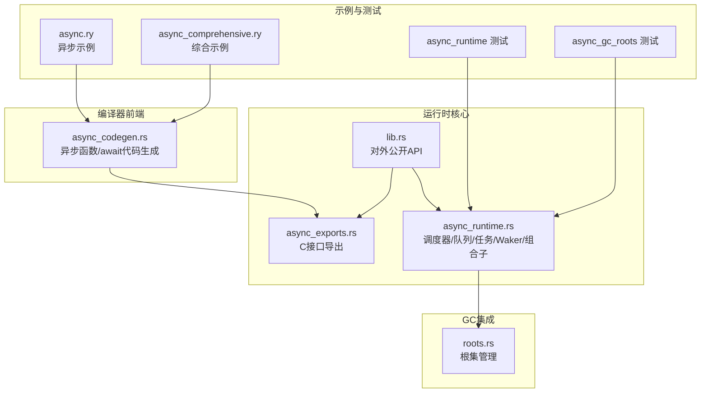
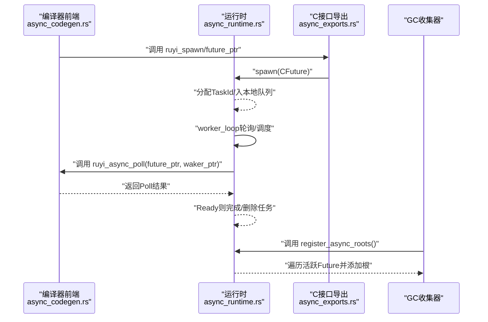
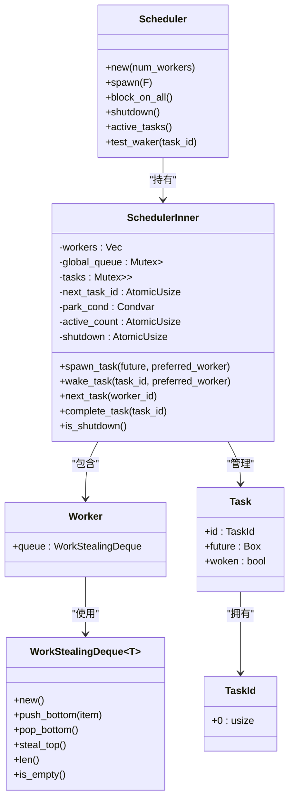
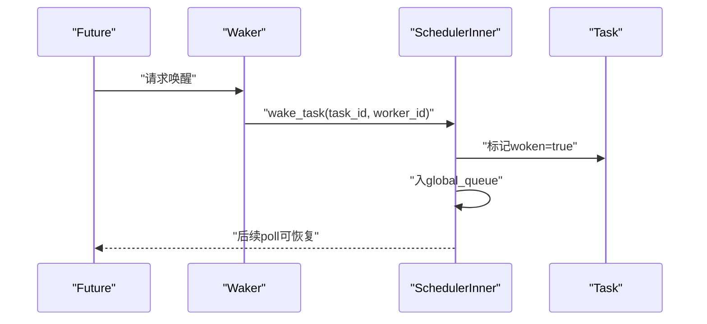
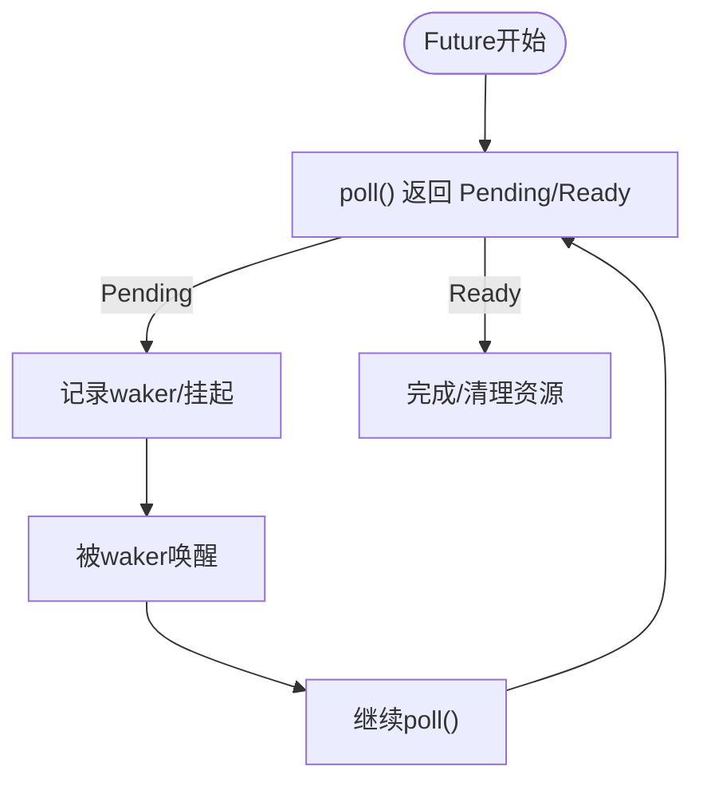
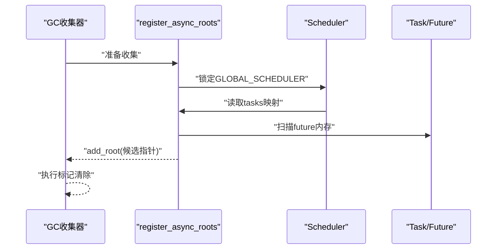
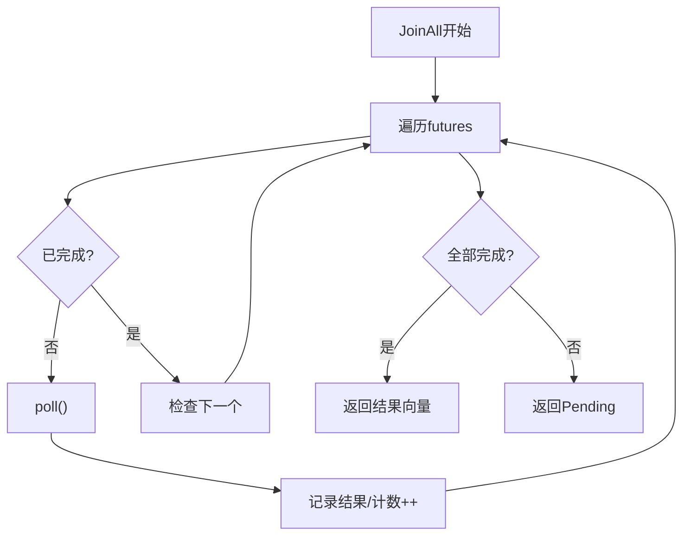
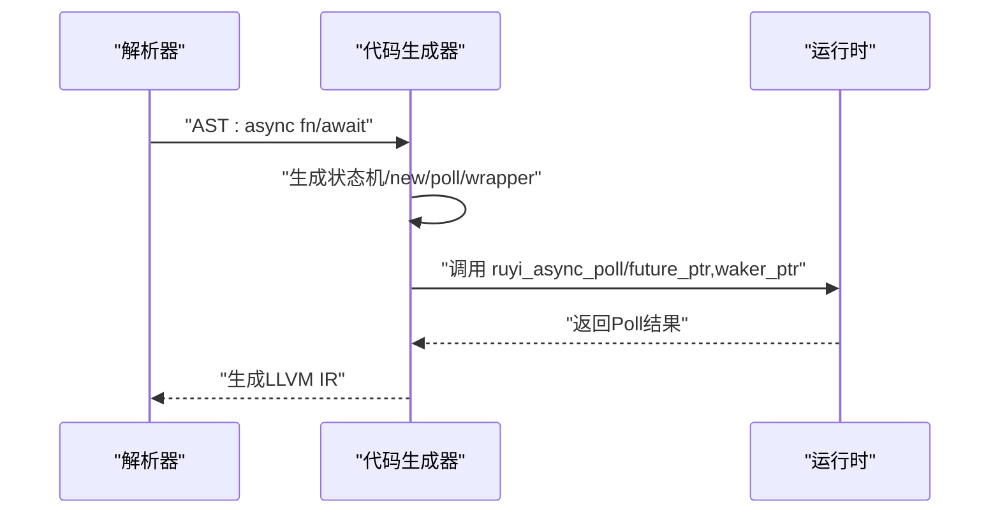
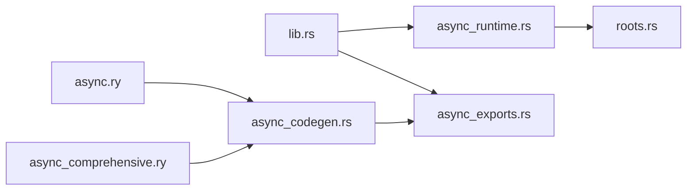

# 异步运行时扩展

<cite>
**本文引用的文件**
- [lib.rs](file://crates/ruyi_runtime/src/lib.rs)
- [async_runtime.rs](file://crates/ruyi_runtime/src/async_runtime.rs)
- [async_exports.rs](file://crates/ruyi_runtime/src/async_exports.rs)
- [roots.rs](file://crates/ruyi_runtime/src/gc/roots.rs)
- [async_runtime 测试](file://crates/ruyi_runtime/tests/async_runtime.rs)
- [async_gc_roots 测试](file://crates/ruyi_runtime/tests/async_gc_roots.rs)
- [async_comprehensive.ry](file://examples/async_comprehensive.ry)
- [async.ry](file://examples/async.ry)
- [async_codegen.rs](file://crates/ruyic/src/codegen/async_codegen.rs)
- [await 集成测试用例](file://crates/ruyic/tests/integration/cases/async/await.ry)
</cite>

## 目录
1. [简介](#简介)
2. [项目结构](#项目结构)
3. [核心组件](#核心组件)
4. [架构总览](#架构总览)
5. [详细组件分析](#详细组件分析)
6. [依赖关系分析](#依赖关系分析)
7. [性能考量](#性能考量)
8. [故障排查指南](#故障排查指南)
9. [结论](#结论)
10. [附录](#附录)

## 简介
本指南面向希望在Ruyi异步运行时系统上进行扩展与深度定制的开发者，围绕以下主题提供系统化文档：工作窃取调度器的扩展方法（含新的调度策略与任务队列管理）、任务管理系统（Task、TaskId、Waker）的扩展设计、Future/Promise机制的扩展（新增异步操作与协程实现）、异步根注册机制（register_async_roots）的使用方法、聚合操作（JoinAll、Race）的扩展实现，以及异步编程最佳实践、性能优化策略与调试监控方法。

## 项目结构
Ruyi异步运行时位于crates/ruyi_runtime中，核心模块包括：
- 异步运行时内核：调度器、工作窃取队列、任务与唤醒器、组合子（JoinAll、Race）
- C接口导出：供编译器前端调用的外部函数封装
- GC集成：异步任务作为GC根的注册与追踪
- 示例与测试：同步演示与异步示例、运行时与GC根测试

**图表来源**
- [lib.rs:11-49](file://crates/ruyi_runtime/src/lib.rs#L11-L49)
- [async_runtime.rs:138-314](file://crates/ruyi_runtime/src/async_runtime.rs#L138-L314)
- [async_exports.rs:43-92](file://crates/ruyi_runtime/src/async_exports.rs#L43-L92)
- [roots.rs:11-128](file://crates/ruyi_runtime/src/gc/roots.rs#L11-L128)
- [async_codegen.rs:206-504](file://crates/ruyic/src/codegen/async_codegen.rs#L206-L504)

**章节来源**
- [lib.rs:11-49](file://crates/ruyi_runtime/src/lib.rs#L11-L49)
- [async_runtime.rs:138-314](file://crates/ruyi_runtime/src/async_runtime.rs#L138-L314)
- [async_exports.rs:43-92](file://crates/ruyi_runtime/src/async_exports.rs#L43-L92)
- [roots.rs:11-128](file://crates/ruyi_runtime/src/gc/roots.rs#L11-L128)
- [async_codegen.rs:206-504](file://crates/ruyic/src/codegen/async_codegen.rs#L206-L504)

## 核心组件
- 调度器与工作窃取队列：每工作线程拥有本地队列，支持全局队列与跨线程窃取，保证高并发下的负载均衡
- 任务与唤醒器：Task封装Box<dyn RuyiFuture>；Waker持有调度器引用与任务ID，用于唤醒
- 组合子：JoinAll并行等待多个Future完成；Race返回首个完成的Future结果
- C接口导出：ruyi_async_poll、ruyi_spawn、ruyi_wake_task、ruyi_run_scheduler
- 异步根注册：register_async_roots将活跃异步任务状态机中的可达指针登记为GC根

**章节来源**
- [async_runtime.rs:26-47](file://crates/ruyi_runtime/src/async_runtime.rs#L26-L47)
- [async_runtime.rs:75-92](file://crates/ruyi_runtime/src/async_runtime.rs#L75-L92)
- [async_runtime.rs:141-156](file://crates/ruyi_runtime/src/async_runtime.rs#L141-L156)
- [async_runtime.rs:458-540](file://crates/ruyi_runtime/src/async_runtime.rs#L458-L540)
- [async_runtime.rs:426-455](file://crates/ruyi_runtime/src/async_runtime.rs#L426-L455)
- [async_exports.rs:45-91](file://crates/ruyi_runtime/src/async_exports.rs#L45-L91)

## 架构总览
Ruyi异步运行时采用“绿色线程+工作窃取”的调度模型，结合编译器前端生成的Future状态机，通过C接口与运行时交互。GC在每次收集前通过register_async_roots扫描活跃任务的状态机内存，确保被挂起的Future可达对象不被回收。

**图表来源**
- [async_codegen.rs:506-561](file://crates/ruyic/src/codegen/async_codegen.rs#L506-L561)
- [async_runtime.rs:387-400](file://crates/ruyi_runtime/src/async_runtime.rs#L387-L400)
- [async_runtime.rs:426-455](file://crates/ruyi_runtime/src/async_runtime.rs#L426-L455)
- [async_exports.rs:68-91](file://crates/ruyi_runtime/src/async_exports.rs#L68-L91)

## 详细组件分析

### 工作窃取调度器扩展
- 扩展点
  - 新调度策略：可替换next_task的策略（如按优先级、CPU亲和、任务类型分发），在SchedulerInner::next_task中注入
  - 任务队列管理：支持多级队列（优先队列、时间片队列）、队列容量与退避策略、跨线程窃取阈值
  - 全局队列优化：引入批处理入队/出队、条件变量超时唤醒、空闲线程自适应休眠
- 关键数据结构
  - Worker持有WorkStealingDeque<TaskId>，支持push_bottom/pop_bottom/steal_top
  - SchedulerInner维护tasks映射、global_queue、active_count、shutdown标志
- 并发与锁粒度
  - 本地队列使用Mutex保护；全局队列使用Mutex保护；通过Condvar协调空闲线程唤醒
  - 任务完成时通知所有等待线程，避免饥饿

**图表来源**
- [async_runtime.rs:138-314](file://crates/ruyi_runtime/src/async_runtime.rs#L138-L314)
- [async_runtime.rs:94-136](file://crates/ruyi_runtime/src/async_runtime.rs#L94-L136)
- [async_runtime.rs:75-92](file://crates/ruyi_runtime/src/async_runtime.rs#L75-L92)
- [async_runtime.rs:71-73](file://crates/ruyi_runtime/src/async_runtime.rs#L71-L73)

**章节来源**
- [async_runtime.rs:138-314](file://crates/ruyi_runtime/src/async_runtime.rs#L138-L314)
- [async_runtime.rs:94-136](file://crates/ruyi_runtime/src/async_runtime.rs#L94-L136)
- [async_runtime.rs:186-244](file://crates/ruyi_runtime/src/async_runtime.rs#L186-L244)

### 任务管理系统扩展（Task、TaskId、Waker）
- Task扩展
  - 增加任务元信息：优先级、到期时间、所属组、统计计数
  - 支持任务迁移：从Worker队列迁移到其他Worker或全局队列
- TaskId扩展
  - 使用TaskId派生唯一标识，支持TaskId池复用与去重
- Waker扩展
  - 支持批量唤醒（BatchWaker）与延迟唤醒（DelayedWaker）
  - 提供Waker工厂：根据任务类型选择最优唤醒策略

**图表来源**
- [async_runtime.rs:206-214](file://crates/ruyi_runtime/src/async_runtime.rs#L206-L214)
- [async_runtime.rs:329-342](file://crates/ruyi_runtime/src/async_runtime.rs#L329-L342)

**章节来源**
- [async_runtime.rs:206-214](file://crates/ruyi_runtime/src/async_runtime.rs#L206-L214)
- [async_runtime.rs:329-342](file://crates/ruyi_runtime/src/async_runtime.rs#L329-L342)

### Future与Promise机制扩展
- Future扩展
  - 引入AsyncException：在异步上下文中捕获异常并延迟抛出
  - 支持Future链式组合：map、and_then、or_else、flatten
  - 协程化：将长阻塞逻辑拆分为多个阶段，减少单次poll开销
- Promise扩展
  - 提供Promise::resolver与Promise::future分离的API
  - 支持Promise::try_complete与Promise::complete_err
  - 与Waker联动：完成时自动唤醒等待者

**图表来源**
- [async_runtime.rs:359-382](file://crates/ruyi_runtime/src/async_runtime.rs#L359-L382)
- [async_runtime.rs:402-419](file://crates/ruyi_runtime/src/async_runtime.rs#L402-L419)

**章节来源**
- [async_runtime.rs:359-382](file://crates/ruyi_runtime/src/async_runtime.rs#L359-L382)
- [async_runtime.rs:402-419](file://crates/ruyi_runtime/src/async_runtime.rs#L402-L419)

### 异步根注册机制（register_async_roots）
- 作用：在GC收集前扫描活跃异步任务的状态机内存，将可能指向堆对象的指针加入根集合
- 实现要点
  - 遍历SchedulerInner::tasks中的Task
  - 以字对齐方式扫描future对象的内存区域
  - 对有效载荷指针调用collector.add_root
- 使用场景
  - 每次GC前调用register_async_roots
  - 在长时间挂起的异步任务中确保对象可达性

**图表来源**
- [async_runtime.rs:426-455](file://crates/ruyi_runtime/src/async_runtime.rs#L426-L455)

**章节来源**
- [async_runtime.rs:426-455](file://crates/ruyi_runtime/src/async_runtime.rs#L426-L455)
- [roots.rs:11-128](file://crates/ruyi_runtime/src/gc/roots.rs#L11-L128)

### 聚合操作扩展（JoinAll、Race）
- JoinAll扩展
  - 支持结果缓存与索引映射，避免重复poll
  - 可配置超时与部分完成回调
- Race扩展
  - 支持权重竞争（WeightedRace）与超时竞态（TimeoutRace）
  - 提供RaceSet：对多个Future进行分组竞争

**图表来源**
- [async_runtime.rs:459-509](file://crates/ruyi_runtime/src/async_runtime.rs#L459-L509)

**章节来源**
- [async_runtime.rs:459-509](file://crates/ruyi_runtime/src/async_runtime.rs#L459-L509)
- [async_runtime.rs:511-540](file://crates/ruyi_runtime/src/async_runtime.rs#L511-L540)

### 编译器前端与异步代码生成
- 异步函数生成
  - 生成状态机结构体（包含poll函数指针、当前状态、参数、结果字段）
  - 生成$new构造器与$poll驱动函数
  - 包装函数返回Future指针
- await表达式
  - 在poll函数内调用ruyi_async_poll并加载结果
  - 在同步上下文回退到ruyi_await阻塞

**图表来源**
- [async_codegen.rs:206-504](file://crates/ruyic/src/codegen/async_codegen.rs#L206-L504)
- [async_codegen.rs:506-561](file://crates/ruyic/src/codegen/async_codegen.rs#L506-L561)

**章节来源**
- [async_codegen.rs:206-504](file://crates/ruyic/src/codegen/async_codegen.rs#L206-L504)
- [async_codegen.rs:506-561](file://crates/ruyic/src/codegen/async_codegen.rs#L506-L561)

## 依赖关系分析
- 运行时对外暴露API由lib.rs统一导出，async_runtime与async_exports分别负责核心调度与C接口
- GC根注册依赖于运行时的任务映射与Future内存布局
- 编译器前端依赖运行时的C接口以实现异步语义

**图表来源**
- [lib.rs:11-49](file://crates/ruyi_runtime/src/lib.rs#L11-L49)
- [async_runtime.rs:138-314](file://crates/ruyi_runtime/src/async_runtime.rs#L138-L314)
- [async_exports.rs:43-92](file://crates/ruyi_runtime/src/async_exports.rs#L43-L92)
- [roots.rs:11-128](file://crates/ruyi_runtime/src/gc/roots.rs#L11-L128)
- [async_codegen.rs:206-504](file://crates/ruyic/src/codegen/async_codegen.rs#L206-L504)

**章节来源**
- [lib.rs:11-49](file://crates/ruyi_runtime/src/lib.rs#L11-L49)
- [async_runtime.rs:138-314](file://crates/ruyi_runtime/src/async_runtime.rs#L138-L314)
- [async_exports.rs:43-92](file://crates/ruyi_runtime/src/async_exports.rs#L43-L92)
- [roots.rs:11-128](file://crates/ruyi_runtime/src/gc/roots.rs#L11-L128)
- [async_codegen.rs:206-504](file://crates/ruyic/src/codegen/async_codegen.rs#L206-L504)

## 性能考量
- 调度器优化
  - 本地队列优先策略降低锁竞争；全局队列批处理减少上下文切换
  - 窃取策略采用环形遍历，避免热点Worker
- Future与内存
  - 尽量复用Future状态机字段，减少分配
  - 避免在poll中进行昂贵的I/O或计算，必要时使用Waker唤醒
- GC集成
  - register_async_roots仅扫描活跃任务，避免全堆扫描
  - 合理设置GC周期，平衡吞吐与暂停时间
- 并发与同步
  - 使用原子计数与条件变量替代频繁锁竞争
  - 控制任务粒度，避免过度切分导致调度开销增大

## 故障排查指南
- 调度器无进展
  - 检查active_tasks是否持续大于0；确认shutdown标志未被意外置位
  - 查看worker_loop是否被阻塞在park_cond.wait_timeout
- 任务未被唤醒
  - 确认Waker的scheduler与task_id正确；检查woken标记
  - 验证global_queue是否正确入队
- GC误回收
  - 确保在每次GC前调用register_async_roots
  - 检查Future内存布局与指针有效性
- 编译期问题
  - 检查async函数生成的新/poll/wrapper是否正确生成
  - 确认await表达式在poll函数内调用ruyi_async_poll

**章节来源**
- [async_runtime.rs:282-290](file://crates/ruyi_runtime/src/async_runtime.rs#L282-L290)
- [async_runtime.rs:317-357](file://crates/ruyi_runtime/src/async_runtime.rs#L317-L357)
- [async_runtime.rs:426-455](file://crates/ruyi_runtime/src/async_runtime.rs#L426-L455)
- [async_runtime 测试:103-122](file://crates/ruyi_runtime/tests/async_runtime.rs#L103-L122)
- [async_gc_roots 测试:31-90](file://crates/ruyi_runtime/tests/async_gc_roots.rs#L31-L90)

## 结论
通过对工作窃取调度器、任务管理、Future/Promise机制、异步根注册与聚合操作的系统化扩展，Ruyi异步运行时可在保持高性能的同时，为复杂异步应用提供强大的可扩展能力。建议在实际工程中遵循本文的扩展点与最佳实践，结合编译器前端生成的Future状态机，构建稳定高效的异步系统。

## 附录
- 示例参考
  - 异步示例：[async.ry](file://examples/async.ry)
  - 综合示例：[async_comprehensive.ry](file://examples/async_comprehensive.ry)
- 集成测试参考
  - await集成测试：[await 集成测试用例](file://crates/ruyic/tests/integration/cases/async/await.ry)