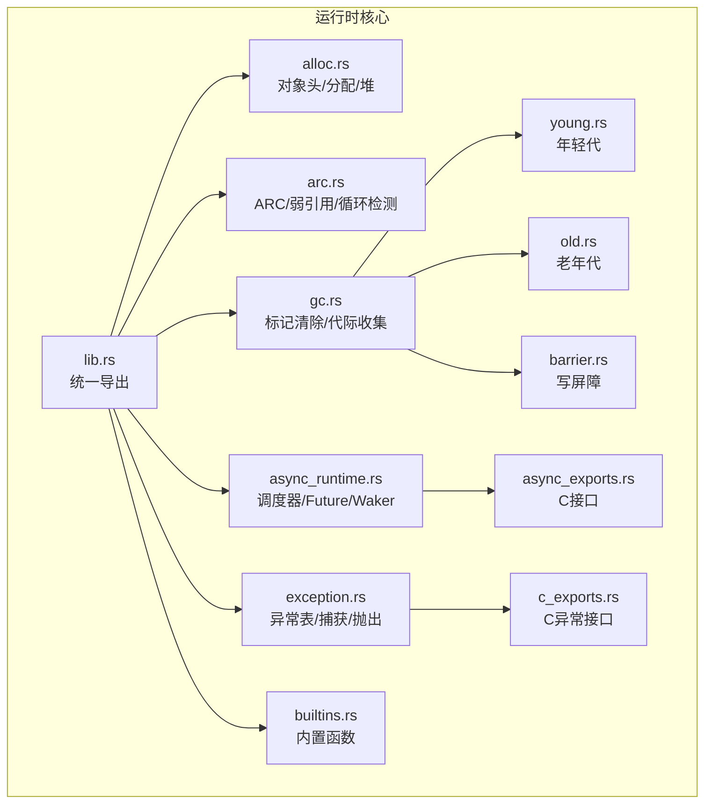
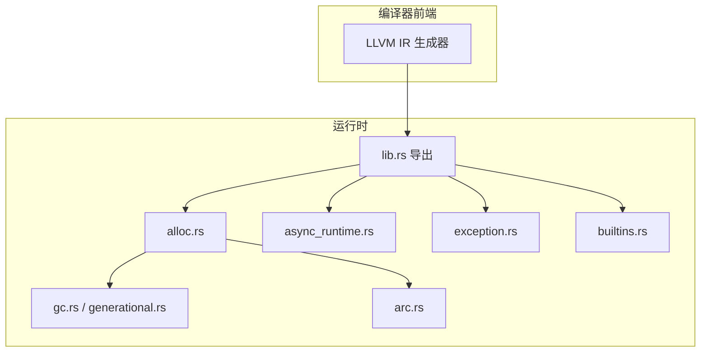
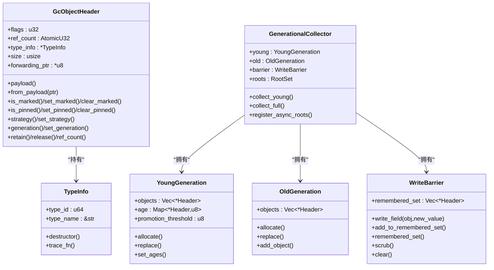
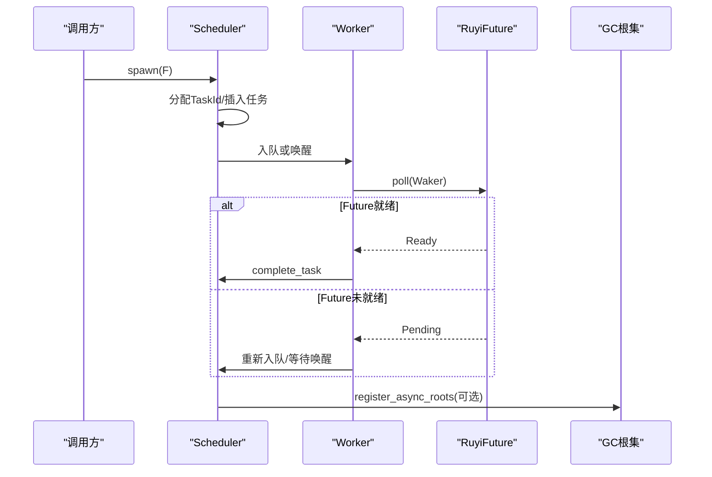
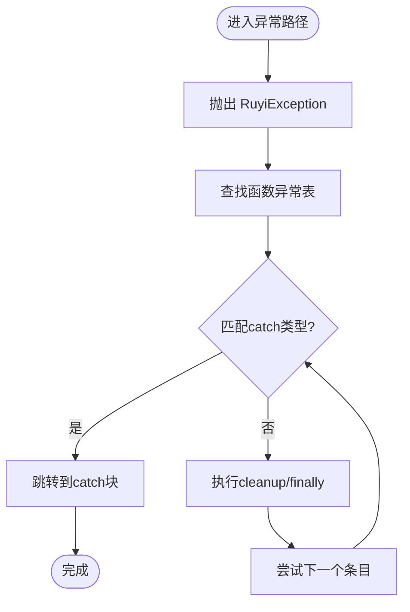
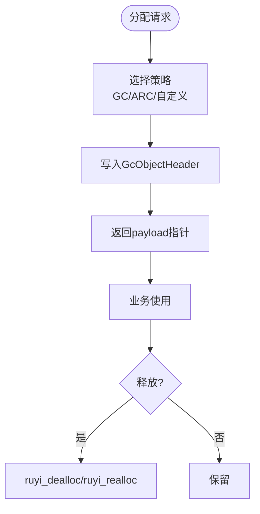
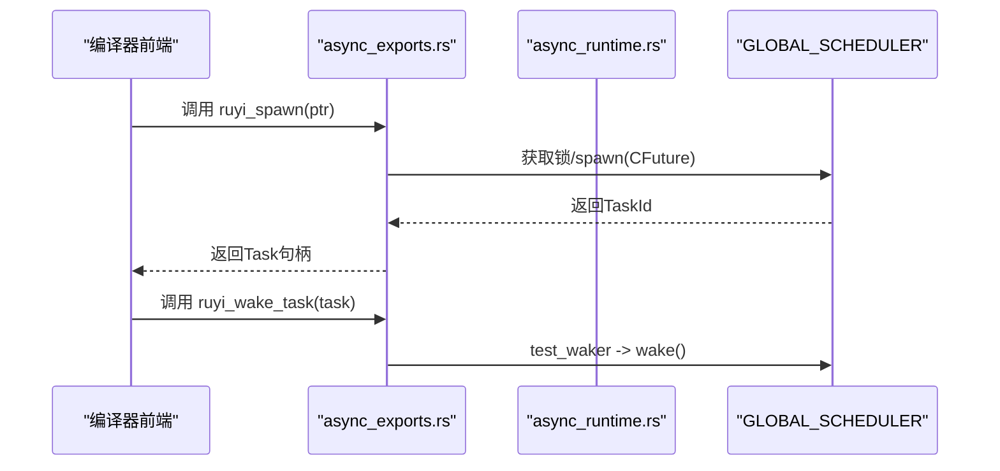
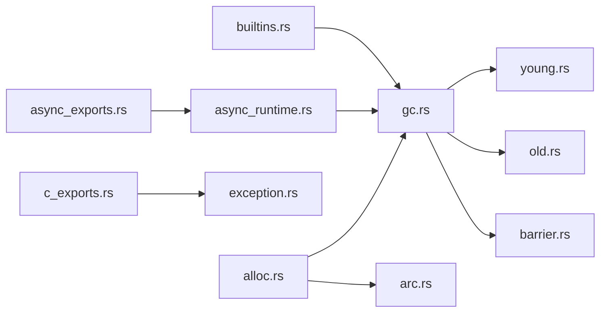

# 运行时扩展

<cite>
**本文引用的文件**
- [crates/ruyi_runtime/src/lib.rs](file://crates/ruyi_runtime/src/lib.rs)
- [crates/ruyi_runtime/src/alloc.rs](file://crates/ruyi_runtime/src/alloc.rs)
- [crates/ruyi_runtime/src/arc.rs](file://crates/ruyi_runtime/src/arc.rs)
- [crates/ruyi_runtime/src/async_runtime.rs](file://crates/ruyi_runtime/src/async_runtime.rs)
- [crates/ruyi_runtime/src/async_exports.rs](file://crates/ruyi_runtime/src/async_exports.rs)
- [crates/ruyi_runtime/src/c_exports.rs](file://crates/ruyi_runtime/src/c_exports.rs)
- [crates/ruyi_runtime/src/builtins.rs](file://crates/ruyi_runtime/src/builtins.rs)
- [crates/ruyi_runtime/src/gc.rs](file://crates/ruyi_runtime/src/gc.rs)
- [crates/ruyi_runtime/src/gc/barrier.rs](file://crates/ruyi_runtime/src/gc/barrier.rs)
- [crates/ruyi_runtime/src/gc/generational.rs](file://crates/ruyi_runtime/src/gc/generational.rs)
- [crates/ruyi_runtime/src/gc/young.rs](file://crates/ruyi_runtime/src/gc/young.rs)
- [crates/ruyi_runtime/src/gc/old.rs](file://crates/ruyi_runtime/src/gc/old.rs)
- [crates/ruyi_runtime/src/exception.rs](file://crates/ruyi_runtime/src/exception.rs)
- [crates/ruyi_runtime/tests/gc_async_roots.rs](file://crates/ruyi_runtime/tests/gc_async_roots.rs)
- [crates/ruyi_runtime/tests/async_runtime.rs](file://crates/ruyi_runtime/tests/async_runtime.rs)
</cite>

## 目录
1. [简介](#简介)
2. [项目结构](#项目结构)
3. [核心组件](#核心组件)
4. [架构总览](#架构总览)
5. [详细组件分析](#详细组件分析)
6. [依赖关系分析](#依赖关系分析)
7. [性能考量](#性能考量)
8. [故障排查指南](#故障排查指南)
9. [结论](#结论)
10. [附录](#附录)

## 简介
本指南面向希望在 Ruyi 运行时系统上进行扩展的开发者，覆盖以下主题：
- 垃圾回收器扩展：新增 GC 算法、代际收集策略与写屏障集成
- 异步运行时扩展：自定义调度器、任务管理与与 GC 的根集注册
- 异常处理系统扩展：新增异常类型与处理逻辑
- 内存分配器扩展：新增分配策略与池化技术
- 运行时 API 与系统调用扩展：通过 C 导出函数接入编译器前端
- 性能优化与测试调试：基准测试、并发与内存泄漏检测建议

## 项目结构
Ruyi 运行时以 crates/ruyi_runtime 为核心，采用模块化组织：
- 核心导出入口：lib.rs 汇总导出所有公共 API（GC、ARC、异步、异常、内置函数等）
- 内存管理：alloc.rs 定义对象头、分配器与堆；arc.rs 提供 ARC 支持
- 垃圾回收：gc.rs 暴露 MarkSweepCollector 与 Collector（代际）；子模块实现写屏障、年轻/老年代
- 异步运行时：async_runtime.rs 实现工作窃取调度器、Future/Waker、组合器；async_exports.rs 对外提供 C 接口
- 异常系统：exception.rs 定义异常表、捕获/抛出流程；c_exports.rs 提供 C 接口
- 内置函数：builtins.rs 提供字符串、数组、对象、集合等运行时辅助

图示来源
- [crates/ruyi_runtime/src/lib.rs:1-50](file://crates/ruyi_runtime/src/lib.rs#L1-L50)
- [crates/ruyi_runtime/src/alloc.rs:1-120](file://crates/ruyi_runtime/src/alloc.rs#L1-L120)
- [crates/ruyi_runtime/src/arc.rs:1-60](file://crates/ruyi_runtime/src/arc.rs#L1-L60)
- [crates/ruyi_runtime/src/gc.rs:1-60](file://crates/ruyi_runtime/src/gc.rs#L1-L60)
- [crates/ruyi_runtime/src/gc/young.rs:1-40](file://crates/ruyi_runtime/src/gc/young.rs#L1-L40)
- [crates/ruyi_runtime/src/gc/old.rs:1-40](file://crates/ruyi_runtime/src/gc/old.rs#L1-L40)
- [crates/ruyi_runtime/src/gc/barrier.rs:1-40](file://crates/ruyi_runtime/src/gc/barrier.rs#L1-L40)
- [crates/ruyi_runtime/src/async_runtime.rs:1-60](file://crates/ruyi_runtime/src/async_runtime.rs#L1-L60)
- [crates/ruyi_runtime/src/async_exports.rs:1-40](file://crates/ruyi_runtime/src/async_exports.rs#L1-L40)
- [crates/ruyi_runtime/src/c_exports.rs:1-30](file://crates/ruyi_runtime/src/c_exports.rs#L1-L30)
- [crates/ruyi_runtime/src/exception.rs:1-40](file://crates/ruyi_runtime/src/exception.rs#L1-L40)
- [crates/ruyi_runtime/src/builtins.rs:1-40](file://crates/ruyi_runtime/src/builtins.rs#L1-L40)

章节来源
- [crates/ruyi_runtime/src/lib.rs:1-50](file://crates/ruyi_runtime/src/lib.rs#L1-L50)

## 核心组件
- 分配与对象头：统一的 GcObjectHeader 承载标记位、引用计数、类型信息、大小与转发指针，支持 GC 与 ARC 双模式
- 垃圾回收：MarkSweepCollector（基线）与 GenerationalCollector（默认），含写屏障与年轻/老年代
- 异步运行时：基于工作窃取的多线程调度器，Future/Waker 组合器，全局调度器实例
- 异常系统：基于 Itanium C++ ABI 的异常表与捕获/抛出流程，C 接口桥接
- 内置函数：字符串拼接、数组/对象操作、集合操作等 C ABI 函数

章节来源
- [crates/ruyi_runtime/src/alloc.rs:35-180](file://crates/ruyi_runtime/src/alloc.rs#L35-L180)
- [crates/ruyi_runtime/src/gc.rs:13-225](file://crates/ruyi_runtime/src/gc.rs#L13-L225)
- [crates/ruyi_runtime/src/gc/generational.rs:21-120](file://crates/ruyi_runtime/src/gc/generational.rs#L21-L120)
- [crates/ruyi_runtime/src/async_runtime.rs:12-120](file://crates/ruyi_runtime/src/async_runtime.rs#L12-L120)
- [crates/ruyi_runtime/src/exception.rs:9-120](file://crates/ruyi_runtime/src/exception.rs#L9-L120)
- [crates/ruyi_runtime/src/builtins.rs:1-120](file://crates/ruyi_runtime/src/builtins.rs#L1-L120)

## 架构总览
运行时由“分配层 → GC/ARC → 异步 → 异常 → 内置函数”构成，lib.rs 将各模块统一导出，便于编译器前端链接。

图示来源
- [crates/ruyi_runtime/src/lib.rs:1-50](file://crates/ruyi_runtime/src/lib.rs#L1-L50)
- [crates/ruyi_runtime/src/alloc.rs:1-60](file://crates/ruyi_runtime/src/alloc.rs#L1-L60)
- [crates/ruyi_runtime/src/gc/generational.rs:1-40](file://crates/ruyi_runtime/src/gc/generational.rs#L1-L40)
- [crates/ruyi_runtime/src/arc.rs:1-40](file://crates/ruyi_runtime/src/arc.rs#L1-L40)
- [crates/ruyi_runtime/src/async_runtime.rs:1-40](file://crates/ruyi_runtime/src/async_runtime.rs#L1-L40)
- [crates/ruyi_runtime/src/exception.rs:1-40](file://crates/ruyi_runtime/src/exception.rs#L1-L40)
- [crates/ruyi_runtime/src/builtins.rs:1-40](file://crates/ruyi_runtime/src/builtins.rs#L1-L40)

## 详细组件分析

### 垃圾回收器扩展
- 新增 GC 算法实现
  - 在 gc/mod.rs 中新增模块并实现 CollectorTrait 或替换现有 MarkSweepCollector/GenerationalCollector
  - 使用 alloc::GcObjectHeader 与 TypeInfo，确保 trace_fn 正确扫描内部指针
  - 通过 ruyi_alloc/ruyi_dealloc/ruyi_realloc 与 Heap 协作
- 代际收集策略
  - 年轻代复制收集：young.rs
  - 老年代标记压缩：old.rs
  - 写屏障：barrier.rs 记录跨代写入，避免漏标
  - 代际收集器：generational.rs 集成上述组件，并提供 register_async_roots
- GC 与异步根集
  - register_async_roots 将挂起任务中的 GC 指针加入根集，防止误回收

图示来源
- [crates/ruyi_runtime/src/alloc.rs:35-180](file://crates/ruyi_runtime/src/alloc.rs#L35-L180)
- [crates/ruyi_runtime/src/gc/young.rs:11-84](file://crates/ruyi_runtime/src/gc/young.rs#L11-L84)
- [crates/ruyi_runtime/src/gc/old.rs:10-64](file://crates/ruyi_runtime/src/gc/old.rs#L10-L64)
- [crates/ruyi_runtime/src/gc/barrier.rs:13-86](file://crates/ruyi_runtime/src/gc/barrier.rs#L13-L86)
- [crates/ruyi_runtime/src/gc/generational.rs:21-120](file://crates/ruyi_runtime/src/gc/generational.rs#L21-L120)

章节来源
- [crates/ruyi_runtime/src/gc.rs:13-225](file://crates/ruyi_runtime/src/gc.rs#L13-L225)
- [crates/ruyi_runtime/src/gc/generational.rs:120-267](file://crates/ruyi_runtime/src/gc/generational.rs#L120-L267)
- [crates/ruyi_runtime/src/gc/barrier.rs:13-86](file://crates/ruyi_runtime/src/gc/barrier.rs#L13-L86)
- [crates/ruyi_runtime/src/gc/young.rs:11-84](file://crates/ruyi_runtime/src/gc/young.rs#L11-L84)
- [crates/ruyi_runtime/src/gc/old.rs:10-64](file://crates/ruyi_runtime/src/gc/old.rs#L10-L64)

### 异步运行时扩展
- 自定义调度器
  - 实现新的调度器结构体，遵循 async_runtime::Scheduler/Worker/Task 设计
  - 通过 GLOBAL_SCHEDULER 或自定义全局实例暴露 spawn/poll/block_on_all 等能力
- 任务管理与 Waker
  - RuyiFuture trait 与 Waker 机制用于唤醒与推进任务
  - WorkStealingDeque 作为本地队列，支持 steal_top/pop_bottom 等操作
- 与 GC 集成
  - register_async_roots 将挂起任务对象扫描并加入 GC 根集，避免被回收

图示来源
- [crates/ruyi_runtime/src/async_runtime.rs:140-314](file://crates/ruyi_runtime/src/async_runtime.rs#L140-L314)
- [crates/ruyi_runtime/src/async_runtime.rs:426-455](file://crates/ruyi_runtime/src/async_runtime.rs#L426-L455)

章节来源
- [crates/ruyi_runtime/src/async_runtime.rs:12-120](file://crates/ruyi_runtime/src/async_runtime.rs#L12-L120)
- [crates/ruyi_runtime/src/async_runtime.rs:138-314](file://crates/ruyi_runtime/src/async_runtime.rs#L138-L314)
- [crates/ruyi_runtime/src/async_runtime.rs:426-455](file://crates/ruyi_runtime/src/async_runtime.rs#L426-L455)

### 异常处理系统扩展
- 新增异常类型
  - 使用 fresh_type_id 生成唯一类型 ID
  - 在 FunctionExceptionTable 中注册 try/catch 区域与 landing pad
- 处理逻辑
  - RuyiException 携带 type_id/message/stack_trace
  - throw_exception 抛出异常（当前版本通过 panic 验证路径）
  - C 接口 ruyi_begin_catch/ruyi_end_catch/ruiy_get_pending_exception 提供 C 侧异常桥接

图示来源
- [crates/ruyi_runtime/src/exception.rs:184-291](file://crates/ruyi_runtime/src/exception.rs#L184-L291)
- [crates/ruyi_runtime/src/c_exports.rs:8-22](file://crates/ruyi_runtime/src/c_exports.rs#L8-L22)

章节来源
- [crates/ruyi_runtime/src/exception.rs:9-120](file://crates/ruyi_runtime/src/exception.rs#L9-L120)
- [crates/ruyi_runtime/src/exception.rs:120-220](file://crates/ruyi_runtime/src/exception.rs#L120-L220)
- [crates/ruyi_runtime/src/c_exports.rs:1-53](file://crates/ruyi_runtime/src/c_exports.rs#L1-L53)

### 内存分配器扩展
- 新增分配策略
  - 在 alloc.rs 中扩展 MemoryStrategy，或新增分配器实现
  - 使用 ruyi_alloc/ruyi_dealloc/ruyi_realloc 与 GcObjectHeader 协作
- 池化技术
  - 可在 Heap 上层实现小对象缓存池、线程局部分配器（TLS）或大页分配
  - 注意与 GC/ARC 的互操作（例如 ARC 对象的引用计数）

图示来源
- [crates/ruyi_runtime/src/alloc.rs:183-223](file://crates/ruyi_runtime/src/alloc.rs#L183-L223)
- [crates/ruyi_runtime/src/alloc.rs:225-298](file://crates/ruyi_runtime/src/alloc.rs#L225-L298)

章节来源
- [crates/ruyi_runtime/src/alloc.rs:1-120](file://crates/ruyi_runtime/src/alloc.rs#L1-L120)
- [crates/ruyi_runtime/src/alloc.rs:183-298](file://crates/ruyi_runtime/src/alloc.rs#L183-L298)

### 运行时 API 与系统调用扩展
- C 导出函数
  - async_exports.rs：ruyi_async_poll、ruyi_spawn、ruyi_wake_task、ruyi_run_scheduler
  - c_exports.rs：ruyi_throw、ruyi_clear_pending_exception、ruyi_get_pending_exception、ruyi_str_concat、ruyi_begin_catch、ruyi_end_catch
- 内置函数
  - builtins.rs：ruyi_int_to_string、ruyi_float_to_string、ruyi_bool_to_string、ruyi_string_concat、ruyi_array_*、__builtin_* 系列

图示来源
- [crates/ruyi_runtime/src/async_exports.rs:45-92](file://crates/ruyi_runtime/src/async_exports.rs#L45-L92)
- [crates/ruyi_runtime/src/async_runtime.rs:422-425](file://crates/ruyi_runtime/src/async_runtime.rs#L422-L425)

章节来源
- [crates/ruyi_runtime/src/async_exports.rs:1-92](file://crates/ruyi_runtime/src/async_exports.rs#L1-L92)
- [crates/ruyi_runtime/src/c_exports.rs:1-53](file://crates/ruyi_runtime/src/c_exports.rs#L1-L53)
- [crates/ruyi_runtime/src/builtins.rs:1-120](file://crates/ruyi_runtime/src/builtins.rs#L1-L120)

## 依赖关系分析
- 模块耦合
  - alloc.rs 是 GC/ARC 的基础设施，被 gc/* 与 arc.rs 依赖
  - async_runtime.rs 依赖 gc 的根集扫描（register_async_roots）
  - exception.rs 与 c_exports.rs 提供 C 侧异常桥接
  - builtins.rs 通过 ruyi_gc_alloc 与 GC 集成
- 外部依赖
  - std::alloc、std::sync、once_cell::sync::Lazy（全局调度器）

图示来源
- [crates/ruyi_runtime/src/alloc.rs:1-60](file://crates/ruyi_runtime/src/alloc.rs#L1-L60)
- [crates/ruyi_runtime/src/gc.rs:1-20](file://crates/ruyi_runtime/src/gc.rs#L1-L20)
- [crates/ruyi_runtime/src/arc.rs:1-40](file://crates/ruyi_runtime/src/arc.rs#L1-L40)
- [crates/ruyi_runtime/src/async_runtime.rs:1-40](file://crates/ruyi_runtime/src/async_runtime.rs#L1-L40)
- [crates/ruyi_runtime/src/async_exports.rs:1-20](file://crates/ruyi_runtime/src/async_exports.rs#L1-L20)
- [crates/ruyi_runtime/src/c_exports.rs:1-20](file://crates/ruyi_runtime/src/c_exports.rs#L1-L20)
- [crates/ruyi_runtime/src/builtins.rs:1-20](file://crates/ruyi_runtime/src/builtins.rs#L1-L20)

章节来源
- [crates/ruyi_runtime/src/lib.rs:1-50](file://crates/ruyi_runtime/src/lib.rs#L1-L50)

## 性能考量
- GC
  - 年轻代复制收集减少全堆扫描；写屏障仅记录跨代写，避免全量扫描
  - 通过 promotion_threshold 控制晋升年龄，平衡晋升成本与老年代碎片
  - 在 register_async_roots 中按对象粒度扫描，避免扫描整个堆
- 异步
  - 工作窃取降低锁竞争；Waker 唤醒避免忙轮询
  - 合理设置 worker 数量与队列长度，避免过载或空闲
- 分配
  - 小对象池化与 TLS 缓存可显著降低分配开销
  - 批量分配与对齐要求需权衡内存利用率与性能
- 异常
  - 异常表按函数维护，查找为 O(1) 次序；catch 匹配顺序影响性能

## 故障排查指南
- GC 相关
  - 若对象被提前回收，检查是否正确注册为根集（GC 根/异步根）
  - 测试用例展示了 register_async_roots 如何扫描挂起任务中的 GC 指针
- 异步
  - 任务未推进：确认 Waker 是否被调用；检查 WorkStealingDeque 的 steal/top 行为
  - 全局调度器阻塞：使用 block_on_all 或检查 active_tasks
- 异常
  - 捕获不到异常：核对 FunctionExceptionTable 的 try/catch 条目与 landing pad
  - C 侧异常：使用 ruyi_get_pending_exception 检查状态
- 内置函数
  - 字符串/数组操作：注意空指针与越界访问，确保布局与长度字段正确

章节来源
- [crates/ruyi_runtime/tests/gc_async_roots.rs:1-120](file://crates/ruyi_runtime/tests/gc_async_roots.rs#L1-L120)
- [crates/ruyi_runtime/tests/async_runtime.rs:1-120](file://crates/ruyi_runtime/tests/async_runtime.rs#L1-L120)
- [crates/ruyi_runtime/src/async_runtime.rs:426-455](file://crates/ruyi_runtime/src/async_runtime.rs#L426-L455)
- [crates/ruyi_runtime/src/c_exports.rs:8-22](file://crates/ruyi_runtime/src/c_exports.rs#L8-L22)

## 结论
Ruyi 运行时提供了清晰的扩展点：通过 alloc/TypeInfo/GcObjectHeader 统一内存模型，结合 GC/ARC、异步调度与异常系统，形成可扩展的运行时框架。扩展新算法或机制时，应优先复用现有数据结构与接口契约，确保与 GC 根集、写屏障、异步任务与异常表的协同。

## 附录
- 示例参考
  - 异步根集扫描测试：[gc_async_roots.rs:46-143](file://crates/ruyi_runtime/tests/gc_async_roots.rs#L46-L143)
  - 异步调度器单元测试：[async_runtime.rs:34-100](file://crates/ruyi_runtime/tests/async_runtime.rs#L34-L100)
  - C 导出函数：[async_exports.rs:45-92](file://crates/ruyi_runtime/src/async_exports.rs#L45-L92)、[c_exports.rs:8-22](file://crates/ruyi_runtime/src/c_exports.rs#L8-L22)
  - 内置函数：[builtins.rs:18-120](file://crates/ruyi_runtime/src/builtins.rs#L18-L120)