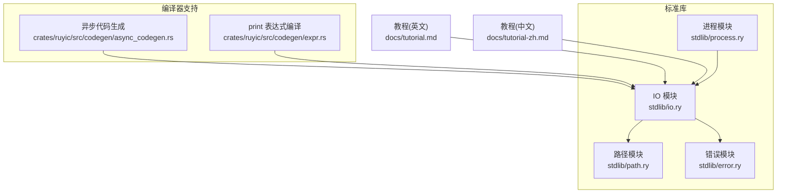
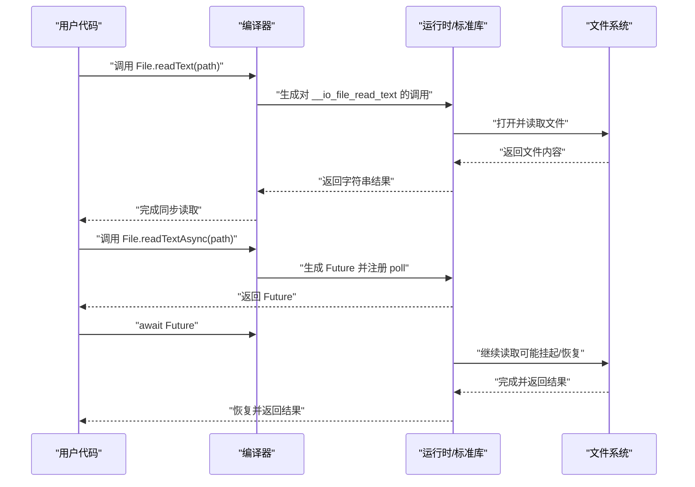
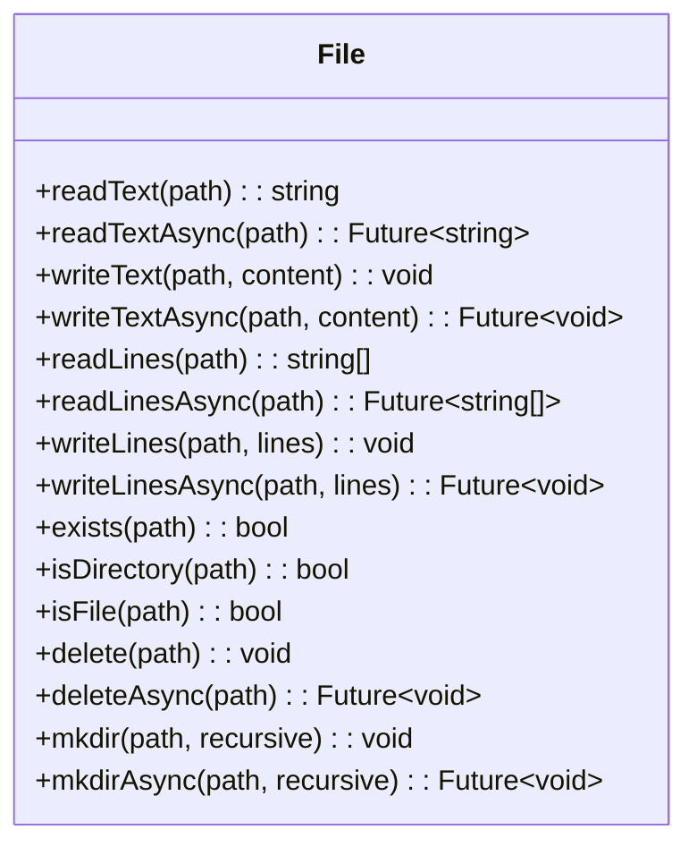
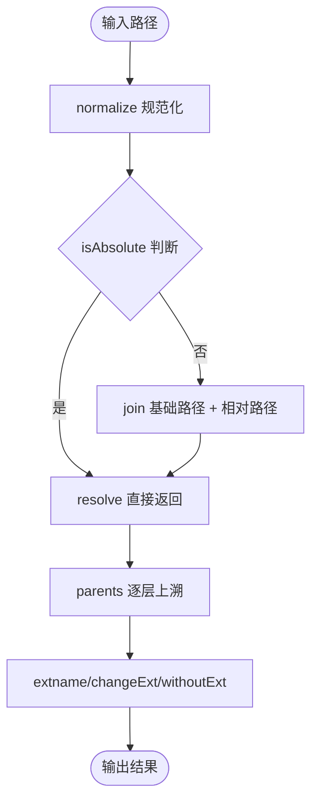
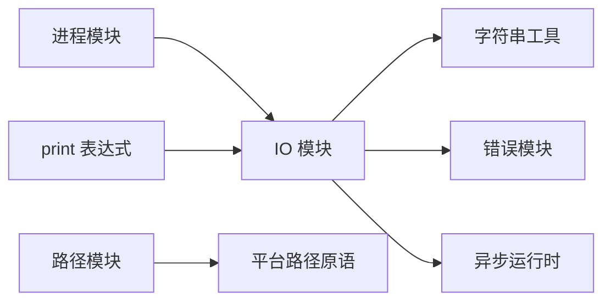

# IO操作库

<cite>
**本文引用的文件**
- [stdlib/io.ry](file://stdlib/io.ry)
- [stdlib/path.ry](file://stdlib/path.ry)
- [stdlib/error.ry](file://stdlib/error.ry)
- [stdlib/process.ry](file://stdlib/process.ry)
- [docs/tutorial.md](file://docs/tutorial.md)
- [docs/tutorial-zh.md](file://docs/tutorial-zh.md)
- [crates/ruyic/src/codegen/async_codegen.rs](file://crates/ruyic/src/codegen/async_codegen.rs)
- [crates/ruyic/src/codegen/expr.rs](file://crates/ruyic/src/codegen/expr.rs)
</cite>

## 目录
1. [简介](#简介)
2. [项目结构](#项目结构)
3. [核心组件](#核心组件)
4. [架构总览](#架构总览)
5. [组件详解](#组件详解)
6. [依赖关系分析](#依赖关系分析)
7. [性能与并发特性](#性能与并发特性)
8. [故障排查指南](#故障排查指南)
9. [结论](#结论)
10. [附录](#附录)

## 简介
本文件为 Ruyi 标准库中的 IO 操作库提供详细的 API 参考与使用指南。内容覆盖：
- 文件系统操作：文本/行读写、存在性检查、目录创建与删除等
- 路径处理：拼接、规范化、父子关系判断、扩展名处理等
- 标准输入输出：控制台读取与打印（编译器内置）
- 异步 IO：Future 驱动的异步读写与并发执行
- 错误处理与资源管理：错误类型、断言工具与最佳实践
- 跨平台与性能优化：平台差异与性能建议
- 常见模式与实用示例：基于官方教程与示例的用法指引

## 项目结构
IO 相关能力主要由以下模块提供：
- IO 模块：提供控制台输入与文件系统 IO 的统一入口
- 路径模块：提供路径拼接、解析、规范化与扩展名处理
- 错误模块：提供通用错误类型与断言工具
- 进程模块：提供进程管理与系统命令执行（间接涉及 IO）
- 编译器侧支持：异步代码生成、print 表达式编译等

图表来源
- [stdlib/io.ry:1-173](file://stdlib/io.ry#L1-L173)
- [stdlib/path.ry:1-253](file://stdlib/path.ry#L1-L253)
- [stdlib/error.ry:1-106](file://stdlib/error.ry#L1-L106)
- [stdlib/process.ry:1-180](file://stdlib/process.ry#L1-L180)
- [crates/ruyic/src/codegen/async_codegen.rs:206-561](file://crates/ruyic/src/codegen/async_codegen.rs#L206-L561)
- [crates/ruyic/src/codegen/expr.rs:2206-2232](file://crates/ruyic/src/codegen/expr.rs#L2206-L2232)
- [docs/tutorial.md:1550-1625](file://docs/tutorial.md#L1550-L1625)
- [docs/tutorial-zh.md:2073-2091](file://docs/tutorial-zh.md#L2073-L2091)

章节来源
- [stdlib/io.ry:1-173](file://stdlib/io.ry#L1-L173)
- [stdlib/path.ry:1-253](file://stdlib/path.ry#L1-L253)
- [stdlib/error.ry:1-106](file://stdlib/error.ry#L1-L106)
- [stdlib/process.ry:1-180](file://stdlib/process.ry#L1-L180)
- [crates/ruyic/src/codegen/async_codegen.rs:206-561](file://crates/ruyic/src/codegen/async_codegen.rs#L206-L561)
- [crates/ruyic/src/codegen/expr.rs:2206-2232](file://crates/ruyic/src/codegen/expr.rs#L2206-L2232)
- [docs/tutorial.md:1550-1625](file://docs/tutorial.md#L1550-L1625)
- [docs/tutorial-zh.md:2073-2091](file://docs/tutorial-zh.md#L2073-L2091)

## 核心组件
- 控制台输入输出
  - readLine：从标准输入读取一行（阻塞），返回字符串或空值
  - print/println：编译器内置函数，无需导入即可使用
- 文件系统 IO
  - File 类：提供文本/行读写、存在性检查、目录/文件判定、删除、创建目录等
  - 支持同步与异步版本（Future）
- 路径处理
  - Path 类：路径拼接、基础名/目录名/扩展名、绝对/相对判断、规范化、父子关系、相对路径、分隔符等
  - 扩展名辅助：hasExt、getExts
- 错误处理
  - 统一的 Error 基类与多种派生错误类型
  - 断言工具：assert、assertNotNull
- 进程与系统 IO
  - Process 类：进程生命周期管理、等待、信号、输入输出读写

章节来源
- [stdlib/io.ry:17-24](file://stdlib/io.ry#L17-L24)
- [stdlib/io.ry:34-173](file://stdlib/io.ry#L34-L173)
- [stdlib/path.ry:19-221](file://stdlib/path.ry#L19-L221)
- [stdlib/error.ry:10-106](file://stdlib/error.ry#L10-L106)
- [stdlib/process.ry:19-180](file://stdlib/process.ry#L19-L180)

## 架构总览
IO 能力通过“语言内置 + 标准库 + 编译器支持”三层协同实现：
- 语言内置：print/println 作为编译器内置表达式直接生成运行时调用
- 标准库：IO 模块导出 API；路径/错误/进程模块提供配套能力
- 编译器：异步代码生成将 async/await 展开为状态机；print 表达式编译为运行时调用

图表来源
- [stdlib/io.ry:40-51](file://stdlib/io.ry#L40-L51)
- [crates/ruyic/src/codegen/async_codegen.rs:206-561](file://crates/ruyic/src/codegen/async_codegen.rs#L206-L561)

## 组件详解

### 控制台输入输出
- readLine
  - 功能：从标准输入读取一行，阻塞直到完整行可用；到达 EOF 返回空值
  - 使用场景：交互式程序、批处理脚本
- print/println
  - 功能：编译器内置，将值转换为字符串后输出
  - 注意：无需导入，参数个数固定为 1

章节来源
- [stdlib/io.ry:17-24](file://stdlib/io.ry#L17-L24)
- [crates/ruyic/src/codegen/expr.rs:2206-2232](file://crates/ruyic/src/codegen/expr.rs#L2206-L2232)

### 文件系统 IO（File 类）
- 文本读写
  - readText / readTextAsync：整文件读取为字符串
  - writeText / writeTextAsync：将字符串写入文件
- 行读写
  - readLines / readLinesAsync：按行读取为字符串数组（不包含换行符）
  - writeLines / writeLinesAsync：将行数组写回文件（自动以换行符连接）
- 存在性与类型
  - exists：检查路径是否存在
  - isDirectory / isFile：判断路径是目录还是文件
- 删除与目录
  - delete / deleteAsync：删除文件
  - mkdir / mkdirAsync：创建目录，支持递归
- 异步模型
  - 所有异步方法返回 Future，需在 async 函数中 await

图表来源
- [stdlib/io.ry:34-173](file://stdlib/io.ry#L34-L173)

章节来源
- [stdlib/io.ry:34-173](file://stdlib/io.ry#L34-L173)
- [docs/tutorial.md:1550-1625](file://docs/tutorial.md#L1550-L1625)
- [docs/tutorial-zh.md:2073-2091](file://docs/tutorial-zh.md#L2073-L2091)

### 路径处理（Path 类）
- 路径拼接与解析
  - join：拼接多个路径段
  - resolve：将相对路径解析到基路径下
  - normalize：规范化路径（处理 . 与 ..）
- 名称与扩展名
  - basename / dirname：获取文件名与目录名
  - extname / basenameNoExt / withoutExt / changeExt：扩展名处理
  - hasExt / getExts：扩展名校验与提取
- 关系与比较
  - isAbsolute / isRelative：绝对/相对判断
  - compare / equals：字典序比较与标准化相等
  - isChildOf：判断父子关系
  - relative：计算相对路径
  - parents：获取所有父级路径

图表来源
- [stdlib/path.ry:19-221](file://stdlib/path.ry#L19-L221)

章节来源
- [stdlib/path.ry:19-221](file://stdlib/path.ry#L19-L221)
- [docs/tutorial-zh.md:2256-2261](file://docs/tutorial-zh.md#L2256-L2261)
- [docs/tutorial.md:2256-2261](file://docs/tutorial.md#L2256-L2261)

### 错误处理与断言
- 错误类型
  - Error 基类与多种派生类型（TypeError、RuntimeError、RangeError、AssertionError、ArgumentError、NullError、ArithmeticError、IteratorError、ParseError、IOError）
- 断言工具
  - assert：条件失败抛出 AssertionError
  - assertNotNull：空值抛出 NullAssertionError
- 在 IO 中的应用
  - 文件操作异常可映射为 IOError 或更具体的错误类型
  - 建议在关键路径使用断言确保前置条件

章节来源
- [stdlib/error.ry:10-106](file://stdlib/error.ry#L10-L106)

### 进程与系统 IO（Process 类）
- 进程属性：pid、command、cwd、env、exitCode、isRunning
- 生命周期：spawn/exec（由编译器侧提供）、wait/waitAsync、kill
- 输入输出：writeInput/closeInput、readOutput、readError
- 适用场景：需要与外部命令交互、管道式数据处理

章节来源
- [stdlib/process.ry:19-180](file://stdlib/process.ry#L19-L180)

## 依赖关系分析
- IO 模块依赖
  - 编译器内置：print/println（表达式编译）
  - 异步运行时：Future/poll 状态机（异步方法）
  - 字符串工具：行写入内部使用字符串拼接
- 路径模块依赖
  - 平台分隔符与路径原语（由底层提供）
- 错误模块独立，被 IO/路径/进程等模块复用
- 进程模块与 IO 模块互补：进程 IO 通过 stdin/stdout/stderr 与外部交互

图表来源
- [stdlib/io.ry:95-98](file://stdlib/io.ry#L95-L98)
- [stdlib/path.ry:218-220](file://stdlib/path.ry#L218-L220)
- [crates/ruyic/src/codegen/expr.rs:2206-2232](file://crates/ruyic/src/codegen/expr.rs#L2206-L2232)
- [crates/ruyic/src/codegen/async_codegen.rs:206-561](file://crates/ruyic/src/codegen/async_codegen.rs#L206-L561)

章节来源
- [stdlib/io.ry:95-98](file://stdlib/io.ry#L95-L98)
- [stdlib/path.ry:218-220](file://stdlib/path.ry#L218-L220)
- [crates/ruyic/src/codegen/expr.rs:2206-2232](file://crates/ruyic/src/codegen/expr.rs#L2206-L2232)
- [crates/ruyic/src/codegen/async_codegen.rs:206-561](file://crates/ruyic/src/codegen/async_codegen.rs#L206-L561)

## 性能与并发特性
- 同步 vs 异步
  - 同步方法适合简单脚本与小文件；异步方法适合高并发与非阻塞场景
  - 异步读写通过 Future 驱动，避免线程阻塞
- 并发模式
  - 多个 Future 并发执行，使用并发收集策略提升吞吐
  - 对大文件建议分块读写或使用流式处理（如迭代器）
- 资源管理
  - 小文件优先使用整文件读写；大文件建议分块处理，减少内存峰值
  - 路径规范化与拼接尽量在业务层做一次，避免重复计算
- 跨平台
  - 路径分隔符与绝对路径规则由平台决定；统一使用 Path 工具进行处理
- 编译器支持
  - 异步代码生成将 await 展开为状态机，保证在同步上下文下的降级行为

章节来源
- [docs/tutorial.md:1573-1590](file://docs/tutorial.md#L1573-L1590)
- [crates/ruyic/src/codegen/async_codegen.rs:206-561](file://crates/ruyic/src/codegen/async_codegen.rs#L206-L561)

## 故障排查指南
- 常见问题
  - 文件不存在：使用 exists/isFile/isDirectory 先行校验
  - 权限不足：确认运行环境具备读写权限
  - 路径错误：先 normalize/resolve，再进行 IO 操作
  - 异常处理：捕获 IOError 或具体错误类型，记录堆栈信息
- 调试建议
  - 使用断言确保关键前置条件（如路径非空、文件存在）
  - 对异步流程添加日志与超时控制
  - 对大文件 IO 添加进度与内存占用监控

章节来源
- [stdlib/error.ry:94-105](file://stdlib/error.ry#L94-L105)
- [stdlib/io.ry:116-136](file://stdlib/io.ry#L116-L136)

## 结论
Ruyi 的 IO 操作库提供了简洁一致的 API，覆盖控制台输入输出、文件系统操作与路径处理，并通过异步 Future 提供非阻塞 IO 能力。配合错误类型与断言工具，能够构建健壮的 IO 应用。建议在实际工程中结合异步并发、路径规范化与资源管理策略，获得更好的性能与可维护性。

## 附录

### API 速查表（节选）
- 控制台
  - readLine(): string?
  - print(value): void（内置）
  - println(value): void（内置）
- 文件（File）
  - readText(path): string
  - readTextAsync(path): Future<string>
  - writeText(path, content): void
  - writeTextAsync(path, content): Future<void>
  - readLines(path): Array<string>
  - readLinesAsync(path): Future<Array<string>>
  - writeLines(path, lines): void
  - writeLinesAsync(path, lines): Future<void>
  - exists(path): bool
  - isDirectory(path): bool
  - isFile(path): bool
  - delete(path): void
  - deleteAsync(path): Future<void>
  - mkdir(path, recursive=false): void
  - mkdirAsync(path, recursive=false): Future<void>
- 路径（Path）
  - join(...paths): string
  - basename(path): string
  - dirname(path): string
  - extname(path): string
  - isAbsolute(path): bool
  - isRelative(path): bool
  - resolve(base, relative): string
  - normalize(path): string
  - basenameNoExt(path): string
  - withoutExt(path): string
  - changeExt(path, newExt): string
  - compare(path1, path2): int
  - equals(path1, path2): bool
  - isChildOf(parent, child): bool
  - relative(from, to): string
  - parents(path): Array<string>
  - separator(): string
  - hasExt(path, ext): bool
  - getExts(path): string

章节来源
- [stdlib/io.ry:17-24](file://stdlib/io.ry#L17-L24)
- [stdlib/io.ry:34-173](file://stdlib/io.ry#L34-L173)
- [stdlib/path.ry:19-253](file://stdlib/path.ry#L19-L253)
- [docs/tutorial.md:2073-2091](file://docs/tutorial.md#L2073-L2091)
- [docs/tutorial-zh.md:2073-2091](file://docs/tutorial-zh.md#L2073-L2091)