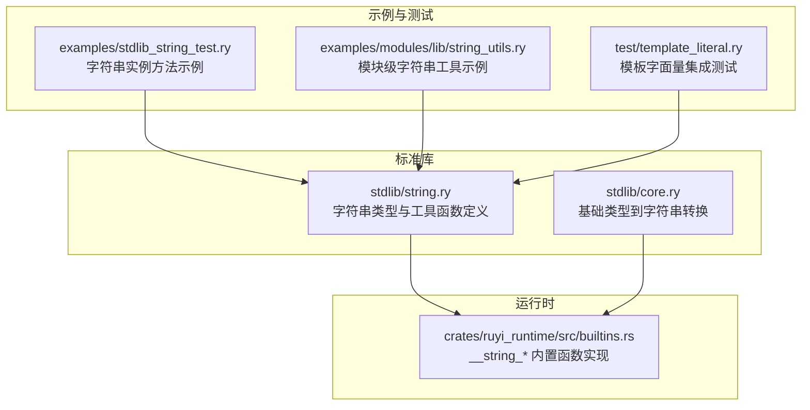
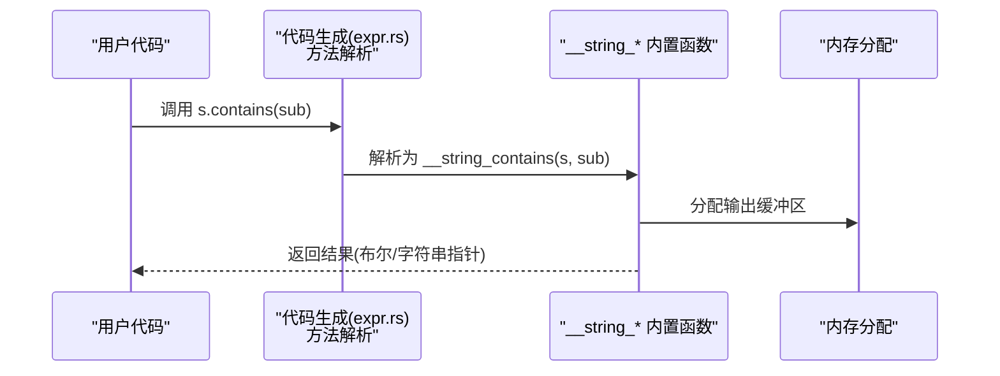
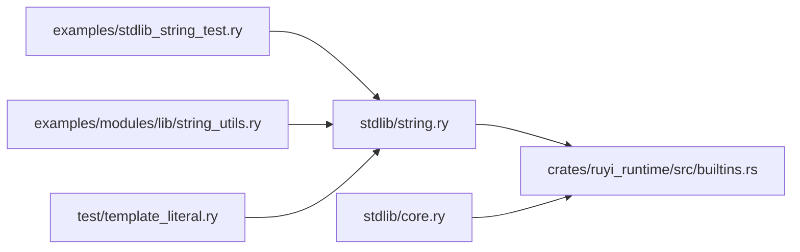

# 字符串处理库

<cite>
**本文引用的文件**
- [stdlib/string.ry](file://stdlib/string.ry)
- [stdlib/core.ry](file://stdlib/core.ry)
- [crates/ruyi_runtime/src/builtins.rs](file://crates/ruyi_runtime/src/builtins.rs)
- [examples/stdlib_string_test.ry](file://examples/stdlib_string_test.ry)
- [examples/modules/lib/string_utils.ry](file://examples/modules/lib/string_utils.ry)
- [test/template_literal.ry](file://test/template_literal.ry)
</cite>

## 目录
1. [简介](#简介)
2. [项目结构](#项目结构)
3. [核心组件](#核心组件)
4. [架构总览](#架构总览)
5. [详细组件分析](#详细组件分析)
6. [依赖关系分析](#依赖关系分析)
7. [性能考量](#性能考量)
8. [故障排查指南](#故障排查指南)
9. [结论](#结论)
10. [附录](#附录)

## 简介
本文件为 Ruyi 字符串处理库的详细 API 参考与技术文档。内容覆盖：
- 字符串类型接口与实例方法（长度、包含、前后缀判断、索引、字符访问、重复、截取、大小写转换、去空白、分割等）
- 字符串工具函数（拼接、从字符码构造、模板格式化、模板字面量处理）
- Unicode 支持与编码要点（UTF-8 视角下的字符遍历与编码转换）
- 性能优化建议与内存使用注意事项
- 常见字符串处理模式与最佳实践

## 项目结构
Ruyi 的字符串能力由“类型系统 + 运行时内置函数”两层实现：
- 类型与方法声明：在标准库模块中定义字符串类型与方法签名，供编译器进行类型检查与调用解析
- 运行时实现：在运行时内置函数中提供具体算法与内存分配逻辑

图表来源
- [stdlib/string.ry:1-165](file://stdlib/string.ry#L1-L165)
- [stdlib/core.ry:1-31](file://stdlib/core.ry#L1-L31)
- [crates/ruyi_runtime/src/builtins.rs:492-1004](file://crates/ruyi_runtime/src/builtins.rs#L492-L1004)
- [examples/stdlib_string_test.ry:1-29](file://examples/stdlib_string_test.ry#L1-L29)
- [examples/modules/lib/string_utils.ry:1-43](file://examples/modules/lib/string_utils.ry#L1-L43)
- [test/template_literal.ry:1-27](file://test/template_literal.ry#L1-L27)

章节来源
- [stdlib/string.ry:1-165](file://stdlib/string.ry#L1-L165)
- [stdlib/core.ry:1-31](file://stdlib/core.ry#L1-L31)
- [crates/ruyi_runtime/src/builtins.rs:492-1004](file://crates/ruyi_runtime/src/builtins.rs#L492-L1004)
- [examples/stdlib_string_test.ry:1-29](file://examples/stdlib_string_test.ry#L1-L29)
- [examples/modules/lib/string_utils.ry:1-43](file://examples/modules/lib/string_utils.ry#L1-L43)
- [test/template_literal.ry:1-27](file://test/template_literal.ry#L1-L27)

## 核心组件
- 字符串工具函数
  - 拼接：将数组元素按分隔符连接为字符串
  - 字符码构造：从单个或多个 Unicode 码点构建字符串
  - 模板格式化：使用位置占位符进行替换
  - 模板字面量处理：内部用于处理 ${...} 插值
- 字符串实例方法（通过类型签名声明；实际调用由代码生成映射到运行时内置函数）
  - 长度、包含、前后缀判断、首次/末次出现索引
  - 字符访问与码点查询
  - 重复、子串截取（substring/slice）
  - 大小写转换、去空白、分割

章节来源
- [stdlib/string.ry:16-91](file://stdlib/string.ry#L16-L91)
- [stdlib/string.ry:104-164](file://stdlib/string.ry#L104-L164)

## 架构总览
字符串 API 的调用链路如下：
- 用户代码调用字符串实例方法或工具函数
- 编译器将方法名解析为运行时内置函数（如 __string_length、__string_contains 等）
- 运行时内置函数执行 UTF-8 字节序列上的操作，并负责内存分配与返回

图表来源
- [stdlib/string.ry:96-102](file://stdlib/string.ry#L96-L102)
- [crates/ruyi_runtime/src/builtins.rs:719-733](file://crates/ruyi_runtime/src/builtins.rs#L719-L733)

## 详细组件分析

### 字符串工具函数
- join(array, separator)
  - 功能：将数组元素按分隔符连接为字符串
  - 输入：数组（元素为动态类型）、分隔符（默认空串）
  - 输出：连接后的字符串
  - 实现要点：计算总长度后一次性分配内存，避免多次重分配
- fromCharCode(code)
  - 功能：从单个 Unicode 码点构造字符串
  - 输入：整数码点
  - 输出：单字符字符串
- fromCharCodes(codes)
  - 功能：从码点数组构造字符串
  - 输入：整数数组（每个元素为码点）
  - 输出：字符串
- concat(args...)
  - 功能：连接可变参数字符串
  - 输入：可变数量的字符串
  - 输出：连接后的字符串
- template(templateStr, values)
  - 功能：使用 {0}、{1}… 占位符进行替换
  - 输入：模板字符串、值数组
  - 输出：替换后的字符串
- processTemplate(parts, context)
  - 功能：处理模板字面量片段与插值
  - 输入：片段数组、上下文
  - 输出：拼接后的字符串

章节来源
- [stdlib/string.ry:22-55](file://stdlib/string.ry#L22-L55)
- [stdlib/string.ry:64-91](file://stdlib/string.ry#L64-L91)

### 字符串实例方法（类型签名与行为）
- length(): 获取字符串字节长度（UTF-8 视角）
- contains(substr): 判断是否包含子串
- startsWith(prefix)/endsWith(suffix): 前缀/后缀判断
- indexOf(substr)/lastIndexOf(substr): 首次/末次出现索引（不存在返回 -1）
- charAt(index): 获取指定索引处的字符（返回单字符字符串）
- charCodeAt(index): 获取指定索引处的 Unicode 码点（不存在返回 -1）
- repeat(count): 重复字符串若干次
- substring(start, end)/slice(start, end): 截取子串
- toUpperCase()/toLowerCase(): 大小写转换
- trim(): 去除首尾空白
- split(separator): 按分隔符分割为字符串数组

注意：以上方法为类型层面的契约声明，实际调用由代码生成映射到运行时内置函数。

章节来源
- [stdlib/string.ry:104-164](file://stdlib/string.ry#L104-L164)

### 运行时内置函数实现概览
- __string_join：数组元素拼接，计算总长度后一次性分配内存
- __string_from_char_code / __string_from_char_codes：码点到字符串编码（UTF-8）
- __string_replace_all：全量替换（逐字节匹配与复制）
- __string_length / __string_contains / __string_starts_with / __string_ends_with：基于窗口匹配
- __string_index_of / __string_last_index_of：滑动窗口定位
- __string_char_at / __string_char_code_at：UTF-8 文本视图下按字符遍历
- __string_repeat / __string_substring：重复与截取
- __string_to_upper_case / __string_to_lower_case：大小写转换
- __string_trim：去除首尾空白
- __string_split：按分隔符拆分为数组，空分隔符按字符拆分

章节来源
- [crates/ruyi_runtime/src/builtins.rs:504-1004](file://crates/ruyi_runtime/src/builtins.rs#L504-L1004)

### Unicode 支持与编码转换
- 字符串以 UTF-8 字节序列存储与处理
- 字符访问与码点查询通过 UTF-8 文本视图进行，确保多字节字符的正确性
- 大小写转换与字符遍历均基于 UTF-8 文本视图，保证非 ASCII 字符的正确处理

章节来源
- [crates/ruyi_runtime/src/builtins.rs:808-847](file://crates/ruyi_runtime/src/builtins.rs#L808-L847)
- [crates/ruyi_runtime/src/builtins.rs:901-943](file://crates/ruyi_runtime/src/builtins.rs#L901-L943)

### 模板字面量与格式化
- 模板字面量：通过 processTemplate 对 ${...} 片段求值并拼接
- 位置模板：template 使用 {0}、{1}… 占位符进行替换
- 示例：单插值、多插值、纯文本、空模板、插值内拼接等场景均有测试覆盖

章节来源
- [stdlib/string.ry:83-91](file://stdlib/string.ry#L83-L91)
- [stdlib/string.ry:64-74](file://stdlib/string.ry#L64-L74)
- [test/template_literal.ry:1-27](file://test/template_literal.ry#L1-L27)

### 基础类型到字符串转换
- 整数、浮点数、布尔值均可转换为字符串，便于模板与日志输出

章节来源
- [stdlib/core.ry:13-29](file://stdlib/core.ry#L13-L29)

## 依赖关系分析
- 字符串类型与工具函数位于标准库模块，作为类型契约与 API 入口
- 实际运行时行为由运行时内置函数提供，二者通过方法名映射关联
- 示例与测试验证了典型字符串操作与模板字面量行为

图表来源
- [stdlib/string.ry:1-165](file://stdlib/string.ry#L1-L165)
- [stdlib/core.ry:1-31](file://stdlib/core.ry#L1-L31)
- [crates/ruyi_runtime/src/builtins.rs:492-1004](file://crates/ruyi_runtime/src/builtins.rs#L492-L1004)
- [examples/stdlib_string_test.ry:1-29](file://examples/stdlib_string_test.ry#L1-L29)
- [examples/modules/lib/string_utils.ry:1-43](file://examples/modules/lib/string_utils.ry#L1-L43)
- [test/template_literal.ry:1-27](file://test/template_literal.ry#L1-L27)

## 性能考量
- 内存分配策略
  - 所有返回字符串的 __string_* 函数均通过一次性分配返回，避免频繁扩容
  - 返回的内存由 GC 在后续里程碑接管，当前版本存在未释放风险
- 时间复杂度
  - contains/indexOf/lastIndexOf：基于滑动窗口的线性扫描，O(n*m)
  - replace：全量扫描并复制，最坏 O(n*m)
  - substring/repeat：按长度直接复制，O(n)
  - toUpperCase/toLowerCase：整体转换，O(n)
- 建议
  - 尽量批量拼接（join）而非多次 + 操作
  - 大规模替换优先考虑预计算或缓存中间结果
  - 避免在热路径中频繁创建临时字符串

章节来源
- [crates/ruyi_runtime/src/builtins.rs:495-498](file://crates/ruyi_runtime/src/builtins.rs#L495-L498)
- [crates/ruyi_runtime/src/builtins.rs:504-555](file://crates/ruyi_runtime/src/builtins.rs#L504-L555)
- [crates/ruyi_runtime/src/builtins.rs:634-708](file://crates/ruyi_runtime/src/builtins.rs#L634-L708)
- [crates/ruyi_runtime/src/builtins.rs:850-873](file://crates/ruyi_runtime/src/builtins.rs#L850-L873)
- [crates/ruyi_runtime/src/builtins.rs:901-943](file://crates/ruyi_runtime/src/builtins.rs#L901-L943)

## 故障排查指南
- 空指针与越界
  - 当输入为空或索引越界时，多数函数会返回空字符串或 -1，避免崩溃
- 替换无效果
  - 若占位符为空或被替换值为空，需确认模板与数组长度一致
- 大小写转换异常
  - 非 ASCII 字符的大小写转换依赖 UTF-8 文本视图，确保输入为合法 UTF-8
- 内存泄漏风险
  - 当前版本频繁字符串操作可能导致泄漏，建议在热路径减少临时字符串创建

章节来源
- [crates/ruyi_runtime/src/builtins.rs:719-733](file://crates/ruyi_runtime/src/builtins.rs#L719-L733)
- [crates/ruyi_runtime/src/builtins.rs:768-805](file://crates/ruyi_runtime/src/builtins.rs#L768-L805)
- [crates/ruyi_runtime/src/builtins.rs:808-847](file://crates/ruyi_runtime/src/builtins.rs#L808-L847)
- [crates/ruyi_runtime/src/builtins.rs:945-965](file://crates/ruyi_runtime/src/builtins.rs#L945-L965)

## 结论
Ruyi 字符串处理库提供了完整的字符串工具与实例方法，底层以 UTF-8 为核心，结合运行时内置函数实现高效且直观的操作。当前版本在性能与内存管理方面具备明确的改进方向，建议在高频字符串处理场景中采用批量拼接与减少临时对象的策略。

## 附录

### API 参考速查
- 工具函数
  - join(array, separator) → string
  - fromCharCode(code) → string
  - fromCharCodes(codes) → string
  - concat(...args) → string
  - template(templateStr, values) → string
  - processTemplate(parts, context) → string
- 实例方法（self 为 string）
  - length() → int
  - contains(substr) → bool
  - startsWith(prefix) → bool
  - endsWith(suffix) → bool
  - indexOf(substr) → int
  - lastIndexOf(substr) → int
  - charAt(index) → string
  - charCodeAt(index) → int
  - repeat(count) → string
  - substring(start, end) → string
  - slice(start, end) → string
  - toUpperCase() → string
  - toLowerCase() → string
  - trim() → string
  - split(separator) → Array<string>

章节来源
- [stdlib/string.ry:22-55](file://stdlib/string.ry#L22-L55)
- [stdlib/string.ry:64-91](file://stdlib/string.ry#L64-L91)
- [stdlib/string.ry:104-164](file://stdlib/string.ry#L104-L164)

### 常见处理模式与最佳实践
- 拼接
  - 使用 join 而非循环 + 拼接，降低内存碎片与拷贝次数
- 模板
  - 使用 template 或模板字面量统一占位风格，避免手动拼接
- 大小写与比较
  - 统一转为小写再比较，避免大小写差异导致误判
- 遍历与编码
  - 使用 charAt/charCodeAt 进行安全遍历，避免直接按字节处理多字节字符
- 性能
  - 避免在循环中重复创建临时字符串
  - 对热点路径进行缓存或复用中间结果

章节来源
- [stdlib/string.ry:64-91](file://stdlib/string.ry#L64-L91)
- [examples/modules/lib/string_utils.ry:10-37](file://examples/modules/lib/string_utils.ry#L10-L37)
- [test/template_literal.ry:8-27](file://test/template_literal.ry#L8-L27)