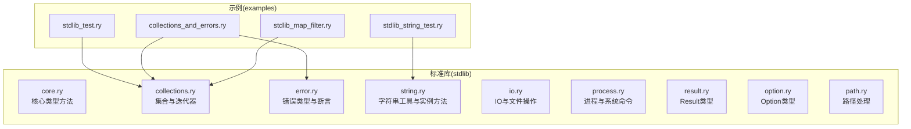
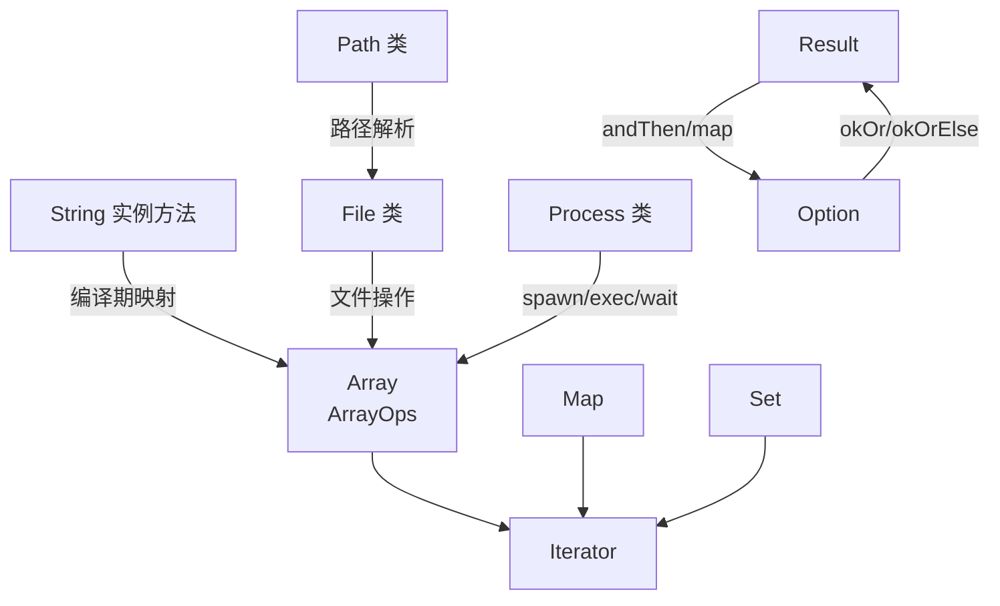
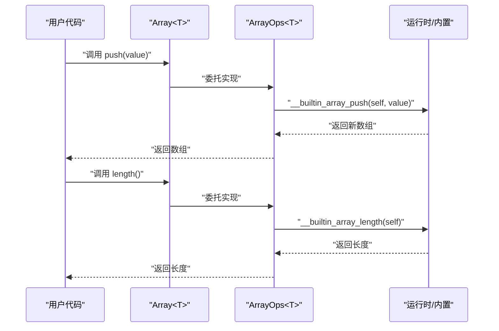
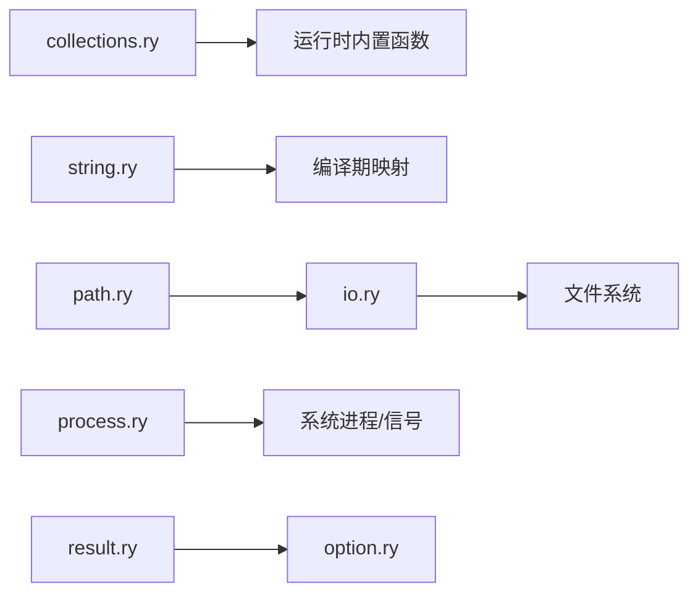

# 标准库参考

<cite>
**本文引用的文件**
- [core.ry](file://stdlib/core.ry)
- [collections.ry](file://stdlib/collections.ry)
- [error.ry](file://stdlib/error.ry)
- [string.ry](file://stdlib/string.ry)
- [io.ry](file://stdlib/io.ry)
- [process.ry](file://stdlib/process.ry)
- [result.ry](file://stdlib/result.ry)
- [option.ry](file://stdlib/option.ry)
- [path.ry](file://stdlib/path.ry)
- [stdlib_test.ry](file://examples/stdlib_test.ry)
- [collections_and_errors.ry](file://examples/collections_and_errors.ry)
- [stdlib_string_test.ry](file://examples/stdlib_string_test.ry)
- [stdlib_map_filter.ry](file://examples/stdlib_map_filter.ry)
</cite>

## 目录
1. [简介](#简介)
2. [项目结构](#项目结构)
3. [核心组件](#核心组件)
4. [架构总览](#架构总览)
5. [详细组件分析](#详细组件分析)
6. [依赖分析](#依赖分析)
7. [性能考虑](#性能考虑)
8. [故障排查指南](#故障排查指南)
9. [结论](#结论)
10. [附录](#附录)

## 简介
本参考文档面向Ruyi语言的标准库，系统梳理并解释以下模块与类型的行为与用法：
- 核心类型库：内置数据类型的实例方法（如整数、浮点、布尔的字符串化）
- 集合类型库：数组、映射、集合及其迭代器与常用操作
- 错误处理库：错误类型层次与断言工具
- 字符串处理库：字符串工具函数与实例方法
- IO库：控制台输入与文件系统操作
- 进程管理库：子进程创建、执行、等待、信号与环境变量
- 结果与可选类型：Result与Option的使用模式与最佳实践
- 路径处理库：跨平台路径解析与规范化

本参考强调API签名、参数说明、返回值、典型用法与注意事项，并辅以流程图与类图帮助理解。

## 项目结构
标准库位于 stdlib 目录，各模块按功能划分；示例代码位于 examples 目录，展示常见用法。

图表来源
- [core.ry:1-31](file://stdlib/core.ry#L1-L31)
- [collections.ry:1-480](file://stdlib/collections.ry#L1-L480)
- [error.ry:1-106](file://stdlib/error.ry#L1-L106)
- [string.ry:1-165](file://stdlib/string.ry#L1-L165)
- [io.ry:1-173](file://stdlib/io.ry#L1-L173)
- [process.ry:1-517](file://stdlib/process.ry#L1-L517)
- [result.ry:1-304](file://stdlib/result.ry#L1-L304)
- [option.ry:1-266](file://stdlib/option.ry#L1-L266)
- [path.ry:1-253](file://stdlib/path.ry#L1-L253)
- [stdlib_test.ry:1-38](file://examples/stdlib_test.ry#L1-L38)
- [collections_and_errors.ry:1-491](file://examples/collections_and_errors.ry#L1-L491)
- [stdlib_string_test.ry:1-29](file://examples/stdlib_string_test.ry#L1-L29)
- [stdlib_map_filter.ry:1-29](file://examples/stdlib_map_filter.ry#L1-L29)

章节来源
- [core.ry:1-31](file://stdlib/core.ry#L1-L31)
- [collections.ry:1-480](file://stdlib/collections.ry#L1-L480)
- [error.ry:1-106](file://stdlib/error.ry#L1-L106)
- [string.ry:1-165](file://stdlib/string.ry#L1-L165)
- [io.ry:1-173](file://stdlib/io.ry#L1-L173)
- [process.ry:1-517](file://stdlib/process.ry#L1-L517)
- [result.ry:1-304](file://stdlib/result.ry#L1-L304)
- [option.ry:1-266](file://stdlib/option.ry#L1-L266)
- [path.ry:1-253](file://stdlib/path.ry#L1-L253)
- [stdlib_test.ry:1-38](file://examples/stdlib_test.ry#L1-L38)
- [collections_and_errors.ry:1-491](file://examples/collections_and_errors.ry#L1-L491)
- [stdlib_string_test.ry:1-29](file://examples/stdlib_string_test.ry#L1-L29)
- [stdlib_map_filter.ry:1-29](file://examples/stdlib_map_filter.ry#L1-L29)

## 核心组件
- 核心类型方法：为内置标量类型提供基础方法（如整型、浮点型、布尔型的字符串化），这些方法在运行时由编译器桥接到底层实现。
- 集合类型：Array<T>通过ArrayOps trait扩展动态数组能力；Map<K,V>与Set<T>提供键值映射与无序去重集合；配套迭代器支持遍历。
- 错误类型：统一的Error基类及派生类型（类型错误、运行时错误、范围错误、断言失败、参数错误、空值错误、算术错误、迭代器错误、解析错误、IO错误等）；提供断言与空值断言辅助函数。
- 字符串工具：提供join、fromCharCode、fromCharCodes、concat、template、processTemplate等工具函数；字符串实例方法（长度、包含、前缀/后缀判断、索引、字符访问、重复、截取、大小写转换、修剪、分割等）由编译期映射到底层实现。
- IO与文件：提供从stdin读取一行、文件文本/行读写、存在性与类型检查、删除、目录创建等同步与异步接口。
- 进程管理：Process类封装子进程生命周期；ProcessOptions与ExecOptions配置工作目录、环境变量、shell与超时；Signal常量定义终止信号；环境变量访问与系统信息查询。
- 结果与可选：Result<T,E>与Option<T>分别表达“成功或失败”和“有值或缺省”的计算结果，提供映射、链式组合、过滤、展开与布尔转换等操作。
- 路径处理：Path类提供路径拼接、基名、目录名、扩展名、绝对/相对判定、规范化、变更扩展名、父子关系判断、相对路径计算与分隔符查询等。

章节来源
- [core.ry:11-30](file://stdlib/core.ry#L11-L30)
- [collections.ry:18-480](file://stdlib/collections.ry#L18-L480)
- [error.ry:10-106](file://stdlib/error.ry#L10-L106)
- [string.ry:16-165](file://stdlib/string.ry#L16-L165)
- [io.ry:17-173](file://stdlib/io.ry#L17-L173)
- [process.ry:19-517](file://stdlib/process.ry#L19-L517)
- [result.ry:18-304](file://stdlib/result.ry#L18-L304)
- [option.ry:14-266](file://stdlib/option.ry#L14-L266)
- [path.ry:19-253](file://stdlib/path.ry#L19-L253)

## 架构总览
下图展示了标准库主要模块之间的职责与交互关系。

图表来源
- [collections.ry:18-480](file://stdlib/collections.ry#L18-L480)
- [string.ry:104-165](file://stdlib/string.ry#L104-L165)
- [io.ry:34-173](file://stdlib/io.ry#L34-L173)
- [process.ry:19-517](file://stdlib/process.ry#L19-L517)
- [result.ry:18-304](file://stdlib/result.ry#L18-L304)
- [option.ry:14-266](file://stdlib/option.ry#L14-L266)
- [path.ry:19-253](file://stdlib/path.ry#L19-L253)

## 详细组件分析

### 核心类型库（Int/Float/Bool）
- Int.toString(self: int): string
- Float.toString(self: float): string
- Bool.toString(self: bool): string
- 行为：将标量值转换为字符串表示；具体实现由运行时桥接到底层函数。

章节来源
- [core.ry:12-30](file://stdlib/core.ry#L12-L30)

### 集合类型库（Array/Map/Set/Iterator）
- ArrayOps<T>（自动实现于所有 Array<T>）：
  - length(self): int
  - get(self, index: int): T
  - set(self, index: int, value: T): void
  - push(self, value: T): Array<T>
  - pop(self): T
  - map<U>(self, f: fn(T) -> U): Array<U>
  - filter(self, pred: fn(T) -> bool): Array<T>
  - reduce<U>(self, init: U, f: fn(U, T) -> U): U
  - forEach(self, f: fn(T) -> void): void
  - iter(self): ArrayIterator<T>
- ArrayIterator<T>：
  - next(self): T?
- Map<K,V>：
  - new(): Map<K,V>
  - size(self): int
  - get(self, key: K): V?
  - set(self, key: K, value: V): void
  - delete(self, key: K): bool
  - has(self, key: K): bool
  - keys(self): Array<K>
  - values(self): Array<V>
  - iter(self): MapIterator<K,V>
- MapIterator<K,V>：
  - next(self): {key: K, value: V}?
- Set<T>：
  - new(): Set<T>
  - size(self): int
  - add(self, value: T): void
  - delete(self, value: T): bool
  - has(self, value: T): bool
  - iter(self): SetIterator<T>
  - toArray(self): Array<T>
- SetIterator<T>：
  - next(self): T?

使用要点
- 访问越界会抛出范围错误；pop空数组也会抛出范围错误。
- Map/Set内部维护键列表以保证迭代顺序与一致性。
- 迭代器逐个消费元素，到达末尾返回null。

章节来源
- [collections.ry:39-480](file://stdlib/collections.ry#L39-L480)

#### ArrayOps 方法调用序列（push/length 示例）

图表来源
- [collections.ry:108-186](file://stdlib/collections.ry#L108-L186)

### 错误处理库（Error 及其派生、断言）
- Error 基类：message: string, stackTrace: Array<string>; 提供构造、获取消息与字符串化。
- 派生错误类型：TypeError、RuntimeError、RangeError、AssertionError、ArgumentError、NullError、ArithmeticError、IteratorError、ParseError、NullAssertionError、IOError。
- 断言工具：
  - assert(condition: bool, message: string): void
  - assertNotNull<T>(value: T?, message: string): T

使用要点
- assert在条件为假时抛出AssertionError；用于前置条件校验。
- assertNotNull在值为null时抛出NullAssertionError；用于非空假设。

章节来源
- [error.ry:10-106](file://stdlib/error.ry#L10-L106)

### 字符串处理库（工具函数与实例方法）
- 工具函数：
  - join(array: Array<dyn>, separator: string = ""): string
  - fromCharCode(code: int): string
  - fromCharCodes(codes: Array<int>): string
  - concat(args: ...string): string
  - template(templateStr: string, values: Array<dyn>): string
  - processTemplate(parts: Array<dyn>, context: dyn): string
- 字符串实例方法（编译期映射至底层）：
  - length(self: string): int
  - contains(self: string, substr: string): bool
  - startsWith(self: string, prefix: string): bool
  - endsWith(self: string, suffix: string): bool
  - indexOf(self: string, substr: string): int
  - lastIndexOf(self: string, substr: string): int
  - charAt(self: string, index: int): string
  - charCodeAt(self: string, index: int): int
  - repeat(self: string, count: int): string
  - substring(self: string, start: int, end: int): string
  - slice(self: string, start: int, end: int): string
  - toUpperCase(self: string): string
  - toLowerCase(self: string): string
  - trim(self: string): string
  - split(self: string, separator: string): Array<string>

使用要点
- 模板替换采用占位符{0}、{1}…进行位置替换。
- 字符串实例方法由编译器映射到底层实现，不直接在运行时执行源码体。

章节来源
- [string.ry:22-165](file://stdlib/string.ry#L22-L165)

### IO 库（控制台与文件）
- 控制台输入：
  - readLine(): string?（阻塞直到读取一行）
- 文件类 File：
  - readText(path: string): string
  - readTextAsync(path: string): Future<string>
  - writeText(path: string, content: string): void
  - writeTextAsync(path: string, content: string): Future<void>
  - readLines(path: string): Array<string>
  - readLinesAsync(path: string): Future<Array<string>>
  - writeLines(path: string, lines: Array<string>): void
  - writeLinesAsync(path: string, lines: Array<string>): Future<void>
  - exists(path: string): bool
  - isDirectory(path: string): bool
  - isFile(path: string): bool
  - delete(path: string): void
  - deleteAsync(path: string): Future<void>
  - mkdir(path: string, recursive: bool = false): void
  - mkdirAsync(path: string, recursive: bool = false): Future<void>

使用要点
- 所有文件操作支持同步与异步两种模式；异步版本返回Future以便await。
- 写入行数组时会以换行符连接内容再写入。

章节来源
- [io.ry:22-173](file://stdlib/io.ry#L22-L173)

### 进程管理库（Process/选项/异常/信号/环境）
- Process 类：
  - 静态 create(command: string, options: ProcessOptions?): Process
  - 静态 exec(command: string): ProcessResult
  - 静态 execWith(command: string, options: ExecOptions): ProcessResult
  - 静态 spawn(command: string, args: Array<string>?): Process
  - 静态 spawnWith(command: string, args: Array<string>?, options: ProcessOptions): Process
  - 实例 wait(): int
  - 实例 waitAsync(): Future<int>
  - 实例 kill(signal: int = 15): void
  - 实例 writeInput(input: string): void
  - 实例 closeInput(): void
  - 实例 readOutput(): string?
  - 实例 readError(): string?
  - 实例 toString(): string
- ProcessOptions：
  - cwd: string?
  - env: Map<string,string>?
  - shell: bool
  - default(): ProcessOptions
  - withCwd(path: string): ProcessOptions
  - withEnv(env: Map<string,string>): ProcessOptions
  - withShell(useShell: bool): ProcessOptions
- ExecOptions：
  - cwd: string?
  - env: Map<string,string>?
  - shell: bool
  - timeout: int?
  - default(): ExecOptions
  - withCwd(path: string): ExecOptions
  - withEnv(env: Map<string,string>): ExecOptions
  - withShell(useShell: bool): ExecOptions
  - withTimeout(ms: int): ExecOptions
- ProcessResult：
  - stdout: string
  - stderr: string
  - exitCode: int
  - success: bool
  - create(stdout: string, stderr: string, exitCode: int): ProcessResult
  - ensureSuccess(): void
- ProcessException：
  - message: string
  - process: Process?
  - create(message: string, process: Process? = null): ProcessException
  - getMessage(): string
- Signal 常量：HUP, INT, QUIT, KILL, TERM, USR1, USR2
- 环境与系统信息：
  - getEnv(name: string): string?
  - setEnv(name: string, value: string): void
  - getAllEnv(): Map<string,string>
  - getPID(): int
  - getPPID(): int
  - getPlatform(): string
  - getCPUCount(): int
  - getTotalMemory(): int
  - getFreeMemory(): int

使用要点
- 默认kill发送TERM信号（15）；KILL（9）不可被捕获。
- exec/execWith支持cwd/env/shell/timeout等配置。
- ensureSuccess会在非零退出码时抛出ProcessException。

章节来源
- [process.ry:19-517](file://stdlib/process.ry#L19-L517)

### 结果与可选类型（Result/Option）
- Result<T,E> = Ok<T,E> | Err<T,E>
  - Ok<T,E>：
    - isOk(self): bool
    - isErr(self): bool
    - unwrap(self): T
    - unwrapOr(self, default: T): T
    - unwrapOrElse(self, f: fn(E) -> T): T
    - map<U>(self, f: fn(T) -> U): Result<U,E>
    - mapErr<F>(self, f: fn(E) -> F): Result<T,F>
    - andThen<U>(self, f: fn(T) -> Result<U,E>): Result<U,E>
    - filter(self, pred: fn(T) -> bool): Result<T,E>
    - ok(self): Option<T>
    - err(self): Option<E>
    - forEach(self, f: fn(T) -> void): void
    - toOption(self): Option<T>
    - toBool(self): bool
    - toString(self): string
  - Err<T,E>：
    - isOk(self): bool
    - isErr(self): bool
    - unwrap(self): T（抛RuntimeError）
    - unwrapOr(self, default: T): T
    - unwrapOrElse(self, f: fn(E) -> T): T
    - map<U>(self, f: fn(T) -> U): Result<U,E>
    - mapErr<F>(self, f: fn(E) -> F): Result<T,F>
    - andThen<U>(self, f: fn(T) -> Result<U,E>): Result<U,E>
    - filter(self, pred: fn(T) -> bool): Result<T,E>
    - ok(self): Option<T>
    - err(self): Option<E>
    - forEach(self, f: fn(T) -> void): void
    - toOption(self): Option<T>
    - toBool(self): bool
    - toString(self): string
- Option<T> = Some<T> | None
  - Some<T>：包含值，提供unwrap/unwrapOr/unwrapOrElse/map/andThen/filter/flatten/okOr/okOrElse/forEach/toString等
  - None：提供unwrap（抛RuntimeError）、unwrapOr/unwrapOrElse/map/andThen/filter/flatten/okOr/okOrElse/forEach/toString等

使用要点
- Result适合表达可能失败的计算；Option适合表达可缺失的值。
- andThen用于链式组合，map/mapErr用于变换成功/错误分支。
- ok()/err()在Result与Option之间互转。

章节来源
- [result.ry:18-304](file://stdlib/result.ry#L18-L304)
- [option.ry:14-266](file://stdlib/option.ry#L14-L266)

### 路径处理库（Path）
- Path 类：
  - join(paths: ...string): string
  - basename(path: string): string
  - basenameNoExt(path: string): string
  - dirname(path: string): string
  - extname(path: string): string
  - isAbsolute(path: string): bool
  - isRelative(path: string): bool
  - resolve(base: string, relative: string): string
  - normalize(path: string): string
  - withoutExt(path: string): string
  - changeExt(path: string, newExt: string): string
  - compare(path1: string, path2: string): int
  - equals(path1: string, path2: string): bool
  - parents(path: string): Array<string>
  - isChildOf(parent: string, child: string): bool
  - relative(from: string, to: string): string
  - separator(): string
- 辅助函数：
  - hasExt(path: string, ext: string): bool
  - getExts(path: string): string

使用要点
- 跨平台路径分隔符由底层实现适配。
- equals先归一化再比较，isChildOf基于规范化路径前缀判断。

章节来源
- [path.ry:19-253](file://stdlib/path.ry#L19-L253)

## 依赖分析
- 集合模块对运行时内置函数有直接依赖（如数组长度、数组访问、映射/集合操作等），并在边界条件下抛出RangeError。
- 字符串模块通过编译期映射将实例方法绑定到底层实现，避免运行时开销。
- IO模块依赖底层文件系统与标准输入输出；File类提供同步与异步双接口。
- 进程模块依赖系统进程管理与信号机制；ProcessOptions/ExecOptions提供灵活配置。
- Result/Option与集合、IO、进程等模块解耦，通过类型系统协作。
- 路径模块与IO模块配合，用于文件定位与目录操作。

图表来源
- [collections.ry:108-186](file://stdlib/collections.ry#L108-L186)
- [string.ry:96-165](file://stdlib/string.ry#L96-L165)
- [io.ry:34-173](file://stdlib/io.ry#L34-L173)
- [process.ry:19-517](file://stdlib/process.ry#L19-L517)
- [result.ry:18-304](file://stdlib/result.ry#L18-L304)
- [option.ry:14-266](file://stdlib/option.ry#L14-L266)
- [path.ry:19-253](file://stdlib/path.ry#L19-L253)

## 性能考虑
- 数组操作
  - push/pop/length/get/set等为O(1)摊还或固定时间；map/filter/reduce/forEach为O(n)。
  - 对大数组进行频繁插入/删除可能导致内存重分配与复制，建议批量操作或使用合适的数据结构。
- 映射与集合
  - 基于底层哈希表实现，平均O(1)插入/查找/删除；最坏情况下退化为O(n)。
  - Map/Set维护键列表以保证迭代顺序，额外带来O(1)空间与O(1)写入开销。
- 字符串
  - 模板替换与拼接涉及多次字符串构建，建议在热点路径中减少中间对象创建。
- IO
  - 同步IO会阻塞线程；优先使用异步接口（readTextAsync/writeTextAsync/readLinesAsync等）以提升吞吐。
- 进程
  - spawn/exec会创建新进程，成本较高；尽量复用已有进程或批处理任务。
- 结果与可选
  - Result/Option为轻量包装，链式操作（andThen/map）避免了深层嵌套与显式判空，有利于性能与可读性。

## 故障排查指南
- 数组越界
  - 症状：调用get/set时抛出范围错误；pop空数组抛出范围错误。
  - 处理：在访问前检查长度或使用安全访问模式。
- 断言失败
  - 症状：assert或assertNotNull触发异常。
  - 处理：在调用前验证前置条件，或捕获AssertionError/NullAssertionError进行恢复。
- 文件操作失败
  - 症状：exists/isFile/isDirectory返回false；读写抛出IOError。
  - 处理：检查路径与权限；使用异步接口并处理Future完成状态。
- 子进程异常
  - 症状：wait返回非零退出码；ensureSuccess抛出ProcessException。
  - 处理：检查命令、工作目录与环境变量；必要时设置超时与shell开关。
- 路径比较不一致
  - 症状：路径相等但未被equals判定为相等。
  - 处理：使用normalize后再比较，或使用isChildOf进行父子关系判断。

章节来源
- [collections.ry:113-136](file://stdlib/collections.ry#L113-L136)
- [error.ry:94-106](file://stdlib/error.ry#L94-L106)
- [io.ry:116-153](file://stdlib/io.ry#L116-L153)
- [process.ry:376-382](file://stdlib/process.ry#L376-L382)
- [path.ry:165-202](file://stdlib/path.ry#L165-L202)

## 结论
Ruyi标准库提供了完备的基础设施：核心类型方法、集合与迭代器、字符串工具、IO与文件、进程管理、结果与可选类型以及路径处理。通过清晰的API设计与类型系统，开发者可以编写安全、高效且易维护的程序。建议在性能敏感场景优先采用异步IO与惰性/流式处理，在错误处理上善用Result/Option与断言工具，以获得更好的可读性与可靠性。

## 附录

### API 索引与示例路径
- 数组与集合
  - [数组操作示例:8-13](file://examples/stdlib_test.ry#L8-L13)
  - [map/filter/reduce示例:7-25](file://examples/stdlib_map_filter.ry#L7-L25)
  - [集合与错误综合示例:364-469](file://examples/collections_and_errors.ry#L364-L469)
- 字符串
  - [字符串实例方法示例:6-25](file://examples/stdlib_string_test.ry#L6-L25)
  - [模板与连接示例:64-91](file://stdlib/string.ry#L64-L91)
- IO
  - [文件读写与行处理示例:40-109](file://stdlib/io.ry#L40-L109)
- 进程
  - [进程创建与等待示例:55-133](file://stdlib/process.ry#L55-L133)
  - [exec/execWith示例:70-82](file://stdlib/process.ry#L70-L82)
- 结果与可选
  - [Result/Option用法示例:18-304](file://stdlib/result.ry#L18-L304)
  - [Option用法示例:14-266](file://stdlib/option.ry#L14-L266)
- 路径
  - [路径处理示例:26-253](file://stdlib/path.ry#L26-L253)