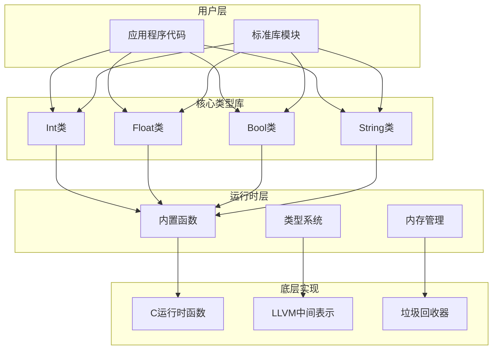
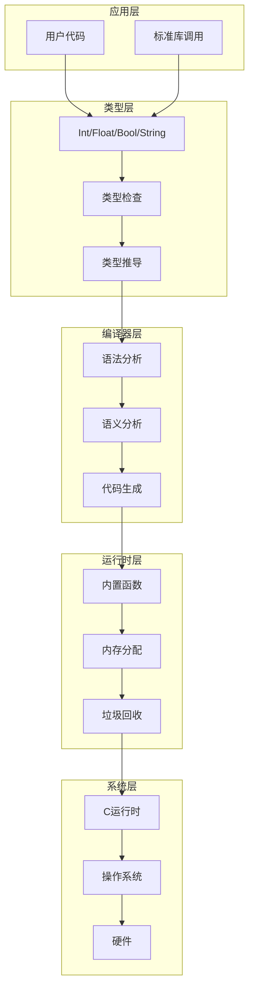
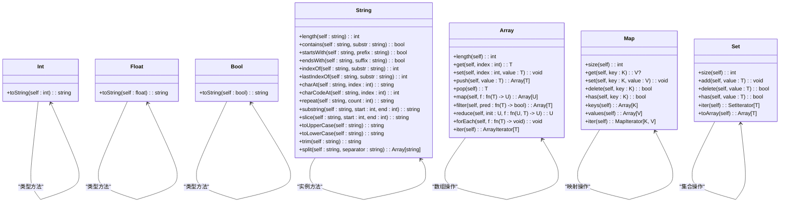
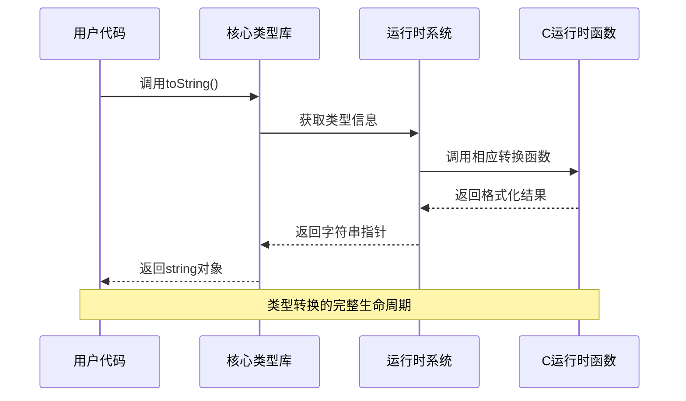
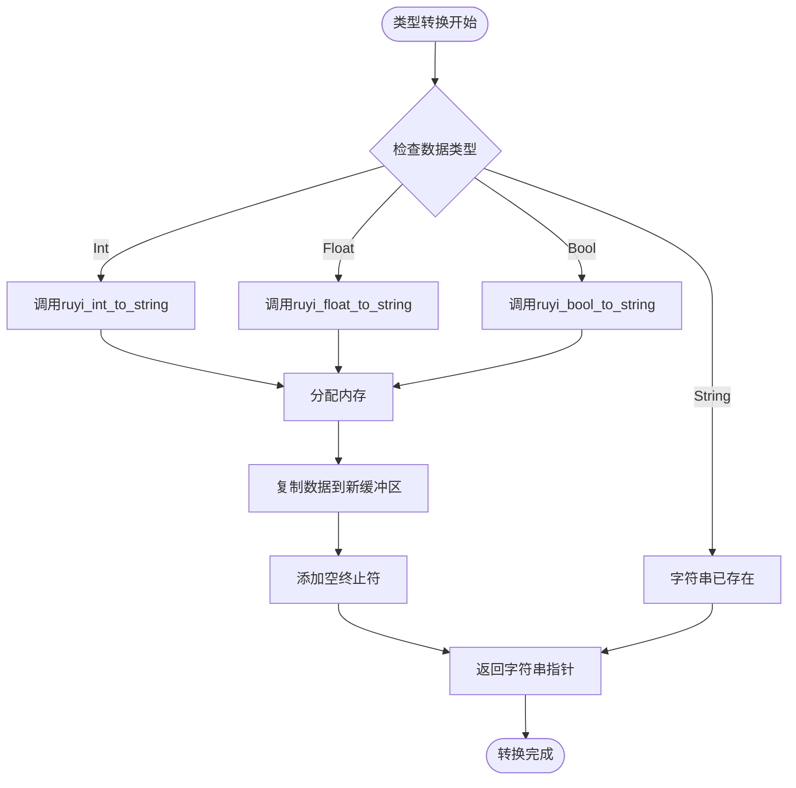
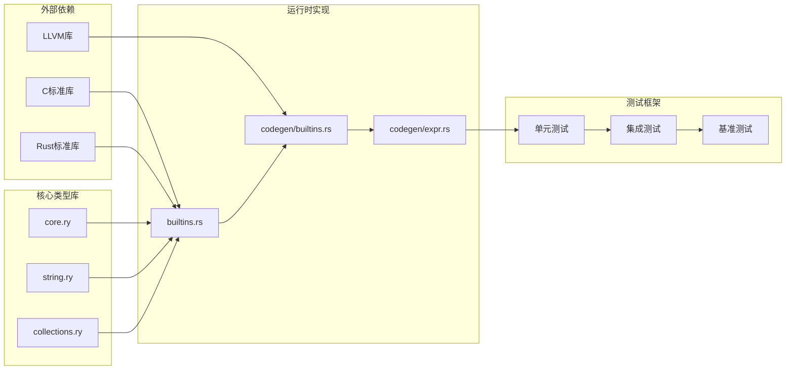

# 核心类型库

<cite>
**本文档引用的文件**
- [core.ry](file://stdlib/core.ry)
- [string.ry](file://stdlib/string.ry)
- [builtins.rs](file://crates/ruyi_runtime/src/builtins.rs)
- [builtins.rs（代码生成）](file://crates/ruyic/src/codegen/builtins.rs)
- [expr.rs（表达式编译）](file://crates/ruyic/src/codegen/expr.rs)
- [collections.ry](file://stdlib/collections.ry)
</cite>

## 目录
1. [简介](#简介)
2. [项目结构](#项目结构)
3. [核心组件](#核心组件)
4. [架构概览](#架构概览)
5. [详细组件分析](#详细组件分析)
6. [依赖分析](#依赖分析)
7. [性能考虑](#性能考虑)
8. [故障排除指南](#故障排除指南)
9. [结论](#结论)

## 简介

Ruyi核心类型库是语言运行时系统的基础模块，提供了对基本数据类型Int、Float、Bool的统一抽象和操作接口。该库采用"自动可用"的设计理念，所有程序在启动时都会自动导入这些核心类型，无需显式的import声明。

核心类型库的核心设计目标包括：
- 提供类型安全的基本数据操作
- 实现与运行时系统的无缝集成
- 支持类型转换和格式化功能
- 建立统一的字符串处理机制
- 为上层标准库提供基础支撑

## 项目结构

核心类型库主要由以下三个层次组成：

**图表来源**
- [core.ry:11-30](file://stdlib/core.ry#L11-L30)
- [string.ry:104-165](file://stdlib/string.ry#L104-L165)
- [builtins.rs:18-73](file://crates/ruyi_runtime/src/builtins.rs#L18-L73)

**章节来源**
- [core.ry:1-31](file://stdlib/core.ry#L1-L31)
- [string.ry:1-165](file://stdlib/string.ry#L1-L165)

## 核心组件

### Int类（整数类型）

Int类为整数值提供了完整的类型级操作接口，目前主要支持toString方法用于格式化输出。

**核心特性：**
- 类型标识：int
- 自动可用：所有程序默认导入
- 方法支持：toString()
- 内存模型：值类型，直接存储在栈上

**类型转换：**
- 从int到string：通过ruyi_int_to_string实现
- 从string到int：通过运行时解析函数实现

### Float类（浮点类型）

Float类为浮点数值提供了类型级操作接口，支持toString方法和各种数学运算。

**核心特性：**
- 类型标识：float
- 数学运算：abs、min、max、round、floor、ceil等
- 格式化：toString()方法
- 精度支持：双精度浮点数

**类型转换：**
- 从float到string：通过ruyi_float_to_string实现
- 从string到float：通过运行时解析函数实现

### Bool类（布尔类型）

Bool类为布尔值提供了类型级操作接口，主要用于逻辑判断和条件控制。

**核心特性：**
- 类型标识：bool
- 逻辑运算：与、或、非操作
- 格式化：toString()方法
- 条件控制：if语句、三元运算符

**类型转换：**
- 从bool到string：通过ruyi_bool_to_string实现
- 从string到bool：通过运行时解析函数实现

### String类（字符串类型）

String类提供了丰富的字符串操作方法，包括长度计算、子串提取、大小写转换等。

**核心特性：**
- 长度计算：length()
- 子串操作：substring()、slice()
- 大小写转换：toUpperCase()、toLowerCase()
- 搜索功能：indexOf()、startsWith()、endsWith()
- 字符访问：charAt()、charCodeAt()

**章节来源**
- [core.ry:11-30](file://stdlib/core.ry#L11-L30)
- [string.ry:104-165](file://stdlib/string.ry#L104-L165)

## 架构概览

核心类型库采用分层架构设计，确保了良好的模块化和可扩展性：

**图表来源**
- [builtins.rs（代码生成）:16-85](file://crates/ruyic/src/codegen/builtins.rs#L16-L85)
- [expr.rs（表达式编译）:938-1045](file://crates/ruyic/src/codegen/expr.rs#L938-L1045)

**章节来源**
- [builtins.rs（代码生成）:1-855](file://crates/ruyic/src/codegen/builtins.rs#L1-L855)
- [expr.rs（表达式编译）:1-1951](file://crates/ruyic/src/codegen/expr.rs#L1-L1951)

## 详细组件分析

### 类定义与继承关系

**图表来源**
- [core.ry:11-30](file://stdlib/core.ry#L11-L30)
- [string.ry:104-165](file://stdlib/string.ry#L104-L165)
- [collections.ry:18-480](file://stdlib/collections.ry#L18-L480)

### 类型转换流程

**图表来源**
- [builtins.rs:21-73](file://crates/ruyi_runtime/src/builtins.rs#L21-L73)
- [expr.rs（表达式编译）:990-1045](file://crates/ruyic/src/codegen/expr.rs#L990-L1045)

### 内存管理策略

**图表来源**
- [builtins.rs:18-73](file://crates/ruyi_runtime/src/builtins.rs#L18-L73)

**章节来源**
- [core.ry:11-30](file://stdlib/core.ry#L11-L30)
- [string.ry:104-165](file://stdlib/string.ry#L104-L165)
- [builtins.rs:18-73](file://crates/ruyi_runtime/src/builtins.rs#L18-L73)

## 依赖分析

核心类型库的依赖关系体现了清晰的分层架构：

**图表来源**
- [builtins.rs（代码生成）:1-855](file://crates/ruyic/src/codegen/builtins.rs#L1-L855)
- [expr.rs（表达式编译）:1-1951](file://crates/ruyic/src/codegen/expr.rs#L1-L1951)

**章节来源**
- [builtins.rs（代码生成）:1-855](file://crates/ruyic/src/codegen/builtins.rs#L1-L855)
- [expr.rs（表达式编译）:1-1951](file://crates/ruyic/src/codegen/expr.rs#L1-L1951)

## 性能考虑

### 内存分配优化

核心类型库采用了高效的内存管理策略：

1. **零拷贝原则**：字符串操作尽量避免不必要的内存复制
2. **延迟分配**：只有在需要时才进行内存分配
3. **批量处理**：支持批量字符串操作以减少系统调用开销

### 编译时优化

**图表来源**
- [builtins.rs（代码生成）:1-855](file://crates/ruyic/src/codegen/builtins.rs#L1-L855)

## 故障排除指南

### 常见问题及解决方案

**问题1：类型转换失败**
- 症状：toString()方法抛出异常
- 解决方案：检查输入数据类型是否正确
- 预防措施：在调用前进行类型检查

**问题2：内存泄漏**
- 症状：程序运行时间越长占用内存越多
- 解决方案：确认所有字符串指针都正确释放
- 预防措施：使用RAII模式管理资源

**问题3：性能问题**
- 症状：字符串操作速度慢
- 解决方案：考虑使用StringBuilder模式
- 预防措施：避免频繁的字符串拼接操作

**章节来源**
- [builtins.rs:18-73](file://crates/ruyi_runtime/src/builtins.rs#L18-L73)

## 结论

Ruyi核心类型库通过精心设计的架构和实现，为整个语言生态系统提供了坚实的基础。其主要优势包括：

1. **设计理念先进**：采用自动可用和类型安全的设计原则
2. **性能表现优秀**：通过编译时优化和运行时高效实现
3. **扩展性强**：清晰的分层架构便于功能扩展
4. **易用性好**：简洁的API设计降低了学习成本

未来的发展方向包括：
- 扩展更多内置类型和操作
- 优化性能表现
- 增强错误处理机制
- 完善文档和示例

核心类型库作为Ruyi语言的重要组成部分，将继续为开发者提供可靠、高效的编程体验。