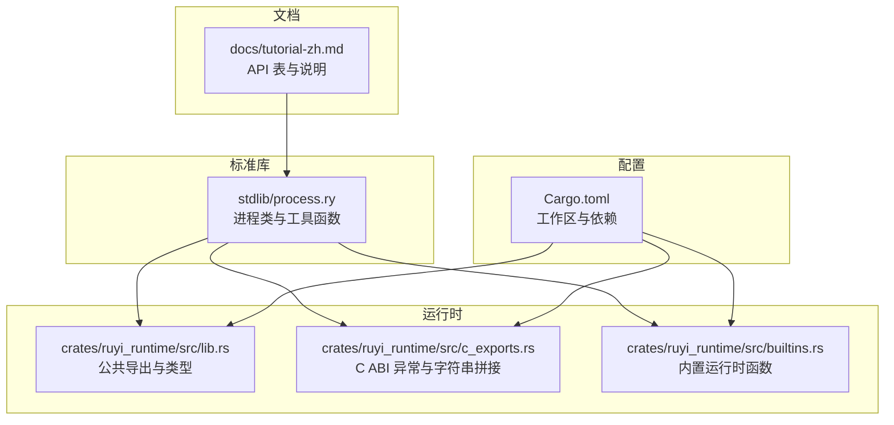
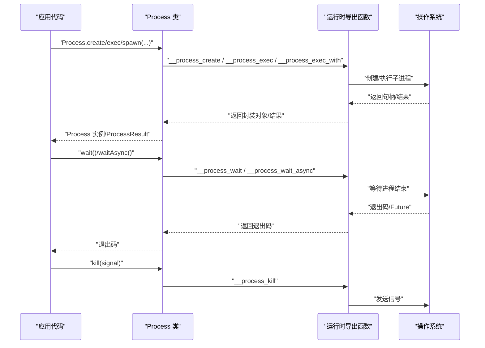
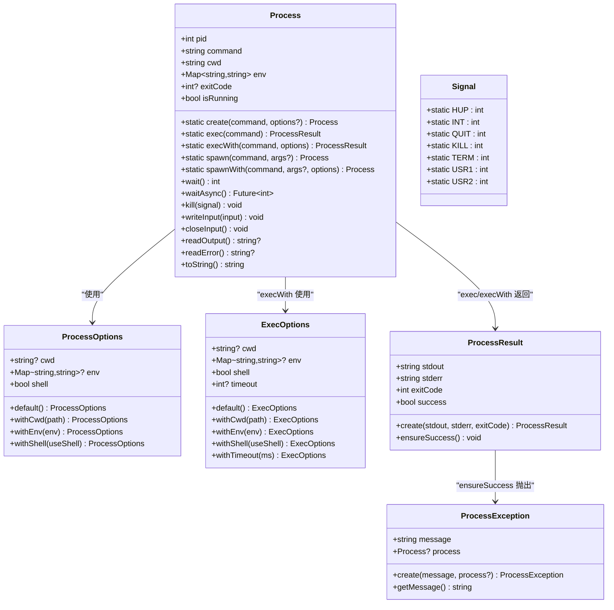
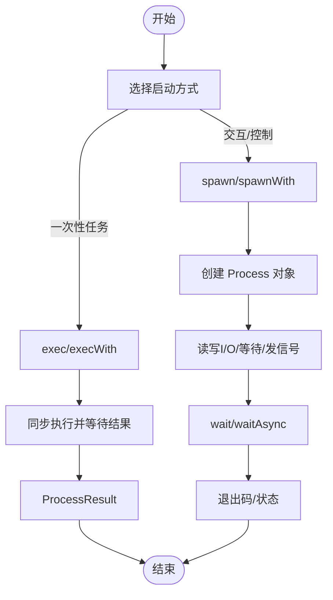
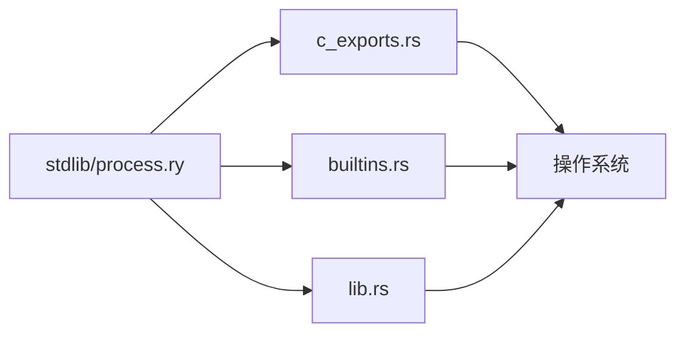

# 进程管理库

<cite>
**本文引用的文件**
- [process.ry](file://stdlib/process.ry)
- [tutorial-zh.md](file://docs/tutorial-zh.md)
- [Cargo.toml](file://Cargo.toml)
- [lib.rs](file://crates/ruyi_runtime/src/lib.rs)
- [c_exports.rs](file://crates/ruyi_runtime/src/c_exports.rs)
- [builtins.rs](file://crates/ruyi_runtime/src/builtins.rs)
</cite>

## 目录
1. [简介](#简介)
2. [项目结构](#项目结构)
3. [核心组件](#核心组件)
4. [架构概览](#架构概览)
5. [详细组件分析](#详细组件分析)
6. [依赖分析](#依赖分析)
7. [性能考量](#性能考量)
8. [故障排除指南](#故障排除指南)
9. [结论](#结论)
10. [附录](#附录)

## 简介
本文件为 Ruyi 语言标准库中的“进程管理”模块提供完整的 API 参考与实践指南。该模块覆盖以下能力：
- 进程创建与启动：支持同步与异步两种执行模式，可传入命令、参数、工作目录与环境变量等选项。
- 进程控制：等待退出、发送信号、读写标准输入/输出/错误流。
- 环境与系统信息：读取/设置环境变量、查询当前进程/父进程 ID、平台信息、CPU 与内存信息。
- 结果与异常：统一的结果对象与异常类型，便于错误处理与资源清理。
- 安全与最佳实践：参数拼接风险、信号选择、资源释放与健壮性建议。

## 项目结构
Ruyi 的进程管理能力由标准库模块提供，同时底层运行时通过 C ABI 导出函数桥接到宿主系统。关键位置如下：
- 标准库进程模块：stdlib/process.ry
- 运行时导出与内置函数：crates/ruyi_runtime/src/lib.rs、c_exports.rs、builtins.rs
- 文档与教程：docs/tutorial-zh.md
- 工作区配置：Cargo.toml

图表来源
- [process.ry](file://stdlib/process.ry)
- [lib.rs](file://crates/ruyi_runtime/src/lib.rs)
- [c_exports.rs](file://crates/ruyi_runtime/src/c_exports.rs)
- [builtins.rs](file://crates/ruyi_runtime/src/builtins.rs)
- [tutorial-zh.md](file://docs/tutorial-zh.md)
- [Cargo.toml](file://Cargo.toml)

章节来源
- [process.ry](file://stdlib/process.ry)
- [lib.rs](file://crates/ruyi_runtime/src/lib.rs)
- [c_exports.rs](file://crates/ruyi_runtime/src/c_exports.rs)
- [builtins.rs](file://crates/ruyi_runtime/src/builtins.rs)
- [tutorial-zh.md](file://docs/tutorial-zh.md)
- [Cargo.toml](file://Cargo.toml)

## 核心组件
- 进程类 Process：封装单个子进程的生命周期与 I/O 控制。
- 选项类 ProcessOptions/ExecOptions：用于配置工作目录、环境变量、是否使用 shell、超时等。
- 结果类 ProcessResult：封装 stdout/stderr/exitCode/success。
- 异常类 ProcessException：统一的进程操作异常。
- 信号常量 Signal：常用信号值集合。
- 环境与系统信息函数：getEnv/setEnv/getAllEnv、getPID/getPPID、getPlatform/getCPUCount/getTotalMemory/getFreeMemory。

章节来源
- [process.ry](file://stdlib/process.ry)
- [tutorial-zh.md](file://docs/tutorial-zh.md)

## 架构概览
下图展示从应用代码到运行时导出函数的调用链路，以及进程类方法如何映射到底层 C ABI 函数。

图表来源
- [process.ry](file://stdlib/process.ry)
- [c_exports.rs](file://crates/ruyi_runtime/src/c_exports.rs)
- [builtins.rs](file://crates/ruyi_runtime/src/builtins.rs)

## 详细组件分析

### 进程类 Process
- 关键字段
  - pid：进程标识符（平台相关）
  - command：启动命令
  - cwd/env：工作目录与环境变量
  - exitCode/isRunning：退出码与运行状态
- 关键方法
  - 静态工厂
    - create(command, options?)：创建并启动进程
    - exec(command) / execWith(command, options)：同步执行命令并返回结果
    - spawn(command, args?) / spawnWith(command, args?, options)：以参数数组形式启动
  - 实例方法
    - wait()：阻塞等待进程结束并返回退出码
    - waitAsync()：异步等待并返回 Future
    - kill(signal=15)：向进程发送信号
    - writeInput(input)/closeInput()：向 stdin 写入或关闭
    - readOutput()/readError()：读取 stdout/stderr
    - toString()：进程信息字符串化

图表来源
- [process.ry](file://stdlib/process.ry)

章节来源
- [process.ry](file://stdlib/process.ry)

### 进程启动与参数传递
- 同步执行：exec(command) 与 execWith(command, options)，适合一次性任务，返回 ProcessResult。
- 子进程创建：spawn(command, args?) 与 spawnWith(command, args?, options)，适合需要交互与控制的场景。
- 参数拼接：spawn 内部将 args 数组合并为命令字符串；建议优先使用带参数数组的 spawnWith，避免手动拼接带来的注入与转义问题。

图表来源
- [process.ry](file://stdlib/process.ry)

章节来源
- [process.ry](file://stdlib/process.ry)

### 环境变量与系统信息
- 环境变量：getEnv(name)、setEnv(name, value)、getAllEnv() 提供读取/设置/批量获取。
- 系统信息：getPID()/getPPID()、getPlatform()、getCPUCount()、getTotalMemory()/getFreeMemory()。

章节来源
- [process.ry](file://stdlib/process.ry)

### 信号处理与状态监控
- 信号常量：Signal.HUP/INT/QUIT/KILL/TERM/USR1/USR2。
- 状态监控：isRunning、exitCode 字段；wait()/waitAsync() 返回/解析退出码。
- 建议：优先使用 TERM（15）优雅终止，必要时使用 KILL（9）强制终止；结合超时与重试策略。

章节来源
- [process.ry](file://stdlib/process.ry)

### 错误处理与异常
- ProcessResult.ensureSuccess()：非零退出码时抛出 ProcessException。
- ProcessException：携带 message 与可选的 process 引用，便于定位问题。

章节来源
- [process.ry](file://stdlib/process.ry)

### 进程间通信与 I/O
- 标准输入：writeInput(input)、closeInput()。
- 标准输出/错误：readOutput()、readError()。
- 建议：在长时间运行的任务中定期读取输出，避免缓冲区阻塞；对敏感数据使用独立的临时文件或管道。

章节来源
- [process.ry](file://stdlib/process.ry)

### 进程组、会话与守护进程
- 当前标准库未提供显式的进程组（setpgid）与会话（setsid）管理 API。
- 若需守护进程行为，可在外部 shell 或系统层实现（例如使用 nohup/shell 作业控制），并在 Ruyi 中通过 exec/execWith 启动。
- 注意：跨平台差异较大，建议在目标平台进行充分测试。

章节来源
- [process.ry](file://stdlib/process.ry)

## 依赖分析
- 标准库进程模块依赖运行时导出函数（以 __process_* 与 __process_get_* 前缀命名），这些函数由运行时实现并通过 C ABI 暴露。
- 运行时公共导出包括分配、GC、异常与内置函数等，为进程模块提供基础支撑。
- 工作区通过 Cargo.toml 统一管理依赖与构建配置。

图表来源
- [process.ry](file://stdlib/process.ry)
- [lib.rs](file://crates/ruyi_runtime/src/lib.rs)
- [c_exports.rs](file://crates/ruyi_runtime/src/c_exports.rs)
- [builtins.rs](file://crates/ruyi_runtime/src/builtins.rs)

章节来源
- [Cargo.toml](file://Cargo.toml)
- [lib.rs](file://crates/ruyi_runtime/src/lib.rs)
- [c_exports.rs](file://crates/ruyi_runtime/src/c_exports.rs)
- [builtins.rs](file://crates/ruyi_runtime/src/builtins.rs)

## 性能考量
- I/O 读写：频繁读取 stdout/stderr 时建议批量读取，减少系统调用次数。
- 等待策略：waitAsync 适合高并发场景；wait 则简单直接但会阻塞当前线程。
- 超时控制：ExecOptions 支持 timeout，避免长时间挂起；结合信号与异常处理提升健壮性。
- 环境变量与工作目录：尽量复用已设置的 Map 与路径，减少重复构造。

## 故障排除指南
- 进程无输出或卡死
  - 检查是否正确读取 stdout/stderr；必要时调用 closeInput() 避免阻塞。
  - 使用 waitAsync 并设置合理超时。
- 退出码非零
  - 使用 ProcessResult.ensureSuccess() 捕获异常并查看 stderr。
- 权限与路径问题
  - 确认命令可执行且路径正确；在 Windows 上注意扩展名与大小写。
- 跨平台差异
  - 平台返回的 pid 与信号语义可能不同，建议通过 getPlatform() 分支处理。

章节来源
- [process.ry](file://stdlib/process.ry)

## 结论
Ruyi 的进程管理库提供了简洁而强大的 API，覆盖了从创建、控制到结果处理的完整流程。通过选项类与结果类的配合，开发者可以方便地实现同步与异步执行、参数与环境管理、I/O 交互与信号控制。对于更高级的进程组/会话管理，建议结合外部系统能力使用。遵循本文的安全与最佳实践，可显著提升程序的稳定性与可维护性。

## 附录

### API 一览（静态方法）
- Process.create(command, options?)
- Process.exec(command)
- Process.execWith(command, options)
- Process.spawn(command, args?)
- Process.spawnWith(command, args?, options)

章节来源
- [tutorial-zh.md](file://docs/tutorial-zh.md)
- [process.ry](file://stdlib/process.ry)