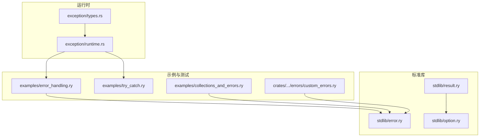
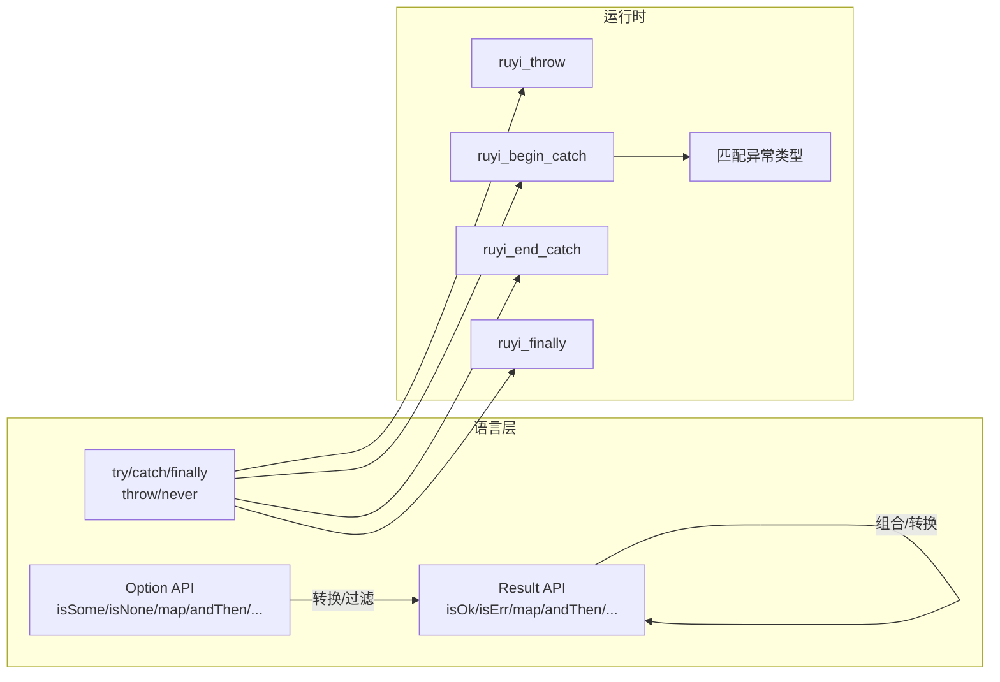
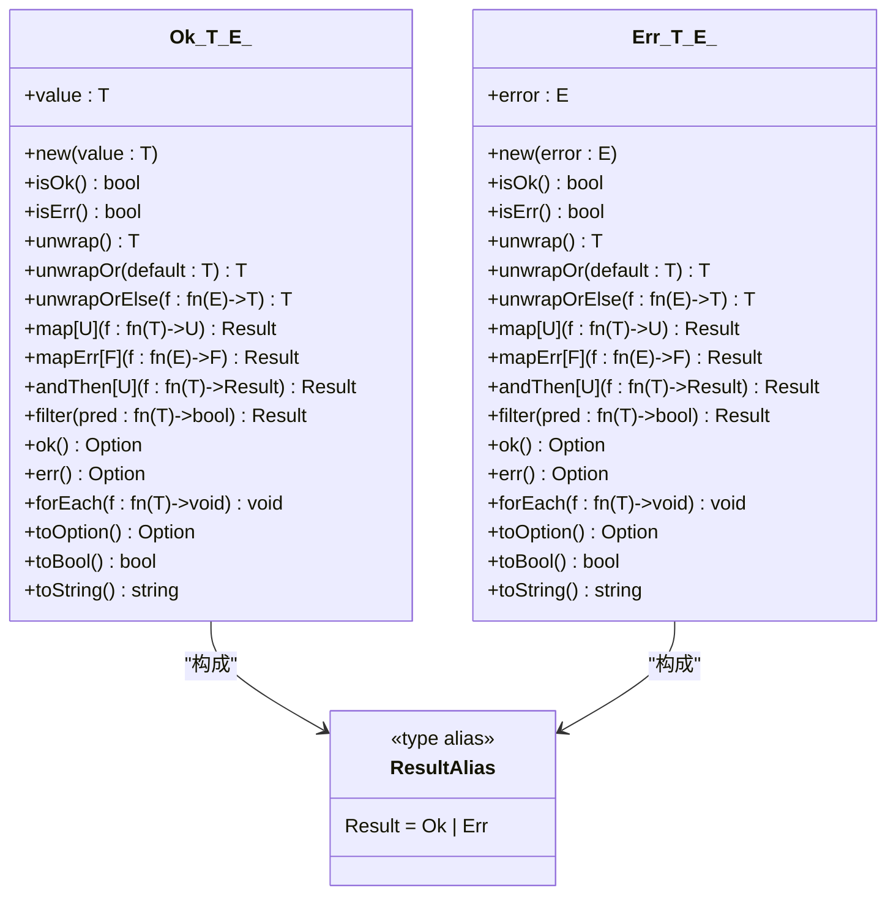
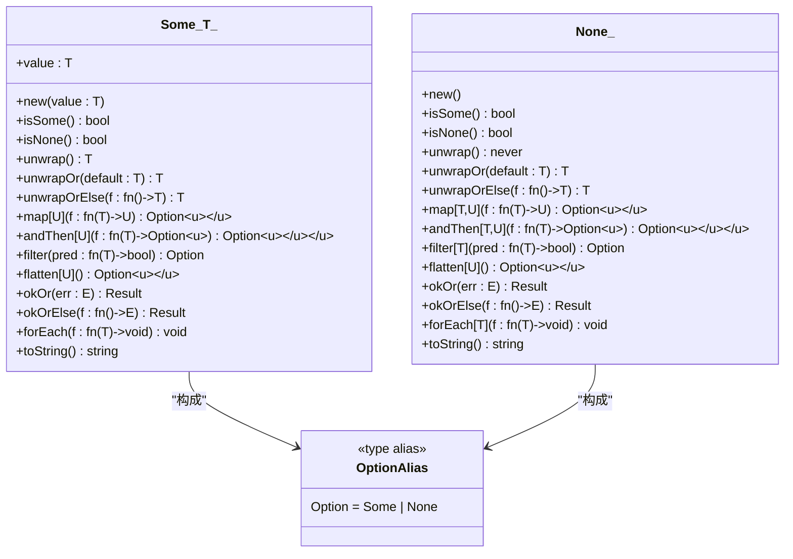
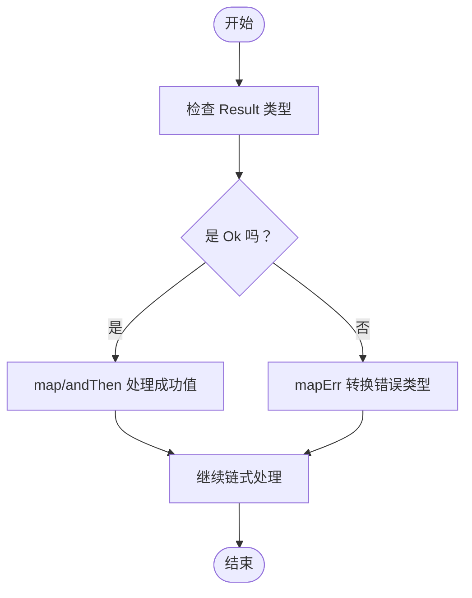
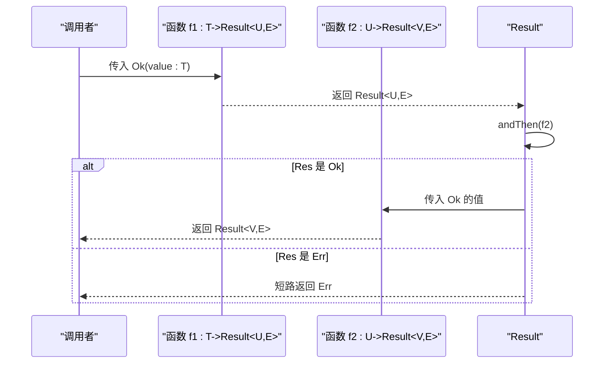
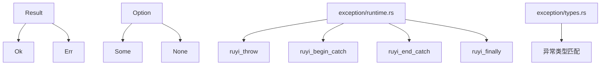

# 错误处理库

<cite>
**本文档引用的文件**
- [stdlib/error.ry](file://stdlib/error.ry)
- [stdlib/result.ry](file://stdlib/result.ry)
- [stdlib/option.ry](file://stdlib/option.ry)
- [examples/error_handling.ry](file://examples/error_handling.ry)
- [examples/try_catch.ry](file://examples/try_catch.ry)
- [crates/ruyi_runtime/src/exception/runtime.rs](file://crates/ruyi_runtime/src/exception/runtime.rs)
- [crates/ruyi_runtime/src/exception/types.rs](file://crates/ruyi_runtime/src/exception/types.rs)
- [examples/collections_and_errors.ry](file://examples/collections_and_errors.ry)
- [crates/ruyic/tests/integration/cases/errors/custom_errors.ry](file://crates/ruyic/tests/integration/cases/errors/custom_errors.ry)
</cite>

## 目录
1. [简介](#简介)
2. [项目结构](#项目结构)
3. [核心组件](#核心组件)
4. [架构总览](#架构总览)
5. [详细组件分析](#详细组件分析)
6. [依赖分析](#依赖分析)
7. [性能考虑](#性能考虑)
8. [故障排查指南](#故障排查指南)
9. [结论](#结论)
10. [附录](#附录)

## 简介
本文件为 Ruyi 错误处理库的详细 API 参考与使用指南，覆盖以下主题：
- Result 类型：显式错误处理，Ok/Err 的构造与判别、映射（map）、链式组合（and_then）、过滤（filter）、转换为 Option/布尔/字符串等方法。
- Option 类型：可选值处理，Some/None 的构造与判别、映射（map）、链式组合（and_then）、过滤（filter）、展开（flatten）、转换为 Result 等方法。
- 错误传播、错误转换与错误恢复的实用模式。
- 与 try-catch 的对应关系与选择建议。
- 最佳实践与性能考量。

## 项目结构
Ruyi 标准库中与错误处理直接相关的模块与示例分布如下：
- 标准库模块
  - 错误类型与断言：stdlib/error.ry
  - 结果类型 Result：stdlib/result.ry
  - 可选类型 Option：stdlib/option.ry
- 运行时异常支持
  - 异常运行时与 LLVM 支持：crates/ruyi_runtime/src/exception/runtime.rs
  - 异常类型与对象布局：crates/ruyi_runtime/src/exception/types.rs
- 示例与用法演示
  - 传统 try/catch/finally 演示：examples/error_handling.ry、examples/try_catch.ry
  - 集合与错误综合示例：examples/collections_and_errors.ry
  - 自定义错误与捕获：crates/ruyic/tests/integration/cases/errors/custom_errors.ry



图表来源
- [stdlib/error.ry:1-106](file://stdlib/error.ry#L1-L106)
- [stdlib/result.ry:1-304](file://stdlib/result.ry#L1-L304)
- [stdlib/option.ry:1-266](file://stdlib/option.ry#L1-L266)
- [crates/ruyi_runtime/src/exception/runtime.rs:1-359](file://crates/ruyi_runtime/src/exception/runtime.rs#L1-L359)
- [crates/ruyi_runtime/src/exception/types.rs:1-167](file://crates/ruyi_runtime/src/exception/types.rs#L1-L167)
- [examples/error_handling.ry:1-230](file://examples/error_handling.ry#L1-L230)
- [examples/try_catch.ry:1-14](file://examples/try_catch.ry#L1-L14)
- [examples/collections_and_errors.ry:1-491](file://examples/collections_and_errors.ry#L1-L491)
- [crates/ruyic/tests/integration/cases/errors/custom_errors.ry:1-29](file://crates/ruyic/tests/integration/cases/errors/custom_errors.ry#L1-L29)

章节来源
- [stdlib/error.ry:1-106](file://stdlib/error.ry#L1-L106)
- [stdlib/result.ry:1-304](file://stdlib/result.ry#L1-L304)
- [stdlib/option.ry:1-266](file://stdlib/option.ry#L1-L266)
- [crates/ruyi_runtime/src/exception/runtime.rs:1-359](file://crates/ruyi_runtime/src/exception/runtime.rs#L1-L359)
- [crates/ruyi_runtime/src/exception/types.rs:1-167](file://crates/ruyi_runtime/src/exception/types.rs#L1-L167)
- [examples/error_handling.ry:1-230](file://examples/error_handling.ry#L1-L230)
- [examples/try_catch.ry:1-14](file://examples/try_catch.ry#L1-L14)
- [examples/collections_and_errors.ry:1-491](file://examples/collections_and_errors.ry#L1-L491)
- [crates/ruyic/tests/integration/cases/errors/custom_errors.ry:1-29](file://crates/ruyic/tests/integration/cases/errors/custom_errors.ry#L1-L29)

## 核心组件
本节概述 Result 与 Option 的核心能力与典型用法，帮助快速定位 API 并建立整体认知。

- Result<T, E>
  - 表示“成功或失败”的计算结果，成功封装在 Ok<T, E>，失败封装在 Err<T, E>。
  - 常用方法：isOk/isErr、unwrap/unwrapOr/unwrapOrElse、map/mapErr、andThen、filter、ok/err、forEach、toOption/toBool/toString。
  - 典型用途：函数返回值携带错误信息，避免使用异常或特殊返回码；通过 and_then 实现链式错误传播。
- Option<T>
  - 表示“有值或无值”，Some<T> 包含值，None 表示缺失。
  - 常用方法：isSome/isNone、unwrap/unwrapOr/unwrapOrElse、map/andThen/filter、flatten、okOr/okOrElse、forEach、toString。
  - 典型用途：可空字段、查找结果、可选配置等场景，避免空指针访问。
- 错误类型与断言
  - 提供 Error 及其子类（TypeError、RuntimeError、RangeError、AssertionError、ArgumentError、NullError、ArithmeticError、IteratorError、ParseError、NullAssertionError、IOError）。
  - 提供 assert() 与 assertNotNull()，用于静态断言与空值断言，并抛出相应错误类型。

章节来源
- [stdlib/result.ry:12-156](file://stdlib/result.ry#L12-L156)
- [stdlib/result.ry:164-297](file://stdlib/result.ry#L164-L297)
- [stdlib/option.ry:14-139](file://stdlib/option.ry#L14-L139)
- [stdlib/option.ry:146-260](file://stdlib/option.ry#L146-L260)
- [stdlib/error.ry:10-106](file://stdlib/error.ry#L10-L106)

## 架构总览
Ruyi 的错误处理由“显式错误处理（Result/Option）”与“异常机制（try/catch）”两套体系组成：
- 显式错误处理：通过 Result/Option 在编译期约束错误路径，鼓励函数返回错误而非抛出异常，便于组合与测试。
- 异常机制：通过运行时支持实现 try/catch/finally，适合跨边界（如 C 绑定、系统调用）或不可恢复的错误场景。



图表来源
- [stdlib/result.ry:12-156](file://stdlib/result.ry#L12-L156)
- [stdlib/option.ry:14-139](file://stdlib/option.ry#L14-L139)
- [examples/error_handling.ry:21-34](file://examples/error_handling.ry#L21-L34)
- [crates/ruyi_runtime/src/exception/runtime.rs:24-96](file://crates/ruyi_runtime/src/exception/runtime.rs#L24-L96)
- [crates/ruyi_runtime/src/exception/types.rs:12-62](file://crates/ruyi_runtime/src/exception/types.rs#L12-L62)

## 详细组件分析

### Result 类型 API 参考
- Ok<T, E>
  - isOk/isErr：恒定返回值，用于分支判断。
  - unwrap/unwrapOr/unwrapOrElse：提取值或提供默认；unwrapOrElse 使用闭包惰性计算默认值。
  - map/mapErr：对成功值或错误进行变换，保持 Result 类型不变。
  - andThen：链式组合，将 Ok 的值传入下一个可能失败的函数，形成流水线。
  - filter：基于谓词过滤成功值，不满足条件时保持 Ok 不变（不产生 Err）。
  - ok/err：将 Ok 转换为 Some，Err 转换为 None。
  - forEach/toOption/toBool/toString：副作用执行、类型转换与字符串化。
- Err<T, E>
  - isOk/isErr：恒定返回值。
  - unwrap：抛出运行时错误；unwrapOr 返回默认值；unwrapOrElse 使用闭包从错误派生默认值。
  - map：对成功值不生效；mapErr 对错误进行变换。
  - andThen：短路返回自身，不再传递给后续函数。
  - filter：始终返回自身。
  - ok/err：将 Err 转换为 Some/None。
  - forEach/toOption/toBool/toString：行为与 Ok 对称但方向相反。



图表来源
- [stdlib/result.ry:18-156](file://stdlib/result.ry#L18-L156)
- [stdlib/result.ry:164-297](file://stdlib/result.ry#L164-L297)
- [stdlib/result.ry:303](file://stdlib/result.ry#L303)

章节来源
- [stdlib/result.ry:12-156](file://stdlib/result.ry#L12-L156)
- [stdlib/result.ry:164-297](file://stdlib/result.ry#L164-L297)
- [stdlib/result.ry:303](file://stdlib/result.ry#L303)

### Option 类型 API 参考
- Some<T>
  - isSome/isNone：恒定返回值。
  - unwrap/unwrapOr/unwrapOrElse：提取值或提供默认/惰性默认。
  - map/andThen/filter：对值进行变换、链式组合、按谓词过滤。
  - flatten：展开嵌套 Option。
  - okOr/okOrElse：将 Some 转换为 Ok，None 转换为 Err/惰性 Err。
  - forEach/toString：副作用与字符串化。
- None
  - isSome/isNone：恒定返回值。
  - unwrap：抛出运行时错误；unwrapOr/unwrapOrElse 提供默认。
  - map/andThen/filter/flatten：均返回 None。
  - okOr/okOrElse：将 None 转换为 Err/惰性 Err。
  - forEach/toString：行为与 Some 对称但方向相反。



图表来源
- [stdlib/option.ry:14-139](file://stdlib/option.ry#L14-L139)
- [stdlib/option.ry:146-260](file://stdlib/option.ry#L146-L260)
- [stdlib/option.ry:265](file://stdlib/option.ry#L265)

章节来源
- [stdlib/option.ry:14-139](file://stdlib/option.ry#L14-L139)
- [stdlib/option.ry:146-260](file://stdlib/option.ry#L146-L260)
- [stdlib/option.ry:265](file://stdlib/option.ry#L265)

### 错误类型与断言
- 错误层次：Error 为基类，派生出多种具体错误类型，便于精确捕获与处理。
- 断言工具：assert() 与 assertNotNull() 在失败时抛出相应错误类型，适合前置条件检查与空值校验。

章节来源
- [stdlib/error.ry:10-106](file://stdlib/error.ry#L10-L106)

### 与 try-catch 的对应关系与选择建议
- 适用场景
  - 显式错误处理（Result/Option）：函数式组合、可测试性、可预测的错误传播与转换。
  - 异常机制（try/catch）：跨边界调用、系统级错误、不可恢复状态。
- 对应关系
  - throw 对应于在某处构造并抛出异常对象；catch 对应于在运行时捕获并匹配异常类型；finally 对应于清理逻辑保证。
- 选择建议
  - 优先使用 Result/Option 进行业务逻辑中的错误建模与组合。
  - 在需要与外部系统交互或无法避免异常传播时，使用 try/catch，并确保错误被适配到 Result 或上抛策略明确。

章节来源
- [examples/error_handling.ry:21-34](file://examples/error_handling.ry#L21-L34)
- [examples/try_catch.ry:5-12](file://examples/try_catch.ry#L5-L12)
- [crates/ruyi_runtime/src/exception/runtime.rs:24-96](file://crates/ruyi_runtime/src/exception/runtime.rs#L24-L96)
- [crates/ruyi_runtime/src/exception/types.rs:12-62](file://crates/ruyi_runtime/src/exception/types.rs#L12-L62)

### 错误传播、转换与恢复模式
- 错误传播（and_then）
  - 在 Result 上使用 andThen 将成功值传入下一个可能失败的函数，若中间任一环节返回 Err，则短路至最终 Err。
- 错误转换（mapErr）
  - 将 Err 中的错误类型转换为另一种错误类型，便于统一处理或向上层暴露更合适的错误模型。
- 错误恢复（unwrapOrElse）
  - 在 Err 场景下，使用闭包从错误派生默认值，实现“兜底”恢复。
- Option 到 Result 的转换
  - 使用 okOr/okOrElse 将 None 转换为 Err，Some 转换为 Ok，便于与 Result 流水线衔接。



图表来源
- [stdlib/result.ry:92-94](file://stdlib/result.ry#L92-L94)
- [stdlib/result.ry:219-221](file://stdlib/result.ry#L219-L221)
- [stdlib/result.ry:228-230](file://stdlib/result.ry#L228-L230)

章节来源
- [stdlib/result.ry:92-94](file://stdlib/result.ry#L92-L94)
- [stdlib/result.ry:219-221](file://stdlib/result.ry#L219-L221)
- [stdlib/result.ry:228-230](file://stdlib/result.ry#L228-L230)

### API 使用流程示意（Result.andThen）


图表来源
- [stdlib/result.ry:92-94](file://stdlib/result.ry#L92-L94)

章节来源
- [stdlib/result.ry:92-94](file://stdlib/result.ry#L92-L94)

### API 使用流程示意（Option.andThen）
```mermaid
sequenceDiagram
participant Caller as "调用者"
participant F1 as "函数 f1 : T->Option<U>"
participant F2 as "函数 f2 : U->Option<V>"
participant Opt as "Option"
Caller->>F1 : 传入 Some(value : T)
F1-->>Opt : 返回 Option<U>
Opt->>Opt : andThen(f2)
alt Opt 是 Some
Opt->>F2 : 传入 Some 的值
F2-->>Caller : 返回 Option<V>
else Opt 是 None
Opt-->>Caller : 返回 None
end
```

图表来源
- [stdlib/option.ry:81-83](file://stdlib/option.ry#L81-L83)

章节来源
- [stdlib/option.ry:81-83](file://stdlib/option.ry#L81-L83)

## 依赖分析
- Result 与 Option 的关系
  - Result<T, E> 由 Ok<T, E> 与 Err<T, E> 组成；Option<T> 由 Some<T> 与 None 组成。
  - Ok/Err 提供与 Option 的互转方法（ok/err），便于在两种风格之间切换。
- 运行时异常支持
  - 异常运行时提供 ruyi_throw、ruyi_begin_catch、ruyi_end_catch、ruyi_finally 等函数，支撑 try/catch/finally 的底层实现。
  - 异常类型系统定义了内置异常类型与匹配规则，用于 catch 分发。



图表来源
- [stdlib/result.ry:18-156](file://stdlib/result.ry#L18-L156)
- [stdlib/result.ry:164-297](file://stdlib/result.ry#L164-L297)
- [stdlib/option.ry:14-139](file://stdlib/option.ry#L14-L139)
- [stdlib/option.ry:146-260](file://stdlib/option.ry#L146-L260)
- [crates/ruyi_runtime/src/exception/runtime.rs:24-96](file://crates/ruyi_runtime/src/exception/runtime.rs#L24-L96)
- [crates/ruyi_runtime/src/exception/types.rs:12-62](file://crates/ruyi_runtime/src/exception/types.rs#L12-L62)

章节来源
- [stdlib/result.ry:18-156](file://stdlib/result.ry#L18-L156)
- [stdlib/result.ry:164-297](file://stdlib/result.ry#L164-L297)
- [stdlib/option.ry:14-139](file://stdlib/option.ry#L14-L139)
- [stdlib/option.ry:146-260](file://stdlib/option.ry#L146-L260)
- [crates/ruyi_runtime/src/exception/runtime.rs:24-96](file://crates/ruyi_runtime/src/exception/runtime.rs#L24-L96)
- [crates/ruyi_runtime/src/exception/types.rs:12-62](file://crates/ruyi_runtime/src/exception/types.rs#L12-L62)

## 性能考虑
- 惰性默认值（unwrapOrElse）
  - 使用闭包提供默认值可避免不必要的计算，适合昂贵的默认构造场景。
- 链式组合（andThen/map）
  - Result/Option 的链式方法在编译后通常为内联友好，减少分支开销；在深度链中注意避免过深的嵌套导致栈压力。
- 异常与显式错误处理的选择
  - 显式错误处理在频繁错误路径的场景下避免异常开销；异常更适合跨边界或不可恢复的错误，避免在热路径中滥用 try/catch。
- 断言与空值检查
  - assert/assertNotNull 在开发阶段提供强约束，生产环境可通过构建配置控制断言成本。

## 故障排查指南
- unwrap 在 Err/None 上抛错
  - 当在 Err 上调用 unwrap 会抛出运行时错误；在 None 上调用 unwrap 也会抛出运行时错误。请改用 unwrapOr/unwrapOrElse 或进行 isOk/isErr/isSome/isNone 判断。
- 错误未被捕获
  - 若使用 try/catch，请确认 catch 子句的类型是否与抛出类型匹配；运行时类型匹配遵循“Error 可匹配所有内置类型，否则仅精确匹配”。
- finally 逻辑未执行
  - finally 块在正常退出、异常抛出与返回前都会执行；若未观察到执行，请检查 finally 内部是否有异常再次抛出导致提前终止。
- 自定义错误类型
  - 自定义错误类型需确保可被 catch 子句捕获；示例展示了如何定义与捕获自定义错误对象。

章节来源
- [stdlib/result.ry:191-193](file://stdlib/result.ry#L191-L193)
- [stdlib/option.ry:172-174](file://stdlib/option.ry#L172-L174)
- [crates/ruyi_runtime/src/exception/types.rs:59-61](file://crates/ruyi_runtime/src/exception/types.rs#L59-L61)
- [crates/ruyic/tests/integration/cases/errors/custom_errors.ry:15-27](file://crates/ruyic/tests/integration/cases/errors/custom_errors.ry#L15-L27)
- [examples/error_handling.ry:189-206](file://examples/error_handling.ry#L189-L206)

## 结论
Ruyi 的错误处理库提供了两条互补路径：Result/Option 的显式错误处理与 try/catch 的异常机制。前者强调可组合性与可测试性，后者强调跨边界与不可恢复错误的处理。结合断言与错误类型体系，开发者可以在不同场景下做出合适的选择，并通过 map/and_then/filter 等方法构建清晰、健壮的错误处理流水线。

## 附录
- 示例与测试参考
  - 传统 try/catch/finally 演示：examples/error_handling.ry、examples/try_catch.ry
  - 集合与错误综合示例：examples/collections_and_errors.ry
  - 自定义错误与捕获：crates/ruyic/tests/integration/cases/errors/custom_errors.ry

章节来源
- [examples/error_handling.ry:1-230](file://examples/error_handling.ry#L1-L230)
- [examples/try_catch.ry:1-14](file://examples/try_catch.ry#L1-L14)
- [examples/collections_and_errors.ry:1-491](file://examples/collections_and_errors.ry#L1-L491)
- [crates/ruyic/tests/integration/cases/errors/custom_errors.ry:1-29](file://crates/ruyic/tests/integration/cases/errors/custom_errors.ry#L1-L29)