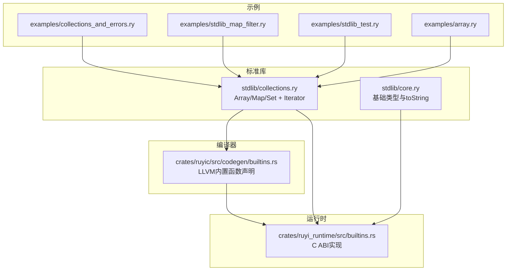
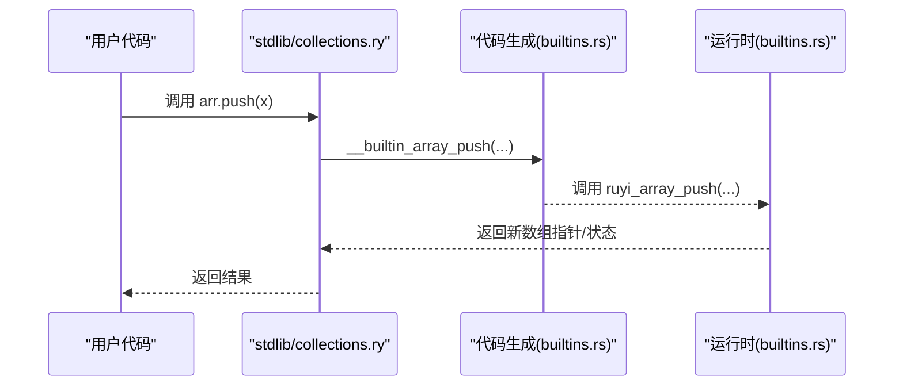
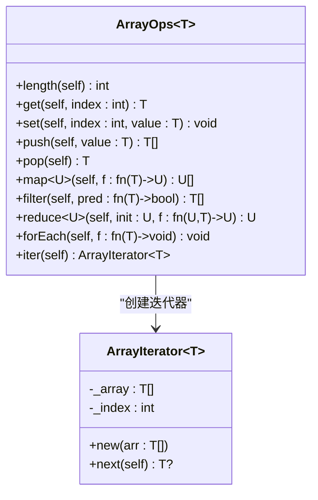
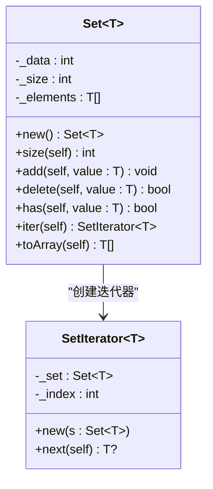

# 集合类型库

<cite>
**本文引用的文件列表**
- [collections.ry](file://stdlib/collections.ry)
- [builtins.rs](file://crates/ruyi_runtime/src/builtins.rs)
- [builtins.rs（代码生成）](file://crates/ruyic/src/codegen/builtins.rs)
- [collections_and_errors.ry](file://examples/collections_and_errors.ry)
- [stdlib_map_filter.ry](file://examples/stdlib_map_filter.ry)
- [stdlib_test.ry](file://examples/stdlib_test.ry)
- [array.ry](file://examples/array.ry)
- [core.ry](file://stdlib/core.ry)
</cite>

## 目录
1. [简介](#简介)
2. [项目结构](#项目结构)
3. [核心组件](#核心组件)
4. [架构总览](#架构总览)
5. [详细组件分析](#详细组件分析)
6. [依赖关系分析](#依赖关系分析)
7. [性能与复杂度](#性能与复杂度)
8. [故障排查指南](#故障排查指南)
9. [结论](#结论)
10. [附录：API 参考速查](#附录api-参考速查)

## 简介
本文件为 Ruyi 标准库中的集合类型库（Array、Map、Set）提供系统化的 API 参考与实现解析。内容涵盖：
- 数据结构与行为定义
- 完整接口签名与典型用法
- 迭代器支持与遍历模式
- 内置运行时函数映射与底层实现
- 性能特征、复杂度与内存管理建议
- 集合间互操作与转换思路

## 项目结构
集合类型库主要由以下部分组成：
- 标准库集合模块：提供泛型集合类与迭代器接口
- 运行时内置函数：提供底层数据结构与操作的 C ABI 实现
- 代码生成层：声明并注册内置函数，确保编译期可调用
- 示例与集成测试：演示常见用法与边界行为



图表来源
- [collections.ry](file://stdlib/collections.ry)
- [builtins.rs（代码生成）](file://crates/ruyic/src/codegen/builtins.rs)
- [builtins.rs](file://crates/ruyi_runtime/src/builtins.rs)
- [collections_and_errors.ry](file://examples/collections_and_errors.ry)
- [stdlib_map_filter.ry](file://examples/stdlib_map_filter.ry)
- [stdlib_test.ry](file://examples/stdlib_test.ry)
- [array.ry](file://examples/array.ry)
- [core.ry](file://stdlib/core.ry)

章节来源
- [collections.ry](file://stdlib/collections.ry)
- [builtins.rs（代码生成）](file://crates/ruyic/src/codegen/builtins.rs)
- [builtins.rs](file://crates/ruyi_runtime/src/builtins.rs)
- [collections_and_errors.ry](file://examples/collections_and_errors.ry)
- [stdlib_map_filter.ry](file://examples/stdlib_map_filter.ry)
- [stdlib_test.ry](file://examples/stdlib_test.ry)
- [array.ry](file://examples/array.ry)
- [core.ry](file://stdlib/core.ry)

## 核心组件
- 迭代器接口：统一的 next() 访问模型，支持 for-in 风格遍历
- Array<T> 扩展：通过 ArrayOps trait 提供 push/pop/length/get/set/map/filter/reduce/forEach/iter 等常用操作
- Map<K,V>：键值映射，支持 get/set/has/delete/size/keys/values/iter
- Set<T>：无序去重集合，支持 add/delete/has/size/iter/toArray

章节来源
- [collections.ry](file://stdlib/collections.ry)

## 架构总览
集合类型在语言层面以类与 trait 的形式暴露 API；底层通过 __builtin_* 函数桥接到运行时实现。编译器负责在 LLVM 层声明这些函数，并在运行时由 C ABI 导出的函数完成实际操作。



图表来源
- [collections.ry](file://stdlib/collections.ry)
- [builtins.rs（代码生成）](file://crates/ruyic/src/codegen/builtins.rs)
- [builtins.rs](file://crates/ruyi_runtime/src/builtins.rs)

## 详细组件分析

### Array<T> 与 ArrayOps<T>
- 数据结构：内部通过运行时数组头与数据槽管理长度、容量与元素指针
- 关键方法与复杂度
  - length(): O(1)
  - get(index)/set(index,value): O(1)
  - push(value): 平摊 O(1)，可能触发扩容
  - pop(): O(1)
  - map(f)/filter(pred)/reduce(init,f)/forEach(f): O(n)
  - iter(): O(1) 初始化，next() 每次 O(1)
- 错误处理：越界访问抛出 RangeError；对空数组 pop 抛出 RangeError
- 使用示例：参见示例文件中 push/pop/length/map/filter/reduce 的用法



图表来源
- [collections.ry](file://stdlib/collections.ry)

章节来源
- [collections.ry](file://stdlib/collections.ry)
- [stdlib_map_filter.ry](file://examples/stdlib_map_filter.ry)
- [stdlib_test.ry](file://examples/stdlib_test.ry)
- [array.ry](file://examples/array.ry)

### Map<K,V>
- 数据结构：基于哈希表的键值存储，维护内部数据槽、大小计数与键数组
- 关键方法与复杂度
  - size()/has(key)/get(key): 平均 O(1)
  - set(key,value): 平均 O(1)，可能触发扩容
  - delete(key): 平均 O(1)
  - keys()/values(): O(n)
  - iter(): O(1) 初始化，next() 每次 O(1)
- 底层实现：通过 __builtin_map_* 函数桥接运行时 ruyi_map_* 实现
- 使用示例：参见示例文件中 Map 的创建、设置、查询、删除与大小统计

```mermaid
classDiagram
class Map~K,V~ {
-_data : int
-_size : int
-_keys : K[]
+new() Map~K,V~
+size(self) int
+get(self, key : K) V?
+set(self, key : K, value : V) void
+delete(self, key : K) bool
+has(self, key : K) bool
+keys(self) K[]
+values(self) V[]
+iter(self) MapIterator~K,V~
}
class MapIterator~K,V~ {
-_map : Map~K,V~
-_index : int
+new(m : Map~K,V~)
+next(self) {key : K,value : V}?
}
Map~K,V~ --> MapIterator~K,V~ : "创建迭代器"
```

图表来源
- [collections.ry](file://stdlib/collections.ry)

章节来源
- [collections.ry](file://stdlib/collections.ry)
- [collections_and_errors.ry](file://examples/collections_and_errors.ry)

### Set<T>
- 数据结构：基于哈希表的无序集合，维护元素集合与元素数组
- 关键方法与复杂度
  - size()/has(value)/add(value): 平均 O(1)
  - delete(value): 平均 O(1)
  - iter(): O(1) 初始化，next() 每次 O(1)
  - toArray(): O(n)
- 底层实现：通过 __builtin_set_* 函数桥接运行时 ruyi_set_* 实现
- 使用示例：参见示例文件中 Set 的创建、添加、删除、查询与大小统计



图表来源
- [collections.ry](file://stdlib/collections.ry)

章节来源
- [collections.ry](file://stdlib/collections.ry)
- [collections_and_errors.ry](file://examples/collections_and_errors.ry)

### 迭代器支持
- 统一接口：Iterator<T> trait 提供 next() 方法
- 具体实现：
  - ArrayIterator<T>：按索引顺序返回元素
  - MapIterator<K,V>：按键数组顺序返回 {key,value}
  - SetIterator<T>：按元素数组顺序返回元素
- 遍历模式：支持 for-in 风格的循环与手动迭代器推进

章节来源
- [collections.ry](file://stdlib/collections.ry)

### 序列化与反序列化
- 当前标准库未提供集合类型的内置序列化/反序列化 API
- 建议方案：
  - 使用 Array.toArray() + 字符串化（如 JSON.stringify）进行序列化
  - 使用字符串解析后重建集合（注意类型与去重语义）
- 注意：上述流程为通用实践，非标准库内置能力

[本节为概念性说明，不直接分析具体源码文件]

## 依赖关系分析
- 编译期依赖：代码生成层声明 __builtin_* 函数，确保编译器可链接到运行时导出
- 运行时依赖：运行时实现提供 C ABI 函数，供 __builtin_* 名称解析与调用
- 标准库依赖：集合类通过内置函数实现具体操作，保持语言层 API 与运行时实现解耦


图表来源
- [collections.ry](file://stdlib/collections.ry)
- [builtins.rs（代码生成）](file://crates/ruyic/src/codegen/builtins.rs)
- [builtins.rs](file://crates/ruyi_runtime/src/builtins.rs)

章节来源
- [collections.ry](file://stdlib/collections.ry)
- [builtins.rs（代码生成）](file://crates/ruyic/src/codegen/builtins.rs)
- [builtins.rs](file://crates/ruyi_runtime/src/builtins.rs)

## 性能与复杂度
- Array<T>
  - 随机访问 O(1)
  - 尾部插入/弹出平摊 O(1)
  - 中间插入/删除 O(n)
  - map/filter/reduce/forEach O(n)
- Map<K,V>
  - 哈希表平均 O(1) 查询/插入/删除
  - keys()/values() O(n)
- Set<T>
  - 哈希表平均 O(1) 查询/插入/删除
  - toArray() O(n)
- 内存管理
  - 所有内置分配遵循 GC 合同（详见运行时注释），避免裸分配导致泄漏
  - 建议：尽量复用已有集合，避免频繁扩容；对大数组采用批量操作减少中间态

章节来源
- [collections.ry](file://stdlib/collections.ry)
- [builtins.rs](file://crates/ruyi_runtime/src/builtins.rs)

## 故障排查指南
- 越界访问
  - 现象：调用 get/set 或 pop 时抛出 RangeError
  - 处理：检查索引范围与数组长度；pop 前确认非空
- 键不存在
  - 现象：Map.get 返回 None；Set.has 返回 false
  - 处理：先用 has/has 判断，或使用默认值策略
- 迭代耗尽
  - 现象：迭代器 next() 返回 null
  - 处理：在循环中检测 null 并终止
- 类型错误
  - 现象：编译期或运行期类型不匹配
  - 处理：确保泛型参数一致；必要时显式标注类型

章节来源
- [collections_and_errors.ry](file://examples/collections_and_errors.ry)
- [collections.ry](file://stdlib/collections.ry)

## 结论
Ruyi 集合类型库提供了简洁而强大的泛型集合与迭代器抽象，配合运行时内置函数实现了高效的底层操作。通过统一的 API 与清晰的复杂度特性，开发者可以高效地构建数据处理逻辑。建议在实际工程中结合示例与测试用例，验证边界条件与性能需求。

## 附录：API 参考速查
- Array<T>
  - length(): 获取长度
  - get(index): 获取元素
  - set(index, value): 设置元素
  - push(value): 尾部追加
  - pop(): 弹出尾部
  - map(f): 映射
  - filter(pred): 过滤
  - reduce(init, f): 归约
  - forEach(f): 遍历
  - iter(): 创建迭代器
- Map<K,V>
  - new(): 创建空映射
  - size(): 获取条目数
  - get(key): 获取值
  - set(key, value): 设置键值
  - delete(key): 删除键
  - has(key): 是否存在
  - keys(): 获取所有键
  - values(): 获取所有值
  - iter(): 创建迭代器
- Set<T>
  - new(): 创建空集合
  - size(): 获取元素数
  - add(value): 添加元素
  - delete(value): 删除元素
  - has(value): 是否存在
  - iter(): 创建迭代器
  - toArray(): 转换为数组

章节来源
- [collections.ry](file://stdlib/collections.ry)
- [stdlib_map_filter.ry](file://examples/stdlib_map_filter.ry)
- [stdlib_test.ry](file://examples/stdlib_test.ry)
- [collections_and_errors.ry](file://examples/collections_and_errors.ry)
- [array.ry](file://examples/array.ry)