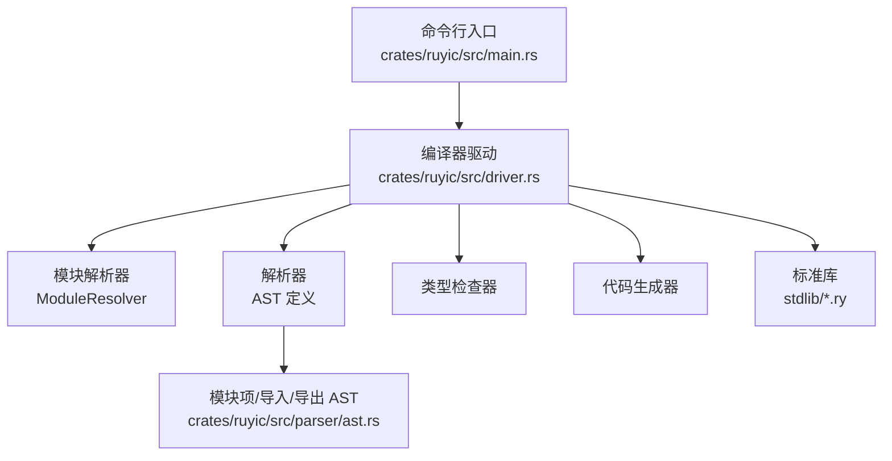
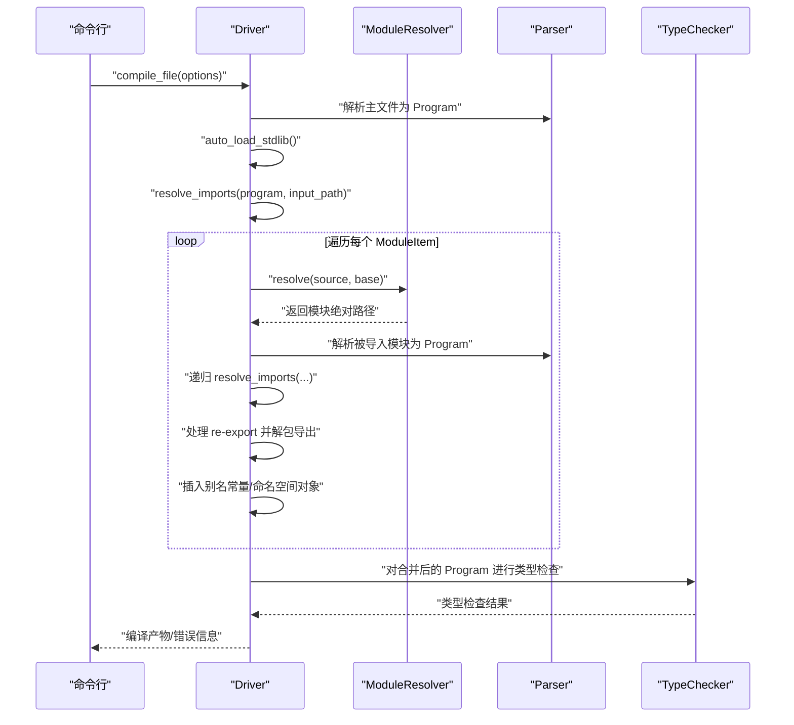
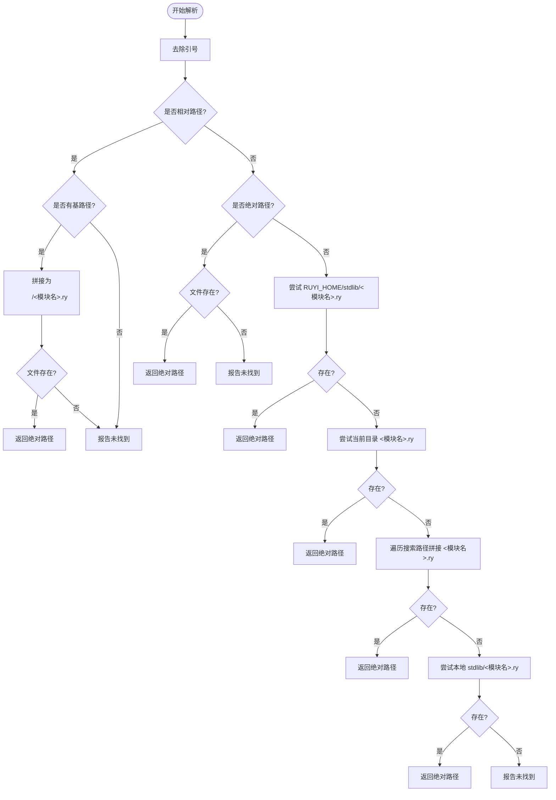
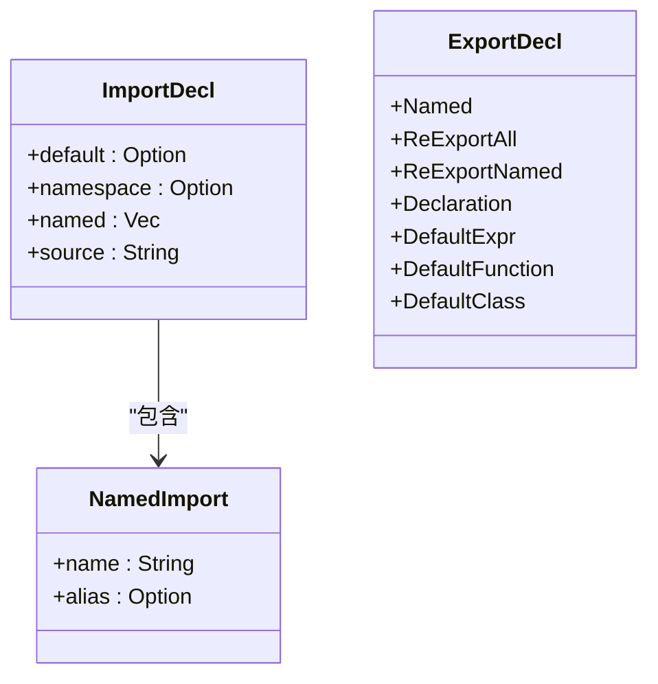
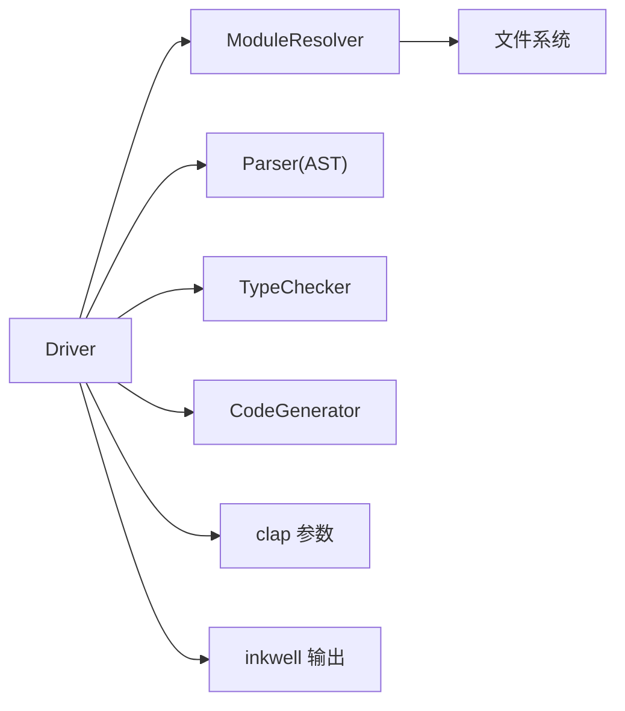

# 模块系统

<cite>
**本文引用的文件**
- [crates/ruyic/src/lib.rs](file://crates/ruyic/src/lib.rs)
- [crates/ruyic/src/main.rs](file://crates/ruyic/src/main.rs)
- [crates/ruyic/src/driver.rs](file://crates/ruyic/src/driver.rs)
- [crates/ruyic/src/parser/ast.rs](file://crates/ruyic/src/parser/ast.rs)
- [stdlib/core.ry](file://stdlib/core.ry)
- [stdlib/string.ry](file://stdlib/string.ry)
- [stdlib/error.ry](file://stdlib/error.ry)
- [stdlib/collections.ry](file://stdlib/collections.ry)
- [examples/modules/main.ry](file://examples/modules/main.ry)
- [examples/modules/math.ry](file://examples/modules/math.ry)
- [examples/modules/config.ry](file://examples/modules/config.ry)
- [examples/modules/lib/string_utils.ry](file://examples/modules/lib/string_utils.ry)
- [docs/roadmap.md](file://docs/roadmap.md)
- [docs/roadmap-zh.md](file://docs/roadmap-zh.md)
</cite>

## 目录
1. [简介](#简介)
2. [项目结构](#项目结构)
3. [核心组件](#核心组件)
4. [架构总览](#架构总览)
5. [详细组件分析](#详细组件分析)
6. [依赖分析](#依赖分析)
7. [性能考虑](#性能考虑)
8. [故障排查指南](#故障排查指南)
9. [结论](#结论)
10. [附录](#附录)

## 简介
本文件系统化梳理 Ruyi 语言的模块系统，覆盖模块定义、导入与导出机制、模块路径解析规则与搜索算法、模块间依赖关系管理与循环依赖检测现状、包管理概念与实现蓝图、模块可见性与访问控制、相对导入与绝对导入的差异与使用场景、标准库模块组织与使用方法、模块设计最佳实践与命名约定、扩展机制与自定义模块开发指南，以及实际模块组织示例与代码结构建议。

## 项目结构
Ruyi 模块系统由编译器驱动层、解析与类型检查层、代码生成层以及标准库共同组成。命令行入口负责构建编译选项与调用驱动；驱动层负责模块解析、导入展开、自动加载标准库、错误处理与编译管线衔接；解析层提供 AST 节点以表达模块项、导入与导出声明；标准库提供核心类型与常用工具函数，并在编译时被自动加载。

图表来源
- [crates/ruyic/src/main.rs:46-113](file://crates/ruyic/src/main.rs#L46-L113)
- [crates/ruyic/src/driver.rs:242-270](file://crates/ruyic/src/driver.rs#L242-L270)
- [crates/ruyic/src/parser/ast.rs:13-24](file://crates/ruyic/src/parser/ast.rs#L13-L24)

章节来源
- [crates/ruyic/src/main.rs:16-113](file://crates/ruyic/src/main.rs#L16-L113)
- [crates/ruyic/src/driver.rs:242-270](file://crates/ruyic/src/driver.rs#L242-L270)
- [crates/ruyic/src/parser/ast.rs:13-24](file://crates/ruyic/src/parser/ast.rs#L13-L24)

## 核心组件
- 编译器驱动 Driver：协调解析、宏展开、类型检查、代码生成与链接阶段；维护 ModuleResolver 与 MacroRegistry；提供编译文件与源码的入口。
- 模块解析器 ModuleResolver：负责模块路径解析、搜索路径查找、标准库映射、已加载模块缓存与规范化路径。
- 解析器与 AST：定义 Program、ModuleItem、ImportDecl、ExportDecl 等节点，支撑导入/导出语义与展开。
- 标准库：提供 core、string、error、collections 等模块，按需自动加载并合并入主程序。
- 命令行接口：接收用户参数，构造 CompileOptions，调用 Driver 进行编译。

章节来源
- [crates/ruyic/src/driver.rs:149-240](file://crates/ruyic/src/driver.rs#L149-L240)
- [crates/ruyic/src/parser/ast.rs:18-24](file://crates/ruyic/src/parser/ast.rs#L18-L24)
- [stdlib/core.ry:11-31](file://stdlib/core.ry#L11-L31)
- [stdlib/string.ry:16-24](file://stdlib/string.ry#L16-L24)
- [stdlib/error.ry:10-26](file://stdlib/error.ry#L10-L26)
- [stdlib/collections.ry:18-28](file://stdlib/collections.ry#L18-L28)

## 架构总览
模块系统贯穿编译流程：解析主文件后，自动加载标准库，递归解析 import 语句，处理命名导入、重命名导入、命名空间导入与默认导入，支持 re-export（全量与命名），并将导出内容“解包”为具体声明供类型检查器识别。最终将所有模块项合并为单一 Program，进入后续阶段。

图表来源
- [crates/ruyic/src/driver.rs:258-329](file://crates/ruyic/src/driver.rs#L258-L329)
- [crates/ruyic/src/driver.rs:356-512](file://crates/ruyic/src/driver.rs#L356-L512)
- [crates/ruyic/src/driver.rs:643-704](file://crates/ruyic/src/driver.rs#L643-L704)

## 详细组件分析

### 模块路径解析与搜索算法
- 支持的导入形式
  - 相对导入：以 "./" 或 "../" 开头，基于基路径拼接并查找同目录下的 .ry 文件。
  - 绝对导入：以 "/" 开头的绝对路径，直接存在性检查。
  - 标识符导入：非路径字符串，优先在 RUYI_HOME/stdlib 下查找对应模块文件；若不存在则回退至当前工作目录、搜索路径与本地 stdlib/ 目录。
- 解析顺序
  1) 去除引号；
  2) 若为相对路径且基路径存在，则拼接为候选并检查；
  3) 若为绝对路径，则检查是否存在；
  4) 否则尝试 RUYI_HOME/stdlib/<模块名>.ry；
  5) 再尝试当前工作目录下 <模块名>.ry；
  6) 最后遍历搜索路径，拼接 <模块名>.ry 查找；
  7) 回退：检查本地 stdlib/ 目录。
- 规范化与缓存
  - 使用 canonical_path 规范化路径，避免符号链接与重复加载；
  - 已加载模块缓存于 loaded_modules，键为规范路径，值为 AST。

图表来源
- [crates/ruyic/src/driver.rs:173-234](file://crates/ruyic/src/driver.rs#L173-L234)

章节来源
- [crates/ruyic/src/driver.rs:150-240](file://crates/ruyic/src/driver.rs#L150-L240)

### 导入与导出机制
- 导入语法
  - import { 名称 as 别名 } from "...";
  - import * as 命名空间 from "...";
  - import 默认标识符 from "...";
  - import "..."; // 仅执行副作用
- 导出语法
  - export fn/class/const/let/traits/impl/macros 等；
  - export { 名称 as 别名 }；
  - export * from "..."; // 全量 re-export
  - export { 名称 } from "..."; // 命名 re-export
  - export default 表达式/函数/类
- 展开与合并
  - 对每个 Import 声明，解析目标模块路径，读取并解析其 AST；
  - 递归处理被导入模块中的 import/re-export；
  - 将导出内容“解包”为具体声明，以便类型检查器识别；
  - 命名导入支持别名常量绑定；命名空间导入将导出项收集为对象字面量注入作用域。

图表来源
- [crates/ruyic/src/parser/ast.rs:486-532](file://crates/ruyic/src/parser/ast.rs#L486-L532)

章节来源
- [crates/ruyic/src/driver.rs:356-512](file://crates/ruyic/src/driver.rs#L356-L512)
- [crates/ruyic/src/parser/ast.rs:486-532](file://crates/ruyic/src/parser/ast.rs#L486-L532)

### 自动加载标准库与模块合并
- 自动加载
  - 在解析主程序前，自动加载 stdlib 中的 error、core、collections 等模块；
  - 读取模块源码，递归解析其 import/re-export，避免重复加载；
  - 将已加载模块的项前置合并到主程序项列表中，确保全局可用。
- 类型检查影响
  - 由于 stdlib 可能包含尚未完全支持的特性，启用允许部分代码生成失败的标志以保证整体流程顺畅。

章节来源
- [crates/ruyic/src/driver.rs:331-354](file://crates/ruyic/src/driver.rs#L331-L354)
- [crates/ruyic/src/driver.rs:568-584](file://crates/ruyic/src/driver.rs#L568-L584)

### 可见性控制与访问修饰符
- 当前实现
  - 语言层面未显式提供访问修饰符（如 private/public/protected）；
  - 模块边界通过导入/导出语义实现：仅导出项对外可见，未导出项仅在模块内有效；
  - re-export 用于将其他模块的导出暴露给外部，形成“门面”。
- 实践建议
  - 将内部实现细节设为未导出，仅通过命名导出或 re-export 暴露公共 API；
  - 使用命名空间导入统一聚合导出项，便于消费者使用。

章节来源
- [examples/modules/math.ry:11-37](file://examples/modules/math.ry#L11-L37)
- [examples/modules/config.ry:6-14](file://examples/modules/config.ry#L6-L14)

### 相对导入与绝对导入
- 相对导入
  - 适用于项目内模块共享与复用；
  - 基于当前文件所在目录进行解析，利于模块化组织与迁移。
- 绝对导入
  - 以根路径开头，适合跨层级引用或标准化路径；
  - 在当前实现中，会直接检查绝对路径是否存在。
- 使用建议
  - 项目内优先使用相对导入，保持模块边界清晰；
  - 绝对导入用于标准库或明确的工程根路径引用。

章节来源
- [crates/ruyic/src/driver.rs:183-202](file://crates/ruyic/src/driver.rs#L183-L202)

### 标准库模块组织与使用
- core：提供基础类型的实例方法（如 Int/Float/Bool 的 toString）。
- string：提供字符串工具函数与字符串类的方法签名（运行时由代码生成层映射）。
- error：提供错误类型层次与断言工具。
- collections：提供集合类型与迭代器、数组扩展等。

章节来源
- [stdlib/core.ry:11-31](file://stdlib/core.ry#L11-L31)
- [stdlib/string.ry:16-24](file://stdlib/string.ry#L16-L24)
- [stdlib/error.ry:10-26](file://stdlib/error.ry#L10-L26)
- [stdlib/collections.ry:18-28](file://stdlib/collections.ry#L18-L28)

### 循环依赖检测
- 现状
  - 当前解析逻辑在处理导入时采用“先解析再合并”的策略，未发现显式的循环依赖检测机制；
  - 通过 loaded_modules 缓存与 canonical_path 规范化，可避免重复加载同一模块。
- 建议
  - 引入 DFS 访问标记与拓扑排序思想，在 resolve_imports 中加入环检测与报错；
  - 对 re-export 场景增加深度限制与警告，防止深层嵌套导致的复杂性。

章节来源
- [crates/ruyic/src/driver.rs:356-512](file://crates/ruyic/src/driver.rs#L356-L512)
- [crates/ruyic/src/driver.rs:150-172](file://crates/ruyic/src/driver.rs#L150-L172)

### 包管理与版本控制（规划）
- 清单与锁文件
  - 定义 ruyi.pkg（TOML）格式，包含 package 信息与依赖列表；
  - 生成 ruyi.lock，记录解析树（名称、版本、来源、校验和）。
- 依赖解析
  - 支持 SemVer 约束求解、冲突检测与最小版本选择；
  - 支持 Git 依赖（如 git = url, rev = abc123）。
- 命令与功能
  - ruyi build、run、add/remove、install/publish、search/yank、文档托管等。
- 模块解析映射
  - 将 import 映射到依赖包；保留 std::io 等标准库解析规则。

章节来源
- [docs/roadmap.md:152-174](file://docs/roadmap.md#L152-L174)
- [docs/roadmap-zh.md:152-174](file://docs/roadmap-zh.md#L152-L174)

### 模块设计最佳实践与命名约定
- 模块命名
  - 使用小写短横线或下划线风格，避免空格与特殊字符；
  - 语义化命名，体现职责单一与高内聚。
- 导出策略
  - 优先导出稳定 API，隐藏内部实现；
  - 使用命名导出与 re-export 构建清晰的门面模块。
- 目录组织
  - 按功能域分层，子模块通过 re-export 汇聚；
  - 示例：lib 子目录存放工具模块，config 聚合导出。
- 导入风格
  - 项目内使用相对导入，保持模块边界；
  - 标准库与第三方库使用标识符导入。

章节来源
- [examples/modules/config.ry:6-14](file://examples/modules/config.ry#L6-L14)
- [examples/modules/lib/string_utils.ry:1-43](file://examples/modules/lib/string_utils.ry#L1-L43)

### 扩展机制与自定义模块开发指南
- 开发步骤
  - 定义模块文件与导出项；
  - 在需要的模块中通过 import 引入；
  - 如需作为公共库发布，参考包管理规划完善 ruyi.pkg 与依赖声明。
- 与编译器集成
  - 通过 ModuleResolver 的搜索路径与 RUYI_HOME/stdlib 规则，使模块可被解析；
  - 注意避免循环依赖，合理拆分模块。

章节来源
- [crates/ruyic/src/driver.rs:150-240](file://crates/ruyic/src/driver.rs#L150-L240)
- [docs/roadmap.md:152-174](file://docs/roadmap.md#L152-L174)

### 实际模块组织示例与代码结构建议
- 示例一：数学工具模块（命名导出、默认导出、常量导出）
  - 模块：examples/modules/math.ry
  - 特点：多命名导出、默认导出、常量导出，适合演示命名导入与默认导入。
- 示例二：配置聚合模块（re-export 与副作用导入）
  - 模块：examples/modules/config.ry
  - 特点：全量与命名 re-export，聚合多个子模块导出。
- 示例三：字符串工具模块（模块初始化与多命名导出）
  - 模块：examples/modules/lib/string_utils.ry
  - 特点：模块级变量初始化，多命名导出。
- 示例四：主程序演示
  - 模块：examples/modules/main.ry
  - 特点：集中展示多种导入模式与打印输出。

章节来源
- [examples/modules/math.ry:11-48](file://examples/modules/math.ry#L11-L48)
- [examples/modules/config.ry:6-14](file://examples/modules/config.ry#L6-L14)
- [examples/modules/lib/string_utils.ry:6-43](file://examples/modules/lib/string_utils.ry#L6-L43)
- [examples/modules/main.ry:36-58](file://examples/modules/main.ry#L36-L58)

## 依赖分析
- 组件耦合
  - Driver 依赖 ModuleResolver、Parser、TypeChecker、CodeGenerator；
  - ModuleResolver 依赖环境变量 RUYI_HOME 与文件系统；
  - AST 定义贯穿解析与类型检查阶段。
- 外部依赖
  - 命令行参数解析依赖 clap；
  - 编译产物输出依赖 inkwell LLVM 接口。

图表来源
- [crates/ruyic/src/driver.rs:242-270](file://crates/ruyic/src/driver.rs#L242-L270)
- [crates/ruyic/src/main.rs:10-14](file://crates/ruyic/src/main.rs#L10-L14)

章节来源
- [crates/ruyic/src/driver.rs:242-270](file://crates/ruyic/src/driver.rs#L242-L270)
- [crates/ruyic/src/main.rs:10-14](file://crates/ruyic/src/main.rs#L10-L14)

## 性能考虑
- 模块缓存
  - 使用 loaded_modules 与 canonical_path 避免重复解析与 IO；
- 递归导入
  - 在 resolve_imports 中采用一次性收集 re-export 源后再处理，减少借用冲突与重复遍历；
- 标准库合并
  - 将 stdlib 合并到主程序前部，避免重复扫描；
- 代码生成
  - 允许部分代码生成失败以提升整体吞吐，但应逐步完善 stdlib 支持。

章节来源
- [crates/ruyic/src/driver.rs:389-444](file://crates/ruyic/src/driver.rs#L389-L444)
- [crates/ruyic/src/driver.rs:568-584](file://crates/ruyic/src/driver.rs#L568-L584)

## 故障排查指南
- 常见错误
  - 模块未找到：检查导入路径、相对路径基路径、搜索路径与 RUYI_HOME/stdlib；
  - 类型检查错误：关注导出解包后的声明是否满足类型约束；
  - 编译链路错误：确认宏展开、类型检查、代码生成阶段无异常。
- 排查步骤
  - 启用 --emit=ast/typed-ast/check 以定位问题阶段；
  - 检查 ModuleResolver 的 resolve 流程与 loaded_modules 缓存；
  - 对疑似循环依赖的模块进行拆分与简化测试。

章节来源
- [crates/ruyic/src/driver.rs:21-54](file://crates/ruyic/src/driver.rs#L21-L54)
- [crates/ruyic/src/driver.rs:173-234](file://crates/ruyic/src/driver.rs#L173-L234)

## 结论
Ruyi 模块系统以 Driver 为核心，结合 ModuleResolver 的路径解析与搜索算法、AST 的导入/导出语义、以及标准库的自动加载机制，实现了清晰的模块边界与灵活的导入方式。当前未内置循环依赖检测，建议在后续版本引入；包管理能力处于规划阶段，未来将完善清单、锁文件与依赖解析。遵循本文的最佳实践与命名约定，可构建高内聚、低耦合、易维护的模块体系。

## 附录
- 关键 API 与数据结构
  - ModuleResolver：路径解析、搜索路径、缓存与规范化；
  - ImportDecl/ExportDecl：导入/导出语法抽象；
  - Program/ModuleItem：模块项集合与顶层结构。

章节来源
- [crates/ruyic/src/driver.rs:149-240](file://crates/ruyic/src/driver.rs#L149-L240)
- [crates/ruyic/src/parser/ast.rs:13-24](file://crates/ruyic/src/parser/ast.rs#L13-L24)
- [crates/ruyic/src/parser/ast.rs:486-532](file://crates/ruyic/src/parser/ast.rs#L486-L532)