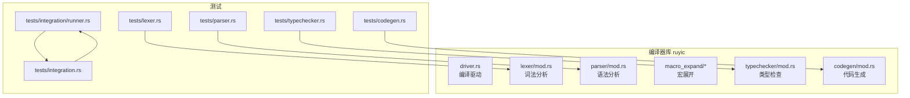
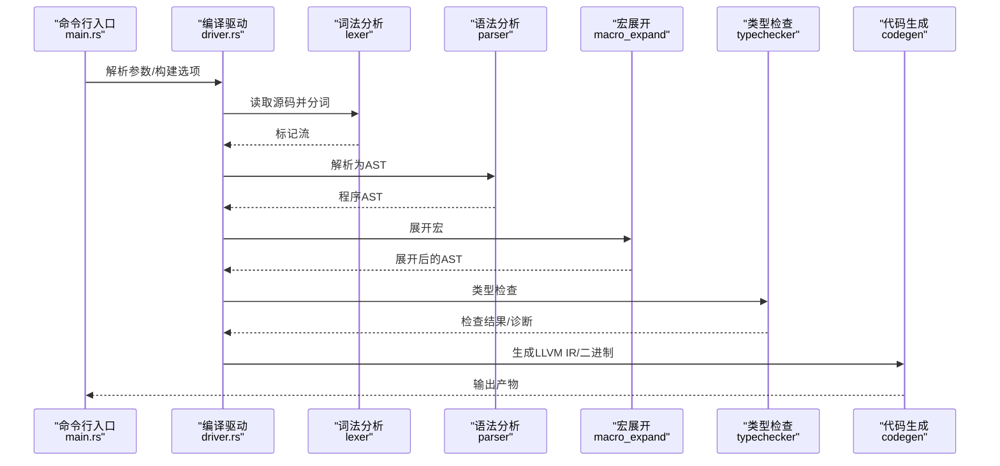
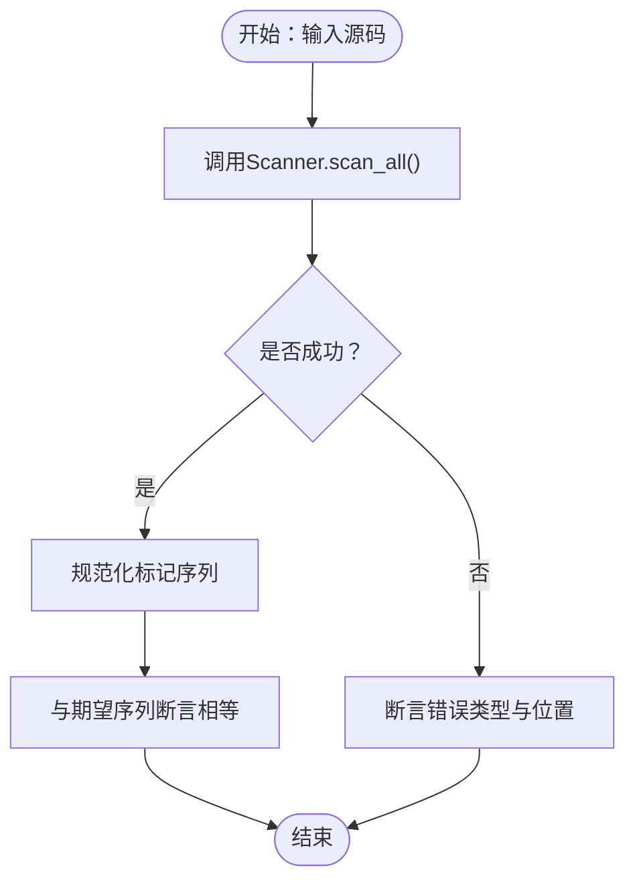
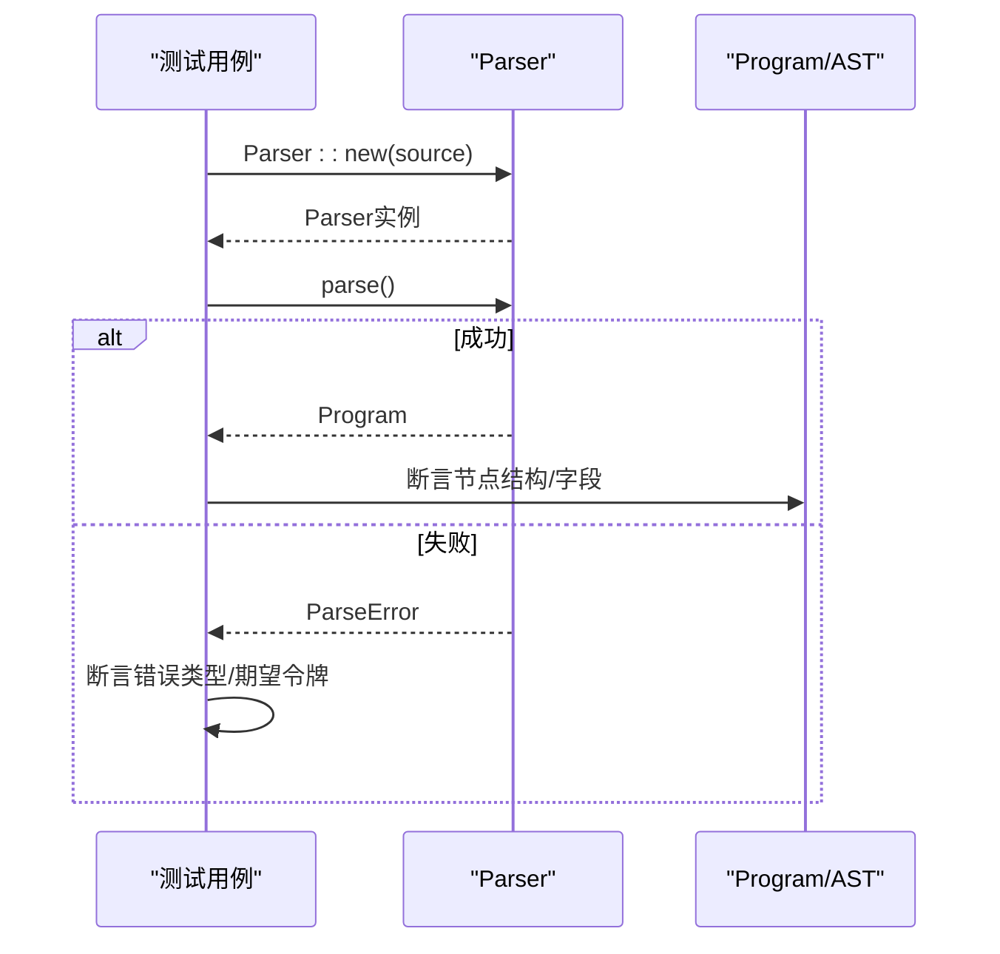
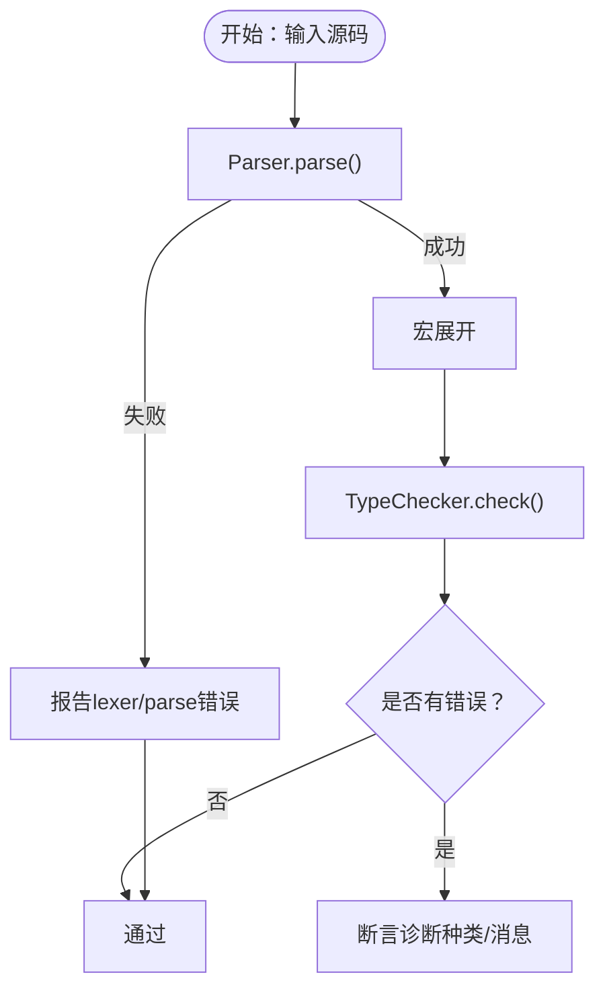
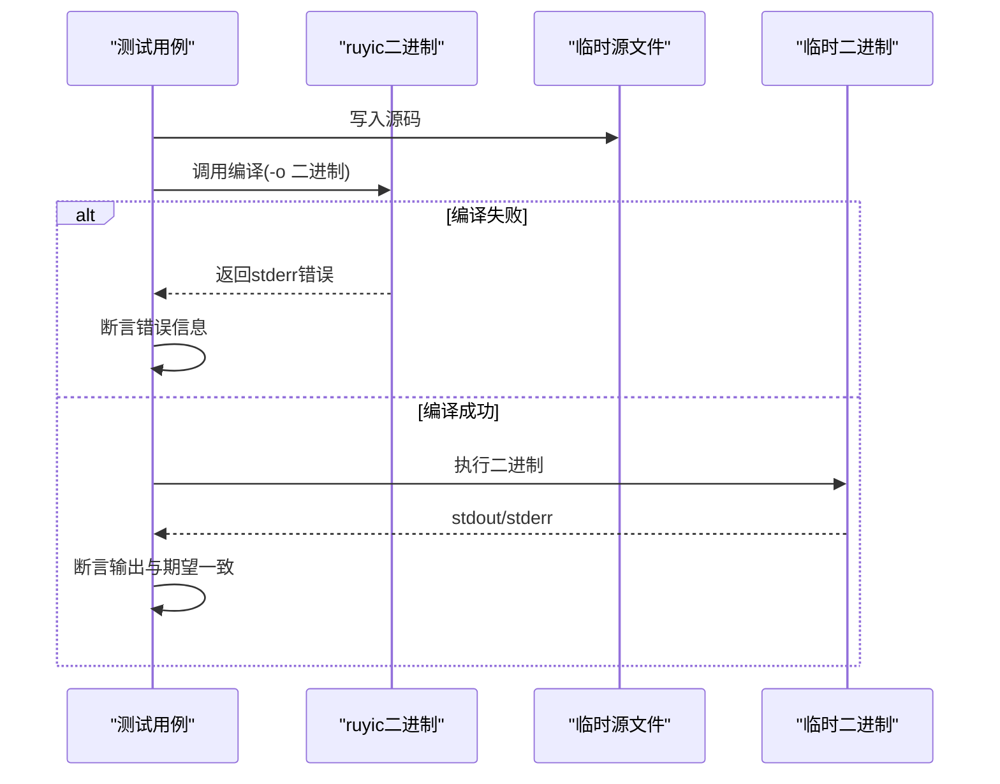
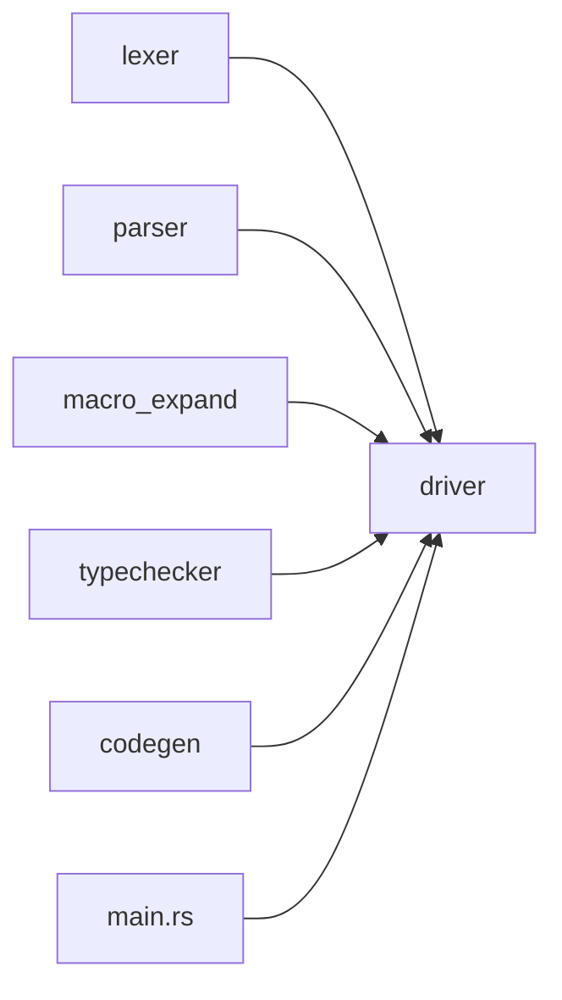

# 单元测试

<cite>
**本文引用的文件**
- [crates/ruyic/src/lib.rs](file://crates/ruyic/src/lib.rs)
- [crates/ruyic/src/main.rs](file://crates/ruyic/src/main.rs)
- [crates/ruyic/Cargo.toml](file://crates/ruyic/Cargo.toml)
- [crates/ruyic/src/driver.rs](file://crates/ruyic/src/driver.rs)
- [crates/ruyic/src/lexer/mod.rs](file://crates/ruyic/src/lexer/mod.rs)
- [crates/ruyic/src/parser/mod.rs](file://crates/ruyic/src/parser/mod.rs)
- [crates/ruyic/src/typechecker/mod.rs](file://crates/ruyic/src/typechecker/mod.rs)
- [crates/ruyic/src/codegen/mod.rs](file://crates/ruyic/src/codegen/mod.rs)
- [crates/ruyic/tests/lexer.rs](file://crates/ruyic/tests/lexer.rs)
- [crates/ruyic/tests/parser.rs](file://crates/ruyic/tests/parser.rs)
- [crates/ruyic/tests/typechecker.rs](file://crates/ruyic/tests/typechecker.rs)
- [crates/ruyic/tests/codegen.rs](file://crates/ruyic/tests/codegen.rs)
- [crates/ruyic/tests/integration/runner.rs](file://crates/ruyic/tests/integration/runner.rs)
- [crates/ruyic/tests/integration.rs](file://crates/ruyic/tests/integration.rs)
</cite>

## 目录
1. [引言](#引言)
2. [项目结构](#项目结构)
3. [核心组件](#核心组件)
4. [架构总览](#架构总览)
5. [详细组件分析](#详细组件分析)
6. [依赖关系分析](#依赖关系分析)
7. [性能考量](#性能考量)
8. [故障排查指南](#故障排查指南)
9. [结论](#结论)
10. [附录](#附录)

## 引言
本指南面向Ruyi编译器的单元测试实践，聚焦词法分析器、语法分析器、类型检查器与代码生成器等核心组件的测试方法。文档覆盖测试断言最佳实践、错误处理测试策略、测试数据组织与管理、模拟对象与测试替身技巧、测试覆盖率测量与改进方法，并提供可直接参考的测试用例设计模式与示例路径。

## 项目结构
Ruyi编译器采用多模块组织，核心库位于crates/ruyic，包含驱动、词法、语法、宏展开、类型检查、代码生成等子模块；测试主要分布在crates/ruyic/tests目录下，同时提供集成测试运行器与独立的集成测试入口。

图表来源
- [crates/ruyic/src/driver.rs:1-744](file://crates/ruyic/src/driver.rs#L1-744)
- [crates/ruyic/src/lexer/mod.rs:1-8](file://crates/ruyic/src/lexer/mod.rs#L1-8)
- [crates/ruyic/src/parser/mod.rs:1-8](file://crates/ruyic/src/parser/mod.rs#L1-8)
- [crates/ruyic/src/typechecker/mod.rs:1-32](file://crates/ruyic/src/typechecker/mod.rs#L1-32)
- [crates/ruyic/src/codegen/mod.rs:1-15](file://crates/ruyic/src/codegen/mod.rs#L1-15)
- [crates/ruyic/tests/lexer.rs:1-708](file://crates/ruyic/tests/lexer.rs#L1-708)
- [crates/ruyic/tests/parser.rs:1-800](file://crates/ruyic/tests/parser.rs#L1-800)
- [crates/ruyic/tests/typechecker.rs:1-800](file://crates/ruyic/tests/typechecker.rs#L1-800)
- [crates/ruyic/tests/codegen.rs:1-418](file://crates/ruyic/tests/codegen.rs#L1-418)
- [crates/ruyic/tests/integration/runner.rs:1-385](file://crates/ruyic/tests/integration/runner.rs#L1-385)
- [crates/ruyic/tests/integration.rs:1-24](file://crates/ruyic/tests/integration.rs#L1-24)

章节来源
- [crates/ruyic/src/lib.rs:1-21](file://crates/ruyic/src/lib.rs#L1-21)
- [crates/ruyic/src/main.rs:1-114](file://crates/ruyic/src/main.rs#L1-114)
- [crates/ruyic/Cargo.toml:1-26](file://crates/ruyic/Cargo.toml#L1-26)

## 核心组件
- 词法分析器：负责将源码切分为标记序列，支持关键字、标识符、操作符、字面量、注释、位置追踪与错误报告。
- 语法分析器：将标记流解析为抽象语法树（AST），涵盖变量声明、函数/类/trait/宏/导入导出、控制流、异常处理、匹配表达式等。
- 类型检查器：实现渐进式类型系统，包括类型环境、推断、约束求解、诊断收集、可空类型与泛型特化跟踪。
- 代码生成器：将类型化的AST转换为LLVM IR并链接为原生二进制，支持表达式、控制流、面向对象与内置函数调用。

章节来源
- [crates/ruyic/src/lexer/mod.rs:1-8](file://crates/ruyic/src/lexer/mod.rs#L1-8)
- [crates/ruyic/src/parser/mod.rs:1-8](file://crates/ruyic/src/parser/mod.rs#L1-8)
- [crates/ruyic/src/typechecker/mod.rs:1-32](file://crates/ruyic/src/typechecker/mod.rs#L1-32)
- [crates/ruyic/src/codegen/mod.rs:1-15](file://crates/ruyic/src/codegen/mod.rs#L1-15)

## 架构总览
编译流程从源码到二进制的关键步骤如下：

图表来源
- [crates/ruyic/src/main.rs:46-113](file://crates/ruyic/src/main.rs#L46-113)
- [crates/ruyic/src/driver.rs:258-632](file://crates/ruyic/src/driver.rs#L258-632)
- [crates/ruyic/src/lib.rs:12-20](file://crates/ruyic/src/lib.rs#L12-20)

## 详细组件分析

### 词法分析器单元测试
- 测试目标
  - 关键字、布尔与null字面量、特殊标识符、运算符关键字、比较/算术/按位/逻辑/空安全/赋值/箭头/自增自减等。
  - 分隔符集合、十进制/浮点/科学计数/十六进制/八进制/二进制/大整数字面量。
  - 字符串与模板字符串字面量、转义与Unicode转义、多行注释与文档注释。
  - 位置追踪（行列号）与错误场景（无效字符、未终止字符串/注释/模板、非法转义、非法数字格式）。
- 断言模式
  - 使用扫描器一次性提取所有标记，断言标记序列与期望一致；对浮点/大整数使用容差断言或匹配器。
  - 对位置信息断言行列号连续性与跳过注释后正确归位。
- 错误处理测试
  - 针对每种错误构造最小输入，断言返回的错误类型与位置信息。
- 数据组织
  - 将相似特性（如运算符、字面量、注释）分组在不同测试块中，便于定位问题与扩展。
- 示例路径
  - [crates/ruyic/tests/lexer.rs:18-21](file://crates/ruyic/tests/lexer.rs#L18-L21)
  - [crates/ruyic/tests/lexer.rs:437-515](file://crates/ruyic/tests/lexer.rs#L437-L515)

图表来源
- [crates/ruyic/tests/lexer.rs:3-21](file://crates/ruyic/tests/lexer.rs#L3-L21)

章节来源
- [crates/ruyic/tests/lexer.rs:1-708](file://crates/ruyic/tests/lexer.rs#L1-L708)

### 语法分析器单元测试
- 测试目标
  - 变量声明（let/const）、解构、类型注解；函数/类/trait/宏/导入导出声明；控制流（if/while/for/in/of/try/catch/finally）；匹配表达式；泛型与异步。
- 断言模式
  - 提供parse_ok/parse_err辅助函数；单元素程序断言工具single_item/single_decl/single_stmt/single_expr；对AST节点字段逐一断言。
- 错误处理测试
  - 针对不支持的语法（如多绑定、trait字段、类型别名、宏规则）断言解析错误与期望的令牌提示。
- 数据组织
  - 按功能域分组（变量、函数、类、trait、宏、导入导出、控制流、异常、匹配、泛型等）。
- 示例路径
  - [crates/ruyic/tests/parser.rs:3-11](file://crates/ruyic/tests/parser.rs#L3-L11)
  - [crates/ruyic/tests/parser.rs:42-95](file://crates/ruyic/tests/parser.rs#L42-L95)
  - [crates/ruyic/tests/parser.rs:129-205](file://crates/ruyic/tests/parser.rs#L129-L205)

图表来源
- [crates/ruyic/tests/parser.rs:3-11](file://crates/ruyic/tests/parser.rs#L3-L11)

章节来源
- [crates/ruyic/tests/parser.rs:1-800](file://crates/ruyic/tests/parser.rs#L1-L800)

### 类型检查器单元测试
- 测试目标
  - 类型系统核心（相等性、显示、子类型、一致性、最小上界）、可空类型折叠与非空化、从类型注解到内部类型的映射、函数/数组/Generic类型表示。
  - 类型环境（声明、查找、常量不可变、let可变、作用域入栈/出栈、遮蔽、窄化）、诊断（类型不匹配、未知变量、不可变赋值、可空访问、不可调用）、约束求解（新鲜变量、合一、不兼容、动态、整数/浮点、出现检查、替换）、渐进式类型（默认动态、cast插入、一致性）。
  - 程序级检查（简单程序、带类型注解、函数/类/trait/控制流/异常/空字面量/布尔/字符串等）。
- 断言模式
  - 提供check_program/assert_no_errors/get_var_type辅助；对诊断包进行错误/警告计数与消息断言。
- 错误处理测试
  - 针对不可调用、类型不匹配、未知变量、不可变赋值、可空访问等典型诊断断言。
- 示例路径
  - [crates/ruyic/tests/typechecker.rs:565-617](file://crates/ruyic/tests/typechecker.rs#L565-L617)
  - [crates/ruyic/tests/typechecker.rs:404-465](file://crates/ruyic/tests/typechecker.rs#L404-L465)
  - [crates/ruyic/tests/typechecker.rs:469-561](file://crates/ruyic/tests/typechecker.rs#L469-L561)

图表来源
- [crates/ruyic/tests/typechecker.rs:565-617](file://crates/ruyic/tests/typechecker.rs#L565-L617)

章节来源
- [crates/ruyic/tests/typechecker.rs:1-800](file://crates/ruyic/tests/typechecker.rs#L1-L800)

### 代码生成器单元测试
- 测试目标
  - 表达式代码生成（算术、字符串拼接、模板字面量、比较）、控制流（if/else、while、for）、面向对象（类定义与方法调用）、元组（字面量与字段访问）、集成测试（基于fixtures的端到端编译执行）。
- 断言模式
  - 编译并运行二进制，断言标准输出与期望一致；提供compile_and_run与assert_output辅助；对LLVM特性开关进行条件忽略。
- 错误处理测试
  - 对无效源码的编译/执行失败进行断言，确保返回有意义的错误信息且不panic。
- 示例路径
  - [crates/ruyic/tests/codegen.rs:44-104](file://crates/ruyic/tests/codegen.rs#L44-L104)
  - [crates/ruyic/tests/codegen.rs:148-289](file://crates/ruyic/tests/codegen.rs#L148-L289)
  - [crates/ruyic/tests/codegen.rs:411-417](file://crates/ruyic/tests/codegen.rs#L411-L417)

图表来源
- [crates/ruyic/tests/codegen.rs:44-104](file://crates/ruyic/tests/codegen.rs#L44-L104)

章节来源
- [crates/ruyic/tests/codegen.rs:1-418](file://crates/ruyic/tests/codegen.rs#L1-L418)

### 集成测试运行器
- 功能概述
  - 自动发现tests/integration/cases下的测试用例（.ry/.expected/.error），分别执行正向与负向测试，统计通过/失败并打印摘要。
- 断言模式
  - 正向：编译产物运行后stdout与期望文件内容逐行比对（换行符归一化）。
  - 负向：编译失败时断言stderr包含期望的错误片段。
- 示例路径
  - [crates/ruyic/tests/integration/runner.rs:31-90](file://crates/ruyic/tests/integration/runner.rs#L31-L90)
  - [crates/ruyic/tests/integration/runner.rs:92-173](file://crates/ruyic/tests/integration/runner.rs#L92-L173)
  - [crates/ruyic/tests/integration/runner.rs:175-230](file://crates/ruyic/tests/integration/runner.rs#L175-L230)
  - [crates/ruyic/tests/integration.rs:6-23](file://crates/ruyic/tests/integration.rs#L6-L23)

章节来源
- [crates/ruyic/tests/integration/runner.rs:1-385](file://crates/ruyic/tests/integration/runner.rs#L1-L385)
- [crates/ruyic/tests/integration.rs:1-24](file://crates/ruyic/tests/integration.rs#L1-24)

## 依赖关系分析
- 组件耦合
  - driver.rs串联词法、语法、宏展开、类型检查与代码生成，形成强耦合的流水线；测试层通过模块导入隔离具体实现细节。
- 外部依赖
  - 代码生成依赖LLVM（inkwell）；CLI依赖clap；日志依赖log/env_logger；错误统一使用thiserror/anyhow。
- 测试隔离
  - 各模块测试仅依赖公共API（pub use导出），避免直接依赖内部实现，提升稳定性。

图表来源
- [crates/ruyic/src/driver.rs:13-19](file://crates/ruyic/src/driver.rs#L13-L19)
- [crates/ruyic/src/main.rs:14-14](file://crates/ruyic/src/main.rs#L14-L14)

章节来源
- [crates/ruyic/Cargo.toml:19-26](file://crates/ruyic/Cargo.toml#L19-26)

## 性能考量
- 测试性能
  - 词法/语法/类型检查测试以纯内存解析为主，成本低；代码生成测试涉及外部进程与LLVM，建议在CI中按需启用（#[ignore]）。
- 并发与并行
  - Rust测试默认并行执行，注意共享状态（如环境变量）与临时文件清理。
- 建议
  - 将耗时测试标记为#[ignore]并通过命令行显式运行；对频繁变更的模块优先增加单元测试密度，减少端到端测试压力。

## 故障排查指南
- 词法错误
  - 使用最小复现输入，断言错误类型与行列号；确认转义序列与进制前缀的合法性。
- 语法错误
  - 利用parse_err辅助函数捕获错误，断言期望令牌或错误类别；逐步缩小到具体语法规则。
- 类型检查错误
  - 使用check_program与assert_no_errors；对诊断包进行has_errors/has_warnings断言；核对类型注解与泛型特化。
- 代码生成失败
  - 通过compile_and_run返回的错误信息定位编译/链接问题；确保LLVM特性已启用；验证运行时依赖已构建。

章节来源
- [crates/ruyic/tests/lexer.rs:437-515](file://crates/ruyic/tests/lexer.rs#L437-L515)
- [crates/ruyic/tests/parser.rs:8-11](file://crates/ruyic/tests/parser.rs#L8-L11)
- [crates/ruyic/tests/typechecker.rs:602-612](file://crates/ruyic/tests/typechecker.rs#L602-L612)
- [crates/ruyic/tests/codegen.rs:44-104](file://crates/ruyic/tests/codegen.rs#L44-L104)

## 结论
Ruyi编译器的测试体系覆盖从词法到代码生成的完整链路，采用清晰的模块化与断言模式，结合集成测试运行器实现端到端验证。通过合理的测试数据组织、错误处理策略与覆盖率改进，能够有效保障编译质量与演进稳定性。

## 附录
- 测试覆盖率
  - 使用cargo-tarpaulin或类似工具在本地与CI中测量覆盖率；优先补齐类型检查与代码生成的边界分支。
- 最佳实践清单
  - 使用小而明确的测试用例；为错误路径提供精确断言；利用辅助函数减少重复；对耗时测试进行条件忽略；保持fixtures与期望输出同步更新。
- 参考实现路径
  - [crates/ruyic/tests/lexer.rs:1-708](file://crates/ruyic/tests/lexer.rs#L1-L708)
  - [crates/ruyic/tests/parser.rs:1-800](file://crates/ruyic/tests/parser.rs#L1-L800)
  - [crates/ruyic/tests/typechecker.rs:1-800](file://crates/ruyic/tests/typechecker.rs#L1-L800)
  - [crates/ruyic/tests/codegen.rs:1-418](file://crates/ruyic/tests/codegen.rs#L1-L418)
  - [crates/ruyic/tests/integration/runner.rs:1-385](file://crates/ruyic/tests/integration/runner.rs#L1-L385)