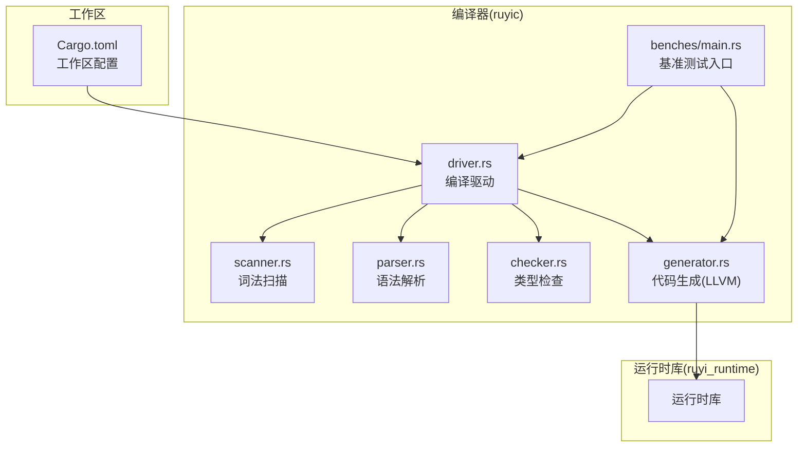
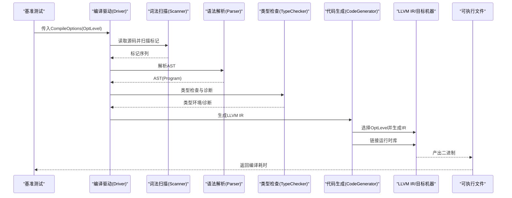
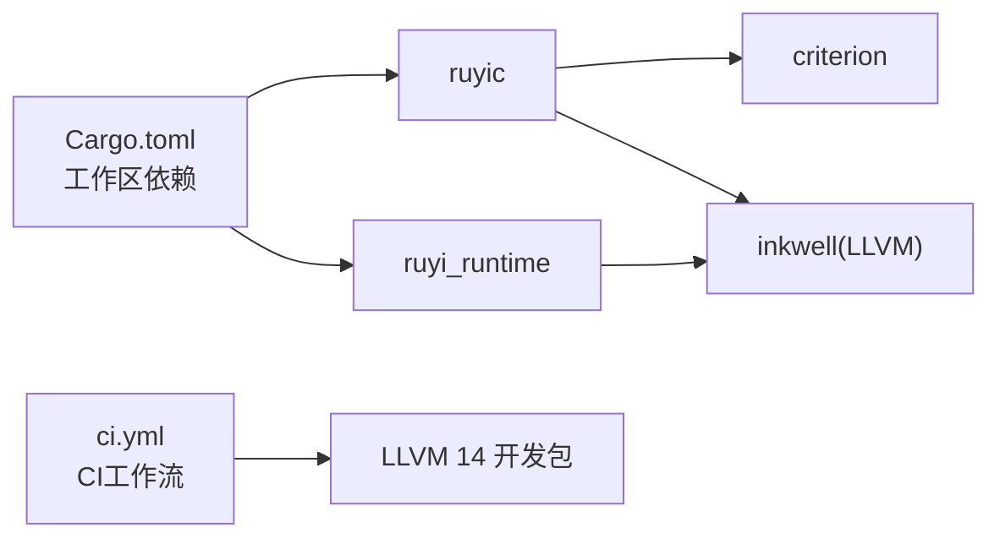

# 性能测试

<cite>
**本文引用的文件**
- [Cargo.toml](file://Cargo.toml)
- [benches/main.rs](file://crates/ruyic/benches/main.rs)
- [driver.rs](file://crates/ruyic/src/driver.rs)
- [generator.rs](file://crates/ruyic/src/codegen/generator.rs)
- [scanner.rs](file://crates/ruyic/src/lexer/scanner.rs)
- [parser.rs](file://crates/ruyic/src/parser/parser.rs)
- [checker.rs](file://crates/ruyic/src/typechecker/checker.rs)
- [ci.yml](file://.github/workflows/ci.yml)
- [Makefile](file://Makefile)
- [README.md](file://README.md)
</cite>

## 目录
1. [简介](#简介)
2. [项目结构](#项目结构)
3. [核心组件](#核心组件)
4. [架构总览](#架构总览)
5. [详细组件分析](#详细组件分析)
6. [依赖关系分析](#依赖关系分析)
7. [性能考量](#性能考量)
8. [故障排查指南](#故障排查指南)
9. [结论](#结论)
10. [附录](#附录)

## 简介
本指南面向Ruyi编译器的性能测试与基准评测，系统性阐述如何使用现有基准框架进行编译性能、运行时性能与内存使用的测量；如何在CI中自动化执行与持续监控；以及如何通过不同优化级别进行对比测试、识别性能瓶颈并制定回归检测与基线维护策略。Ruyi采用基于LLVM的编译后端，基准测试覆盖词法扫描、语法解析、宏展开、类型检查、代码生成等阶段，并支持O0/O1/O2三种优化级别的编译时间对比。

## 项目结构
Ruyi采用多crate工作区组织，其中编译器主crate为 ruyic，运行时库为 ruyi_runtime。性能基准集中在 ruyic 的 benches 目录中，驱动层负责编译流程编排，代码生成层负责LLVM IR生成与二进制链接。

图表来源
- [Cargo.toml:1-40](file://Cargo.toml#L1-L40)
- [driver.rs:1-744](file://crates/ruyic/src/driver.rs#L1-L744)
- [benches/main.rs:1-344](file://crates/ruyic/benches/main.rs#L1-L344)

章节来源
- [Cargo.toml:1-40](file://Cargo.toml#L1-L40)
- [README.md:75-99](file://README.md#L75-L99)

## 核心组件
- 编译驱动：负责模块解析、导入处理、宏展开、类型检查、代码生成与输出控制，贯穿完整编译流水线。
- 词法扫描：将源码转为标记流，支持模板字符串与注释处理。
- 语法解析：将标记流构建为AST，处理导入导出、声明与语句。
- 类型检查：渐进式类型系统，进行推断、约束求解与诊断收集。
- 代码生成：将AST映射到LLVM IR，支持O0/O1/O2优化级别，并最终链接为原生二进制。
- 基准测试：以Criterion为框架，覆盖词法、语法、类型检查、代码生成与整体编译时间，并按大小规模分组。

章节来源
- [driver.rs:242-737](file://crates/ruyic/src/driver.rs#L242-L737)
- [scanner.rs:1-800](file://crates/ruyic/src/lexer/scanner.rs#L1-L800)
- [parser.rs:1-800](file://crates/ruyic/src/parser/parser.rs#L1-L800)
- [checker.rs:1-295](file://crates/ruyic/src/typechecker/checker.rs#L1-L295)
- [generator.rs:1-800](file://crates/ruyic/src/codegen/generator.rs#L1-L800)
- [benches/main.rs:1-344](file://crates/ruyic/benches/main.rs#L1-L344)

## 架构总览
下图展示从源码到可执行文件的编译路径，以及基准测试对各阶段的采样点。

图表来源
- [benches/main.rs:142-169](file://crates/ruyic/benches/main.rs#L142-L169)
- [driver.rs:522-632](file://crates/ruyic/src/driver.rs#L522-L632)
- [generator.rs:748-799](file://crates/ruyic/src/codegen/generator.rs#L748-L799)

## 详细组件分析

### 基准测试框架与配置
- 使用Criterion作为基准框架，定义多个benchmark group，按输入规模（小/中/大）与吞吐量（字节）设置。
- 覆盖阶段：
  - 词法扫描：针对不同规模源码，统计扫描耗时。
  - 语法解析：解析AST耗时。
  - 类型检查：解析+宏展开+类型检查耗时。
  - 代码生成：解析+宏展开+类型检查+LLVM IR生成耗时。
  - 整体编译：从源码到二进制的端到端编译耗时，分别测试O0/O1/O2。
- 优化级别映射：O0/O1/O2分别对应LLVM优化等级None/Less/Aggressive。

章节来源
- [benches/main.rs:1-344](file://crates/ruyic/benches/main.rs#L1-L344)
- [generator.rs:22-28](file://crates/ruyic/src/codegen/generator.rs#L22-L28)

### 编译驱动与流水线
- 模块解析与导入：自动加载标准库模块，递归解析import/export，合并命名空间与别名。
- 宏展开：在类型检查前完成，确保类型系统看到展开后的AST。
- 类型检查：构建trait注册表、执行类型推断与约束求解，收集诊断信息。
- 代码生成：声明内置函数、预声明类结构与方法签名，编译主函数与其它声明，必要时允许部分代码生成失败（用于标准库兼容）。
- 输出：支持输出LLVM IR或直接生成二进制，二进制链接时自动附加运行时库与数学/标准库符号。

章节来源
- [driver.rs:303-512](file://crates/ruyic/src/driver.rs#L303-L512)
- [driver.rs:522-632](file://crates/ruyic/src/driver.rs#L522-L632)
- [checker.rs:57-83](file://crates/ruyic/src/typechecker/checker.rs#L57-L83)

### 词法扫描器
- 支持标识符、关键字、数字、字符串、模板字符串、注释等；处理转义与错误场景。
- 提供一次性扫描接口，返回完整标记序列，便于基准测试统计扫描耗时。

章节来源
- [scanner.rs:1-800](file://crates/ruyic/src/lexer/scanner.rs#L1-L800)

### 语法解析器
- 将标记流解析为AST，支持导入/导出、声明、语句、表达式等；提供错误定位与预期标记提示。
- 基于标记流推进，遇到EOF结束解析。

章节来源
- [parser.rs:1-800](file://crates/ruyic/src/parser/parser.rs#L1-L800)

### 类型检查器
- 渐进式类型系统，构建trait注册表，执行类型推断与约束求解，报告诊断。
- 提供查询变量类型的接口，便于后续代码生成阶段使用类型信息。

章节来源
- [checker.rs:1-295](file://crates/ruyic/src/typechecker/checker.rs#L1-L295)

### 代码生成器
- 将AST映射到LLVM IR，声明内置函数与类型，处理类结构、方法签名、异步状态机、异常处理等。
- 支持不同优化级别，最终链接生成原生二进制；链接时自动附加运行时静态库与数学/标准库符号。

章节来源
- [generator.rs:1-800](file://crates/ruyic/src/codegen/generator.rs#L1-L800)

### 优化级别与编译时间对比
- 在基准测试中，对同一源码分别测试O0/O1/O2三个优化级别，观察端到端编译耗时差异。
- 优化级别映射至LLVM优化等级，影响代码生成与链接阶段的耗时表现。

章节来源
- [benches/main.rs:331-342](file://crates/ruyic/benches/main.rs#L331-L342)
- [generator.rs:22-28](file://crates/ruyic/src/codegen/generator.rs#L22-L28)

## 依赖关系分析
- 工作区统一管理依赖版本，编译器依赖运行时库与LLVM绑定inkwell。
- 基准测试依赖Criterion，测试目标为编译器主crate。
- CI工作流安装LLVM 14开发包并执行构建与测试。

图表来源
- [Cargo.toml:14-30](file://Cargo.toml#L14-L30)
- [ci.yml:17-21](file://.github/workflows/ci.yml#L17-L21)

章节来源
- [Cargo.toml:14-30](file://Cargo.toml#L14-L30)
- [.github/workflows/ci.yml:1-45](file://.github/workflows/ci.yml#L1-L45)

## 性能考量
- 编译性能
  - 词法扫描：输入规模越大，扫描耗时越高；建议对超大文件进行分段或增量处理策略（如适用）。
  - 语法解析：复杂嵌套结构与大量导入会增加解析成本；可通过缓存AST或增量解析降低重复开销。
  - 类型检查：泛型实例化与trait约束求解是主要成本；可考虑延迟实例化与缓存中间结果。
  - 代码生成：LLVM IR生成与优化阶段耗时显著；不同优化级别对生成时间与产物质量有明显权衡。
- 运行时性能
  - 二进制链接阶段需确保运行时库正确链接；基准测试关注端到端编译时间，运行时性能可在独立用例中评估。
- 内存使用
  - 大型AST与类型环境会占用较多内存；建议在类型检查与代码生成阶段及时释放临时结构。
  - GC根管理在代码生成上下文中尤为重要，避免不必要的根注册导致额外内存与清理开销。

## 故障排查指南
- 基准测试未运行或失败
  - 确认已安装LLVM 14开发包并设置LLVM_SYS_140_PREFIX。
  - 在本地执行基准测试时，确保工作区已正确构建且运行时库可用。
- 编译错误
  - 若类型检查阶段出现错误，基准测试会记录诊断；可启用--emit-typed-ast查看类型环境辅助定位。
  - 代码生成阶段若遇到不支持的特性（如标准库中的某些模式），可利用允许部分代码生成的开关进行调试。
- CI执行问题
  - CI工作流中已安装LLVM 14并执行构建与测试；若失败，请检查日志中的LLVM初始化与链接步骤。

章节来源
- [.github/workflows/ci.yml:17-21](file://.github/workflows/ci.yml#L17-L21)
- [driver.rs:568-569](file://crates/ruyic/src/driver.rs#L568-L569)
- [generator.rs:748-799](file://crates/ruyic/src/codegen/generator.rs#L748-L799)

## 结论
Ruyi的基准测试体系覆盖了从词法到代码生成的关键阶段，并通过不同优化级别对比编译性能。结合CI自动化与Makefile便捷命令，可形成从本地到持续集成的完整性能测试闭环。建议在日常开发中定期运行基准测试，建立基线并监控回归，同时针对热点模块（类型检查、代码生成）进行专项优化与剖析。

## 附录
- 基准测试运行方式
  - 使用Cargo bench在 ruyic crate 中运行基准测试。
  - 参考Makefile中的示例目标，快速编译与运行示例程序。
- 基准测试数据采集与可视化
  - Criterion默认输出HTML报告；可将报告产物纳入CI工件以便长期保存与对比。
- 自动化与持续监控
  - CI工作流已包含LLVM安装与测试步骤；可在非PR分支上扩展基准测试任务并上传报告。

章节来源
- [benches/main.rs:1-344](file://crates/ruyic/benches/main.rs#L1-L344)
- [Makefile:67-104](file://Makefile#L67-L104)
- [.github/workflows/ci.yml:28-44](file://.github/workflows/ci.yml#L28-L44)