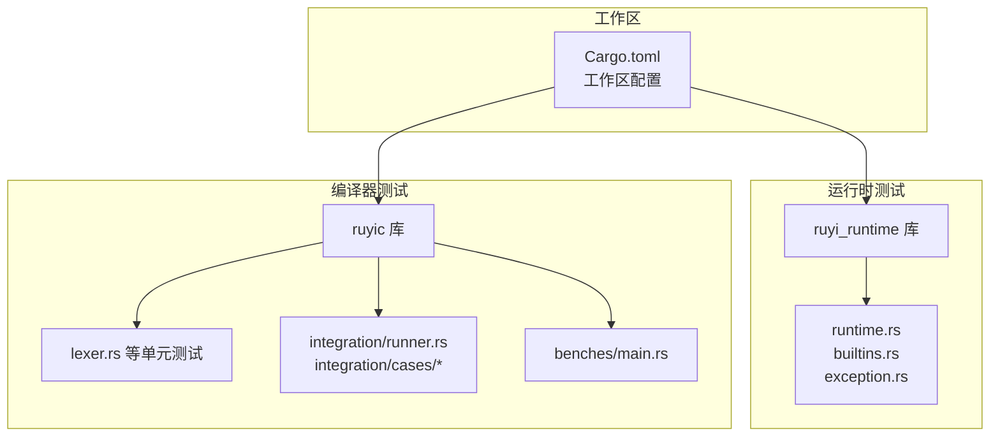
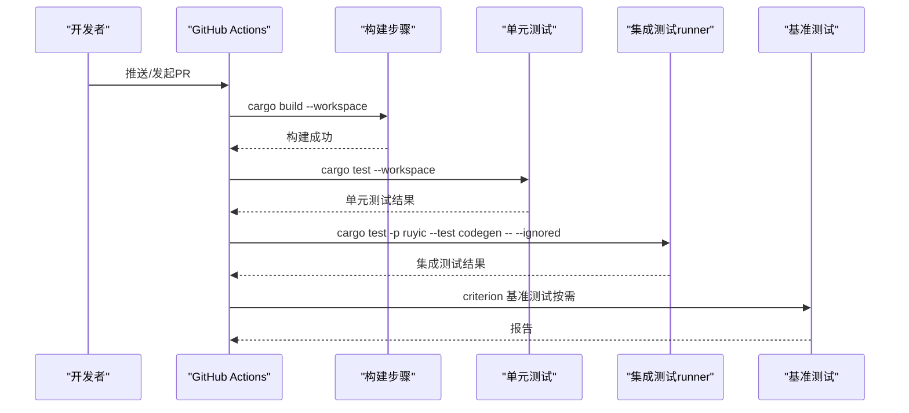
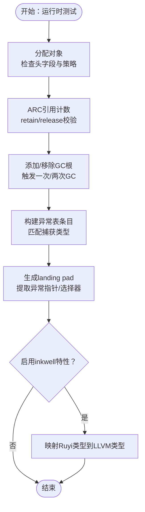
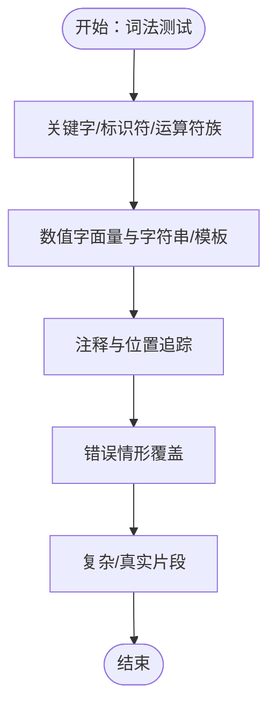
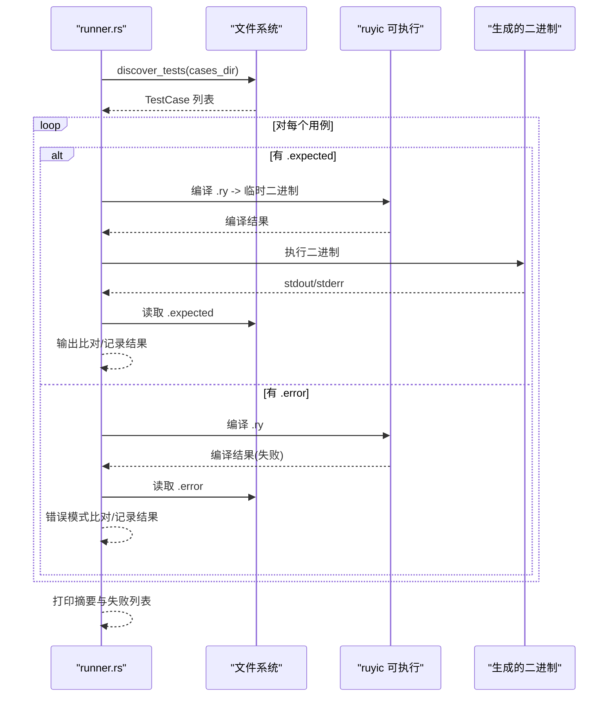
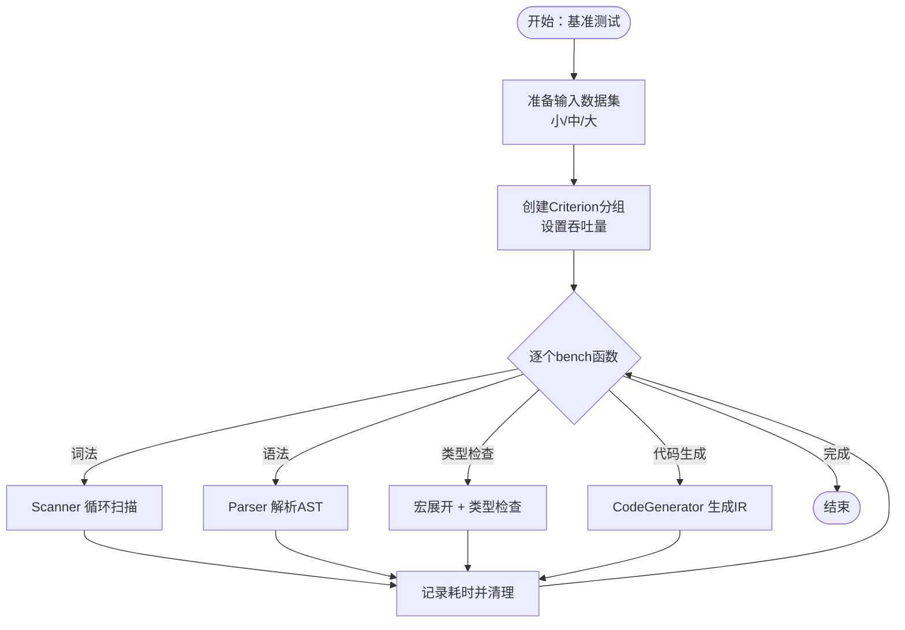
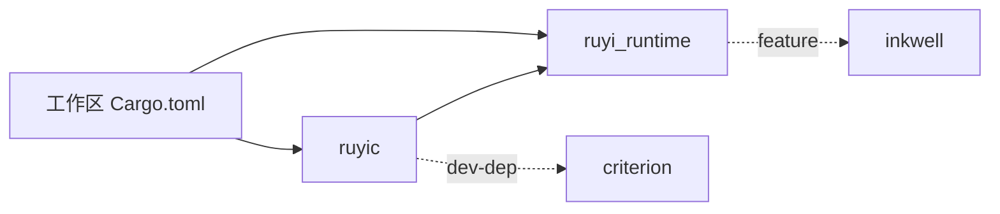

# 测试指南

<cite>
**本文引用的文件**
- [.github/workflows/ci.yml](file://.github/workflows/ci.yml)
- [Cargo.toml](file://Cargo.toml)
- [Makefile](file://Makefile)
- [crates/ruyic/Cargo.toml](file://crates/ruyic/Cargo.toml)
- [crates/ruyi_runtime/Cargo.toml](file://crates/ruyi_runtime/Cargo.toml)
- [crates/ruyi_runtime/tests/runtime.rs](file://crates/ruyi_runtime/tests/runtime.rs)
- [crates/ruyi_runtime/tests/builtins.rs](file://crates/ruyi_runtime/tests/builtins.rs)
- [crates/ruyi_runtime/tests/exception.rs](file://crates/ruyi_runtime/tests/exception.rs)
- [crates/ruyic/tests/integration/runner.rs](file://crates/ruyic/tests/integration/runner.rs)
- [crates/ruyic/tests/integration/cases/basic/hello_world.ry](file://crates/ruyic/tests/integration/cases/basic/hello_world.ry)
- [crates/ruyic/tests/integration/cases/basic/hello_world.expected](file://crates/ruyic/tests/integration/cases/basic/hello_world.expected)
- [crates/ruyic/tests/integration/cases/errors/custom_errors.ry](file://crates/ruyic/tests/integration/cases/errors/custom_errors.ry)
- [crates/ruyic/tests/lexer.rs](file://crates/ruyic/tests/lexer.rs)
- [crates/ruyic/benches/main.rs](file://crates/ruyic/benches/main.rs)
</cite>

## 目录
1. [引言](#引言)
2. [项目结构](#项目结构)
3. [核心组件](#核心组件)
4. [架构总览](#架构总览)
5. [详细组件分析](#详细组件分析)
6. [依赖分析](#依赖分析)
7. [性能考量](#性能考量)
8. [故障排查指南](#故障排查指南)
9. [结论](#结论)
10. [附录](#附录)

## 引言
本指南面向Ruyi编程语言的测试体系，覆盖单元测试、集成测试、基准测试与CI/CD自动化，并结合仓库现有实现给出可操作的最佳实践与落地建议。内容包括：
- 单元测试编写方法与断言策略
- 集成测试设计与实施
- 性能与基准测试流程
- 测试数据准备与管理
- 模拟对象与测试替身的创建技巧
- 覆盖率测量与提升路径
- CI/CD集成与自动化配置
- 调试与问题排查技巧

## 项目结构
Ruyi采用多crate工作区组织，核心测试分布在两个主要crate中：
- ruyi_runtime：运行时（内存、异常、类型等）单元测试
- ruyic：编译器前端（词法/语法/类型检查/代码生成）单元测试与集成测试runner，以及基准测试

图表来源
- [Cargo.toml:1-40](file://Cargo.toml#L1-L40)
- [crates/ruyi_runtime/Cargo.toml:1-17](file://crates/ruyi_runtime/Cargo.toml#L1-L17)
- [crates/ruyic/Cargo.toml:1-26](file://crates/ruyic/Cargo.toml#L1-L26)

章节来源
- [Cargo.toml:1-40](file://Cargo.toml#L1-L40)
- [Makefile:1-122](file://Makefile#L1-L122)

## 核心组件
- 运行时单元测试：验证分配器、GC生命周期、异常表与landing pad、以及在启用LLVM特性时的类型映射行为。
- 编译器单元测试：覆盖词法分析器对关键字、标识符、运算符、字面量、注释、位置追踪与错误处理的正确性。
- 集成测试runner：扫描cases目录下的Ruyi源码用例，编译并执行，比对标准输出或错误信息，统计通过/失败。
- 基准测试：针对词法、语法、类型检查与代码生成进行吞吐度与时间开销的基准评估。

章节来源
- [crates/ruyi_runtime/tests/runtime.rs:1-133](file://crates/ruyi_runtime/tests/runtime.rs#L1-L133)
- [crates/ruyi_runtime/tests/builtins.rs:1-81](file://crates/ruyi_runtime/tests/builtins.rs#L1-L81)
- [crates/ruyi_runtime/tests/exception.rs:1-232](file://crates/ruyi_runtime/tests/exception.rs#L1-L232)
- [crates/ruyic/tests/lexer.rs:1-708](file://crates/ruyic/tests/lexer.rs#L1-L708)
- [crates/ruyic/tests/integration/runner.rs:1-385](file://crates/ruyic/tests/integration/runner.rs#L1-L385)
- [crates/ruyic/benches/main.rs:1-344](file://crates/ruyic/benches/main.rs#L1-L344)

## 架构总览
下图展示从CI到测试执行的关键路径，包括构建、测试与代码生成集成测试的触发条件。

图表来源
- [.github/workflows/ci.yml:12-45](file://.github/workflows/ci.yml#L12-L45)
- [Makefile:43-44](file://Makefile#L43-L44)

## 详细组件分析

### 运行时单元测试（内存/GC/异常）
- 分配与释放：验证对象头字段、内存策略与引用计数。
- 标记清扫GC：验证根集添加/移除与垃圾回收后的存活数量。
- 异常表与landing pad：验证异常条目匹配、清理块设置与指针提取。
- LLVM特性开关：在启用inkwell特性时，验证Ruyi类型到LLVM类型的映射。

图表来源
- [crates/ruyi_runtime/tests/runtime.rs:3-133](file://crates/ruyi_runtime/tests/runtime.rs#L3-L133)
- [crates/ruyi_runtime/tests/exception.rs:124-232](file://crates/ruyi_runtime/tests/exception.rs#L124-L232)

章节来源
- [crates/ruyi_runtime/tests/runtime.rs:1-133](file://crates/ruyi_runtime/tests/runtime.rs#L1-L133)
- [crates/ruyi_runtime/tests/builtins.rs:1-81](file://crates/ruyi_runtime/tests/builtins.rs#L1-L81)
- [crates/ruyi_runtime/tests/exception.rs:1-232](file://crates/ruyi_runtime/tests/exception.rs#L1-L232)

### 编译器单元测试（词法分析）
- 关键字、布尔与空值、特殊标识符、运算符族（比较/算术/位/逻辑/空合并/赋值/箭头/自增自减）、分隔符。
- 数值字面量（十进制/浮点/科学计数/十六进制/八进制/二进制/大整型）。
- 字符串与模板字符串（转义、Unicode/十六进制转义、插值、多行）。
- 注释（行注释/块注释/文档注释）与位置追踪。
- 错误情形（无效字符、未终止字符串/注释/模板、非法转义、数字格式错误）。
- 复杂/真实片段（变量声明、函数声明、可选链、空合并、箭头函数、展开、match表达式、泛型函数、trait声明、空白处理、仅EOF）。

图表来源
- [crates/ruyic/tests/lexer.rs:25-708](file://crates/ruyic/tests/lexer.rs#L25-L708)

章节来源
- [crates/ruyic/tests/lexer.rs:1-708](file://crates/ruyic/tests/lexer.rs#L1-L708)

### 集成测试runner（端到端编译与执行）
- 测试用例发现：遍历cases目录，按category/source命名，自动匹配.expected或.error文件。
- 正向测试：编译为二进制并执行，比对标准输出；不匹配则记录差异。
- 负向测试：期望编译失败，比对stderr是否包含预期错误模式。
- 路径解析：优先KLANG_BIN环境变量，其次CARGO_BIN_EXE_ruyic，最后target/debug或target/release。
- 结果汇总：打印总数/通过数/失败数与失败列表。

图表来源
- [crates/ruyic/tests/integration/runner.rs:31-316](file://crates/ruyic/tests/integration/runner.rs#L31-L316)

章节来源
- [crates/ruyic/tests/integration/runner.rs:1-385](file://crates/ruyic/tests/integration/runner.rs#L1-L385)
- [crates/ruyic/tests/integration/cases/basic/hello_world.ry:1-1](file://crates/ruyic/tests/integration/cases/basic/hello_world.ry#L1-L1)
- [crates/ruyic/tests/integration/cases/basic/hello_world.expected:1-1](file://crates/ruyic/tests/integration/cases/basic/hello_world.expected#L1-L1)
- [crates/ruyic/tests/integration/cases/errors/custom_errors.ry:1-29](file://crates/ruyic/tests/integration/cases/errors/custom_errors.ry#L1-L29)

### 基准测试（Criterion）
- 数据集：小/中/大三档输入，分别覆盖词法、语法、类型检查与代码生成。
- 组织方式：按模块分组，设置吞吐量（字节数），使用black_box保护输入。
- 流程：构造输入文件，驱动编译流程（Driver/Scanner/Parser/TypeChecker/CodeGenerator），统计耗时并清理临时文件。

图表来源
- [crates/ruyic/benches/main.rs:10-344](file://crates/ruyic/benches/main.rs#L10-L344)

章节来源
- [crates/ruyic/benches/main.rs:1-344](file://crates/ruyic/benches/main.rs#L1-L344)

## 依赖分析
- 工作区与依赖：工作区统一版本与特性，ruyic依赖ruyi_runtime与inkwell/clap/日志/错误处理等；ruyi_runtime默认启用inkwell特性。
- 测试依赖：ruyic在dev-dependencies中引入criterion用于基准测试；运行时测试直接使用crate内导出API。
- CI依赖：GitHub Actions安装LLVM 14并设置环境变量，随后构建与测试。

图表来源
- [Cargo.toml:14-30](file://Cargo.toml#L14-L30)
- [crates/ruyic/Cargo.toml:8-26](file://crates/ruyic/Cargo.toml#L8-L26)
- [crates/ruyi_runtime/Cargo.toml:12-17](file://crates/ruyi_runtime/Cargo.toml#L12-L17)

章节来源
- [Cargo.toml:1-40](file://Cargo.toml#L1-L40)
- [crates/ruyic/Cargo.toml:1-26](file://crates/ruyic/Cargo.toml#L1-L26)
- [crates/ruyi_runtime/Cargo.toml:1-17](file://crates/ruyi_runtime/Cargo.toml#L1-L17)

## 性能考量
- 基准测试分层：词法、语法、类型检查、代码生成四层，便于定位瓶颈。
- 吞吐度设置：以输入字节数作为吞吐单位，便于跨规模对比。
- 输入隔离：每类输入独立文件，避免相互影响。
- 清理策略：基准结束后删除临时文件，避免磁盘膨胀。
- 优化建议：对热点路径（如宏展开、类型推断）优先优化；利用Caching与增量计算减少重复工作。

章节来源
- [crates/ruyic/benches/main.rs:171-344](file://crates/ruyic/benches/main.rs#L171-L344)

## 故障排查指南
- CI构建失败（LLVM相关）：确认Actions中已安装LLVM 14并设置LLVM_SYS_140_PREFIX；本地可通过brew或apt安装。
- 集成测试找不到ruyic：确保KLANG_BIN或CARGO_BIN_EXE_ruyic指向有效可执行，或先执行cargo build。
- 集成测试输出不一致：检查expected文件换行符与裁剪策略；注意normalize后的对比。
- 负向测试错误信息不匹配：确认.error文件包含期望子串，且stderr中存在该模式。
- 单测panic或段错误：运行时测试涉及unsafe与外部ABI，建议开启asan或valgrind辅助定位；必要时缩小最小复现。
- 词法错误定位：利用位置追踪信息（line/col）快速定位源码位置。

章节来源
- [.github/workflows/ci.yml:17-21](file://.github/workflows/ci.yml#L17-L21)
- [crates/ruyic/tests/integration/runner.rs:247-266](file://crates/ruyic/tests/integration/runner.rs#L247-L266)
- [crates/ruyic/tests/integration/runner.rs:150-173](file://crates/ruyic/tests/integration/runner.rs#L150-L173)
- [crates/ruyic/tests/integration/runner.rs:210-230](file://crates/ruyic/tests/integration/runner.rs#L210-L230)
- [crates/ruyic/tests/lexer.rs:419-487](file://crates/ruyic/tests/lexer.rs#L419-L487)

## 结论
Ruyi测试体系以“单元测试+集成测试runner+基准测试”为核心，配合CI自动化与LLVM工具链，形成从功能正确性到性能表现的完整闭环。建议持续完善测试数据管理、覆盖率度量与模拟对象策略，进一步提升质量与可维护性。

## 附录

### 单元测试最佳实践
- 断言策略：优先使用结构化断言（相等/匹配/错误类型），避免只看stdout/stderr。
- 边界与异常：覆盖边界值、非法输入、错误传播路径。
- 可重复性：固定随机种子或避免非确定性因素；对并发逻辑加锁或序列化。

### 集成测试设计与实施
- 用例组织：按功能域分层（basic/codegen/control_flow/errors/types/stdlib/async等），便于扩展与回归。
- 输出标准化：统一换行符处理与空白裁剪，避免平台差异导致误判。
- 失败诊断：记录实际输出与期望差异，必要时输出原始stderr/trace。

### 基准测试实施指南
- 输入规模：小/中/大三档覆盖不同复杂度；保持输入稳定，避免抖动。
- 分组策略：按阶段分组，设置合理吞吐度；使用black_box保护输入。
- 报告解读：关注中位数/分位数与异常点，识别回归趋势。

### 测试数据准备与管理
- 用例命名：category/name.ry + .expected 或 .error，保持一致性。
- 数据版本：随需求变更同步更新expected/error，避免历史用例漂移。
- 生成脚本：对大规模用例可考虑自动生成器，保证覆盖率与一致性。

### 模拟对象与测试替身
- 外部依赖：对系统调用、文件IO、网络等使用替身或mock，隔离环境差异。
- 运行时接口：对unsafe路径可封装薄层API，便于注入替身或注入测试上下文。
- 异常路径：通过可控异常抛出与捕获，验证异常表与landing pad行为。

### 测试覆盖率测量与改进
- 工具：使用cargo-tarpaulin或llvm-tools收集覆盖率报告。
- 改进策略：优先补齐高风险路径（错误分支、异常处理、边界条件）；对热点模块增加负向用例。

### CI/CD自动化配置
- 触发策略：主干推送与PR触发基础测试；代码生成集成测试在非PR上忽略失败继续推进。
- 环境准备：Actions中安装LLVM 14并设置环境变量；缓存cargo依赖加速构建。
- 并行化：将单元测试与集成测试runner拆分为独立job，缩短整体耗时。

章节来源
- [.github/workflows/ci.yml:1-45](file://.github/workflows/ci.yml#L1-L45)
- [Makefile:43-51](file://Makefile#L43-L51)