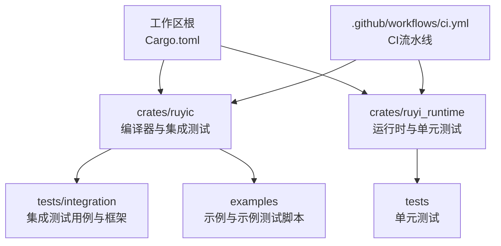
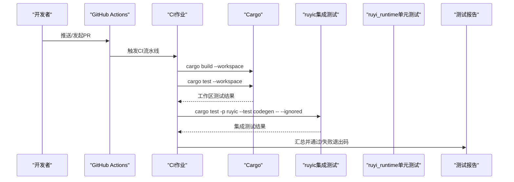
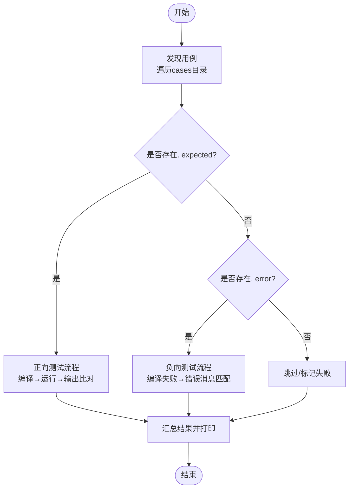
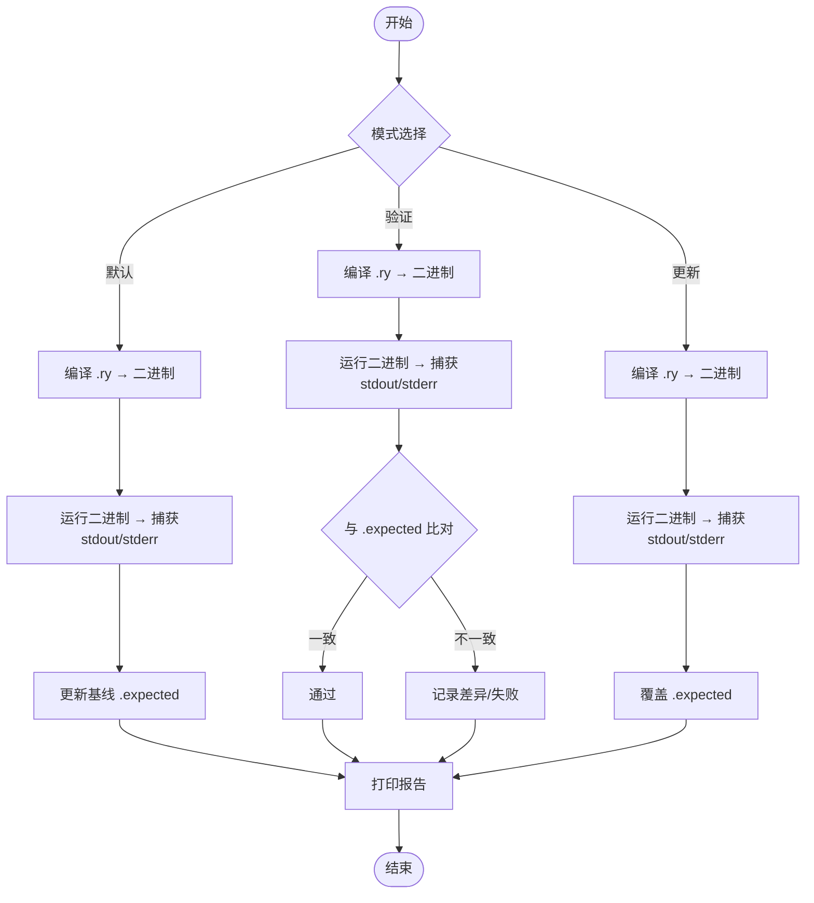
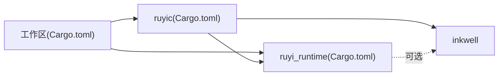

# 测试自动化

<cite>
**本文引用的文件**
- [.github/workflows/ci.yml](file://.github/workflows/ci.yml)
- [Makefile](file://Makefile)
- [Cargo.toml](file://Cargo.toml)
- [crates/ruyic/Cargo.toml](file://crates/ruyic/Cargo.toml)
- [crates/ruyi_runtime/Cargo.toml](file://crates/ruyi_runtime/Cargo.toml)
- [crates/ruyic/tests/integration/runner.rs](file://crates/ruyic/tests/integration/runner.rs)
- [crates/ruyic/tests/integration.rs](file://crates/ruyic/tests/integration.rs)
- [crates/ruyi_runtime/tests/runtime.rs](file://crates/ruyi_runtime/tests/runtime.rs)
- [examples/run_examples.sh](file://examples/run_examples.sh)
- [examples/hello_world.ry](file://examples/hello_world.ry)
- [examples/error_handling.ry](file://examples/error_handling.ry)
- [crates/ruyic/tests/integration/cases/basic/hello_world.ry](file://crates/ruyic/tests/integration/cases/basic/hello_world.ry)
- [crates/ruyic/tests/integration/cases/basic/hello_world.expected](file://crates/ruyic/tests/integration/cases/basic/hello_world.expected)
- [crates/ruyic/tests/integration/cases/exception/try_catch_basic.ry](file://crates/ruyic/tests/integration/cases/exception/try_catch_basic.ry)
- [crates/ruyic/tests/integration/cases/exception/try_finally.ry](file://crates/ruyic/tests/integration/cases/exception/try_finally.ry)
- [.omo/plans/examples-compile-test.md](file://.omo/plans/examples-compile-test.md)
- [.omo/evidence/task-7-test-framework.txt](file://.omo/evidence/task-7-test-framework.txt)
- [.omo/evidence/task-7-negative-tests.txt](file://.omo/evidence/task-7-negative-tests.txt)
- [.omo/evidence/final-qa/qa-report.md](file://.omo/evidence/final-qa/qa-report.md)
</cite>

## 目录
1. [简介](#简介)
2. [项目结构](#项目结构)
3. [核心组件](#核心组件)
4. [架构总览](#架构总览)
5. [详细组件分析](#详细组件分析)
6. [依赖关系分析](#依赖关系分析)
7. [性能考量](#性能考量)
8. [故障排查指南](#故障排查指南)
9. [结论](#结论)
10. [附录](#附录)

## 简介
本指南面向Ruyi项目的测试自动化体系，覆盖CI/CD流水线中的测试执行配置、Makefile中测试任务的定义与使用、自动化测试的触发条件与执行策略、测试报告生成与发布流程、并行测试执行与资源管理、测试环境搭建与维护最佳实践、测试失败的诊断与恢复策略，以及测试数据的清理与隔离方法。文档以仓库现有实现为依据，结合脚本与测试框架的工作流，帮助开发者在本地与CI环境中高效、稳定地运行测试。

## 项目结构
Ruyi采用多crate工作区组织，测试分布在以下位置：
- 工作区根：CI配置、顶层构建与测试入口、全局Cargo元数据
- crates/ruyic：编译器主crate，包含集成测试框架与用例
- crates/ruyi_runtime：运行时库，包含单元测试与异常处理测试
- examples：示例程序与示例测试脚本，支持批量编译、运行与比对
- .github/workflows：GitHub Actions CI流水线
- .omo：测试计划与证据文件，记录测试框架验证与最终质量报告

图表来源
- [Cargo.toml:1-40](file://Cargo.toml#L1-L40)
- [.github/workflows/ci.yml:1-45](file://.github/workflows/ci.yml#L1-L45)

章节来源
- [Cargo.toml:1-40](file://Cargo.toml#L1-L40)
- [.github/workflows/ci.yml:1-45](file://.github/workflows/ci.yml#L1-L45)

## 核心组件
- CI流水线（GitHub Actions）
  - 触发条件：推送至main或dev分支；拉取请求针对main分支
  - 步骤：安装LLVM 14、设置Rust工具链、构建工作区、运行工作区测试
  - 额外作业：在非PR条件下，继续运行编译器集成测试（忽略标记用例）

- Makefile测试任务
  - 提供统一入口：构建、检查、测试、格式化、静态检查等
  - 测试目标：运行工作区全部测试；按包运行单个测试套件；清理产物

- 集成测试框架（ruyic/tests/integration）
  - 自动发现用例：遍历cases子目录，识别正向与负向测试
  - 执行策略：编译到临时二进制→运行→输出比对或错误模式匹配
  - 结果汇总：统计总数、通过数、失败数，并打印摘要

- 示例测试脚本（examples/run_examples.sh）
  - 支持三种模式：默认（编译+运行+更新基线）、验证（编译+运行+比对）、更新（编译+运行+覆盖基线）
  - 基于超时控制、失败日志记录、基线状态（预期失败/抖动）管理

- 运行时单元测试（ruyi_runtime/tests）
  - 涵盖分配、ARC引用计数、标记清除生命周期、异常表与landing pad描述符等

章节来源
- [.github/workflows/ci.yml:1-45](file://.github/workflows/ci.yml#L1-L45)
- [Makefile:35-66](file://Makefile#L35-L66)
- [crates/ruyic/tests/integration/runner.rs:31-316](file://crates/ruyic/tests/integration/runner.rs#L31-L316)
- [crates/ruyic/tests/integration.rs:6-23](file://crates/ruyic/tests/integration.rs#L6-L23)
- [examples/run_examples.sh:54-487](file://examples/run_examples.sh#L54-L487)
- [crates/ruyi_runtime/tests/runtime.rs:1-133](file://crates/ruyi_runtime/tests/runtime.rs#L1-L133)

## 架构总览
下图展示从CI触发到测试执行、结果汇总与报告的关键路径。

图表来源
- [.github/workflows/ci.yml:12-45](file://.github/workflows/ci.yml#L12-L45)
- [crates/ruyic/tests/integration.rs:6-23](file://crates/ruyic/tests/integration.rs#L6-L23)

## 详细组件分析

### CI流水线与触发条件
- 触发条件
  - 推送事件：分支main及dev/**均触发
  - PR事件：仅针对main分支触发
- 关键步骤
  - 安装LLVM 14并设置环境变量，确保编译器相关功能可用
  - 设置Rust工具链
  - 构建工作区
  - 运行工作区测试
  - 在非PR条件下，额外运行编译器集成测试（忽略标记用例），允许失败不影响主流程

章节来源
- [.github/workflows/ci.yml:3-26](file://.github/workflows/ci.yml#L3-L26)
- [.github/workflows/ci.yml:28-45](file://.github/workflows/ci.yml#L28-L45)

### Makefile测试任务定义与使用
- 主要测试目标
  - test：运行工作区全部测试
  - test-single：按包运行单个测试套件（需传入TEST参数）
- 使用建议
  - 本地开发：优先使用test-single定位问题模块
  - 回归测试：使用test执行全量测试

章节来源
- [Makefile:43-51](file://Makefile#L43-L51)

### 集成测试框架（ruyic/tests/integration）
- 用例发现
  - 递归扫描cases目录，按子目录分组，.ry文件即为测试源
  - 若存在同名. expected文件则为正向测试；若存在. error文件则为负向测试
- 执行流程
  - 正向测试：编译到临时二进制→运行→比较标准输出与期望文件
  - 负向测试：期望编译失败，读取. error文件进行错误消息包含性匹配
  - 清理：运行后删除临时二进制
- 结果汇总
  - 统计总数、通过数、失败数；失败列表与原因摘要

图表来源
- [crates/ruyic/tests/integration/runner.rs:31-316](file://crates/ruyic/tests/integration/runner.rs#L31-L316)

章节来源
- [crates/ruyic/tests/integration/runner.rs:31-316](file://crates/ruyic/tests/integration/runner.rs#L31-L316)
- [crates/ruyic/tests/integration.rs:6-23](file://crates/ruyic/tests/integration.rs#L6-L23)

### 示例测试脚本（examples/run_examples.sh）
- 模式
  - 默认：编译→运行→更新基线
  - 验证：编译→运行→比对基线
  - 更新：编译→运行→覆盖基线
- 特性
  - 超时控制（编译/运行分别设置）
  - 基线状态管理：FLAKY（抖动）、EXP_FAIL（预期失败）
  - 失败日志记录与最终报告输出
  - 可选过滤：仅处理匹配模式的示例

图表来源
- [examples/run_examples.sh:158-476](file://examples/run_examples.sh#L158-L476)

章节来源
- [examples/run_examples.sh:54-487](file://examples/run_examples.sh#L54-L487)

### 运行时单元测试（ruyi_runtime/tests）
- 覆盖点
  - 分配与释放、ARC引用计数增减
  - 标记-清除收集器生命周期与根集管理
  - 异常表与landing pad描述符构建与匹配
  - 条件启用：inkwell特性下的类型校验

章节来源
- [crates/ruyi_runtime/tests/runtime.rs:1-133](file://crates/ruyi_runtime/tests/runtime.rs#L1-L133)

### 测试数据清理与隔离
- 集成测试
  - 临时二进制在运行后删除，避免污染后续执行
- 示例测试
  - examples/target目录清理策略：删除旧二进制与LLVM中间文件，保留目录结构与必要文件
  - 通过脚本参数控制仅处理匹配模式的示例，便于隔离问题范围

章节来源
- [crates/ruyic/tests/integration/runner.rs:116-118](file://crates/ruyic/tests/integration/runner.rs#L116-L118)
- [examples/run_examples.sh:284-300](file://examples/run_examples.sh#L284-L300)
- [.omo/plans/examples-compile-test.md:203-246](file://.omo/plans/examples-compile-test.md#L203-L246)

## 依赖关系分析
- 工作区与包级依赖
  - 工作区定义了共享依赖（如inkwell、clap、log等）
  - ruyic依赖ruyi_runtime与inkwell；ruyi_runtime可选启用inkwell特性
- 测试依赖
  - ruyic的dev-dependencies包含criterion（基准测试）
  - 集成测试runner独立于被测包，直接调用编译器与二进制

图表来源
- [Cargo.toml:14-26](file://Cargo.toml#L14-L26)
- [crates/ruyic/Cargo.toml:19-26](file://crates/ruyic/Cargo.toml#L19-L26)
- [crates/ruyi_runtime/Cargo.toml:11-17](file://crates/ruyi_runtime/Cargo.toml#L11-L17)

章节来源
- [Cargo.toml:1-40](file://Cargo.toml#L1-L40)
- [crates/ruyic/Cargo.toml:1-26](file://crates/ruyic/Cargo.toml#L1-L26)
- [crates/ruyi_runtime/Cargo.toml:1-17](file://crates/ruyi_runtime/Cargo.toml#L1-L17)

## 性能考量
- 并行执行
  - CI中未显式启用cargo test的并行选项；可在本地或自建CI中通过--jobs参数提升速度
  - 示例测试脚本按文件粒度顺序处理，未见内置并行；可通过外部并发调度器并行编译/运行不同示例
- 资源管理
  - 集成测试使用临时目录存放二进制，结束后清理
  - 示例测试脚本使用临时目录捕获stdout/stderr，完成后清理
- 优化建议
  - 将耗时的基准测试与集成测试分离，减少主流水线时间
  - 对示例测试引入外部并行化（例如多个job并行处理不同示例集合）

[本节为通用指导，无需列出具体文件来源]

## 故障排查指南
- CI失败
  - 检查LLVM版本与环境变量是否正确设置
  - 确认工作区构建与测试命令在本地可复现
- 集成测试失败
  - 查看runner输出的失败用例与原因摘要
  - 对比. expected与实际输出差异，必要时更新
- 示例测试失败
  - 使用--verify模式确认是否为输出不一致导致
  - 检查基线状态（FLAKY/EXP_FAIL），必要时更新基线
  - 查看failures.log中的详细stderr内容
- 超时与抖动
  - 调整编译/运行超时阈值
  - 将不稳定用例标记为FLAKY，避免计入失败

章节来源
- [.github/workflows/ci.yml:17-21](file://.github/workflows/ci.yml#L17-L21)
- [crates/ruyic/tests/integration/runner.rs:318-340](file://crates/ruyic/tests/integration/runner.rs#L318-L340)
- [examples/run_examples.sh:196-209](file://examples/run_examples.sh#L196-L209)
- [examples/run_examples.sh:422-445](file://examples/run_examples.sh#L422-L445)

## 结论
Ruyi的测试自动化体系由CI流水线、Makefile测试任务、集成测试框架、示例测试脚本与运行时单元测试构成。通过明确的触发条件、清晰的执行策略与完善的报告机制，能够在本地与CI环境中稳定运行各类测试。建议在保持现有流程的基础上，进一步引入并行化与更细粒度的资源隔离，持续提升测试效率与稳定性。

[本节为总结性内容，无需列出具体文件来源]

## 附录

### 测试报告生成与发布流程
- 集成测试
  - runner打印摘要与失败列表，主程序根据失败数量决定退出码
- 示例测试
  - 脚本输出最终报告，包含总计、通过、失败、抖动、预期失败、跳过等统计
  - 失败详情写入failures.log，便于审计

章节来源
- [crates/ruyic/tests/integration/runner.rs:318-340](file://crates/ruyic/tests/integration/runner.rs#L318-L340)
- [crates/ruyic/tests/integration.rs:19-23](file://crates/ruyic/tests/integration.rs#L19-L23)
- [examples/run_examples.sh:220-258](file://examples/run_examples.sh#L220-L258)
- [examples/run_examples.sh:481-487](file://examples/run_examples.sh#L481-L487)

### 测试环境搭建与维护最佳实践
- 本地环境
  - 安装LLVM 14并设置LLVM_SYS_140_PREFIX
  - 使用Makefile的build或build-release目标完成编译
- CI环境
  - 保持与本地一致的LLVM版本与工具链设置
  - 将示例测试作为独立job或在非PR条件下运行，避免阻塞主流程

章节来源
- [.github/workflows/ci.yml:17-21](file://.github/workflows/ci.yml#L17-L21)
- [Makefile:18-23](file://Makefile#L18-L23)

### 测试用例示例与参考
- 集成测试用例
  - 正向：basic/hello_world.ry 与 hello_world.expected
  - 负向：exception/try_catch_basic.ry 与 try_finally.ry（配合.error文件）
- 示例程序
  - hello_world.ry
  - error_handling.ry

章节来源
- [crates/ruyic/tests/integration/cases/basic/hello_world.ry:1](file://crates/ruyic/tests/integration/cases/basic/hello_world.ry#L1)
- [crates/ruyic/tests/integration/cases/basic/hello_world.expected:1](file://crates/ruyic/tests/integration/cases/basic/hello_world.expected#L1)
- [crates/ruyic/tests/integration/cases/exception/try_catch_basic.ry:1-5](file://crates/ruyic/tests/integration/cases/exception/try_catch_basic.ry#L1-L5)
- [crates/ruyic/tests/integration/cases/exception/try_finally.ry:1-5](file://crates/ruyic/tests/integration/cases/exception/try_finally.ry#L1-L5)
- [examples/hello_world.ry:1](file://examples/hello_world.ry#L1)
- [examples/error_handling.ry:211-229](file://examples/error_handling.ry#L211-L229)

### 最终质量报告与证据
- QA报告确认：运行时测试全部通过，无回归，集成夹具验证通过
- 测试框架证据：集成测试框架验证通过，包括用例发现、正向/负向测试流程、路径解析等

章节来源
- [.omo/evidence/final-qa/qa-report.md:45-47](file://.omo/evidence/final-qa/qa-report.md#L45-L47)
- [.omo/evidence/task-7-test-framework.txt:8-38](file://.omo/evidence/task-7-test-framework.txt#L8-L38)
- [.omo/evidence/task-7-negative-tests.txt:8-37](file://.omo/evidence/task-7-negative-tests.txt#L8-L37)