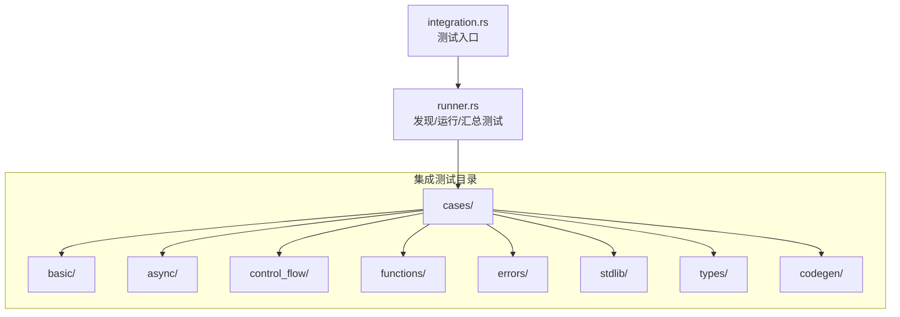
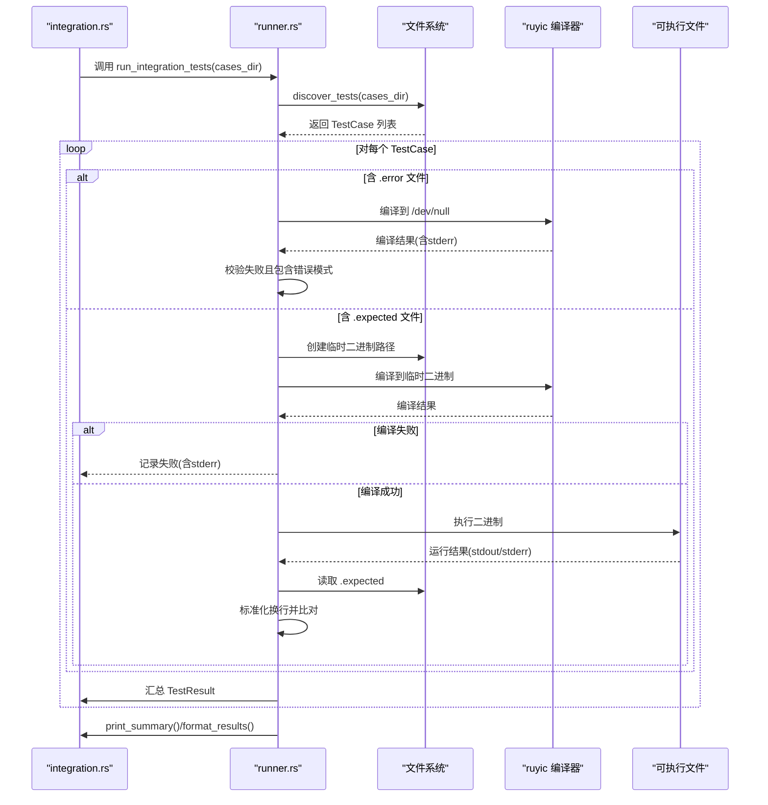
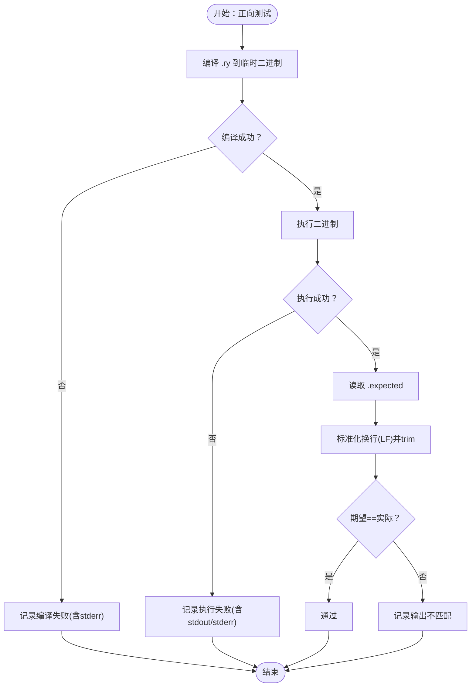
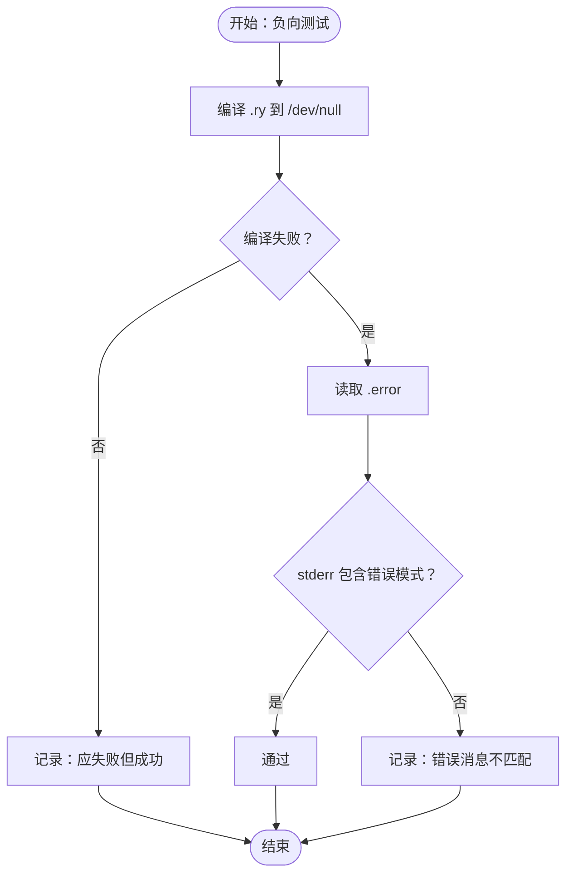
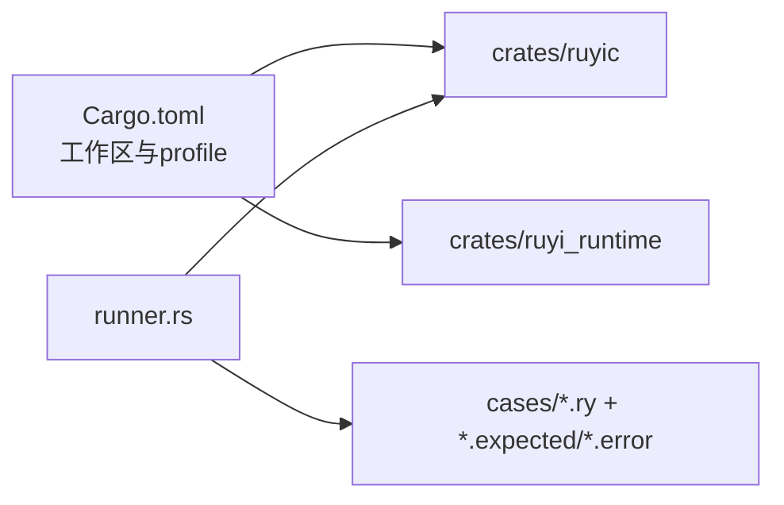

# 集成测试

<cite>
**本文引用的文件**
- [crates/ruyic/tests/integration/runner.rs](file://crates/ruyic/tests/integration/runner.rs)
- [crates/ruyic/tests/integration.rs](file://crates/ruyic/tests/integration.rs)
- [crates/ruyic/tests/integration/cases/basic/hello_world.ry](file://crates/ruyic/tests/integration/cases/basic/hello_world.ry)
- [crates/ruyic/tests/integration/cases/basic/hello_world.expected](file://crates/ruyic/tests/integration/cases/basic/hello_world.expected)
- [crates/ruyic/tests/integration/cases/async/async_basic.ry](file://crates/ruyic/tests/integration/cases/async/async_basic.ry)
- [crates/ruyic/tests/integration/cases/async/await.ry](file://crates/ruyic/tests/integration/cases/async/await.ry)
- [crates/ruyic/tests/integration/cases/control_flow/if_else.ry](file://crates/ruyic/tests/integration/cases/control_flow/if_else.ry)
- [crates/ruyic/tests/integration/cases/functions/function_decl.ry](file://crates/ruyic/tests/integration/cases/functions/function_decl.ry)
- [crates/ruyic/tests/integration/cases/errors/custom_errors.ry](file://crates/ruyic/tests/integration/cases/errors/custom_errors.ry)
- [crates/ruyic/tests/integration/cases/stdlib/array.ry](file://crates/ruyic/tests/integration/cases/stdlib/array.ry)
- [crates/ruyic/tests/integration/cases/types/generics.ry](file://crates/ruyic/tests/integration/cases/types/generics.ry)
- [crates/ruyic/tests/integration/cases/codegen/arithmetic.ry](file://crates/ruyic/tests/integration/cases/codegen/arithmetic.ry)
- [crates/ruyic/tests/integration/cases/codegen/object_literal.ry](file://crates/ruyic/tests/integration/cases/codegen/object_literal.ry)
- [crates/ruyic/tests/integration/cases/codegen/string_concat.ry](file://crates/ruyic/tests/integration/cases/codegen/string_concat.ry)
- [Cargo.toml](file://Cargo.toml)
</cite>

## 目录
1. [引言](#引言)
2. [项目结构](#项目结构)
3. [核心组件](#核心组件)
4. [架构总览](#架构总览)
5. [详细组件分析](#详细组件分析)
6. [依赖关系分析](#依赖关系分析)
7. [性能考量](#性能考量)
8. [故障排查指南](#故障排查指南)
9. [结论](#结论)
10. [附录](#附录)

## 引言
本指南面向Ruyi编译器的集成测试体系，系统性阐述从源码到可执行二进制的端到端测试设计与实施策略。内容覆盖测试用例组织结构与分类方法、编译器前端到后端的完整测试流程、期望输出与实际输出的对比验证机制、各类语言特性（基础语法、控制流、函数、异步编程、错误处理、类型系统、标准库、代码生成）的集成测试案例，以及测试数据准备与管理的最佳实践。同时，文档解释测试运行器的工作原理、环境变量与自定义配置方法，并提供常见问题的排查建议。

## 项目结构
Ruyi的集成测试位于编译器crate内部的tests/integration目录下，采用“按功能域分层”的组织方式：顶层为cases目录，按领域划分子目录（如basic、async、control_flow、functions、errors、stdlib、types、codegen），每个子目录内放置若干.ray源文件与其配套的期望输出或错误模式文件。运行器通过扫描cases目录发现测试用例，自动匹配同名的.expected或.error文件，驱动编译与执行，并进行结果比对。

图表来源
- [crates/ruyic/tests/integration/runner.rs:31-90](file://crates/ruyic/tests/integration/runner.rs#L31-L90)
- [crates/ruyic/tests/integration.rs:6-23](file://crates/ruyic/tests/integration.rs#L6-L23)

章节来源
- [crates/ruyic/tests/integration/runner.rs:31-90](file://crates/ruyic/tests/integration/runner.rs#L31-L90)
- [crates/ruyic/tests/integration.rs:6-23](file://crates/ruyic/tests/integration.rs#L6-L23)

## 核心组件
- 测试用例模型
  - TestCase：封装测试ID、源文件路径、期望输出文件路径、错误模式文件路径、分类标签。
- 运行结果模型
  - TestResult：记录测试ID、是否通过、消息、标准输出、标准错误。
- 发现与运行
  - discover_tests：递归扫描cases目录，按层级构建测试集合；依据扩展名匹配.ray与.expected/.error。
  - run_positive_test：编译.ray为本地可执行，执行并比对标准输出；标准化换行后逐字比较。
  - run_negative_test：编译.ray至/dev/null，断言失败且stderr包含指定错误模式。
  - run_integration_tests：统一调度正向/负向测试，打印进度与摘要。
  - print_summary/format_results：输出统计与格式化结果。
  - get_ruyic_path：解析KLANG_BIN、CARGO_BIN_EXE_ruyic或默认target/debug/release路径。
- 测试入口
  - integration.rs：定位cases根目录，调用runner执行并根据失败数量退出。

章节来源
- [crates/ruyic/tests/integration/runner.rs:9-29](file://crates/ruyic/tests/integration/runner.rs#L9-L29)
- [crates/ruyic/tests/integration/runner.rs:92-173](file://crates/ruyic/tests/integration/runner.rs#L92-L173)
- [crates/ruyic/tests/integration/runner.rs:175-230](file://crates/ruyic/tests/integration/runner.rs#L175-L230)
- [crates/ruyic/tests/integration/runner.rs:268-316](file://crates/ruyic/tests/integration/runner.rs#L268-L316)
- [crates/ruyic/tests/integration/runner.rs:318-354](file://crates/ruyic/tests/integration/runner.rs#L318-L354)
- [crates/ruyic/tests/integration/runner.rs:247-266](file://crates/ruyic/tests/integration/runner.rs#L247-L266)
- [crates/ruyic/tests/integration.rs:6-23](file://crates/ruyic/tests/integration.rs#L6-L23)

## 架构总览
下图展示从测试入口到具体用例执行的端到端流程，包括发现、编译、执行与比对阶段。

图表来源
- [crates/ruyic/tests/integration.rs:6-23](file://crates/ruyic/tests/integration.rs#L6-L23)
- [crates/ruyic/tests/integration/runner.rs:31-90](file://crates/ruyic/tests/integration/runner.rs#L31-L90)
- [crates/ruyic/tests/integration/runner.rs:92-173](file://crates/ruyic/tests/integration/runner.rs#L92-L173)
- [crates/ruyic/tests/integration/runner.rs:175-230](file://crates/ruyic/tests/integration/runner.rs#L175-L230)
- [crates/ruyic/tests/integration/runner.rs:232-245](file://crates/ruyic/tests/integration/runner.rs#L232-L245)

## 详细组件分析

### 测试用例组织与分类
- 分类规则
  - 顶层按功能域划分：basic、async、control_flow、functions、errors、stdlib、types、codegen。
  - 每个.ray文件对应一个测试用例；若存在同名.expected或.error文件，则作为断言依据。
- 命名与匹配
  - 以.ray为源文件扩展名；.expected用于正向测试；.error用于负向测试。
  - 自动去除CRLF换行差异，统一为LF后进行字符串比对。
- 示例
  - basic/hello_world.ry + hello_world.expected
  - async/await.ry + async/await.expected（若存在）
  - errors/custom_errors.ry + errors/custom_errors.error

章节来源
- [crates/ruyic/tests/integration/runner.rs:31-90](file://crates/ruyic/tests/integration/runner.rs#L31-L90)
- [crates/ruyic/tests/integration/cases/basic/hello_world.ry:1-1](file://crates/ruyic/tests/integration/cases/basic/hello_world.ry#L1-L1)
- [crates/ruyic/tests/integration/cases/basic/hello_world.expected:1-1](file://crates/ruyic/tests/integration/cases/basic/hello_world.expected#L1-L1)

### 正向测试流程（期望输出比对）
- 步骤
  - 编译.ray到临时二进制。
  - 执行二进制，捕获stdout/stderr。
  - 读取同名.expected文件，标准化换行后逐字比较。
  - 若一致则通过，否则输出差异详情。
- 关键点
  - 统一换行符处理，避免平台差异导致误判。
  - 失败时保留实际输出与期望输出，便于人工核验。

图表来源
- [crates/ruyic/tests/integration/runner.rs:92-173](file://crates/ruyic/tests/integration/runner.rs#L92-L173)

章节来源
- [crates/ruyic/tests/integration/runner.rs:92-173](file://crates/ruyic/tests/integration/runner.rs#L92-L173)

### 负向测试流程（错误消息匹配）
- 步骤
  - 编译.ray到/dev/null，断言编译失败。
  - 读取同名.error文件，断言stderr包含该模式。
- 关键点
  - 使用包含匹配而非全等，允许额外上下文信息。
  - 失败时输出期望模式与实际stderr，便于定位。

图表来源
- [crates/ruyic/tests/integration/runner.rs:175-230](file://crates/ruyic/tests/integration/runner.rs#L175-L230)

章节来源
- [crates/ruyic/tests/integration/runner.rs:175-230](file://crates/ruyic/tests/integration/runner.rs#L175-L230)

### 测试运行器工作原理与配置
- 发现与排序
  - 递归遍历cases目录，按ID排序，保证可重复性。
- 编译与执行
  - 通过命令行调用编译器，产出本地可执行文件。
  - 执行二进制并收集stdout/stderr。
- 结果汇总
  - 统计总数、通过数、失败数；失败列表与原因摘要。
- 可配置项
  - KLANG_BIN：指定编译器可执行文件路径。
  - CARGO_BIN_EXE_ruyic：Cargo注入的二进制路径（用于集成测试）。
  - 默认回退：target/debug/ruyic 或 target/release/ruyic。
- 入口程序
  - integration.rs：定位cases根目录，打印环境信息，执行测试并根据失败数退出。

章节来源
- [crates/ruyic/tests/integration/runner.rs:31-90](file://crates/ruyic/tests/integration/runner.rs#L31-L90)
- [crates/ruyic/tests/integration/runner.rs:247-266](file://crates/ruyic/tests/integration/runner.rs#L247-L266)
- [crates/ruyic/tests/integration.rs:6-23](file://crates/ruyic/tests/integration.rs#L6-L23)

### 语言特性集成测试案例

#### 基础语法与控制流
- 基础语法：basic/hello_world.ry 展示基本打印语义，配合hello_world.expected进行输出比对。
- 控制流：control_flow/if_else.ry 展示多分支判断逻辑，验证条件表达式与分支行为。

章节来源
- [crates/ruyic/tests/integration/cases/basic/hello_world.ry:1-1](file://crates/ruyic/tests/integration/cases/basic/hello_world.ry#L1-L1)
- [crates/ruyic/tests/integration/cases/basic/hello_world.expected:1-1](file://crates/ruyic/tests/integration/cases/basic/hello_world.expected#L1-L1)
- [crates/ruyic/tests/integration/cases/control_flow/if_else.ry:1-27](file://crates/ruyic/tests/integration/cases/control_flow/if_else.ry#L1-L27)

#### 函数与闭包
- 函数声明与调用：functions/function_decl.ry 定义多个函数并进行调用，验证返回值与副作用输出。

章节来源
- [crates/ruyic/tests/integration/cases/functions/function_decl.ry:1-15](file://crates/ruyic/tests/integration/cases/functions/function_decl.ry#L1-L15)

#### 异步编程
- 异步函数与任务：async/async_basic.ry 定义异步函数并调用，验证事件循环与返回值传播。
- await表达式：async/await.ry 展示await在多处使用与组合计算，验证并发与顺序一致性。

章节来源
- [crates/ruyic/tests/integration/cases/async/async_basic.ry:1-10](file://crates/ruyic/tests/integration/cases/async/async_basic.ry#L1-L10)
- [crates/ruyic/tests/integration/cases/async/await.ry:1-12](file://crates/ruyic/tests/integration/cases/async/await.ry#L1-L12)

#### 错误处理
- 自定义异常与捕获：errors/custom_errors.ry 定义带字段的异常类型，使用try/catch捕获并输出提示信息，验证异常传播与处理分支。

章节来源
- [crates/ruyic/tests/integration/cases/errors/custom_errors.ry:1-29](file://crates/ruyic/tests/integration/cases/errors/custom_errors.ry#L1-L29)

#### 类型系统
- 泛型：types/generics.ry 定义泛型函数与多类型参数，验证类型推断与多态行为。

章节来源
- [crates/ruyic/tests/integration/cases/types/generics.ry:1-15](file://crates/ruyic/tests/integration/cases/types/generics.ry#L1-L15)

#### 标准库
- 数组操作：stdlib/array.ry 展示数组增删改查、长度与索引访问、循环累加等常用操作。

章节来源
- [crates/ruyic/tests/integration/cases/stdlib/array.ry:1-22](file://crates/ruyic/tests/integration/cases/stdlib/array.ry#L1-L22)

#### 代码生成
- 算术运算：codegen/arithmetic.ry 验证整数四则运算的代码生成与执行。
- 对象字面量：codegen/object_literal.ry 验证结构体字面量、嵌套字段访问、可变更新与空对象。
- 字符串拼接：codegen/string_concat.ry 验证字符串与数字的隐式转换与拼接。

章节来源
- [crates/ruyic/tests/integration/cases/codegen/arithmetic.ry:1-6](file://crates/ruyic/tests/integration/cases/codegen/arithmetic.ry#L1-L6)
- [crates/ruyic/tests/integration/cases/codegen/object_literal.ry:1-14](file://crates/ruyic/tests/integration/cases/codegen/object_literal.ry#L1-L14)
- [crates/ruyic/tests/integration/cases/codegen/string_concat.ry:1-6](file://crates/ruyic/tests/integration/cases/codegen/string_concat.ry#L1-L6)

## 依赖关系分析
- 工作区与构建配置
  - 工作区包含两个crate：ruyic（编译器）、ruyi_runtime（运行时）。
  - 构建配置提供开发与发布两种profile，影响编译器的优化级别与链接设置。
- 测试运行器对外部工具的依赖
  - 通过命令行直接调用编译器可执行文件，因此需要确保其可执行权限与可用性。
  - 依赖操作系统提供的进程执行能力（标准输入/输出/错误管道）。

图表来源
- [Cargo.toml:1-40](file://Cargo.toml#L1-L40)
- [crates/ruyic/tests/integration/runner.rs:232-245](file://crates/ruyic/tests/integration/runner.rs#L232-L245)

章节来源
- [Cargo.toml:1-40](file://Cargo.toml#L1-L40)

## 性能考量
- 编译时间
  - 集成测试通常在开发环境下运行，建议优先使用默认profile以获得更快迭代速度。
  - 如需更接近发布的性能特征，可在专用CI环境中切换至release profile。
- 执行效率
  - 单个测试用例为独立进程，避免相互干扰；但大量用例会带来进程开销。
  - 建议在本地仅运行相关子集，在CI中全量执行。
- 输出比对
  - 标准化换行与trim操作成本极低，对整体性能影响可忽略。
- 并发与隔离
  - 当前实现为顺序执行；如需加速，可考虑在不破坏状态隔离的前提下引入轻量并发。

## 故障排查指南
- 编译器不可用
  - 现象：提示找不到编译器或无法执行。
  - 排查：检查KLANG_BIN、CARGO_BIN_EXE_ruyic环境变量；确认默认路径target/debug/ruyic或target/release/ruyic是否存在。
  - 参考
    - [crates/ruyic/tests/integration/runner.rs:247-266](file://crates/ruyic/tests/integration/runner.rs#L247-L266)
- 编译失败
  - 现象：编译阶段即失败。
  - 排查：查看stderr中的诊断信息；确认.ray语法与类型系统约束。
  - 参考
    - [crates/ruyic/tests/integration/runner.rs:105-114](file://crates/ruyic/tests/integration/runner.rs#L105-L114)
- 执行失败
  - 现象：二进制可执行但运行时异常或非零退出。
  - 排查：检查stdout/stderr；核对预期输出与实际输出差异。
  - 参考
    - [crates/ruyic/tests/integration/runner.rs:120-133](file://crates/ruyic/tests/integration/runner.rs#L120-L133)
- 输出不匹配
  - 现象：标准输出与期望不符。
  - 排查：确认换行符标准化；检查是否包含多余空白或平台特定字符；核对逻辑正确性。
  - 参考
    - [crates/ruyic/tests/integration/runner.rs:150-172](file://crates/ruyic/tests/integration/runner.rs#L150-L172)
- 错误消息不匹配
  - 现象：负向测试未捕获到期望的错误模式。
  - 排查：检查.error文件内容；确认编译器输出是否包含该模式（支持子串匹配）。
  - 参考
    - [crates/ruyic/tests/integration/runner.rs:210-229](file://crates/ruyic/tests/integration/runner.rs#L210-L229)

## 结论
Ruyi的集成测试体系以简洁可靠的发现-编译-执行-比对流程为核心，通过分类化的用例组织与灵活的正/负向断言机制，覆盖了从基础语法到高级语言特性的广泛场景。借助清晰的环境变量配置与稳定的输出规范化策略，测试具备良好的可维护性与跨平台兼容性。建议在日常开发中聚焦相关子集用例，在CI中全量执行以保障质量。

## 附录

### 测试数据准备与管理最佳实践
- 命名规范
  - .ry为源文件；.expected为正向期望；.error为负向模式。
- 文件布局
  - 将相似主题的用例放在同一子目录，便于维护与回归。
- 期望文件编写
  - 保持最小必要输出，避免无关细节；注意换行与空白。
- 错误模式选择
  - 使用稳定、明确的关键片段作为错误模式，避免过于宽泛或易变动的信息。
- 版本与变更
  - 当语言特性或编译器行为变更时，同步更新相应用例与期望/错误文件。

### 自定义配置方法
- 设置编译器路径
  - 通过KLANG_BIN指向自定义构建产物。
  - 或通过CARGO_BIN_EXE_ruyic传递Cargo注入的二进制路径。
  - 默认回退到target/debug/ruyic或target/release/ruyic。
- 运行范围控制
  - 在integration.rs中调整cases目录路径或过滤逻辑，仅运行特定子集。
- 结果输出
  - 使用format_results导出机器可读结果，便于CI集成。

章节来源
- [crates/ruyic/tests/integration/runner.rs:247-266](file://crates/ruyic/tests/integration/runner.rs#L247-L266)
- [crates/ruyic/tests/integration.rs:6-23](file://crates/ruyic/tests/integration.rs#L6-L23)