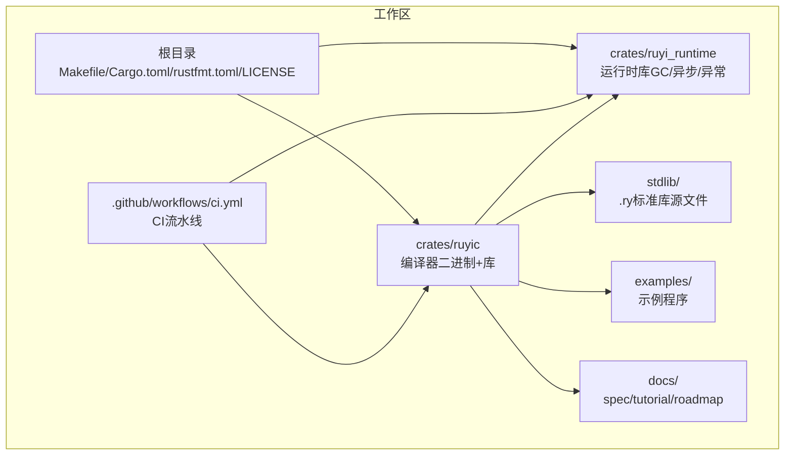
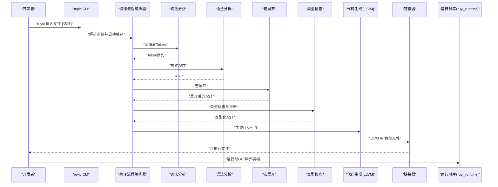
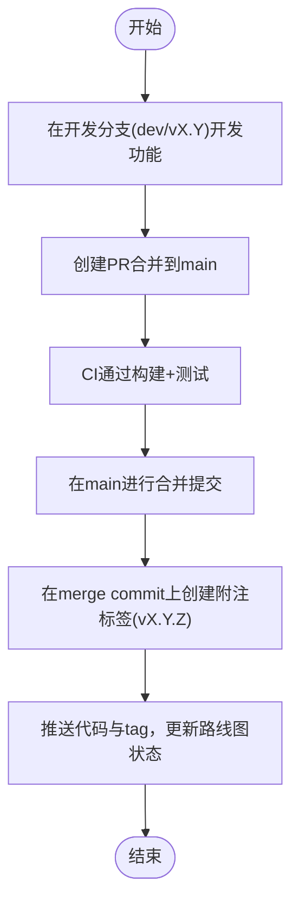
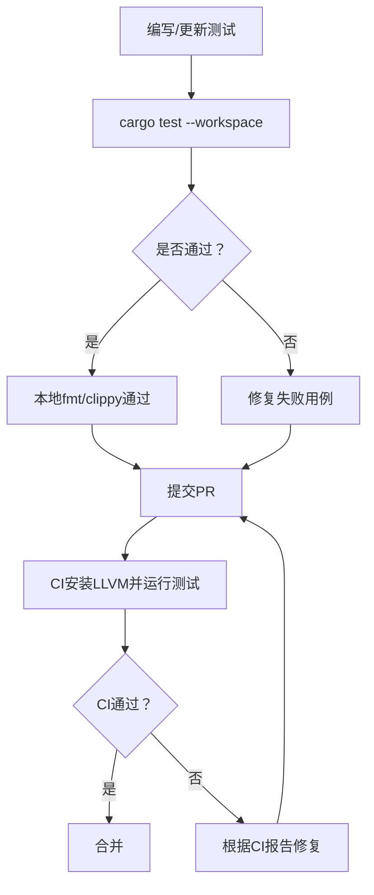
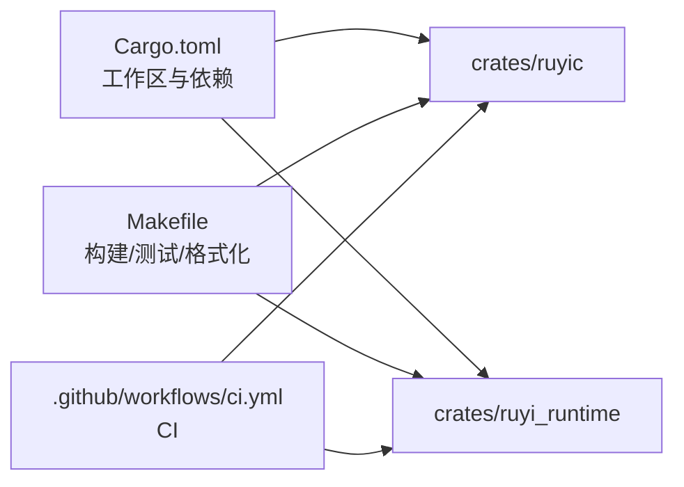

# 社区与贡献

<cite>
**本文引用的文件**   
- [README.md](file://README.md)
- [README-zh.md](file://README-zh.md)
- [AGENTS.md](file://AGENTS.md)
- [.github/workflows/ci.yml](file://.github/workflows/ci.yml)
- [Makefile](file://Makefile)
- [Cargo.toml](file://Cargo.toml)
- [rustfmt.toml](file://rustfmt.toml)
- [docs/spec.md](file://docs/spec.md)
- [docs/tutorial.md](file://docs/tutorial.md)
- [docs/roadmap.md](file://docs/roadmap.md)
- [crates/ruyic/tests/integration/runner.rs](file://crates/ruyic/tests/integration/runner.rs)
- [crates/ruyi_runtime/tests/runtime.rs](file://crates/ruyi_runtime/tests/runtime.rs)
- [LICENSE](file://LICENSE)
</cite>

## 目录
1. 引言
2. 项目结构
3. 核心组件
4. 架构总览
5. 详细组件分析
6. 依赖关系分析
7. 性能考量
8. 故障排查指南
9. 结论
10. 附录

## 引言
本指南面向Ruyi社区成员与贡献者，系统性介绍项目的治理与决策流程、贡献代码的规范与PR审查流程、代码风格与质量标准、问题与功能请求的提交方式、文档贡献的标准、社区沟通渠道与规范、新贡献者的入门路径、测试与质量保证流程，以及行为准则与开源许可的法律要点。内容以仓库现有文件为依据，确保可操作与一致性。

## 项目结构
Ruyi是一个基于Rust与LLVM的编译型语言工程，采用Cargo Workspace组织多crate，并配套标准库、示例与文档。核心目录与职责如下：
- crates/ruyic：编译器二进制与库，包含词法、语法、类型检查、宏展开、代码生成、诊断与运行时支持等模块；提供集成测试与基准测试。
- crates/ruyi_runtime：运行时库（GC、异步、异常），并与编译器联动。
- stdlib：标准库源文件（.ry），提供基础能力。
- examples：示例程序，用于演示与验证。
- docs：语言规范、教程与路线图等文档。
- .github/workflows：CI流水线定义。
- 根目录：构建脚本（Makefile）、工作区配置（Cargo.toml）、格式化配置（rustfmt.toml）、许可证（LICENSE）等。

图表来源
- [Cargo.toml:1-40](file://Cargo.toml#L1-L40)
- [Makefile:1-122](file://Makefile#L1-L122)
- [.github/workflows/ci.yml:1-45](file://.github/workflows/ci.yml#L1-L45)

章节来源
- [Cargo.toml:1-40](file://Cargo.toml#L1-L40)
- [README.md:75-99](file://README.md#L75-L99)
- [README-zh.md:75-99](file://README-zh.md#L75-L99)

## 核心组件
- 编译器（ruyic）：负责从源码到机器码的完整流水线，包含词法/语法/类型检查/宏展开/代码生成/诊断等模块，并提供CLI驱动与编译流程编排。
- 运行时（ruyi_runtime）：提供GC、异步调度、异常落地等运行时能力，并与编译器生成的代码对接。
- 标准库（stdlib）：以Ruyi源码形式提供的标准库模块，供用户程序导入使用。
- 示例（examples）：涵盖基础语法、控制流、函数、类与特征、异步、错误处理、泛型、类型系统等主题。
- 文档（docs）：权威语言规范、用户教程与开发路线图，指导语言使用与演进方向。
- CI（.github/workflows/ci.yml）：自动化构建与测试流水线，保障主干与开发分支的质量。

章节来源
- [AGENTS.md:35-40](file://AGENTS.md#L35-L40)
- [README.md:75-99](file://README.md#L75-L99)
- [README-zh.md:75-99](file://README-zh.md#L75-L99)

## 架构总览
下图展示从源码到可执行文件的端到端流程，以及与运行时的衔接：

图表来源
- [AGENTS.md:35-40](file://AGENTS.md#L35-L40)
- [crates/ruyic/tests/integration/runner.rs:1-200](file://crates/ruyic/tests/integration/runner.rs#L1-L200)

## 详细组件分析

### 贡献与治理流程
- 分支策略：主分支仅接受合并提交，每个合并对应一次已发布版本；开发分支按版本命名并永久保留，新功能在开发分支完成后再合并至主分支发布。
- 提交信息：遵循约定式提交，常见类型包括feat、fix、docs、refactor、test、chore等。
- 版本发布：在开发分支完成开发与测试后，创建PR至主分支，CI通过后在主分支的合并提交上创建附注标签并推送，随后更新路线图中标记为“已发布”。

图表来源
- [AGENTS.md:153-175](file://AGENTS.md#L153-L175)

章节来源
- [AGENTS.md:153-175](file://AGENTS.md#L153-L175)

### 代码贡献与PR审查流程
- 准备阶段：本地运行检查与测试，确保通过编译、类型检查、单元测试与集成测试；格式化与静态检查无警告。
- 提交与PR：遵循约定式提交信息；PR描述清晰说明变更动机、范围与验证结果。
- 审查与合并：至少一名维护者审查；CI全量通过；无新增警告；必要时补充测试与文档。

章节来源
- [AGENTS.md:86-98](file://AGENTS.md#L86-L98)
- [AGENTS.md:176-200](file://AGENTS.md#L176-L200)

### 代码风格与质量标准
- 格式化：rustfmt，缩进4空格，行长100，Unix换行。
- 静态检查：clippy启用警告即报错，零警告原则；如确需临时保留，需在代码中添加明确注释说明原因。
- 文档注释：公共项使用Javadoc风格注释，包含作者与日期等元信息。
- 错误处理：使用派生错误（thiserror）与应用级错误（anyhow）。
- 修改原则：完整性（覆盖边界与错误处理）与合理性（符合规范与最佳实践）。

章节来源
- [rustfmt.toml:1-5](file://rustfmt.toml#L1-L5)
- [AGENTS.md:86-98](file://AGENTS.md#L86-L98)

### 问题报告与功能请求
- 问题报告：在仓库Issue中提交，包含复现步骤、期望行为、实际行为、环境信息（Rust版本、LLVM版本、操作系统）。
- 功能请求：在Issue中描述需求背景、使用场景、建议方案与优先级；维护者评估后纳入路线图或讨论。

章节来源
- [docs/roadmap.md:1-200](file://docs/roadmap.md#L1-L200)

### 文档贡献
- 语言规范与教程：在docs目录下更新spec与tutorial；确保与实现对齐。
- 路线图：根据版本发布状态更新roadmap中的版本标记与任务状态。
- 多语言：中文与英文文档同步更新。

章节来源
- [docs/spec.md:1-200](file://docs/spec.md#L1-L200)
- [docs/tutorial.md:1-200](file://docs/tutorial.md#L1-L200)
- [docs/roadmap.md:1-200](file://docs/roadmap.md#L1-L200)

### 社区交流与沟通规范
- 计划执行邮件通知：每次计划开始与结束需向指定邮箱发送通知邮件，包含计划名称、任务概览、时间与验证结果；使用幂等键避免重复发送。
- 邮件发送方式：使用Resend API，从环境变量读取API Key，发件人使用已验证域名地址。

章节来源
- [AGENTS.md:216-259](file://AGENTS.md#L216-L259)

### 新贡献者入门
- 环境准备：安装Rust与LLVM 14；macOS需设置LLVM前缀；Linux通过包管理器安装。
- 构建与运行：使用Makefile提供的构建、检查、测试、格式化与示例编译命令；或使用Cargo命令。
- 快速上手：参考README中的快速开始与Hello World示例，逐步尝试示例程序与编译器标志。

章节来源
- [README.md:26-56](file://README.md#L26-L56)
- [README-zh.md:26-56](file://README-zh.md#L26-L56)
- [Makefile:18-122](file://Makefile#L18-L122)

### 测试要求与质量保证
- 测试组织：单元测试与集成测试分别位于各crate内；集成测试使用runner发现与执行.RY文件用例，对比标准输出与期望输出。
- 运行时测试：针对GC、异常落地表与运行时上下文类型进行测试。
- CI质量门禁：CI安装LLVM 14，执行构建与测试；代码生成相关集成测试在非PR条件下运行。

图表来源
- [crates/ruyic/tests/integration/runner.rs:1-200](file://crates/ruyic/tests/integration/runner.rs#L1-L200)
- [crates/ruyi_runtime/tests/runtime.rs:1-133](file://crates/ruyi_runtime/tests/runtime.rs#L1-L133)
- [.github/workflows/ci.yml:12-45](file://.github/workflows/ci.yml#L12-L45)

章节来源
- [crates/ruyic/tests/integration/runner.rs:1-200](file://crates/ruyic/tests/integration/runner.rs#L1-L200)
- [crates/ruyi_runtime/tests/runtime.rs:1-133](file://crates/ruyi_runtime/tests/runtime.rs#L1-L133)
- [.github/workflows/ci.yml:12-45](file://.github/workflows/ci.yml#L12-L45)

### 行为准则与社区价值观
- 尊重与包容：维护开放、尊重、包容的社区氛围。
- 以事实为准：讨论基于证据与测试结果，避免主观臆断。
- 进步导向：鼓励建设性反馈与持续改进。
- 透明协作：决策与进展保持公开，遵循既定流程。

（本节为概念性说明，不直接分析具体文件）

### 开源许可与法律考虑
- 许可证：项目采用Apache License 2.0或MIT License（二者择一），允许商用与再分发，但需保留版权与许可证声明。
- 贡献许可：提交贡献即表示同意以选定许可证发布；贡献需确保无第三方权利瑕疵。

章节来源
- [LICENSE:1-202](file://LICENSE#L1-L202)
- [README.md:202-210](file://README.md#L202-L210)
- [README-zh.md:200-206](file://README-zh.md#L200-L206)

## 依赖关系分析
- 工作区与依赖：工作区统一版本与Rust版本，依赖inkwell（LLVM绑定）、clap（CLI解析）、thiserror/anyhow（错误处理）、log/env_logger（日志）、criterion（基准）等。
- 构建与测试：Makefile提供便捷目标；CI在Ubuntu上安装LLVM 14并执行构建与测试。

图表来源
- [Cargo.toml:1-40](file://Cargo.toml#L1-L40)
- [Makefile:1-122](file://Makefile#L1-L122)
- [.github/workflows/ci.yml:1-45](file://.github/workflows/ci.yml#L1-L45)

章节来源
- [Cargo.toml:1-40](file://Cargo.toml#L1-L40)
- [Makefile:1-122](file://Makefile#L1-L122)
- [.github/workflows/ci.yml:1-45](file://.github/workflows/ci.yml#L1-L45)

## 性能考量
- 优化等级：发布构建启用LTO与较少的代码生成单元，提升运行时性能。
- 基准测试：使用criterion进行性能回归检测，建议在关键路径变更前后运行基准。
- 代码生成：LLVM IR生成与优化层级直接影响最终二进制性能，建议结合编译器标志与基准结果进行权衡。

章节来源
- [Cargo.toml:37-40](file://Cargo.toml#L37-L40)
- [Makefile:55-66](file://Makefile#L55-L66)

## 故障排查指南
- 构建失败（LLVM相关）：确认LLVM 14已正确安装并设置前缀；macOS需设置LLVM_SYS_140_PREFIX；Linux通过包管理器安装相应开发包。
- 本地验证：在无LLVM环境下可使用运行时检查目标跳过inkwell依赖进行验证。
- 集成测试失败：检查用例输出与期望输出差异；核对编译与运行阶段的错误信息；必要时在CI环境中复现。
- 格式与静态检查：确保通过fmt与clippy；若出现警告，按零警告原则修复或在代码中添加明确注释说明。

章节来源
- [AGENTS.md:201-214](file://AGENTS.md#L201-L214)
- [crates/ruyic/tests/integration/runner.rs:92-173](file://crates/ruyic/tests/integration/runner.rs#L92-L173)
- [Makefile:55-66](file://Makefile#L55-L66)

## 结论
本指南基于仓库现有文件，建立了从环境准备、贡献流程、代码规范、测试与质量保证到社区治理与法律合规的完整路径。建议贡献者在提交前通读本指南并对照既有流程与工具，确保贡献高质量、可维护且可复现的变更。

## 附录
- 快速命令参考（来自README与Makefile）：
  - 构建：cargo build --release 或 make build-release
  - 检查：cargo check --workspace 或 make check
  - 测试：cargo test --workspace 或 make test
  - 格式化：cargo fmt 或 make fmt
  - 静态检查：cargo clippy --workspace 或 make lint
  - 运行示例：make run-example EXAMPLE=hello
  - 编译到LLVM IR：make compile-example EXAMPLE=hello

章节来源
- [README.md:101-119](file://README.md#L101-L119)
- [Makefile:18-122](file://Makefile#L18-L122)