# 代码生成器

<cite>
**本文档引用的文件**
- [mod.rs](file://crates/ruyic/src/codegen/mod.rs)
- [monomorph.rs](file://crates/ruyic/src/codegen/monomorph.rs)
- [types.rs](file://crates/ruyic/src/codegen/types.rs)
- [decl.rs](file://crates/ruyic/src/codegen/decl.rs)
- [generator.rs](file://crates/ruyic/src/codegen/generator.rs)
- [builtins.rs](file://crates/ruyic/src/codegen/builtins.rs)
- [expr.rs](file://crates/ruyic/src/codegen/expr.rs)
- [stmt.rs](file://crates/ruyic/src/codegen/stmt.rs)
- [patterns.rs](file://crates/ruyic/src/codegen/patterns.rs)
- [async_codegen.rs](file://crates/ruyic/src/codegen/async_codegen.rs)
- [traits.rs](file://crates/ruyic/src/codegen/traits.rs)
- [driver.rs](file://crates/ruyic/src/driver.rs)
- [main.rs](file://crates/ruyic/src/main.rs)
- [lib.rs](file://crates/ruyic/src/lib.rs)
</cite>

## 目录
1. [引言](#引言)
2. [项目结构](#项目结构)
3. [核心组件](#核心组件)
4. [架构总览](#架构总览)
5. [详细组件分析](#详细组件分析)
6. [依赖关系分析](#依赖关系分析)
7. [性能考虑](#性能考虑)
8. [故障排查指南](#故障排查指南)
9. [结论](#结论)
10. [附录](#附录)

## 引言
本文件面向Ruyi代码生成器，系统性阐述从AST到LLVM IR再到机器码的完整编译流程，重点覆盖以下主题：
- LLVM IR代码生成的架构与实现细节
- 中间表示的构建与优化策略
- 单态化（Monomorphization）机制：泛型实例化与代码膨胀控制
- 内置函数的实现与调用约定、运行时库集成
- 类型到LLVM类型的映射与数据布局优化
- 从AST到LLVM IR再到机器码的全流程
- 调试工具与性能分析方法
- 复杂语言特性（模式匹配、异步状态机、trait对象）的代码生成示例与优化技巧

## 项目结构
Ruyi代码生成器位于crates/ruyic/src/codegen目录下，采用模块化设计，按功能划分：
- 模块入口与导出：mod.rs
- 核心生成器：generator.rs
- 类型映射：types.rs
- 声明与函数生成：decl.rs
- 表达式生成：expr.rs
- 语句生成：stmt.rs
- 模式匹配：patterns.rs
- 异步支持：async_codegen.rs
- 单态化：monomorph.rs
- trait/vtable：traits.rs
- 内置函数声明与调用：builtins.rs

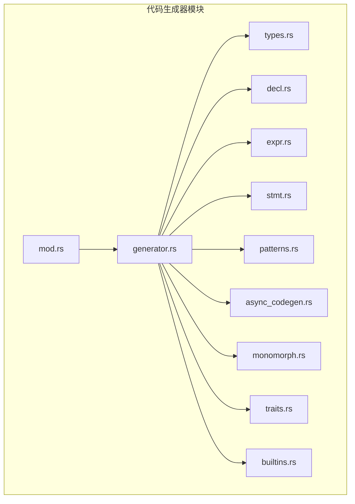

**图表来源**
- [mod.rs:1-15](file://crates/ruyic/src/codegen/mod.rs#L1-L15)
- [generator.rs:1-800](file://crates/ruyic/src/codegen/generator.rs#L1-L800)
- [types.rs:1-238](file://crates/ruyic/src/codegen/types.rs#L1-L238)
- [decl.rs:1-580](file://crates/ruyic/src/codegen/decl.rs#L1-L580)
- [expr.rs:1-800](file://crates/ruyic/src/codegen/expr.rs#L1-L800)
- [stmt.rs:1-800](file://crates/ruyic/src/codegen/stmt.rs#L1-L800)
- [patterns.rs:1-800](file://crates/ruyic/src/codegen/patterns.rs#L1-L800)
- [async_codegen.rs:1-562](file://crates/ruyic/src/codegen/async_codegen.rs#L1-L562)
- [monomorph.rs:1-218](file://crates/ruyic/src/codegen/monomorph.rs#L1-L218)
- [traits.rs:1-294](file://crates/ruyic/src/codegen/traits.rs#L1-L294)
- [builtins.rs:1-855](file://crates/ruyic/src/codegen/builtins.rs#L1-L855)

**章节来源**
- [mod.rs:1-15](file://crates/ruyic/src/codegen/mod.rs#L1-L15)

## 核心组件
- 代码生成器（CodeGenerator）：负责整体编译流程的编排，包括内置函数声明、泛型单态化函数生成、主函数入口、类与方法预声明、语句/表达式遍历等。
- 代码生成上下文（CodegenContext）：持有LLVM上下文、模块、Builder、变量表、当前函数、循环/异常/异步状态栈、GC根管理等。
- 类型映射（types.rs）：将Ruyi类型映射为LLVM类型，并提供函数签名构造器。
- 声明生成（decl.rs）：处理函数、类、实现、trait等声明的生成与预声明。
- 表达式生成（expr.rs）：处理字面量、二元/一元运算、调用、赋值、条件、箭头函数、数组/对象字面量、成员访问、模板字面量、Await等。
- 语句生成（stmt.rs）：处理if/while/for/for...of/for...in/try/catch/finally/return/break/continue/匹配等。
- 模式匹配（patterns.rs）：整数/布尔/字符串/可空/数组/对象等多类型模式匹配的分支与绑定。
- 异步代码生成（async_codegen.rs）：将async函数转换为状态机，生成$new/$poll包装器与await表达式。
- 单态化（monomorph.rs）：桥接类型检查器的泛型实例化跟踪与代码生成器，生成具体函数体。
- trait/vtable（traits.rs）：生成vtable、动态分发与trait对象布局。
- 内置函数（builtins.rs）：声明并生成运行时函数（GC、异常、字符串拼接、打印、异步调度等）。

**章节来源**
- [generator.rs:384-800](file://crates/ruyic/src/codegen/generator.rs#L384-L800)
- [types.rs:27-124](file://crates/ruyic/src/codegen/types.rs#L27-L124)
- [decl.rs:19-66](file://crates/ruyic/src/codegen/decl.rs#L19-L66)
- [expr.rs:301-452](file://crates/ruyic/src/codegen/expr.rs#L301-L452)
- [stmt.rs:18-101](file://crates/ruyic/src/codegen/stmt.rs#L18-L101)
- [patterns.rs:20-44](file://crates/ruyic/src/codegen/patterns.rs#L20-L44)
- [async_codegen.rs:206-562](file://crates/ruyic/src/codegen/async_codegen.rs#L206-L562)
- [monomorph.rs:50-110](file://crates/ruyic/src/codegen/monomorph.rs#L50-L110)
- [traits.rs:73-175](file://crates/ruyic/src/codegen/traits.rs#L73-L175)
- [builtins.rs:15-85](file://crates/ruyic/src/codegen/builtins.rs#L15-L85)

## 架构总览
Ruyi代码生成器遵循“驱动器-生成器-运行时”的分层架构：
- 驱动器（driver.rs）：组织词法/语法/宏展开/类型检查/代码生成/链接的完整流水线。
- 生成器（generator.rs + 各子模块）：将类型化的AST转为LLVM IR，声明内置函数，生成单态化函数，处理类/方法/trait/vtable/异步状态机。
- 运行时（ruyi_runtime）：提供GC、异常、字符串、异步调度、集合操作等运行时支持。

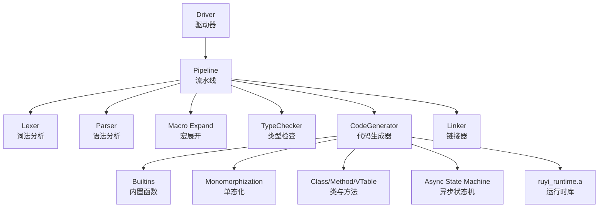

**图表来源**
- [driver.rs:242-737](file://crates/ruyic/src/driver.rs#L242-L737)
- [generator.rs:405-799](file://crates/ruyic/src/codegen/generator.rs#L405-L799)
- [builtins.rs:15-85](file://crates/ruyic/src/codegen/builtins.rs#L15-L85)
- [monomorph.rs:50-110](file://crates/ruyic/src/codegen/monomorph.rs#L50-L110)
- [async_codegen.rs:206-562](file://crates/ruyic/src/codegen/async_codegen.rs#L206-L562)

## 详细组件分析

### 代码生成器（CodeGenerator）
- 职责：创建LLVM上下文/模块/Builder；声明内置函数；根据类型检查器提供的泛型实例化信息生成单态化函数；预声明类结构与方法；编译所有声明与语句；生成main入口；输出LLVM IR或目标二进制。
- 关键流程：
  - 初始化：创建Context/Module/Builder，声明内置函数。
  - 泛型单态化：从MonomorphizationTracker收集实例化，逐个生成具体函数体。
  - 主函数入口：生成main或_ruyi_async_main，处理参数与返回值。
  - 类与方法：预声明类结构与方法签名，再逐一生成方法体。
  - 语句/表达式：遍历程序项，编译声明与语句。
  - 输出：打印IR或编译为对象/二进制。

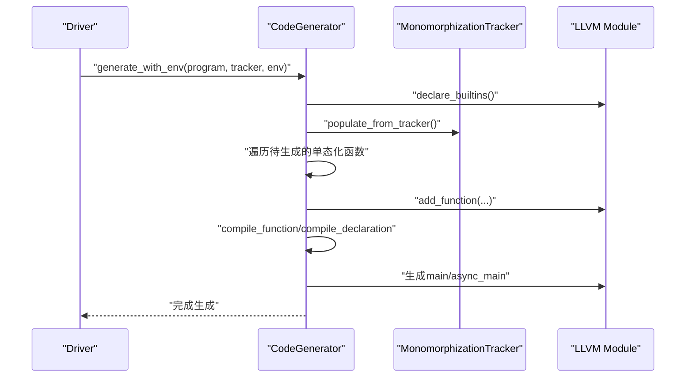

**图表来源**
- [generator.rs:405-799](file://crates/ruyic/src/codegen/generator.rs#L405-L799)
- [monomorph.rs:103-110](file://crates/ruyic/src/codegen/monomorph.rs#L103-L110)

**章节来源**
- [generator.rs:384-800](file://crates/ruyic/src/codegen/generator.rs#L384-L800)

### 类型到LLVM映射与数据布局（types.rs）
- 映射规则：整数/浮点/布尔/字符串/空/动态/函数/数组/对象/元组/泛型/类型变量等映射到i64/i64/i1/f64/*i8/*i8/{i64,i8*}等LLVM类型。
- 函数签名：基于参数与返回类型构造FunctionType。
- 数据布局：
  - 对象：[类型标签: i64, 字段数量: i64, 字段存储: i8*]
  - 数组：[长度: i64, 容量: i64, 元素存储: i8*]
  - 动态对象：[类型ID: i64, 数据指针: i8*]

```mermaid
classDiagram
class RuyiType {
+Int
+Float
+Bool
+String
+Null
+Void
+Dynamic
+Function(...)
+Array(...)
+Object(...)
+Tuple(...)
+Generic(...)
+Named(...)
+TypeVar(...)
}
class LLVMType {
+i64
+f64
+i1
+*i8
+{i64,i8*}
+StructType
+FunctionType
}
RuyiType --> LLVMType : "ruyi_type_to_llvm()"
```

**图表来源**
- [types.rs:27-124](file://crates/ruyic/src/codegen/types.rs#L27-L124)

**章节来源**
- [types.rs:27-197](file://crates/ruyic/src/codegen/types.rs#L27-L197)

### 声明与函数生成（decl.rs）
- 支持：变量/常量绑定、普通函数、异步函数、类、实现、trait。
- 预声明：先为类结构与方法声明函数原型，以支持前向引用。
- 参数与返回类型推断：从注解或表达式推断。
- GC根：对GC托管类型进行根登记与移除。

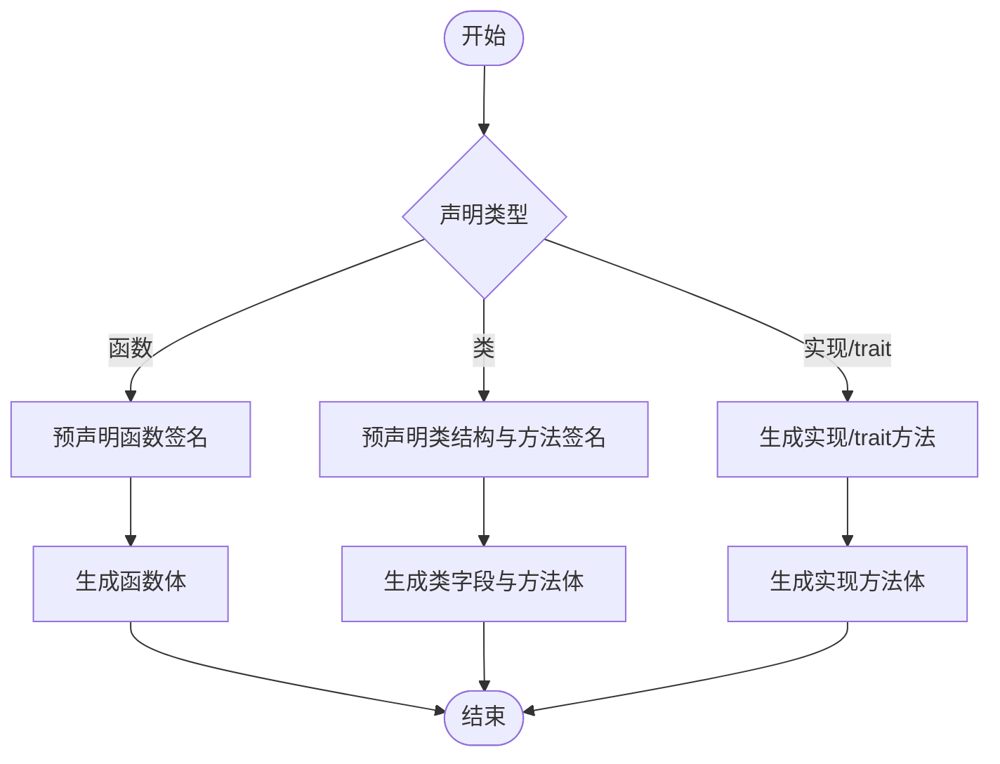

**图表来源**
- [decl.rs:19-66](file://crates/ruyic/src/codegen/decl.rs#L19-L66)
- [decl.rs:115-141](file://crates/ruyic/src/codegen/decl.rs#L115-L141)
- [decl.rs:311-501](file://crates/ruyic/src/codegen/decl.rs#L311-L501)

**章节来源**
- [decl.rs:19-292](file://crates/ruyic/src/codegen/decl.rs#L19-L292)

### 表达式与语句生成（expr.rs / stmt.rs）
- 表达式：字面量、二元/一元、调用、赋值、条件、箭头函数、数组/对象字面量、成员访问、模板字面量、Await等。
- 语句：if/while/for/for...of/for...in/try/catch/finally/return/break/continue/match等。
- 异常：抛出异常时写入异常指针并跳转至catch/finally/merge块。
- GC：在作用域结束时移除GC根。

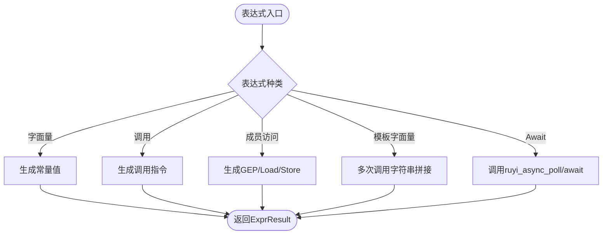

**图表来源**
- [expr.rs:301-452](file://crates/ruyic/src/codegen/expr.rs#L301-L452)
- [expr.rs:492-557](file://crates/ruyic/src/codegen/expr.rs#L492-L557)
- [stmt.rs:633-714](file://crates/ruyic/src/codegen/stmt.rs#L633-L714)

**章节来源**
- [expr.rs:301-800](file://crates/ruyic/src/codegen/expr.rs#L301-L800)
- [stmt.rs:18-714](file://crates/ruyic/src/codegen/stmt.rs#L18-L714)

### 模式匹配（patterns.rs）
- 支持：整数（switch/顺序比较）、布尔（条件分支）、字符串（strcmp链）、可空（指针/整数sentinel）、数组（长度匹配）、对象（字段提取）。
- 绑定：将匹配到的值存入局部变量，供后续arm使用。

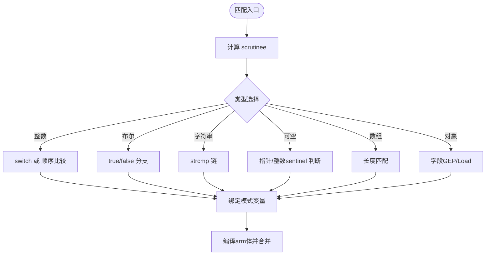

**图表来源**
- [patterns.rs:20-44](file://crates/ruyic/src/codegen/patterns.rs#L20-L44)
- [patterns.rs:319-526](file://crates/ruyic/src/codegen/patterns.rs#L319-L526)
- [patterns.rs:528-757](file://crates/ruyic/src/codegen/patterns.rs#L528-L757)

**章节来源**
- [patterns.rs:20-800](file://crates/ruyic/src/codegen/patterns.rs#L20-L800)

### 异步代码生成（async_codegen.rs）
- 将async函数编译为三部分：
  - {name}$new：分配并初始化状态结构（包含poll函数指针、状态字段、参数槽位、结果槽位）。
  - {name}$poll：状态机入口，按状态切换执行，支持waker与结果回填。
  - {name}：薄包装器，调用$new返回future指针。
- await表达式：在同步上下文中调用阻塞等待，在poll中调用ruyi_async_poll并从状态结构加载结果。

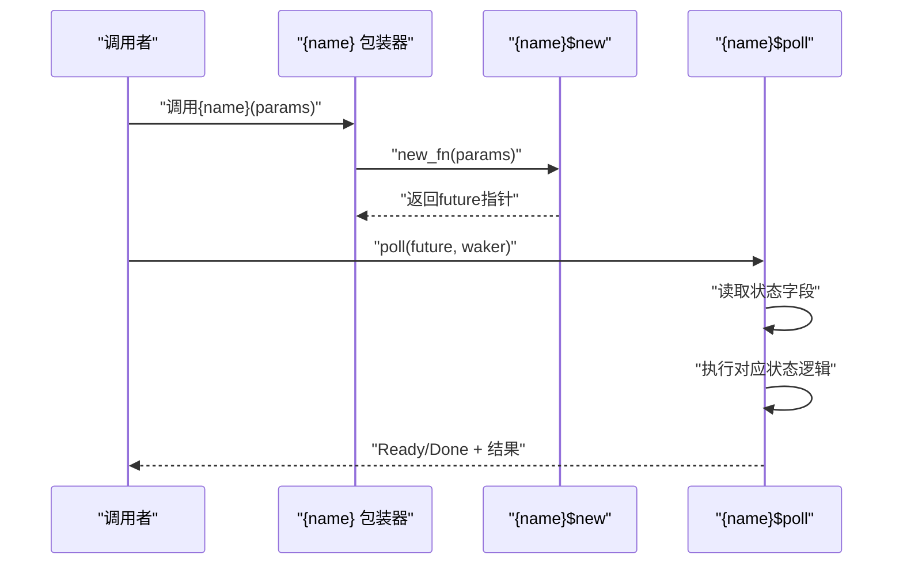

**图表来源**
- [async_codegen.rs:206-504](file://crates/ruyic/src/codegen/async_codegen.rs#L206-L504)
- [async_codegen.rs:506-561](file://crates/ruyic/src/codegen/async_codegen.rs#L506-L561)

**章节来源**
- [async_codegen.rs:206-562](file://crates/ruyic/src/codegen/async_codegen.rs#L206-L562)

### 单态化（monomorph.rs）
- 作用：为每个泛型函数的具体类型实参生成独立的LLVM函数，避免运行时分派与虚函数开销。
- 流程：从MonomorphizationTracker收集Specialization，转换为MonomorphizedFunction，注册到MonomorphizationContext，逐个生成函数体并标记已生成。

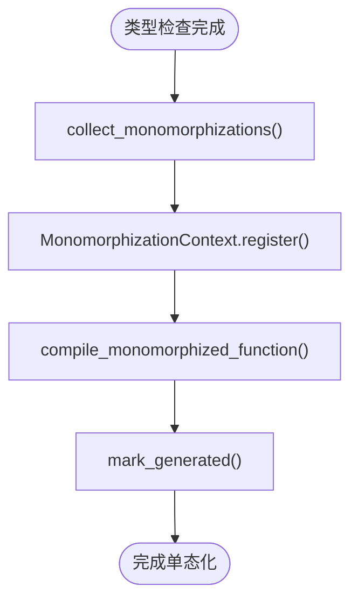

**图表来源**
- [monomorph.rs:50-110](file://crates/ruyic/src/codegen/monomorph.rs#L50-L110)
- [monomorph.rs:112-218](file://crates/ruyic/src/codegen/monomorph.rs#L112-L218)

**章节来源**
- [monomorph.rs:50-110](file://crates/ruyic/src/codegen/monomorph.rs#L50-L110)

### trait与vtable（traits.rs）
- vtable：为每个(trait, concrete type)对生成vtable全局，记录方法指针索引。
- trait对象：胖指针(data + vtable)，通过vtable进行动态分发。
- 生成时机：在所有实现声明扫描后，生成vtable并初始化。

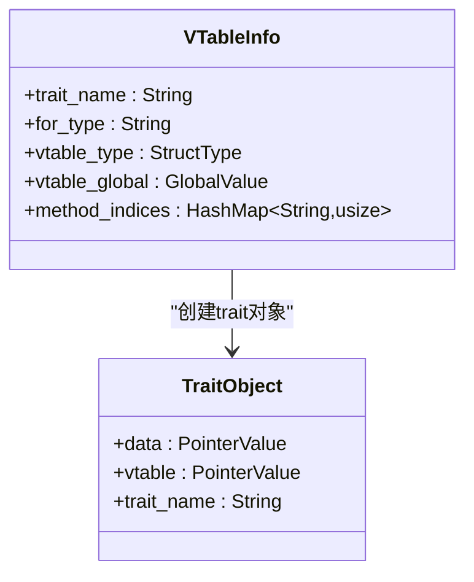

**图表来源**
- [traits.rs:20-71](file://crates/ruyic/src/codegen/traits.rs#L20-L71)
- [traits.rs:177-220](file://crates/ruyic/src/codegen/traits.rs#L177-L220)

**章节来源**
- [traits.rs:73-294](file://crates/ruyic/src/codegen/traits.rs#L73-L294)

### 内置函数与运行时集成（builtins.rs）
- 声明：printf、GC相关（alloc/collect/add_root/remove_root/write_barrier）、异常（throw/get_pending/clear_pending）、字符串拼接、异步（poll/await/spawn/wake/run_scheduler）、对象键、迭代器、大整数、基础集合/字符串运行时等。
- 调用：在表达式/语句生成中调用相应构建函数，确保参数类型与调用约定一致。
- GC：对GC托管类型自动添加/移除根，保证垃圾回收正确性。

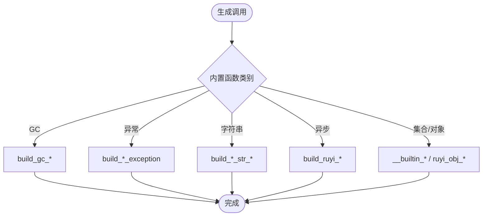

**图表来源**
- [builtins.rs:15-85](file://crates/ruyic/src/codegen/builtins.rs#L15-L85)
- [builtins.rs:180-203](file://crates/ruyic/src/codegen/builtins.rs#L180-L203)
- [builtins.rs:376-428](file://crates/ruyic/src/codegen/builtins.rs#L376-L428)

**章节来源**
- [builtins.rs:15-855](file://crates/ruyic/src/codegen/builtins.rs#L15-L855)

## 依赖关系分析
- 低耦合高内聚：各子模块职责清晰，通过generator.rs统一编排。
- 外部依赖：inkwell（LLVM绑定）、ruyi_runtime（运行时库）。
- 类型系统：types.rs与typechecker.types紧密协作，确保映射一致性。
- 泛型：monomorph.rs与typechecker.generics协同，避免运行时开销。

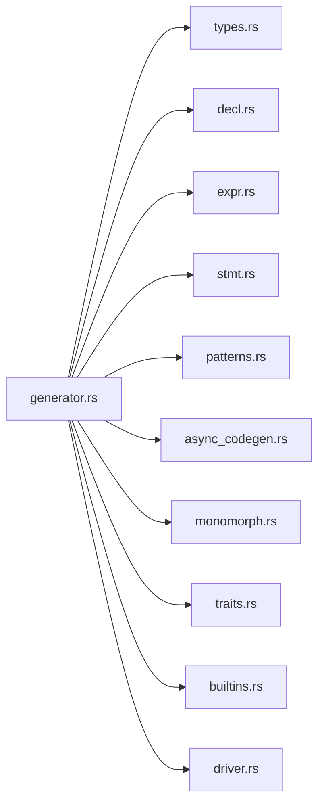

**图表来源**
- [generator.rs:384-800](file://crates/ruyic/src/codegen/generator.rs#L384-L800)
- [driver.rs:242-737](file://crates/ruyic/src/driver.rs#L242-L737)

**章节来源**
- [generator.rs:384-800](file://crates/ruyic/src/codegen/generator.rs#L384-L800)
- [driver.rs:242-737](file://crates/ruyic/src/driver.rs#L242-L737)

## 性能考虑
- 优化级别：支持O0/O1/O2，通过OptLevel映射到inkwell::OptimizationLevel。
- 单态化：消除虚函数/泛型运行时开销，提升内联与寄存器利用率。
- GC根管理：RAII作用域确保根在所有退出路径（含错误传播/panic）被正确移除，减少泄漏风险。
- 数据布局：对象/数组紧凑布局，避免冗余字段；动态对象使用胖指针降低查找成本。
- 异步状态机：将await转换为状态机，减少协程切换开销；poll函数直接返回Ready/Busy状态。

[本节为通用指导，无需特定文件分析]

## 故障排查指南
- 编译错误类型：driver.rs定义了完整的错误枚举（IO/Lexer/Parser/Macro/TypeCheck/Codegen/Linker/ModuleNotFound），便于定位问题阶段。
- 部分代码生成：允许对std库等模块进行“部分代码生成”，遇到不支持的特性时记录警告而非失败，提高可用性。
- 调试输出：支持emit AST/Typed AST/LLVM IR，便于定位问题。
- 常见问题：
  - 未声明的内置函数：确认builtins.rs是否已声明并生成。
  - 泛型未实例化：检查MonomorphizationTracker是否正确收集Specialization。
  - 异常/异步：核对try/await相关运行时函数是否链接成功。

**章节来源**
- [driver.rs:21-54](file://crates/ruyic/src/driver.rs#L21-L54)
- [generator.rs:427-431](file://crates/ruyic/src/codegen/generator.rs#L427-L431)

## 结论
Ruyi代码生成器通过模块化设计与严格的类型映射，实现了从Ruyi AST到LLVM IR的高效转换。单态化消除了泛型与trait的运行时开销；内置函数与运行时库无缝集成；异步状态机与GC根管理提升了并发与内存安全性。配合完善的调试与诊断能力，该生成器为Ruyi语言提供了稳定高效的编译基础设施。

[本节为总结性内容，无需特定文件分析]

## 附录
- 命令行接口：支持输入文件、输出路径、优化等级、目标三元组、发射选项（二进制/LLVM IR/AST/Typed AST/仅类型检查）。
- 库接口：lib.rs提供编译入口，便于在其他项目中复用解析与宏展开流程。

**章节来源**
- [main.rs:16-114](file://crates/ruyic/src/main.rs#L16-L114)
- [lib.rs:12-21](file://crates/ruyic/src/lib.rs#L12-L21)