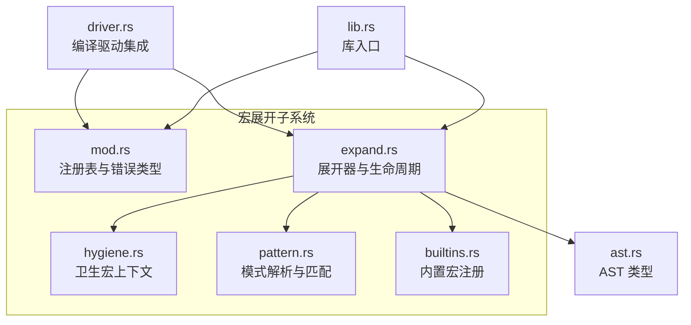
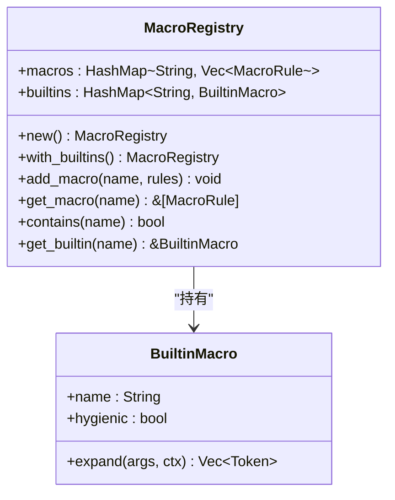
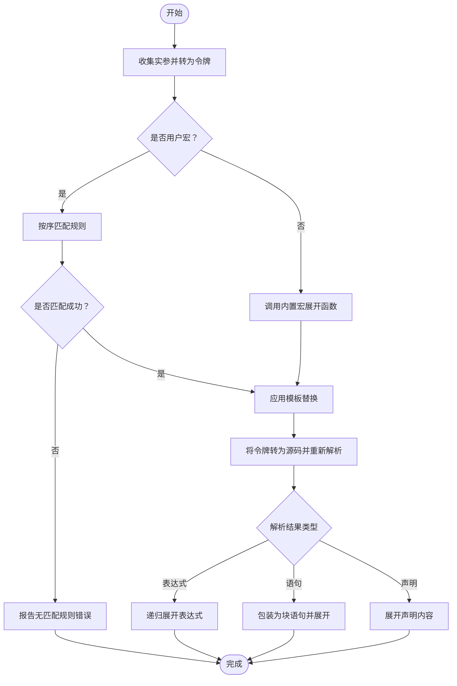
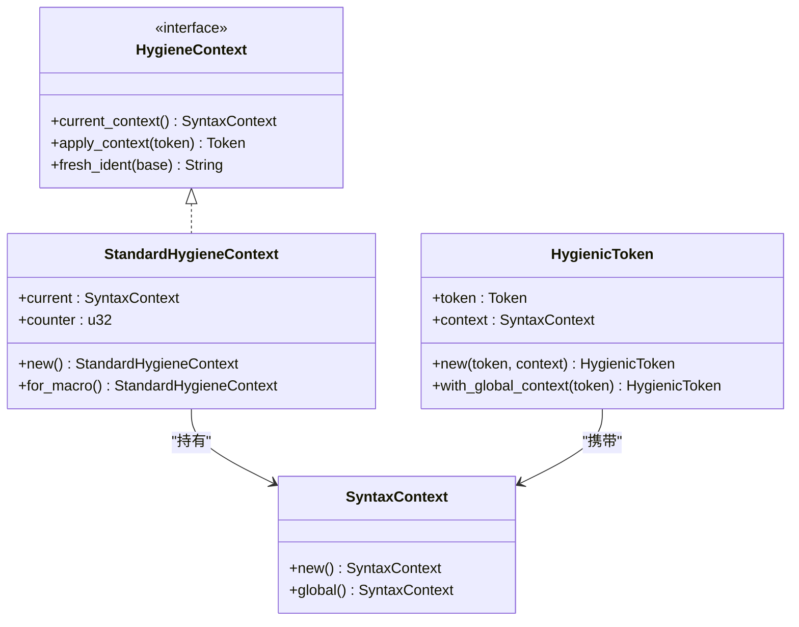
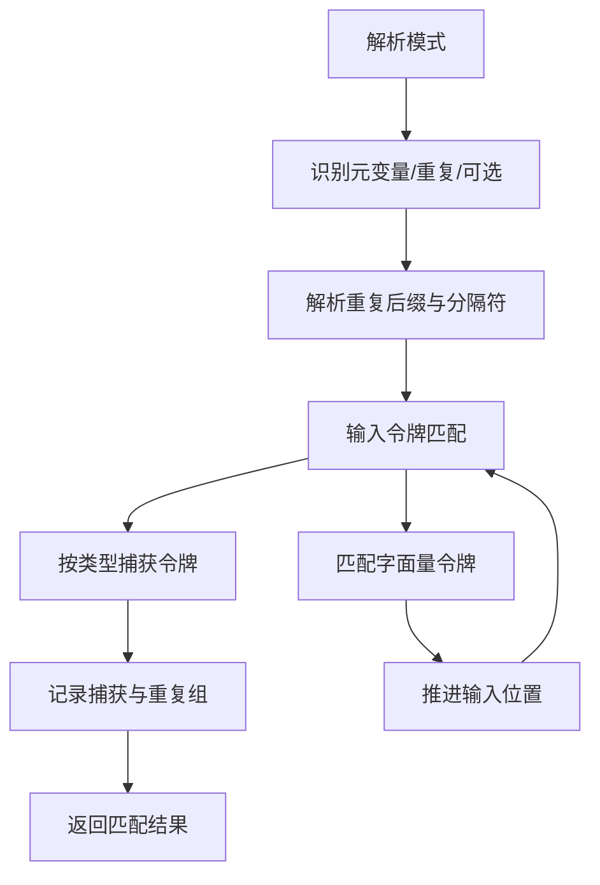
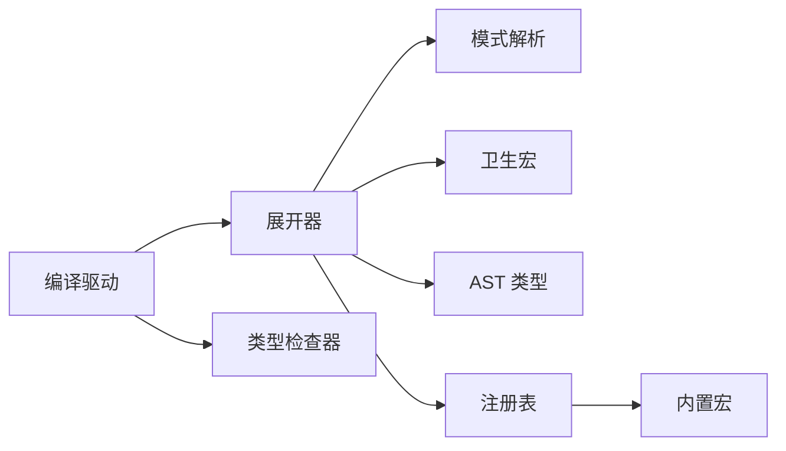

# 宏展开器

<cite>
**本文引用的文件**
- [mod.rs](file://crates/ruyic/src/macro_expand/mod.rs)
- [expand.rs](file://crates/ruyic/src/macro_expand/expand.rs)
- [hygiene.rs](file://crates/ruyic/src/macro_expand/hygiene.rs)
- [pattern.rs](file://crates/ruyic/src/macro_expand/pattern.rs)
- [builtins.rs](file://crates/ruyic/src/macro_expand/builtins.rs)
- [driver.rs](file://crates/ruyic/src/driver.rs)
- [lib.rs](file://crates/ruyic/src/lib.rs)
- [ast.rs](file://crates/ruyic/src/parser/ast.rs)
- [macro_expand.rs](file://crates/ruyic/tests/macro_expand.rs)
- [spec.md](file://docs/spec.md)
</cite>

## 目录
1. [简介](#简介)
2. [项目结构](#项目结构)
3. [核心组件](#核心组件)
4. [架构总览](#架构总览)
5. [组件详解](#组件详解)
6. [依赖关系分析](#依赖关系分析)
7. [性能考量](#性能考量)
8. [故障排查指南](#故障排查指南)
9. [结论](#结论)
10. [附录](#附录)

## 简介
本文件为 Ruyi 宏展开器的全面技术文档，聚焦于声明式宏与内置宏的实现、宏展开生命周期、卫生宏（Hygiene）系统、模式匹配机制、内置宏扩展机制、调试技巧与最佳实践。文档基于仓库中的源码与规范文档进行梳理，力求在不直接粘贴源码的前提下，通过路径引用与图示帮助读者建立对系统架构与实现细节的清晰认知。

## 项目结构
宏展开器位于 crates/ruyic/src/macro_expand 下，包含以下模块：
- 模块入口与注册表：mod.rs
- 展开器实现：expand.rs
- 卫生宏上下文：hygiene.rs
- 模式解析与匹配：pattern.rs
- 内置宏注册与实现：builtins.rs
- 驱动集成：driver.rs
- 库入口：lib.rs
- AST 类型：ast.rs
- 测试用例：tests/macro_expand.rs
- 规范说明：docs/spec.md



**图表来源**
- [mod.rs:1-161](file://crates/ruyic/src/macro_expand/mod.rs#L1-L161)
- [expand.rs:1-662](file://crates/ruyic/src/macro_expand/expand.rs#L1-L662)
- [hygiene.rs:1-102](file://crates/ruyic/src/macro_expand/hygiene.rs#L1-L102)
- [pattern.rs:1-525](file://crates/ruyic/src/macro_expand/pattern.rs#L1-L525)
- [builtins.rs:1-85](file://crates/ruyic/src/macro_expand/builtins.rs#L1-L85)
- [driver.rs:1-744](file://crates/ruyic/src/driver.rs#L1-L744)
- [lib.rs:1-21](file://crates/ruyic/src/lib.rs#L1-L21)
- [ast.rs:1-200](file://crates/ruyic/src/parser/ast.rs#L1-L200)

**章节来源**
- [mod.rs:1-161](file://crates/ruyic/src/macro_expand/mod.rs#L1-L161)
- [expand.rs:1-662](file://crates/ruyic/src/macro_expand/expand.rs#L1-L662)
- [hygiene.rs:1-102](file://crates/ruyic/src/macro_expand/hygiene.rs#L1-L102)
- [pattern.rs:1-525](file://crates/ruyic/src/macro_expand/pattern.rs#L1-L525)
- [builtins.rs:1-85](file://crates/ruyic/src/macro_expand/builtins.rs#L1-L85)
- [driver.rs:1-744](file://crates/ruyic/src/driver.rs#L1-L744)
- [lib.rs:1-21](file://crates/ruyic/src/lib.rs#L1-L21)
- [ast.rs:1-200](file://crates/ruyic/src/parser/ast.rs#L1-L200)

## 核心组件
- 宏注册表与错误类型：定义宏规则存储、内置宏注册、错误枚举与显示格式化。
- 展开器：负责遍历 AST、识别宏调用、执行规则匹配与模板替换、重新解析生成的代码、深度限制与嵌套宏检测。
- 模式系统：解析模式语法（元变量、重复、可选、分隔符），并实现匹配算法。
- 卫生宏：为标识符引入语法上下文，防止宏引入的标识符污染调用作用域。
- 内置宏：提供常用工具宏（如 todo、unreachable、stringify、file、line、column）。
- 编译驱动集成：在完整编译流水线中插入宏展开阶段。

**章节来源**
- [mod.rs:10-161](file://crates/ruyic/src/macro_expand/mod.rs#L10-L161)
- [expand.rs:8-393](file://crates/ruyic/src/macro_expand/expand.rs#L8-L393)
- [pattern.rs:5-384](file://crates/ruyic/src/macro_expand/pattern.rs#L5-L384)
- [hygiene.rs:3-102](file://crates/ruyic/src/macro_expand/hygiene.rs#L3-L102)
- [builtins.rs:5-85](file://crates/ruyic/src/macro_expand/builtins.rs#L5-L85)
- [driver.rs:242-632](file://crates/ruyic/src/driver.rs#L242-L632)

## 架构总览
宏展开器在编译流程中的位置如下：

```mermaid
sequenceDiagram
participant SRC as "源代码"
participant DRV as "编译驱动"
participant PAR as "解析器"
participant REG as "宏注册表"
participant EXP as "展开器"
participant TYP as "类型检查器"
SRC->>DRV : 输入源文件
DRV->>PAR : 解析为 AST
PAR-->>DRV : Program
DRV->>REG : 初始化内置宏
DRV->>EXP : 调用 expand_macros
EXP->>EXP : 遍历 AST 并识别宏调用
EXP->>EXP : 规则匹配与模板替换
EXP->>EXP : 重新解析生成代码
EXP-->>DRV : 展开后的 Program
DRV->>TYP : 类型检查
TYP-->>DRV : 类型检查结果
DRV-->>SRC : 输出目标产物
```

**图表来源**
- [driver.rs:522-632](file://crates/ruyic/src/driver.rs#L522-L632)
- [lib.rs:12-20](file://crates/ruyic/src/lib.rs#L12-L20)
- [expand.rs:157-161](file://crates/ruyic/src/macro_expand/expand.rs#L157-L161)

## 组件详解

### 宏注册表与内置宏
- 注册表结构包含用户宏规则映射与内置宏映射，并提供查询接口。
- 内置宏通过注册函数集中注册，每个内置宏包含名称、是否卫生、以及对应的展开函数指针。
- 展开时优先匹配用户宏规则，否则回退到内置宏。



**图表来源**
- [mod.rs:107-146](file://crates/ruyic/src/macro_expand/mod.rs#L107-L146)
- [builtins.rs:5-59](file://crates/ruyic/src/macro_expand/builtins.rs#L5-L59)

**章节来源**
- [mod.rs:107-146](file://crates/ruyic/src/macro_expand/mod.rs#L107-L146)
- [builtins.rs:5-85](file://crates/ruyic/src/macro_expand/builtins.rs#L5-L85)

### 展开器与展开生命周期
- 展开器遍历 Program 的模块项，递归展开表达式、语句与声明。
- 宏调用识别：当遇到函数调用且其被调用者为标识符，且该标识符存在于注册表中且非“内置表达式”时，触发宏展开。
- 展开流程：
  1) 将实参转换为令牌序列；
  2) 若为用户宏：按顺序尝试规则匹配；若为内置宏：调用对应展开函数；
  3) 执行模板替换（当前仅支持 $ 变量替换）；
  4) 将结果转回源码字符串并重新解析为 AST；
  5) 对新生成的表达式或语句进行进一步展开；
  6) 支持最大展开深度限制与嵌套宏定义检测。
- 递归展开深度由常量控制，避免无限递归。



**图表来源**
- [expand.rs:304-393](file://crates/ruyic/src/macro_expand/expand.rs#L304-L393)
- [expand.rs:585-661](file://crates/ruyic/src/macro_expand/expand.rs#L585-L661)

**章节来源**
- [expand.rs:23-393](file://crates/ruyic/src/macro_expand/expand.rs#L23-L393)
- [expand.rs:395-397](file://crates/ruyic/src/macro_expand/expand.rs#L395-L397)
- [expand.rs:585-661](file://crates/ruyic/src/macro_expand/expand.rs#L585-L661)

### 卫生宏（Hygiene）
- 语法上下文：每个宏展开拥有唯一的语法上下文，标识符被标记后仅在相同或全局上下文中可见。
- 标识符处理：仅对标识符应用上下文标签，其他令牌保持不变。
- 兼容性判断：两个上下文相等或任一为全局上下文即视为兼容。
- 提供新鲜标识符生成器，用于生成不冲突的临时变量名。



**图表来源**
- [hygiene.rs:3-102](file://crates/ruyic/src/macro_expand/hygiene.rs#L3-L102)

**章节来源**
- [hygiene.rs:3-102](file://crates/ruyic/src/macro_expand/hygiene.rs#L3-L102)

### 模式匹配系统
- 模式语法要点：
  - 元变量：$name 或 $name:expr 等，指定捕获类型（表达式、语句、模式、类型、标识符、任意）。
  - 重复：$(...)*、$(...)+、$(...)?、$(...),*（逗号分隔）。
  - 可选：$(...)?。
  - 分隔符：逗号、分号。
- 匹配算法：
  - 顺序尝试规则，首个完全匹配的规则生效。
  - 递归匹配内部模式，支持分隔符与重复次数约束。
  - 捕获令牌序列与重复组，用于后续模板替换。
- 错误处理：对非法模式、缺失分隔符等情况返回错误。



**图表来源**
- [pattern.rs:386-525](file://crates/ruyic/src/macro_expand/pattern.rs#L386-L525)
- [pattern.rs:108-384](file://crates/ruyic/src/macro_expand/pattern.rs#L108-L384)

**章节来源**
- [pattern.rs:5-384](file://crates/ruyic/src/macro_expand/pattern.rs#L5-L384)
- [pattern.rs:386-525](file://crates/ruyic/src/macro_expand/pattern.rs#L386-L525)

### 内置宏与扩展机制
- 已有内置宏：todo、unreachable（卫生）、stringify（非卫生）、file、line、column。
- 扩展机制：通过注册表添加新的内置宏，提供卫生开关与自定义展开逻辑。

**章节来源**
- [builtins.rs:5-85](file://crates/ruyic/src/macro_expand/builtins.rs#L5-L85)
- [mod.rs:107-146](file://crates/ruyic/src/macro_expand/mod.rs#L107-L146)

### 编译驱动集成
- 驱动在解析后、类型检查前执行宏展开。
- 展开失败会映射为编译错误类型，便于统一诊断输出。
- 支持多种发射选项（二进制、LLVM IR、AST、类型化 AST、仅检查）。

**章节来源**
- [driver.rs:522-632](file://crates/ruyic/src/driver.rs#L522-L632)
- [lib.rs:12-20](file://crates/ruyic/src/lib.rs#L12-L20)

## 依赖关系分析
- 展开器依赖模式解析与卫生上下文，同时与 AST 类型紧密耦合。
- 注册表作为中心枢纽，连接用户宏与内置宏。
- 驱动将宏展开纳入完整编译流水线。



**图表来源**
- [expand.rs:1-21](file://crates/ruyic/src/macro_expand/expand.rs#L1-L21)
- [mod.rs:6-8](file://crates/ruyic/src/macro_expand/mod.rs#L6-L8)
- [driver.rs:13-20](file://crates/ruyic/src/driver.rs#L13-L20)

**章节来源**
- [expand.rs:1-21](file://crates/ruyic/src/macro_expand/expand.rs#L1-L21)
- [mod.rs:6-8](file://crates/ruyic/src/macro_expand/mod.rs#L6-L8)
- [driver.rs:13-20](file://crates/ruyic/src/driver.rs#L13-L20)

## 性能考量
- 展开深度限制：通过常量限制最大递归深度，避免栈溢出与无限展开。
- 模式匹配复杂度：重复与可选模式可能带来指数级搜索空间，建议合理设计规则顺序与分隔符，减少回溯。
- 令牌序列转换：参数到令牌与令牌到源码的双向转换存在开销，应尽量减少不必要的重解析。
- 建议
  - 合理组织宏规则顺序，优先放置最可能命中的规则。
  - 使用分隔符与精确的元变量类型限定，缩小匹配空间。
  - 控制宏展开层级，避免深层递归链。

**章节来源**
- [mod.rs:10](file://crates/ruyic/src/macro_expand/mod.rs#L10)
- [expand.rs:309-314](file://crates/ruyic/src/macro_expand/expand.rs#L309-L314)
- [pattern.rs:303-358](file://crates/ruyic/src/macro_expand/pattern.rs#L303-L358)

## 故障排查指南
- 常见错误类型
  - 无匹配规则：当没有规则能匹配输入时抛出。
  - 重复不匹配：重复模式的元素数量与分隔符不一致。
  - 展开深度超限：超过最大展开深度限制。
  - 无效调用：解析输入时出现语法错误。
  - 卫生违规：标识符上下文不兼容导致的冲突。
  - 嵌套宏定义：宏展开结果包含宏定义。
- 调试建议
  - 使用最小复现：将宏调用与规则简化到最少。
  - 检查规则顺序：确保最具体规则先于通用规则。
  - 校验重复与分隔符：确认 $(...),* 与逗号/分号使用正确。
  - 关注卫生上下文：避免在宏内引入与外部同名但不同作用域的标识符。
  - 利用测试用例：参考单元测试定位问题边界。

**章节来源**
- [mod.rs:13-94](file://crates/ruyic/src/macro_expand/mod.rs#L13-L94)
- [macro_expand.rs:149-251](file://crates/ruyic/tests/macro_expand.rs#L149-L251)

## 结论
Ruyi 宏展开器采用声明式宏与内置宏相结合的方式，通过令牌级模式匹配与模板替换实现灵活的代码生成。卫生宏系统保障了宏引入标识符的作用域安全，编译驱动将其无缝集成到整体流水线中。遵循本文的最佳实践与调试方法，可在保证安全性的同时获得良好的性能与可维护性。

## 附录
- 规范要点（来自文档）
  - 宏展开步骤：解析、匹配、替换、重复、发出、重新解析。
  - 卫生宏：宏引入的标识符不会污染调用作用域。
  - 模式语法：元变量、重复、可选、分隔符与类型限定。

**章节来源**
- [spec.md:3858-3920](file://docs/spec.md#L3858-L3920)