# 类型检查器

<cite>
**本文引用的文件**
- [mod.rs](file://crates/ruyic/src/typechecker/mod.rs)
- [checker.rs](file://crates/ruyic/src/typechecker/checker.rs)
- [inference.rs](file://crates/ruyic/src/typechecker/inference.rs)
- [environment.rs](file://crates/ruyic/src/typechecker/environment.rs)
- [types.rs](file://crates/ruyic/src/typechecker/types.rs)
- [constraints.rs](file://crates/ruyic/src/typechecker/constraints.rs)
- [generics.rs](file://crates/ruyic/src/typechecker/generics.rs)
- [patterns.rs](file://crates/ruyic/src/typechecker/patterns.rs)
- [traits.rs](file://crates/ruyic/src/typechecker/traits.rs)
- [diagnostics.rs](file://crates/ruyic/src/typechecker/diagnostics.rs)
- [arc.rs](file://crates/ruyic/src/typechecker/arc.rs)
- [error.rs](file://crates/ruyic/src/typechecker/error.rs)
- [type_system.ry](file://examples/type_system.ry)
- [generics_comprehensive.ry](file://examples/generics_comprehensive.ry)
</cite>

## 目录
1. [引言](#引言)
2. [项目结构](#项目结构)
3. [核心组件](#核心组件)
4. [架构总览](#架构总览)
5. [详细组件分析](#详细组件分析)
6. [依赖关系分析](#依赖关系分析)
7. [性能考虑](#性能考虑)
8. [故障排查指南](#故障排查指南)
9. [结论](#结论)
10. [附录](#附录)

## 引言
本文件为 Ruyi 渐进式类型系统的技术文档，聚焦于类型检查器的设计与实现。内容涵盖从动态到静态的类型推断流程、双向类型推断（合成/校验）、约束求解与类型统一、类型环境（TypeEnvironment）的作用域与类型窄化、泛型类型与类型参数的处理、错误诊断系统、以及性能优化与内存管理策略。文档同时提供复杂类型场景与边界情况的处理示例。

## 项目结构
Ruyi 类型检查器位于 crates/ruyic/src/typechecker 下，采用模块化设计，按职责拆分为：主入口与结果封装、双向推断引擎、类型环境、类型表示与子类型/并集、约束求解、泛型与单态化跟踪、模式匹配分析、特性（trait）系统、诊断系统、ARC 支持等。

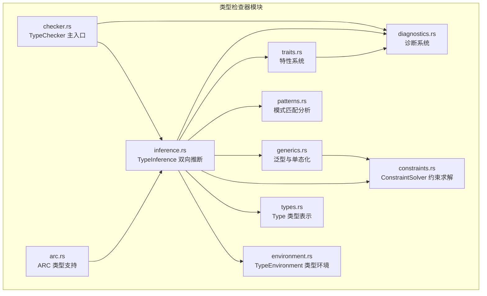

图示来源
- [checker.rs:1-100](file://crates/ruyic/src/typechecker/checker.rs#L1-L100)
- [inference.rs:1-120](file://crates/ruyic/src/typechecker/inference.rs#L1-L120)
- [environment.rs:1-80](file://crates/ruyic/src/typechecker/environment.rs#L1-L80)
- [types.rs:1-80](file://crates/ruyic/src/typechecker/types.rs#L1-L80)
- [constraints.rs:1-80](file://crates/ruyic/src/typechecker/constraints.rs#L1-L80)
- [generics.rs:1-80](file://crates/ruyic/src/typechecker/generics.rs#L1-L80)
- [patterns.rs:1-60](file://crates/ruyic/src/typechecker/patterns.rs#L1-L60)
- [traits.rs:1-60](file://crates/ruyic/src/typechecker/traits.rs#L1-L60)
- [diagnostics.rs:1-80](file://crates/ruyic/src/typechecker/diagnostics.rs#L1-L80)
- [arc.rs:1-60](file://crates/ruyic/src/typechecker/arc.rs#L1-L60)

章节来源
- [mod.rs:1-32](file://crates/ruyic/src/typechecker/mod.rs#L1-L32)

## 核心组件
- TypeChecker：类型检查主入口，负责收集诊断、组装结果，并与特性注册表协作验证实现与超特性。
- TypeInference：双向类型推断引擎，分两阶段完成函数签名预收集与全量推断；在表达式合成与语句校验之间切换。
- TypeEnvironment：作用域链式类型环境，支持变量声明、查找、可变性追踪、类型窄化与阴影遮蔽。
- Type：核心类型表示，覆盖原生类型、可空、数组、元组、对象、函数、命名/泛型、类型变量、特性、动态、Future、错误恢复等。
- ConstraintSolver：约束求解器，收集等式/子类型/特性约束，通过合一算法求解并应用替换。
- MonomorphizationTracker：泛型单态化跟踪器，记录泛型定义、收集调用点、推断类型实参、执行边界检查与替换。
- PatternAnalysis：模式匹配穷举性与冗余性分析，辅助匹配分支诊断。
- TraitRegistry：特性与实现注册表，维护方法签名、超特性、实现索引与一致性验证。
- Diagnostic/DiagnosticBag：诊断消息与严重级别，统一错误报告。
- ArcClassRegistry：ARC 注解类名扫描与识别，为 ARC 类型规则提供支撑。

章节来源
- [checker.rs:45-101](file://crates/ruyic/src/typechecker/checker.rs#L45-L101)
- [inference.rs:43-103](file://crates/ruyic/src/typechecker/inference.rs#L43-L103)
- [environment.rs:51-158](file://crates/ruyic/src/typechecker/environment.rs#L51-L158)
- [types.rs:14-60](file://crates/ruyic/src/typechecker/types.rs#L14-L60)
- [constraints.rs:28-83](file://crates/ruyic/src/typechecker/constraints.rs#L28-L83)
- [generics.rs:22-101](file://crates/ruyic/src/typechecker/generics.rs#L22-L101)
- [patterns.rs:11-59](file://crates/ruyic/src/typechecker/patterns.rs#L11-L59)
- [traits.rs:46-121](file://crates/ruyic/src/typechecker/traits.rs#L46-L121)
- [diagnostics.rs:18-98](file://crates/ruyic/src/typechecker/diagnostics.rs#L18-L98)
- [arc.rs:15-74](file://crates/ruyic/src/typechecker/arc.rs#L15-L74)

## 架构总览
类型检查器以 TypeChecker 为入口，构建 TraitRegistry 后交由 TypeInference 执行双向推断。推断过程中，TypeInference 使用 TypeEnvironment 维护作用域与变量类型，利用 ConstraintSolver 进行约束收集与合一，结合 MonomorphizationTracker 完成泛型推断与单态化。最终汇总诊断信息返回给调用方。

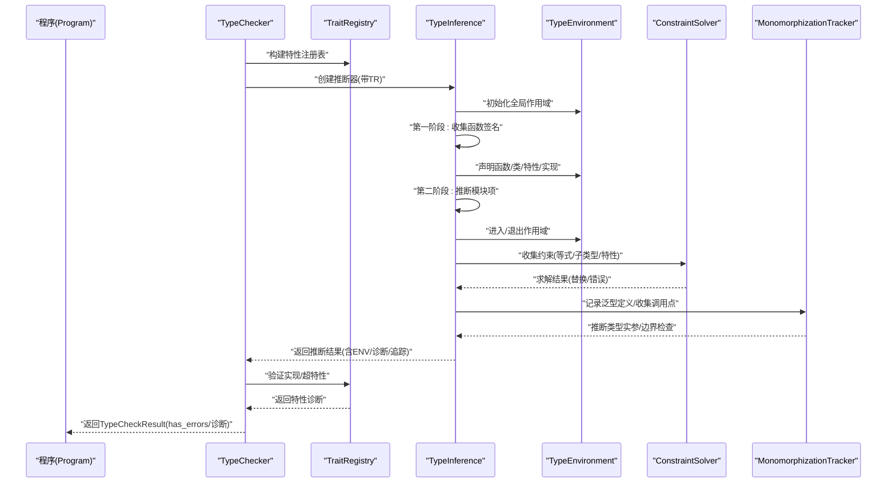

图示来源
- [checker.rs:57-83](file://crates/ruyic/src/typechecker/checker.rs#L57-L83)
- [inference.rs:105-164](file://crates/ruyic/src/typechecker/inference.rs#L105-L164)
- [constraints.rs:67-83](file://crates/ruyic/src/typechecker/constraints.rs#L67-L83)
- [generics.rs:222-264](file://crates/ruyic/src/typechecker/generics.rs#L222-L264)

## 详细组件分析

### 双向类型推断（Synthesize/Check）
- 合成模式（synthesize）：从表达式出发确定其类型，用于 let 绑定、返回值、字面量、数组/对象字面量等。
- 校验模式（check）：对表达式进行预期类型的验证，用于赋值、函数调用、控制流条件等。
- 返回类型推断：先在临时作用域中推断函数返回类型，再声明函数签名，最后进入函数体进行完整校验。
- 控制流类型窄化：基于 if/条件表达式、模式绑定、null 检查等缩小变量类型范围，确保后续使用安全。

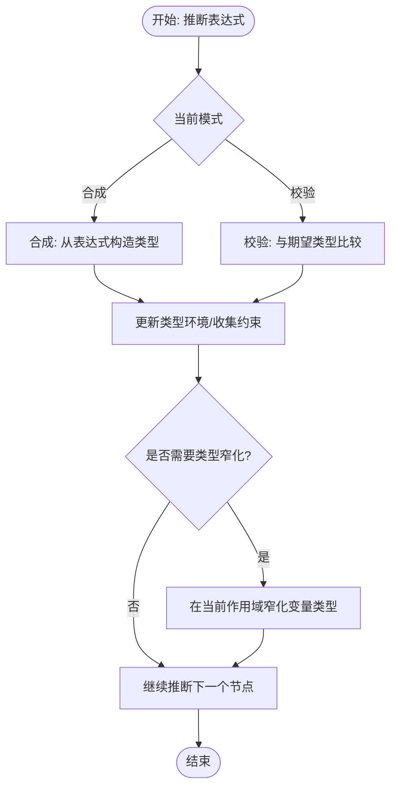

图示来源
- [inference.rs:464-726](file://crates/ruyic/src/typechecker/inference.rs#L464-L726)
- [environment.rs:115-132](file://crates/ruyic/src/typechecker/environment.rs#L115-L132)

章节来源
- [inference.rs:180-350](file://crates/ruyic/src/typechecker/inference.rs#L180-L350)
- [inference.rs:464-726](file://crates/ruyic/src/typechecker/inference.rs#L464-L726)

### 类型环境（TypeEnvironment）与作用域
- 多层作用域：push_scope/pop_scope 实现块级作用域，支持阴影遮蔽与变量查找顺序。
- 变量声明：declare_let/declare_const 区分可变与不可变，参数声明专用接口。
- 类型窄化：narrow 在当前作用域创建阴影绑定，用于 null 检查后的类型收窄。
- 更新与可变性：update 仅允许对可变变量进行重新赋值合并类型上界。

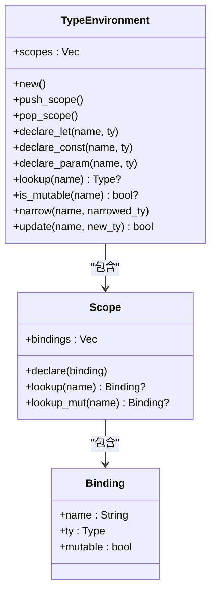

图示来源
- [environment.rs:51-158](file://crates/ruyic/src/typechecker/environment.rs#L51-L158)

章节来源
- [environment.rs:51-158](file://crates/ruyic/src/typechecker/environment.rs#L51-L158)

### 类型系统与子类型/并集
- 类型覆盖：整数、浮点、布尔、字符串、空、无值、大整数、可空、数组、元组、对象、函数、命名/泛型、类型变量、特性、动态、Future、错误恢复。
- 子类型判定：反射、int→float 泛化、T→T?、Never 是任何类型的子类型、动态与错误参与一致性判断；对象/函数/数组/元组/泛型的结构化子类型规则。
- 最小上界（lub）：同类型、错误恢复、动态吸收、int/float 联合、子类型关系、可空与元组的 lub 规则。

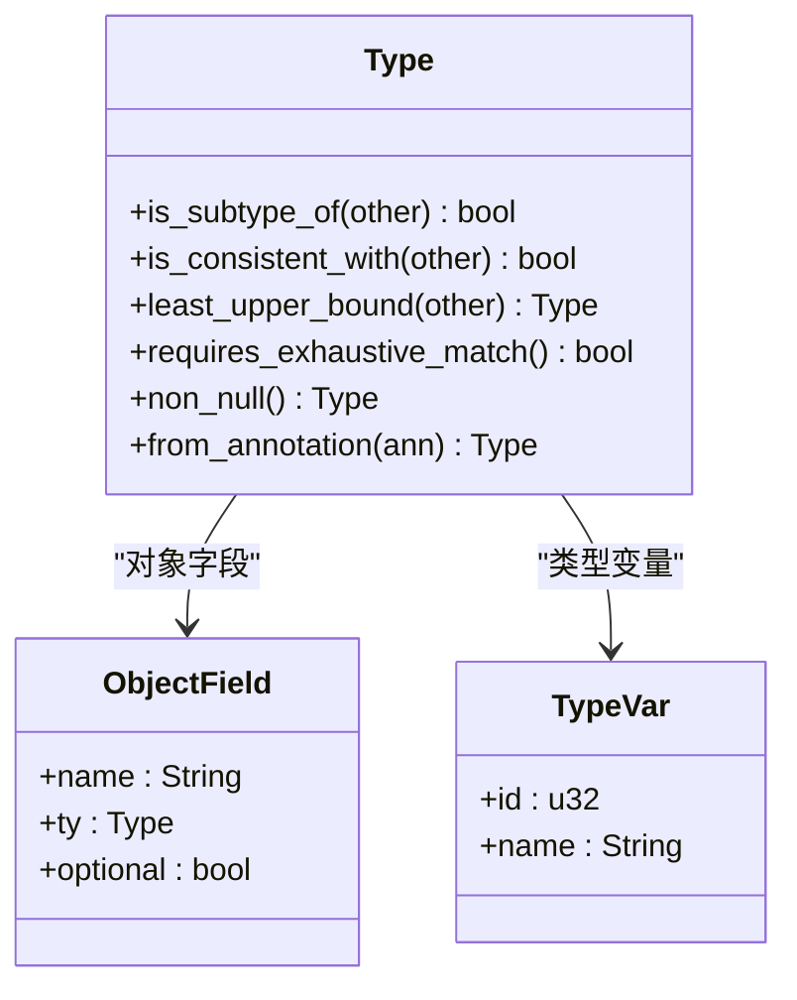

图示来源
- [types.rs:98-465](file://crates/ruyic/src/typechecker/types.rs#L98-L465)

章节来源
- [types.rs:98-465](file://crates/ruyic/src/typechecker/types.rs#L98-L465)

### 约束求解与类型统一
- 约束类型：等式、子类型、特性实现。
- 解决策略：逐条约束求解，支持动态与错误类型豁免；类型变量合一时进行出现检查防止无限类型；函数参数数量与数组 rest 参数支持。
- 替换应用：对类型树递归应用替换，避免循环展开。

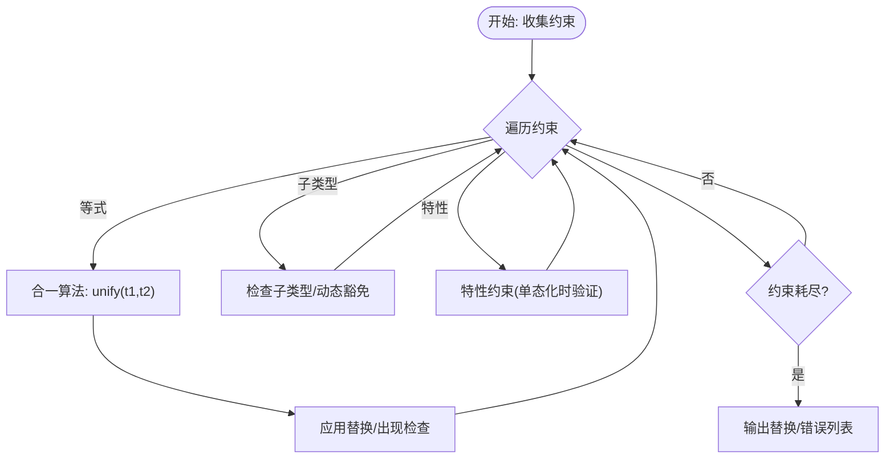

图示来源
- [constraints.rs:67-175](file://crates/ruyic/src/typechecker/constraints.rs#L67-L175)
- [constraints.rs:177-307](file://crates/ruyic/src/typechecker/constraints.rs#L177-L307)

章节来源
- [constraints.rs:28-145](file://crates/ruyic/src/typechecker/constraints.rs#L28-L145)
- [constraints.rs:153-307](file://crates/ruyic/src/typechecker/constraints.rs#L153-L307)

### 泛型类型与单态化
- 泛型定义：函数/类/trait 的类型参数与有界类型变量，记录 body_type 中的类型变量占位。
- 类型实参推断：为每个类型参数创建新鲜变量，基于实参类型建立等式约束，求解后回代；支持 rest 参数与最小/最大参数个数。
- 单态化跟踪：按调用点收集类型实参，去重生成具体版本，应用替换生成特化类型。
- 边界检查：若类型实参不满足特性边界，报错；支持动态类型跳过严格边界。

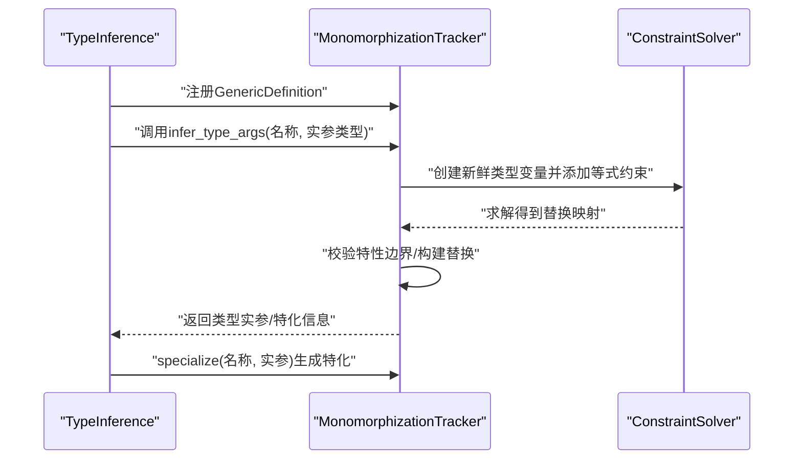

图示来源
- [generics.rs:266-370](file://crates/ruyic/src/typechecker/generics.rs#L266-L370)
- [generics.rs:436-548](file://crates/ruyic/src/typechecker/generics.rs#L436-L548)

章节来源
- [generics.rs:22-101](file://crates/ruyic/src/typechecker/generics.rs#L22-L101)
- [generics.rs:266-428](file://crates/ruyic/src/typechecker/generics.rs#L266-L428)

### 模式匹配穷举性与冗余性
- 覆盖集合：将每条模式映射为“覆盖的值/结构集合”，支持通配、字面量、或模式、别名、对象/数组模式、rest 等。
- 缺失用例：针对 bool/null/数组/对象/可空/命名类型等，计算缺失用例集合。
- 冗余分支：检测重复覆盖的分支并报告。

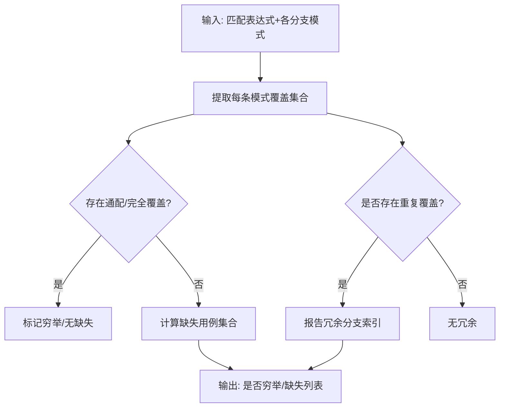

图示来源
- [patterns.rs:21-59](file://crates/ruyic/src/typechecker/patterns.rs#L21-L59)
- [patterns.rs:195-309](file://crates/ruyic/src/typechecker/patterns.rs#L195-L309)

章节来源
- [patterns.rs:11-309](file://crates/ruyic/src/typechecker/patterns.rs#L11-L309)

### 特性系统与实现验证
- 特性注册：收集 trait 声明的方法签名、超特性、标记 trait。
- 实现注册：记录 impl 的目标类型、类型参数与已实现方法。
- 验证：确保所有非默认方法均被实现；超特性存在且无环；未知特性引用。
- 边界检查：在单态化阶段通过注册表检查类型实参是否满足特性边界。

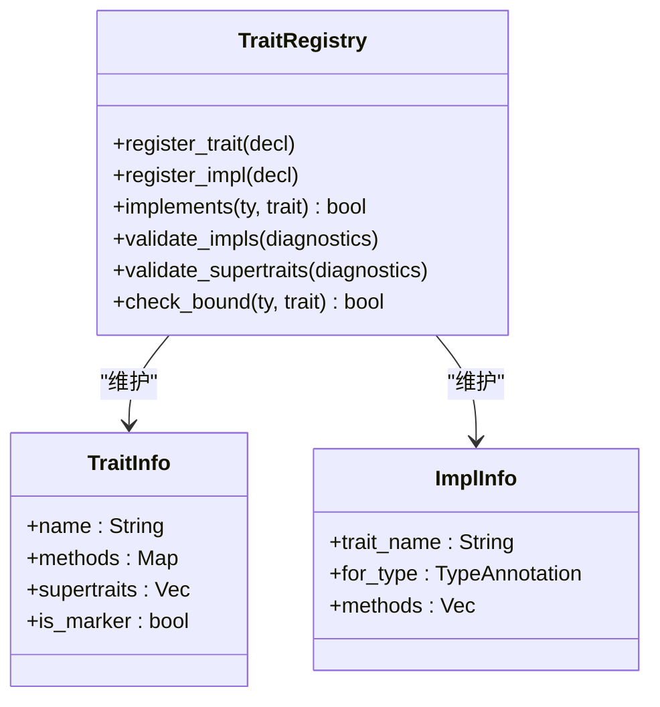

图示来源
- [traits.rs:46-319](file://crates/ruyic/src/typechecker/traits.rs#L46-L319)

章节来源
- [traits.rs:46-319](file://crates/ruyic/src/typechecker/traits.rs#L46-L319)

### 错误诊断系统
- 诊断种类：类型不匹配、未知变量、不可变赋值、可空访问、不可调用、不可索引、参数个数、缺失返回、不可达代码、运行时转换、递归类型别名、重复声明、特性未实现、泛型 arity 不匹配、模式穷举/冗余、其他通用错误。
- 严重级别：Error/Warning/Note；统一格式化输出。
- 诊断聚合：DiagnosticBag 收集并导出诊断列表，支持过滤错误/警告。

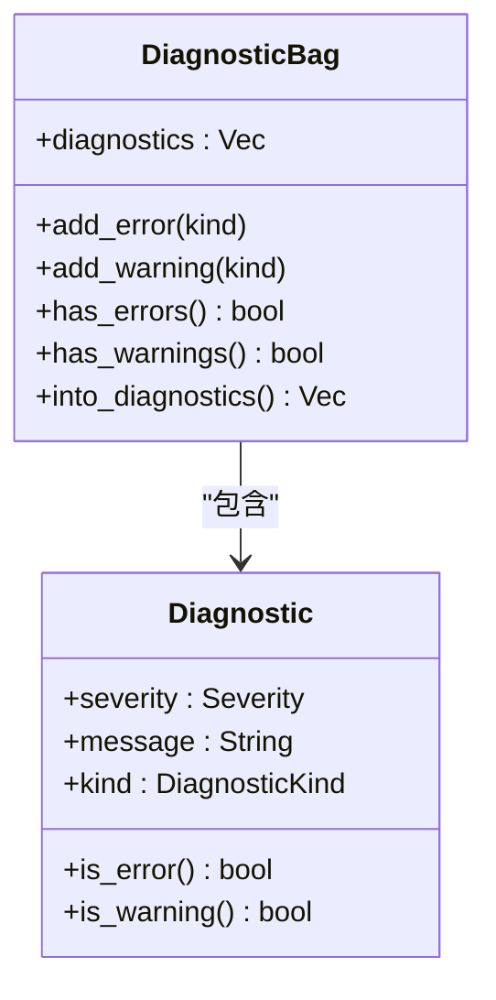

图示来源
- [diagnostics.rs:18-291](file://crates/ruyic/src/typechecker/diagnostics.rs#L18-L291)

章节来源
- [diagnostics.rs:18-291](file://crates/ruyic/src/typechecker/diagnostics.rs#L18-L291)

### ARC 类型支持
- 扫描程序中的 @arc 类注解，记录类名集合。
- 提供 is_arc_class/is_arc_type 判断，便于后续类型规则扩展。

章节来源
- [arc.rs:15-74](file://crates/ruyic/src/typechecker/arc.rs#L15-L74)

### 错误类型（兼容层）
- 传统错误枚举，保留兼容路径。

章节来源
- [error.rs:3-16](file://crates/ruyic/src/typechecker/error.rs#L3-L16)

## 依赖关系分析
- 模块内聚：TypeInference 依赖 Environment/Types/Constraints/Generics/Traits/Diagnostics；TypeChecker 依赖 TraitRegistry 与 TypeInference。
- 外部耦合：与解析器 AST 的类型注解、属性名、模式等交互；与代码生成器的单态化产物对接。
- 循环依赖：当前设计通过 TraitRegistry 的延迟验证与 MonomorphizationTracker 的替换应用避免直接循环。

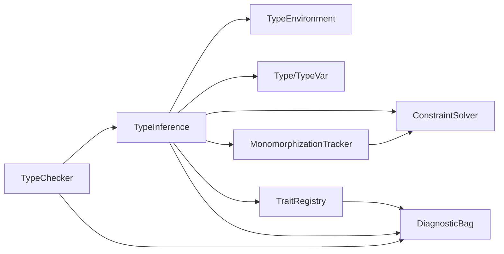

图示来源
- [checker.rs:57-83](file://crates/ruyic/src/typechecker/checker.rs#L57-L83)
- [inference.rs:105-164](file://crates/ruyic/src/typechecker/inference.rs#L105-L164)

章节来源
- [checker.rs:57-83](file://crates/ruyic/src/typechecker/checker.rs#L57-L83)
- [inference.rs:105-164](file://crates/ruyic/src/typechecker/inference.rs#L105-L164)

## 性能考虑
- 约束求解
  - 合一算法采用深度优先与出现检查，避免无限类型与栈溢出。
  - 对类型树递归应用替换时使用哈希集避免循环展开。
- 类型环境
  - 作用域链采用 Vec 存储，查找按逆序搜索，平均 O(k)（k 为作用域深度）。
  - 类型窄化通过阴影绑定避免复制父作用域状态。
- 泛型单态化
  - 以“名称+类型参数”拼接的唯一标识作为特化键，实现去重与复用。
  - 仅在首次遇到组合时生成特化，后续调用复用已有版本。
- 模式分析
  - 覆盖集合使用 HashSet，缺失用例按类型分支快速计算，避免全量穷举。
- 诊断系统
  - 诊断聚合在内存中累积，最终一次性导出，减少频繁分配。

[本节为通用性能建议，无需特定文件引用]

## 故障排查指南
- 类型不匹配
  - 现象：TypeMismatch 诊断，显示期望与实际类型。
  - 排查：检查表达式合成/校验路径、函数返回类型、控制流窄化是否正确。
- 未知变量
  - 现象：UnknownVariable 诊断。
  - 排查：确认变量声明位置与作用域、拼写与导入。
- 不可变赋值
  - 现象：ImmutableAssign 诊断。
  - 排查：const 声明与 let 声明的区别、作用域内是否被重新赋值。
- 可空访问
  - 现象：NullableAccess/UnsafeNullableAccess 诊断。
  - 排查：在访问前进行 null 检查或使用可选链。
- 特性未实现
  - 现象：TraitNotImplemented 诊断。
  - 排查：确认类型是否满足特性边界、实现是否完整。
- 泛型 arity 不匹配
  - 现象：GenericArity 诊断。
  - 排查：核对类型实参数量与定义一致。
- 模式穷举/冗余
  - 现象：NonExhaustiveMatch/RedundantPattern 诊断。
  - 排查：补充缺失用例或移除冗余分支。

章节来源
- [diagnostics.rs:28-98](file://crates/ruyic/src/typechecker/diagnostics.rs#L28-L98)
- [inference.rs:464-726](file://crates/ruyic/src/typechecker/inference.rs#L464-L726)
- [patterns.rs:21-59](file://crates/ruyic/src/typechecker/patterns.rs#L21-L59)

## 结论
Ruyi 类型检查器以渐进式类型系统为核心，结合双向类型推断、约束求解与泛型单态化，实现了从动态到静态的平滑过渡。类型环境与模式分析保障了类型安全与代码质量，诊断系统提供了清晰的错误定位与友好提示。整体架构模块化、职责清晰，具备良好的扩展性与可维护性。

[本节为总结性内容，无需特定文件引用]

## 附录

### 复杂类型场景与边界情况示例
- 渐进式类型与动态类型
  - 示例：动态赋值与运行时行为演示。
  - 参考：[type_system.ry:23-29](file://examples/type_system.ry#L23-L29)
- 可空类型与类型窄化
  - 示例：可空字段、null 检查后窄化、可选链模拟。
  - 参考：[type_system.ry:58-97](file://examples/type_system.ry#L58-L97)
- 函数类型与结构化子类型
  - 示例：函数类型标注、对象结构化子类型。
  - 参考：[type_system.ry:109-136](file://examples/type_system.ry#L109-L136)
- 泛型函数与 Option 类
  - 示例：泛型函数、Option 类的 isSome/isNone/map/getOrElse。
  - 参考：[generics_comprehensive.ry:12-90](file://examples/generics_comprehensive.ry#L12-L90)
- 模式匹配穷举性
  - 示例：布尔/对象/数组模式覆盖与缺失用例。
  - 参考：[patterns.rs:322-453](file://crates/ruyic/src/typechecker/patterns.rs#L322-L453)

### 关键 API 与数据结构路径
- 类型检查入口与结果
  - [TypeChecker::check:57-83](file://crates/ruyic/src/typechecker/checker.rs#L57-L83)
  - [TypeCheckResult:19-39](file://crates/ruyic/src/typechecker/checker.rs#L19-L39)
- 推断引擎
  - [TypeInference::infer_program:105-164](file://crates/ruyic/src/typechecker/inference.rs#L105-L164)
  - [TypeInference::synthesize:728-800](file://crates/ruyic/src/typechecker/inference.rs#L728-L800)
- 类型环境
  - [TypeEnvironment::narrow:115-132](file://crates/ruyic/src/typechecker/environment.rs#L115-L132)
- 类型表示
  - [Type::least_upper_bound:311-383](file://crates/ruyic/src/typechecker/types.rs#L311-L383)
- 约束求解
  - [ConstraintSolver::solve:67-83](file://crates/ruyic/src/typechecker/constraints.rs#L67-L83)
  - [unify:177-274](file://crates/ruyic/src/typechecker/constraints.rs#L177-L274)
- 泛型与单态化
  - [MonomorphizationTracker::infer_type_args:266-370](file://crates/ruyic/src/typechecker/generics.rs#L266-L370)
  - [MonomorphizationTracker::specialize:222-264](file://crates/ruyic/src/typechecker/generics.rs#L222-L264)
- 模式分析
  - [analyze_patterns:21-59](file://crates/ruyic/src/typechecker/patterns.rs#L21-L59)
- 特性系统
  - [TraitRegistry::validate_impls:212-234](file://crates/ruyic/src/typechecker/traits.rs#L212-L234)
- 诊断系统
  - [DiagnosticKind::TypeMismatch:29-32](file://crates/ruyic/src/typechecker/diagnostics.rs#L29-L32)
  - [DiagnosticBag::add_error:260-262](file://crates/ruyic/src/typechecker/diagnostics.rs#L260-L262)