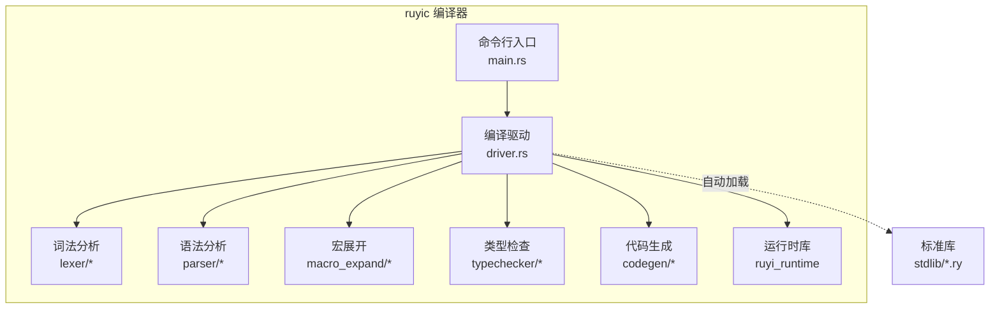
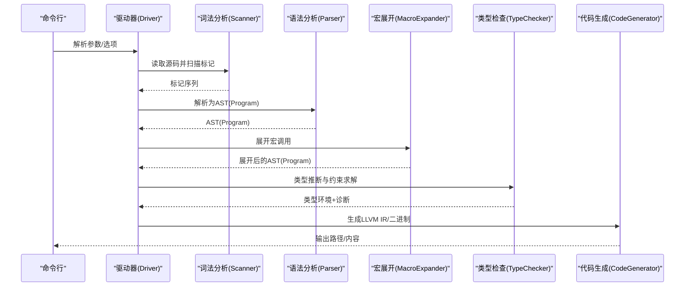
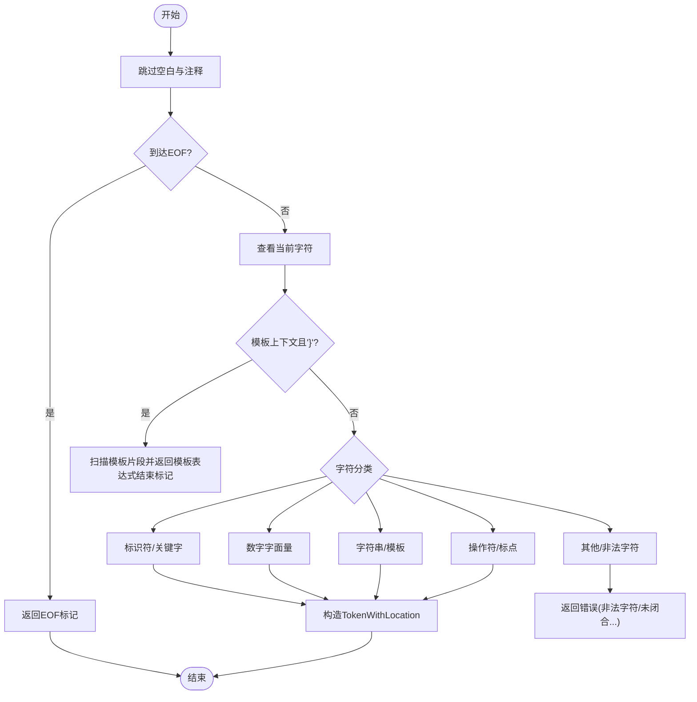
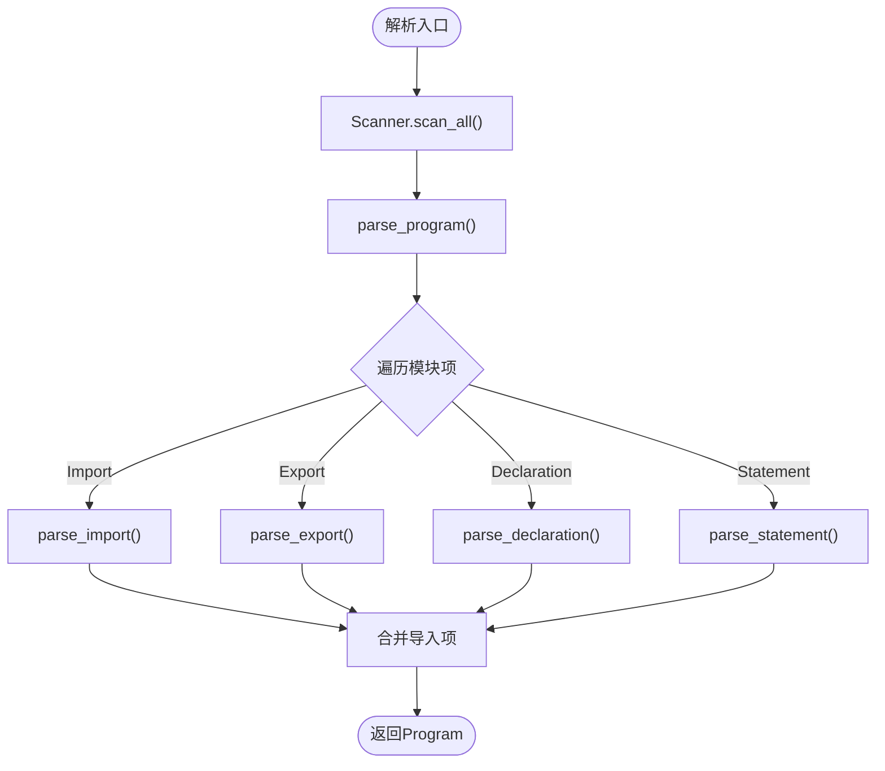
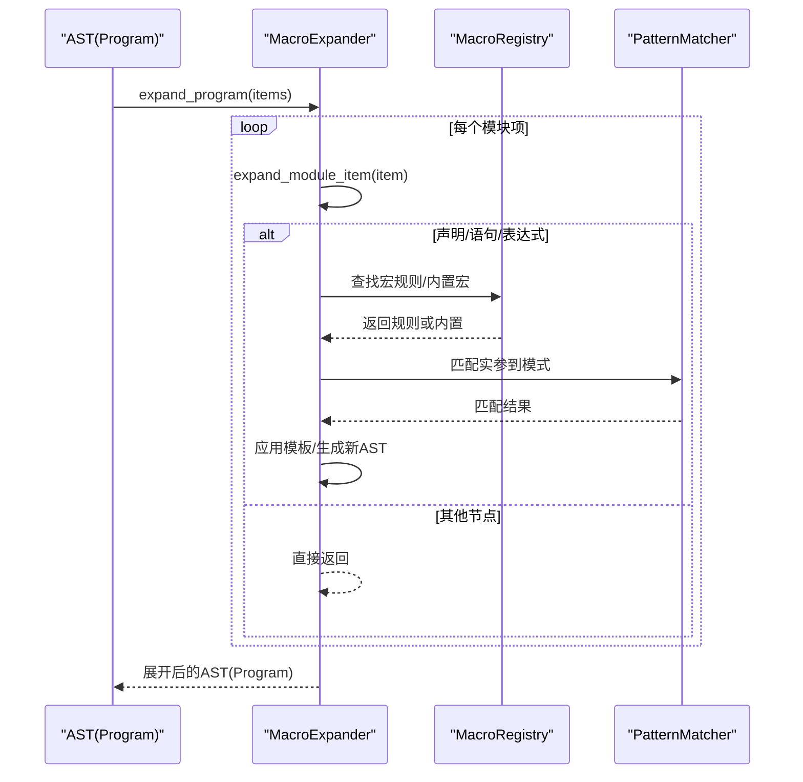
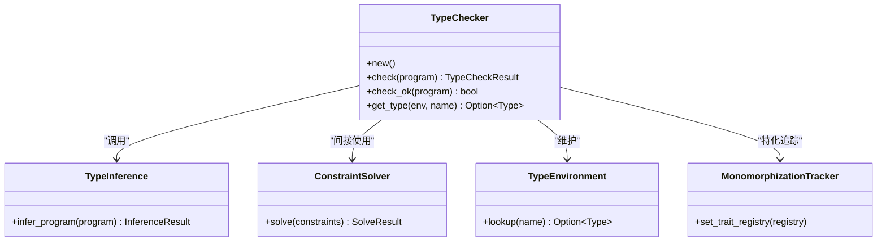
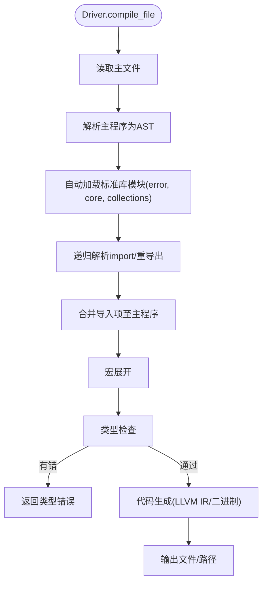
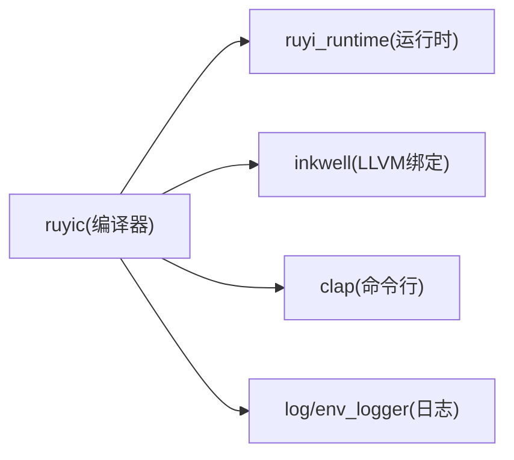

# 编译器架构

<cite>
**本文档引用的文件**
- [crates/ruyic/src/lib.rs](file://crates/ruyic/src/lib.rs)
- [crates/ruyic/src/main.rs](file://crates/ruyic/src/main.rs)
- [crates/ruyic/src/driver.rs](file://crates/ruyic/src/driver.rs)
- [crates/ruyic/src/lexer/mod.rs](file://crates/ruyic/src/lexer/mod.rs)
- [crates/ruyic/src/lexer/scanner.rs](file://crates/ruyic/src/lexer/scanner.rs)
- [crates/ruyic/src/parser/mod.rs](file://crates/ruyic/src/parser/mod.rs)
- [crates/ruyic/src/parser/parser.rs](file://crates/ruyic/src/parser/parser.rs)
- [crates/ruyic/src/parser/ast.rs](file://crates/ruyic/src/parser/ast.rs)
- [crates/ruyic/src/macro_expand/mod.rs](file://crates/ruyic/src/macro_expand/mod.rs)
- [crates/ruyic/src/macro_expand/expand.rs](file://crates/ruyic/src/macro_expand/expand.rs)
- [crates/ruyic/src/typechecker/mod.rs](file://crates/ruyic/src/typechecker/mod.rs)
- [crates/ruyic/src/typechecker/checker.rs](file://crates/ruyic/src/typechecker/checker.rs)
- [crates/ruyic/src/typechecker/types.rs](file://crates/ruyic/src/typechecker/types.rs)
- [crates/ruyic/src/codegen/mod.rs](file://crates/ruyic/src/codegen/mod.rs)
- [crates/ruyic/Cargo.toml](file://crates/ruyic/Cargo.toml)
</cite>

## 目录
1. [简介](#简介)
2. [项目结构](#项目结构)
3. [核心组件](#核心组件)
4. [架构总览](#架构总览)
5. [详细组件分析](#详细组件分析)
6. [依赖分析](#依赖分析)
7. [性能考虑](#性能考虑)
8. [故障排查指南](#故障排查指南)
9. [结论](#结论)
10. [附录](#附录)

## 简介
本文件系统性梳理 Ruyi 编译器的架构与实现，覆盖从源码到 LLVM IR 的完整编译流水线。整体采用“前端-中间层-后端”的分层设计：
- 前端：词法分析（Scanner）、语法分析（Parser）与模块导入解析。
- 中间层：宏展开（Macro Expand）、类型检查（Type Checker）与渐进式类型推断。
- 后端：代码生成（Code Generator）与 LLVM IR 输出/链接。

编译器通过驱动器（Driver）协调各阶段，并支持多种输出模式（AST、Typed AST、LLVM IR、原生二进制），同时内置标准库自动加载与模块解析能力。

## 项目结构
仓库采用按功能域组织的多 crate 结构，其中 ruyic 为主要编译器入口，ruyi_runtime 提供运行时支持。关键目录与模块如下：
- ruyic 源码：包含词法、语法、宏、类型检查、诊断、代码生成等子模块。
- 标准库：stdlib 目录提供内置模块（如 error、core、collections）。
- 示例与测试：examples、test、crates/ruyic/tests 集成用例与单元测试。

图示来源
- [crates/ruyic/src/main.rs:1-114](file://crates/ruyic/src/main.rs#L1-L114)
- [crates/ruyic/src/driver.rs:1-744](file://crates/ruyic/src/driver.rs#L1-L744)
- [crates/ruyic/src/lexer/mod.rs:1-8](file://crates/ruyic/src/lexer/mod.rs#L1-L8)
- [crates/ruyic/src/parser/mod.rs:1-8](file://crates/ruyic/src/parser/mod.rs#L1-L8)
- [crates/ruyic/src/macro_expand/mod.rs:1-161](file://crates/ruyic/src/macro_expand/mod.rs#L1-L161)
- [crates/ruyic/src/typechecker/mod.rs:1-32](file://crates/ruyic/src/typechecker/mod.rs#L1-L32)
- [crates/ruyic/src/codegen/mod.rs:1-15](file://crates/ruyic/src/codegen/mod.rs#L1-L15)

章节来源
- [crates/ruyic/src/main.rs:1-114](file://crates/ruyic/src/main.rs#L1-L114)
- [crates/ruyic/src/driver.rs:1-744](file://crates/ruyic/src/driver.rs#L1-L744)

## 核心组件
- 词法分析器（Scanner）：负责字符流扫描、标记识别、注释与字符串转义处理、数字字面量解析与错误报告。
- 语法分析器（Parser）：基于 Scanner 产出的标记序列，构建 AST（Program、ModuleItem、Declaration、Statement、Expr 等）。
- 宏展开器（MacroExpander）：在 AST 层对宏调用进行匹配与替换，支持规则匹配、捕获与模板生成。
- 类型检查器（TypeChecker）：执行双向类型推断、约束求解、泛型特化跟踪与诊断收集。
- 代码生成器（CodeGenerator）：将类型化的 IR 转换为 LLVM IR，并可进一步编译为原生二进制。
- 驱动器（Driver）：串联上述组件，管理模块解析、标准库自动加载、优化级别与输出控制。

章节来源
- [crates/ruyic/src/lexer/scanner.rs:1-857](file://crates/ruyic/src/lexer/scanner.rs#L1-L857)
- [crates/ruyic/src/parser/parser.rs:1-800](file://crates/ruyic/src/parser/parser.rs#L1-L800)
- [crates/ruyic/src/macro_expand/expand.rs:1-662](file://crates/ruyic/src/macro_expand/expand.rs#L1-L662)
- [crates/ruyic/src/typechecker/checker.rs:1-295](file://crates/ruyic/src/typechecker/checker.rs#L1-L295)
- [crates/ruyic/src/codegen/mod.rs:1-15](file://crates/ruyic/src/codegen/mod.rs#L1-L15)
- [crates/ruyic/src/driver.rs:1-744](file://crates/ruyic/src/driver.rs#L1-L744)

## 架构总览
编译器遵循“源码 → 标记 → AST → 展开 → 类型检查 → 代码生成 → 输出”的流水线。驱动器负责模块解析与流程编排；类型检查结果作为后续代码生成的输入；最终根据 EmitType 输出 AST、Typed AST、LLVM IR 或原生二进制。

图示来源
- [crates/ruyic/src/driver.rs:522-632](file://crates/ruyic/src/driver.rs#L522-L632)
- [crates/ruyic/src/lexer/scanner.rs:25-324](file://crates/ruyic/src/lexer/scanner.rs#L25-L324)
- [crates/ruyic/src/parser/parser.rs:12-22](file://crates/ruyic/src/parser/parser.rs#L12-L22)
- [crates/ruyic/src/macro_expand/expand.rs:23-34](file://crates/ruyic/src/macro_expand/expand.rs#L23-L34)
- [crates/ruyic/src/typechecker/checker.rs:58-83](file://crates/ruyic/src/typechecker/checker.rs#L58-L83)
- [crates/ruyic/src/codegen/mod.rs:1-15](file://crates/ruyic/src/codegen/mod.rs#L1-L15)

## 详细组件分析

### 词法分析器（Scanner）
- 设计要点
  - 维护位置信息（行、列）与模板上下文状态，确保模板表达式边界正确。
  - 支持关键字识别、标识符扫描、数字字面量（十进制、十六进制、八进制、二进制、浮点、大整数）、字符串与转义序列处理。
  - 注释处理：单行注释与块注释，支持未闭合注释错误。
  - 错误恢复：遇到无效字符、未闭合字符串或非法转义时返回具体错误位置。
- 关键流程
  - next_token：推进状态机，识别各类 Token 并记录起止位置。
  - scan_all：批量扫描直至 EOF。
  - 数字扫描：分别处理不同进制与小数/指数形式，必要时返回解析失败。
  - 字符串扫描：处理转义序列与换行终止条件，支持未闭合字符串错误。
- 复杂度
  - 时间复杂度：O(n)，n 为源码长度。
  - 空间复杂度：O(n)，用于存储标记序列。

图示来源
- [crates/ruyic/src/lexer/scanner.rs:25-420](file://crates/ruyic/src/lexer/scanner.rs#L25-L420)

章节来源
- [crates/ruyic/src/lexer/mod.rs:1-8](file://crates/ruyic/src/lexer/mod.rs#L1-L8)
- [crates/ruyic/src/lexer/scanner.rs:1-857](file://crates/ruyic/src/lexer/scanner.rs#L1-L857)

### 语法分析器（Parser）
- 设计要点
  - 基于 Scanner 的标记流进行递归下降解析，构建 AST。
  - 支持模块项（Import/Export/Declaration/Statement）、声明（函数、类、trait、impl、类型别名、宏）、语句（块、if/else、while、for、try/catch/finally、match、return/throw 等）与表达式（二元/一元/赋值/调用/成员/箭头函数/函数字面量/类字面量/条件/序列/空断言/空合并等）。
  - 导入/导出语法解析与命名空间、重导出处理。
- 关键流程
  - new：初始化 Scanner 并一次性扫描所有标记。
  - parse：解析 Program，逐项解析模块项。
  - parse_declaration/parse_statement/parse_expression：按语法规则递归下降。
  - 错误处理：统一包装为 ParseError，包含期望标记、实际标记与行列位置。
- 复杂度
  - 时间复杂度：O(n)，n 为标记数量。
  - 空间复杂度：O(n)，递归深度与 AST 存储。

图示来源
- [crates/ruyic/src/parser/parser.rs:12-196](file://crates/ruyic/src/parser/parser.rs#L12-L196)
- [crates/ruyic/src/parser/ast.rs:13-533](file://crates/ruyic/src/parser/ast.rs#L13-L533)

章节来源
- [crates/ruyic/src/parser/mod.rs:1-8](file://crates/ruyic/src/parser/mod.rs#L1-L8)
- [crates/ruyic/src/parser/parser.rs:1-800](file://crates/ruyic/src/parser/parser.rs#L1-L800)
- [crates/ruyic/src/parser/ast.rs:1-533](file://crates/ruyic/src/parser/ast.rs#L1-L533)

### 宏展开器（MacroExpander）
- 设计要点
  - 在 AST 层进行宏展开，支持用户自定义宏规则与内置宏。
  - 规则匹配：将调用实参转换为 Token 序列，使用 PatternMatcher 进行匹配，成功后应用模板生成新的 Token 序列。
  - 卫生上下文：避免捕获自由变量，防止名称冲突。
  - 递归展开：限制最大展开深度，防止无限展开。
- 关键流程
  - expand_program：遍历模块项，递归展开声明与语句中的宏调用。
  - expand_macro_call：将实参转为 Token，选择规则或内置宏，应用模板并回写为新的 AST 片段。
  - 错误处理：无匹配规则、重复不匹配、深度超限、卫生违规、嵌套宏定义等。
- 复杂度
  - 时间复杂度：受宏规则匹配与展开次数影响，通常近似 O(n)。
  - 空间复杂度：与展开后 AST 成长规模相关。

图示来源
- [crates/ruyic/src/macro_expand/expand.rs:23-393](file://crates/ruyic/src/macro_expand/expand.rs#L23-L393)
- [crates/ruyic/src/macro_expand/mod.rs:107-161](file://crates/ruyic/src/macro_expand/mod.rs#L107-L161)

章节来源
- [crates/ruyic/src/macro_expand/mod.rs:1-161](file://crates/ruyic/src/macro_expand/mod.rs#L1-L161)
- [crates/ruyic/src/macro_expand/expand.rs:1-662](file://crates/ruyic/src/macro_expand/expand.rs#L1-L662)

### 类型检查器（TypeChecker）
- 设计要点
  - 渐进式类型系统：支持静态类型与动态类型共存（dyn），双向推断（合成/校验），类型窄化（null 安全），约束求解与泛型特化。
  - 核心组成：TypeInference（推断与约束生成）、ConstraintSolver（求解）、TypeEnvironment（类型环境）、MonomorphizationTracker（特化追踪）。
  - 诊断收集：统一的 DiagnosticBag，区分错误与警告。
- 关键流程
  - check：构建 trait 注册表，执行推断，收集诊断，验证 trait 实现与超 trait。
  - get_type：查询变量类型（需在类型检查完成后）。
- 复杂度
  - 推断与求解复杂度取决于程序规模与约束数量，典型为多项式时间。

图示来源
- [crates/ruyic/src/typechecker/checker.rs:41-95](file://crates/ruyic/src/typechecker/checker.rs#L41-L95)
- [crates/ruyic/src/typechecker/types.rs:14-711](file://crates/ruyic/src/typechecker/types.rs#L14-L711)

章节来源
- [crates/ruyic/src/typechecker/mod.rs:1-32](file://crates/ruyic/src/typechecker/mod.rs#L1-L32)
- [crates/ruyic/src/typechecker/checker.rs:1-295](file://crates/ruyic/src/typechecker/checker.rs#L1-L295)
- [crates/ruyic/src/typechecker/types.rs:1-711](file://crates/ruyic/src/typechecker/types.rs#L1-L711)

### 代码生成器（CodeGenerator）
- 设计要点
  - 使用 Inkwell（LLVM Rust 绑定）生成 LLVM IR。
  - 支持函数、表达式、语句、模式匹配、异步/协程、ARC 运行时操作等的代码生成。
  - 可配置优化级别（O0/O1/O2），支持直接输出 LLVM IR 或编译为原生二进制。
- 关键流程
  - generate_with_env：以类型环境与特化追踪为输入，生成 LLVM IR。
  - write_llvm_ir/print_to_string：输出 LLVM IR 文本。
  - compile_to_binary_with_opt：调用 LLVM 编译器链生成目标二进制。
- 复杂度
  - 与 AST 节点数量线性相关，常数因子受优化级别影响。

章节来源
- [crates/ruyic/src/codegen/mod.rs:1-15](file://crates/ruyic/src/codegen/mod.rs#L1-L15)
- [crates/ruyic/src/driver.rs:570-631](file://crates/ruyic/src/driver.rs#L570-L631)

### 驱动器（Driver）与模块解析
- 设计要点
  - 统一编译入口：解析命令行参数，构建 CompileOptions，协调各阶段。
  - 模块解析：支持相对路径、绝对路径、RUYI_HOME/stdlib、搜索路径与本地 stdlib 目录；自动加载 error、core、collections 等基础模块。
  - 输出控制：根据 EmitType 输出 AST、Typed AST、LLVM IR 或原生二进制；支持优化级别与目标三元组。
- 关键流程
  - compile_file/compile_source：读取源码，解析模块，执行完整流水线。
  - resolve_modules/auto_load_stdlib/resolve_imports：递归解析导入与重导出，合并命名空间与别名。
  - compile_program：按阶段执行（Lex→Parse→Macro→TypeCheck→CodeGen→Output）。
- 错误处理
  - 将底层错误映射为统一的 CompileError，包含 IO、Lexer、Parser、Macro、TypeCheck、Codegen、Linker、ModuleNotFound 等。

图示来源
- [crates/ruyic/src/driver.rs:258-329](file://crates/ruyic/src/driver.rs#L258-L329)
- [crates/ruyic/src/driver.rs:522-632](file://crates/ruyic/src/driver.rs#L522-L632)

章节来源
- [crates/ruyic/src/driver.rs:1-744](file://crates/ruyic/src/driver.rs#L1-L744)

## 依赖分析
- 内部依赖
  - ruyic 依赖 ruyi_runtime 提供运行时支持。
  - 各子模块内部通过 mod.rs 暴露公共 API，形成清晰的接口边界。
- 外部依赖
  - Inkwell：LLVM Rust 绑定，用于 IR 生成与编译。
  - Clap：命令行参数解析。
  - log/env_logger：日志框架。
- 依赖关系可视化

图示来源
- [crates/ruyic/Cargo.toml:19-26](file://crates/ruyic/Cargo.toml#L19-L26)

章节来源
- [crates/ruyic/Cargo.toml:1-26](file://crates/ruyic/Cargo.toml#L1-L26)

## 性能考虑
- 词法/语法阶段
  - 单次扫描与递归下降解析，时间复杂度线性；注意避免不必要的回溯与重复扫描。
- 宏展开
  - 规则匹配与模板应用应尽量减少深拷贝；可考虑延迟求值与共享结构。
- 类型检查
  - 约束求解与泛型特化可能带来额外开销，建议缓存中间结果与增量更新。
- 代码生成
  - 优化级别越高，生成 IR 越复杂；可根据目标场景选择合适的 OptLevel。
- I/O 与模块解析
  - 多模块加载与文件系统访问是瓶颈之一，建议缓存已解析模块与路径解析结果。

## 故障排查指南
- 常见错误类型
  - 词法错误：非法字符、未闭合字符串/注释、非法转义。
  - 语法错误：缺少分号、括号不匹配、意外 EOF。
  - 宏错误：无匹配规则、重复不匹配、展开深度超限、卫生违规、嵌套宏定义。
  - 类型错误：不兼容类型、未满足 trait 约束、泛型参数不一致。
  - 代码生成/链接错误：运行时库未构建、LLVM 编译失败。
- 定位方法
  - 使用 --emit-llvm/--emit-ast/--emit-typed-ast 查看中间产物定位问题。
  - 使用 --check 仅进行类型检查快速验证。
  - 检查 RUYI_HOME 与 stdlib 路径是否正确。
- 建议
  - 优先修复早期阶段错误，避免级联错误。
  - 对复杂宏与类型问题，拆分为最小可复现样例。

章节来源
- [crates/ruyic/src/driver.rs:21-54](file://crates/ruyic/src/driver.rs#L21-L54)
- [crates/ruyic/src/lexer/scanner.rs:38-420](file://crates/ruyic/src/lexer/scanner.rs#L38-L420)
- [crates/ruyic/src/macro_expand/mod.rs:12-94](file://crates/ruyic/src/macro_expand/mod.rs#L12-L94)
- [crates/ruyic/src/typechecker/checker.rs:18-39](file://crates/ruyic/src/typechecker/checker.rs#L18-L39)

## 结论
Ruyi 编译器采用清晰的分层架构与模块化设计，从前端词法/语法分析到中间层宏展开与类型检查，再到后端 LLVM IR 生成与输出，形成了完整的编译流水线。通过驱动器统一编排与模块解析，编译器具备良好的扩展性与可维护性。未来可在宏规则缓存、类型约束求解优化与并行化等方面进一步提升性能。

## 附录
- 命令行选项概览
  - 输入/输出：--input、--output
  - 优化级别：-O0/-O1/-O2
  - 目标三元组：--target
  - 输出模式：--emit-llvm、--emit-ast、--emit-typed-ast、--check
- 标准库模块
  - 自动加载：error、core、collections
  - 可通过 RUYI_HOME/stdlib 或本地 stdlib 目录解析

章节来源
- [crates/ruyic/src/main.rs:16-44](file://crates/ruyic/src/main.rs#L16-L44)
- [crates/ruyic/src/driver.rs:331-354](file://crates/ruyic/src/driver.rs#L331-L354)