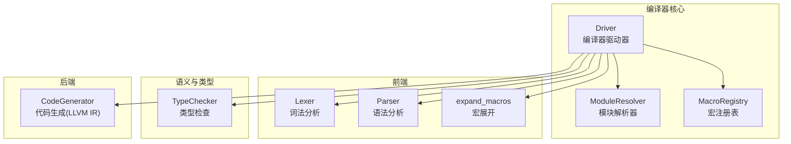
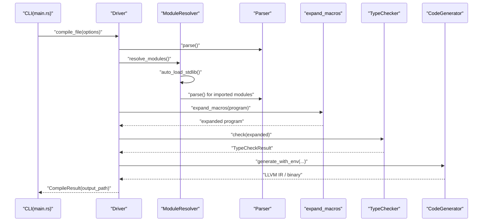
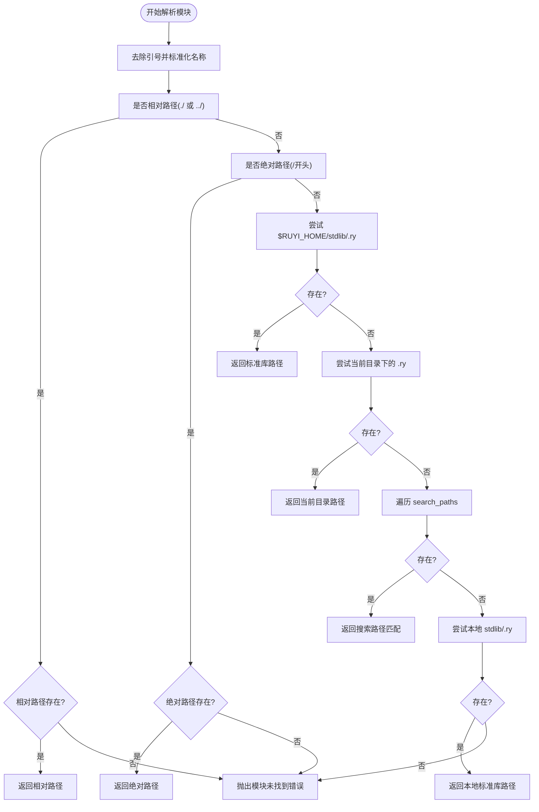
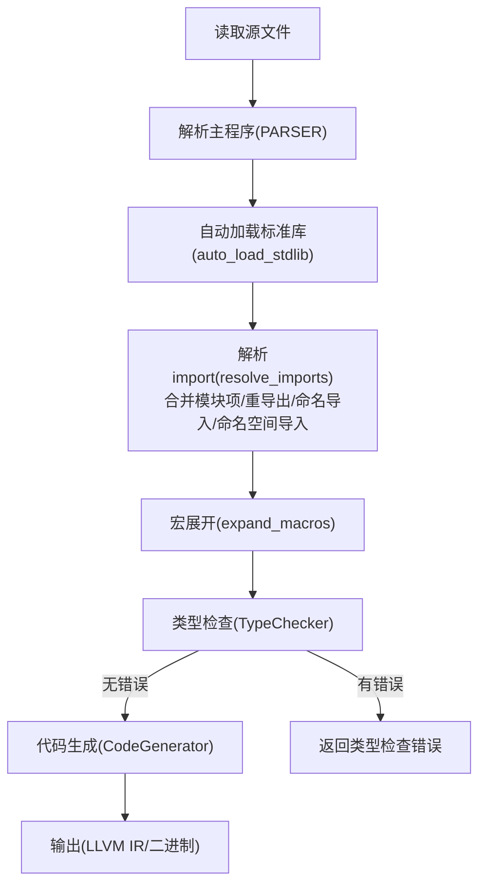
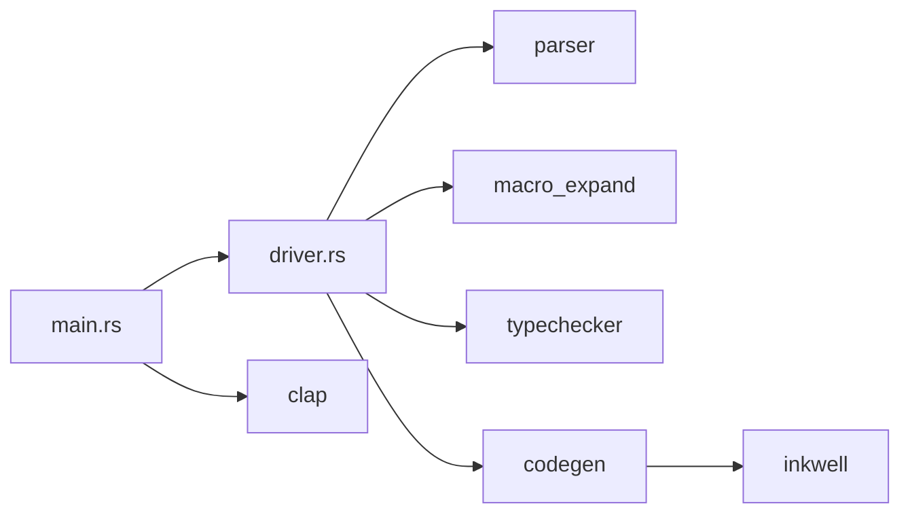

# 编译器驱动器

<cite>
**本文引用的文件**
- [driver.rs](file://crates/ruyic/src/driver.rs)
- [main.rs](file://crates/ruyic/src/main.rs)
- [lib.rs](file://crates/ruyic/src/lib.rs)
- [mod.rs](file://crates/ruyic/src/macro_expand/mod.rs)
- [generator.rs](file://crates/ruyic/src/codegen/generator.rs)
- [checker.rs](file://crates/ruyic/src/typechecker/checker.rs)
- [Cargo.toml](file://Cargo.toml)
- [hello.ry](file://examples/hello.ry)
- [control_flow.ry](file://examples/control_flow.ry)
- [run_examples.sh](file://examples/run_examples.sh)
</cite>

## 目录
1. [引言](#引言)
2. [项目结构](#项目结构)
3. [核心组件](#核心组件)
4. [架构总览](#架构总览)
5. [详细组件分析](#详细组件分析)
6. [依赖分析](#依赖分析)
7. [性能考虑](#性能考虑)
8. [故障排查指南](#故障排查指南)
9. [结论](#结论)
10. [附录](#附录)

## 引言
本文件面向Ruyi编译器驱动器（Compiler Driver），系统性阐述其职责、架构与实现细节。重点覆盖以下主题：
- 编译流水线的协调与管理：从源码到二进制的完整流程
- 编译选项（CompileOptions）的配置：输出类型（EmitType）、优化级别（OptLevel）、目标平台设置等
- 模块解析器（ModuleResolver）工作机制：模块路径解析、搜索路径管理、标准库自动加载
- 错误处理系统：错误类型定义与错误信息格式化
- 编译流程各阶段的调用顺序与数据传递
- 驱动器与其他组件的交互关系与使用示例

## 项目结构
Ruyi编译器位于crates/ruyic中，采用模块化分层设计：
- 驱动器（driver）：编排整个编译流水线，负责模块解析、宏展开、类型检查、代码生成与链接
- 词法/语法/语义：lexer、parser、typechecker
- 宏扩展：macro_expand
- 代码生成：codegen（基于LLVM IR）
- 诊断：diagnostics
- CLI入口：main.rs

图表来源
- [driver.rs:242-248](file://crates/ruyic/src/driver.rs#L242-L248)
- [mod.rs:107-146](file://crates/ruyic/src/macro_expand/mod.rs#L107-L146)
- [generator.rs:1-200](file://crates/ruyic/src/codegen/generator.rs#L1-L200)
- [checker.rs:41-95](file://crates/ruyic/src/typechecker/checker.rs#L41-L95)

章节来源
- [driver.rs:1-744](file://crates/ruyic/src/driver.rs#L1-L744)
- [main.rs:1-114](file://crates/ruyic/src/main.rs#L1-L114)

## 核心组件
- 编译器驱动器（Driver）：协调编译流水线，封装模块解析、宏展开、类型检查、代码生成与输出
- 编译选项（CompileOptions）：控制输出类型、优化级别、目标三元组、输入/输出路径与搜索路径
- 模块解析器（ModuleResolver）：解析import路径，支持相对路径、绝对路径、标准库路径与搜索路径
- 宏注册表（MacroRegistry）：内置宏与用户宏规则的注册与查找
- 类型检查器（TypeChecker）：类型推断、约束求解与诊断收集
- 代码生成器（CodeGenerator）：将AST转换为LLVM IR并编译为本地二进制

章节来源
- [driver.rs:86-138](file://crates/ruyic/src/driver.rs#L86-L138)
- [driver.rs:149-240](file://crates/ruyic/src/driver.rs#L149-L240)
- [driver.rs:242-248](file://crates/ruyic/src/driver.rs#L242-L248)
- [mod.rs:107-146](file://crates/ruyic/src/macro_expand/mod.rs#L107-L146)
- [checker.rs:18-25](file://crates/ruyic/src/typechecker/checker.rs#L18-L25)
- [generator.rs:22-28](file://crates/ruyic/src/codegen/generator.rs#L22-L28)

## 架构总览
编译器驱动器以“驱动”为核心，串联前端、语义与后端组件，形成完整的编译流水线。

图表来源
- [main.rs:46-113](file://crates/ruyic/src/main.rs#L46-L113)
- [driver.rs:258-280](file://crates/ruyic/src/driver.rs#L258-L280)
- [driver.rs:302-329](file://crates/ruyic/src/driver.rs#L302-L329)
- [driver.rs:521-632](file://crates/ruyic/src/driver.rs#L521-L632)
- [mod.rs:157-160](file://crates/ruyic/src/macro_expand/mod.rs#L157-L160)
- [checker.rs:57-83](file://crates/ruyic/src/typechecker/checker.rs#L57-L83)
- [generator.rs:1-200](file://crates/ruyic/src/codegen/generator.rs#L1-L200)

## 详细组件分析

### 编译选项（CompileOptions）与优化级别（OptLevel）
- 输出类型（EmitType）：支持原生二进制、LLVM IR、AST、带类型信息的AST、仅类型检查
- 优化级别（OptLevel）：O0/O1/O2映射至LLVM优化等级
- 目标三元组（target）：用于代码生成的目标平台描述
- 输入/输出路径：输入文件路径用于错误定位与默认输出命名；输出路径可显式指定
- 搜索路径（search_paths）：扩展模块解析范围

章节来源
- [driver.rs:86-138](file://crates/ruyic/src/driver.rs#L86-L138)
- [generator.rs:22-28](file://crates/ruyic/src/codegen/generator.rs#L22-L28)
- [main.rs:79-86](file://crates/ruyic/src/main.rs#L79-L86)

### 模块解析器（ModuleResolver）工作原理
- 路径解析优先级：
  1) 相对路径（./ 或 ../）：相对于导入文件所在目录解析
  2) 绝对路径（以/开头）：直接检查是否存在
  3) 标准库路径：优先从$RUYI_HOME/stdlib解析
  4) 当前目录下的同名文件
  5) 搜索路径（search_paths）中的候选
  6) 开发回退：当前目录下stdlib/子目录
- 已加载模块缓存：避免重复解析与循环导入
- 标准库自动加载：启动时自动加载error、core、collections等常用模块，并递归解析其导入

图表来源
- [driver.rs:173-234](file://crates/ruyic/src/driver.rs#L173-L234)

章节来源
- [driver.rs:149-240](file://crates/ruyic/src/driver.rs#L149-L240)
- [driver.rs:331-354](file://crates/ruyic/src/driver.rs#L331-L354)

### 编译错误处理系统
- 错误类型（CompileError）：涵盖IO、词法、语法、宏、类型检查、代码生成、链接、模块未找到等
- 宏错误（MacroError）：包含规则不匹配、重复模式不一致、展开深度超限、非法调用、卫生性违规、嵌套宏定义等
- 类型检查诊断（Diagnostic）：包含多种类型错误类别（如类型不匹配、未知变量、不可变赋值、可空访问、参数数量不符、泛型 arity 不符、模式匹配不穷尽等），并支持错误/警告/注释三种严重程度
- 错误信息格式化：统一实现Display，便于CLI与日志输出

章节来源
- [driver.rs:21-54](file://crates/ruyic/src/driver.rs#L21-L54)
- [mod.rs:12-94](file://crates/ruyic/src/macro_expand/mod.rs#L12-L94)
- [checker.rs:18-25](file://crates/ruyic/src/typechecker/checker.rs#L18-L25)

### 编译流程阶段与数据传递
- 阶段划分与顺序：
  1) 读取源文件
  2) 解析主程序（Parser）
  3) 自动加载标准库模块并解析其导入
  4) 递归解析所有import，合并模块项，处理重导出、命名导入别名与命名空间导入
  5) 宏展开（expand_macros）
  6) 类型检查（TypeChecker）
  7) 代码生成（CodeGenerator）
  8) 输出（写入LLVM IR或编译为二进制）
- 关键数据结构流转：
  - Program（AST）在各阶段间传递
  - TypeCheckResult（类型环境、诊断、单态化追踪）作为类型检查结果
  - CodeGenerator接收Program与TypeCheckResult，生成LLVM IR并编译

图表来源
- [driver.rs:258-280](file://crates/ruyic/src/driver.rs#L258-L280)
- [driver.rs:302-329](file://crates/ruyic/src/driver.rs#L302-L329)
- [driver.rs:356-512](file://crates/ruyic/src/driver.rs#L356-L512)
- [driver.rs:521-632](file://crates/ruyic/src/driver.rs#L521-L632)
- [mod.rs:157-160](file://crates/ruyic/src/macro_expand/mod.rs#L157-L160)
- [checker.rs:57-83](file://crates/ruyic/src/typechecker/checker.rs#L57-L83)
- [generator.rs:1-200](file://crates/ruyic/src/codegen/generator.rs#L1-L200)

章节来源
- [driver.rs:258-632](file://crates/ruyic/src/driver.rs#L258-L632)

### 代码生成与优化级别映射
- 优化级别映射：O0→None，O1→Less，O2→Aggressive
- 生成流程：创建LLVM上下文与模块，构建CodeGenerator，允许部分代码生成以兼容标准库中不完全受支持的特性，最终根据EmitType输出LLVM IR或编译为二进制

章节来源
- [generator.rs:22-28](file://crates/ruyic/src/codegen/generator.rs#L22-L28)
- [driver.rs:568-631](file://crates/ruyic/src/driver.rs#L568-L631)

### CLI与使用示例
- CLI参数映射到CompileOptions：emit类型（二进制/LLVM IR/AST/带类型AST/仅类型检查）、优化级别（0/1/2）、目标三元组、输出路径、输入路径
- 典型使用：
  - 编译为二进制：ruyic examples/hello.ry
  - 仅类型检查：ruyic examples/control_flow.ry --check
  - 生成LLVM IR：ruyic examples/hello.ry --emit-llvm
  - 指定优化级别：ruyic examples/hello.ry -O2
  - 指定目标三元组：ruyic examples/hello.ry --target x86_64-unknown-linux-gnu

章节来源
- [main.rs:16-113](file://crates/ruyic/src/main.rs#L16-L113)
- [hello.ry:1-2](file://examples/hello.ry#L1-L2)
- [control_flow.ry:1-160](file://examples/control_flow.ry#L1-L160)

## 依赖分析
- 内部依赖：
  - driver依赖parser、macro_expand、typechecker、codegen
  - main依赖driver与clap进行参数解析
- 外部依赖：
  - inkwell：LLVM绑定
  - clap：命令行参数解析
  - 标准库：std::fs、std::path、std::process等

图表来源
- [main.rs:10-14](file://crates/ruyic/src/main.rs#L10-L14)
- [driver.rs:13-19](file://crates/ruyic/src/driver.rs#L13-L19)
- [Cargo.toml:14-28](file://Cargo.toml#L14-L28)

章节来源
- [Cargo.toml:1-40](file://Cargo.toml#L1-L40)

## 性能考虑
- 优化级别：通过OptLevel映射到LLVM优化等级，影响代码生成阶段的性能与体积权衡
- 部分代码生成：允许在编译包含标准库的程序时放宽对某些不受支持模式的限制，提升整体编译鲁棒性
- IO与文件系统：模块解析与标准库加载涉及多次文件系统访问，建议合理组织项目结构与搜索路径，减少不必要的磁盘IO

## 故障排查指南
- 常见错误类型与定位：
  - 模块未找到：检查import路径、RUYI_HOME环境变量、搜索路径与标准库位置
  - 类型检查错误：查看Diagnostic输出，关注类型不匹配、未知变量、参数数量不符等
  - 宏展开错误：检查宏规则匹配、重复模式与展开深度
- 建议排查步骤：
  - 使用--check模式先进行类型检查
  - 使用--emit-typed-ast查看带类型信息的AST，辅助定位类型问题
  - 使用--emit-llvm查看中间IR，确认代码生成阶段是否正常
  - 在CI或批量测试场景中，结合examples/run_examples.sh进行回归验证

章节来源
- [driver.rs:21-54](file://crates/ruyic/src/driver.rs#L21-L54)
- [driver.rs:331-354](file://crates/ruyic/src/driver.rs#L331-L354)
- [checker.rs:18-25](file://crates/ruyic/src/typechecker/checker.rs#L18-L25)
- [mod.rs:12-94](file://crates/ruyic/src/macro_expand/mod.rs#L12-L94)
- [run_examples.sh:58-73](file://examples/run_examples.sh#L58-L73)

## 结论
Ruyi编译器驱动器以清晰的分层架构与严格的流水线管理，实现了从源码到可执行二进制的完整编译过程。通过灵活的编译选项、健壮的模块解析与标准库自动加载、完善的错误处理与诊断系统，以及与LLVM的紧密集成，驱动器为Ruyi语言提供了高效、可靠且可扩展的编译能力。建议在实际工程中结合CLI参数与测试脚本，持续验证编译质量与性能表现。

## 附录
- 示例与回归测试：
  - examples/hello.ry：最小可运行示例
  - examples/control_flow.ry：复杂控制流示例
  - examples/run_examples.sh：批量编译与输出对比脚本

章节来源
- [hello.ry:1-2](file://examples/hello.ry#L1-L2)
- [control_flow.ry:1-160](file://examples/control_flow.ry#L1-L160)
- [run_examples.sh:58-73](file://examples/run_examples.sh#L58-L73)